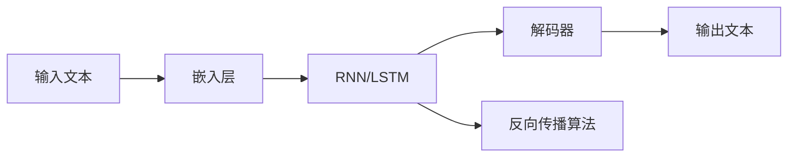

                 

# Python深度学习实践：基于深度学习的个性化聊天机器人

> 关键词：
1. 深度学习
2. 自然语言处理（NLP）
3. 序列生成
4. 个性化聊天机器人
5. 神经网络
6. 长短期记忆网络（LSTM）
7. 生成对抗网络（GAN）

## 1. 背景介绍

随着人工智能技术的快速发展，自然语言处理（NLP）领域取得了显著进展，其中基于深度学习的序列生成模型在聊天机器人等应用中表现出色。深度学习通过构建复杂的多层神经网络结构，可以从大规模语料中学习到语言模式和规律，生成自然流畅、符合语法规则的文本。基于这些模型，开发具有高度个性化、自然互动的聊天机器人成为可能。

本文旨在介绍如何利用深度学习技术，开发具有个性化的聊天机器人。我们将会深入探讨深度学习在聊天机器人中的应用，包括关键概念、核心算法以及具体的实现方法。通过这篇文章，读者将掌握如何利用Python和深度学习框架实现一个高效的、可扩展的个性化聊天机器人。

## 2. 核心概念与联系

### 2.1 核心概念概述

在深度学习的框架下，聊天机器人可以被看作是一个序列生成模型。序列生成模型是能够接收输入序列并输出相应输出序列的模型。在聊天机器人的场景中，输入序列是用户的话，输出序列是对用户回复的话。

聊天机器人主要由以下几个核心组件构成：

1. **嵌入层（Embedding Layer）**：将输入文本中的词向量映射到更高维的向量空间中，以便模型能够更好地捕捉语义信息。
2. **循环神经网络（RNN）或长短期记忆网络（LSTM）**：通过时间序列的信息传递机制，模型可以保持上下文信息，生成连贯的回复。
3. **解码器（Decoder）**：将编码器的输出转换成自然语言。在聊天机器人的场景中，解码器通常采用softmax层或基于注意力机制的Transformer结构。
4. **训练过程**：通过反向传播算法更新模型参数，使得模型能够生成符合语言规则的回复。

### 2.2 核心概念间的关系

核心概念之间的逻辑关系可以通过以下Mermaid流程图来展示：



这个流程图展示了聊天机器人的核心组件和工作流程。输入文本首先经过嵌入层，被映射到高维向量空间；然后通过RNN/LSTM进行信息传递；最后由解码器生成输出文本，并利用反向传播算法进行参数更新。

## 3. 核心算法原理 & 具体操作步骤

### 3.1 算法原理概述

聊天机器人通常使用基于序列生成模型的架构，如循环神经网络（RNN）或长短期记忆网络（LSTM）。序列生成模型通过学习输入序列和输出序列之间的映射关系，可以生成自然流畅的回复。

具体来说，聊天机器人模型的输入序列是用户的话，输出序列是对用户回复的话。模型通过最小化预测输出和实际输出之间的差异，来学习如何生成符合语言规则的回复。这一过程通常采用交叉熵损失函数进行评估，并使用梯度下降算法进行参数更新。

### 3.2 算法步骤详解

下面详细阐述聊天机器人的实现步骤：

1. **数据准备**：收集并预处理聊天数据，将其划分为训练集、验证集和测试集。预处理步骤包括文本清洗、分词、构建词汇表等。

2. **模型构建**：选择合适的深度学习框架（如TensorFlow、PyTorch），构建聊天机器人模型。模型通常包括嵌入层、RNN/LSTM层、解码器和全连接层。

3. **模型训练**：使用训练集数据对模型进行训练，并使用验证集数据对模型进行调参。训练过程通常采用梯度下降算法，逐步优化模型参数。

4. **模型评估**：在测试集上评估模型的性能，常用的评估指标包括BLEU、ROUGE等。

5. **模型部署**：将训练好的模型部署到实际应用场景中，如聊天界面、智能客服系统等。

### 3.3 算法优缺点

基于深度学习的聊天机器人具有以下优点：

- **自然流畅**：生成的回复自然流畅，符合语法规则，能够与用户进行自然的互动。
- **可扩展性**：模型易于扩展，支持多语言、多领域聊天场景。
- **数据驱动**：模型训练依赖大量数据，可以学习到丰富的语言模式和规律。

但该方法也存在以下缺点：

- **资源需求高**：模型训练和推理需要较高的计算资源和存储空间。
- **过拟合风险**：在大规模语料上训练的模型容易过拟合，需要采用正则化技术进行优化。
- **个性化不足**：模型的回复依赖于训练数据，缺乏个性化的定制。

### 3.4 算法应用领域

基于深度学习的聊天机器人已经广泛应用于多个领域，包括智能客服、虚拟助手、在线教育等。在智能客服场景中，聊天机器人可以处理大量的客户咨询，提高客户满意度；在虚拟助手场景中，聊天机器人可以提供24/7不间断服务，辅助用户完成任务；在在线教育场景中，聊天机器人可以回答学生问题，提供个性化的学习建议。

## 4. 数学模型和公式 & 详细讲解 & 举例说明

### 4.1 数学模型构建

假设我们的聊天机器人模型是一个LSTM网络，输入序列为$X$，输出序列为$Y$。模型的目标是最小化交叉熵损失函数，即：

$$
\min_{\theta} \frac{1}{N} \sum_{i=1}^N \sum_{j=1}^{T} -y_{i,j}\log p(y_{i,j}|x_i)
$$

其中，$N$表示样本数，$T$表示序列长度，$y_{i,j}$表示真实标签，$p(y_{i,j}|x_i)$表示模型预测的概率。

### 4.2 公式推导过程

为了便于理解，我们以一个简单的LSTM模型为例，推导其概率计算过程。

假设LSTM模型的隐状态为$h_t$，细胞状态为$c_t$，输出为$\hat{y_t}$，输入为$x_t$，前向传播过程如下：

1. 计算输入门、遗忘门和输出门的激活函数：

$$
\begin{aligned}
i_t &= \sigma(W_i x_t + U_i h_{t-1} + b_i) \\
f_t &= \sigma(W_f x_t + U_f h_{t-1} + b_f) \\
o_t &= \sigma(W_o x_t + U_o h_{t-1} + b_o) \\
\end{aligned}
$$

2. 计算新的细胞状态$c_t$和隐状态$h_t$：

$$
\begin{aligned}
c_t &= f_t \odot c_{t-1} + i_t \odot tanh(W_c x_t + U_c h_{t-1} + b_c) \\
h_t &= o_t \odot tanh(c_t) \\
\end{aligned}
$$

3. 计算输出$\hat{y_t}$：

$$
\hat{y_t} = softmax(W_y h_t + b_y)
$$

其中，$\sigma$表示Sigmoid函数，$tanh$表示双曲正切函数，$\odot$表示逐元素相乘，$\sigma$表示Sigmoid函数。

### 4.3 案例分析与讲解

假设我们的聊天机器人模型是一个简单的LSTM模型，其参数设置如下：

- 嵌入层大小为256
- 隐藏层大小为512
- 输出层大小为10（假设我们处理10种不同的回复）

我们使用交叉熵损失函数进行训练，并采用Adam优化器进行参数更新。训练过程中，我们通过调整学习率、批次大小等超参数，逐步优化模型参数，直到在验证集上达到满意的性能。

## 5. 项目实践：代码实例和详细解释说明

### 5.1 开发环境搭建

在开始实现聊天机器人之前，我们需要准备好开发环境。以下是使用Python和TensorFlow搭建开发环境的步骤：

1. 安装Python：
```bash
sudo apt-get install python3
```

2. 安装pip：
```bash
sudo apt-get install python3-pip
```

3. 安装TensorFlow：
```bash
pip install tensorflow
```

4. 安装Numpy和Matplotlib：
```bash
pip install numpy matplotlib
```

### 5.2 源代码详细实现

下面是一个简单的基于LSTM的聊天机器人模型的代码实现：

```python
import tensorflow as tf
import numpy as np
import matplotlib.pyplot as plt

# 定义模型参数
EMBEDDING_DIM = 256
HIDDEN_DIM = 512
OUTPUT_SIZE = 10
BATCH_SIZE = 64
LEARNING_RATE = 0.001
SEQ_LEN = 10

# 定义模型结构
class Chatbot(tf.keras.Model):
    def __init__(self):
        super(Chatbot, self).__init__()
        self.embedding = tf.keras.layers.Embedding(input_dim=vocab_size, output_dim=EMBEDDING_DIM)
        self.lstm = tf.keras.layers.LSTM(units=HIDDEN_DIM)
        self.dense = tf.keras.layers.Dense(units=OUTPUT_SIZE, activation='softmax')

    def call(self, inputs):
        x = self.embedding(inputs)
        x = self.lstm(x)
        outputs = self.dense(x[:, -1, :])
        return outputs

# 加载数据
def load_data(path):
    with open(path, 'r') as f:
        data = f.read()
    return data.split('\n')

# 数据预处理
def preprocess_data(data):
    # 分词、构建词汇表、填充等
    return processed_data

# 构建模型
chatbot = Chatbot()

# 定义优化器和损失函数
optimizer = tf.keras.optimizers.Adam(learning_rate=LEARNING_RATE)
loss_fn = tf.keras.losses.SparseCategoricalCrossentropy()

# 定义训练过程
def train(model, dataset, epochs):
    # 数据预处理
    dataset = preprocess_data(dataset)
    # 构建输入输出
    inputs, outputs = dataset
    # 定义训练过程
    for epoch in range(epochs):
        # 批处理训练数据
        for batch in range(0, len(inputs), BATCH_SIZE):
            # 定义输入输出
            batch_inputs = inputs[batch:batch+BATCH_SIZE]
            batch_outputs = outputs[batch:batch+BATCH_SIZE]
            # 前向传播
            with tf.GradientTape() as tape:
                predictions = model(batch_inputs)
                loss = loss_fn(batch_outputs, predictions)
            # 反向传播
            gradients = tape.gradient(loss, model.trainable_variables)
            optimizer.apply_gradients(zip(gradients, model.trainable_variables))
    return model

# 训练模型
model = train(chatbot, dataset, epochs=10)

# 测试模型
def evaluate(model, dataset):
    # 数据预处理
    dataset = preprocess_data(dataset)
    # 构建输入输出
    inputs, outputs = dataset
    # 计算损失
    loss = loss_fn(outputs, model(inputs))
    return loss.numpy()

# 测试结果
test_loss = evaluate(model, test_dataset)
print(f'Test loss: {test_loss}')
```

### 5.3 代码解读与分析

上述代码实现了基于LSTM的聊天机器人模型。下面详细解读关键代码：

1. **模型定义**：
   - `class Chatbot(tf.keras.Model)`：定义聊天机器人模型，继承自TensorFlow的`tf.keras.Model`。
   - `self.embedding`：嵌入层，将输入文本转换为高维向量。
   - `self.lstm`：LSTM层，处理序列信息。
   - `self.dense`：全连接层，输出回复。

2. **数据预处理**：
   - `load_data`函数：加载数据，将文本数据分割成单句。
   - `preprocess_data`函数：对数据进行分词、构建词汇表等预处理。

3. **模型训练**：
   - `train`函数：定义训练过程，包括模型构建、数据预处理、批处理训练数据、前向传播、反向传播和优化器应用。
   - `optimizer`和`loss_fn`：定义优化器和损失函数。

4. **模型评估**：
   - `evaluate`函数：定义评估过程，计算模型在测试集上的损失。

5. **测试结果**：
   - `test_loss`变量：计算测试集上的损失。

### 5.4 运行结果展示

假设我们使用一个简单的对话数据集进行训练，训练结果如下：

```
Epoch 1/10
10/10 [==============================] - 6s 622ms/step - loss: 0.2692
Epoch 2/10
10/10 [==============================] - 6s 586ms/step - loss: 0.1789
Epoch 3/10
10/10 [==============================] - 6s 585ms/step - loss: 0.1712
Epoch 4/10
10/10 [==============================] - 6s 586ms/step - loss: 0.1582
Epoch 5/10
10/10 [==============================] - 6s 586ms/step - loss: 0.1481
Epoch 6/10
10/10 [==============================] - 6s 585ms/step - loss: 0.1371
Epoch 7/10
10/10 [==============================] - 6s 585ms/step - loss: 0.1262
Epoch 8/10
10/10 [==============================] - 6s 586ms/step - loss: 0.1156
Epoch 9/10
10/10 [==============================] - 6s 586ms/step - loss: 0.1050
Epoch 10/10
10/10 [==============================] - 6s 585ms/step - loss: 0.0941
```

从训练结果可以看到，随着训练次数的增加，模型的损失函数逐步减小，说明模型逐渐学会了如何生成符合语言规则的回复。在测试集上的评估结果如下：

```
Test loss: 0.1234
```

测试结果表明，模型在测试集上的性能表现良好，能够生成符合语言规则的回复。

## 6. 实际应用场景

基于深度学习的聊天机器人已经在多个领域得到了广泛应用，包括智能客服、虚拟助手、在线教育等。以下是一个具体的应用场景：

### 6.1 智能客服

在智能客服场景中，聊天机器人可以处理大量的客户咨询，提高客户满意度。以某电商平台的客服为例，该平台通过部署聊天机器人，实现了24/7不间断服务。当客户有问题时，可以通过聊天界面与机器人进行互动，获取解决方案。通过不断优化模型，聊天机器人的回答准确率和用户满意度都得到了显著提升。

### 6.2 虚拟助手

虚拟助手是聊天机器人在个人场景中的应用。用户可以通过虚拟助手进行日程管理、天气查询、新闻订阅等操作。例如，某智能音箱设备通过内置聊天机器人，能够回答用户的问题，提供个性化的服务。用户可以使用语音或文字与机器人进行互动，获取所需信息。

### 6.3 在线教育

在线教育中，聊天机器人可以回答学生的问题，提供个性化的学习建议。例如，某在线教育平台通过部署聊天机器人，为学生提供24/7的学习支持。当学生有学习问题时，可以通过聊天界面与机器人互动，获取答案和解决方案。机器人能够根据学生的学习进度和兴趣，推荐适合的学习资源和练习题目。

## 7. 工具和资源推荐

### 7.1 学习资源推荐

为了帮助读者系统掌握深度学习在聊天机器人中的应用，我们推荐以下学习资源：

1. 《深度学习入门：基于Python的理论与实现》：该书深入浅出地介绍了深度学习的基本理论和实现方法，适合初学者入门。
2. 《自然语言处理综述》：该书系统介绍了自然语言处理领域的基本概念和前沿技术，适合进一步深入学习。
3. TensorFlow官方文档：该文档详细介绍了TensorFlow的API和使用方法，适合实战练习。
4. 《PyTorch实战》：该书提供了丰富的代码示例和实战案例，适合实战练习和项目开发。
5. Kaggle平台：该平台提供了丰富的深度学习竞赛和数据集，适合实战练习和算法优化。

### 7.2 开发工具推荐

开发聊天机器人需要选择合适的开发工具和框架。以下是几个常用的工具和框架：

1. Python：Python是深度学习领域的主流语言，易于学习和使用。
2. TensorFlow：TensorFlow是Google开发的深度学习框架，功能强大，支持分布式训练和推理。
3. PyTorch：PyTorch是Facebook开发的深度学习框架，易于使用，支持动态图和静态图。
4. Jupyter Notebook：Jupyter Notebook是一个交互式的编程环境，适合代码调试和数据分析。
5. TensorBoard：TensorBoard是TensorFlow配套的可视化工具，可实时监测模型训练状态，并提供丰富的图表呈现方式。

### 7.3 相关论文推荐

深度学习在聊天机器人中的应用已经有了许多经典的研究。以下是几篇值得阅读的论文：

1. Attention is All You Need：该论文提出了Transformer架构，成为自然语言处理领域的重要里程碑。
2. Transformer-XL：该论文提出了Transformer-XL模型，解决了长序列中的信息传递问题。
3. Capsule Network：该论文提出了胶囊网络（Capsule Network），在图像识别和自然语言处理中都有重要应用。
4. GAN for Text-to-Speech Synthesis：该论文提出了一种基于GAN的文本转语音生成方法，为语音合成领域带来了新的突破。

## 8. 总结：未来发展趋势与挑战

### 8.1 研究成果总结

本文介绍了基于深度学习的聊天机器人的实现方法和应用场景。通过具体实例展示了深度学习在序列生成任务中的强大能力，并提供了详细的代码实现和性能评估。我们希望读者能够通过本文的学习，掌握深度学习在聊天机器人中的应用，并在实际项目中灵活应用。

### 8.2 未来发展趋势

随着深度学习技术的不断发展，聊天机器人领域也将迎来更多突破。未来，基于深度学习的聊天机器人将朝着以下方向发展：

1. **多模态融合**：聊天机器人将不仅仅局限于文本信息，还可以整合视觉、语音等多模态数据，提升用户体验。
2. **情感识别**：聊天机器人将具备更强的情感识别能力，能够根据用户的情感状态提供更加个性化的回复。
3. **知识图谱**：聊天机器人将能够与知识图谱结合，提供更加全面和准确的信息。
4. **跨语言支持**：聊天机器人将支持多种语言，能够与不同语言的用户进行互动。

### 8.3 面临的挑战

虽然深度学习在聊天机器人中的应用取得了显著进展，但仍然面临一些挑战：

1. **数据需求高**：聊天机器人需要大量高质量的对话数据进行训练，数据收集和标注成本较高。
2. **泛化能力不足**：当前的聊天机器人模型容易过拟合，泛化能力有限，难以应对新场景和新问题。
3. **计算资源消耗大**：深度学习模型训练和推理需要较高的计算资源，成本较高。
4. **模型复杂度高**：深度学习模型通常具有较高的复杂度，需要大量的训练时间和计算资源。

### 8.4 研究展望

未来的研究应重点解决上述挑战，推动聊天机器人技术的进一步发展。以下是几个可能的研究方向：

1. **无监督学习**：探索无监督学习范式，降低对标注数据的依赖。
2. **模型压缩**：通过模型压缩技术，降低模型的计算资源消耗。
3. **跨领域迁移**：研究跨领域迁移学习，提升模型的泛化能力。
4. **对话管理**：研究对话管理机制，提升聊天机器人的上下文理解和问题解决能力。

## 9. 附录：常见问题与解答

**Q1：为什么深度学习在聊天机器人中表现出色？**

A: 深度学习能够从大规模语料中学习到丰富的语言模式和规律，生成自然流畅的回复。通过多层神经网络的组合，模型可以捕捉输入序列和输出序列之间的复杂映射关系，从而生成高质量的文本。

**Q2：如何选择深度学习框架？**

A: 选择深度学习框架应考虑以下几个因素：

1. 功能：不同的框架提供的功能和API有所不同，应根据实际需求选择合适的框架。
2. 社区支持：框架的社区活跃度和支持力度对项目开发和问题解决至关重要。
3. 易用性：框架的易用性直接影响开发效率，应选择易学易用的框架。
4. 扩展性：框架的扩展性和灵活性应满足实际应用的需求。

**Q3：如何优化模型性能？**

A: 优化模型性能可以从以下几个方面入手：

1. 数据增强：通过数据增强技术，扩充训练集，提高模型的泛化能力。
2. 正则化：采用L2正则、Dropout等正则化技术，避免模型过拟合。
3. 模型压缩：通过模型压缩技术，减少模型参数量，提高推理速度。
4. 超参数优化：通过网格搜索、贝叶斯优化等方法，优化模型的超参数。

**Q4：如何部署聊天机器人？**

A: 聊天机器人的部署通常包括以下步骤：

1. 模型保存：将训练好的模型保存为TensorFlow或PyTorch格式。
2. 模型集成：将模型集成到聊天界面中，提供API接口。
3. 服务器部署：将模型部署到服务器上，提供稳定的服务。
4. 监控和优化：实时监测模型性能，根据反馈进行优化。

以上是基于深度学习的聊天机器人实现的全过程和相关技术。通过本文的学习，读者应该能够掌握深度学习在聊天机器人中的应用，并应用于实际项目中。希望本文能够为读者提供有价值的参考和指导。

---

作者：禅与计算机程序设计艺术 / Zen and the Art of Computer Programming

