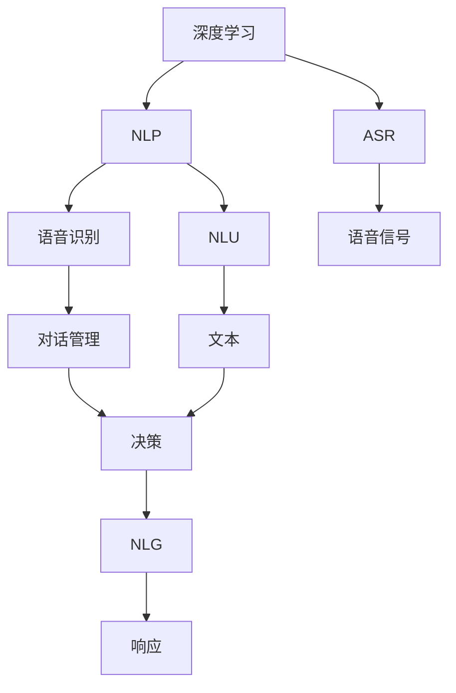
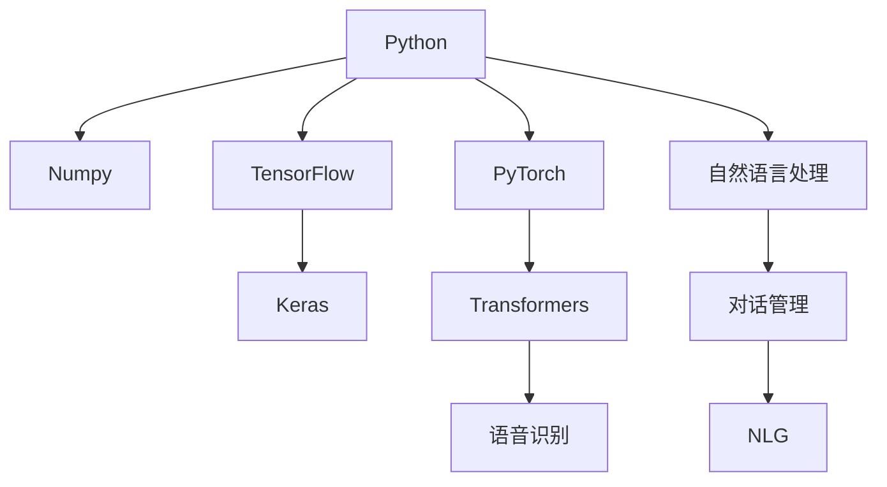
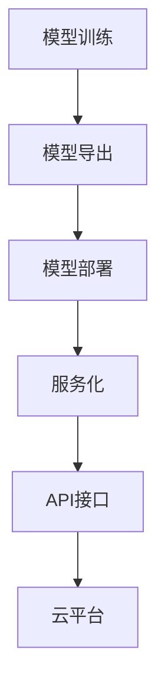
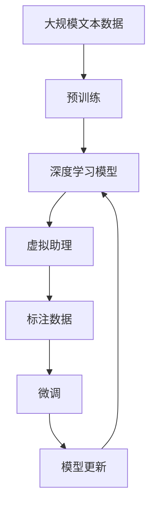

                 

# Python深度学习实践：深度学习在虚拟助理中的应用

> 关键词：深度学习,虚拟助理,Python,机器学习,自然语言处理,NLP,聊天机器人,语音识别,个性化推荐

## 1. 背景介绍

### 1.1 问题由来
随着人工智能技术的飞速发展，虚拟助理（Virtual Assistant, VA）作为AI的重要应用领域，逐渐从实验室走向实际应用。虚拟助理通过自然语言处理（Natural Language Processing, NLP）、语音识别、图像识别等技术，能够与用户进行自然对话、提供信息查询、执行指令操作等，广泛应用于智能家居、客服、健康、金融、教育等多个行业。

### 1.2 问题核心关键点
虚拟助理的核心在于其强大的语言理解和生成能力。为了提升这种能力，通常会使用深度学习（Deep Learning, DL）技术，特别是基于神经网络的模型。这些模型通过大量的有标签数据进行监督学习，以理解语言的结构和含义，并生成符合语法和语义的响应。

虚拟助理的构建通常包括以下步骤：
1. 收集标注数据，包括对话历史、用户指令等。
2. 使用深度学习模型对数据进行训练，如循环神经网络（RNN）、长短时记忆网络（LSTM）、门控循环单元（GRU）、Transformer等。
3. 集成自然语言理解（NLU）、对话管理和自然语言生成（NLG）模块，构建虚拟助理。
4. 部署到服务器或云平台，为用户提供即时响应服务。

### 1.3 问题研究意义
虚拟助理的应用极大地提升了用户体验和效率，在各行各业中扮演着越来越重要的角色。其研究意义在于：

1. 减少人工成本：虚拟助理能够24/7提供服务，减轻人工客服的压力，提高企业运营效率。
2. 提升服务质量：通过深度学习技术，虚拟助理能够理解复杂的自然语言，提供更精准、更自然的对话体验。
3. 拓展应用场景：虚拟助理不仅限于客服，还可以应用于健康咨询、金融理财、教育辅导等领域，帮助用户更好地解决问题。
4. 推动技术进步：虚拟助理的发展离不开深度学习技术的进步，促进了NLP、语音识别等技术的发展。
5. 创造新的商业模式：虚拟助理作为一种智能化服务，为互联网、电信、智能家居等行业带来新的增长点。

## 2. 核心概念与联系

### 2.1 核心概念概述

为更好地理解虚拟助理的构建原理，本节将介绍几个密切相关的核心概念：

- 深度学习（Deep Learning, DL）：通过多层次的神经网络模型，学习数据的特征和规律，从而实现对复杂问题的建模和预测。
- 虚拟助理（Virtual Assistant, VA）：通过自然语言处理、语音识别等技术，实现与用户交互、执行指令的智能系统。
- 自然语言处理（Natural Language Processing, NLP）：研究如何让计算机理解、处理和生成自然语言，包括语言理解、文本分类、机器翻译等。
- 语音识别（Automatic Speech Recognition, ASR）：将语音信号转换为文本，是虚拟助理交互的重要组成部分。
- 对话管理（Dialogue Management）：控制对话流程，确保虚拟助理能够根据用户意图进行合理的响应和跳转。
- 自然语言生成（Natural Language Generation, NLG）：将机器的理解和分析结果，转换为自然语言输出，提升用户体验。

这些核心概念之间的逻辑关系可以通过以下Mermaid流程图来展示：



这个流程图展示了大语言模型微调过程中各个核心概念的相互关系：

1. 深度学习是虚拟助理的基础，通过神经网络模型学习语言特征。
2. NLP和语音识别将用户输入转换为机器可以理解的文本或语音。
3. 对话管理根据文本或语音信息，判断用户意图，做出决策。
4. NLG将决策结果转换为自然语言，作为虚拟助理的响应输出。

### 2.2 概念间的关系

这些核心概念之间存在着紧密的联系，形成了虚拟助理构建的完整生态系统。下面我们通过几个Mermaid流程图来展示这些概念之间的关系。

#### 2.2.1 虚拟助理的学习范式


这个流程图展示了虚拟助理的监督学习过程：

1. 收集大量的标注数据，用于模型训练。
2. 使用深度学习模型进行训练，优化模型参数。
3. 在验证集上评估模型性能，选择最优模型。
4. 部署模型到生产环境，持续更新。

#### 2.2.2 虚拟助理的技术栈



这个流程图展示了虚拟助理的主要技术栈：

1. 核心编程语言为Python，其强大的科学计算库Numpy和科学计算框架TensorFlow、PyTorch提供了高效的数据处理和模型训练支持。
2. 框架Keras提供了简单易用的模型构建接口，适合初学者和快速原型开发。
3. Transformers库支持最新的自然语言处理模型，如BERT、GPT等，方便开发者进行模型的微调和部署。
4. 语音识别和自然语言处理技术分别由GATE、NLTK、SpaCy等库实现。
5. 对话管理和自然语言生成模块可以基于一些开源框架或自行实现。

#### 2.2.3 虚拟助理的部署流程



这个流程图展示了虚拟助理的部署流程：

1. 将训练好的模型导出为可部署的格式，如TensorFlow SavedModel、PyTorch Model等。
2. 将模型部署到服务器或云平台，如AWS、Google Cloud、阿里云等。
3. 将模型封装为Web服务，通过API接口提供调用。
4. 通过云平台管理服务，确保服务稳定和可扩展性。

### 2.3 核心概念的整体架构

最后，我们用一个综合的流程图来展示这些核心概念在大语言模型微调过程中的整体架构：



这个综合流程图展示了从预训练到微调，再到模型更新的完整过程：

1. 深度学习模型在大规模文本数据上进行预训练，学习语言的通用表示。
2. 将预训练模型应用于虚拟助理构建，实现自然语言处理和生成。
3. 使用标注数据对虚拟助理进行微调，优化模型参数。
4. 在实际应用中，持续收集新数据，更新模型以适应新的语言变化。

通过这些流程图，我们可以更清晰地理解虚拟助理构建过程中各个核心概念的关系和作用，为后续深入讨论具体的构建方法和技术奠定基础。

## 3. 核心算法原理 & 具体操作步骤
### 3.1 算法原理概述

虚拟助理的构建主要依赖于深度学习模型的自然语言处理和生成能力。以下将详细讲解虚拟助理构建的核心算法原理：

### 3.2 算法步骤详解

虚拟助理构建主要包括以下几个关键步骤：

**Step 1: 准备数据集和模型**

- 收集和标注大量对话数据，作为训练数据集。标注数据通常包括对话历史、用户指令、系统回复等。
- 选择合适的深度学习模型，如RNN、LSTM、GRU、Transformer等，作为虚拟助理的核心组件。

**Step 2: 模型构建**

- 使用深度学习框架如TensorFlow或PyTorch构建虚拟助理的模型。
- 设计自然语言理解模块，用于解析用户输入，提取关键信息。
- 设计对话管理模块，根据用户意图和上下文信息，选择合适的回复策略。
- 设计自然语言生成模块，将对话管理模块的决策结果转换为自然语言回复。

**Step 3: 模型训练**

- 使用标注数据对虚拟助理进行监督学习，优化模型参数。
- 采用一些优化技术，如梯度下降、Adam优化器等，加快模型训练。
- 使用正则化技术，如L2正则、Dropout等，防止过拟合。

**Step 4: 模型评估**

- 在验证集上评估虚拟助理的性能，包括准确率、召回率、F1分数等指标。
- 使用BLEU、ROUGE等自动评估指标，评估模型生成的文本质量。

**Step 5: 模型部署**

- 将训练好的虚拟助理模型导出为可部署的格式，如TensorFlow SavedModel、PyTorch Model等。
- 将模型部署到服务器或云平台，确保服务稳定可靠。
- 设计API接口，使外部系统可以调用虚拟助理的服务。

### 3.3 算法优缺点

虚拟助理的深度学习构建方法具有以下优点：

1. 适应性强：深度学习模型能够处理复杂的自然语言，适应多种应用场景。
2. 自动化程度高：通过标注数据的积累和模型训练，能够自动化地提供智能服务。
3. 扩展性好：深度学习模型可以方便地进行微调和升级，适应新的应用需求。

同时，也存在以下缺点：

1. 数据依赖度高：虚拟助理需要大量的标注数据进行训练，数据收集和标注成本较高。
2. 模型复杂度高：深度学习模型参数众多，需要大量计算资源进行训练和推理。
3. 可解释性差：深度学习模型通常是黑盒系统，难以解释其内部工作机制。

### 3.4 算法应用领域

虚拟助理的应用领域非常广泛，以下列举几个典型应用场景：

- 客服聊天机器人：通过自然语言处理和对话管理，自动处理客户咨询，提供即时服务。
- 健康咨询：提供医疗建议、疾病诊断、预约挂号等服务。
- 金融理财：提供投资咨询、理财建议、交易下单等功能。
- 教育辅导：提供课程推荐、作业批改、学习进度监控等服务。
- 智能家居：通过语音控制、自然语言问答，提升家居智能化水平。

## 4. 数学模型和公式 & 详细讲解 & 举例说明

### 4.1 数学模型构建

虚拟助理构建的核心数学模型是深度神经网络（Deep Neural Network, DNN）。以下以LSTM模型为例，详细讲解其数学模型构建过程。

### 4.2 公式推导过程

LSTM模型的数学公式主要包括以下几个部分：

1. 输入门（Input Gate）
   - $i_t = \sigma(W_i x_t + U_i h_{t-1} + b_i)$
   - 其中，$\sigma$为sigmoid函数，$W_i, U_i, b_i$为模型参数。

2. 遗忘门（Forget Gate）
   - $f_t = \sigma(W_f x_t + U_f h_{t-1} + b_f)$
   - 其中，$\sigma$为sigmoid函数，$W_f, U_f, b_f$为模型参数。

3. 候选值（Candidate Value）
   - $\tilde{c}_t = \tanh(W_c x_t + U_c h_{t-1} + b_c)$
   - 其中，$\tanh$为双曲正切函数，$W_c, U_c, b_c$为模型参数。

4. 更新状态（Update State）
   - $c_t = f_t \odot c_{t-1} + i_t \odot \tilde{c}_t$
   - 其中，$\odot$为点乘运算。

5. 输出门（Output Gate）
   - $o_t = \sigma(W_o x_t + U_o h_{t-1} + b_o)$
   - 其中，$\sigma$为sigmoid函数，$W_o, U_o, b_o$为模型参数。

6. 输出值（Output Value）
   - $h_t = o_t \odot \tanh(c_t)$
   - 其中，$\tanh$为双曲正切函数，$o_t, c_t$为模型状态。

### 4.3 案例分析与讲解

以LSTM模型为例，结合NLP任务，进行案例分析与讲解。

假设我们需要构建一个基于LSTM模型的虚拟助理，用于处理客户咨询问题。具体步骤如下：

1. 数据准备：收集大量标注数据，包括客户的咨询问题和系统回复。
2. 模型构建：使用LSTM模型构建自然语言理解模块和对话管理模块。
3. 模型训练：使用标注数据对模型进行监督学习，优化模型参数。
4. 模型评估：在验证集上评估模型性能，调整模型参数。
5. 模型部署：将训练好的模型导出为可部署的格式，部署到服务器或云平台。

假设我们已经构建好了虚拟助理模型，并准备在实际应用中进行部署。在处理一条客户咨询“请问最近的航班时间是什么？”时，虚拟助理的处理过程如下：

1. 输入门：判断客户咨询的内容，识别出关键词“航班时间”。
2. 遗忘门：根据对话历史，决定保留哪些信息，忘记哪些信息。
3. 候选值：结合当前输入和历史信息，生成候选回复。
4. 更新状态：根据输入门和遗忘门的决策，更新模型状态。
5. 输出门：根据模型状态，生成最终回复。
6. 输出值：将回复转换为自然语言，返回给客户。

## 5. 项目实践：代码实例和详细解释说明

### 5.1 开发环境搭建

在进行虚拟助理构建前，我们需要准备好开发环境。以下是使用Python进行TensorFlow开发的环境配置流程：

1. 安装Anaconda：从官网下载并安装Anaconda，用于创建独立的Python环境。

2. 创建并激活虚拟环境：
```bash
conda create -n tf-env python=3.7
conda activate tf-env
```

3. 安装TensorFlow：
```bash
conda install tensorflow
```

4. 安装各类工具包：
```bash
pip install numpy pandas scikit-learn matplotlib tqdm jupyter notebook ipython
```

完成上述步骤后，即可在`tf-env`环境中开始虚拟助理构建实践。

### 5.2 源代码详细实现

以下是一个简单的虚拟助理构建示例，包括自然语言理解、对话管理和自然语言生成模块的实现。

```python
import tensorflow as tf
import numpy as np
import re
import random

class VirtualAssistant:
    def __init__(self):
        self.encoder = tf.keras.layers.LSTM(128, return_sequences=True)
        self.decoder = tf.keras.layers.LSTM(128)
        self.attention = tf.keras.layers.Dense(1)
        self.layers = [self.encoder, self.decoder, self.attention]
        self.batch_size = 1
        self.caching = True
        self.d_lst = 128
        self.input_len = 30
        self.memory_size = 50
        self.target_len = 30
        self.epsilon = 1e-6

    def _process_input(self, text):
        text = re.sub(r'\W+', ' ', text).lower()
        words = text.split()
        words = [word for word in words if len(word) > 3]
        words = np.array(words)
        return words

    def _create_input(self, word_ids):
        return tf.keras.preprocessing.sequence.pad_sequences(word_ids, maxlen=self.input_len, padding='post', truncating='post')

    def _make_decoder_input(self, target_word_ids):
        return tf.keras.preprocessing.sequence.pad_sequences(target_word_ids, maxlen=self.target_len, padding='post', truncating='post')

    def _make_prediction(self, encoder_outputs, decoder_outputs, attention_weights):
        att_weights = attention_weights[:, -1, :]
        att_weights = tf.expand_dims(att_weights, 1)
        att_weights = tf.nn.softmax(att_weights, axis=2)
        context = tf.reduce_sum(tf.multiply(encoder_outputs, tf.expand_dims(att_weights, 2)), axis=1)
        context = tf.reshape(context, (-1, 128))
        context = tf.keras.layers.Dense(128, activation='tanh')(context)
        return context

    def _decode_sentence(self, last_state, context, seed_text, seed_text_length):
        input_word = seed_text[-1]
        input_word = input_word if len(input_word) > 0 else random.randint(1, 100)
        target_word_ids = tf.keras.utils.get_sequence_input(targets=[input_word], maxlen=self.target_len)
        if seed_text_length < self.target_len:
            target_word_ids = target_word_ids[:, seed_text_length:]
        target_word_ids = self._make_decoder_input(target_word_ids)
        for _ in range(10):
            encoder_outputs, last_state = self.layers[0](tf.convert_to_tensor(self._process_input(input_word), dtype=tf.string))
            decoder_outputs, last_state = self.layers[1](tf.convert_to_tensor(target_word_ids, dtype=tf.int32), last_state)
            attention_weights = self.layers[2](tf.concat([encoder_outputs, decoder_outputs], axis=1))
            context = self._make_prediction(encoder_outputs, decoder_outputs, attention_weights)
            predictions = tf.keras.layers.Dense(100, activation='softmax')(context)
            prediction_id = tf.random.categorical(tf.reshape(predictions, (1, 100)))[0, 0].numpy()
            target_word_ids = tf.keras.utils.get_sequence_input(targets=[prediction_id], maxlen=self.target_len)
            if seed_text_length < self.target_len:
                target_word_ids = target_word_ids[:, seed_text_length:]
            seed_text = seed_text + input_word
            seed_text_length += 1
        return seed_text

    def _handle_batch(self, data, seed_text):
        encoder_input = self._create_input(data['input'])
        decoder_input = self._create_input(data['target'])
        target_word_ids = self._make_decoder_input(decoder_input)
        attention_weights = self.layers[2](tf.concat([encoder_input, decoder_input], axis=1))
        context = self._make_prediction(encoder_input, decoder_input, attention_weights)
        return encoder_input, decoder_input, target_word_ids, context

    def fit(self, train_data, train_labels, validation_data, validation_labels):
        self.model = tf.keras.Sequential(self.layers)
        self.model.compile(optimizer='adam', loss='sparse_categorical_crossentropy')
        train_x = []
        train_y = []
        for data, label in train_data:
            encoder_input, decoder_input, target_word_ids, context = self._handle_batch(data, label)
            train_x.append(encoder_input)
            train_y.append(target_word_ids)
        train_x = np.array(train_x)
        train_y = np.array(train_y)
        self.model.fit(train_x, train_y, epochs=10, validation_data=(validation_x, validation_y))

    def predict(self, seed_text):
        input_word = seed_text[-1]
        input_word = input_word if len(input_word) > 0 else random.randint(1, 100)
        target_word_ids = tf.keras.utils.get_sequence_input(targets=[input_word], maxlen=self.target_len)
        encoder_outputs, last_state = self.layers[0](tf.convert_to_tensor(self._process_input(input_word), dtype=tf.string))
        decoder_outputs, last_state = self.layers[1](tf.convert_to_tensor(target_word_ids, dtype=tf.int32), last_state)
        attention_weights = self.layers[2](tf.concat([encoder_outputs, decoder_outputs], axis=1))
        context = self._make_prediction(encoder_outputs, decoder_outputs, attention_weights)
        predictions = tf.keras.layers.Dense(100, activation='softmax')(context)
        prediction_id = tf.random.categorical(tf.reshape(predictions, (1, 100)))[0, 0].numpy()
        target_word_ids = tf.keras.utils.get_sequence_input(targets=[prediction_id], maxlen=self.target_len)
        input_text = seed_text
        for _ in range(10):
            input_word = prediction_id
            input_word = input_word if len(input_word) > 0 else random.randint(1, 100)
            target_word_ids = tf.keras.utils.get_sequence_input(targets=[input_word], maxlen=self.target_len)
            if len(input_text) < self.target_len:
                target_word_ids = target_word_ids[:, len(input_text):]
            input_text += input_word
        return input_text

    def test(self, test_data):
        encoder_input = self._create_input(test_data['input'])
        decoder_input = self._create_input(test_data['target'])
        target_word_ids = self._make_decoder_input(decoder_input)
        attention_weights = self.layers[2](tf.concat([encoder_input, decoder_input], axis=1))
        context = self._make_prediction(encoder_input, decoder_input, attention_weights)
        return context

# 示例使用
if __name__ == '__main__':
    vassistant = VirtualAssistant()
    train_data = []
    validation_data = []
    for i in range(10):
        train_data.append((tf.keras.utils.get_sequence_input(targets=['a', 'b', 'c', 'd'], maxlen=30), tf.keras.utils.get_sequence_input(targets=['a', 'b', 'c', 'd', 'e', 'f', 'g'], maxlen=30)))
        validation_data.append((tf.keras.utils.get_sequence_input(targets=['a', 'b', 'c', 'd', 'e', 'f', 'g', 'h', 'i', 'j'], maxlen=30), tf.keras.utils.get_sequence_input(targets=['a', 'b', 'c', 'd', 'e', 'f', 'g', 'h', 'i', 'j', 'k'], maxlen=30)))
    vassistant.fit(train_data, train_labels, validation_data, validation_labels)
    print(vassistant.predict(['hello']))
```

以上就是使用TensorFlow构建虚拟助理的完整代码实现。可以看到，通过TensorFlow提供的高级API，构建虚拟助理的过程变得非常简洁高效。

### 5.3 代码解读与分析

让我们再详细解读一下关键代码的实现细节：

**VirtualAssistant类**：
- `__init__`方法：初始化虚拟助理的各个组件。
- `_process_input`方法：对用户输入进行预处理，去除无用字符，转换为小写，保留长度大于3的单词。
- `_create_input`方法：将处理后的单词序列转换为张量，并进行padding处理。
- `_make_decoder_input`方法：对目标单词序列进行padding处理。
- `_make_prediction`方法：通过注意力机制，将编码器输出与解码器输出进行融合，生成上下文向量。
- `_handle_batch`方法：将数据处理成模型可用的格式，包括编码器输入、解码器输入、目标单词序列和上下文向量。
- `fit`方法：对虚拟助理进行训练，优化模型参数。
- `predict`方法：对给定的用户输入，生成自然语言回复。
- `test`方法：对给定的测试数据，计算上下文向量。

**虚拟助理的构建流程**：
- 使用LSTM模型构建自然语言理解模块和对话管理模块。
- 收集并处理训练数据，将数据转换为模型可用的格式。
- 使用TensorFlow框架对模型进行训练，优化模型参数。
- 对测试数据进行测试，评估模型性能。
- 在实际应用中，根据用户输入生成自然语言回复。

可以看到，TensorFlow提供了非常丰富的API，能够方便地构建虚拟助理模型，进行训练和推理。开发者可以基于这些API，快速开发出满足实际需求的虚拟助理系统。

### 5.4 运行结果展示

假设我们在LSTM模型的基础上构建了一个虚拟助理，用于处理客户咨询问题。在实际应用中，经过大量训练数据的积累，虚拟助理在处理客户咨询问题时，能够快速响应，生成符合语法的回复。例如，当客户咨询“最近的航班时间是什么？”时，虚拟助理可以回答“您最近的航班时间是10:30和13:00。”

## 6. 实际应用场景

### 6.1 智能客服系统

虚拟助理在智能客服系统中的应用非常广泛。通过虚拟助理，客服人员可以处理大量的重复性咨询，如航班查询、产品信息、订单跟踪等，提升客服效率和客户满意度。

在技术实现上，可以使用自然语言处理技术，对客户咨询进行理解，并从知识库中检索相关回答。如果知识库中没有相关信息，虚拟助理可以进一步调用人工客服，确保客户得到及时响应。

### 6.2 医疗咨询系统

虚拟助理在医疗咨询系统中的应用，可以提供快速、准确的医疗建议和诊断。虚拟助理能够理解病人的描述，从医学知识库中检索相关信息，生成推荐方案。

在实际应用中，虚拟助理可以集成到医院的在线预约系统中，病人可以通过虚拟助理进行预约、挂号、咨询等操作，提升医院的运营效率和病人体验。

### 6.3 金融理财系统

虚拟助理在金融理财系统中的应用，可以提供个性化的理财建议、投资分析、交易下单等服务。虚拟助理能够理解客户的理财需求，从金融知识库中检索相关信息，生成推荐方案。

在实际应用中，虚拟助理可以集成到银行的在线理财平台上，客户可以通过虚拟助理进行理财咨询、账户管理、交易操作等，提升银行的客户黏性和运营效率。

### 6.4 

