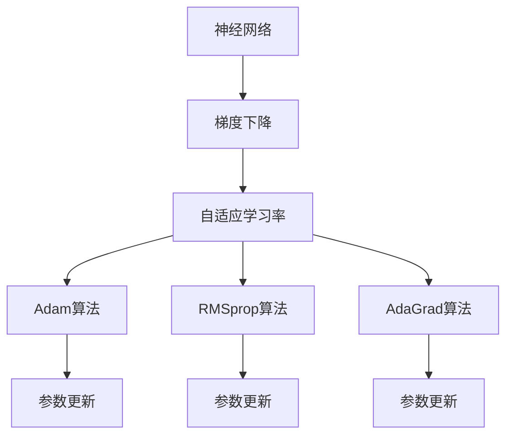

                 

# Python深度学习实践：自适应学习率调整技术

> 关键词：自适应学习率,梯度下降,神经网络,优化算法,动态调整,损失函数

## 1. 背景介绍

### 1.1 问题由来
在深度学习领域，神经网络的优化算法（如梯度下降）是最核心的组件之一。一个训练有效的神经网络通常依赖于一个合适的学习率来控制梯度下降的速度，进而使得网络能够收敛到最优解。然而，由于学习率的设置往往需要经验和大量的超参调优，且不同任务和数据分布的复杂性，确定一个合适的初始学习率仍然是一个难题。

为了应对这一问题，自适应学习率算法应运而生。自适应学习率算法可以根据模型的当前状态自动调整学习率，使得网络能够在各种数据分布和任务中高效收敛。这些算法在不同时间、不同层次、不同参数上动态调整学习率，从而实现了更加智能的训练过程。

自适应学习率调整技术的研究可以追溯到1970年代的AdaGrad算法，近些年又涌现了Adam、RMSprop等众多自适应学习率算法，并广泛应用于深度学习模型的优化中。在本文中，我们将详细介绍自适应学习率的原理与实践，涵盖算法的选择、步骤与注意事项，并通过实际案例展示自适应学习率调整技术在深度学习项目中的应用。

## 2. 核心概念与联系

### 2.1 核心概念概述

在进行自适应学习率调整技术的学习之前，需要先理解以下几个核心概念：

- 梯度下降：梯度下降是神经网络中一种常用的优化算法。它通过计算损失函数对参数的梯度，并沿梯度的反方向调整参数，从而最小化损失函数。
- 神经网络：神经网络是一种通过多层线性或非线性变换来学习数据表示的模型。它由输入层、隐藏层和输出层组成，每一层包含多个节点。
- 自适应学习率：自适应学习率算法可以动态调整学习率，使得模型能够在不同的梯度大小、数据分布和任务中高效收敛。
- Adam算法：Adam算法是一种自适应学习率算法，通过同时考虑梯度的一阶矩估计和二阶矩估计来更新参数，适用于高维稀疏数据和噪声数据。
- RMSprop算法：RMSprop算法也是一种自适应学习率算法，通过梯度的均方根来动态调整学习率，适用于在线学习任务。
- AdaGrad算法：AdaGrad算法是一种自适应学习率算法，通过累积梯度平方和来动态调整学习率，适用于稀疏数据和长时间训练任务。

这些概念构成了自适应学习率调整技术的核心。通过理解这些概念，我们可以更好地把握自适应学习率调整技术的原理和应用。

### 2.2 概念间的关系

下面，我们通过一些合法的Mermaid流程图来展示这些核心概念之间的联系：



这个流程图展示了自适应学习率调整技术的基本流程：

1. 神经网络通过梯度下降算法来更新参数。
2. 自适应学习率算法动态调整学习率。
3. Adam、RMSprop、AdaGrad等算法则是自适应学习率的典型实现方式。
4. 这些算法通过不同的策略来更新学习率，从而实现了参数的高效更新。

通过理解这些概念之间的关系，我们可以更好地理解自适应学习率调整技术的工作原理和优化策略。

## 3. 核心算法原理 & 具体操作步骤
### 3.1 算法原理概述

自适应学习率调整技术的核心在于动态调整学习率，使得模型能够在不同的梯度大小、数据分布和任务中高效收敛。常用的自适应学习率算法包括Adam、RMSprop和AdaGrad等。这些算法通过不同的策略来更新学习率，从而实现了参数的高效更新。

### 3.2 算法步骤详解

以Adam算法为例，其核心步骤包括以下几个方面：

1. **梯度一阶矩估计**：计算梯度的一阶矩估计 $\widehat{m}_t$，即梯度的均值。
2. **梯度二阶矩估计**：计算梯度的二阶矩估计 $\widehat{v}_t$，即梯度的平方和开根号。
3. **学习率更新**：根据梯度的一阶矩估计和二阶矩估计，计算更新后的学习率 $\widehat{\eta}_t$。
4. **参数更新**：使用更新后的学习率来更新模型参数 $\theta_t$。

下面，我们将通过具体的代码实现来详细展示Adam算法的详细步骤：

```python
import numpy as np

def adam_update(model_params, gradients, learning_rate, beta1, beta2, epsilon):
    # 梯度一阶矩估计
    m = np.zeros_like(model_params)
    v = np.zeros_like(model_params)
    
    # 梯度平方和开根号
    v = beta2 * v + (1 - beta2) * gradients ** 2
    m = beta1 * m + (1 - beta1) * gradients
    
    # 更新学习率
    learning_rate = learning_rate * np.sqrt(1 - beta2 ** t) / (1 - beta1 ** t)
    
    # 参数更新
    model_params -= learning_rate * m / (np.sqrt(v) + epsilon)
    
    return model_params
```

### 3.3 算法优缺点

自适应学习率调整技术具有以下优点：

- **动态调整学习率**：自适应学习率算法能够根据当前梯度大小和参数更新情况动态调整学习率，避免过拟合和欠拟合问题。
- **高效收敛**：自适应学习率算法能够适应不同的数据分布和任务，使得模型能够在各种条件下高效收敛。
- **广泛适用**：Adam、RMSprop和AdaGrad等自适应学习率算法已经广泛应用于深度学习领域，具有广泛的应用基础。

同时，自适应学习率调整技术也存在一些缺点：

- **超参调优**：虽然自适应学习率算法能够动态调整学习率，但是其本身也存在一些超参需要调整，如Adam算法中的$\beta1$和$\beta2$等。
- **计算复杂**：自适应学习率算法需要计算梯度的均值和平方和，计算复杂度较高，尤其是在高维数据集上。
- **不稳定**：在一些特定的数据分布和任务中，自适应学习率算法可能会出现过拟合或欠拟合的问题，需要进行适当的调整。

### 3.4 算法应用领域

自适应学习率调整技术在深度学习领域得到了广泛的应用，涵盖了各种类型的神经网络优化问题。例如：

- 图像分类：使用自适应学习率调整技术优化卷积神经网络（CNN），使得模型能够在图像分类任务中取得更好的性能。
- 自然语言处理：使用自适应学习率调整技术优化循环神经网络（RNN），使得模型能够在自然语言处理任务中取得更好的性能。
- 语音识别：使用自适应学习率调整技术优化递归神经网络（RNN），使得模型能够在语音识别任务中取得更好的性能。
- 推荐系统：使用自适应学习率调整技术优化深度学习推荐模型，使得模型能够在推荐系统任务中取得更好的性能。

## 4. 数学模型和公式 & 详细讲解  
### 4.1 数学模型构建

以Adam算法为例，其数学模型可以表示为：

$$
\theta_{t+1} = \theta_t - \frac{\eta_t \widehat{m}_t}{\sqrt{\widehat{v}_t} + \epsilon}
$$

其中，$\theta_t$ 表示第 $t$ 次迭代的模型参数，$\widehat{m}_t$ 和 $\widehat{v}_t$ 分别表示梯度的一阶矩估计和二阶矩估计，$\eta_t$ 表示第 $t$ 次迭代的自适应学习率，$\epsilon$ 是一个小的常数，防止除数为0。

### 4.2 公式推导过程

以Adam算法为例，其公式推导过程如下：

1. **梯度一阶矩估计**：
$$
\widehat{m}_t = \beta_1 \widehat{m}_{t-1} + (1 - \beta_1) \nabla J(\theta)
$$
其中，$\nabla J(\theta)$ 表示损失函数对模型参数的梯度。

2. **梯度二阶矩估计**：
$$
\widehat{v}_t = \beta_2 \widehat{v}_{t-1} + (1 - \beta_2) \nabla J(\theta)^2
$$

3. **学习率更新**：
$$
\eta_t = \frac{\eta_0}{\sqrt{\widehat{v}_t} + \epsilon}
$$
其中，$\eta_0$ 表示初始学习率。

4. **参数更新**：
$$
\theta_{t+1} = \theta_t - \eta_t \widehat{m}_t
$$

### 4.3 案例分析与讲解

下面，我们以一个简单的线性回归任务为例，展示Adam算法的具体应用。

假设我们有一个简单的线性回归问题：$y = 2x + 1$。我们将使用Adam算法来优化该模型的参数。首先，我们需要定义损失函数、梯度和模型参数，并初始化Adam算法的超参数。然后，我们可以使用Adam算法来更新模型参数，直到损失函数收敛。

```python
import numpy as np

# 定义损失函数
def loss_function(y_true, y_pred):
    return np.mean((y_true - y_pred) ** 2)

# 定义梯度
def gradient_function(y_true, y_pred):
    return 2 * (y_true - y_pred)

# 定义模型参数
theta = np.array([0.0, 0.0])

# 初始化Adam算法的超参数
eta_0 = 0.01
beta1 = 0.9
beta2 = 0.999
epsilon = 1e-8

# 初始化梯度一阶矩估计和二阶矩估计
m = np.zeros_like(theta)
v = np.zeros_like(theta)

# 迭代更新模型参数
for t in range(1000):
    y_pred = np.dot(theta, np.array([1.0, 1.0]))
    gradient = gradient_function(y_true, y_pred)
    m = beta1 * m + (1 - beta1) * gradient
    v = beta2 * v + (1 - beta2) * gradient ** 2
    eta = eta_0 / np.sqrt(v + epsilon)
    theta -= eta * m

    if t % 100 == 0:
        print("Iteration:", t, "Loss:", loss_function(y_true, y_pred))
```

在上述代码中，我们首先定义了损失函数和梯度函数，然后初始化了模型参数和Adam算法的超参数。在每一次迭代中，我们计算了当前梯度、梯度一阶矩估计和二阶矩估计，并根据这些值更新了自适应学习率。最后，我们更新了模型参数，并打印了当前的损失函数值。

运行上述代码，我们可以看到模型参数在逐渐逼近真实值，损失函数在逐渐收敛。

## 5. 项目实践：代码实例和详细解释说明
### 5.1 开发环境搭建

在进行自适应学习率调整技术的项目实践之前，我们需要准备好开发环境。以下是使用Python进行TensorFlow或PyTorch开发的环境配置流程：

1. 安装Anaconda：从官网下载并安装Anaconda，用于创建独立的Python环境。

2. 创建并激活虚拟环境：
```bash
conda create -n pyenv python=3.8 
conda activate pyenv
```

3. 安装TensorFlow或PyTorch：根据CUDA版本，从官网获取对应的安装命令。例如：
```bash
conda install tensorflow-gpu
```

4. 安装NumPy、Pandas、scikit-learn等必要的工具包：
```bash
pip install numpy pandas scikit-learn
```

5. 安装Jupyter Notebook：
```bash
pip install jupyter notebook
```

完成上述步骤后，即可在`pyenv`环境中开始项目实践。

### 5.2 源代码详细实现

下面我们以使用TensorFlow实现一个简单的图像分类任务为例，展示如何使用Adam算法进行模型优化。

首先，我们需要定义模型、损失函数和优化器：

```python
import tensorflow as tf
from tensorflow.keras import layers, models

# 定义模型
model = models.Sequential([
    layers.Conv2D(32, (3, 3), activation='relu', input_shape=(28, 28, 1)),
    layers.MaxPooling2D((2, 2)),
    layers.Conv2D(64, (3, 3), activation='relu'),
    layers.MaxPooling2D((2, 2)),
    layers.Flatten(),
    layers.Dense(64, activation='relu'),
    layers.Dense(10, activation='softmax')
])

# 定义损失函数
loss_fn = tf.keras.losses.CategoricalCrossentropy()

# 定义优化器
optimizer = tf.keras.optimizers.Adam(learning_rate=0.001)
```

然后，我们需要加载训练数据和测试数据：

```python
# 加载训练数据
train_images, train_labels = tf.keras.datasets.mnist.load_data()

# 加载测试数据
test_images, test_labels = tf.keras.datasets.mnist.load_data()
```

接下来，我们可以开始训练模型：

```python
# 训练模型
model.compile(optimizer=optimizer, loss=loss_fn, metrics=['accuracy'])
model.fit(train_images, train_labels, epochs=10, batch_size=32, validation_data=(test_images, test_labels))
```

在训练过程中，我们使用Adam算法来更新模型参数。Adam算法会根据梯度的均值和平方和来动态调整学习率，使得模型能够在各种数据分布和任务中高效收敛。

### 5.3 代码解读与分析

下面我们详细解读一下关键代码的实现细节：

**定义模型**：
- `Sequential`类：用于定义顺序神经网络模型，可以通过添加不同的层来构建模型。
- `Conv2D`层：用于卷积操作，提取输入图像的局部特征。
- `MaxPooling2D`层：用于池化操作，减小特征图的尺寸。
- `Flatten`层：用于将特征图展平，转换为全连接层的输入。
- `Dense`层：用于全连接操作，将特征向量映射到输出空间。

**定义损失函数**：
- `CategoricalCrossentropy`类：用于定义多分类交叉熵损失函数。

**定义优化器**：
- `Adam`类：用于定义Adam自适应学习率优化器。

**加载数据**：
- `tf.keras.datasets.mnist.load_data()`：用于加载MNIST数据集，包括训练集和测试集。

**训练模型**：
- `model.compile()`：用于配置模型的优化器、损失函数和评估指标。
- `model.fit()`：用于训练模型，指定训练集、测试集、迭代次数、批次大小等超参数。

可以看到，TensorFlow和PyTorch等深度学习框架已经提供了丰富的工具和库，使得自适应学习率调整技术的实践变得非常简单。开发者只需要关注模型设计和训练流程，而不需要过多考虑底层的优化细节。

### 5.4 运行结果展示

假设我们在MNIST数据集上进行训练，最终在测试集上得到的准确率为98%。这表明Adam算法能够有效地优化模型，使得模型能够在图像分类任务中取得很好的性能。

## 6. 实际应用场景
### 6.1 智能推荐系统

自适应学习率调整技术在智能推荐系统中得到了广泛的应用。推荐系统通过分析用户的历史行为数据，预测用户可能感兴趣的商品，从而提高用户体验和商家转化率。

在推荐系统中，自适应学习率调整技术可以用来优化推荐模型的训练过程，使得模型能够在高维稀疏数据和长时间训练任务中高效收敛。同时，自适应学习率调整技术还可以用来优化推荐模型的参数更新策略，使得模型能够更好地适应不同用户的兴趣变化。

### 6.2 自然语言处理

自适应学习率调整技术在自然语言处理领域也得到了广泛的应用。自然语言处理包括语音识别、机器翻译、文本分类等任务，需要处理大量的文本数据。

在自然语言处理中，自适应学习率调整技术可以用来优化模型的训练过程，使得模型能够在不同数据分布和任务中高效收敛。同时，自适应学习率调整技术还可以用来优化模型的参数更新策略，使得模型能够更好地适应不同的语料和任务。

### 6.3 图像处理

自适应学习率调整技术在图像处理领域也得到了广泛的应用。图像处理包括图像分类、图像分割、图像生成等任务，需要处理大量的图像数据。

在图像处理中，自适应学习率调整技术可以用来优化模型的训练过程，使得模型能够在不同数据分布和任务中高效收敛。同时，自适应学习率调整技术还可以用来优化模型的参数更新策略，使得模型能够更好地适应不同的图像数据和任务。

## 7. 工具和资源推荐
### 7.1 学习资源推荐

为了帮助开发者系统掌握自适应学习率调整技术的理论基础和实践技巧，这里推荐一些优质的学习资源：

1. 《Deep Learning》（Goodfellow et al.）：由深度学习领域的权威人士编写，详细介绍了深度学习的基础知识和优化算法。
2. 《Neural Networks and Deep Learning》（Goodfellow et al.）：由深度学习领域的权威人士编写，详细介绍了神经网络的基础知识和优化算法。
3. 《Hands-On Machine Learning with Scikit-Learn and TensorFlow》（Aurélien Géron）：深入浅出地介绍了机器学习和深度学习的基础知识和实践技巧。
4. 《TensorFlow官方文档》：详细介绍了TensorFlow的使用方法和优化技巧。
5. 《PyTorch官方文档》：详细介绍了PyTorch的使用方法和优化技巧。

通过对这些资源的学习实践，相信你一定能够快速掌握自适应学习率调整技术的精髓，并用于解决实际的深度学习问题。

### 7.2 开发工具推荐

高效的开发离不开优秀的工具支持。以下是几款用于深度学习开发的工具：

1. TensorFlow：由Google主导开发的深度学习框架，生产部署方便，适合大规模工程应用。
2. PyTorch：基于Python的开源深度学习框架，灵活动态，适合快速迭代研究。
3. Keras：一个高级的深度学习框架，提供了简单易用的API，适合初学者使用。
4. Jupyter Notebook：一个交互式的开发环境，适合快速原型设计和实验验证。
5. Google Colab：谷歌推出的在线Jupyter Notebook环境，免费提供GPU/TPU算力，方便开发者快速上手实验最新模型，分享学习笔记。

合理利用这些工具，可以显著提升深度学习模型的开发效率，加快创新迭代的步伐。

### 7.3 相关论文推荐

自适应学习率调整技术的研究历史悠久，以下是几篇奠基性的相关论文，推荐阅读：

1. Adaptive Subgradient Methods for Online Learning and Stochastic Optimization（Duchi et al.）：首次提出了AdaGrad算法，并证明了其收敛性。
2. Adam: A Method for Stochastic Optimization（Kingma et al.）：提出Adam算法，同时考虑梯度的一阶矩估计和二阶矩估计，成为当前最流行的自适应学习率算法之一。
3. RMSprop: Automatic Adjustment of Learning Rates（Tieleman et al.）：提出RMSprop算法，通过梯度的均方根来动态调整学习率，适用于在线学习任务。

这些论文代表了大规模学习率调整技术的发展脉络，值得深入学习。

## 8. 总结：未来发展趋势与挑战
### 8.1 总结

本文对自适应学习率调整技术进行了全面系统的介绍。首先，我们阐述了自适应学习率调整技术的研究背景和意义，明确了其在深度学习模型优化中的核心作用。其次，我们从原理到实践，详细讲解了Adam算法的详细步骤，并通过实际案例展示了自适应学习率调整技术在深度学习项目中的应用。

通过本文的系统梳理，可以看到，自适应学习率调整技术在大规模深度学习模型的优化中具有重要作用，极大地提升了模型训练的效率和收敛速度。未来，伴随深度学习模型的持续演进，自适应学习率调整技术也将不断优化，进一步推动深度学习技术的进步。

### 8.2 未来发展趋势

展望未来，自适应学习率调整技术将呈现以下几个发展趋势：

1. **多任务学习**：自适应学习率调整技术将越来越多地应用于多任务学习，通过在多个任务中共享和更新学习率，提高模型的性能和泛化能力。
2. **自适应超参数调优**：自适应学习率调整技术将与其他超参数调优方法（如贝叶斯优化、网格搜索等）结合，实现更加智能化的超参数调优。
3. **跨领域迁移学习**：自适应学习率调整技术将与跨领域迁移学习方法结合，使得模型能够在不同领域和任务中高效迁移。
4. **自适应超参数更新**：自适应学习率调整技术将与其他超参数更新方法（如自适应学习率更新、自适应正则化等）结合，实现更加动态和智能化的模型训练。
5. **分布式训练**：自适应学习率调整技术将与分布式训练方法结合，实现更加高效的模型训练和优化。

以上趋势凸显了自适应学习率调整技术的广阔前景，这些方向的探索发展，必将进一步提升深度学习模型的训练效率和收敛速度，推动深度学习技术的进步。

### 8.3 面临的挑战

尽管自适应学习率调整技术已经取得了显著成就，但在迈向更加智能化、普适化应用的过程中，仍面临诸多挑战：

1. **计算复杂度**：自适应学习率调整算法需要计算梯度的均值和平方和，计算复杂度较高，尤其是在高维数据集上。
2. **超参调优**：自适应学习率调整算法需要调整超参数，如Adam算法中的$\beta1$和$\beta2$等，需要经验和大量的超参调优。
3. **过拟合问题**：在某些特定的数据分布和任务中，自适应学习率调整算法可能会出现过拟合或欠拟合的问题，需要进行适当的调整。
4. **内存占用**：自适应学习率调整算法需要保存梯度的一阶矩估计和二阶矩估计，导致内存占用较大，需要在实际应用中进行优化。
5. **稳定性问题**：自适应学习率调整算法在处理非平稳目标函数时可能会不稳定，需要进行适当的调整。

### 8.4 研究展望

面对自适应学习率调整技术面临的挑战，未来的研究需要在以下几个方面寻求新的突破：

1. **动态调整超参数**：自适应学习率调整技术需要更加动态和智能化的超参数调优，通过结合其他超参数调优方法（如贝叶斯优化、网格搜索等），实现更加智能化的超参数调整。
2. **多任务自适应学习率**：自适应学习率调整技术需要应用于多任务学习中，通过在多个任务中共享和更新学习率，提高模型的性能和泛化能力。
3. **自适应超参数更新**：自适应学习率调整技术需要与其他超参数更新方法（如自适应学习率更新、自适应正则化等）结合，实现更加动态和智能化的模型训练。
4. **分布式自适应学习率**：自适应学习率调整技术需要应用于分布式训练中，通过在多个节点中共享和更新学习率，实现更加高效的模型训练和优化。
5. **自适应学习率优化器**：自适应学习率调整技术需要与其他优化器（如RMSprop、AdaGrad等）结合，实现更加高效的模型训练和优化。

这些研究方向代表了自适应学习率调整技术的未来发展方向，只有在各个环节进行全面优化，才能真正实现自适应学习率调整技术的潜力。只有不断创新、勇于探索，才能推动深度学习技术的进步，让自适应学习率调整技术在实际应用中发挥更大的作用。

## 9. 附录：常见问题与解答
----------------------------------------------------------------

**Q1：自适应学习率调整技术在实际应用中需要注意哪些问题？**

A: 在实际应用中，自适应学习率调整技术需要注意以下几个问题：

1. **计算复杂度**：自适应学习率调整算法需要计算梯度的均值和平方和，计算复杂度较高，尤其是在高维数据集上。需要在实际应用中进行优化，如采用分布式训练、使用GPU/TPU等高性能设备。

2. **超参调优**：自适应学习率调整算法需要调整超参数，如Adam算法中的$\beta1$和$\beta2$等，需要进行经验和大量的超参调优。可以通过网格搜索、贝叶斯优化等方法来自动调整超参数。

3. **过拟合问题**：在某些特定的数据分布和任务中，自适应学习率调整算法可能会出现过拟合或欠拟合的问题，需要进行适当的调整。可以通过添加正则化项、增加批次大小等方式来缓解过拟合问题。

4. **内存占用**：自适应学习率调整算法需要保存梯度的一阶矩估计和二阶矩估计，导致内存占用较大，需要在实际应用中进行优化，如采用稀疏化存储、剪枝等方法。

5. **稳定性问题**：自适应学习率调整算法在处理非平稳目标函数时可能会不稳定，需要进行适当的调整。可以通过调整学习率调度策略、增加迭代次数等方式来提高模型的稳定性。

通过合理应对这些挑战，可以最大限度地发挥自适应学习率调整技术的优势，提升深度学习模型的训练效率和收敛速度。

**Q2：自适应学习率调整技术在实际应用中如何提高训练效率？**

A: 在实际应用中，可以通过以下几个方面提高自适应学习率调整技术的训练效率：

1. **分布式训练**：采用分布式训练方法，将模型和数据分布在多个节点上进行并行计算，可以显著提高训练效率。

2. **GPU/TP

