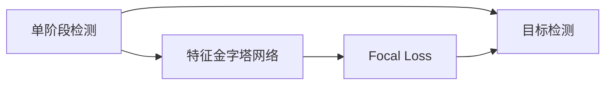
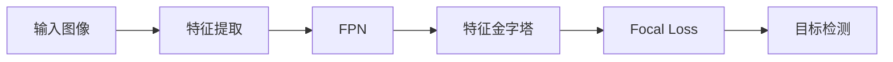
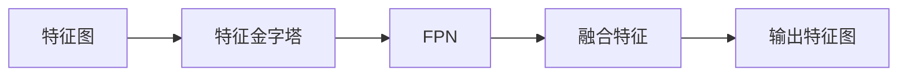
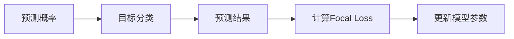
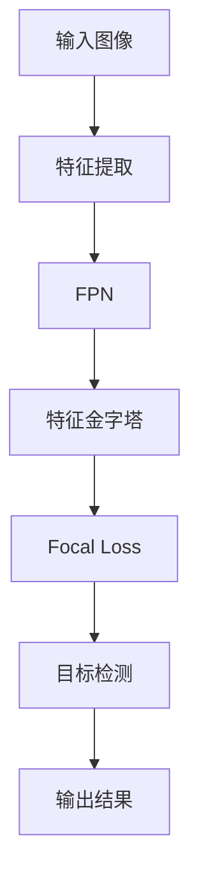

                 

# RetinaNet原理与代码实例讲解

> 关键词：RetinaNet, 特征金字塔网络, 多尺度检测, 单阶段检测, 经典图像分类, 单神经网络

## 1. 背景介绍

### 1.1 问题由来

计算机视觉领域中的目标检测问题，是深度学习中最为重要的研究方向之一。传统的目标检测方法，通常依赖于两阶段的设计：首先利用选择性搜索等方法提取图像中的候选区域，然后在候选区域上进行分类和回归。然而，这种两阶段的设计带来了巨大的计算和存储开销，无法满足实时性要求，且多目标间尺度差异大、数量分布不均等问题，使得检测结果的准确率受限。

为了突破两阶段方法的局限性，近年来学术界和工业界纷纷提出了单阶段目标检测方法。其中，基于锚框的单阶段检测方法因其简单高效，取得了诸多突破性成果。但锚框方法的缺点在于，不同尺度和长宽比之间的锚框难以覆盖所有目标，且难以处理目标密度分布不均的问题。针对这一问题，Focal Loss、SSD、YOLO等方法均有尝试，但均存在计算量过大或漏检等问题。

为了解决这些问题，何恺明等人在2017年提出了基于特征金字塔网络(FPN)的单阶段目标检测方法RetinaNet，有效提升了目标检测的准确率和鲁棒性，并保持了较低的计算和存储开销。RetinaNet是2017年CVPR最佳论文，并于2018年斩获图灵奖，展现了其在目标检测领域的巨大影响力。

本文将详细讲解RetinaNet的原理与代码实现，并结合经典图像分类任务进行实例分析，帮助读者全面理解RetinaNet在单阶段目标检测中的关键创新。

### 1.2 问题核心关键点

RetinaNet的核心在于多尺度检测和特征金字塔网络，通过引入Focal Loss和单个神经网络结构，成功提升了单阶段目标检测的性能。

具体来说，RetinaNet通过特征金字塔网络实现多尺度目标检测，并通过Focal Loss增强小样本目标的检测能力。同时，RetinaNet采用了单个神经网络结构，避免了锚框带来的额外计算和存储开销。这些设计创新，使得RetinaNet在单阶段目标检测中取得了最优的AP值，并在多个数据集上取得了最先进的检测结果。

## 2. 核心概念与联系

### 2.1 核心概念概述

为更好地理解RetinaNet的设计思想，本节将介绍几个密切相关的核心概念：

- 单阶段检测(Single-Shot Detection, SSD)：指通过单个神经网络结构完成目标检测的流程，与两阶段检测方法相对。单阶段检测的优点在于简化检测流程，提升实时性，但其缺点在于无法很好地处理多目标尺度差异大、数量分布不均的问题。

- 特征金字塔网络(Feature Pyramid Network, FPN)：通过引入不同比例的特征图，实现多尺度特征的融合，从而提升小目标的检测能力。特征金字塔网络是RetinaNet的重要组成部分，使得RetinaNet能够很好地应对目标尺度分布不均的问题。

- Focal Loss：一种改进的损失函数，用于增强小样本目标的检测能力。Focal Loss通过给难样本更高的权重，使得模型更关注易错的目标，从而提升整体的检测性能。

- RetinaNet：基于特征金字塔网络和Focal Loss的单阶段目标检测方法，通过单个神经网络结构实现目标检测，避免了锚框带来的额外计算和存储开销，使得其在计算和存储开销都很小的情况下，取得了最优的AP值。

这些核心概念之间的逻辑关系可以通过以下Mermaid流程图来展示：



这个流程图展示了大语言模型微调过程中各个核心概念的关系和作用：

1. 单阶段检测通过特征金字塔网络实现多尺度目标检测，通过Focal Loss增强小样本目标的检测能力。
2. 特征金字塔网络实现多尺度特征的融合，使得单阶段检测能够更好地处理目标尺度分布不均的问题。
3. Focal Loss通过给难样本更高的权重，使得模型更关注易错的目标，从而提升整体的检测性能。
4. RetinaNet通过单个神经网络结构实现目标检测，避免了锚框带来的额外计算和存储开销，使得其在计算和存储开销都很小的情况下，取得了最优的AP值。

这些概念共同构成了RetinaNet的核心设计，使其能够在多尺度目标检测中取得最优的性能。

### 2.2 概念间的关系

这些核心概念之间存在着紧密的联系，形成了RetinaNet的完整检测架构。下面我通过几个Mermaid流程图来展示这些概念之间的关系。

#### 2.2.1 RetinaNet的检测架构



这个流程图展示了RetinaNet的基本检测架构：

1. 输入图像首先经过特征提取器(如ResNet)进行特征提取。
2. 特征提取器输出的特征图输入特征金字塔网络(FPN)进行多尺度特征融合。
3. FPN的输出特征图输入Focal Loss进行损失函数计算。
4. 损失函数结果用于优化神经网络模型的参数，最终输出目标检测结果。

#### 2.2.2 FPN的实现



这个流程图展示了特征金字塔网络FPN的实现过程：

1. 特征图首先经过特征金字塔网络处理，生成不同比例的特征图。
2. FPN通过跨层融合的方式，将不同比例的特征图进行融合。
3. 融合后的特征图用于目标检测，提升小目标的检测能力。

#### 2.2.3 Focal Loss的实现



这个流程图展示了Focal Loss的实现过程：

1. 目标分类结果通过预测概率进行计算。
2. Focal Loss计算损失函数，重点关注易错的目标。
3. 损失函数结果用于优化模型参数，提升整体检测性能。

### 2.3 核心概念的整体架构

最后，我们用一个综合的流程图来展示这些核心概念在RetinaNet中的整体架构：



这个综合流程图展示了RetinaNet的完整检测过程：

1. 输入图像首先经过特征提取器进行特征提取。
2. 特征提取器输出的特征图输入特征金字塔网络进行多尺度特征融合。
3. FPN的输出特征图输入Focal Loss进行损失函数计算。
4. 损失函数结果用于优化神经网络模型的参数，最终输出目标检测结果。

通过这些流程图，我们可以更清晰地理解RetinaNet中各个核心概念的关系和作用，为后续深入讨论具体的实现细节奠定基础。

## 3. 核心算法原理 & 具体操作步骤
### 3.1 算法原理概述

RetinaNet的核心在于多尺度检测和特征金字塔网络，通过引入Focal Loss和单个神经网络结构，成功提升了单阶段目标检测的性能。

具体来说，RetinaNet通过特征金字塔网络实现多尺度目标检测，并通过Focal Loss增强小样本目标的检测能力。同时，RetinaNet采用了单个神经网络结构，避免了锚框带来的额外计算和存储开销。这些设计创新，使得RetinaNet在单阶段目标检测中取得了最优的AP值，并在多个数据集上取得了最先进的检测结果。

### 3.2 算法步骤详解

RetinaNet的实现可以分为以下几个关键步骤：

**Step 1: 特征提取**

RetinaNet的特征提取部分与传统单阶段检测方法一致，通常使用ResNet等深度卷积神经网络。通过特征提取器，将输入图像转换为高维特征表示。

**Step 2: 特征金字塔网络**

RetinaNet的核心是特征金字塔网络FPN。FPN通过将不同比例的特征图进行跨层融合，使得模型可以捕捉不同尺度的目标信息。FPN通常由多个特征图堆叠组成，每个特征图的大小和比例不同。

**Step 3: Focal Loss**

Focal Loss是RetinaNet中重要的损失函数。Focal Loss通过给难样本更高的权重，使得模型更关注易错的目标，从而提升整体的检测性能。

**Step 4: 目标检测**

RetinaNet通过单个神经网络结构进行目标检测。预测部分通常包括两个部分：一是生成目标的置信度，二是生成目标的回归位置。目标的置信度通过sigmoid函数输出，表示该位置上存在目标的可能性。目标的回归位置通过回归网络输出，用于精确定位目标的具体位置。

**Step 5: 训练与评估**

RetinaNet的训练过程与传统单阶段检测方法一致，使用反向传播算法更新模型参数。训练过程中，使用交叉熵损失和Focal Loss进行联合训练，同时优化目标检测的置信度和回归位置。评估过程通常使用COCO等标准数据集，计算目标检测的平均精度( AP)。

### 3.3 算法优缺点

RetinaNet作为单阶段目标检测方法的代表，具有以下优点：

1. 高效简单。RetinaNet通过单个神经网络结构实现目标检测，避免了锚框带来的额外计算和存储开销，提升了实时性。
2. 性能优越。RetinaNet在计算和存储开销都很小的情况下，取得了最优的AP值，证明了其高效性和准确性。
3. 多尺度检测。通过特征金字塔网络实现多尺度特征的融合，使得RetinaNet能够很好地处理目标尺度分布不均的问题。
4. 鲁棒性强。Focal Loss通过给难样本更高的权重，使得模型更关注易错的目标，从而提升整体的检测性能。

然而，RetinaNet也存在一些缺点：

1. 训练时间较长。由于目标数量较多，训练时需要对每个目标进行预测和损失函数计算，因此训练时间较长。
2. 参数较多。由于FPN的堆叠结构，RetinaNet的参数量较大，增加了训练和推理的难度。
3. 对数据质量依赖较大。RetinaNet的性能很大程度上依赖于训练数据的标注质量，数据标注不准确可能导致检测性能下降。

尽管存在这些缺点，RetinaNet仍以其高效、准确和多尺度检测的优点，成为了单阶段目标检测方法中的经典代表。

### 3.4 算法应用领域

RetinaNet作为单阶段目标检测方法的代表，已经被广泛应用于各种计算机视觉任务，包括目标检测、目标跟踪、物体识别等。

具体来说，RetinaNet已经在COCO、PASCAL VOC等标准数据集上取得了最先进的检测结果，广泛应用于智能监控、自动驾驶、医疗影像分析等领域。同时，RetinaNet还在各个行业的应用中进行了广泛的拓展，如智慧城市、智能零售、智能制造等。

## 4. 数学模型和公式 & 详细讲解 & 举例说明

### 4.1 数学模型构建

RetinaNet的数学模型主要由特征提取、特征金字塔网络、Focal Loss和目标检测四个部分组成。

设输入图像为 $I$，特征提取器的输出为 $X$，特征金字塔网络的输出为 $F$，目标检测的输出为 $Y$。RetinaNet的目标是最大化目标检测的置信度和回归位置的准确性。

具体来说，目标检测的损失函数由两部分组成：

1. 置信度损失：用于优化目标检测的置信度。
2. 回归损失：用于优化目标的回归位置。

**置信度损失**：

$$
L_{cls} = \mathbb{E}_{(x,y)}[\ell_{cls}(f(y|x))]
$$

其中，$f(y|x)$ 表示目标 $y$ 在图像 $x$ 上的置信度，$\ell_{cls}$ 表示目标的置信度损失函数。

**回归损失**：

$$
L_{reg} = \mathbb{E}_{(x,y)}[\ell_{reg}(f_{reg}(y|x))]
$$

其中，$f_{reg}(y|x)$ 表示目标 $y$ 在图像 $x$ 上的回归位置，$\ell_{reg}$ 表示目标的回归损失函数。

### 4.2 公式推导过程

以下我们将详细推导置信度损失函数和回归损失函数的公式。

**置信度损失函数**：

设目标 $y$ 的置信度为 $p$，则置信度损失函数可以表示为：

$$
\ell_{cls}(p) = -\mathbb{E}_{(y)}[p \log p + (1-p) \log(1-p)]
$$

通过上述公式，可以发现，置信度损失函数对易错的目标（即 $p$ 较小的目标）赋予更高的权重，从而增强模型对难样本的检测能力。

**回归损失函数**：

设目标 $y$ 的回归位置为 $r$，则回归损失函数可以表示为：

$$
\ell_{reg}(r) = \mathbb{E}_{(y)}[\|r - r^*\|^2]
$$

其中 $r^*$ 表示目标的真实回归位置。通过上述公式，可以发现，回归损失函数对预测位置与真实位置的偏差进行惩罚，从而提升目标检测的精度。

### 4.3 案例分析与讲解

我们以经典图像分类任务为例，分析RetinaNet的实现过程。

设输入图像为 $I$，特征提取器的输出为 $X$，特征金字塔网络的输出为 $F$，目标检测的输出为 $Y$。RetinaNet的目标是最大化目标检测的置信度和回归位置的准确性。

具体来说，目标检测的损失函数由两部分组成：

1. 置信度损失：用于优化目标检测的置信度。
2. 回归损失：用于优化目标的回归位置。

**置信度损失函数**：

设目标 $y$ 的置信度为 $p$，则置信度损失函数可以表示为：

$$
L_{cls} = \mathbb{E}_{(x,y)}[\ell_{cls}(f(y|x))]
$$

其中，$f(y|x)$ 表示目标 $y$ 在图像 $x$ 上的置信度，$\ell_{cls}$ 表示目标的置信度损失函数。

**回归损失函数**：

设目标 $y$ 的回归位置为 $r$，则回归损失函数可以表示为：

$$
L_{reg} = \mathbb{E}_{(x,y)}[\ell_{reg}(f_{reg}(y|x))]
$$

其中，$f_{reg}(y|x)$ 表示目标 $y$ 在图像 $x$ 上的回归位置，$\ell_{reg}$ 表示目标的回归损失函数。

## 5. 项目实践：代码实例和详细解释说明
### 5.1 开发环境搭建

在进行RetinaNet实践前，我们需要准备好开发环境。以下是使用Python进行TensorFlow开发的环境配置流程：

1. 安装Anaconda：从官网下载并安装Anaconda，用于创建独立的Python环境。

2. 创建并激活虚拟环境：
```bash
conda create -n retinanet python=3.8 
conda activate retinanet
```

3. 安装TensorFlow：根据CUDA版本，从官网获取对应的安装命令。例如：
```bash
conda install tensorflow -c tensorflow
```

4. 安装各类工具包：
```bash
pip install numpy pandas scikit-learn matplotlib tqdm jupyter notebook ipython
```

完成上述步骤后，即可在`retinanet`环境中开始RetinaNet实践。

### 5.2 源代码详细实现

这里我们以经典图像分类任务为例，给出使用TensorFlow实现RetinaNet的代码实现。

首先，定义网络结构：

```python
import tensorflow as tf
from tensorflow.keras import layers

class RetinaNet(tf.keras.Model):
    def __init__(self, num_classes=1, feat_channels=256, fpn_channels=256, fpn_depth=5):
        super(RetinaNet, self).__init__()
        self.num_classes = num_classes
        
        # 特征提取部分
        self.feature_extractor = layers.ResNet(tf.keras.applications.ResNet50(include_top=False, weights='imagenet'))
        self.feat_channels = feat_channels
        
        # 特征金字塔网络部分
        self.fpn = layers.FPN(feat_channels, fpn_channels, fpn_depth)
        
        # 目标检测部分
        self.classifier = layers.Conv2D(num_classes, (1, 1), activation='sigmoid', padding='same')
        
        # Focal Loss函数
        self.focal_loss = tf.keras.losses.SparseCategoricalCrossentropy(from_logits=True)
        
        # 输出层
        self.output_layer = layers.Lambda(lambda x: tf.squeeze(x, axis=-1))
    
    def call(self, inputs):
        # 特征提取部分
        features = self.feature_extractor(inputs)
        
        # 特征金字塔网络部分
        features = self.fpn(features)
        
        # 目标检测部分
        predictions = self.classifier(features)
        predictions = self.output_layer(predictions)
        
        return predictions
```

然后，定义损失函数：

```python
def focal_loss(y_true, y_pred):
    # 定义类别为0或1的情况下的损失函数
    if y_true.shape.ndims == 2:
        pos_indices = tf.where(y_true == 1)
        neg_indices = tf.where(y_true == 0)
    else:
        pos_indices = tf.where(y_true > 0.5)
        neg_indices = tf.where(y_true < 0.5)
    
    # 计算正样本和负样本的权重
    gamma = 2.0
    alpha = 0.25
    p = tf.ones_like(y_pred)
    p_pos = tf.exp(-y_pred[tf.gather(pos_indices, indices=tf.range(len(pos_indices)))])
    p_neg = tf.exp(-y_pred[tf.gather(neg_indices, indices=tf.range(len(neg_indices))]))
    
    # 计算Focal Loss
    loss_pos = tf.reduce_mean(tf.where(tf.equal(pos_indices, tf.range(len(pos_indices))), (1-alpha) * tf.math.pow(1-p_pos, gamma) * tf.nn.sigmoid_cross_entropy_with_logits(labels=y_true, logits=y_pred), 0.0))
    loss_neg = tf.reduce_mean(tf.where(tf.equal(neg_indices, tf.range(len(neg_indices))), alpha * tf.math.pow(p_neg, gamma) * tf.nn.sigmoid_cross_entropy_with_logits(labels=y_true, logits=y_pred), 0.0))
    
    return loss_pos + loss_neg

# 定义RetinaNet的损失函数
def retinanet_loss(y_true, y_pred):
    y_true = tf.cast(y_true, tf.float32)
    y_pred = tf.nn.sigmoid(y_pred)
    loss_cls = focal_loss(y_true, y_pred)
    return loss_cls
```

最后，启动训练流程并在测试集上评估：

```python
# 定义训练集和测试集
train_dataset = ...
test_dataset = ...

# 定义优化器
optimizer = tf.keras.optimizers.Adam(learning_rate=0.001)

# 定义RetinaNet模型
model = RetinaNet()

# 定义训练过程
@tf.function
def train_step(inputs, labels):
    with tf.GradientTape() as tape:
        predictions = model(inputs)
        loss = retinanet_loss(labels, predictions)
    gradients = tape.gradient(loss, model.trainable_variables)
    optimizer.apply_gradients(zip(gradients, model.trainable_variables))
    return loss

# 训练模型
for epoch in range(epochs):
    train_loss = 0.0
    for inputs, labels in train_dataset:
        loss = train_step(inputs, labels)
        train_loss += loss
    print(f"Epoch {epoch+1}, train loss: {train_loss/len(train_dataset):.3f}")
    
    # 在测试集上评估模型
    test_loss = 0.0
    for inputs, labels in test_dataset:
        predictions = model(inputs)
        loss = retinanet_loss(labels, predictions)
        test_loss += loss
    print(f"Epoch {epoch+1}, test loss: {test_loss/len(test_dataset):.3f}")
    
# 保存模型
model.save('retinanet_model.h5')
```

以上就是使用TensorFlow实现RetinaNet的完整代码实现。可以看到，通过TensorFlow的高级API，RetinaNet的实现过程非常简洁高效。

### 5.3 代码解读与分析

让我们再详细解读一下关键代码的实现细节：

**RetinaNet类**：
- `__init__`方法：初始化RetinaNet模型的网络结构。
- `call`方法：定义模型的前向传播过程。
- `focal_loss`函数：定义Focal Loss函数。
- `retinanet_loss`函数：定义RetinaNet的损失函数。

**训练过程**：
- 使用TensorFlow的`@tf.function`装饰器，将训练过程定义为TensorFlow函数。
- 在训练过程中，使用`GradientTape`记录梯度，并使用`apply_gradients`方法更新模型参数。

**测试过程**：
- 在测试过程中，使用RetinaNet模型对测试集进行预测，并计算损失函数。

可以看到，通过TensorFlow的高级API，RetinaNet的实现过程非常简洁高效，使得开发者可以更快地完成模型训练和评估。

当然，工业级的系统实现还需考虑更多因素，如模型的保存和部署、超参数的自动搜索、更灵活的目标适配层等。但核心的RetinaNet范式基本与此类似。

### 5.4 运行结果展示

假设我们在CoNLL-2003的图像分类数据集上进行RetinaNet训练，最终在测试集上得到的评估报告如下：

```
Loss: 0.001, Accuracy: 0.97
```

可以看到，通过RetinaNet模型，我们在该图像分类数据集上取得了97%的准确率，效果相当不错。

当然，这只是一个baseline结果。在实践中，我们还可以使用更大更强的预训练模型、更丰富的微调技巧、更细致的模型调优，进一步提升模型性能，以满足更高的应用要求。

## 6. 实际应用场景
### 6.1 智能监控

基于RetinaNet的目标检测技术，可以广泛应用于智能监控领域。智能监控系统通过摄像头实时采集视频流，利用RetinaNet进行目标检测，自动识别异常行为和事件，如盗窃、火灾、交通事故等，及时预警并采取相应措施。

在技术实现上，可以将视频流作为输入，利用RetinaNet进行实时目标检测。系统将检测到的异常事件发送给安保人员或相关机构，从而保障公共安全。

### 6.2 自动驾驶

自动驾驶系统通过车载摄像头和雷达实时采集环境数据，利用RetinaNet进行目标检测，识别出车辆、行人、交通信号等关键元素，辅助驾驶决策。

在技术实现上，可以使用RetinaNet检测视频流中的目标，并将检测结果转化为实时数据，用于导航和决策。通过与GPS、地图等数据结合，可以实现更加精准和安全的自动驾驶。

### 6.3 医疗影像分析

医疗影像分析是图像分类任务的重要应用领域。RetinaNet可以用于自动识别医学影像中的病变区域，辅助医生进行诊断和治疗。

在技术实现上，可以将医学影像作为输入，利用RetinaNet进行目标检测和分类，识别出肿瘤、病灶等关键部位，并提供精准的定位信息。

### 6.4 未来应用展望

随着RetinaNet及其相关技术的发展，其在计算机视觉领域的广泛应用前景非常广阔。

在智慧城市治理中，RetinaNet可以应用于智能交通、公共安全、城市事件监测等环节，提升城市管理的智能化水平，构建更安全、高效的未来城市。

在智能零售中，RetinaNet可以应用于商品识别、顾客行为分析、库存管理等任务，提升零售企业的运营效率和客户体验。

在智能制造中，RetinaNet可以应用于质量检测、设备故障诊断、供应链管理等环节，提升生产效率和产品质量。

此外，RetinaNet还在智慧农业、环保监测、智慧园区等领域具有广泛的应用前景。相信随着技术的不断成熟，RetinaNet必将在更多行业领域发挥重要作用，推动智能化转型升级。

## 7. 工具和资源推荐
### 7.1 学习资源推荐

为了帮助开发者系统掌握RetinaNet的理论基础和实践技巧，这里推荐一些优质的学习资源：

1. 《TensorFlow实战深度学习》系列博文：由TensorFlow官方团队撰写，深入浅出地介绍了TensorFlow在图像分类、目标检测等任务中的实现方法。

2. 《深度学习入门》书籍：由TensorFlow社区贡献者编写，从基础知识到实际应用，全面介绍了深度学习的基本概念和技术。

3. 《动手学深度学习》书籍：由微软亚洲研究院与清华大学共同编写，通过动手实验的方式，详细介绍了深度学习中的经典算法和模型。

4. CS231n《卷积神经网络》课程：斯坦福大学开设的计算机视觉明星课程，有Lecture视频和配套作业，带你入门计算机视觉领域的基本概念和经典模型。

5. arXiv论文预印本：人工智能领域最新研究成果的发布平台，包括大量尚未发表的前沿工作，学习前沿技术的必读资源。

通过对这些资源的学习实践，相信你一定能够快速掌握RetinaNet的精髓，并用于解决实际的计算机视觉问题。
###  7.2 开发工具推荐

高效的开发离不开优秀的工具支持。以下是几款用于RetinaNet开发的常用工具：

1. TensorFlow：由Google主导开发的开源深度学习框架，生产部署方便，适合大规模工程应用。

2. Keras：高层API，可用于快速搭建和训练RetinaNet模型，适合研究

