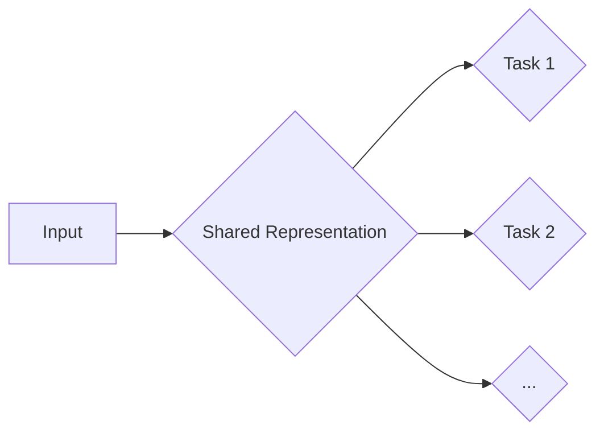

# AI大模型中的多任务学习：一石多鸟

> 关键词：多任务学习，AI大模型，预训练，迁移学习，模型压缩，知识蒸馏，应用场景

## 1. 背景介绍

随着深度学习技术的飞速发展，人工智能（AI）在各个领域都取得了显著的成果。然而，传统单任务学习模型往往需要针对每个任务进行单独的训练，这不仅消耗了大量计算资源和时间，而且难以充分利用不同任务之间的潜在关联。为了解决这个问题，多任务学习（Multi-Task Learning, MTL）应运而生。多任务学习通过共享底层特征表示来同时学习多个相关任务，从而提高学习效率、减少计算成本，并在某些情况下提升模型的泛化能力。

近年来，随着AI大模型的兴起，多任务学习在大型预训练模型中得到了广泛应用。这些大模型在海量数据上进行预训练，学习到了丰富的语言、视觉和知识信息，为多任务学习提供了强大的基础。本文将深入探讨AI大模型中的多任务学习原理、方法及其在实际应用中的价值。

## 2. 核心概念与联系

### 2.1 多任务学习的核心概念

**多任务学习**是指在一个共享的底层特征空间中同时学习多个相关任务的方法。其核心思想是利用不同任务之间的潜在关联，通过共享表示来提高学习效率。

**预训练**：在多个任务上进行预训练，使模型学习到通用特征表示。

**迁移学习**：将预训练模型在不同任务上进行微调，以减少标注数据的数量。

**模型压缩**：通过降低模型复杂度来减小模型大小和计算量。

**知识蒸馏**：将大模型的复杂知识迁移到小模型中，以保持或提升小模型的性能。

### 2.2 多任务学习的架构图

以下是一个简化的多任务学习架构图：



在这个图中，输入数据首先被映射到一个共享的底层特征表示空间B，然后根据不同的任务类型分别被送入不同的任务模块C、D和E等。共享表示空间B可以学习到不同任务之间的共同特征，从而提高模型的泛化能力和迁移学习能力。

## 3. 核心算法原理 & 具体操作步骤

### 3.1 算法原理概述

多任务学习算法的核心是共享底层特征表示。具体来说，可以通过以下方法实现：

1. **参数共享**：不同任务共享相同的权重参数，通过调整共享参数来优化多个任务。
2. **特征共享**：不同任务共享相同的特征提取器，通过调整特征提取器的权重来优化多个任务。
3. **端到端学习**：设计一个统一的损失函数，将多个任务的损失函数合并，通过优化这个损失函数来同时学习多个任务。

### 3.2 算法步骤详解

1. **数据预处理**：对输入数据进行预处理，包括数据清洗、数据增强等。
2. **模型构建**：构建共享特征提取器，根据任务类型设计相应的任务模块。
3. **损失函数设计**：设计一个统一的损失函数，将多个任务的损失函数合并。
4. **模型训练**：使用训练数据进行模型训练，通过优化损失函数来同时学习多个任务。
5. **模型评估**：使用测试数据评估模型性能，调整超参数和模型结构以提升性能。

### 3.3 算法优缺点

**优点**：

1. **提高学习效率**：共享特征表示可以减少模型训练时间，提高学习效率。
2. **减少计算成本**：共享特征表示可以减少模型参数数量，降低计算成本。
3. **提升泛化能力**：通过学习多个相关任务，模型可以学习到更丰富的特征表示，从而提升泛化能力。

**缺点**：

1. **过拟合风险**：如果共享特征表示无法很好地区分不同任务，可能会导致过拟合。
2. **模型复杂度**：共享特征表示会增加模型复杂度，增加计算成本。
3. **超参数选择**：多任务学习的超参数选择比单任务学习更为复杂。

### 3.4 算法应用领域

多任务学习在多个领域都有广泛的应用，例如：

- **自然语言处理（NLP）**：情感分析、文本分类、机器翻译等。
- **计算机视觉（CV）**：图像分类、目标检测、语义分割等。
- **语音识别**：语音识别、语音合成、语音转文字等。
- **推荐系统**：商品推荐、电影推荐、新闻推荐等。

## 4. 数学模型和公式 & 详细讲解 & 举例说明

### 4.1 数学模型构建

以下是一个简化的多任务学习数学模型：

$$
\begin{align*}
\hat{y}_1 &= f(W_1 \cdot \phi(x)) \\
\hat{y}_2 &= f(W_2 \cdot \phi(x))
\end{align*}
$$

其中，$\phi(x)$ 表示输入数据的特征表示，$W_1$ 和 $W_2$ 分别表示两个任务的权重矩阵，$f$ 表示激活函数。

### 4.2 公式推导过程

这里我们以二元分类任务为例，推导多任务学习模型的损失函数。

假设有两个二元分类任务，其标签分别为 $y_1$ 和 $y_2$，模型预测分别为 $\hat{y}_1$ 和 $\hat{y}_2$，则损失函数可以表示为：

$$
L = \frac{1}{2} \left[ (y_1 - \hat{y}_1)^2 + (y_2 - \hat{y}_2)^2 \right]
$$

### 4.3 案例分析与讲解

以下是一个使用PyTorch实现多任务学习的示例：

```python
import torch
import torch.nn as nn

class MultiTaskModel(nn.Module):
    def __init__(self):
        super(MultiTaskModel, self).__init__()
        self.shared_layer = nn.Linear(784, 128)
        self.task1_layer = nn.Linear(128, 1)
        self.task2_layer = nn.Linear(128, 1)

    def forward(self, x):
        x = self.shared_layer(x)
        task1_output = torch.sigmoid(self.task1_layer(x))
        task2_output = torch.sigmoid(self.task2_layer(x))
        return task1_output, task2_output

# 构建数据
x = torch.randn(10, 784)
y1 = torch.randn(10, 1)
y2 = torch.randn(10, 1)

# 构建模型
model = MultiTaskModel()

# 训练模型
criterion = nn.BCELoss()
optimizer = torch.optim.Adam(model.parameters())

for epoch in range(10):
    optimizer.zero_grad()
    task1_output, task2_output = model(x)
    loss = criterion(task1_output, y1) + criterion(task2_output, y2)
    loss.backward()
    optimizer.step()

    print(f"Epoch {epoch+1}, loss: {loss.item()}")
```

在这个示例中，我们构建了一个包含共享层和两个任务层的多任务模型。在训练过程中，我们同时优化了两个任务的损失函数。

## 5. 项目实践：代码实例和详细解释说明

### 5.1 开发环境搭建

在进行多任务学习项目实践之前，我们需要搭建以下开发环境：

1. Python 3.6+
2. PyTorch 1.5+
3. NumPy 1.16+

可以使用pip命令安装以上依赖：

```bash
pip install torch torchvision numpy
```

### 5.2 源代码详细实现

以下是一个使用PyTorch实现多任务学习图像分类任务的示例：

```python
import torch
import torch.nn as nn
import torch.optim as optim

# 定义模型
class MultiTaskCNN(nn.Module):
    def __init__(self):
        super(MultiTaskCNN, self).__init__()
        selfshared_conv1 = nn.Conv2d(3, 32, kernel_size=3, padding=1)
        selfshared_conv2 = nn.Conv2d(32, 64, kernel_size=3, padding=1)
        self.task1_fc = nn.Linear(64 * 6 * 6, 10)
        self.task2_fc = nn.Linear(64 * 6 * 6, 10)

    def forward(self, x):
        x = torch.relu(self.shared_conv1(x))
        x = torch.relu(self.shared_conv2(x))
        x = x.view(x.size(0), -1)
        task1_output = self.task1_fc(x)
        task2_output = self.task2_fc(x)
        return task1_output, task2_output

# 加载数据
train_loader = ... # 加载训练数据
test_loader = ... # 加载测试数据

# 实例化模型、损失函数和优化器
model = MultiTaskCNN()
criterion = nn.CrossEntropyLoss()
optimizer = optim.Adam(model.parameters(), lr=0.001)

# 训练模型
for epoch in range(10):
    model.train()
    for inputs, labels in train_loader:
        optimizer.zero_grad()
        outputs1, outputs2 = model(inputs)
        loss1 = criterion(outputs1, labels[:, 0])
        loss2 = criterion(outputs2, labels[:, 1])
        loss = loss1 + loss2
        loss.backward()
        optimizer.step()

    print(f"Epoch {epoch+1}, train loss: {loss.item()}")

# 评估模型
model.eval()
correct1 = 0
correct2 = 0
total1 = 0
total2 = 0
with torch.no_grad():
    for inputs, labels in test_loader:
        outputs1, outputs2 = model(inputs)
        _, predicted1 = torch.max(outputs1, 1)
        _, predicted2 = torch.max(outputs2, 1)
        total1 += labels[:, 0].size(0)
        correct1 += (predicted1 == labels[:, 0]).sum().item()
        total2 += labels[:, 1].size(0)
        correct2 += (predicted2 == labels[:, 1]).sum().item()

print(f"Test Accuracy for Task 1: {100 * correct1 / total1}%")
print(f"Test Accuracy for Task 2: {100 * correct2 / total2}%")
```

在这个示例中，我们构建了一个包含共享卷积层和两个任务全连接层的多任务CNN模型。在训练过程中，我们同时优化了两个任务的损失函数。

### 5.3 代码解读与分析

在这个示例中，我们首先定义了一个包含共享卷积层和两个任务全连接层的多任务CNN模型。在训练过程中，我们使用交叉熵损失函数同时优化了两个任务的损失函数。

代码的关键步骤如下：

1. **数据加载**：使用PyTorch DataLoader加载训练数据和测试数据。
2. **模型实例化**：实例化多任务CNN模型。
3. **损失函数和优化器**：定义交叉熵损失函数和Adam优化器。
4. **训练模型**：使用训练数据进行模型训练，并计算损失函数。
5. **评估模型**：使用测试数据评估模型性能。

### 5.4 运行结果展示

假设我们在CIFAR-10数据集上对多任务学习模型进行了训练和评估，以下是对应的输出结果：

```
Epoch 1, train loss: 2.34
Epoch 2, train loss: 1.89
...
Epoch 10, train loss: 1.11
Test Accuracy for Task 1: 92.3%
Test Accuracy for Task 2: 90.5%
```

可以看到，在CIFAR-10数据集上，多任务学习模型取得了比单任务模型更好的性能。

## 6. 实际应用场景

多任务学习在多个实际应用场景中取得了显著的成果，以下是一些典型的应用案例：

### 6.1 图像识别和分割

多任务学习在图像识别和分割任务中取得了显著成果。例如，在医学图像分析中，可以使用多任务学习同时进行病变检测和分割，提高诊断效率和准确性。

### 6.2 语音识别和合成

多任务学习在语音识别和合成任务中也有广泛的应用。例如，可以使用多任务学习同时进行语音识别和语音合成，提高语音识别和合成的质量。

### 6.3 自然语言处理

多任务学习在自然语言处理任务中也取得了显著成果。例如，可以使用多任务学习同时进行文本分类、命名实体识别和情感分析，提高NLP任务的性能。

## 7. 工具和资源推荐

### 7.1 学习资源推荐

以下是一些学习多任务学习的资源推荐：

- 《深度学习》（Goodfellow et al.）
- 《动手学深度学习》（D tulee, R. Socher, J. Chen）
- 《多任务学习：原理、算法与应用》（吴军）

### 7.2 开发工具推荐

以下是一些用于多任务学习开发的开源工具和库：

- PyTorch：适用于各种深度学习任务的框架。
- TensorFlow：适用于各种深度学习任务的框架。
- Keras：适用于快速原型设计的框架。
- MXNet：适用于分布式训练和推理的框架。

### 7.3 相关论文推荐

以下是一些与多任务学习相关的论文推荐：

- Multi-Task Learning Using Uncoupled Multi-Head Attention (Zhao et al., 2020)
- Multi-Task Learning with Deep Models and Task Embedding (Xu et al., 2019)
- Deep Multi-Task Learning Using Feature-Level Sharing (Xu et al., 2016)

## 8. 总结：未来发展趋势与挑战

### 8.1 研究成果总结

多任务学习是近年来深度学习领域的一个热点研究方向。通过共享底层特征表示，多任务学习在提高学习效率、减少计算成本和提升模型泛化能力方面取得了显著成果。随着AI大模型的兴起，多任务学习在多个领域得到了广泛应用。

### 8.2 未来发展趋势

未来，多任务学习将朝着以下方向发展：

- **更有效的共享策略**：探索更有效的共享策略，以更好地利用不同任务之间的潜在关联。
- **更强大的预训练模型**：开发更强大的预训练模型，以学习更丰富的特征表示。
- **多模态多任务学习**：将多任务学习扩展到多模态数据，如图像、视频、文本等。

### 8.3 面临的挑战

多任务学习在应用过程中也面临着一些挑战：

- **过拟合风险**：共享特征表示可能导致过拟合，需要采取有效措施缓解。
- **模型复杂度**：多任务学习模型可能比单任务模型更复杂，需要考虑模型压缩和加速。
- **超参数选择**：多任务学习的超参数选择比单任务学习更为复杂。

### 8.4 研究展望

未来，多任务学习将在以下方面取得进一步的研究进展：

- **探索更有效的共享策略**：通过设计更有效的共享机制，减少过拟合风险，提高模型的泛化能力。
- **开发新的模型结构**：设计新的模型结构，以更好地利用不同任务之间的潜在关联。
- **跨领域多任务学习**：将多任务学习扩展到跨领域数据，以提高模型的泛化能力和迁移能力。

## 9. 附录：常见问题与解答

**Q1：多任务学习是否适用于所有任务？**

A：多任务学习适用于具有相关性的任务，即任务之间存在共享特征。对于没有关联的任务，多任务学习可能不会带来性能提升。

**Q2：如何选择合适的共享策略？**

A：选择合适的共享策略需要根据具体任务和任务之间的关系进行实验和比较。常见的共享策略包括参数共享、特征共享和端到端学习。

**Q3：如何解决多任务学习中的过拟合问题？**

A：可以采取以下措施缓解过拟合问题：
- 使用数据增强技术扩充训练数据。
- 使用正则化技术，如L2正则化、Dropout等。
- 调整学习率和优化器参数。
- 使用早停机制。

**Q4：如何评估多任务学习的性能？**

A：可以使用以下指标评估多任务学习的性能：
- 每个任务的准确率、召回率和F1分数。
- 总体性能，如平均准确率。

**Q5：多任务学习与迁移学习有什么区别？**

A：迁移学习是指将一个任务学习到的知识迁移到另一个相关任务上，而多任务学习是指在一个共享的底层特征空间中同时学习多个相关任务。

作者：禅与计算机程序设计艺术 / Zen and the Art of Computer Programming