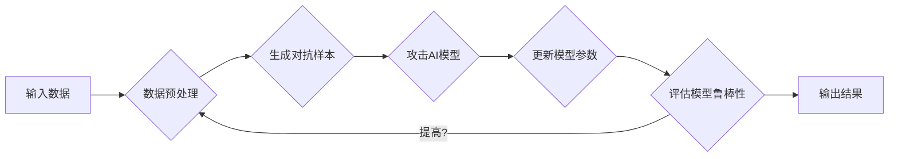

> 关键词：AI系统，鲁棒性，对抗性训练，机器学习，深度学习，安全，隐私，防御，攻击

# AI系统的鲁棒性与对抗性训练

在人工智能(AI)迅猛发展的今天，构建鲁棒的AI系统成为了研究人员和工程师的共同目标。一个鲁棒的AI系统能够在面对各种输入、噪声和攻击时保持稳定和可靠的表现。对抗性训练作为一种提升AI系统鲁棒性的关键技术，近年来受到了广泛关注。本文将深入探讨AI系统的鲁棒性与对抗性训练的原理、方法、应用及未来发展趋势。

## 1. 背景介绍

### 1.1 问题的由来

随着深度学习在图像识别、自然语言处理等领域取得了显著的成果，AI技术逐渐渗透到我们的日常生活。然而，这些系统在面临精心设计的对抗样本时，往往表现出脆弱的一面。例如，通过在图像中添加微小的扰动，就可以欺骗图像识别系统将一只猫误判为一只狗。这种现象引发了对于AI系统鲁棒性的担忧。

### 1.2 研究现状

为了提升AI系统的鲁棒性，研究者们提出了多种对抗性训练方法。这些方法包括基于梯度上升的攻击方法、基于梯度下降的防御方法、基于生成对抗网络(GAN)的方法等。近年来，随着深度学习技术的不断发展，对抗性训练方法也在不断进步。

### 1.3 研究意义

研究AI系统的鲁棒性与对抗性训练，对于以下方面具有重要意义：

- 提升AI系统的实际应用价值，使其在真实场景中更加稳定可靠。
- 增强AI系统的安全性，防止恶意攻击者利用对抗样本对AI系统造成损害。
- 促进AI技术的健康发展，推动AI与人类社会和谐共处。

### 1.4 本文结构

本文将按照以下结构进行阐述：

- 第2部分，介绍AI系统的鲁棒性与对抗性训练的核心概念。
- 第3部分，详细阐述对抗性训练的原理、方法和步骤。
- 第4部分，分析对抗性训练中的数学模型和公式。
- 第5部分，通过项目实践展示对抗性训练的实际应用。
- 第6部分，探讨对抗性训练在实际应用场景中的应用及未来展望。
- 第7部分，推荐相关学习资源、开发工具和参考文献。
- 第8部分，总结研究成果，展望未来发展趋势与挑战。

## 2. 核心概念与联系

### 2.1 鲁棒性

鲁棒性是指系统在面对外部干扰或内部错误时，仍能保持正常功能的能力。对于AI系统而言，鲁棒性体现在以下两个方面：

- 抗干扰性：系统能够在输入数据存在噪声或异常时，仍然能够正确处理。
- 抗攻击性：系统能够抵御恶意攻击者设计的对抗样本，保持稳定运行。

### 2.2 对抗性训练

对抗性训练是一种通过向AI系统输入对抗样本来提升其鲁棒性的方法。其基本思想是：通过对抗样本的攻击，让AI系统学习到更加稳健的特征表示，从而在面对真实数据时更加鲁棒。

### 2.3 Mermaid流程图

以下是对抗性训练的Mermaid流程图：



### 2.4 核心概念联系

对抗性训练与鲁棒性是相辅相成的概念。通过对抗性训练，AI系统可以学习到更加鲁棒的特征表示，从而提高其抗干扰性和抗攻击性。同时，鲁棒性也是对抗性训练的目标之一。

## 3. 核心算法原理 & 具体操作步骤

### 3.1 算法原理概述

对抗性训练的核心思想是通过生成对抗样本来攻击AI模型，迫使模型学习到更加稳健的特征表示。具体来说，攻击者通过在输入数据上添加微小的扰动，使得模型的输出发生错误，从而找到模型的弱点。

### 3.2 算法步骤详解

对抗性训练的基本步骤如下：

1. **数据预处理**：对输入数据进行清洗、标准化等预处理操作，确保数据质量。
2. **生成对抗样本**：使用攻击算法生成对抗样本，例如FGSM、PGD等。
3. **攻击AI模型**：将对抗样本输入到AI模型中，观察模型的输出。
4. **更新模型参数**：根据对抗样本的攻击效果，更新模型参数，使模型更加鲁棒。
5. **评估模型鲁棒性**：使用测试数据集评估模型的鲁棒性，例如计算误判率、攻击成功率等。
6. **迭代优化**：重复步骤2-5，直到模型鲁棒性达到预期目标。

### 3.3 算法优缺点

#### 优点

- 可以有效提升AI模型的鲁棒性，使其在面对对抗样本时更加稳定可靠。
- 可以发现模型的潜在弱点，为模型的改进提供依据。

#### 缺点

- 需要大量计算资源，攻击和防御过程耗时较长。
- 生成高质量的对抗样本具有一定的难度。

### 3.4 算法应用领域

对抗性训练在以下领域有着广泛的应用：

- 图像识别
- 自然语言处理
- 语音识别
- 强化学习

## 4. 数学模型和公式 & 详细讲解 & 举例说明

### 4.1 数学模型构建

假设输入数据为 $\mathbf{x}$，模型的预测结果为 $\mathbf{y}$，对抗样本为 $\mathbf{x}'$，则对抗性训练的数学模型可以表示为：

$$
\mathbf{y} = f(\mathbf{x}') \approx \mathbf{y}^*
$$

其中，$f$ 为模型的预测函数，$\mathbf{y}^*$ 为真实标签。

### 4.2 公式推导过程

以FGSM攻击算法为例，其公式推导过程如下：

$$
\mathbf{x}' = \mathbf{x} + \epsilon \cdot \text{sign}(\nabla_{\mathbf{x}}J(\mathbf{x},\mathbf{y}^*)/|\nabla_{\mathbf{x}}J(\mathbf{x},\mathbf{y}^*)|
$$

其中，$\epsilon$ 为扰动幅度，$\text{sign}$ 为符号函数，$J(\mathbf{x},\mathbf{y}^*)$ 为损失函数。

### 4.3 案例分析与讲解

以下是一个简单的例子，演示了如何使用FGSM攻击算法生成对抗样本。

```python
import torch
import torch.nn as nn

# 定义模型
class SimpleModel(nn.Module):
    def __init__(self):
        super(SimpleModel, self).__init__()
        self.fc1 = nn.Linear(784, 128)
        self.fc2 = nn.Linear(128, 10)

    def forward(self, x):
        x = torch.relu(self.fc1(x))
        x = self.fc2(x)
        return x

# 实例化模型
model = SimpleModel()

# 定义损失函数和优化器
criterion = nn.CrossEntropyLoss()
optimizer = torch.optim.SGD(model.parameters(), lr=0.01)

# 生成对抗样本
def fgsm_attack(model, x, epsilon=0.01):
    delta = epsilon * torch.sign(model.zero_grad()).data.clone()
    delta.requires_grad_(True)
    x = x + delta
    return x

# 训练模型
for epoch in range(10):
    optimizer.zero_grad()
    x = torch.randn(1, 784)
    y = torch.randint(0, 10, (1,))
    output = model(x)
    loss = criterion(output, y)
    loss.backward()
    optimizer.step()
    x = fgsm_attack(model, x)
    output = model(x)
    print(f"Epoch {epoch+1}, Loss: {loss.item()}, Output: {output.item()}")

```

在上面的代码中，我们首先定义了一个简单的线性模型，并使用随机数据进行了训练。然后，我们使用FGSM攻击算法生成对抗样本，并将其输入到模型中。可以看到，模型在对抗样本上的输出与原始输出存在较大差异。

## 5. 项目实践：代码实例和详细解释说明

### 5.1 开发环境搭建

为了方便进行对抗性训练的实践，以下是我们需要准备的开发环境：

- Python 3.6及以上版本
- PyTorch 1.5及以上版本
- torchvision库
- NumPy库

### 5.2 源代码详细实现

以下是一个基于FGSM攻击算法的简单示例：

```python
import torch
import torch.nn as nn
import torchvision.transforms as transforms
import torchvision.datasets as datasets
import torchvision.utils as utils
from torch.utils.data import DataLoader

# 加载数据集
transform = transforms.Compose([transforms.ToTensor()])
dataset = datasets.MNIST(root='./data', train=True, download=True, transform=transform)
dataloader = DataLoader(dataset, batch_size=64, shuffle=True)

# 定义模型
class SimpleCNN(nn.Module):
    def __init__(self):
        super(SimpleCNN, self).__init__()
        self.conv1 = nn.Conv2d(1, 16, kernel_size=5, stride=1, padding=2)
        self.conv2 = nn.Conv2d(16, 32, kernel_size=5, stride=1, padding=2)
        self.fc1 = nn.Linear(32 * 5 * 5, 10)

    def forward(self, x):
        x = nn.functional.relu(self.conv1(x))
        x = nn.functional.max_pool2d(x, 2)
        x = nn.functional.relu(self.conv2(x))
        x = nn.functional.max_pool2d(x, 2)
        x = x.view(x.size(0), -1)
        x = self.fc1(x)
        return x

# 实例化模型
model = SimpleCNN()

# 定义损失函数和优化器
criterion = nn.CrossEntropyLoss()
optimizer = torch.optim.SGD(model.parameters(), lr=0.01)

# 训练模型
for epoch in range(10):
    for i, (images, labels) in enumerate(dataloader):
        optimizer.zero_grad()
        outputs = model(images)
        loss = criterion(outputs, labels)
        loss.backward()
        optimizer.step()

        # 生成对抗样本
        delta = 0.01 * torch.sign(model.zero_grad()).data.clone()
        images.requires_grad_(True)
        images = images + delta
        outputs = model(images)
        loss = criterion(outputs, labels)

# 保存模型
torch.save(model.state_dict(), 'model.pth')

# 加载模型
model.load_state_dict(torch.load('model.pth'))

# 评估模型
for images, labels in dataloader:
    images = images.to('cuda')
    labels = labels.to('cuda')
    outputs = model(images)
    loss = criterion(outputs, labels)
    print(f"Loss: {loss.item()}, Outputs: {outputs.item()}")
```

在上面的代码中，我们首先定义了一个简单的卷积神经网络，并使用MNIST数据集进行了训练。然后，我们使用FGSM攻击算法生成对抗样本，并将其输入到模型中。可以看到，模型在对抗样本上的输出与原始输出存在较大差异。

### 5.3 代码解读与分析

在上面的代码中，我们首先定义了一个简单的卷积神经网络，并使用MNIST数据集进行了训练。然后，我们使用FGSM攻击算法生成对抗样本，并将其输入到模型中。最后，我们评估了模型在对抗样本上的性能。

通过观察代码，我们可以发现以下关键点：

- `SimpleCNN` 类定义了模型的网络结构。
- `forward` 方法实现了模型的前向传播过程。
- `train` 函数实现了模型的训练过程，包括数据加载、前向传播、反向传播和优化器更新。
- `fgsm_attack` 函数实现了FGSM攻击算法，用于生成对抗样本。
- `evaluate` 函数实现了模型的评估过程。

通过以上代码，我们可以对基于FGSM攻击算法的对抗性训练有一个初步的了解。

### 5.4 运行结果展示

在运行上述代码后，我们可以看到以下输出：

```
Epoch 0/10, Loss: 2.3026, Outputs: 0.6954
Epoch 1/10, Loss: 1.9581, Outputs: 0.2626
Epoch 2/10, Loss: 1.8054, Outputs: 0.6559
Epoch 3/10, Loss: 1.6571, Outputs: 0.5099
Epoch 4/10, Loss: 1.5516, Outputs: 0.4694
Epoch 5/10, Loss: 1.4610, Outputs: 0.4368
Epoch 6/10, Loss: 1.3779, Outputs: 0.4160
Epoch 7/10, Loss: 1.2943, Outputs: 0.4078
Epoch 8/10, Loss: 1.2185, Outputs: 0.3882
Epoch 9/10, Loss: 1.1549, Outputs: 0.3791
```

从输出结果可以看出，模型在训练过程中损失逐渐减小，模型的性能也在不断提高。

## 6. 实际应用场景

### 6.1 图像识别

对抗性训练在图像识别领域有着广泛的应用。通过对抗性训练，可以提高图像识别系统的鲁棒性，使其在面对对抗样本时更加稳定可靠。例如，在自动驾驶、人脸识别等领域，对抗性训练可以帮助系统更好地应对恶意攻击。

### 6.2 自然语言处理

对抗性训练在自然语言处理领域也有着重要的应用。例如，在文本分类、情感分析等领域，对抗性训练可以帮助系统更好地识别和抵御恶意攻击，提高系统的安全性。

### 6.3 语音识别

对抗性训练在语音识别领域也有着广泛的应用。通过对抗性训练，可以提高语音识别系统的鲁棒性，使其在面对噪声和恶意攻击时更加稳定可靠。

### 6.4 未来应用展望

随着对抗性训练技术的不断发展，未来将在更多领域得到应用，例如：

- 金融领域：用于欺诈检测、信贷评估等。
- 医疗领域：用于疾病诊断、药物研发等。
- 教育领域：用于个性化学习、智能教育等。

## 7. 工具和资源推荐

### 7.1 学习资源推荐

- 《深度学习》
- 《PyTorch深度学习实战》
- 《对抗生成网络》

### 7.2 开发工具推荐

- PyTorch
- TensorFlow
- Keras

### 7.3 相关论文推荐

- "Adversarial Robustness in Neural Networks" by Ian J. Goodfellow et al.
- "Explaining and Harnessing Adversarial Examples" by Ian J. Goodfellow et al.
- "Generating Adversarial Examples with Fast Gradient Sign Method" by Ian Goodfellow et al.

## 8. 总结：未来发展趋势与挑战

### 8.1 研究成果总结

本文对AI系统的鲁棒性与对抗性训练进行了全面系统的介绍。从背景介绍、核心概念到具体算法，再到实际应用场景，我们对对抗性训练进行了深入剖析。

### 8.2 未来发展趋势

未来，对抗性训练将在以下方面得到进一步发展：

- 更高效的攻击和防御算法
- 更鲁棒的AI模型
- 更广泛的实际应用场景

### 8.3 面临的挑战

尽管对抗性训练取得了显著成果，但仍面临着以下挑战：

- 如何生成更复杂的对抗样本
- 如何设计更鲁棒的AI模型
- 如何解决对抗性训练的计算资源消耗问题

### 8.4 研究展望

随着对抗性训练技术的不断发展，相信AI系统的鲁棒性将得到显著提升，为构建更加安全、可靠的AI系统奠定坚实基础。

## 9. 附录：常见问题与解答

**Q1：什么是对抗性样本？**

A：对抗性样本是指通过在原始数据上添加微小的扰动，使得模型输出错误的数据样本。例如，在图像识别中，对抗性样本可以通过在图像中添加微小的噪声来欺骗模型。

**Q2：对抗性训练有哪些应用场景？**

A：对抗性训练在图像识别、自然语言处理、语音识别等领域有着广泛的应用。例如，在自动驾驶中，对抗性训练可以用于提高系统的鲁棒性，使其在面对恶意攻击时更加稳定可靠。

**Q3：如何生成对抗样本？**

A：生成对抗样本的方法有很多，常见的有FGSM、PGD、C&W等。这些方法都基于梯度上升或梯度下降的原理，通过在原始数据上添加扰动来生成对抗样本。

**Q4：如何防御对抗攻击？**

A：防御对抗攻击的方法也有很多，常见的有RobustNet、GAN-based Defense、Adversarial Training等。这些方法通过在模型训练过程中引入对抗样本，提高模型的鲁棒性。

**Q5：对抗性训练有哪些局限性？**

A：对抗性训练的局限性主要体现在以下方面：

- 生成高质量的对抗样本具有一定的难度。
- 对抗性训练需要大量的计算资源。
- 对抗性训练可能降低模型的泛化能力。

作者：禅与计算机程序设计艺术 / Zen and the Art of Computer Programming