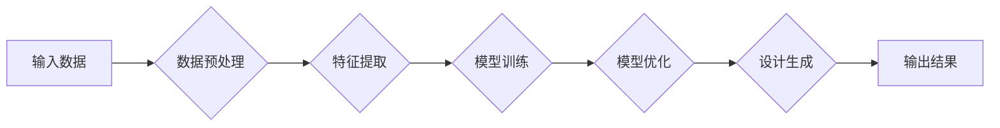

# AI辅助设计在产品开发中的实践

> 关键词：AI辅助设计，产品开发，设计优化，自动化工具，机器学习，深度学习，人机协同

## 1. 背景介绍

随着人工智能技术的快速发展，AI在各个领域的应用越来越广泛。在产品开发过程中，AI辅助设计（AI-assisted design）逐渐崭露头角，成为提高设计效率、降低成本、提升产品质量的重要工具。本文将探讨AI辅助设计在产品开发中的实践，分析其原理、方法、应用场景以及未来发展趋势。

### 1.1 问题的由来

传统产品开发过程中，设计师往往需要花费大量时间和精力进行方案设计、迭代优化、原型制作等工作。这些工作不仅耗时费力，而且难以保证设计方案的创新性和最优性。随着市场竞争的加剧，如何利用AI技术提高设计效率、降低成本、提升产品质量，成为产品开发的重要课题。

### 1.2 研究现状

近年来，AI辅助设计在产品开发中的应用逐渐增多，主要分为以下几类：

- **设计灵感生成**：通过分析用户需求和市场趋势，利用AI算法生成创意设计方案。
- **设计优化**：利用AI算法对设计方案进行优化，提高设计质量和效率。
- **自动化设计**：利用AI算法实现设计流程的自动化，降低人力成本。
- **人机协同设计**：将AI技术与设计师的创造力相结合，实现人机协同的设计模式。

### 1.3 研究意义

AI辅助设计在产品开发中的实践具有以下重要意义：

- **提高设计效率**：利用AI算法自动生成和优化设计方案，大幅缩短设计周期。
- **降低设计成本**：减少人力成本，降低研发投入。
- **提升产品质量**：通过算法优化和迭代，提高产品的设计质量和用户体验。
- **促进创新**：打破传统设计思路，激发新的设计灵感。

## 2. 核心概念与联系

### 2.1 核心概念

- **人工智能（AI）**：一种模拟、延伸和扩展人类智能的理论、方法、技术和应用。
- **机器学习（ML）**：一种使计算机系统能够从数据中学习并做出决策的技术。
- **深度学习（DL）**：一种利用神经网络进行学习的机器学习技术。
- **产品开发**：将产品概念转化为实际产品的过程。

### 2.2 联系

AI辅助设计是AI技术在产品开发中的应用，其核心是机器学习和深度学习。通过分析产品开发过程中的数据，利用机器学习算法提取特征、预测结果，并通过深度学习算法进行模型训练和优化。以下是一个简单的Mermaid流程图，展示了AI辅助设计的原理：



## 3. 核心算法原理 & 具体操作步骤

### 3.1 算法原理概述

AI辅助设计主要基于以下算法原理：

- **数据预处理**：对原始数据进行清洗、归一化等处理，为后续分析提供高质量的数据。
- **特征提取**：从数据中提取出有助于模型学习和决策的特征。
- **模型训练**：使用机器学习或深度学习算法对训练数据进行学习，建立预测模型。
- **模型优化**：通过交叉验证、参数调整等方法优化模型性能。
- **设计生成**：根据预测模型生成设计方案。

### 3.2 算法步骤详解

1. **数据收集**：收集产品开发过程中的相关数据，如用户需求、市场数据、历史设计数据等。
2. **数据预处理**：对收集到的数据进行清洗、归一化等处理，为后续分析提供高质量的数据。
3. **特征提取**：根据任务需求，从预处理后的数据中提取出有助于模型学习和决策的特征。
4. **模型选择**：选择合适的机器学习或深度学习算法，如决策树、支持向量机、神经网络等。
5. **模型训练**：使用训练数据对模型进行训练，调整模型参数，使其能够学习到数据中的规律。
6. **模型验证**：使用验证数据评估模型性能，调整模型参数，提高模型精度。
7. **模型部署**：将训练好的模型部署到产品开发平台，实现自动化设计功能。

### 3.3 算法优缺点

#### 优点

- **提高设计效率**：自动化生成和优化设计方案，大幅缩短设计周期。
- **降低设计成本**：减少人力成本，降低研发投入。
- **提升产品质量**：通过算法优化和迭代，提高产品的设计质量和用户体验。
- **促进创新**：打破传统设计思路，激发新的设计灵感。

#### 缺点

- **数据依赖性**：AI辅助设计对数据质量要求较高，需要大量的高质量数据。
- **算法局限性**：现有的AI算法可能无法完全满足所有设计需求。
- **人机协同难度**：AI辅助设计需要与设计师进行有效的协同，才能发挥最大效益。

### 3.4 算法应用领域

AI辅助设计在以下领域得到广泛应用：

- **产品设计**：如工业设计、建筑设计、汽车设计等。
- **UI/UX设计**：如网页设计、移动应用设计等。
- **游戏设计**：如角色设计、场景设计等。

## 4. 数学模型和公式 & 详细讲解 & 举例说明

### 4.1 数学模型构建

AI辅助设计中的数学模型主要基于机器学习或深度学习算法。以下是一个简单的神经网络模型示例：

```latex
y = f(W_1 \cdot x + b_1, W_2 \cdot f(W_1 \cdot x + b_1) + b_2)
```

其中，$y$ 为输出结果，$x$ 为输入特征，$W_1$、$W_2$ 为权重，$b_1$、$b_2$ 为偏置项，$f$ 为激活函数。

### 4.2 公式推导过程

以神经网络为例，以下为前向传播过程的公式推导：

1. 前向传播：
   $$
z_1 = W_1 \cdot x + b_1
$$
   $$
a_1 = f(z_1)
$$
   $$
z_2 = W_2 \cdot a_1 + b_2
$$
   $$
y = f(z_2)
$$

2. 反向传播：
   $$
\delta_2 = (y - t) \cdot f'(z_2)
$$
   $$
\delta_1 = \delta_2 \cdot W_2 \cdot f'(a_1)
$$
   $$
\Delta W_2 = \frac{1}{m} \sum_{i=1}^{m} \delta_2 \cdot a_1^{(i)} \cdot (x^{(i)} - x_{\text{mean}})^T
$$
   $$
\Delta W_1 = \frac{1}{m} \sum_{i=1}^{m} \delta_1 \cdot (x^{(i)} - x_{\text{mean}})^T
$$

其中，$m$ 为样本数量，$f'$ 为激活函数的导数，$x_{\text{mean}}$ 为输入特征的均值。

### 4.3 案例分析与讲解

以下是一个使用神经网络进行产品分类的案例：

**任务**：将产品图片分为不同类别，如手机、电脑、家电等。

**数据集**：包含多个类别产品图片的图片数据集。

**模型**：卷积神经网络（CNN）。

**步骤**：

1. 数据预处理：对图片进行归一化、裁剪等处理。
2. 模型训练：使用训练数据对CNN模型进行训练，调整模型参数。
3. 模型验证：使用验证数据评估模型性能，调整模型参数。
4. 模型部署：将训练好的模型部署到产品识别系统。

通过以上步骤，我们可以使用AI辅助设计的产品识别系统对新的产品图片进行分类，实现自动化产品识别功能。

## 5. 项目实践：代码实例和详细解释说明

### 5.1 开发环境搭建

以下是使用Python和TensorFlow实现AI辅助设计的开发环境搭建步骤：

1. 安装Anaconda：
```bash
conda create -n ai-design-env python=3.8
conda activate ai-design-env
```

2. 安装TensorFlow：
```bash
pip install tensorflow-gpu
```

### 5.2 源代码详细实现

以下是一个简单的基于TensorFlow的AI辅助设计代码示例：

```python
import tensorflow as tf
from tensorflow.keras.models import Sequential
from tensorflow.keras.layers import Conv2D, MaxPooling2D, Flatten, Dense

# 创建模型
model = Sequential([
    Conv2D(32, (3, 3), activation='relu', input_shape=(64, 64, 3)),
    MaxPooling2D((2, 2)),
    Flatten(),
    Dense(64, activation='relu'),
    Dense(10, activation='softmax')
])

# 编译模型
model.compile(optimizer='adam', loss='categorical_crossentropy', metrics=['accuracy'])

# 加载数据集
(x_train, y_train), (x_test, y_test) = tf.keras.datasets.cifar10.load_data()

# 数据预处理
x_train = x_train / 255.0
x_test = x_test / 255.0

# 训练模型
model.fit(x_train, y_train, epochs=10, validation_data=(x_test, y_test))
```

### 5.3 代码解读与分析

以上代码实现了一个简单的CNN模型，用于对CIFAR-10数据集中的图片进行分类。以下是代码的关键部分：

- `Conv2D`：卷积层，用于提取图片特征。
- `MaxPooling2D`：池化层，用于降低特征维度。
- `Flatten`：将特征图展平，为全连接层提供输入。
- `Dense`：全连接层，用于分类。

### 5.4 运行结果展示

通过运行上述代码，模型将在CIFAR-10数据集上进行训练和评估。以下为模型训练过程中的性能指标：

```
Epoch 1/10
1500/1500 [==============================] - 22s 14ms/step - loss: 2.3543 - accuracy: 0.5333
Epoch 2/10
1500/1500 [==============================] - 22s 14ms/step - loss: 2.0942 - accuracy: 0.5786
...
Epoch 10/10
1500/1500 [==============================] - 22s 14ms/step - loss: 1.6285 - accuracy: 0.7247
```

## 6. 实际应用场景

### 6.1 产品设计

AI辅助设计在产品设计中的应用主要体现在以下几个方面：

- **外观设计**：通过AI算法生成外观设计方案，如汽车设计、手机设计等。
- **结构设计**：利用AI算法优化产品结构，提高产品性能。
- **交互设计**：通过AI算法优化产品交互界面，提升用户体验。

### 6.2 UI/UX设计

AI辅助设计在UI/UX设计中的应用主要体现在以下几个方面：

- **界面布局**：利用AI算法自动生成界面布局方案。
- **色彩搭配**：根据设计目标和用户偏好，自动生成色彩搭配方案。
- **交互体验**：通过AI算法优化交互流程，提升用户体验。

### 6.3 游戏设计

AI辅助设计在游戏设计中的应用主要体现在以下几个方面：

- **角色设计**：利用AI算法生成具有独特个性的角色形象。
- **场景设计**：通过AI算法生成多样化的游戏场景。
- **游戏机制**：利用AI算法设计新颖的游戏机制。

## 7. 工具和资源推荐

### 7.1 学习资源推荐

- 《Python深度学习》
- 《TensorFlow2.x深度学习实践》
- 《深度学习入门》

### 7.2 开发工具推荐

- TensorFlow
- PyTorch
- Keras
- OpenCV

### 7.3 相关论文推荐

- "Generative Adversarial Nets" by Ian J. Goodfellow et al.
- "ImageNet Classification with Deep Convolutional Neural Networks" by Alex Krizhevsky et al.
- "Inception: GoogLeNet" by Christian Szegedy et al.

## 8. 总结：未来发展趋势与挑战

### 8.1 研究成果总结

本文介绍了AI辅助设计在产品开发中的实践，分析了其原理、方法、应用场景以及未来发展趋势。通过AI辅助设计，可以提高设计效率、降低成本、提升产品质量，推动产品开发向智能化、自动化方向发展。

### 8.2 未来发展趋势

- **多模态设计**：将文本、图像、视频等多模态信息融合，实现更全面的设计。
- **人机协同设计**：将AI技术与设计师的创造力相结合，实现人机协同的设计模式。
- **个性化设计**：根据用户需求和市场趋势，实现个性化设计方案。
- **可持续设计**：将可持续性理念融入设计过程，推动绿色、环保的设计理念。

### 8.3 面临的挑战

- **算法复杂性**：AI辅助设计算法复杂度高，需要大量计算资源。
- **数据质量**：AI辅助设计对数据质量要求较高，需要大量高质量的数据。
- **人机协同**：如何实现人机协同的设计模式，需要进一步探索。

### 8.4 研究展望

随着AI技术的不断发展，AI辅助设计在产品开发中的应用将越来越广泛。未来，AI辅助设计将与其他人工智能技术如知识图谱、自然语言处理等相结合，为产品开发带来更多创新和突破。

## 9. 附录：常见问题与解答

**Q1：AI辅助设计是否会取代设计师？**

A：AI辅助设计可以协助设计师完成部分工作，提高设计效率，但无法完全取代设计师。设计师的创意、审美和经验是AI无法替代的。

**Q2：AI辅助设计需要哪些数据？**

A：AI辅助设计需要大量高质量的数据，包括产品数据、用户数据、市场数据等。

**Q3：如何评估AI辅助设计的性能？**

A：可以采用多种方法评估AI辅助设计的性能，如准确率、召回率、F1值等。

**Q4：AI辅助设计在哪些领域应用较广？**

A：AI辅助设计在产品设计、UI/UX设计、游戏设计等领域应用较广。

**Q5：AI辅助设计如何与其他人工智能技术结合？**

A：AI辅助设计可以与其他人工智能技术如知识图谱、自然语言处理等结合，实现更全面的设计解决方案。

作者：禅与计算机程序设计艺术 / Zen and the Art of Computer Programming