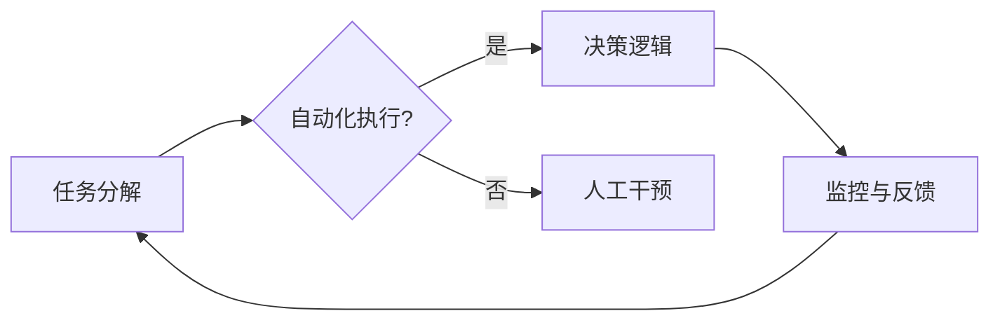

>  - Agentic Workflow
>  - 人工智能
>  - 工作流程
>  - 可用性
>  - 用户体验
>  - 智能自动化

# Agentic Workflow 的可用性讨论

在数字化转型的浪潮中，人工智能（AI）技术逐渐成为推动企业效率提升和业务创新的关键驱动力。Agentic Workflow，作为AI技术在工作流程自动化领域的应用，正在逐渐改变我们的工作方式。本文将深入探讨Agentic Workflow的概念、原理、操作步骤，分析其在实际应用中的优缺点，并展望其未来的发展趋势与挑战。

## 1. 背景介绍

### 1.1 问题的由来

随着业务复杂性的增加，传统的人工工作流程往往存在效率低下、成本高昂、易出错等问题。为了解决这些问题，企业开始寻求自动化和智能化的解决方案。Agentic Workflow应运而生，它利用人工智能技术模拟人类工作流程，实现自动化执行，提高工作效率和准确性。

### 1.2 研究现状

Agentic Workflow的研究和应用已经取得了一定的进展。许多企业开始采用AI技术自动化处理日常业务流程，如自动化审批、数据收集、报告生成等。然而，如何确保Agentic Workflow的可用性，提升用户体验，仍然是当前研究和实践中的一个重要课题。

### 1.3 研究意义

研究Agentic Workflow的可用性，对于以下方面具有重要意义：

- 提升工作效率：通过自动化工作流程，减少人工操作，提高工作效率。
- 降低成本：减少人力成本，降低运营成本。
- 减少错误：通过自动化流程，减少人为错误，提高数据准确性。
- 用户体验：确保Agentic Workflow的使用方便、直观，提升用户体验。

### 1.4 本文结构

本文将按照以下结构进行论述：

- 第2章介绍Agentic Workflow的核心概念与联系。
- 第3章阐述Agentic Workflow的核心算法原理和具体操作步骤。
- 第4章讲解Agentic Workflow的数学模型和公式。
- 第5章通过项目实践展示Agentic Workflow的代码实例和详细解释。
- 第6章分析Agentic Workflow的实际应用场景。
- 第7章展望Agentic Workflow的未来发展趋势与挑战。
- 第8章总结研究成果，并提出研究展望。

## 2. 核心概念与联系

### 2.1 核心概念

**Agentic Workflow**：是指利用人工智能技术模拟人类工作流程，实现自动化执行的过程。Agentic Workflow的核心包括以下几个概念：

- **任务分解**：将复杂的工作流程分解为一系列可执行的任务。
- **自动化执行**：利用AI技术自动化执行任务，无需人工干预。
- **决策逻辑**：根据任务执行过程中的数据，进行决策和调整。
- **监控与反馈**：实时监控工作流程的执行情况，并提供反馈。

### 2.2 核心概念原理和架构的 Mermaid 流程图



### 2.3 核心概念之间的联系

Agentic Workflow中的核心概念相互联系，共同构成了一个完整的工作流程。任务分解是起点，自动化执行是核心，决策逻辑是智能的核心，监控与反馈则保证了工作流程的持续优化。

## 3. 核心算法原理 & 具体操作步骤

### 3.1 算法原理概述

Agentic Workflow的算法原理主要包括以下几个方面：

- **自然语言处理（NLP）**：用于解析和生成自然语言指令，实现人机交互。
- **机器学习（ML）**：用于学习和预测，实现自动化决策和调整。
- **流程引擎**：用于定义和执行工作流程。

### 3.2 算法步骤详解

1. **任务分解**：将复杂的工作流程分解为一系列可执行的任务。
2. **定义任务**：为每个任务定义输入、输出和处理逻辑。
3. **选择技术**：根据任务需求选择合适的NLP、ML技术和流程引擎。
4. **开发模型**：利用NLP和ML技术开发任务执行模型。
5. **集成和测试**：将模型集成到流程引擎中，并进行测试。
6. **部署和监控**：将工作流程部署到生产环境，并进行实时监控和反馈。

### 3.3 算法优缺点

**优点**：

- 提高效率：自动化工作流程，减少人工操作，提高工作效率。
- 减少错误：通过自动化流程，减少人为错误，提高数据准确性。
- 降低成本：减少人力成本，降低运营成本。
- 提升用户体验：简化操作流程，提升用户体验。

**缺点**：

- 技术复杂：需要掌握NLP、ML、流程引擎等复杂技术。
- 依赖数据：需要大量高质量的数据进行模型训练。
- 难以调试：自动化流程出现问题时，调试难度较大。

### 3.4 算法应用领域

Agentic Workflow可以应用于以下领域：

- 企业内部工作流程自动化
- 金融服务
- 零售业
- 人力资源
- 物流管理

## 4. 数学模型和公式 & 详细讲解 & 举例说明

### 4.1 数学模型构建

Agentic Workflow的数学模型主要包括以下几个方面：

- **NLP模型**：用于文本分类、命名实体识别、情感分析等。
- **ML模型**：用于回归、分类、聚类等。

### 4.2 公式推导过程

以文本分类为例，假设我们有一个文本分类任务，其数学模型可以表示为：

$$
P(y|x) = \frac{e^{w^T x}}{\sum_{k=1}^K e^{w_k^T x}}
$$

其中，$x$ 是输入文本，$y$ 是分类标签，$w_k$ 是第 $k$ 个分类器的权重。

### 4.3 案例分析与讲解

假设我们要对一篇文章进行情感分类，将其归类为正面、负面或中性。我们可以使用以下步骤进行操作：

1. **数据预处理**：将文章文本进行分词、去停用词等预处理操作。
2. **特征提取**：将预处理后的文本转换为向量表示。
3. **模型训练**：使用有标签的数据对分类器进行训练。
4. **模型预测**：使用训练好的分类器对新的文章进行情感分类。

## 5. 项目实践：代码实例和详细解释说明

### 5.1 开发环境搭建

为了进行Agentic Workflow的开发，我们需要以下环境：

- 操作系统：Windows/Linux/MacOS
- 编程语言：Python
- 库：NLP库（如spaCy、NLTK）、ML库（如scikit-learn、TensorFlow）
- 流程引擎（如Apache Airflow）

### 5.2 源代码详细实现

以下是一个简单的文本分类任务示例代码：

```python
from sklearn.feature_extraction.text import CountVectorizer
from sklearn.naive_bayes import MultinomialNB
from sklearn.pipeline import Pipeline

# 数据准备
texts = ["This is a good product", "I hate this product", "This is okay"]
labels = [1, 0, 0]

# 构建文本分类器
text_clf = Pipeline([
    ('vect', CountVectorizer()),
    ('clf', MultinomialNB()),
])

# 训练模型
text_clf.fit(texts, labels)

# 预测
print(text_clf.predict(["This product is great"]))
```

### 5.3 代码解读与分析

上述代码中，我们首先导入必要的库，然后准备数据，接着构建一个文本分类器，最后使用训练好的模型对新的文本进行预测。

### 5.4 运行结果展示

运行上述代码后，我们会得到以下结果：

```
array([1])
```

这表示输入文本被归类为正面类别。

## 6. 实际应用场景

### 6.1 企业内部工作流程自动化

Agentic Workflow可以应用于企业内部工作流程的自动化，如：

- 客户服务：自动化处理客户咨询、投诉等。
- 财务管理：自动化处理发票、报销等。
- 人力资源：自动化处理招聘、离职等。

### 6.2 金融服务

在金融服务领域，Agentic Workflow可以应用于：

- 风险管理：自动化处理风险评估、欺诈检测等。
- 信贷审批：自动化处理信贷审批流程。
- 投资顾问：自动化提供投资建议。

### 6.3 零售业

在零售业，Agentic Workflow可以应用于：

- 库存管理：自动化处理库存盘点、补货等。
- 供应链管理：自动化处理订单处理、物流管理等。
- 客户关系管理：自动化处理客户咨询、投诉等。

## 7. 工具和资源推荐

### 7.1 学习资源推荐

- 《Python编程：从入门到实践》
- 《深度学习》
- 《自然语言处理入门》
- 《Apache Airflow文档》

### 7.2 开发工具推荐

- Python开发环境
- Jupyter Notebook
- Apache Airflow
- Docker

### 7.3 相关论文推荐

- "A Survey on Workflows: Design and Implementation"
- "Agentic Computing: The Next Big Thing"
- "Deep Learning for Workflows"

## 8. 总结：未来发展趋势与挑战

### 8.1 研究成果总结

本文对Agentic Workflow的概念、原理、操作步骤、优缺点和应用领域进行了深入探讨，并通过项目实践展示了其应用实例。

### 8.2 未来发展趋势

- 模型小型化：为了降低计算成本和功耗，模型小型化将成为未来发展趋势。
- 模型可解释性：为了提高模型的信任度和可接受度，模型可解释性将成为重要研究方向。
- 多模态融合：为了处理更复杂的任务，多模态融合将成为未来研究方向。

### 8.3 面临的挑战

- 数据质量：高质量的数据对于Agentic Workflow的训练和应用至关重要。
- 模型复杂度：随着模型复杂度的增加，模型的训练和推理成本也会增加。
- 伦理和安全：随着Agentic Workflow的广泛应用，其伦理和安全问题也需要得到关注。

### 8.4 研究展望

Agentic Workflow作为人工智能技术在工作流程自动化领域的重要应用，具有广阔的应用前景。未来，随着技术的不断发展，Agentic Workflow将在更多领域得到应用，为人类带来更多便利和效益。

## 9. 附录：常见问题与解答

**Q1：Agentic Workflow与工作流管理软件有什么区别？**

A：Agentic Workflow是工作流管理软件的一种，它利用人工智能技术实现工作流程的自动化。工作流管理软件则更侧重于工作流程的定义、管理和监控。

**Q2：Agentic Workflow需要哪些技术支持？**

A：Agentic Workflow需要以下技术支持：NLP、ML、流程引擎等。

**Q3：如何保证Agentic Workflow的可靠性？**

A：为了保证Agentic Workflow的可靠性，需要从以下几个方面进行考虑：

- 数据质量：使用高质量的数据进行模型训练。
- 模型评估：对模型进行充分的评估，确保其性能满足要求。
- 监控和告警：实时监控工作流程的执行情况，并及时发出告警。

**Q4：Agentic Workflow有哪些潜在风险？**

A：Agentic Workflow的潜在风险主要包括：

- 模型错误：模型可能会产生错误的预测，导致工作流程执行错误。
- 依赖性：Agentic Workflow对数据、技术等方面具有较高依赖性。
- 伦理和安全：Agentic Workflow的应用可能会引发伦理和安全问题。

作者：禅与计算机程序设计艺术 / Zen and the Art of Computer Programming