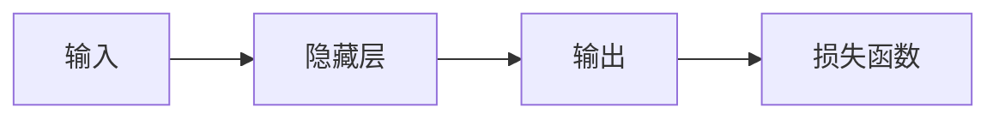

> 人工智能，机器学习，深度学习，伦理挑战，未来趋势，技术突破

# Andrej Karpathy：人工智能的未来发展挑战

人工智能（AI）正以前所未有的速度改变着我们的世界。从自动驾驶汽车到智能助手，从医疗诊断到金融服务，AI的应用领域几乎无所不在。Andrej Karpathy，这位曾经的特斯拉AI首席科学家，以其对AI的深刻见解而闻名。本文将探讨Andrej Karpathy提出的AI未来发展的挑战，并分析这些挑战背后的技术和社会因素。

## 1. 背景介绍

### 1.1 AI的快速发展

近年来，随着计算能力的提升、数据的爆炸性增长以及算法的进步，AI技术取得了飞速发展。深度学习，尤其是神经网络，成为AI领域的热门技术。然而，随着AI技术的应用日益广泛，其潜在的风险和挑战也逐渐显现。

### 1.2 Andrej Karpathy的视角

Andrej Karpathy是一位在AI领域具有重要影响力的专家。他在特斯拉担任AI首席科学家期间，领导了自动驾驶技术的研究。他的观点对AI的未来发展具有重要的参考价值。

### 1.3 本文结构

本文将分为以下几个部分：
- 核心概念与联系
- 核心算法原理 & 具体操作步骤
- 数学模型和公式 & 详细讲解 & 举例说明
- 项目实践：代码实例和详细解释说明
- 实际应用场景
- 工具和资源推荐
- 总结：未来发展趋势与挑战
- 附录：常见问题与解答

## 2. 核心概念与联系

为了更好地理解AI的未来发展挑战，我们首先需要了解一些核心概念。

### 2.1 AI的定义

AI，即人工智能，是指由人制造出的系统所表现出的智能行为。它包括机器学习、深度学习、自然语言处理等多个领域。

### 2.2 机器学习

机器学习是AI的一个子领域，它使计算机能够通过数据和经验学习，而不是通过编程。

### 2.3 深度学习

深度学习是机器学习的一个分支，它使用多层神经网络来学习数据中的复杂模式。

### 2.4 Mermaid 流程图

以下是一个简单的Mermaid流程图，展示了AI、机器学习和深度学习之间的关系：

```mermaid
graph LR
    A[人工智能(AI)] --> B{机器学习(Machine Learning)}
    B --> C{深度学习(Deep Learning)}
    C --> D[自然语言处理(NLP)]
    C --> E[计算机视觉(CV)]
    C --> F[强化学习(Reinforcement Learning)]
```

## 3. 核心算法原理 & 具体操作步骤

### 3.1 算法原理概述

AI的发展离不开算法的进步。以下是几种在AI领域广泛应用的算法：

- **神经网络**：由多个神经元组成的计算模型，能够通过学习数据集来识别模式和进行预测。
- **卷积神经网络（CNN）**：适用于图像识别和处理。
- **循环神经网络（RNN）**：适用于序列数据处理，如时间序列分析、语言处理等。
- **生成对抗网络（GAN）**：由生成器和判别器组成的模型，能够生成逼真的数据。

### 3.2 算法步骤详解

以下是一个基于神经网络的简单算法步骤：

1. **数据收集**：收集用于训练的数据集。
2. **数据预处理**：对数据进行清洗、归一化等操作。
3. **模型构建**：选择合适的神经网络模型。
4. **模型训练**：使用训练数据训练模型。
5. **模型评估**：使用测试数据评估模型性能。
6. **模型优化**：根据评估结果调整模型参数。

### 3.3 算法优缺点

每种算法都有其优缺点：

- **神经网络**：能够处理复杂数据，但参数调整困难，计算量大。
- **CNN**：在图像识别任务中表现优异，但对非视觉数据的处理能力有限。
- **RNN**：在序列数据处理中表现良好，但存在梯度消失问题。
- **GAN**：能够生成高质量的数据，但训练不稳定，容易陷入模式。

### 3.4 算法应用领域

这些算法在以下领域得到了广泛应用：

- **图像识别**：如人脸识别、物体检测等。
- **语音识别**：如语音助手、语音翻译等。
- **自然语言处理**：如机器翻译、文本分类等。
- **推荐系统**：如电影推荐、商品推荐等。

## 4. 数学模型和公式 & 详细讲解 & 举例说明

### 4.1 数学模型构建

AI算法通常基于数学模型。以下是一些常见的数学模型：

- **神经网络**：由多个神经元组成，每个神经元都包含一个激活函数。
- **卷积神经网络**：使用卷积操作提取图像特征。
- **循环神经网络**：使用循环连接处理序列数据。
- **生成对抗网络**：由生成器和判别器组成，生成器和判别器之间进行对抗。

### 4.2 公式推导过程

以下是一些常见的公式：

- **神经网络激活函数**：$f(x) = \sigma(w^T x + b)$
- **卷积运算**：$h(x,y) = f(g(x,y))$
- **循环神经网络**：$h_t = f(x_t, h_{t-1})$

### 4.3 案例分析与讲解

以下是一个简单的神经网络模型实例：



在这个模型中，输入A经过隐藏层B处理后，生成输出C。损失函数D用于评估模型性能。

## 5. 项目实践：代码实例和详细解释说明

### 5.1 开发环境搭建

为了进行AI项目实践，你需要以下开发环境：

- Python编程语言
- PyTorch或TensorFlow深度学习框架
- Jupyter Notebook或PyCharm等开发工具

### 5.2 源代码详细实现

以下是一个简单的神经网络代码实例：

```python
import torch
import torch.nn as nn

class NeuralNetwork(nn.Module):
    def __init__(self):
        super(NeuralNetwork, self).__init__()
        self.hidden_layer = nn.Linear(784, 128)
        self.output_layer = nn.Linear(128, 10)

    def forward(self, x):
        x = torch.relu(self.hidden_layer(x))
        x = self.output_layer(x)
        return x

# 创建模型、损失函数和优化器
model = NeuralNetwork()
criterion = nn.CrossEntropyLoss()
optimizer = torch.optim.Adam(model.parameters(), lr=0.001)

# 训练模型
for epoch in range(10):
    # 假设X_train和y_train是训练数据
    # X_train = ...
    # y_train = ...
    optimizer.zero_grad()
    outputs = model(X_train)
    loss = criterion(outputs, y_train)
    loss.backward()
    optimizer.step()

# 评估模型
# ...
```

### 5.3 代码解读与分析

这段代码定义了一个简单的神经网络模型，并使用交叉熵损失函数进行训练。模型由一个隐藏层和一个输出层组成，使用ReLU激活函数。

### 5.4 运行结果展示

运行上述代码后，你将看到模型的损失函数逐渐降低，表明模型性能在提高。

## 6. 实际应用场景

### 6.1 人工智能在医疗领域的应用

AI在医疗领域的应用前景广阔。例如，使用AI进行疾病诊断、药物研发、患者监护等。

### 6.2 人工智能在金融领域的应用

AI在金融领域的应用包括风险评估、欺诈检测、量化交易等。

### 6.3 人工智能在零售领域的应用

AI在零售领域的应用包括需求预测、库存管理、个性化推荐等。

## 7. 工具和资源推荐

### 7.1 学习资源推荐

- 《深度学习》（Goodfellow et al.）
- 《Python深度学习》（François Chollet）
- 《机器学习实战》（Peter Harrington）

### 7.2 开发工具推荐

- PyTorch
- TensorFlow
- Jupyter Notebook

### 7.3 相关论文推荐

- "ImageNet Classification with Deep Convolutional Neural Networks"（Alex Krizhevsky et al.）
- "Sequence to Sequence Learning with Neural Networks"（Ilya Sutskever et al.）
- "Generative Adversarial Nets"（Ian Goodfellow et al.）

## 8. 总结：未来发展趋势与挑战

### 8.1 研究成果总结

本文介绍了AI领域的核心概念、算法原理、实际应用场景，并分析了Andrej Karpathy提出的AI未来发展的挑战。

### 8.2 未来发展趋势

- AI技术将进一步与实体经济深度融合，推动产业升级。
- AI伦理和安全问题将得到更多关注。
- 量子计算等新技术的出现将为AI带来新的发展机遇。

### 8.3 面临的挑战

- AI算法的可解释性和透明度不足。
- AI伦理和安全问题。
- AI技术失业和隐私问题。

### 8.4 研究展望

- 开发更加安全、可靠、可解释的AI技术。
- 探索AI在更多领域的应用。
- 建立健全的AI伦理和安全规范。

## 9. 附录：常见问题与解答

**Q1：什么是AI？**

A：AI，即人工智能，是指由人制造出的系统所表现出的智能行为。

**Q2：什么是机器学习？**

A：机器学习是AI的一个子领域，它使计算机能够通过数据和经验学习，而不是通过编程。

**Q3：什么是深度学习？**

A：深度学习是机器学习的一个分支，它使用多层神经网络来学习数据中的复杂模式。

**Q4：AI技术有哪些应用领域？**

A：AI技术广泛应用于医疗、金融、零售、交通、教育等多个领域。

**Q5：AI技术有哪些挑战？**

A：AI技术面临的挑战包括算法可解释性、伦理和安全问题，以及技术失业和隐私问题。

---

作者：禅与计算机程序设计艺术 / Zen and the Art of Computer Programming