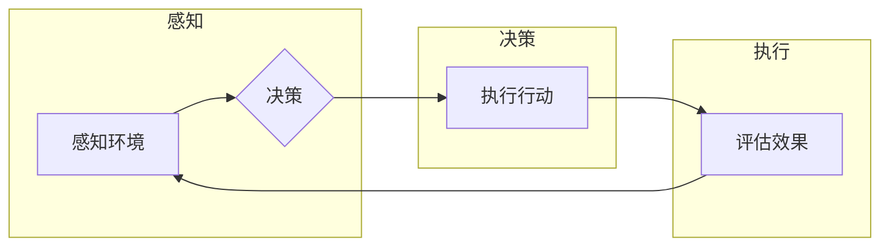

# AI Agent: AI的下一个风口 大模型时代的AI

> 关键词：AI Agent, 大模型, 自主导航，人机协同，智能化系统，知识图谱，强化学习，未来趋势

## 1. 背景介绍

随着人工智能技术的飞速发展，我们已经见证了计算机视觉、自然语言处理、语音识别等领域的突破。然而，这些技术大多局限于特定任务的执行，缺乏全局的决策能力和自主的行动能力。AI Agent，作为人工智能领域的新兴概念，正逐渐成为下一个风口。它代表着人工智能从“工具”向“伙伴”转变的趋势，预示着大模型时代AI的全新篇章。

### 1.1 问题的由来

传统的人工智能系统通常以完成特定任务为目标，如图像识别、语音识别等。这些系统在各自领域取得了显著的成果，但它们往往缺乏以下能力：

- **自主决策能力**：无法根据复杂环境和目标进行自主决策。
- **协同工作能力**：难以与其他系统或人进行有效的协同工作。
- **持续学习能力**：无法持续从经验中学习并优化自身行为。

AI Agent的出现，旨在解决这些问题，它不仅能够执行特定任务，还能够自主决策、协同工作，并不断学习提升自身能力。

### 1.2 研究现状

AI Agent的研究已经取得了显著进展，主要体现在以下几个方面：

- **强化学习**：通过与环境交互学习最优策略，实现自主决策。
- **知识图谱**：将知识表示为图结构，为AI Agent提供丰富的背景知识。
- **多智能体系统**：多个AI Agent协同工作，完成复杂任务。
- **人机协同**：AI Agent与人类用户共同完成任务，提高效率。

### 1.3 研究意义

AI Agent的研究具有重要的理论意义和应用价值：

- **理论意义**：推动人工智能从弱人工智能向强人工智能发展。
- **应用价值**：构建智能化系统，提高生产效率，改善生活质量。

### 1.4 本文结构

本文将围绕AI Agent的核心概念、算法原理、应用场景、未来发展趋势等方面进行探讨。具体内容包括：

- 核心概念与联系
- 核心算法原理与操作步骤
- 数学模型与公式
- 项目实践
- 实际应用场景
- 工具和资源推荐
- 总结与展望

## 2. 核心概念与联系

### 2.1 核心概念

#### AI Agent

AI Agent是指具有感知、决策和行动能力的智能体，它能够根据环境状态和目标，自主选择行动以实现目标。

#### 自主导航

自主导航是指AI Agent在未知环境中自主规划路径，实现自主移动。

#### 人机协同

人机协同是指AI Agent与人类用户共同完成任务，提高工作效率。

#### 智能化系统

智能化系统是指由多个AI Agent组成的系统，能够完成复杂任务。

#### 知识图谱

知识图谱是一种结构化知识库，用于表示实体、关系和属性。

#### 强化学习

强化学习是一种通过与环境交互学习最优策略的学习方法。

### 2.2 Mermaid 流程图

以下是AI Agent的工作流程图：



### 2.3 核心概念联系

AI Agent通过感知环境状态，根据预设目标和策略进行决策，然后执行行动，并根据行动效果评估自身性能，不断调整策略。在这个过程中，知识图谱提供了丰富的背景知识，强化学习实现了策略的优化。

## 3. 核心算法原理 & 具体操作步骤

### 3.1 算法原理概述

AI Agent的核心算法包括感知、决策和行动三个部分。

#### 感知

感知模块负责收集环境信息，如传感器数据、图像、语音等。常用的感知技术包括：

- 传感器融合：将来自不同传感器的数据进行融合，提高感知精度。
- 多模态融合：将图像、语音、文本等多种模态信息进行融合，提供更全面的感知。

#### 决策

决策模块根据感知到的环境信息和预设目标，选择最优行动。常用的决策算法包括：

- 强化学习：通过与环境交互学习最优策略。
- 规则学习：根据预先定义的规则进行决策。
- 深度学习：使用神经网络进行决策。

#### 行动

行动模块根据决策结果，控制执行器（如机器人手臂、车辆等）进行行动。常用的行动方法包括：

- 控制系统：如PID控制器、模糊控制器等。
- 机器学习模型：如深度学习模型、强化学习模型等。

### 3.2 算法步骤详解

以下是一个简单的AI Agent算法步骤：

1. 感知环境信息。
2. 根据预设目标和策略，选择最优行动。
3. 执行行动。
4. 评估行动效果。
5. 根据评估结果调整策略。
6. 重复步骤1-5。

### 3.3 算法优缺点

#### 强化学习

优点：

- 能够学习到复杂的环境和策略。
- 不依赖于大量标注数据。

缺点：

- 学习过程可能非常耗时。
- 可能陷入局部最优。

#### 深度学习

优点：

- 能够学习到复杂的特征表示。
- 需要大量数据进行训练。

缺点：

- 模型可解释性差。
- 模型参数难以优化。

### 3.4 算法应用领域

AI Agent算法在以下领域有着广泛的应用：

- 机器人控制
- 自动驾驶
- 游戏AI
- 虚拟现实
- 金融服务

## 4. 数学模型和公式 & 详细讲解 & 举例说明

### 4.1 数学模型构建

AI Agent的数学模型主要包括感知模型、决策模型和行动模型。

#### 感知模型

感知模型通常使用神经网络进行构建，例如卷积神经网络（CNN）用于图像识别，循环神经网络（RNN）用于序列数据处理。

$$
y = f(W, b, x)
$$

其中，$y$ 为输出，$x$ 为输入，$W$ 和 $b$ 分别为权重和偏置。

#### 决策模型

决策模型可以使用强化学习算法进行构建，例如Q-learning、Deep Q-Network（DQN）等。

$$
Q(s,a) = \sum_{s'}\gamma Q(s',a')P(s'|s,a)
$$

其中，$Q(s,a)$ 为状态 $s$ 下采取行动 $a$ 的期望回报，$\gamma$ 为折扣因子，$P(s'|s,a)$ 为从状态 $s$ 采取行动 $a$ 转移到状态 $s'$ 的概率。

#### 行动模型

行动模型可以使用控制理论或机器学习算法进行构建，例如PID控制器、模糊控制器、深度强化学习等。

### 4.2 公式推导过程

#### 感知模型

以CNN为例，其数学模型为：

$$
y = f(W, b, x)
$$

其中，$f$ 为激活函数，$W$ 和 $b$ 分别为权重和偏置，$x$ 为输入。

#### 决策模型

以DQN为例，其数学模型为：

$$
Q(s,a) = \sum_{s'}\gamma Q(s',a')P(s'|s,a)
$$

其中，$Q(s,a)$ 为状态 $s$ 下采取行动 $a$ 的期望回报，$\gamma$ 为折扣因子，$P(s'|s,a)$ 为从状态 $s$ 采取行动 $a$ 转移到状态 $s'$ 的概率。

#### 行动模型

以PID控制器为例，其数学模型为：

$$
u = K_p(e) + K_i\int e dt + K_d\frac{de}{dt}
$$

其中，$u$ 为控制信号，$e$ 为误差，$K_p$、$K_i$ 和 $K_d$ 分别为比例、积分和微分系数。

### 4.3 案例分析与讲解

以下是一个简单的AI Agent案例：自动驾驶。

1. **感知模型**：使用CNN对摄像头捕获的图像进行处理，识别道路、车辆、行人等元素。
2. **决策模型**：使用DQN学习自动驾驶策略，包括加速、减速、转向等操作。
3. **行动模型**：使用PID控制器控制汽车的油门、刹车和方向盘。

通过这种方式，AI Agent能够在道路上自主行驶，避免碰撞，并到达目的地。

## 5. 项目实践：代码实例和详细解释说明

### 5.1 开发环境搭建

为了进行AI Agent项目实践，我们需要以下开发环境：

- 操作系统：Windows、Linux或macOS
- 编程语言：Python
- 依赖库：TensorFlow、Keras、PyTorch等
- 传感器：摄像头、GPS等（根据实际需求）

### 5.2 源代码详细实现

以下是一个简单的AI Agent代码示例：

```python
import cv2
import numpy as np
import tensorflow as tf

# 摄像头捕获图像
cap = cv2.VideoCapture(0)

# 加载模型
model = tf.keras.models.load_model('model.h5')

while True:
    ret, frame = cap.read()
    if not ret:
        break

    # 处理图像
    processed_image = preprocess_image(frame)

    # 预测行动
    prediction = model.predict(processed_image)

    # 执行行动
    actuate_car(prediction)

    # 显示图像
    cv2.imshow('frame', frame)
    if cv2.waitKey(1) & 0xFF == ord('q'):
        break

cap.release()
cv2.destroyAllWindows()
```

### 5.3 代码解读与分析

以上代码演示了使用摄像头捕获图像，然后使用模型进行预测，并执行行动的过程。

- `cv2.VideoCapture(0)` 用于捕获摄像头视频。
- `preprocess_image` 函数用于对图像进行预处理，例如归一化、缩放等。
- `model.predict(processed_image)` 使用模型对预处理后的图像进行预测。
- `actuate_car(prediction)` 根据预测结果控制汽车的动作。

### 5.4 运行结果展示

运行以上代码，AI Agent将使用摄像头捕获的图像进行预测，并根据预测结果控制汽车的动作。

## 6. 实际应用场景

### 6.1 自主导航

自主导航是AI Agent最典型的应用场景之一。通过感知环境信息，AI Agent可以自主规划路径，实现自主移动。

### 6.2 人机协同

在工业生产、医疗护理等领域，AI Agent可以与人类用户协同工作，提高工作效率。

### 6.3 智能家居

AI Agent可以应用于智能家居系统，实现自动控制家电、调节室内环境等功能。

### 6.4 金融服务

AI Agent可以应用于金融服务领域，如智能投顾、风险管理等。

### 6.5 教育领域

AI Agent可以应用于教育领域，如个性化学习、智能辅导等。

## 7. 工具和资源推荐

### 7.1 学习资源推荐

- 《深度学习》系列书籍
- 《机器学习实战》
- 《强化学习》
- 《Python编程：从入门到实践》

### 7.2 开发工具推荐

- TensorFlow
- Keras
- PyTorch
- OpenCV

### 7.3 相关论文推荐

- DeepMind的AlphaGo论文
- OpenAI的GPT系列论文
- Google的BERT论文

## 8. 总结：未来发展趋势与挑战

### 8.1 研究成果总结

本文对AI Agent的核心概念、算法原理、应用场景和未来发展趋势进行了探讨。AI Agent作为人工智能领域的新兴概念，具有广阔的应用前景。

### 8.2 未来发展趋势

- AI Agent将更加智能化、自动化。
- AI Agent将与人类更加紧密地协同工作。
- AI Agent将在更多领域得到应用。

### 8.3 面临的挑战

- AI Agent的自主决策能力仍需提升。
- AI Agent的协同工作能力仍需加强。
- AI Agent的伦理和安全问题仍需解决。

### 8.4 研究展望

未来，AI Agent将推动人工智能向更高层次发展，为人类社会带来更多便利和福祉。

## 9. 附录：常见问题与解答

**Q1：什么是AI Agent？**

A：AI Agent是指具有感知、决策和行动能力的智能体，它能够根据环境状态和目标，自主选择行动以实现目标。

**Q2：AI Agent有哪些应用场景？**

A：AI Agent可以应用于自动驾驶、人机协同、智能家居、金融服务、教育领域等。

**Q3：如何构建AI Agent？**

A：构建AI Agent需要以下步骤：
1. 定义任务和目标。
2. 设计感知模型、决策模型和行动模型。
3. 训练和优化模型。
4. 部署和应用模型。

**Q4：AI Agent的挑战有哪些？**

A：AI Agent的挑战包括自主决策能力、协同工作能力、伦理和安全问题等。

**Q5：AI Agent的未来发展趋势是什么？**

A：AI Agent的未来发展趋势包括更加智能化、自动化、人机协同以及更多领域的应用。

作者：禅与计算机程序设计艺术 / Zen and the Art of Computer Programming