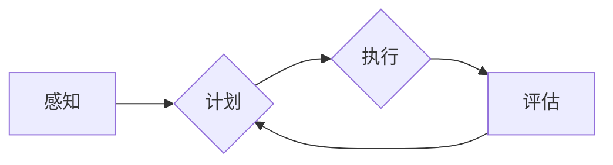

> 关键词：AI Agent, 人工智能代理, 强化学习, 自然语言处理, 知识图谱, 机器人学, 人机交互

# AI Agent: AI的下一个风口 对研究者和实践者的建议

人工智能（AI）的发展正在以前所未有的速度推进，从自动驾驶汽车到智能个人助理，从医疗诊断到金融分析，AI的应用领域不断扩大。在这个背景下，AI Agent作为人工智能的一个核心概念和关键技术，正逐渐成为AI领域的下一个风口。本文将深入探讨AI Agent的概念、原理、应用，并提出对研究者和实践者的建议。

## 1. 背景介绍

### 1.1 AI Agent的兴起

AI Agent的概念源于人工智能的早期研究，它指的是能够感知环境并基于自身目标和策略采取行动的实体。随着深度学习、强化学习等技术的发展，AI Agent逐渐从理论走向实践，成为AI领域的一个重要研究方向。

### 1.2 AI Agent的研究意义

AI Agent的研究对于推动人工智能技术发展具有重要意义：
- **实现更智能的交互**：AI Agent能够理解人类语言和意图，与人类进行自然交互，提供更加个性化和智能化的服务。
- **构建智能系统**：AI Agent可以用于构建智能系统，如智能家居、智能交通系统等，提高生活质量和效率。
- **推动自动化进程**：AI Agent可以自动化执行重复性任务，提高生产效率，降低人力成本。

### 1.3 AI Agent的发展现状

目前，AI Agent的研究已经取得了一系列成果，包括：
- **强化学习**：通过学习与环境交互的奖励信号，AI Agent能够不断优化自己的行为策略。
- **自然语言处理**：AI Agent能够理解自然语言，与人类进行自然对话。
- **知识图谱**：AI Agent可以利用知识图谱进行推理和决策，提供更加智能的服务。

## 2. 核心概念与联系

### 2.1 AI Agent的核心概念

**AI Agent**：指能够感知环境、制定计划、执行动作、评估结果的智能实体。

**感知**：AI Agent通过传感器收集环境信息。

**计划**：AI Agent根据目标和当前状态，制定行动计划。

**执行**：AI Agent执行行动计划，与环境交互。

**评估**：AI Agent评估行动结果，调整策略。

### 2.2 AI Agent的架构



### 2.3 AI Agent与相关技术的联系

- **强化学习**：用于训练AI Agent的决策策略。
- **自然语言处理**：用于AI Agent理解人类语言和意图。
- **知识图谱**：用于AI Agent进行推理和决策。

## 3. 核心算法原理 & 具体操作步骤

### 3.1 算法原理概述

AI Agent的核心算法主要包括以下几种：

- **强化学习**：通过与环境交互，学习最优策略。
- **蒙特卡洛树搜索**：在复杂的决策过程中，选择最优动作。
- **深度学习**：用于感知、计划和决策。

### 3.2 算法步骤详解

1. **感知**：AI Agent通过传感器收集环境信息。
2. **计划**：AI Agent根据目标和当前状态，利用强化学习、蒙特卡洛树搜索等方法制定行动计划。
3. **执行**：AI Agent执行行动计划，与环境交互。
4. **评估**：AI Agent评估行动结果，调整策略。

### 3.3 算法优缺点

- **强化学习**：能够适应动态环境，但训练过程可能需要较长时间。
- **蒙特卡洛树搜索**：适用于复杂决策过程，但计算量较大。
- **深度学习**：能够处理复杂特征，但需要大量标注数据。

### 3.4 算法应用领域

AI Agent的应用领域非常广泛，包括：
- **智能机器人**：用于工业自动化、家庭服务、医疗辅助等领域。
- **智能客服**：用于提供24/7在线客服服务。
- **自动驾驶**：用于自动驾驶汽车、无人机等。

## 4. 数学模型和公式 & 详细讲解 & 举例说明

### 4.1 数学模型构建

AI Agent的数学模型主要包括以下部分：

- **状态空间**：描述AI Agent所处的环境。
- **动作空间**：描述AI Agent可以采取的动作。
- **奖励函数**：描述AI Agent采取动作后的奖励。
- **策略函数**：描述AI Agent的决策策略。

### 4.2 公式推导过程

假设状态空间为$S$，动作空间为$A$，奖励函数为$R(s, a)$，策略函数为$\pi(s)$，则AI Agent的目标是最小化累积奖励：

$$
J(\pi) = \sum_{t=0}^{\infty} R(s_t, \pi(s_t))
$$

其中$s_t$为第$t$时刻的状态，$a_t$为第$t$时刻采取的动作。

### 4.3 案例分析与讲解

以下是一个简单的AI Agent案例：一个机器人在一个二维空间中移动，目标是到达目标位置。状态空间为机器人的位置，动作空间为上下左右移动，奖励函数为到达目标位置时获得正奖励，否则获得负奖励。

通过强化学习算法，机器人可以学习到到达目标位置的最优策略。

## 5. 项目实践：代码实例和详细解释说明

### 5.1 开发环境搭建

以下是使用Python和OpenAI Gym库实现一个简单的AI Agent的代码：

```python
import gym
import numpy as np
import random

# 创建环境
env = gym.make('CartPole-v1')

# 定义策略
def policy(state):
    if random.random() < 0.1:
        return 1  # 随机选择动作
    else:
        return 0  # 按照固定策略选择动作

# 执行环境
for _ in range(1000):
    state = env.reset()
    done = False
    while not done:
        action = policy(state)
        state, reward, done, _ = env.step(action)
        env.render()
```

### 5.2 源代码详细实现

上述代码中，我们创建了一个CartPole环境，定义了一个简单的策略，并通过环境模拟机器人移动的过程。

### 5.3 代码解读与分析

该代码首先导入了必要的库，创建了CartPole环境，定义了一个策略函数，最后通过循环执行环境，模拟机器人移动的过程。

### 5.4 运行结果展示

运行上述代码，可以看到机器人在CartPole环境中随机移动，最终无法保持平衡。

## 6. 实际应用场景

AI Agent在实际应用中具有广泛的应用场景，以下是一些典型的应用案例：

- **智能客服**：AI Agent可以理解客户的问题，并给出相应的回答。
- **自动驾驶**：AI Agent可以控制车辆行驶，实现自动驾驶。
- **智能家居**：AI Agent可以控制家居设备，实现自动化管理。
- **医疗辅助**：AI Agent可以帮助医生进行诊断和治疗。

## 7. 工具和资源推荐

### 7.1 学习资源推荐

- **书籍**：《Artificial Intelligence: A Modern Approach》、《Reinforcement Learning: An Introduction》
- **在线课程**：Coursera、edX上的机器学习、深度学习、强化学习课程
- **开源库**：OpenAI Gym、TensorFlow、PyTorch

### 7.2 开发工具推荐

- **开发环境**：Python、Jupyter Notebook
- **深度学习框架**：TensorFlow、PyTorch
- **强化学习库**：OpenAI Gym、stable_baselines

### 7.3 相关论文推荐

- **强化学习**：《Human-Level Control Through Deep Reinforcement Learning》、《Algorithms for Reinforcement Learning》
- **自然语言处理**：《BERT: Pre-training of Deep Bidirectional Transformers for Language Understanding》、《Generative Adversarial Nets》
- **知识图谱**：《Knowledge Graph Embedding: A Survey of Approaches and Applications》

## 8. 总结：未来发展趋势与挑战

### 8.1 研究成果总结

AI Agent的研究已经取得了显著成果，但仍存在一些挑战。

### 8.2 未来发展趋势

- **多模态AI Agent**：结合多种感知方式，如视觉、听觉、触觉等。
- **可解释AI Agent**：提高AI Agent决策过程的可解释性。
- **通用AI Agent**：实现跨领域的AI Agent。

### 8.3 面临的挑战

- **数据隐私**：如何保护用户数据隐私。
- **伦理道德**：如何处理AI Agent的伦理道德问题。
- **计算资源**：如何降低AI Agent的计算成本。

### 8.4 研究展望

AI Agent的研究将推动人工智能技术向更加智能化、通用化、安全化的方向发展。

## 9. 附录：常见问题与解答

**Q1：什么是AI Agent？**

A：AI Agent是一种能够感知环境、制定计划、执行动作、评估结果的智能实体。

**Q2：AI Agent有哪些应用场景？**

A：AI Agent的应用场景非常广泛，包括智能客服、自动驾驶、智能家居、医疗辅助等。

**Q3：如何开发AI Agent？**

A：开发AI Agent需要使用强化学习、自然语言处理、知识图谱等技术。

**Q4：AI Agent的研究前景如何？**

A：AI Agent的研究前景非常广阔，有望推动人工智能技术向更加智能化、通用化、安全化的方向发展。

作者：禅与计算机程序设计艺术 / Zen and the Art of Computer Programming