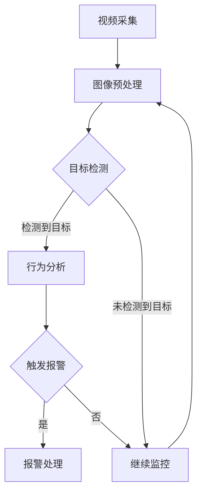

# AI人工智能代理工作流 AI Agent WorkFlow：在视频监控中的应用

> 关键词：AI代理，工作流，视频监控，目标检测，行为分析，智能决策，机器学习，深度学习

## 1. 背景介绍

随着人工智能技术的飞速发展，视频监控领域也迎来了革命性的变革。传统的视频监控系统主要依靠人工进行监控和分析，效率低下且容易出错。而基于AI的智能监控系统能够自动识别、分析和报警，大大提高了监控的效率和准确性。本文将探讨AI人工智能代理工作流（AI Agent WorkFlow）在视频监控中的应用，以实现高效、智能的监控解决方案。

### 1.1 视频监控的现状与挑战

传统的视频监控系统主要依赖以下功能：

- **图像采集**：通过摄像头采集视频画面。
- **图像存储**：将采集到的视频存储在硬盘或云端。
- **图像检索**：通过关键词或时间范围检索视频片段。

然而，这些系统存在以下挑战：

- **人工依赖**：需要大量人力进行实时监控和事件处理。
- **效率低下**：无法实时处理大量视频数据。
- **误报率高**：容易受到光线、角度等因素的影响，导致误报率高。

### 1.2 AI在视频监控中的应用

随着深度学习技术的进步，AI在视频监控中的应用越来越广泛，主要包括以下方面：

- **目标检测**：识别视频中的物体和人物。
- **行为分析**：分析人物的行为模式，如吸烟、打架等。
- **智能决策**：根据分析结果进行报警或自动处理。

### 1.3 AI Agent WorkFlow的提出

为了更好地实现智能视频监控，本文提出了AI人工智能代理工作流（AI Agent WorkFlow）。它是一种基于AI的自动化工作流程，能够根据视频监控的需求，自动执行一系列的任务，如目标检测、行为分析、报警等。

## 2. 核心概念与联系

### 2.1 核心概念

- **AI代理**：指能够自动执行任务的智能实体，具有感知、决策和执行能力。
- **工作流**：指一系列有序的任务步骤，用于实现某个特定的目标。
- **视频监控**：指通过视频监控系统对特定区域进行实时监控和回放分析。

### 2.2 Mermaid流程图

以下是基于AI的智能监控工作流Mermaid流程图：



### 2.3 核心概念联系

AI代理工作流将视频监控中的各个环节通过工作流的形式串联起来，形成一个自动化、智能化的监控系统。AI代理负责执行工作流中的各个任务，如目标检测、行为分析等，实现对视频监控的智能处理。

## 3. 核心算法原理 & 具体操作步骤

### 3.1 算法原理概述

AI代理工作流的核心算法主要包括以下几部分：

- **目标检测算法**：如YOLO、SSD、Faster R-CNN等，用于识别视频中的物体和人物。
- **行为分析算法**：如DeepLab、HRNet等，用于分析人物的行为模式。
- **报警算法**：根据预设的规则，判断是否触发报警。

### 3.2 算法步骤详解

1. **视频采集**：通过摄像头采集视频画面。
2. **图像预处理**：对采集到的视频进行预处理，如缩放、裁剪、灰度化等。
3. **目标检测**：使用目标检测算法识别视频中的物体和人物。
4. **行为分析**：使用行为分析算法分析人物的行为模式。
5. **触发报警**：根据预设的规则，判断是否触发报警。
6. **报警处理**：根据报警内容进行相应的处理，如发送警报、记录日志等。
7. **继续监控**：返回步骤2，继续监控视频。

### 3.3 算法优缺点

#### 优点：

- **自动化**：自动执行监控任务，减少人力成本。
- **智能化**：通过AI技术实现智能分析，提高监控效果。
- **高效性**：实时处理大量视频数据，提高监控效率。

#### 缺点：

- **算法复杂度**：需要复杂的算法进行目标检测和行为分析。
- **数据依赖**：需要大量标注数据训练模型。
- **误报率**：算法可能存在误报或漏报。

### 3.4 算法应用领域

AI代理工作流在视频监控领域的应用非常广泛，主要包括以下方面：

- **公共安全**：如交通监控、安全巡逻等。
- **智慧城市**：如城市管理、环境保护等。
- **商业监控**：如商场防盗、仓库管理等。

## 4. 数学模型和公式 & 详细讲解 & 举例说明

### 4.1 数学模型构建

AI代理工作流中的数学模型主要包括以下几部分：

- **目标检测模型**：如YOLO模型，其数学模型如下：

  $$ YOLO = \sum_{i=1}^{I} \sum_{j=1}^{B} (4 + 5C) \times \sum_{k=1}^{N} w_k \times \text{sigmoid}(p_{ij}^{k}) $$

  其中，$I$ 为图像数量，$B$ 为每个图像中的锚框数量，$C$ 为类别数量，$N$ 为预测框数量，$w_k$ 为权重，$p_{ij}^{k}$ 为预测框概率。

- **行为分析模型**：如DeepLab模型，其数学模型如下：

  $$ \text{DeepLab} = \text{convolutional\;neural\;network} + \text{aspp} + \text{deconvolutional\;layer} $$

  其中，convolutional\;neural\;network 为卷积神经网络，aspp 为 atrous\;separable\;convolution，deconvolutional\;layer 为反卷积层。

### 4.2 公式推导过程

目标检测模型的公式推导过程较为复杂，涉及目标检测算法的具体实现，这里不再赘述。DeepLab模型的公式推导过程请参考相关论文。

### 4.3 案例分析与讲解

以交通监控为例，使用YOLO模型进行目标检测，使用DeepLab模型进行行为分析，当检测到车辆逆行时，系统会触发报警。

## 5. 项目实践：代码实例和详细解释说明

### 5.1 开发环境搭建

1. 安装Python环境，推荐使用Anaconda。
2. 安装深度学习框架，如TensorFlow或PyTorch。
3. 安装视频处理库，如OpenCV或MediaSDK。

### 5.2 源代码详细实现

以下是一个简单的基于OpenCV和YOLO的目标检测代码示例：

```python
import cv2
from yolov5 import detect

# 加载YOLO模型
net = cv2.dnn.readNet('yolov5s.pt')

# 读取视频
cap = cv2.VideoCapture('test.mp4')

while True:
    ret, frame = cap.read()
    if not ret:
        break

    # 进行目标检测
    boxes, scores, classes = detect(frame, net)

    # 绘制检测框
    for i, (x1, y1, x2, y2, score, cls) in enumerate(zip(boxes, scores, classes)):
        cv2.rectangle(frame, (x1, y1), (x2, y2), (0, 255, 0), 2)
        cv2.putText(frame, f'{cls} {score:.2f}', (x1, y1 - 5), cv2.FONT_HERSHEY_SIMPLEX, 0.5, (0, 255, 0), 2)

    cv2.imshow('frame', frame)
    if cv2.waitKey(1) & 0xFF == ord('q'):
        break

cap.release()
cv2.destroyAllWindows()
```

### 5.3 代码解读与分析

- 加载YOLO模型：使用cv2.dnn.readNet加载预训练的YOLO模型。
- 读取视频：使用OpenCV读取视频文件。
- 进行目标检测：调用detect函数进行目标检测，得到检测框、分数和类别。
- 绘制检测框：在视频帧上绘制检测到的目标框。
- 显示视频帧：显示处理后的视频帧。
- 按下'q'键退出：当按下'q'键时，退出程序。

### 5.4 运行结果展示

运行上述代码，可以看到视频中的目标被成功检测并绘制出检测框。

## 6. 实际应用场景

### 6.1 公共安全

AI代理工作流可以应用于公共安全领域，如交通监控、安全巡逻等。通过自动识别违规行为，如闯红灯、逆行等，系统可以及时报警，提高公共安全水平。

### 6.2 智慧城市

AI代理工作流可以应用于智慧城市领域，如城市管理、环境保护等。通过分析视频数据，可以实时监控城市运行状况，发现潜在问题，提高城市管理效率。

### 6.3 商业监控

AI代理工作流可以应用于商业监控领域，如商场防盗、仓库管理等。通过自动识别异常行为，如偷盗、异常出入等，可以及时发现并处理问题，保障企业财产安全。

## 7. 工具和资源推荐

### 7.1 学习资源推荐

1. 《深度学习：卷积神经网络》
2. 《目标检测：从入门到精通》
3. 《Python OpenCV实践》

### 7.2 开发工具推荐

1. OpenCV：用于图像处理和计算机视觉。
2. TensorFlow或PyTorch：用于深度学习模型开发。
3. YOLO、Faster R-CNN、DeepLab等：用于目标检测和行为分析。

### 7.3 相关论文推荐

1. "You Only Look Once: Unified, Real-Time Object Detection" - Joseph Redmon et al.
2. "Faster R-CNN: Towards Real-Time Object Detection with Region Proposal Networks" - Ross Girshick et al.
3. "DeepLab: Semantic Image Segmentation with Deep Convolutional Nets, Atrous Convolution, and Fully Connected CRFs" - Chen et al.

## 8. 总结：未来发展趋势与挑战

### 8.1 研究成果总结

本文介绍了AI人工智能代理工作流在视频监控中的应用，探讨了其核心概念、算法原理和实际应用场景。通过AI代理工作流，可以实现高效、智能的视频监控，为公共安全、智慧城市和商业监控等领域提供有力支持。

### 8.2 未来发展趋势

1. **多模态融合**：将视频数据与其他数据源（如音频、传感器数据等）进行融合，实现更全面的监控。
2. **边缘计算**：将AI模型部署到边缘设备，实现实时、低延迟的监控。
3. **个性化监控**：根据用户需求，定制化监控方案，提高监控效果。

### 8.3 面临的挑战

1. **数据标注**：需要大量标注数据训练模型，成本较高。
2. **模型可解释性**：AI模型的决策过程难以解释，需要提高模型的可解释性。
3. **隐私保护**：在监控过程中，需要保护个人隐私。

### 8.4 研究展望

未来，AI人工智能代理工作流将在视频监控领域发挥越来越重要的作用，为构建更加安全、智能的城市和商业环境做出贡献。

## 9. 附录：常见问题与解答

**Q1：AI代理工作流与传统的视频监控系统有什么区别？**

A：传统的视频监控系统主要依赖人工进行监控，效率低下且容易出错。而AI代理工作流是一种自动化、智能化的监控系统，能够自动识别、分析和报警，提高监控效率和准确性。

**Q2：如何降低AI代理工作流的误报率？**

A：降低误报率可以从以下方面入手：
1. 提高目标检测算法的精度。
2. 优化行为分析算法，减少误判。
3. 调整报警规则，避免误报。

**Q3：AI代理工作流在哪些领域有应用？**

A：AI代理工作流在公共安全、智慧城市和商业监控等领域有广泛的应用。

**Q4：如何提高AI代理工作流的可解释性？**

A：提高AI代理工作流的可解释性可以从以下方面入手：
1. 使用可解释性模型，如LIME、SHAP等。
2. 分析模型决策过程，找出关键特征。
3. 建立模型解释机制，提高用户信任度。

作者：禅与计算机程序设计艺术 / Zen and the Art of Computer Programming