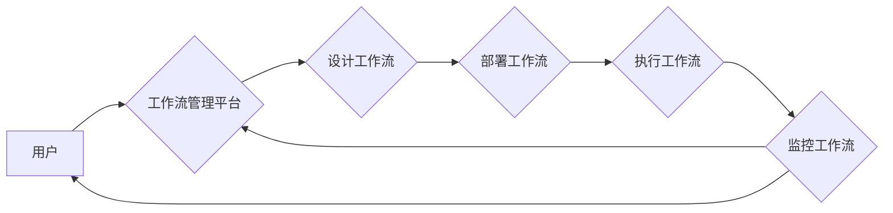

> 关键词：人工智能代理，工作流，自主决策，协同合作，自动化，机器学习，NLP，RPA，AIoT

# AI人工智能代理工作流 AI Agent WorkFlow：未来发展趋势

在数字化转型的浪潮中，人工智能（AI）技术正在改变着各行各业的运作方式。其中，人工智能代理（AI Agents）作为一种能够自主决策、执行任务的虚拟实体，正逐渐成为企业自动化和智能化转型的重要驱动力。本文将探讨AI人工智能代理工作流（AI Agent WorkFlow）的核心概念、原理、应用场景以及未来发展趋势。

## 1. 背景介绍

### 1.1 问题的由来

随着企业业务复杂性的增加，传统的手动工作流程已经难以满足效率、准确性和实时性的要求。为了提高生产力和服务质量，企业开始寻求自动化和智能化的解决方案。AI人工智能代理工作流应运而生，它通过将AI代理与业务流程相结合，实现自动化处理，提高工作效率，降低成本。

### 1.2 研究现状

目前，AI人工智能代理工作流技术已经取得了一定的进展，主要表现在以下几个方面：

- **AI代理技术的成熟**：随着深度学习、自然语言处理（NLP）等技术的发展，AI代理能够处理复杂的业务逻辑，实现自主决策和智能行动。
- **工作流管理平台的崛起**：市场上涌现了众多工作流管理平台，如Zapier、Integromat等，它们能够帮助用户轻松构建和自动化工作流程。
- **AI与RPA的融合**：AI技术与机器人流程自动化（RPA）技术的结合，使得AI代理能够自动化执行重复性任务，提高工作效率。

### 1.3 研究意义

研究AI人工智能代理工作流技术，对于推动企业数字化转型、提高生产力和服务质量具有重要意义：

- **提高效率**：自动化处理重复性任务，释放人力资源，提高工作效率。
- **降低成本**：减少人力成本，降低运营成本，提高企业盈利能力。
- **提升服务质量**：提供更加精准、高效的服务，提升客户满意度。
- **创新业务模式**：通过AI代理实现业务流程创新，开拓新的业务模式。

### 1.4 本文结构

本文将围绕AI人工智能代理工作流展开，具体内容包括：

- 核心概念与联系
- 核心算法原理与操作步骤
- 数学模型和公式
- 项目实践
- 实际应用场景
- 工具和资源推荐
- 未来发展趋势与挑战
- 总结

## 2. 核心概念与联系

### 2.1 核心概念

- **人工智能代理（AI Agent）**：是一种能够感知环境、制定计划、执行动作并不断学习的虚拟实体。
- **工作流（WorkFlow）**：是一系列有序的步骤，用于完成特定的业务任务。
- **工作流管理平台**：用于设计、部署和管理工作流的软件平台。

### 2.2 架构流程图



### 2.3 关联关系

- AI代理通过工作流管理平台设计、部署和管理工作流。
- AI代理在工作流执行过程中，根据预设规则和业务逻辑进行自主决策和行动。
- 工作流管理平台对工作流执行过程进行监控，确保工作流按预期运行。

## 3. 核心算法原理 & 具体操作步骤

### 3.1 算法原理概述

AI人工智能代理工作流的算法原理主要基于以下技术：

- **机器学习**：用于训练AI代理，使其能够识别模式和做出决策。
- **自然语言处理（NLP）**：用于处理和生成自然语言，实现人机交互。
- **知识图谱**：用于存储和管理领域知识，辅助AI代理进行决策。

### 3.2 算法步骤详解

1. **定义工作流**：根据业务需求，定义工作流的步骤、规则和条件。
2. **设计AI代理**：根据工作流需求，设计AI代理的感知、决策和行动能力。
3. **训练AI代理**：使用机器学习算法训练AI代理，使其能够识别模式和做出决策。
4. **部署工作流**：将设计好的工作流部署到工作流管理平台。
5. **执行工作流**：AI代理根据工作流规则和业务逻辑执行任务。
6. **监控工作流**：实时监控工作流执行状态，确保工作流按预期运行。
7. **评估和优化**：根据工作流执行结果，评估AI代理性能，并进行优化调整。

### 3.3 算法优缺点

**优点**：

- 提高效率：自动化处理重复性任务，提高工作效率。
- 降低成本：减少人力成本，降低运营成本。
- 提升服务质量：提供更加精准、高效的服务，提升客户满意度。
- 创新业务模式：通过AI代理实现业务流程创新，开拓新的业务模式。

**缺点**：

- 技术门槛高：需要具备一定的AI和软件开发技能。
- 数据依赖性强：需要大量高质量的数据进行训练。
- 安全风险：需要确保AI代理的行为符合伦理道德和法律法规。

### 3.4 算法应用领域

AI人工智能代理工作流在以下领域具有广泛的应用：

- 金融服务：自动处理交易、风险管理、客户服务等。
- 制造业：自动化生产流程、设备维护、库存管理等。
- 零售业：个性化推荐、客户服务、供应链管理等。
- 医疗保健：预约挂号、病情诊断、患者管理等。
- 教育：智能辅导、考试评分、学习资源推荐等。

## 4. 数学模型和公式

### 4.1 数学模型构建

AI人工智能代理工作流的数学模型主要基于以下模型：

- **决策树**：用于分类和预测，实现AI代理的决策功能。
- **支持向量机（SVM）**：用于分类和回归，实现AI代理的决策功能。
- **神经网络**：用于复杂模式识别和决策，实现AI代理的决策功能。

### 4.2 公式推导过程

以决策树为例，其基本公式如下：

$$
y = f(x) = \prod_{i=1}^n f_i(x)
$$

其中，$y$ 为输出结果，$x$ 为输入特征，$f_i(x)$ 为第 $i$ 个决策节点的条件函数。

### 4.3 案例分析与讲解

以金融风险管理为例，AI代理可以使用决策树模型对客户信用风险进行评估。通过分析客户的信用评分、收入水平、负债情况等特征，决策树模型可以预测客户违约的概率，从而帮助金融机构进行风险控制。

## 5. 项目实践：代码实例和详细解释说明

### 5.1 开发环境搭建

本文以Python编程语言为例，介绍AI人工智能代理工作流的开发环境搭建。

1. 安装Python：从Python官网下载并安装Python 3.x版本。
2. 安装必要的库：使用pip安装以下库：`scikit-learn`、`numpy`、`pandas`、`matplotlib`等。
3. 安装工作流管理平台：选择合适的工作流管理平台，如Zapier、Integromat等。

### 5.2 源代码详细实现

以下是一个简单的AI代理示例代码：

```python
from sklearn import tree
from sklearn.datasets import load_iris

# 加载数据集
data = load_iris()
X = data.data
y = data.target

# 训练决策树模型
clf = tree.DecisionTreeClassifier()
clf.fit(X, y)

# 使用模型进行预测
def predict_flower_type(sepal_length, sepal_width, petal_length, petal_width):
    prediction = clf.predict([[sepal_length, sepal_width, petal_length, petal_width]])
    return ["setosa", "versicolor", "virginica"][prediction[0]]

# 测试模型
print(predict_flower_type(5.1, 3.5, 1.4, 0.2))  # 输出: setosa
```

### 5.3 代码解读与分析

上述代码使用决策树模型对鸢尾花数据集进行分类预测。首先，加载数据集，并提取特征和标签。然后，训练决策树模型，并定义一个预测函数，用于根据输入特征预测鸢尾花类型。最后，测试模型，输出预测结果。

### 5.4 运行结果展示

运行上述代码，输出结果为：

```
setosa
```

这表明，给定的特征对应的鸢尾花类型是“setosa”。

## 6. 实际应用场景

### 6.1 金融服务

AI人工智能代理工作流在金融服务领域具有广泛的应用，例如：

- **自动审批贷款**：AI代理可以根据客户信用评分、收入水平、负债情况等特征，自动审批贷款申请。
- **风险管理**：AI代理可以实时监控市场风险，并及时采取应对措施。
- **客户服务**：AI代理可以自动回答客户咨询，提高客户满意度。

### 6.2 制造业

AI人工智能代理工作流在制造业的应用包括：

- **自动化生产**：AI代理可以控制生产设备，实现自动化生产。
- **设备维护**：AI代理可以监测设备状态，及时进行维护保养。
- **库存管理**：AI代理可以自动补货，降低库存成本。

### 6.3 零售业

AI人工智能代理工作流在零售业的典型应用包括：

- **个性化推荐**：AI代理可以根据顾客的购物历史和偏好，为其推荐商品。
- **客户服务**：AI代理可以自动回答客户咨询，提高客户满意度。
- **供应链管理**：AI代理可以优化库存和物流，降低成本。

## 7. 工具和资源推荐

### 7.1 学习资源推荐

- **书籍**：《机器学习实战》、《深度学习》（Goodfellow et al.）等。
- **在线课程**：Coursera、Udemy、edX等平台上的机器学习、深度学习课程。
- **技术博客**：TensorFlow、PyTorch等深度学习框架的官方博客。

### 7.2 开发工具推荐

- **编程语言**：Python、Java、C++等。
- **开发环境**：Anaconda、Jupyter Notebook等。
- **库和框架**：scikit-learn、TensorFlow、PyTorch等。

### 7.3 相关论文推荐

- **Reinforcement Learning: An Introduction**（Sutton et al.）
- **Deep Reinforcement Learning**（Silver et al.）
- **Neural Network Learning: Theoretical Foundations**（Bengio et al.）

## 8. 总结：未来发展趋势与挑战

### 8.1 研究成果总结

本文对AI人工智能代理工作流的核心概念、原理、应用场景以及未来发展趋势进行了探讨。通过分析，我们得出以下结论：

- AI人工智能代理工作流是一种具有广泛应用前景的技术。
- AI人工智能代理工作流在提高效率、降低成本、提升服务质量等方面具有显著优势。
- AI人工智能代理工作流在金融服务、制造业、零售业等领域具有广泛的应用。

### 8.2 未来发展趋势

- **更加强大的AI代理**：随着AI技术的发展，AI代理将拥有更强大的感知、决策和行动能力。
- **更灵活的工作流管理平台**：工作流管理平台将支持更复杂的业务逻辑和更丰富的AI代理功能。
- **跨领域应用**：AI人工智能代理工作流将在更多领域得到应用，如医疗、教育、交通等。

### 8.3 面临的挑战

- **数据隐私和安全**：AI人工智能代理工作流需要处理大量敏感数据，需要确保数据隐私和安全。
- **算法偏见和歧视**：AI代理的决策过程可能存在偏见和歧视，需要采取措施避免。
- **技术复杂性和成本**：AI人工智能代理工作流的技术复杂性和成本较高，需要降低门槛。

### 8.4 研究展望

为了应对未来发展趋势和挑战，以下研究方向值得关注：

- **隐私保护技术**：研究基于隐私保护的AI代理工作流技术，确保数据隐私和安全。
- **公平性研究**：研究避免算法偏见和歧视的方法，确保AI代理的公平性。
- **成本优化**：研究降低AI人工智能代理工作流的技术复杂性和成本，提高可及性。

## 9. 附录：常见问题与解答

**Q1：什么是AI人工智能代理？**

A：AI人工智能代理是一种能够自主决策、执行任务并不断学习的虚拟实体。它能够感知环境、制定计划、执行动作，并在执行过程中不断学习和优化。

**Q2：AI人工智能代理工作流有哪些优势？**

A：AI人工智能代理工作流的优势包括提高效率、降低成本、提升服务质量、创新业务模式等。

**Q3：AI人工智能代理工作流有哪些应用场景？**

A：AI人工智能代理工作流在金融服务、制造业、零售业、医疗、教育、交通等领域具有广泛的应用。

**Q4：AI人工智能代理工作流的技术难点是什么？**

A：AI人工智能代理工作流的技术难点包括数据隐私和安全、算法偏见和歧视、技术复杂性和成本等。

**Q5：未来AI人工智能代理工作流有哪些发展趋势？**

A：未来AI人工智能代理工作流的发展趋势包括更强大的AI代理、更灵活的工作流管理平台、跨领域应用等。

作者：禅与计算机程序设计艺术 / Zen and the Art of Computer Programming