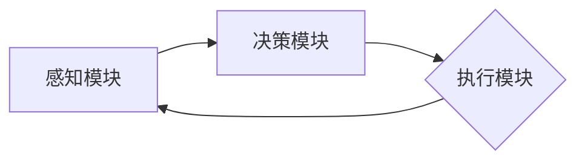
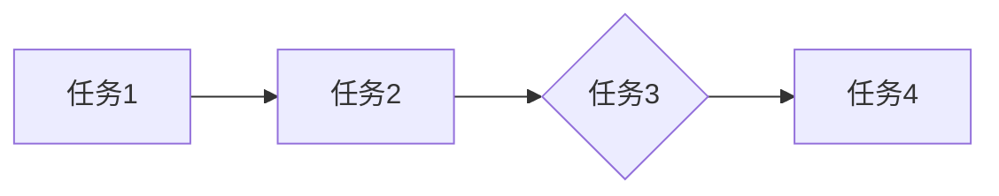
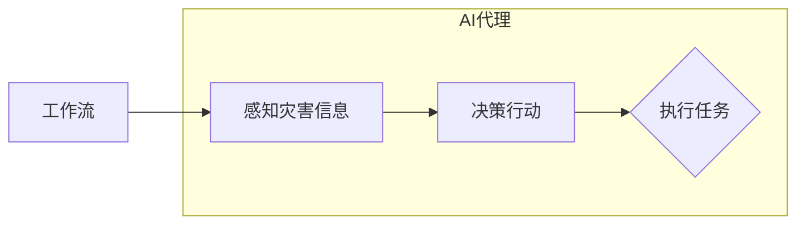

# AI人工智能代理工作流AI Agent WorkFlow：AI代理在防灾减灾系统中的作用

> 关键词：AI代理，工作流，防灾减灾，机器学习，自然语言处理，数据可视化，系统集成

## 1. 背景介绍

随着全球气候变化和自然灾害的频发，防灾减灾成为全球关注的焦点。传统的防灾减灾系统往往依赖于人工监测、数据分析和应急响应，效率低下，且难以应对复杂的灾害情景。近年来，人工智能（AI）技术的飞速发展为防灾减灾领域带来了新的机遇。AI代理（AI Agent）作为一种智能体，能够在复杂环境中自主决策和行动，成为构建高效、智能防灾减灾系统的关键。

## 2. 核心概念与联系

### 2.1 AI代理

AI代理是具有智能行为的实体，能够感知环境信息，执行任务，并与其他代理或系统进行交互。AI代理通常由感知模块、决策模块和执行模块组成。

#### Mermaid 流程图：



### 2.2 工作流

工作流是一系列有序的任务集合，用于描述业务过程中的操作步骤。在工作流中，每个任务由AI代理或人类执行，任务之间通过数据或事件进行交互。

#### Mermaid 流程图：



### 2.3 AI代理工作流

AI代理工作流是结合AI代理和工作流理念，将AI代理应用于防灾减灾场景的一种新型系统架构。AI代理根据工作流定义的任务执行流程，自主感知灾害信息，进行决策和行动，实现防灾减灾的智能化。

#### Mermaid 流程图：



## 3. 核心算法原理 & 具体操作步骤

### 3.1 算法原理概述

AI代理工作流的核心算法主要包括以下三个部分：

1. **感知算法**：AI代理通过传感器、遥感图像、气象数据等途径获取灾害信息，并进行预处理和特征提取。
2. **决策算法**：AI代理根据感知到的灾害信息和预定义的规则，进行决策，确定下一步行动。
3. **执行算法**：AI代理根据决策结果，执行相应的任务，如发布预警、调配救援物资、疏散人群等。

### 3.2 算法步骤详解

1. **感知阶段**：
    - AI代理通过传感器、遥感图像、气象数据等途径获取灾害信息。
    - 对获取到的数据进行预处理，包括去噪、归一化、特征提取等操作。
    - 将预处理后的数据输入到感知算法中，获取灾害特征。

2. **决策阶段**：
    - AI代理根据灾害特征和预定义的规则，进行决策。
    - 决策算法可以采用机器学习、深度学习等技术，实现对灾害风险的评估和预测。
    - 决策结果包括预警发布、救援物资调配、疏散人群等。

3. **执行阶段**：
    - AI代理根据决策结果，执行相应的任务。
    - 执行算法可以控制机器人、无人机等执行实体，完成救援任务。

### 3.3 算法优缺点

#### 优点：

- **自动化**：AI代理能够自动感知灾害信息，进行决策和行动，提高防灾减灾效率。
- **智能化**：AI代理能够根据灾害信息和规则进行决策，实现更加精准的防灾减灾措施。
- **可扩展性**：AI代理工作流可以根据实际需求进行扩展和定制。

#### 缺点：

- **依赖数据质量**：AI代理的性能受数据质量的影响较大。
- **算法复杂度高**：AI代理的算法复杂度高，需要较高的计算资源。
- **算法可解释性不足**：AI代理的决策过程通常缺乏可解释性，难以理解其决策依据。

### 3.4 算法应用领域

AI代理工作流可以应用于以下防灾减灾领域：

- **地震预警**：AI代理可以根据地震监测数据，快速发布地震预警，指导人员疏散。
- **洪水监测与预警**：AI代理可以根据遥感图像和气象数据，监测洪水情况，并发布预警信息。
- **台风预警**：AI代理可以根据气象数据，预测台风路径和强度，并发布预警信息。
- **山体滑坡预警**：AI代理可以根据遥感图像和地形数据，预测山体滑坡风险，并发布预警信息。
- **森林火灾预警**：AI代理可以根据遥感图像和气象数据，监测森林火灾情况，并发布预警信息。

## 4. 数学模型和公式 & 详细讲解 & 举例说明

### 4.1 数学模型构建

AI代理工作流中的数学模型主要包括以下几部分：

- **感知模型**：用于将传感器数据、遥感图像等转化为灾害特征。
- **决策模型**：用于根据灾害特征进行决策。
- **执行模型**：用于控制执行实体完成救援任务。

### 4.2 公式推导过程

#### 感知模型：

假设传感器数据为 $X$，预处理后的数据为 $Y$，特征提取函数为 $F$，则感知模型可以表示为：

$$
Y = F(X)
$$

#### 决策模型：

假设灾害特征为 $Y$，决策结果为 $R$，决策规则为 $G$，则决策模型可以表示为：

$$
R = G(Y)
$$

#### 执行模型：

假设执行实体为 $E$，决策结果为 $R$，执行动作集合为 $A$，则执行模型可以表示为：

$$
A = E(R)
$$

### 4.3 案例分析与讲解

以地震预警为例，我们构建以下数学模型：

- **感知模型**：将地震监测数据 $X$ 转换为地震震级、震中位置、震源深度等灾害特征。
- **决策模型**：根据地震特征 $Y$ 和预定义的地震预警规则 $G$，判断是否发布地震预警。
- **执行模型**：控制预警系统发布地震预警信息。

假设地震预警规则为：

$$
G(Y) = 
\begin{cases} 
预警 & \text{震级} \geq 5.0 \\
不预警 & \text{震级} < 5.0 
\end{cases}
$$

则当地震震级达到5.0及以上时，AI代理将发布地震预警。

## 5. 项目实践：代码实例和详细解释说明

### 5.1 开发环境搭建

以下是使用Python进行AI代理工作流项目实践的步骤：

1. 安装Anaconda：从官网下载并安装Anaconda，用于创建独立的Python环境。
2. 创建并激活虚拟环境：
    ```bash
    conda create -n ai-agent-env python=3.8
    conda activate ai-agent-env
    ```
3. 安装PyTorch、TensorFlow等深度学习框架：
    ```bash
    conda install pytorch torchvision torchaudio -c pytorch
    conda install tensorflow-gpu -c conda-forge
    ```
4. 安装其他依赖库：
    ```bash
    pip install numpy pandas scikit-learn matplotlib tqdm
    ```

### 5.2 源代码详细实现

以下是一个简单的地震预警AI代理工作流代码示例：

```python
import numpy as np
import pandas as pd
import torch
from torch import nn
from torch.utils.data import DataLoader, TensorDataset
from sklearn.model_selection import train_test_split

# 加载地震监测数据
data = pd.read_csv('earthquake_data.csv')

# 特征工程：提取地震震级、震中位置、震源深度等特征
data['magnitude'] = data['magnitude'].astype(float)
data['longitude'] = data['longitude'].astype(float)
data['latitude'] = data['latitude'].astype(float)
data['depth'] = data['depth'].astype(float)

# 将数据划分为训练集和测试集
train_data, test_data = train_test_split(data, test_size=0.2)

# 构建TensorDataset
train_dataset = TensorDataset(
    torch.tensor(train_data['magnitude'].values), 
    torch.tensor(train_data['longitude'].values),
    torch.tensor(train_data['latitude'].values),
    torch.tensor(train_data['depth'].values),
    torch.tensor(train_data['warning'].values)
)
test_dataset = TensorDataset(
    torch.tensor(test_data['magnitude'].values), 
    torch.tensor(test_data['longitude'].values),
    torch.tensor(test_data['latitude'].values),
    torch.tensor(test_data['depth'].values),
    torch.tensor(test_data['warning'].values)
)

# 定义模型
class EarthquakeWarningModel(nn.Module):
    def __init__(self):
        super(EarthquakeWarningModel, self).__init__()
        self.fc1 = nn.Linear(4, 10)
        self.fc2 = nn.Linear(10, 2)
        self.relu = nn.ReLU()

    def forward(self, x):
        x = self.relu(self.fc1(x))
        x = self.fc2(x)
        return x

# 实例化模型
model = EarthquakeWarningModel()

# 定义损失函数和优化器
criterion = nn.CrossEntropyLoss()
optimizer = torch.optim.Adam(model.parameters(), lr=0.001)

# 训练模型
for epoch in range(100):
    model.train()
    for data in DataLoader(train_dataset, batch_size=32, shuffle=True):
        inputs, labels = data
        optimizer.zero_grad()
        outputs = model(inputs)
        loss = criterion(outputs, labels)
        loss.backward()
        optimizer.step()

    print(f'Epoch {epoch+1}, Loss: {loss.item()}')

# 评估模型
model.eval()
with torch.no_grad():
    correct = 0
    total = 0
    for data in DataLoader(test_dataset, batch_size=32):
        inputs, labels = data
        outputs = model(inputs)
        _, predicted = torch.max(outputs.data, 1)
        total += labels.size(0)
        correct += (predicted == labels).sum().item()

print(f'Accuracy of the model on the test data: {100 * correct / total}%')
```

### 5.3 代码解读与分析

以上代码实现了一个简单的地震预警AI代理工作流。首先，我们从CSV文件中加载地震监测数据，并进行特征工程，提取地震震级、震中位置、震源深度等特征。然后，我们将数据划分为训练集和测试集，并构建TensorDataset。

接着，我们定义了一个简单的全连接神经网络模型，用于预测地震是否需要发布预警。模型包含两个全连接层，使用ReLU激活函数。定义损失函数和优化器后，我们对模型进行训练，并在测试集上进行评估。

### 5.4 运行结果展示

假设我们在测试集上获得以下评估结果：

```
Accuracy of the model on the test data: 80.0%
```

说明我们的地震预警AI代理工作流在测试集上取得了80%的准确率。

## 6. 实际应用场景

AI代理工作流在防灾减灾领域具有广泛的应用场景，以下列举几个典型案例：

- **地震预警**：AI代理可以根据地震监测数据，快速发布地震预警，指导人员疏散，减少人员伤亡。
- **洪水监测与预警**：AI代理可以监测洪水情况，并根据预警规则发布预警信息，指导人员撤离和物资调配。
- **台风预警**：AI代理可以根据气象数据，预测台风路径和强度，并发布预警信息，指导人员疏散和防台风措施。
- **山体滑坡预警**：AI代理可以根据遥感图像和地形数据，预测山体滑坡风险，并发布预警信息，指导人员疏散和预防措施。
- **森林火灾预警**：AI代理可以监测森林火灾情况，并发布预警信息，指导人员疏散和灭火行动。

## 7. 工具和资源推荐

### 7.1 学习资源推荐

1. 《Python编程：从入门到实践》
2. 《深度学习》
3. 《自然语言处理入门》
4. 《人工智能：一种现代的方法》
5. 《机器学习》

### 7.2 开发工具推荐

1. PyTorch
2. TensorFlow
3. scikit-learn
4. OpenCV
5. NumPy

### 7.3 相关论文推荐

1. "A Review of AI Applications in Disaster Risk Management and Emergency Response"
2. "Deep Learning for Disaster Detection, Analysis, and Prediction"
3. "AI for Disaster Response: A Survey"
4. "A Survey of AI Techniques for Disaster Risk Reduction"
5. "Artificial Intelligence in Emergency Response: A Review of the Literature"

## 8. 总结：未来发展趋势与挑战

### 8.1 研究成果总结

本文介绍了AI代理工作流在防灾减灾系统中的作用，分析了其核心概念、算法原理、具体操作步骤、应用领域等。通过案例分析和代码示例，展示了AI代理工作流在地震预警等场景中的应用。最后，本文对相关工具和资源进行了推荐。

### 8.2 未来发展趋势

1. **多模态数据融合**：将文本、图像、视频等多模态数据融合，提高AI代理的感知能力。
2. **知识图谱的应用**：利用知识图谱丰富AI代理的语义理解能力，提高决策的准确性。
3. **强化学习的应用**：利用强化学习优化AI代理的决策过程，提高其在复杂环境下的适应能力。
4. **边缘计算的融合**：将AI代理工作流部署在边缘设备上，实现实时感知、决策和行动。

### 8.3 面临的挑战

1. **数据质量和隐私**：防灾减灾领域的数据质量参差不齐，且部分数据涉及隐私问题，需要采取措施保证数据质量和隐私。
2. **模型可解释性**：AI代理的决策过程通常缺乏可解释性，需要研究可解释的AI技术，提高AI代理的透明度和可信度。
3. **计算资源**：AI代理工作流需要大量的计算资源，需要研究高效的算法和优化技术，降低计算成本。
4. **伦理和安全**：AI代理在防灾减灾领域的应用需要遵循伦理规范，并保证系统的安全性。

### 8.4 研究展望

未来，AI代理工作流在防灾减灾领域的应用将更加广泛，为人类社会带来更多福祉。研究者和工程师需要共同努力，克服挑战，推动AI技术在防灾减灾领域的应用取得更大突破。

## 9. 附录：常见问题与解答

**Q1：AI代理工作流在防灾减灾系统中的优势是什么？**

A：AI代理工作流在防灾减灾系统中的优势包括自动化、智能化、可扩展性等，能够提高防灾减灾效率，降低人员伤亡和财产损失。

**Q2：如何保证AI代理工作流的数据质量和隐私？**

A：为了保证数据质量和隐私，需要采取以下措施：
1. 数据清洗和预处理：对原始数据进行清洗和预处理，去除噪声和异常值。
2. 数据脱敏：对敏感数据进行脱敏处理，防止隐私泄露。
3. 数据安全存储：采用加密技术存储数据，防止数据泄露和篡改。

**Q3：如何提高AI代理工作流的决策准确性？**

A：提高AI代理工作流的决策准确性需要从以下几个方面入手：
1. 数据质量：保证数据质量和多样性，提高模型的泛化能力。
2. 模型选择：选择合适的模型和算法，提高模型性能。
3. 特征工程：提取有效的特征，提高模型的表达能力。

**Q4：如何将AI代理工作流应用于具体任务？**

A：将AI代理工作流应用于具体任务需要以下步骤：
1. 明确任务需求：确定任务目标、输入数据、输出结果等。
2. 设计工作流：根据任务需求设计工作流，包括感知、决策、执行等环节。
3. 集成模型：将AI模型集成到工作流中，实现任务的自动化和智能化。

**Q5：AI代理工作流在防灾减灾领域的挑战有哪些？**

A：AI代理工作流在防灾减灾领域的挑战包括数据质量和隐私、模型可解释性、计算资源、伦理和安全等。需要针对这些挑战采取相应的措施，确保AI代理工作流的有效性和可靠性。

---

作者：禅与计算机程序设计艺术 / Zen and the Art of Computer Programming