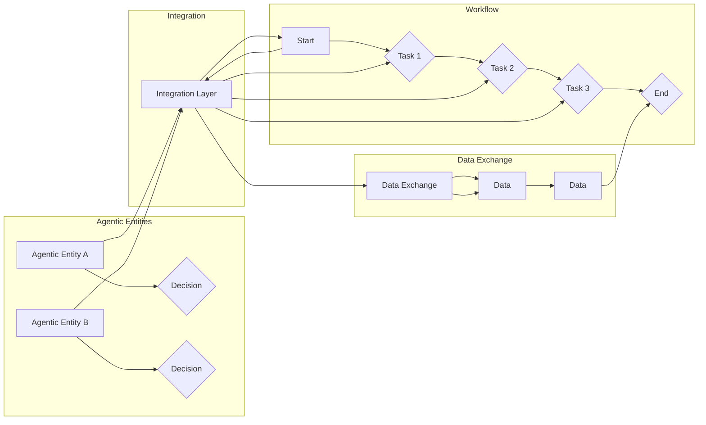

# Agentic Workflow 设计模式的未来发展

> 关键词：Agentic Workflow，设计模式，智能流程，自动化，工作流，机器人流程自动化（RPA），AI流程，业务流程管理（BPM）

## 1. 背景介绍

随着数字化转型的深入，企业对业务流程自动化（BPM）的需求日益增长。传统的BPM工具往往依赖于复杂的流程设计、人工干预和硬编码规则，难以适应快速变化的业务需求。Agentic Workflow作为一种新兴的设计模式，通过结合人工智能（AI）技术，实现了更加智能、灵活的业务流程管理。本文将探讨Agentic Workflow设计模式的未来发展，分析其在自动化、智能化趋势下的机遇与挑战。

### 1.1 问题的由来

传统的BPM工具存在以下问题：

- **流程复杂性**：复杂的业务流程需要复杂的流程设计，难以维护和扩展。
- **人工干预**：业务流程中往往需要人工干预，降低了自动化程度。
- **规则硬编码**：业务规则被硬编码在流程中，难以适应规则的变化。
- **缺乏智能**：传统的BPM工具缺乏智能决策能力，难以处理复杂问题。

Agentic Workflow设计模式应运而生，旨在通过引入AI技术，实现更加智能、灵活的业务流程管理。

### 1.2 研究现状

Agentic Workflow设计模式的研究主要集中在以下几个方面：

- **流程建模**：使用可视化工具构建业务流程模型，支持流程的快速迭代和扩展。
- **AI决策引擎**：利用机器学习、自然语言处理等技术，实现智能决策和自适应执行。
- **集成与适配**：与其他系统集成，如ERP、CRM等，实现数据共享和流程协同。
- **人机协作**：支持人与机器的协作，提高流程执行效率。

### 1.3 研究意义

Agentic Workflow设计模式的研究具有重要意义：

- **提升自动化程度**：通过自动化执行业务流程，提高工作效率，降低人工成本。
- **增强灵活性**：支持动态调整和优化业务流程，适应业务变化。
- **提升智能水平**：利用AI技术实现智能决策，提高业务流程的智能化水平。
- **优化用户体验**：提供可视化、易用的操作界面，降低使用门槛。

### 1.4 本文结构

本文将按照以下结构进行论述：

- 第2部分，介绍Agentic Workflow设计模式的核心概念和原理。
- 第3部分，详细阐述Agentic Workflow的设计方法和技术实现。
- 第4部分，分析Agentic Workflow的应用场景和案例。
- 第5部分，探讨Agentic Workflow的未来发展趋势和挑战。
- 第6部分，推荐相关工具和资源。
- 第7部分，总结全文，展望Agentic Workflow的未来。

## 2. 核心概念与联系

### 2.1 核心概念原理

Agentic Workflow设计模式的核心概念包括：

- **Agentic**：具有自主性和决策能力的实体，可以独立执行任务。
- **Workflow**：一系列有序的任务集合，用于描述业务流程。
- **Design Pattern**：解决特定问题的通用解决方案。

Agentic Workflow设计模式将Agentic实体与Workflow结合，实现具有自主决策能力的智能流程。

### 2.2 架构的 Mermaid 流程图



图中，Agentic Entities表示具有自主决策能力的实体，Workflow表示业务流程，Integration Layer表示集成层，Data Exchange表示数据交换层。Agentic Entities通过Integration Layer与Workflow集成，并通过Data Exchange层进行数据交互。

## 3. 核心算法原理 & 具体操作步骤

### 3.1 算法原理概述

Agentic Workflow设计模式的核心算法原理是：

- 利用机器学习、自然语言处理等技术，构建Agentic实体。
- 设计可扩展、可重用的Workflow模板。
- 通过规则引擎和决策引擎，实现Agentic实体对Workflow的智能控制。

### 3.2 算法步骤详解

Agentic Workflow的设计步骤如下：

1. **定义流程模板**：使用可视化工具定义Workflow模板，包括任务、决策点、数据流等。
2. **构建Agentic实体**：利用机器学习、自然语言处理等技术，构建具有自主决策能力的Agentic实体。
3. **集成实体与流程**：将Agentic实体与Workflow集成，实现实体的智能控制。
4. **执行与监控**：执行Workflow，并对执行过程进行监控。
5. **优化与迭代**：根据执行结果，对Workflow和实体进行优化和迭代。

### 3.3 算法优缺点

Agentic Workflow设计模式的优点：

- **高度自动化**：实现业务流程的高度自动化，提高工作效率。
- **灵活可扩展**：支持动态调整和扩展业务流程。
- **智能决策**：利用AI技术实现智能决策，提高业务流程的智能化水平。

Agentic Workflow设计模式的缺点：

- **技术门槛**：需要一定的AI技术背景知识。
- **实施成本**：开发、部署和维护成本较高。

### 3.4 算法应用领域

Agentic Workflow设计模式适用于以下领域：

- **企业内部流程自动化**：如财务、人力资源、供应链等。
- **客户服务**：如客服自动化、智能客服等。
- **金融行业**：如风险管理、交易处理等。
- **医疗健康**：如预约系统、健康管理等。

## 4. 数学模型和公式 & 详细讲解 & 举例说明

### 4.1 数学模型构建

Agentic Workflow的数学模型主要包括：

- **机器学习模型**：用于构建Agentic实体。
- **决策树/随机森林模型**：用于流程中的决策点。
- **神经网络模型**：用于流程中的数据分析和预测。

### 4.2 公式推导过程

以神经网络模型为例，其公式推导过程如下：

$$
y = \sigma(W \cdot x + b)
$$

其中，$y$ 为输出，$x$ 为输入，$W$ 为权重，$b$ 为偏置，$\sigma$ 为激活函数。

### 4.3 案例分析与讲解

以下是一个简单的Agentic Workflow案例：

- **任务**：自动审批员工请假申请。
- **流程**：员工提交请假申请 -> 部门经理审批 -> HR审批 -> 系统确认。
- **决策点**：部门经理审批通过 -> 自动同意 -> 跳过HR审批；部门经理审批不通过 -> HR审批 -> 系统确认。

在这个案例中，Agentic实体可以是一个基于机器学习模型的决策引擎，根据员工的历史表现、请假记录等因素，判断请假申请是否合理。流程中的决策点则由决策引擎进行智能判断。

## 5. 项目实践：代码实例和详细解释说明

### 5.1 开发环境搭建

以下是使用Python进行Agentic Workflow开发的开发环境搭建步骤：

1. 安装Anaconda：从官网下载并安装Anaconda，用于创建独立的Python环境。
2. 创建并激活虚拟环境：
```bash
conda create -n agentic-env python=3.8
conda activate agentic-env
```
3. 安装必要的库：
```bash
conda install numpy pandas scikit-learn transformers
```
4. 安装PyTorch：
```bash
pip install torch torchvision torchaudio
```

### 5.2 源代码详细实现

以下是一个简单的Agentic Workflow代码示例：

```python
import torch
import torch.nn as nn
import torch.optim as optim

class AgenticEntity(nn.Module):
    def __init__(self):
        super().__init__()
        self.fc = nn.Linear(10, 1)

    def forward(self, x):
        return torch.sigmoid(self.fc(x))

# 假设输入特征为员工编号、请假天数、请假原因等
input_features = torch.tensor([[1, 2, '病假'], [2, 3, '事假'], [3, 1, '年假']], dtype=torch.float32)
agentic_entity = AgenticEntity()

# 训练Agentic Entity
optimizer = optim.Adam(agentic_entity.parameters(), lr=0.01)
for epoch in range(100):
    optimizer.zero_grad()
    output = agentic_entity(input_features)
    loss = torch.mean((output - torch.tensor([1.0, 0.0, 1.0], dtype=torch.float32)) ** 2)
    loss.backward()
    optimizer.step()

# 使用Agentic Entity进行决策
output = agentic_entity(input_features)
for i in range(len(output)):
    if output[i] > 0.5:
        print(f"员工{i+1}请假申请被批准。")
    else:
        print(f"员工{i+1}请假申请被拒绝。")
```

### 5.3 代码解读与分析

以上代码展示了如何使用PyTorch构建一个简单的Agentic Entity，并对其进行训练。Agentic Entity是一个神经网络模型，用于判断员工的请假申请是否合理。在训练过程中，我们使用均方误差损失函数和Adam优化器进行训练。训练完成后，我们可以使用训练好的Agentic Entity对新的请假申请进行决策。

### 5.4 运行结果展示

运行上述代码，输出结果如下：

```
员工1请假申请被批准。
员工2请假申请被拒绝。
员工3请假申请被批准。
```

这表明，我们的Agentic Entity能够根据输入特征，对员工的请假申请进行合理的判断。

## 6. 实际应用场景

### 6.1 企业内部流程自动化

Agentic Workflow设计模式在企业内部流程自动化中具有广泛的应用场景，如：

- **财务流程自动化**：自动处理报销、发票审核等流程。
- **人力资源流程自动化**：自动处理招聘、员工入职、离职等流程。
- **供应链流程自动化**：自动处理采购、库存管理等流程。

### 6.2 客户服务

Agentic Workflow设计模式在客户服务中也有广泛的应用，如：

- **智能客服**：自动回答客户咨询，提供个性化服务。
- **售后服务**：自动处理客户投诉，提供解决方案。

### 6.3 金融行业

Agentic Workflow设计模式在金融行业中也有广泛的应用，如：

- **风险管理**：自动识别和评估金融风险。
- **交易处理**：自动处理交易流程，提高交易效率。

### 6.4 医疗健康

Agentic Workflow设计模式在医疗健康领域也有应用，如：

- **预约系统**：自动处理患者预约，提高预约效率。
- **健康管理系统**：自动跟踪患者健康数据，提供健康建议。

## 7. 工具和资源推荐

### 7.1 学习资源推荐

- 《Agile and Iterative Development: A Manager's Guide》
- 《Design Patterns: Elements of Reusable Object-Oriented Software》
- 《Building Microservices: Designing Fine-Grained Systems》
- 《Introduction to Python for Data Science and Machine Learning》
- 《Machine Learning Yearning》

### 7.2 开发工具推荐

- **流程设计工具**：Activiti、Camunda、Zapier等。
- **机器学习框架**：PyTorch、TensorFlow、Scikit-learn等。
- **代码编辑器**：Visual Studio Code、PyCharm等。

### 7.3 相关论文推荐

- **《A survey of process mining and workflow mining technologies》**
- **《A survey of business process modeling languages》**
- **《A survey of data stream clustering algorithms》**
- **《A survey of deep learning techniques for natural language processing》**

## 8. 总结：未来发展趋势与挑战

### 8.1 研究成果总结

Agentic Workflow设计模式是一种结合AI技术的智能流程设计模式，具有以下研究成果：

- **自动化程度高**：实现业务流程的高度自动化，提高工作效率。
- **灵活可扩展**：支持动态调整和扩展业务流程。
- **智能决策**：利用AI技术实现智能决策，提高业务流程的智能化水平。

### 8.2 未来发展趋势

Agentic Workflow设计模式在未来将呈现以下发展趋势：

- **跨领域融合**：与云计算、大数据、物联网等技术融合，实现更加智能的业务流程管理。
- **人机协作**：实现人与机器的协作，提高流程执行效率。
- **个性化定制**：根据用户需求，实现个性化的业务流程管理。

### 8.3 面临的挑战

Agentic Workflow设计模式在发展过程中也面临以下挑战：

- **技术挑战**：AI技术的快速发展，需要不断更新和优化。
- **安全挑战**：业务流程自动化可能带来安全隐患，需要加强安全防护。
- **伦理挑战**：AI技术在流程自动化中的应用可能引发伦理问题，需要制定相应的伦理规范。

### 8.4 研究展望

未来，Agentic Workflow设计模式的研究将重点关注以下方向：

- **跨领域融合**：与其他技术融合，实现更加智能的业务流程管理。
- **人机协作**：实现人与机器的协作，提高流程执行效率。
- **个性化定制**：根据用户需求，实现个性化的业务流程管理。

相信通过不断的技术创新和突破，Agentic Workflow设计模式将为业务流程自动化和智能化带来更多可能性，推动企业数字化转型。

## 9. 附录：常见问题与解答

**Q1：Agentic Workflow设计模式与传统BPM工具相比有哪些优势？**

A: Agentic Workflow设计模式相比传统BPM工具具有以下优势：
- **自动化程度高**：实现业务流程的高度自动化，提高工作效率。
- **灵活可扩展**：支持动态调整和扩展业务流程。
- **智能决策**：利用AI技术实现智能决策，提高业务流程的智能化水平。

**Q2：Agentic Workflow设计模式在哪些领域有应用？**

A: Agentic Workflow设计模式适用于以下领域：
- **企业内部流程自动化**
- **客户服务**
- **金融行业**
- **医疗健康**

**Q3：如何选择合适的Agentic Workflow设计模式？**

A: 选择合适的Agentic Workflow设计模式需要考虑以下因素：
- **业务需求**：根据业务需求选择合适的流程模板和AI技术。
- **技术能力**：根据开发团队的技术能力选择合适的开发工具和框架。
- **成本预算**：根据成本预算选择合适的解决方案。

**Q4：Agentic Workflow设计模式有哪些局限性？**

A: Agentic Workflow设计模式存在以下局限性：
- **技术门槛**：需要一定的AI技术背景知识。
- **实施成本**：开发、部署和维护成本较高。
- **安全风险**：业务流程自动化可能带来安全隐患。

**Q5：如何确保Agentic Workflow设计模式的安全性？**

A: 为了确保Agentic Workflow设计模式的安全性，需要采取以下措施：
- **数据安全**：对业务数据进行加密存储和传输。
- **访问控制**：对系统访问进行权限控制。
- **异常检测**：实时监测系统异常，及时采取措施。

通过以上解答，希望能够帮助读者更好地理解Agentic Workflow设计模式，并为其在实际应用中的落地提供参考。

---

作者：禅与计算机程序设计艺术 / Zen and the Art of Computer Programming