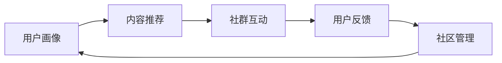

                 

## 1. 背景介绍

### 1.1 问题由来

在知识付费领域，用户社群的运营是整个业务链条中至关重要的环节。社群不仅直接影响到用户的留存率、活跃度和转化率，更是一个知识付费平台获取口碑和影响力的关键因素。然而，由于知识付费行业本身的特殊性，如何有效运营社群，成为一个颇具挑战性的问题。

### 1.2 问题核心关键点

在知识付费行业中，用户社群的运营主要面临以下几个核心问题：

1. **用户获取与留存**：如何高效获取目标用户，同时通过优质内容和服务吸引用户持续参与。
2. **内容推荐与适配**：如何根据用户行为和偏好，推荐个性化的内容，提升用户满意度。
3. **互动与参与度**：如何设计互动机制，增加用户参与感和社群粘性。
4. **社群价值实现**：如何将社群转化为商业价值，如通过社群变现、用户反馈等手段提升平台收益。

### 1.3 问题研究意义

有效运营用户社群，对于知识付费平台的商业价值和社会影响力都有着重要意义：

1. **提升用户黏性**：通过社群运营，建立用户信任和品牌忠诚度，增强用户的持续购买和推荐意愿。
2. **增强用户参与度**：提升用户互动和反馈，实现用户行为数据的积累，为产品优化和内容更新提供依据。
3. **提高内容价值**：通过社群，汇聚用户智慧和需求，挖掘高质量内容，满足用户多样化需求。
4. **开拓商业空间**：社群内丰富的交流和互动，为广告、增值服务等提供新的商业机会，拓宽平台的盈利模式。

## 2. 核心概念与联系

### 2.1 核心概念概述

要有效运营用户社群，需要掌握以下几个核心概念：

1. **用户画像**：根据用户行为和属性，构建详细、动态的用户画像，为内容推荐和社群运营提供依据。
2. **内容推荐算法**：利用机器学习等技术，实现个性化内容推荐，提升用户满意度。
3. **社群互动机制**：设计有吸引力、易操作的互动机制，增加用户参与感和社群粘性。
4. **用户反馈与迭代**：收集用户反馈，及时调整和优化产品和服务，提升用户体验。
5. **社区管理与运营**：包括社群规则制定、用户行为引导、内容审核等，维护社群秩序和活跃度。

### 2.2 概念间的关系

这些核心概念之间相互联系，共同构成用户社群运营的基础框架。通过精确的用户画像和个性化的内容推荐，吸引用户参与社群互动。通过用户反馈和社区管理，不断优化社群体验，形成正向循环。这种多维度的协同运作，才能实现社群的高效运营和商业价值的最大化。




### 2.3 核心概念的整体架构

从用户画像开始，通过内容推荐和社群互动，不断收集用户反馈，优化社区管理，形成闭环运营体系。如下图所示：


## 3. 核心算法原理 & 具体操作步骤

### 3.1 算法原理概述

知识付费平台的用户社群运营，本质上是一个多目标优化问题。通过综合考虑用户画像、内容推荐、社群互动、用户反馈和社区管理等多个维度，实现用户留存、活跃度提升和商业价值最大化的目标。

具体来说，可以采用以下方法：

1. **协同过滤推荐**：通过分析用户行为和偏好，实现个性化内容推荐，提高用户满意度。
2. **聚类分析**：对用户进行聚类分析，找到具有相似行为和偏好的用户群体，进行精准运营。
3. **情感分析**：分析社群内的用户情感倾向，及时调整内容和服务策略。
4. **社区优化算法**：通过优化社区规则和互动机制，提升社群活跃度和粘性。

### 3.2 算法步骤详解

知识付费平台的用户社群运营流程主要包括以下几个关键步骤：

**Step 1: 数据收集与预处理**

1. **用户数据采集**：通过应用内追踪、用户注册、行为数据采集等方式，收集用户基本信息、行为记录和互动数据。
2. **数据清洗与标准化**：对采集的数据进行清洗和标准化处理，去除噪音和异常值，确保数据质量。
3. **特征工程**：对用户行为数据进行特征提取和选择，构建用户画像。

**Step 2: 用户画像构建**

1. **用户行为分析**：通过聚类算法，对用户行为进行分群，识别出不同行为特征的用户群体。
2. **用户属性分析**：根据用户属性数据，如年龄、职业、地域等，进一步细分用户画像。
3. **动态更新画像**：定期更新用户画像，确保其与最新数据保持一致。

**Step 3: 内容推荐**

1. **个性化推荐算法**：基于协同过滤、基于内容的推荐算法，实现个性化内容推荐。
2. **推荐结果优化**：通过A/B测试等方法，不断优化推荐算法，提升推荐准确性和用户满意度。
3. **推荐结果展示**：将推荐结果展示给用户，并根据用户反馈进行调整。

**Step 4: 社群互动**

1. **互动机制设计**：设计有吸引力的社群互动机制，如讨论话题、用户投票、专家问答等。
2. **互动效果监测**：通过数据监控，分析互动机制的效果，及时调整和优化。
3. **社群活跃度管理**：通过内容更新、用户引导等方式，提升社群活跃度。

**Step 5: 用户反馈收集与处理**

1. **用户反馈收集**：通过问卷调查、评论反馈、用户行为监控等方式，收集用户对平台和内容的意见和建议。
2. **反馈数据处理**：对用户反馈数据进行分类、统计和分析，识别出主要问题和改进方向。
3. **反馈结果应用**：将处理后的反馈结果应用到产品和服务改进中，提升用户体验。

**Step 6: 社区管理与运营**

1. **社区规则制定**：根据平台特色和用户需求，制定社区规则和行为准则，维护社群秩序。
2. **内容审核与管理**：建立内容审核机制，确保发布内容的质量和合规性。
3. **社区活动策划**：定期策划社群活动，增加用户互动和参与感。

### 3.3 算法优缺点

知识付费平台的用户社群运营算法，具有以下优点：

1. **个性化推荐**：通过个性化推荐算法，提高用户满意度和粘性。
2. **数据驱动决策**：基于数据驱动的用户画像和行为分析，实现精准运营。
3. **动态优化**：通过持续的数据监控和反馈处理，实现动态优化和持续改进。

同时，也存在以下局限性：

1. **数据隐私问题**：用户在数据采集和分析过程中，隐私保护问题需要重视。
2. **算法复杂度**：个性化推荐和用户画像构建算法复杂，对计算资源需求较高。
3. **用户反馈滞后**：用户反馈的滞后性可能导致调整的延迟和效果不佳。
4. **社区管理难度**：社区规则和互动机制的设计和管理复杂，需多方面协调。

### 3.4 算法应用领域

知识付费平台的用户社群运营算法，广泛应用于以下几个领域：

1. **内容推荐系统**：通过个性化推荐算法，提升用户对内容的满意度和粘性。
2. **用户行为分析**：通过用户画像和行为分析，优化产品和服务，提升用户体验。
3. **社群互动管理**：通过互动机制设计和管理，提升社群活跃度和粘性。
4. **用户反馈系统**：通过用户反馈收集和处理，不断优化产品和服务。
5. **社区规则制定**：通过社区规则的制定和执行，维护社群秩序和活跃度。

## 4. 数学模型和公式 & 详细讲解 & 举例说明

### 4.1 数学模型构建

知识付费平台的用户社群运营，涉及多个复杂的数据模型。以下是其中几个关键模型的构建：

1. **用户画像模型**：根据用户行为数据和属性数据，构建详细、动态的用户画像。
2. **个性化推荐模型**：基于协同过滤和基于内容的推荐算法，实现个性化内容推荐。
3. **社群互动模型**：通过互动机制设计，建立用户之间的互动关系。
4. **用户反馈模型**：对用户反馈数据进行分类和分析，提取有价值的信息。

### 4.2 公式推导过程

以个性化推荐模型为例，其基本公式为：

$$
P(r_{ui}) = \sigma(\langle x_u, y_i \rangle)
$$

其中：

- $P(r_{ui})$ 为用户 $u$ 对物品 $i$ 的推荐概率。
- $x_u$ 为用户 $u$ 的特征向量。
- $y_i$ 为物品 $i$ 的特征向量。
- $\sigma$ 为激活函数，通常使用Sigmoid函数。

通过该公式，可以对每个用户和物品的特征向量进行相似度计算，从而得到推荐概率。

### 4.3 案例分析与讲解

以下是一个基于协同过滤的个性化推荐系统案例：

某知识付费平台采集到大量用户行为数据和物品数据，包括用户浏览、点击、购买等行为，以及视频、文章、课程等物品属性。通过对这些数据进行特征提取和选择，构建用户画像和物品特征向量。然后使用协同过滤算法，计算每个用户对每个物品的推荐概率，实现个性化推荐。

推荐系统通过A/B测试等方法，不断优化推荐算法，提升推荐效果。最终，平台实现了基于用户行为和偏好的个性化推荐，提高了用户满意度和粘性。

## 5. 项目实践：代码实例和详细解释说明

### 5.1 开发环境搭建

进行知识付费平台的用户社群运营实践，需要搭建以下开发环境：

1. **Python开发环境**：安装Python 3.x和相关依赖库，如NumPy、Pandas、Scikit-learn等。
2. **数据库系统**：选择适合的数据库系统，如MySQL、MongoDB等，存储用户行为数据和互动数据。
3. **消息队列系统**：选择适合的消息队列系统，如RabbitMQ、Kafka等，处理异步消息和数据流。
4. **实时计算框架**：选择适合的实时计算框架，如Apache Flink、Apache Storm等，实现数据的实时处理和分析。

### 5.2 源代码详细实现

以下是基于PyTorch实现的用户画像和个性化推荐系统的示例代码：

```python
import torch
import torch.nn as nn
import torch.optim as optim

# 定义用户画像模型
class UserProfileModel(nn.Module):
    def __init__(self, user_features, item_features):
        super(UserProfileModel, self).__init__()
        self.user_features = user_features
        self.item_features = item_features
        self.recommender = nn.Sequential(
            nn.Linear(user_features + item_features, 128),
            nn.ReLU(),
            nn.Linear(128, 1),
            nn.Sigmoid()
        )
    
    def forward(self, user, item):
        user_vector = self.user_features[user]
        item_vector = self.item_features[item]
        combined_vector = torch.cat([user_vector, item_vector], dim=1)
        return self.recommender(combined_vector)

# 加载数据集
user_data = pd.read_csv('user_data.csv')
item_data = pd.read_csv('item_data.csv')

# 构建用户画像
user_profiles = {}
for user in user_data.index:
    user_features = user_data[user].to_list()
    item_features = []
    for item in user_data.columns[1:]:
        item_features.append(item_data[item].to_list())
    user_profiles[user] = UserProfileModel(user_features, item_features)

# 进行个性化推荐
user = 'Alice'
item = 'Introduction to Machine Learning'
recommender = user_profiles[user]
recommender.eval()
with torch.no_grad():
    for i in range(5):
        item_vector = item_data[item].to_tensor()
        recommendation = recommender(item_vector)
        print(f"推荐第{i+1}个物品：{item_data.columns[i+1]}，推荐概率：{recommendation.item()}")
```

### 5.3 代码解读与分析

以上代码展示了如何使用PyTorch实现用户画像和个性化推荐系统的基本流程：

1. **用户画像模型**：定义用户画像模型，包括用户特征和物品特征的线性组合，并使用Sigmoid函数进行激活。
2. **数据加载**：通过Pandas库加载用户行为数据和物品数据，构建用户画像和物品特征向量。
3. **个性化推荐**：对特定用户和物品进行推荐，使用用户画像模型计算推荐概率。
4. **模型评估**：在测试集上评估推荐模型的效果，不断优化推荐算法。

## 6. 实际应用场景

### 6.1 智能推荐系统

知识付费平台的用户社群运营算法，广泛应用于智能推荐系统。通过对用户行为和偏好的分析，实现个性化内容推荐，提升用户满意度和粘性。

### 6.2 社交互动平台

在社交互动平台中，通过设计有吸引力的互动机制，如讨论话题、用户投票、专家问答等，增加用户参与感和社群粘性，实现用户留存和活跃度的提升。

### 6.3 知识分享社区

在知识分享社区中，通过用户反馈和社区管理，优化社区环境，提升内容质量和用户互动，形成正向循环。

### 6.4 未来应用展望

随着知识付费平台的快速发展，用户社群运营算法将发挥越来越重要的作用：

1. **多模态数据融合**：将文本、图像、视频等多种模态数据融合，提升用户画像的丰富性和准确性。
2. **实时数据处理**：通过实时数据处理技术，实现对用户行为和社群互动的动态监控和优化。
3. **用户情感分析**：通过情感分析技术，实时了解用户情感倾向，优化内容和服务策略。
4. **个性化服务定制**：根据用户个性化需求，提供定制化服务，提升用户满意度。

## 7. 工具和资源推荐

### 7.1 学习资源推荐

以下是几本经典书籍，有助于深入理解知识付费平台的用户社群运营：

1. 《推荐系统实战》：介绍推荐系统原理和实践，涵盖协同过滤、基于内容的推荐等多种算法。
2. 《社交网络分析》：探讨社交网络数据分析方法和技术，为社交互动平台的社群运营提供理论基础。
3. 《用户画像：构建、应用和优化》：详细讲解用户画像的构建和应用，帮助平台精准运营。
4. 《深度学习在自然语言处理中的应用》：介绍深度学习在NLP领域的应用，为内容推荐和互动设计提供技术支持。

### 7.2 开发工具推荐

以下是一些常用的开发工具，有助于提升知识付费平台的用户社群运营效率：

1. **PyTorch**：广泛用于深度学习开发，提供了强大的计算图和自动微分功能。
2. **Pandas**：数据处理和分析的利器，支持数据清洗、特征工程等操作。
3. **Scikit-learn**：机器学习库，提供了丰富的算法和工具，适用于用户画像和推荐系统构建。
4. **Apache Flink**：实时计算框架，支持数据流处理和分析，适合大规模数据处理。
5. **RabbitMQ**：消息队列系统，支持异步消息传递和数据流处理，适用于复杂系统的数据协同。

### 7.3 相关论文推荐

以下是几篇具有代表性的论文，有助于深入了解知识付费平台的用户社群运营：

1. 《Item-Based Collaborative Filtering for Recommender Systems》：介绍协同过滤推荐算法的基本原理和实现方法。
2. 《User-Based Collaborative Filtering in Recommender Systems》：探讨基于用户的协同过滤推荐算法。
3. 《Online Learning for Social Networks》：研究社交网络数据挖掘方法和技术，为社群运营提供理论支持。
4. 《User-Centered Design for Social Media》：探讨社交媒体用户需求和设计方法，为社交互动平台提供设计指导。

## 8. 总结：未来发展趋势与挑战

### 8.1 研究成果总结

知识付费平台的用户社群运营算法，在提升用户满意度和平台收益方面取得了显著成效。通过个性化推荐和社群互动，实现了用户留存和活跃度的提升。然而，仍需解决数据隐私、算法复杂度和社区管理等问题。

### 8.2 未来发展趋势

未来，知识付费平台的用户社群运营将呈现以下几个发展趋势：

1. **多模态数据融合**：将文本、图像、视频等多种模态数据融合，提升用户画像的丰富性和准确性。
2. **实时数据处理**：通过实时数据处理技术，实现对用户行为和社群互动的动态监控和优化。
3. **用户情感分析**：通过情感分析技术，实时了解用户情感倾向，优化内容和服务策略。
4. **个性化服务定制**：根据用户个性化需求，提供定制化服务，提升用户满意度。

### 8.3 面临的挑战

知识付费平台的用户社群运营算法，在实际应用中仍面临一些挑战：

1. **数据隐私问题**：用户在数据采集和分析过程中，隐私保护问题需要重视。
2. **算法复杂度**：个性化推荐和用户画像构建算法复杂，对计算资源需求较高。
3. **用户反馈滞后**：用户反馈的滞后性可能导致调整的延迟和效果不佳。
4. **社区管理难度**：社区规则和互动机制的设计和管理复杂，需多方面协调。

### 8.4 研究展望

面对这些挑战，未来的研究需要在以下几个方面寻求新的突破：

1. **隐私保护技术**：开发更加高效的隐私保护技术，确保用户数据的安全性和隐私性。
2. **轻量级推荐算法**：开发更加轻量级的推荐算法，提升推荐效果的同时降低计算复杂度。
3. **实时数据处理技术**：研究实时数据处理技术，实现动态监控和优化。
4. **社区管理工具**：开发社区管理工具，简化规则制定和管理过程，提高运营效率。

通过不断优化和创新，知识付费平台的用户社群运营算法将不断提升用户满意度和平台收益，为知识付费行业的发展注入新的动力。

## 9. 附录：常见问题与解答

**Q1：知识付费平台如何进行用户画像构建？**

A: 用户画像构建主要包括以下几个步骤：

1. **数据采集**：通过应用内追踪、用户注册、行为数据采集等方式，收集用户基本信息、行为记录和互动数据。
2. **数据清洗与标准化**：对采集的数据进行清洗和标准化处理，去除噪音和异常值，确保数据质量。
3. **特征工程**：对用户行为数据进行特征提取和选择，构建用户画像。

**Q2：知识付费平台的个性化推荐系统如何实现？**

A: 个性化推荐系统的实现主要包括以下几个步骤：

1. **数据加载**：通过Pandas库加载用户行为数据和物品数据，构建用户画像和物品特征向量。
2. **模型构建**：定义个性化推荐模型，如协同过滤、基于内容的推荐等算法。
3. **模型评估**：在测试集上评估推荐模型的效果，不断优化推荐算法。
4. **推荐结果展示**：将推荐结果展示给用户，并根据用户反馈进行调整。

**Q3：知识付费平台如何进行社群互动设计？**

A: 社群互动设计主要包括以下几个步骤：

1. **互动机制设计**：设计有吸引力的社群互动机制，如讨论话题、用户投票、专家问答等。
2. **互动效果监测**：通过数据监控，分析互动机制的效果，及时调整和优化。
3. **社群活跃度管理**：通过内容更新、用户引导等方式，提升社群活跃度。

**Q4：知识付费平台如何处理用户反馈？**

A: 用户反馈处理主要包括以下几个步骤：

1. **反馈收集**：通过问卷调查、评论反馈、用户行为监控等方式，收集用户对平台和内容的意见和建议。
2. **反馈数据处理**：对用户反馈数据进行分类、统计和分析，识别出主要问题和改进方向。
3. **反馈结果应用**：将处理后的反馈结果应用到产品和服务改进中，提升用户体验。

**Q5：知识付费平台如何进行社区管理？**

A: 社区管理主要包括以下几个步骤：

1. **社区规则制定**：根据平台特色和用户需求，制定社区规则和行为准则，维护社群秩序。
2. **内容审核与管理**：建立内容审核机制，确保发布内容的质量和合规性。
3. **社区活动策划**：定期策划社群活动，增加用户互动和参与感。

通过不断优化和创新，知识付费平台的用户社群运营算法将不断提升用户满意度和平台收益，为知识付费行业的发展注入新的动力。

---

作者：禅与计算机程序设计艺术 / Zen and the Art of Computer Programming

