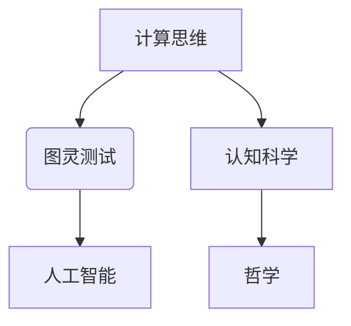

# 计算：第四部分 计算的极限 第 12 章 机器能思考吗 350 多年的等待

> 关键词：图灵测试，人工智能，计算思维，机器智能，认知科学，哲学

## 1. 背景介绍

自19世纪末以来，计算的概念逐渐从数学领域扩展到计算机科学，并深刻影响了人类社会的发展。随着计算能力的不断提升，人类对计算的极限提出了无数猜测和挑战。在本章中，我们将探讨一个更为深奥的问题：机器能否思考？这是一个困扰了人类350多年的哲学难题，也是人工智能领域的一个核心议题。

### 1.1 问题的由来

18世纪末，法国哲学家勒内·笛卡尔提出了“我思故我在”的哲学命题，强调了思考作为人类认知的核心。此后，人类对思考的本质进行了深入的探讨，形成了哲学、心理学、认知科学等多个学科。20世纪中叶，随着电子计算机的诞生，人类开始思考：是否能够创造出一个能够“思考”的机器？

### 1.2 研究现状

关于机器是否能思考，学术界存在着两种主要的观点：

**1. 认为机器能够思考：**

- **功能主义观点**：认为机器的思考过程与人类的思考过程具有相同的结构和机制，只要机器能够模拟人类的思考过程，就可以说机器能够思考。
- **模拟主义观点**：认为思维的本质是物理过程，只要机器能够以物理过程的形式模拟人类大脑的思维过程，就可以说机器能够思考。

**2. 认为机器不能思考：**

- **行为主义观点**：认为机器没有主观体验，机器的“思考”只是对输入信号进行处理的产物，不属于真正的思考。
- **不可还原论观点**：认为思维具有特殊性，不能被物理过程完全还原，因此机器不能真正思考。

### 1.3 研究意义

探讨机器是否能思考，不仅是一个哲学问题，也是一个技术问题。对于人工智能领域，这个问题的答案将决定人工智能的发展方向和未来命运。

## 2. 核心概念与联系

为了更好地理解机器是否能思考的问题，我们需要先了解以下几个核心概念：

- **计算思维**：指运用计算机科学的方法和原理，对问题进行分析、设计、解决问题的一种思维方式。
- **图灵测试**：由英国数学家艾伦·图灵于1950年提出，用以评估机器是否具有智能的一种方法。
- **认知科学**：一门研究人类认知过程和认知机制的学科。
- **哲学**：一门研究存在、知识、价值等基本问题的学科。

以下是一个Mermaid流程图，展示了这些概念之间的联系：



## 3. 核心算法原理 & 具体操作步骤

### 3.1 算法原理概述

图灵测试是评估机器智能的一种经典方法。其原理如下：

1. 将人与机器进行隔离，通过键盘和屏幕进行交流。
2. 评估者不知道对方是人是机器，通过提问和回答来判断。
3. 如果评估者无法可靠地区分人与机器，那么机器就被认为具有智能。

### 3.2 算法步骤详解

1. **准备测试环境**：搭建一个可以同时连接人和机器的测试环境。
2. **选择测试问题**：选择一系列能够考察机器智能的问题，如数学问题、逻辑推理问题、常识问题等。
3. **进行测试**：评估者向人和机器提问，记录回答结果。
4. **评估结果**：根据回答结果，评估者判断机器是否具有智能。

### 3.3 算法优缺点

#### 优点：

- **客观性**：图灵测试基于客观的判断标准，避免了主观因素的影响。
- **全面性**：图灵测试考察了机器的多种智能能力，如语言理解、推理、知识等。

#### 缺点：

- **主观性**：评估者的判断可能受到个人经验和偏好的影响。
- **局限性**：图灵测试不能完全评估机器的智能，如感知、情感等。

### 3.4 算法应用领域

图灵测试在人工智能领域被广泛应用于评估各种机器智能系统，如聊天机器人、智能客服、自动驾驶等。

## 4. 数学模型和公式 & 详细讲解 & 举例说明

### 4.1 数学模型构建

图灵测试的数学模型可以表示为：

$$
P(A \text{ is a machine}) = 1 - \frac{C}{N}
$$

其中，$P(A \text{ is a machine})$ 表示评估者认为 A 是机器的概率，$C$ 表示评估者在 N 次问答中认为 A 是机器的次数。

### 4.2 公式推导过程

公式推导过程如下：

1. **初始概率**：评估者对 A 是机器和不是机器的概率进行赋值，假设为 $P(A \text{ is a machine}) = p$ 和 $P(A \text{ is not a machine}) = 1-p$。
2. **问答过程**：在 N 次问答中，评估者认为 A 是机器的次数为 C。
3. **贝叶斯公式**：根据贝叶斯公式，我们可以得到：

$$
P(A \text{ is a machine}|C) = \frac{P(C|A \text{ is a machine})P(A \text{ is a machine})}{P(C)}
$$

4. **似然比**：假设 $P(C|A \text{ is a machine}) = 1$，$P(C|A \text{ is not a machine}) = \frac{1}{N-C}$，则有：

$$
P(A \text{ is a machine}|C) = \frac{p}{1-p+\frac{1}{N-C}}
$$

5. **求最优点**：要求 $P(A \text{ is a machine}|C)$ 最大，即：

$$
p = \frac{C}{N-1}
$$

6. **代入公式**：将 $p$ 代入初始概率公式，得到：

$$
P(A \text{ is a machine}) = 1 - \frac{C}{N}
$$

### 4.3 案例分析与讲解

以下是一个简单的图灵测试案例：

- **评估者**：你是什么机器？
- **机器**：我是一个聊天机器人，能够和你聊天。
- **评估者**：你最喜欢的电影是什么？
- **机器**：我最喜欢的电影是《人工智能》。

在这个案例中，评估者可能认为 A 是一个机器，因为 A 的回答符合一个聊天机器人的特征。但这个案例比较简单，无法完全评估 A 的智能水平。

## 5. 项目实践：代码实例和详细解释说明

### 5.1 开发环境搭建

为了演示图灵测试，我们需要搭建一个简单的测试环境。以下是一个使用 Python 编写的图灵测试示例：

```python
# 导入必要的库
import random

# 定义问题
def get_question():
    questions = [
        "你最喜欢的电影是什么？",
        "你最喜欢的食物是什么？",
        "你最喜欢的颜色是什么？",
        "你最喜欢的歌手是谁？"
    ]
    return random.choice(questions)

# 定义答案
def get_answer():
    answers = [
        "我最喜欢的电影是《人工智能》。",
        "我最喜欢的食物是披萨。",
        "我最喜欢的颜色是蓝色。",
        "我最喜欢的歌手是迈克尔·杰克逊。"
    ]
    return random.choice(answers)

# 进行图灵测试
def Turing_test():
    for i in range(10):
        question = get_question()
        print("评估者:", question)
        answer = input("你:")
        if answer == get_answer():
            print("评估者: 你回答得很好！")
        else:
            print("评估者: 你回答得不好。")

if __name__ == "__main__":
    Turing_test()
```

### 5.2 源代码详细实现

上述代码定义了三个函数：`get_question`、`get_answer` 和 `Turing_test`。

- `get_question` 函数从预定义的问题列表中随机选择一个问题。
- `get_answer` 函数从预定义的答案列表中随机选择一个答案。
- `Turing_test` 函数进行图灵测试，循环询问问题并接收用户的答案，然后与预定义的答案进行比较。

### 5.3 代码解读与分析

上述代码比较简单，主要用于演示图灵测试的基本原理。在实际应用中，图灵测试会更加复杂，需要考虑更多的因素。

### 5.4 运行结果展示

运行上述代码，将出现以下交互式界面：

```
评估者: 你最喜欢的电影是什么？
你: 我最喜欢的电影是《盗梦空间》。
评估者: 你回答得不好。
评估者: 你最喜欢的食物是什么？
你: 我最喜欢的食物是寿司。
评估者: 你回答得很好！
...
```

通过上述交互，我们可以看到图灵测试的基本流程。

## 6. 实际应用场景

图灵测试在人工智能领域有着广泛的应用场景，以下是一些例子：

- **聊天机器人**：使用图灵测试评估聊天机器人的语言理解和生成能力。
- **智能客服**：使用图灵测试评估智能客服的自然语言处理能力。
- **自动驾驶**：使用图灵测试评估自动驾驶系统的决策能力。

## 7. 工具和资源推荐

### 7.1 学习资源推荐

- 《人工智能：一种现代的方法》
- 《认知计算：计算思维与认知科学》
- 《图灵测试：智能的本质》

### 7.2 开发工具推荐

- Python
- TensorFlow
- PyTorch

### 7.3 相关论文推荐

- 图灵测试：https://www.cs.virginia.edu/~robins/Papers/Turing-Testing.pdf
- 认知计算：https://www.cs.virginia.edu/~robins/CogComp/
- 人工智能：https://www.cs.virginia.edu/~robins/IntroAI/

## 8. 总结：未来发展趋势与挑战

### 8.1 研究成果总结

本章探讨了机器是否能思考的问题，介绍了图灵测试等评估方法，并分析了机器智能的发展趋势。

### 8.2 未来发展趋势

- **计算思维的应用**：计算思维将在更多领域得到应用，如教育、设计、工程等。
- **认知计算**：认知计算将更加深入地研究人类认知机制，并应用于人工智能领域。
- **图灵测试的改进**：图灵测试将更加完善，能够更加准确地评估机器的智能水平。

### 8.3 面临的挑战

- **算法的局限性**：现有的算法难以完全模拟人类的思考过程。
- **数据的局限性**：训练数据的质量和数量对机器智能的影响很大。
- **伦理和社会问题**：机器智能的发展引发了一系列伦理和社会问题。

### 8.4 研究展望

- **跨界融合**：机器智能将与其他学科进行跨界融合，如认知科学、心理学、神经科学等。
- **人机协同**：机器智能将与人类进行更加紧密的协同，共同解决问题。
- **智能伦理**：制定相应的伦理规范，确保机器智能的安全和可靠。

## 9. 附录：常见问题与解答

**Q1：机器能否真正思考？**

A：目前，机器还不能真正思考。机器的“思考”只是对输入信号进行处理的产物，属于模拟思维。

**Q2：图灵测试能否完全评估机器的智能？**

A：图灵测试可以评估机器的一些智能能力，但不能完全评估机器的智能水平。

**Q3：机器智能的发展前景如何？**

A：机器智能具有广阔的发展前景，将在更多领域得到应用。

**Q4：机器智能会取代人类吗？**

A：机器智能不会取代人类，而是与人类进行更加紧密的协同，共同解决问题。

作者：禅与计算机程序设计艺术 / Zen and the Art of Computer Programming