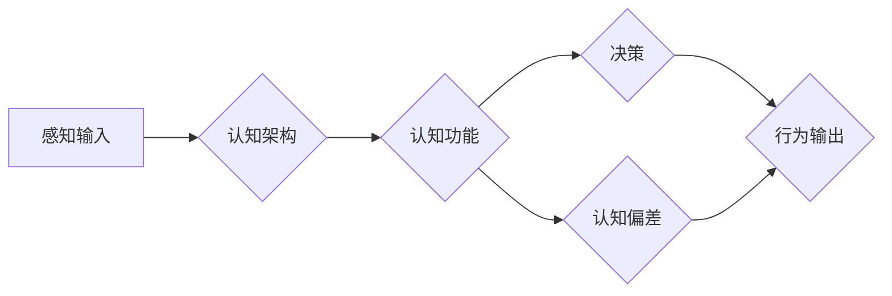

> - 认知发展
> - 混沌理论
> - 简洁性原则
> - 人工智能
> - 复杂系统
> - 算法设计

# 认知发展的混沌与简洁化

在人工智能和认知科学领域，我们不断追求的是如何使机器能够像人类一样进行复杂认知活动。然而，认知过程本身就是一个充满混沌与复杂性的领域。本文将探讨认知发展的混沌本质，以及如何通过简洁性原则来驾驭这种复杂性，实现人工智能的稳健发展。

## 1. 背景介绍

### 1.1 认知发展的挑战

认知发展是心理学、神经科学和人工智能领域的核心课题。人类大脑能够处理复杂的信息，形成概念，进行推理，解决复杂问题，这种能力至今仍未被完全理解。在人工智能领域，构建能够模拟人类认知过程的智能系统一直是研究者们追求的目标。

### 1.2 混沌与复杂性

认知发展过程中的混沌和复杂性表现为：

- **非线性**：认知过程往往是非线性的，一个小的输入变化可能导致显著不同的输出。
- **涌现性**：复杂系统中的元素相互作用会产生新的属性，这些属性无法从单个元素的性质中推断出来。
- **非确定性**：在缺乏足够信息的情况下，认知过程可能产生不可预测的结果。

### 1.3 简洁性原则

简洁性原则指出，自然界的复杂系统往往遵循简洁的设计原则。在人工智能领域，简洁性原则可以帮助我们构建更加稳健、易于理解和维护的系统。

## 2. 核心概念与联系

### 2.1 认知发展的核心概念

- **认知架构**：认知架构是指支持认知过程的脑网络或计算模型。
- **认知功能**：认知功能包括感知、记忆、注意力、语言、推理等。
- **认知偏差**：认知偏差是指人们在认知过程中可能出现的系统性错误。

### 2.2 认知与混沌理论的联系

混沌理论表明，即使在确定性系统中，也可能出现对初始条件极其敏感的现象。这提示我们，在认知发展过程中，即使是非常小的误差也可能导致完全不同的行为。

### 2.3 简洁性原则与认知发展的联系

简洁性原则可以帮助我们在设计和实现认知系统时，避免不必要的复杂性，提高系统的鲁棒性和可解释性。

**Mermaid 流程图：认知发展流程**



## 3. 核心算法原理 & 具体操作步骤

### 3.1 算法原理概述

认知算法的设计应该遵循以下原则：

- **模块化**：将认知功能分解为独立的模块，每个模块负责特定的认知任务。
- **冗余**：设计冗余的机制来提高系统的鲁棒性。
- **反馈机制**：引入反馈机制来调整和优化认知过程。

### 3.2 算法步骤详解

1. **数据收集**：收集感知数据，包括视觉、听觉、触觉等。
2. **数据预处理**：对收集到的数据进行清洗和标准化。
3. **特征提取**：从预处理后的数据中提取特征。
4. **认知推理**：使用认知架构进行推理，形成决策。
5. **行为输出**：根据决策执行行为。
6. **反馈与学习**：根据行为的结果进行反馈，并更新认知架构。

### 3.3 算法优缺点

**优点**：

- 提高系统的鲁棒性。
- 增强系统的可解释性。
- 促进系统的可维护性。

**缺点**：

- 算法设计复杂，需要大量的计算资源。
- 需要大量的数据来进行训练和验证。

### 3.4 算法应用领域

- **机器学习**：设计能够学习新知识的机器学习算法。
- **自然语言处理**：构建能够理解和生成人类语言的系统。
- **机器人学**：设计能够自主决策和执行任务的机器人。

## 4. 数学模型和公式 & 详细讲解 & 举例说明

### 4.1 数学模型构建

认知过程的数学模型通常涉及以下概念：

- **马尔可夫决策过程（MDP）**：用于描述决策过程，其中每个状态都有一组可能的动作和相应的奖励。
- **图神经网络（GNN）**：用于表示和处理图结构数据，如社交网络、知识图谱等。
- **深度学习模型**：如卷积神经网络（CNN）和循环神经网络（RNN）。

### 4.2 公式推导过程

假设我们有一个简单的MDP，状态空间为 $S$，动作空间为 $A$，奖励函数为 $R(s,a)$，则状态-动作价值函数 $V(s,a)$ 可以通过以下公式计算：

$$
V(s,a) = \max_{a'} \left[ R(s,a) + \gamma \sum_{s'} P(s'|s,a) V(s',a') \right]
$$

其中 $\gamma$ 是折扣因子。

### 4.3 案例分析与讲解

以一个简单的机器人导航问题为例，机器人需要在二维空间中从一个起点移动到终点，同时避免障碍物。我们可以使用MDP来建模这个问题。

在这个例子中，状态空间 $S$ 是机器人的位置，动作空间 $A$ 是机器人的移动方向（上、下、左、右），奖励函数 $R(s,a)$ 是到达终点的负距离，$P(s'|s,a)$ 是机器人从当前状态 $s$ 移动到下一个状态 $s'$ 的概率。

通过求解MDP，我们可以找到最优策略，使机器人以最小的路径到达终点。

## 5. 项目实践：代码实例和详细解释说明

### 5.1 开发环境搭建

为了实现上述的机器人导航问题，我们需要搭建以下开发环境：

- 操作系统：Linux
- 编程语言：Python
- 深度学习框架：TensorFlow或PyTorch

### 5.2 源代码详细实现

以下是一个简单的机器人导航问题的Python代码实现：

```python
import numpy as np
import matplotlib.pyplot as plt
from mpl_toolkits.mplot3d import Axes3D

# 定义环境类
class Environment:
    def __init__(self, width, height, start, goal, obstacles):
        self.width = width
        self.height = height
        self.start = start
        self.goal = goal
        self.obstacles = obstacles

    def get_state(self):
        return np.array([self.x, self.y])

    def get_next_state(self, action):
        # 根据动作更新位置
        if action == 'up':
            self.y += 1
        elif action == 'down':
            self.y -= 1
        elif action == 'left':
            self.x -= 1
        elif action == 'right':
            self.x += 1
        return np.array([self.x, self.y])

    def is_goal(self):
        return np.allclose(self.get_state(), self.goal)

    def is_obstacle(self, state):
        return np.any(np.allclose(state, self.obstacles))

# 初始化环境
width, height = 10, 10
start = np.array([0, 0])
goal = np.array([9, 9])
obstacles = np.array([[5, 5], [6, 5], [7, 5]])

env = Environment(width, height, start, goal, obstacles)

# 定义策略
def policy(state):
    if np.allclose(state, env.start):
        return 'up'
    elif env.is_goal():
        return 'stop'
    elif env.is_obstacle(state):
        return 'stop'
    else:
        return np.random.choice(['up', 'down', 'left', 'right'])

# 运行模拟
def run_simulation():
    state = env.get_state()
    while not env.is_goal():
        action = policy(state)
        state = env.get_next_state(action)
        # 绘制状态
        plt.cla()
        plt.plot(state[0], state[1], 'go')
        plt.plot(env.goal[0], env.goal[1], 'ro')
        plt.plot([state[0], env.goal[0]], [state[1], env.goal[1]], 'b-')
        plt.xlim(0, width)
        plt.ylim(0, height)
        plt.pause(0.1)
    plt.show()

run_simulation()
```

### 5.3 代码解读与分析

上述代码定义了一个简单的环境类 `Environment`，它包含机器人的位置、目标位置和障碍物信息。`get_state` 方法用于获取当前状态，`get_next_state` 方法用于根据动作更新状态，`is_goal` 方法用于检查是否达到目标，`is_obstacle` 方法用于检查是否遇到障碍物。

`policy` 函数定义了机器人的策略，当机器人处于起始位置时，它会向上移动；当达到目标时，它会停止；当遇到障碍物时，它也会停止。否则，它会随机选择一个动作。

`run_simulation` 函数用于运行模拟，它将循环执行策略，直到机器人达到目标。

### 5.4 运行结果展示

运行上述代码，我们会看到机器人从一个起始位置移动到目标位置，同时避开障碍物。

## 6. 实际应用场景

认知发展的混沌与简洁化原则在以下实际应用场景中至关重要：

- **自动驾驶**：自动驾驶系统需要处理复杂的环境，包括交通信号、行人、其他车辆等，同时需要做出快速、安全的决策。
- **医疗诊断**：医疗诊断需要考虑患者的症状、病史、基因信息等多个因素，以便做出准确的诊断。
- **金融分析**：金融分析需要处理大量的市场数据，包括股票价格、交易量、新闻等，以便做出投资决策。

## 7. 工具和资源推荐

### 7.1 学习资源推荐

- 《认知科学导论》
- 《深度学习》
- 《人工智能：一种现代的方法》

### 7.2 开发工具推荐

- TensorFlow
- PyTorch
- Keras

### 7.3 相关论文推荐

- 《深度学习：一种通用学习算法》
- 《认知神经科学的计算模型》
- 《机器学习：概率视角》

## 8. 总结：未来发展趋势与挑战

### 8.1 研究成果总结

本文探讨了认知发展的混沌与简洁化原则，并介绍了相关算法和应用场景。通过模块化、冗余和反馈机制等原则，我们可以设计更加稳健、易于理解和维护的认知系统。

### 8.2 未来发展趋势

未来，认知发展研究将更加注重以下几个方面：

- **跨学科研究**：认知科学、神经科学、人工智能等领域的交叉研究。
- **脑-机接口**：开发能够直接与大脑交互的系统。
- **认知增强**：通过技术手段提升人类认知能力。

### 8.3 面临的挑战

认知发展研究面临的挑战包括：

- **计算复杂性**：认知过程涉及大量的计算资源。
- **数据获取**：获取高质量的数据集用于训练和验证认知系统。
- **伦理问题**：如何确保认知系统符合伦理标准。

### 8.4 研究展望

认知发展研究将朝着更加智能化、个性化的方向发展，为人类创造更加美好的未来。

## 9. 附录：常见问题与解答

**Q1：认知发展与人工智能有什么关系？**

A：认知发展研究为人工智能提供了理论基础和设计灵感。通过研究人类认知过程，我们可以更好地设计人工智能系统，使其更加智能和人性化。

**Q2：如何实现认知过程的简洁化？**

A：通过模块化、冗余和反馈机制等原则，我们可以将复杂的认知过程分解为更简单的部分，从而实现认知过程的简洁化。

**Q3：认知系统如何应对混沌和复杂性？**

A：通过引入冗余和反馈机制，认知系统可以在面对混沌和复杂性时保持稳定性和鲁棒性。

**Q4：认知发展研究有哪些应用场景？**

A：认知发展研究可以应用于自动驾驶、医疗诊断、金融分析等多个领域。

**Q5：未来认知发展研究有哪些趋势？**

A：未来认知发展研究将更加注重跨学科研究、脑-机接口和认知增强等方面。

作者：禅与计算机程序设计艺术 / Zen and the Art of Computer Programming