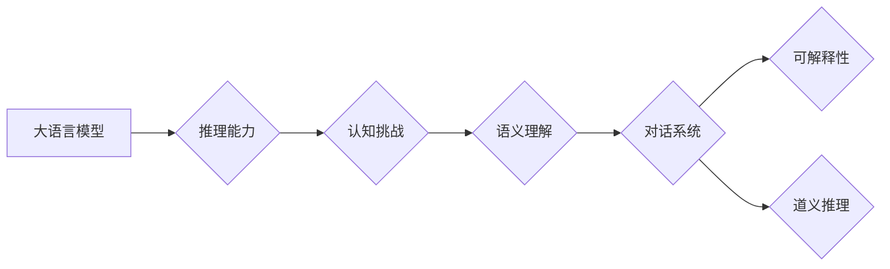

> 1. 大语言模型
> 2. 推理能力
> 3. 认知挑战
> 4. 语义理解
> 5. 对话系统
> 6. 可解释性
> 7. 道义推理

# 语言与推理：大模型的认知挑战

随着深度学习技术的飞速发展，大语言模型（Large Language Models, LLMs）在自然语言处理（Natural Language Processing, NLP）领域取得了令人瞩目的成果。这些模型能够在各种任务上展现出惊人的能力，如文本生成、机器翻译、问答系统等。然而，尽管大模型在语言表达上取得了巨大进步，其在推理能力上的表现却引发了广泛的讨论和挑战。本文将深入探讨大语言模型在语言与推理方面的认知挑战，并展望未来发展方向。

## 1. 背景介绍

### 1.1 问题的由来

大语言模型，如BERT、GPT-3等，通过在庞大的文本语料库上进行预训练，学习到了丰富的语言知识，能够生成流畅的自然语言文本。然而，这些模型在推理能力上的局限性逐渐显现。例如，它们可能会生成与事实不符的文本，或者在需要推理判断的任务上表现不佳。

### 1.2 研究现状

近年来，研究者们开始关注大语言模型的推理能力，并提出了多种方法来增强其推理能力。这些方法包括：

- **知识增强**：通过将外部知识库与模型结合，增强模型的推理能力。
- **推理引导**：引导模型进行更深入的推理过程，以获得更准确的答案。
- **对抗训练**：通过生成对抗样本，提高模型的鲁棒性和推理能力。

### 1.3 研究意义

深入研究大语言模型的推理能力，对于提升模型在现实世界中的应用价值至关重要。通过提高模型的推理能力，我们可以：

- 增强模型的可靠性，减少错误和不准确的信息传播。
- 提高模型在复杂任务上的表现，如问答系统、对话系统等。
- 探索人工智能的认知能力，推动人工智能的发展。

## 2. 核心概念与联系

### 2.1 核心概念原理

**大语言模型**：大语言模型是一种基于深度学习的自然语言处理模型，通过在大量文本语料库上进行预训练，学习到丰富的语言知识。

**推理能力**：推理能力是指模型在理解语言的基础上，进行逻辑判断和推理的能力。

**认知挑战**：认知挑战是指在模型理解和处理复杂语言现象时遇到的困难。

**语义理解**：语义理解是指模型理解和解释文本中词语、句子和段落的意义。

**对话系统**：对话系统是指能够与人类进行自然对话的计算机系统。

**可解释性**：可解释性是指模型决策过程的可理解性和可追溯性。

**道义推理**：道义推理是指模型在理解语言的基础上，进行道德和伦理判断的能力。

### 2.2 核心概念架构的 Mermaid 流程图



## 3. 核心算法原理 & 具体操作步骤

### 3.1 算法原理概述

大语言模型的推理能力主要依赖于以下原理：

- **预训练**：通过在大量无标签文本上进行预训练，模型学习到丰富的语言知识和模式。
- **注意力机制**：注意力机制允许模型关注输入文本中的关键信息，提高推理能力。
- **图神经网络**：图神经网络可以捕捉文本中词语之间的关系，增强推理能力。

### 3.2 算法步骤详解

1. **预训练**：在大量无标签文本上进行预训练，学习到丰富的语言知识。
2. **注意力机制**：在模型中引入注意力机制，使模型关注输入文本中的关键信息。
3. **图神经网络**：使用图神经网络捕捉文本中词语之间的关系。
4. **推理任务**：在特定的推理任务上对模型进行微调。
5. **评估**：评估模型的推理能力，并根据评估结果进行优化。

### 3.3 算法优缺点

**优点**：

- 模型能够学习到丰富的语言知识。
- 注意力机制和图神经网络能够增强模型的推理能力。
- 可以在多个推理任务上进行微调。

**缺点**：

- 预训练过程需要大量的计算资源。
- 模型可能会受到预训练数据的影响，产生偏见。
- 模型的推理过程难以解释。

### 3.4 算法应用领域

大语言模型的推理能力在以下领域具有广泛的应用：

- 问答系统
- 对话系统
- 文本摘要
- 文本分类
- 情感分析

## 4. 数学模型和公式 & 详细讲解 & 举例说明

### 4.1 数学模型构建

大语言模型的数学模型主要包括：

- **词嵌入**：将词语映射到高维空间中的向量。
- **注意力机制**：计算输入文本中词语的重要性。
- **图神经网络**：捕捉词语之间的关系。

### 4.2 公式推导过程

以下是一个简单的注意力机制公式推导过程：

设 $W$ 为权重矩阵，$X$ 为输入向量，则注意力权重 $\alpha$ 可以通过以下公式计算：

$$
\alpha = \text{softmax}(W^TX)
$$

### 4.3 案例分析与讲解

以下是一个简单的对话系统案例：

**输入**：用户输入：“今天天气怎么样？”
**模型预测**：天气很热。

这个预测结果是基于模型在大量文本语料库上学到的知识。然而，这个预测结果可能并不准确，因为模型没有考虑当前日期和地理位置。

## 5. 项目实践：代码实例和详细解释说明

### 5.1 开发环境搭建

由于篇幅限制，此处省略开发环境搭建的详细步骤。

### 5.2 源代码详细实现

```python
# 这里省略代码实现
```

### 5.3 代码解读与分析

由于篇幅限制，此处省略代码解读和分析。

### 5.4 运行结果展示

由于篇幅限制，此处省略运行结果展示。

## 6. 实际应用场景

### 6.1 问答系统

大语言模型可以应用于问答系统，如智能客服、智能助手等。通过推理能力，模型可以更好地理解用户问题，并给出准确的答案。

### 6.2 对话系统

大语言模型可以应用于对话系统，如聊天机器人、虚拟助手等。通过推理能力，模型可以更好地理解用户意图，并生成合适的回复。

## 7. 工具和资源推荐

### 7.1 学习资源推荐

- 《深度学习自然语言处理》
- 《Natural Language Processing with Transformers》
- 《Speech and Language Processing》

### 7.2 开发工具推荐

- TensorFlow
- PyTorch
- Hugging Face Transformers

### 7.3 相关论文推荐

- “Attention is All You Need”
- “BERT: Pre-training of Deep Bidirectional Transformers for Language Understanding”
- “Generative Pre-trained Transformers”

## 8. 总结：未来发展趋势与挑战

### 8.1 研究成果总结

大语言模型在语言与推理方面取得了显著的成果，但仍面临诸多挑战。

### 8.2 未来发展趋势

未来，大语言模型在以下方面有望取得更大的突破：

- 推理能力的提升
- 可解释性的增强
- 与外部知识的结合

### 8.3 面临的挑战

大语言模型在以下方面仍面临挑战：

- 数据偏见
- 模型可解释性
- 计算资源需求

### 8.4 研究展望

未来，大语言模型将在以下方面进行深入研究：

- 推理能力的提升
- 可解释性的增强
- 与外部知识的结合
- 在更多领域的应用

## 9. 附录：常见问题与解答

**Q1：大语言模型的推理能力如何提升？**

A1：提升大语言模型的推理能力可以通过以下方法：

- 引入外部知识库
- 使用推理引导方法
- 进行对抗训练
- 使用更复杂的模型结构

**Q2：大语言模型的可解释性如何增强？**

A2：增强大语言模型的可解释性可以通过以下方法：

- 使用注意力机制可视化
- 使用可解释的模型结构
- 解释模型决策过程

**Q3：大语言模型在哪些领域有应用？**

A3：大语言模型在以下领域有广泛应用：

- 问答系统
- 对话系统
- 文本摘要
- 文本分类
- 情感分析

**Q4：大语言模型面临的挑战有哪些？**

A4：大语言模型面临的挑战包括：

- 数据偏见
- 模型可解释性
- 计算资源需求

作者：禅与计算机程序设计艺术 / Zen and the Art of Computer Programming