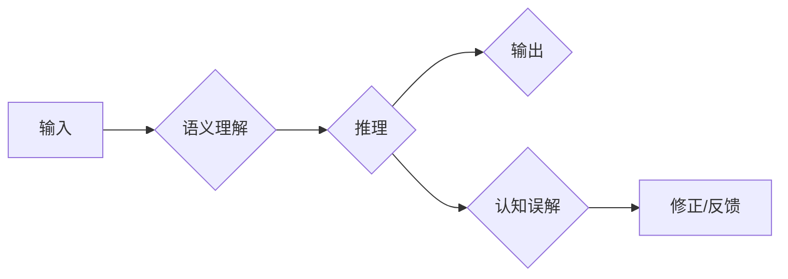

> - 大语言模型
> - 推理能力
> - 认知误解
> - 语义理解
> - 预训练模型
> - 微调
> - 逻辑与常识

# 语言与推理：大模型的认知误解

### 1. 背景介绍

近年来，随着深度学习技术的飞速发展，大语言模型（Large Language Models, LLMs）在自然语言处理（Natural Language Processing, NLP）领域取得了显著的进展。这些模型通过在庞大的文本数据集上进行预训练，学会了丰富的语言知识和模式，从而在许多下游任务中展现出惊人的能力。然而，随着LLMs的应用越来越广泛，人们开始关注它们在语言理解和推理方面的局限性，以及可能导致的认知误解。

### 2. 核心概念与联系

#### 2.1 核心概念原理

**大语言模型（LLMs）**：LLMs是一类基于深度学习的模型，能够处理和理解自然语言。它们通常通过在大量文本数据上进行预训练来学习语言的通用表示和结构。

**语义理解**：语义理解是指模型对文本中词汇、短语和句子的含义的识别和解释能力。

**推理能力**：推理能力是指模型从已知信息中推断出未知信息的能力。

**认知误解**：认知误解是指模型在理解和推理过程中产生的错误或偏差。

#### 2.2 架构的 Mermaid 流程图



### 3. 核心算法原理 & 具体操作步骤

#### 3.1 算法原理概述

LLMs通常采用预训练-微调的架构。预训练阶段，模型在无标注的文本数据上学习语言的通用表示。微调阶段，模型在特定任务的标注数据上进行调整，以适应特定的语言理解和推理任务。

#### 3.2 算法步骤详解

1. **预训练**：在无标注数据上训练模型，学习语言的通用表示。
2. **微调**：在标注数据上调整模型参数，优化模型在特定任务上的性能。
3. **推理**：使用微调后的模型对输入文本进行理解和推理。

#### 3.3 算法优缺点

**优点**：
- **强大的语言理解能力**：LLMs能够理解复杂的语言结构和含义。
- **跨任务适应性**：预训练模型可以在多个任务上取得良好的性能。
- **高效性**：预训练模型可以快速适应新的任务。

**缺点**：
- **认知误解**：LLMs可能在理解和推理过程中产生错误或偏差。
- **可解释性差**：LLMs的决策过程通常难以解释。
- **数据偏见**：LLMs可能会学习到数据中的偏见和歧视。

#### 3.4 算法应用领域

LLMs在以下领域有广泛的应用：

- **文本分类**：例如情感分析、主题分类等。
- **问答系统**：例如信息检索、对话系统等。
- **机器翻译**：例如将一种语言翻译成另一种语言。

### 4. 数学模型和公式 & 详细讲解 & 举例说明

#### 4.1 数学模型构建

LLMs通常使用神经网络作为其数学模型。以下是一个简单的神经网络模型：

$$
y = \sigma(W_1 \cdot x + b_1)
$$

其中 $W_1$ 是权重矩阵，$b_1$ 是偏置项，$\sigma$ 是激活函数。

#### 4.2 公式推导过程

假设我们有一个简单的分类问题，其中输入 $x$ 是一个向量，输出 $y$ 是一个类别标签。我们可以使用softmax函数将输出转换为概率分布：

$$
\hat{y} = \frac{e^{y_i}}{\sum_{j=1}^K e^{y_j}}
$$

其中 $K$ 是类别数量。

#### 4.3 案例分析与讲解

假设我们要使用LLMs进行情感分析，其中输入是一个句子，输出是情感标签（正面、负面或中性）。我们可以使用以下步骤：

1. 将句子输入LLMs。
2. LLMs输出句子表示的向量。
3. 使用softmax函数将输出向量转换为概率分布。
4. 根据概率分布选择最有可能的类别标签。

### 5. 项目实践：代码实例和详细解释说明

#### 5.1 开发环境搭建

为了进行LLMs的项目实践，我们需要以下开发环境：

- **Python**：用于编写代码。
- **TensorFlow或PyTorch**：用于构建和训练神经网络。
- **Hugging Face Transformers库**：用于加载预训练的LLMs。

#### 5.2 源代码详细实现

以下是一个使用PyTorch和Hugging Face Transformers库进行情感分析的项目示例：

```python
from transformers import BertForSequenceClassification, BertTokenizer
import torch

# 加载预训练模型和分词器
model = BertForSequenceClassification.from_pretrained('bert-base-uncased')
tokenizer = BertTokenizer.from_pretrained('bert-base-uncased')

# 将文本转换为模型输入
def encode_text(text):
    return tokenizer(text, padding=True, truncation=True, return_tensors='pt')

# 训练模型
def train(model, train_loader, optimizer):
    model.train()
    for texts, labels in train_loader:
        inputs = encode_text(texts)
        outputs = model(**inputs, labels=labels)
        loss = outputs.loss
        loss.backward()
        optimizer.step()
        optimizer.zero_grad()

# 测试模型
def test(model, test_loader):
    model.eval()
    total_correct = 0
    total_samples = 0
    with torch.no_grad():
        for texts, labels in test_loader:
            inputs = encode_text(texts)
            outputs = model(**inputs)
            _, predicted = torch.max(outputs.logits, 1)
            total_correct += (predicted == labels).sum().item()
            total_samples += labels.size(0)
    accuracy = total_correct / total_samples
    return accuracy

# 创建数据加载器
train_loader = DataLoader(train_dataset, batch_size=32, shuffle=True)
test_loader = DataLoader(test_dataset, batch_size=32, shuffle=False)

# 定义优化器
optimizer = torch.optim.AdamW(model.parameters(), lr=1e-5)

# 训练模型
train(model, train_loader, optimizer)

# 测试模型
accuracy = test(model, test_loader)
print(f"Test accuracy: {accuracy:.4f}")
```

#### 5.3 代码解读与分析

上述代码展示了如何使用PyTorch和Hugging Face Transformers库进行情感分析。首先，我们加载了一个预训练的BERT模型和相应的分词器。然后，我们定义了`encode_text`函数，用于将文本转换为模型输入。接下来，我们定义了`train`和`test`函数，用于训练和测试模型。最后，我们创建数据加载器、定义优化器，并开始训练模型。

### 6. 实际应用场景

LLMs在以下实际应用场景中表现出色：

- **智能客服**：LLMs可以用于构建智能客服系统，回答用户的问题并提供帮助。
- **文本摘要**：LLMs可以用于自动生成文本摘要，提高信息处理的效率。
- **机器翻译**：LLMs可以用于将一种语言翻译成另一种语言，促进跨文化交流。

### 6.4 未来应用展望

LLMs的未来应用前景广阔，以下是一些潜在的应用方向：

- **个性化推荐**：LLMs可以用于构建个性化推荐系统，为用户提供更个性化的内容。
- **教育**：LLMs可以用于开发智能教育平台，提供个性化的学习体验。
- **医疗**：LLMs可以用于辅助诊断和治疗疾病，提高医疗服务的质量。

### 7. 工具和资源推荐

#### 7.1 学习资源推荐

- **书籍**：
  - "Deep Learning" by Ian Goodfellow, Yoshua Bengio, and Aaron Courville
  - "Natural Language Processing with Python" by Steven Bird, Ewan Klein, and Edward Loper
- **在线课程**：
  - Coursera上的"Natural Language Processing with Python"课程
  - Udacity上的"Deep Learning Nanodegree"课程

#### 7.2 开发工具推荐

- **编程语言**：
  - Python
- **深度学习框架**：
  - TensorFlow
  - PyTorch
- **自然语言处理库**：
  - Hugging Face Transformers
  - NLTK

#### 7.3 相关论文推荐

- "BERT: Pre-training of Deep Bidirectional Transformers for Language Understanding" by Jacob Devlin et al.
- "Generative Pre-trained Transformer for Language Modeling" by Alec Radford et al.

### 8. 总结：未来发展趋势与挑战

#### 8.1 研究成果总结

LLMs在自然语言处理领域取得了显著的进展，但在语言理解和推理方面仍存在一些局限性。未来研究需要关注以下方面：

- 提高模型的推理能力，减少认知误解。
- 提高模型的可解释性，使模型的决策过程更加透明。
- 减少数据偏见，避免歧视和偏见。

#### 8.2 未来发展趋势

- **更强大的模型**：随着计算能力的提升，LLMs的规模和复杂度将进一步提高。
- **更丰富的应用场景**：LLMs将在更多领域得到应用，如医疗、教育、金融等。
- **更先进的技术**：新的预训练技术和微调技术将不断涌现，进一步提升LLMs的性能。

#### 8.3 面临的挑战

- **计算资源**：LLMs需要大量的计算资源进行训练和推理。
- **数据偏见**：LLMs可能学习到数据中的偏见和歧视。
- **可解释性**：LLMs的决策过程通常难以解释。

#### 8.4 研究展望

LLMs的未来研究需要关注以下方面：

- **提高模型的推理能力**：通过改进模型结构和训练方法，提高模型的推理能力。
- **提高模型的可解释性**：通过开发新的技术，使模型的决策过程更加透明。
- **减少数据偏见**：通过改进数据收集和处理方法，减少数据偏见。

### 9. 附录：常见问题与解答

#### 9.1 常见问题

**Q1：LLMs是如何工作的？**

A1：LLMs通过在大量文本数据上进行预训练来学习语言的通用表示和结构。然后，在特定任务的标注数据上进行微调，以适应特定的语言理解和推理任务。

**Q2：LLMs有哪些优点？**

A2：LLMs具有强大的语言理解能力、跨任务适应性和高效性。

**Q3：LLMs有哪些缺点？**

A3：LLMs可能存在认知误解、可解释性差和数据偏见等问题。

**Q4：LLMs在哪些领域有应用？**

A4：LLMs在文本分类、问答系统、机器翻译等许多领域都有应用。

#### 9.2 解答

**A1**：LLMs通过在大量文本数据上进行预训练来学习语言的通用表示和结构。然后，在特定任务的标注数据上进行微调，以适应特定的语言理解和推理任务。

**A2**：LLMs具有强大的语言理解能力、跨任务适应性和高效性。

**A3**：LLMs可能存在认知误解、可解释性差和数据偏见等问题。

**A4**：LLMs在文本分类、问答系统、机器翻译等许多领域都有应用。

作者：禅与计算机程序设计艺术 / Zen and the Art of Computer Programming