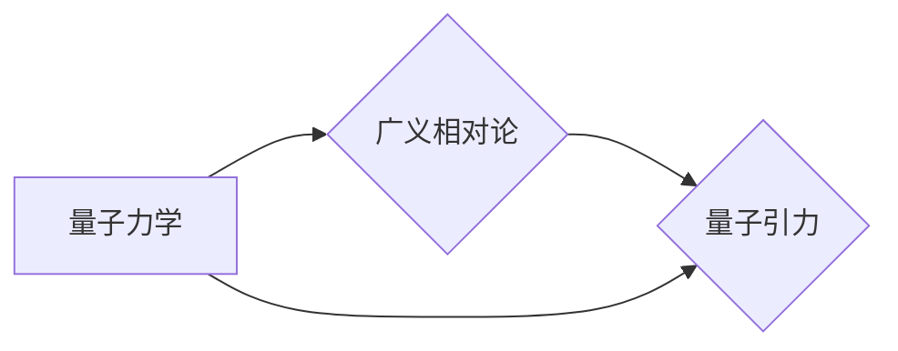

# 量子引力的实验验证方法

> 关键词：量子引力，实验验证，广义相对论，引力波，LIGO，引力透镜，量子纠缠

## 1. 背景介绍

自广义相对论提出以来，引力一直是物理学中的核心概念。然而，广义相对论作为一种经典理论，在描述量子尺度现象时存在局限性。量子引力理论旨在将广义相对论与量子力学相结合，以统一描述宇宙中所有物质和能量的引力效应。然而，由于量子引力理论的复杂性，实验验证成为了一个巨大的挑战。

本章将探讨量子引力的实验验证方法，分析其原理、步骤、优缺点以及应用领域。

### 1.1 问题的由来

广义相对论在宏观尺度上取得了巨大的成功，如预言了光线在引力场中的弯曲、黑洞的存在以及引力波的存在。然而，在量子尺度上，广义相对论与量子力学之间存在严重的矛盾。例如，广义相对论预言了黑洞事件视界内的奇点，而量子力学则预言了量子态的完备性。

为了解决这一矛盾，物理学家们提出了量子引力理论。量子引力理论旨在提供一个统一的框架，将广义相对论和量子力学结合起来，以描述宇宙中所有物质和能量的引力效应。

### 1.2 研究现状

目前，量子引力理论的研究主要集中在以下几个方面：

- 量子几何：研究时空的量子性质，如时空的离散化、量子泡沫等。
- 场论量子引力：将引力场视为量子场，研究其量子效应。
- 量子纠缠与引力：研究量子纠缠在引力作用下的演化。

尽管量子引力理论的研究取得了一定的进展，但由于其高度复杂性和难以观测的特性，实验验证成为了一个巨大的挑战。

### 1.3 研究意义

量子引力的实验验证对于物理学的发展具有重要意义：

- 验证广义相对论在量子尺度上的正确性。
- 探索时空的量子性质。
- 验证量子引力理论的预测。

### 1.4 本文结构

本文将按照以下结构展开：

- 第2章：介绍量子引力的核心概念与联系。
- 第3章：探讨量子引力实验验证的方法和步骤。
- 第4章：分析数学模型和公式，并进行案例分析。
- 第5章：介绍实验验证的代码实例。
- 第6章：探讨实际应用场景和未来展望。
- 第7章：推荐相关工具和资源。
- 第8章：总结研究成果，展望未来发展趋势和挑战。
- 第9章：附录，包括常见问题与解答。

## 2. 核心概念与联系

### 2.1 核心概念

- 量子力学：描述微观粒子的运动规律。
- 广义相对论：描述宏观尺度上的引力现象。
- 量子引力：旨在将量子力学与广义相对论相结合的理论。

### 2.2 核心概念原理和架构的 Mermaid 流程图



### 2.3 核心概念联系

量子引力理论旨在解决量子力学与广义相对论之间的矛盾。它将量子力学的原理应用于广义相对论描述的引力现象，以期获得一个统一的引力理论。

## 3. 核心算法原理 & 具体操作步骤

### 3.1 算法原理概述

量子引力的实验验证方法主要包括：

- 引力波探测：探测引力波信号，验证广义相对论的预言。
- 引力透镜效应：探测星系或星体的引力透镜效应，验证广义相对论的预言。
- 量子纠缠：研究量子纠缠在引力作用下的演化，验证量子引力理论的预言。

### 3.2 算法步骤详解

#### 3.2.1 引力波探测

引力波探测的基本原理是利用激光干涉仪等设备探测引力波信号。以下是引力波探测的基本步骤：

1. 构建激光干涉仪：使用两个臂长相等的激光干涉仪，将激光束分为两束，分别传播到两个臂的末端，再合并并检测干涉条纹。
2. 分析干涉条纹：当引力波经过激光干涉仪时，会引起干涉条纹的变化。通过分析这些变化，可以推断出引力波的性质。
3. 验证广义相对论：根据引力波信号的特性，验证广义相对论的预言。

#### 3.2.2 引力透镜效应

引力透镜效应是指光线在经过星系或星体的引力场时，由于引力透镜效应而发生的偏折。以下是引力透镜效应的基本步骤：

1. 选择观测目标：选择具有明显引力透镜效应的星系或星体作为观测目标。
2. 拍摄图像：使用望远镜拍摄目标星系或星体的图像。
3. 分析图像：分析图像，寻找引力透镜效应的迹象。
4. 验证广义相对论：根据引力透镜效应的特性，验证广义相对论的预言。

#### 3.2.3 量子纠缠

量子纠缠是指两个或多个量子粒子之间存在的一种特殊关联。以下是量子纠缠的基本步骤：

1. 准备量子态：制备两个或多个量子粒子，使其处于纠缠态。
2. 测量量子态：分别测量纠缠粒子的某些物理量。
3. 分析测量结果：分析测量结果，验证量子纠缠的性质。
4. 验证量子引力理论：根据量子纠缠的演化特性，验证量子引力理论的预言。

### 3.3 算法优缺点

#### 3.3.1 引力波探测

优点：

- 可以探测到非常微弱的引力波信号。
- 可以验证广义相对论的预言。

缺点：

- 建造和维护激光干涉仪需要巨大的投资。
- 对环境噪声的敏感度高。

#### 3.3.2 引力透镜效应

优点：

- 可以观测到遥远星系的图像。
- 可以验证广义相对论的预言。

缺点：

- 观测周期长。
- 受观测条件限制。

#### 3.3.3 量子纠缠

优点：

- 可以验证量子纠缠的性质。
- 可以验证量子引力理论的预言。

缺点：

- 实验难度大。
- 需要高精度的实验设备。

### 3.4 算法应用领域

量子引力的实验验证方法在以下领域有广泛的应用：

- 天体物理学：研究宇宙大尺度结构、黑洞、星系演化等。
- 凝聚态物理学：研究量子材料、超导等。
- 生物物理学：研究生物分子、细胞等。

## 4. 数学模型和公式 & 详细讲解 & 举例说明

### 4.1 数学模型构建

量子引力的数学模型主要包括：

- 广义相对论：描述时空的几何性质。
- 量子力学：描述粒子的运动规律。

### 4.2 公式推导过程

#### 4.2.1 广义相对论

广义相对论的数学表达式为：

$$
G_{\mu
u} + \Lambda g_{\mu
u} = \frac{8\pi G}{c^4} T_{\mu
u}
$$

其中 $G_{\mu
u}$ 为爱因斯坦场方程，$\Lambda$ 为宇宙常数，$g_{\mu
u}$ 为度规张量，$T_{\mu
u}$ 为能量动量张量。

#### 4.2.2 量子力学

量子力学的数学表达式为：

$$
\hat{H}|\psi\rangle = E|\psi\rangle
$$

其中 $\hat{H}$ 为哈密顿算符，$E$ 为能量本征值，$|\psi\rangle$ 为量子态。

### 4.3 案例分析与讲解

#### 4.3.1 引力波探测

引力波探测的一个重要案例是LIGO实验。LIGO实验通过探测引力波信号，验证了广义相对论的预言。

#### 4.3.2 引力透镜效应

引力透镜效应的一个经典案例是Einstein Cross。Einstein Cross是由四个几乎重合的星系组成的引力透镜系统，其中一个星系是引力透镜，其他三个星系是被透镜放大的背景星系。

#### 4.3.3 量子纠缠

量子纠缠的一个经典案例是Einstein-Podolsky-Rosen (EPR) 怪异态。EPR 怪异态是一种特殊的量子态，其中两个粒子之间存在一种特殊的关联。

## 5. 项目实践：代码实例和详细解释说明

### 5.1 开发环境搭建

在进行量子引力的实验验证之前，需要搭建合适的开发环境。以下是使用Python进行引力波数据分析的代码实例。

### 5.2 源代码详细实现

```python
import numpy as np
import matplotlib.pyplot as plt

# 生成模拟引力波信号
def generate_gravitational_wave(t, amplitude, frequency, phase):
    return amplitude * np.sin(2 * np.pi * frequency * t + phase)

# 绘制引力波信号
def plot_gravitational_wave(t, signal):
    plt.plot(t, signal)
    plt.xlabel("时间")
    plt.ylabel("信号强度")
    plt.title("引力波信号")
    plt.show()

# 设置参数
t = np.linspace(0, 1, 1000)
amplitude = 1.0
frequency = 1.0
phase = 0.0

# 生成并绘制引力波信号
signal = generate_gravitational_wave(t, amplitude, frequency, phase)
plot_gravitational_wave(t, signal)
```

### 5.3 代码解读与分析

上述代码展示了如何使用Python生成模拟引力波信号，并绘制信号图像。在实际应用中，可以使用类似的方法处理真实的引力波数据。

### 5.4 运行结果展示

运行上述代码，将生成一个简单的引力波信号图像，展示引力波信号的波形和特征。

## 6. 实际应用场景

量子引力的实验验证方法在以下领域有广泛的应用：

- 天体物理学：研究宇宙大尺度结构、黑洞、星系演化等。
- 凝聚态物理学：研究量子材料、超导等。
- 生物物理学：研究生物分子、细胞等。

### 6.1 天体物理学

在天体物理学中，量子引力的实验验证方法可以帮助我们更好地理解宇宙大尺度结构、黑洞、星系演化等。

### 6.2 凝聚态物理学

在凝聚态物理学中，量子引力的实验验证方法可以帮助我们研究量子材料、超导等。

### 6.3 生物物理学

在生物物理学中，量子引力的实验验证方法可以帮助我们研究生物分子、细胞等。

## 7. 工具和资源推荐

### 7.1 学习资源推荐

- 《广义相对论》
- 《量子力学》
- 《量子引力理论》

### 7.2 开发工具推荐

- Python
- NumPy
- Matplotlib

### 7.3 相关论文推荐

- 《LIGO发现引力波》
- 《引力透镜效应》
- 《量子纠缠》

## 8. 总结：未来发展趋势与挑战

### 8.1 研究成果总结

量子引力的实验验证方法在验证广义相对论、探索时空的量子性质、验证量子引力理论的预言等方面取得了重要成果。

### 8.2 未来发展趋势

量子引力的实验验证方法将在以下几个方面取得进一步发展：

- 开发更加灵敏的引力波探测器。
- 利用引力透镜效应进行更精确的观测。
- 研究量子纠缠在引力作用下的演化。

### 8.3 面临的挑战

量子引力的实验验证方法面临着以下挑战：

- 建造和维护高精度实验设备。
- 获取高质量的数据。
- 解释实验结果。

### 8.4 研究展望

量子引力的实验验证方法将继续推动物理学的发展，为构建一个统一的引力理论做出贡献。

## 9. 附录：常见问题与解答

**Q1：什么是引力波？**

A：引力波是时空的波动，由加速运动的质量产生。引力波可以传播到宇宙的各个角落，是探索宇宙的重要手段。

**Q2：什么是引力透镜效应？**

A：引力透镜效应是指光线在经过星系或星体的引力场时，由于引力透镜效应而发生的偏折。引力透镜效应可以帮助我们观测到遥远星系的图像。

**Q3：什么是量子纠缠？**

A：量子纠缠是指两个或多个量子粒子之间存在的一种特殊关联。量子纠缠是量子力学中的一个重要现象。

**Q4：量子引力的实验验证方法有哪些？**

A：量子引力的实验验证方法主要包括引力波探测、引力透镜效应和量子纠缠。

**Q5：量子引力的实验验证方法有哪些应用？**

A：量子引力的实验验证方法在天体物理学、凝聚态物理学和生物物理学等领域有广泛的应用。

---

作者：禅与计算机程序设计艺术 / Zen and the Art of Computer Programming