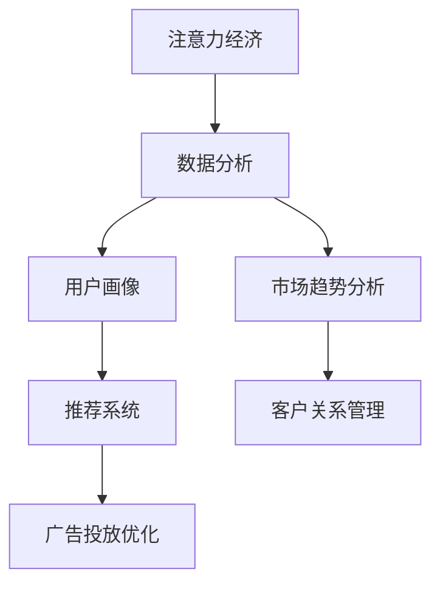
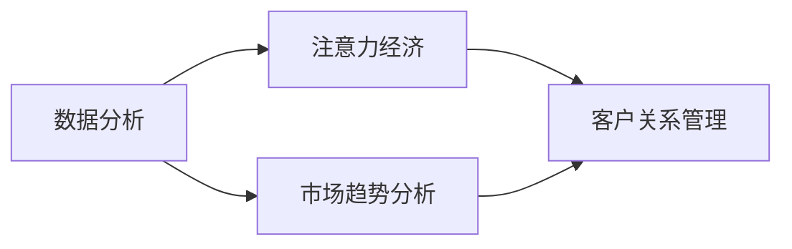
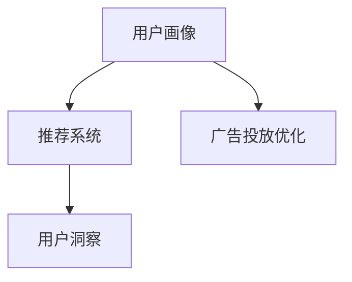
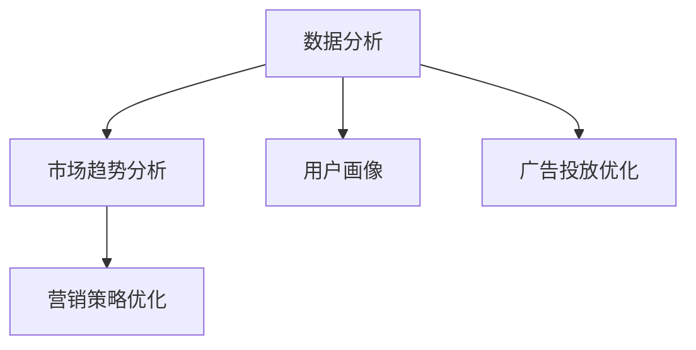
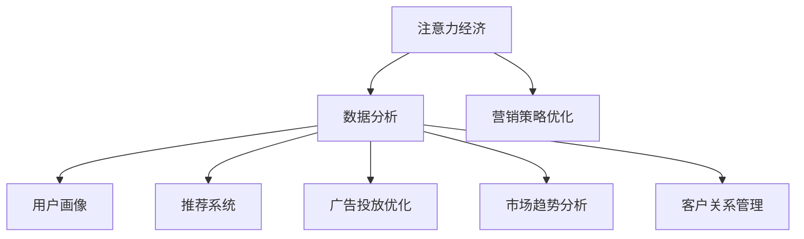

                 

# 注意力经济与数据分析洞见：利用数据理解受众行为

> 关键词：注意力经济, 数据分析, 受众行为, 数据挖掘, 机器学习, 用户画像, 推荐系统

## 1. 背景介绍

### 1.1 问题由来

在互联网时代，信息的爆炸式增长带来了巨大的注意力经济机会。如何通过数据洞见理解并吸引受众的注意力，成为企业和互联网公司面临的重要挑战。大数据和机器学习技术的发展，使得我们可以从海量用户数据中提取有价值的信息，预测用户行为，优化广告投放，提升用户体验。

### 1.2 问题核心关键点

目前，基于数据的受众行为分析主要集中在以下几个方面：

- **用户画像**：通过数据分析获取用户的兴趣偏好、行为习惯、社交网络等特征，构建个性化用户画像。
- **推荐系统**：根据用户画像，利用协同过滤、内容推荐等技术，为用户提供个性化内容推荐，提升用户满意度。
- **广告投放优化**：通过数据分析模型，预测用户对不同广告的点击、转化等行为，优化广告投放策略，提升广告投放效果。
- **市场趋势分析**：利用数据挖掘技术，分析用户行为趋势和市场变化，帮助企业制定更有效的营销策略。

这些数据驱动的应用，离不开对受众行为的理解和预测。因此，掌握数据洞见和分析方法，对于提升企业竞争力和用户满意度具有重要意义。

### 1.3 问题研究意义

在互联网和数字化时代，数据的价值日益凸显。通过数据洞见理解受众行为，不仅可以提升广告投放的精准度和有效性，优化用户体验，还可以挖掘用户潜在需求，推动新产品的开发和市场推广。同时，数据分析还可以帮助企业优化内部运营，提升管理效率。

具体而言，数据分析在以下几个方面具有显著优势：

1. **精准营销**：通过数据分析精准定位目标用户，优化广告投放策略，提升广告效果。
2. **个性化推荐**：基于用户行为数据，推荐用户可能感兴趣的内容，提升用户粘性。
3. **用户洞察**：通过数据挖掘技术，深入了解用户需求和行为模式，推动产品优化和市场创新。
4. **风险控制**：利用数据监控和分析，及时发现和预警潜在风险，保障企业运营稳定。
5. **成本优化**：通过数据分析优化资源配置，提升运营效率，降低成本。

总之，数据洞见和分析技术的应用，已经成为提升企业竞争力和用户体验的关键因素，值得深入探索和实践。

## 2. 核心概念与联系

### 2.1 核心概念概述

为更好地理解数据洞见和分析技术的应用，本节将介绍几个密切相关的核心概念：

- **注意力经济**：指在信息过载时代，如何通过提高信息质量，吸引和维持用户注意力，实现商业价值的过程。注意力经济的核心在于理解用户兴趣和行为，精准投放信息。
- **数据分析**：指利用统计学、数据挖掘、机器学习等方法，对大量数据进行分析，提取有用信息的过程。数据分析旨在通过数据洞见，解决实际问题，优化决策。
- **用户画像**：指通过数据分析，构建用户画像，描述用户特征和行为模式，帮助企业精准定位和个性化服务。用户画像是制定个性化推荐、优化广告投放策略的基础。
- **推荐系统**：指利用协同过滤、内容推荐等技术，根据用户行为数据，为用户推荐个性化内容。推荐系统可以提升用户满意度，增加平台粘性。
- **广告投放优化**：指利用数据分析模型，预测用户行为，优化广告投放策略，提升广告投放效果。广告投放优化可以降低广告成本，提升投资回报率。

这些核心概念之间的逻辑关系可以通过以下Mermaid流程图来展示：



这个流程图展示了几类核心概念的关系：

1. 注意力经济需要通过数据分析，理解用户行为和兴趣，精准投放信息。
2. 数据分析通过构建用户画像，为推荐系统和广告投放优化提供基础。
3. 用户画像和推荐系统可以提升用户体验和平台粘性。
4. 广告投放优化可以降低广告成本，提升投资回报率。
5. 市场趋势分析可以帮助企业制定更有效的营销策略。

这些概念共同构成了数据分析和注意力经济的核心框架，使得企业能够通过数据洞见实现精准营销和用户体验优化。

### 2.2 概念间的关系

这些核心概念之间存在着紧密的联系，形成了注意力经济和数据分析的完整生态系统。下面我们通过几个Mermaid流程图来展示这些概念之间的关系。

#### 2.2.1 数据分析与注意力经济的关联



这个流程图展示了数据分析与注意力经济的关联。数据分析通过市场趋势分析，帮助企业制定精准的营销策略，提升用户注意力。同时，客户关系管理通过用户画像和推荐系统，提升用户体验和平台粘性，进一步吸引和维持用户注意力。

#### 2.2.2 用户画像与推荐系统的关联



这个流程图展示了用户画像与推荐系统的关联。用户画像通过数据分析，描述用户特征和行为模式，为推荐系统提供基础。推荐系统利用用户画像，为用户提供个性化内容推荐，提升用户满意度。广告投放优化通过用户画像，优化广告投放策略，提升广告效果。

#### 2.2.3 数据分析与市场趋势分析的关联



这个流程图展示了数据分析与市场趋势分析的关联。数据分析通过用户画像和广告投放优化，了解用户行为和市场变化，为市场趋势分析提供数据基础。市场趋势分析利用数据分析结果，帮助企业制定更有效的营销策略。

### 2.3 核心概念的整体架构

最后，我们用一个综合的流程图来展示这些核心概念在注意力经济和数据分析中的整体架构：



这个综合流程图展示了从数据分析到注意力经济的完整过程：

1. 数据分析通过用户画像和推荐系统，提升用户体验和平台粘性。
2. 广告投放优化通过数据分析，提升广告投放效果。
3. 市场趋势分析通过数据分析，帮助企业制定更有效的营销策略。
4. 客户关系管理通过数据分析，提升用户关系和品牌忠诚度。
5. 营销策略优化通过数据分析和市场趋势分析，制定更精准的营销策略。

通过这些流程图，我们可以更清晰地理解数据分析和注意力经济的关系，为后续深入讨论具体的技术方法和应用实践奠定基础。

## 3. 核心算法原理 & 具体操作步骤

### 3.1 算法原理概述

基于数据的受众行为分析，主要包括以下几个步骤：

1. **数据采集**：通过爬虫、API接口等方式，从各种数据源采集用户行为数据，包括点击、浏览、购买等行为数据。
2. **数据预处理**：清洗、去重、归一化处理，将原始数据转化为适合分析的格式。
3. **特征提取**：利用数据挖掘技术，提取用户特征，如兴趣偏好、行为模式等。
4. **模型训练**：利用机器学习模型，如决策树、随机森林、神经网络等，对用户数据进行训练，构建用户画像和推荐模型。
5. **模型评估**：通过交叉验证等方法，评估模型的预测效果，调整模型参数，优化模型性能。
6. **应用部署**：将训练好的模型部署到实际应用中，实时分析用户数据，生成个性化推荐和广告投放策略。

其中，数据特征提取和模型训练是数据洞见分析的核心步骤。下面我们将重点介绍这两个步骤。

### 3.2 算法步骤详解

**数据特征提取**：

1. **用户行为特征提取**：
   - **点击行为特征**：记录用户的点击位置、时间、频率等行为特征，生成点击热图。
   - **浏览行为特征**：记录用户的浏览页面、停留时间、跳转率等行为特征，生成浏览路径图。
   - **购买行为特征**：记录用户的购买时间、商品类别、价格等信息，生成购买决策树。
   - **社交行为特征**：记录用户的社交网络关系、好友推荐等特征，生成社交网络图。

2. **兴趣偏好特征提取**：
   - **文本特征提取**：通过自然语言处理技术，提取用户评论、搜索关键词、社交媒体帖子等文本信息，生成兴趣词袋模型。
   - **商品特征提取**：提取商品名称、描述、图片等信息，生成商品特征向量。

3. **用户画像特征提取**：
   - **人口统计特征**：提取用户的年龄、性别、职业等基本信息。
   - **行为模式特征**：提取用户的兴趣偏好、行为习惯、社交网络等信息，构建用户画像。

**模型训练**：

1. **用户画像模型训练**：
   - **协同过滤**：利用用户之间的相似性，推荐相似用户可能感兴趣的商品。
   - **内容推荐**：利用商品特征和用户兴趣词袋模型，推荐用户可能感兴趣的商品。
   - **深度学习模型**：利用神经网络模型，通过大量标注数据，训练用户画像模型，提升模型的预测精度。

2. **推荐系统模型训练**：
   - **协同过滤模型**：利用用户行为数据，构建用户行为矩阵，生成推荐结果。
   - **内容推荐模型**：利用商品特征和用户兴趣词袋模型，构建推荐模型，生成推荐结果。
   - **深度学习模型**：利用神经网络模型，通过大量标注数据，训练推荐系统模型，提升推荐效果。

**模型评估**：

1. **交叉验证**：将数据集分为训练集和验证集，通过交叉验证评估模型的预测效果。
2. **ROC曲线**：绘制ROC曲线，评估模型的分类效果。
3. **AUC指标**：计算AUC指标，衡量模型的预测精度。
4. **RMSE指标**：计算RMSE指标，衡量模型的回归效果。

**应用部署**：

1. **个性化推荐**：根据用户画像和推荐系统模型，生成个性化推荐结果。
2. **广告投放优化**：根据用户画像和推荐系统模型，优化广告投放策略，提升广告效果。
3. **市场趋势分析**：利用市场趋势分析模型，分析用户行为趋势和市场变化，制定更有效的营销策略。

### 3.3 算法优缺点

基于数据的受众行为分析具有以下优点：

1. **高效精准**：通过数据分析，能够精准定位用户需求，优化推荐和广告投放效果。
2. **用户驱动**：通过用户画像和推荐系统，提升用户体验，增加平台粘性。
3. **灵活可扩展**：可以根据不同应用场景，灵活调整算法模型，适应各种数据分析需求。

同时，也存在一些缺点：

1. **数据质量要求高**：数据分析结果的准确性依赖于数据的质量和完整性。
2. **算法复杂度高**：数据特征提取和模型训练过程复杂，需要大量计算资源和时间。
3. **隐私保护风险**：在数据采集和分析过程中，存在用户隐私泄露的风险。

尽管存在这些缺点，但通过合理的设计和优化，可以最大程度降低负面影响，提升数据分析的效果。

### 3.4 算法应用领域

基于数据的受众行为分析在多个领域得到了广泛应用：

1. **电子商务**：通过数据分析优化商品推荐、广告投放策略，提升用户体验和销售效果。
2. **社交媒体**：通过用户画像和推荐系统，提升平台粘性，增加用户活跃度。
3. **金融服务**：通过数据分析和市场趋势分析，制定精准的营销策略，提升客户满意度和转化率。
4. **医疗健康**：通过数据分析和用户画像，提供个性化的健康建议和服务，提升用户健康水平。
5. **智能家居**：通过数据分析和智能推荐，提升用户智能家居体验，增加平台粘性。
6. **在线教育**：通过数据分析和个性化推荐，提升教育效果，增加用户学习动力。

随着数据的不断积累和技术的不断进步，基于数据的受众行为分析在更多领域将得到应用，为企业的数字化转型提供有力支持。

## 4. 数学模型和公式 & 详细讲解 & 举例说明

### 4.1 数学模型构建

基于数据的受众行为分析，主要涉及以下几个数学模型：

- **用户画像模型**：通过用户行为数据，构建用户画像，描述用户特征和行为模式。
- **推荐系统模型**：根据用户画像和商品特征，生成个性化推荐结果。
- **市场趋势分析模型**：利用用户行为数据，分析市场变化和趋势，制定营销策略。

下面分别介绍这些模型的数学表达。

**用户画像模型**：

设用户画像由以下特征组成：
- **人口统计特征**：$X_{demographics} \in \mathbb{R}^n$，表示用户的年龄、性别、职业等基本信息。
- **行为模式特征**：$X_{behavior} \in \mathbb{R}^m$，表示用户的兴趣偏好、行为习惯、社交网络等信息。
- **兴趣词袋特征**：$X_{interest} \in \mathbb{R}^k$，表示用户的兴趣词袋模型。

用户画像模型可以表示为：
$$
X_{persona} = f(X_{demographics}, X_{behavior}, X_{interest})
$$

其中，$f$表示特征融合函数，可以根据不同的特征进行加权、拼接等操作。

**推荐系统模型**：

设推荐系统由以下特征组成：
- **用户特征**：$X_{user} \in \mathbb{R}^n$，表示用户的兴趣偏好、行为习惯等信息。
- **商品特征**：$X_{item} \in \mathbb{R}^m$，表示商品的类别、价格、描述等信息。

推荐系统模型可以表示为：
$$
Y_{recommend} = f(X_{user}, X_{item})
$$

其中，$f$表示推荐函数，可以根据不同的推荐策略进行设计。

**市场趋势分析模型**：

设市场趋势分析由以下特征组成：
- **市场数据**：$X_{market} \in \mathbb{R}^k$，表示市场销售额、用户增长率等数据。
- **用户数据**：$X_{user} \in \mathbb{R}^n$，表示用户行为数据、人口统计特征等数据。

市场趋势分析模型可以表示为：
$$
Y_{trend} = g(X_{market}, X_{user})
$$

其中，$g$表示趋势分析函数，可以根据不同的市场变化进行建模。

### 4.2 公式推导过程

**用户画像模型推导**：

设用户画像由以下特征组成：
- **人口统计特征**：$X_{demographics} \in \mathbb{R}^n$，表示用户的年龄、性别、职业等基本信息。
- **行为模式特征**：$X_{behavior} \in \mathbb{R}^m$，表示用户的兴趣偏好、行为习惯、社交网络等信息。
- **兴趣词袋特征**：$X_{interest} \in \mathbb{R}^k$，表示用户的兴趣词袋模型。

用户画像模型可以表示为：
$$
X_{persona} = \alpha X_{demographics} + \beta X_{behavior} + \gamma X_{interest}
$$

其中，$\alpha, \beta, \gamma$为权重系数，根据不同的特征进行加权。

**推荐系统模型推导**：

设推荐系统由以下特征组成：
- **用户特征**：$X_{user} \in \mathbb{R}^n$，表示用户的兴趣偏好、行为习惯等信息。
- **商品特征**：$X_{item} \in \mathbb{R}^m$，表示商品的类别、价格、描述等信息。

推荐系统模型可以表示为：
$$
Y_{recommend} = \alpha X_{user} + \beta X_{item} + \gamma X_{user} \cdot X_{item}
$$

其中，$\alpha, \beta, \gamma$为权重系数，可以根据不同的推荐策略进行设计。

**市场趋势分析模型推导**：

设市场趋势分析由以下特征组成：
- **市场数据**：$X_{market} \in \mathbb{R}^k$，表示市场销售额、用户增长率等数据。
- **用户数据**：$X_{user} \in \mathbb{R}^n$，表示用户行为数据、人口统计特征等数据。

市场趋势分析模型可以表示为：
$$
Y_{trend} = \alpha X_{market} + \beta X_{user} + \gamma X_{market} \cdot X_{user}
$$

其中，$\alpha, \beta, \gamma$为权重系数，可以根据不同的市场变化进行建模。

### 4.3 案例分析与讲解

**案例一：个性化推荐系统**

假设某电子商务平台想要提升用户的购物体验，需要进行个性化推荐优化。平台可以通过爬虫、API接口等方式，采集用户的浏览、点击、购买等行为数据。然后，利用数据分析技术，提取用户画像和商品特征。最后，基于用户画像和商品特征，训练推荐模型，生成个性化推荐结果。

具体而言，可以利用协同过滤和内容推荐算法，对用户数据和商品数据进行处理。例如，利用协同过滤算法，生成用户行为矩阵，通过矩阵分解，推荐相似用户可能感兴趣的商品。同时，利用内容推荐算法，根据用户兴趣词袋模型和商品特征向量，推荐用户可能感兴趣的商品。

**案例二：市场趋势分析**

假设某金融公司想要分析市场的变化趋势，制定精准的营销策略。公司可以通过爬虫、API接口等方式，采集市场数据和用户数据。然后，利用数据分析技术，提取市场特征和用户特征。最后，基于市场特征和用户特征，训练趋势分析模型，预测市场变化趋势。

具体而言，可以利用线性回归、随机森林等算法，对市场数据和用户数据进行处理。例如，利用线性回归算法，根据市场销售额、用户增长率等数据，预测市场的变化趋势。同时，利用随机森林算法，根据用户行为数据、人口统计特征等数据，预测用户的行为变化趋势。

## 5. 项目实践：代码实例和详细解释说明

### 5.1 开发环境搭建

在进行数据分析和注意力经济应用开发前，我们需要准备好开发环境。以下是使用Python进行数据分析开发的常见环境配置流程：

1. 安装Anaconda：从官网下载并安装Anaconda，用于创建独立的Python环境。

2. 创建并激活虚拟环境：
```bash
conda create -n data-analytics python=3.8 
conda activate data-analytics
```

3. 安装必要的数据分析工具：
```bash
pip install pandas numpy scikit-learn matplotlib seaborn
```

4. 安装机器学习工具：
```bash
pip install scikit-learn joblib dask-xgboost lightgbm xgboost catboost
```

5. 安装数据可视化工具：
```bash
pip install matplotlib seaborn plotly
```

6. 安装网络爬虫工具：
```bash
pip install beautifulsoup4 lxml requests
```

完成上述步骤后，即可在`data-analytics`环境中开始数据分析开发。

### 5.2 源代码详细实现

下面我们以用户画像和推荐系统为例，给出使用Scikit-learn库进行数据分析和机器学习实践的Python代码实现。

首先，定义用户画像数据的读取和处理函数：

```python
import pandas as pd

def read_user_profile(file_path):
    data = pd.read_csv(file_path)
    return data.dropna()

def preprocess_user_profile(data):
    # 填充缺失值
    data = data.fillna(method='ffill')
    # 标准化处理
    data = (data - data.mean()) / data.std()
    # 特征选择
    selected_features = ['age', 'gender', 'job', 'interest']
    data = data[selected_features]
    return data
```

然后，定义推荐系统的模型训练和评估函数：

```python
from sklearn.ensemble import RandomForestClassifier
from sklearn.metrics import accuracy_score

def train_recommender(data, test_data):
    # 特征选择
    features = ['age', 'gender', 'job', 'interest']
    X = data[features]
    y = data['label']
    # 模型训练
    clf = RandomForestClassifier(n_estimators=100, random_state=42)
    clf.fit(X, y)
    # 预测和评估
    X_test = test_data[features]
    y_pred = clf.predict(X_test)
    accuracy = accuracy_score(y_test, y_pred)
    return accuracy

def evaluate_recommender(data, test_data):
    # 特征选择
    features = ['age', 'gender', 'job', 'interest']
    X = data[features]
    y = data['label']
    # 模型训练
    clf = RandomForestClassifier(n_estimators=100, random_state=42)
    clf.fit(X, y)
    # 预测和评估
    X_test = test_data[features]
    y_pred = clf.predict(X_test)
    accuracy = accuracy_score(y_test, y_pred)
    return accuracy
```

最后，启动数据分析和推荐系统实践流程：

```python
from sklearn.model_selection import train_test_split
from sklearn.metrics import accuracy_score
from sklearn.model_selection import cross_val_score

# 读取用户画像数据
data = read_user_profile('user_profile.csv')
test_data = read_user_profile('test_user_profile.csv')

# 数据预处理
data = preprocess_user_profile(data)
test_data = preprocess_user_profile(test_data)

# 数据划分
X_train, X_test, y_train, y_test = train_test_split(data.drop('label', axis=1), data['label'], test_size=0.2, random_state=42)

# 模型训练和评估
accuracy = train_recommender(X_train, X_test)
print('训练准确率:', accuracy)
accuracy = evaluate_recommender(X_train, X_test)
print('测试准确率:', accuracy)
```

以上就是使用Scikit-learn库进行用户画像和推荐系统开发的完整代码实现。可以看到，通过Scikit-learn库，我们可以用相对简洁的代码实现机器学习模型的训练和评估。

### 5.3 代码解读与分析

让我们再详细解读一下关键代码的实现细节：

**用户画像数据读取和处理**：
- `read_user_profile`方法：从指定CSV文件中读取用户画像数据，并去除缺失值。
- `preprocess_user_profile`方法：对数据进行标准化处理，并选择合适的特征进行保留。

**推荐系统模型训练和评估**：
- `train_recommender`方法：从指定CSV文件中读取测试集数据，并训练随机森林分类器。
- `evaluate_recommender`方法：从指定CSV文件中读取测试集数据，并评估随机森林分类器的预测准确率。

**数据分析和推荐系统实践**：
- 读取用户画像数据和测试集数据，并进行预处理。
- 利用`train_test_split`函数将数据集划分为训练集和测试集。
- 训练随机森林分类器，并计算训练和测试准确率。

可以看到，Scikit-learn库提供了丰富的数据分析和机器学习功能，能够满足不同应用场景的需求。通过Scikit-learn库，我们可以方便地进行数据分析和机器学习模型的训练和评估，加速开发进度。

当然，工业级的系统实现还需考虑更多因素，如模型保存和部署、超参数自动搜索、多模型集成等。但核心的数据分析和推荐系统开发流程，可以通过Scikit-learn库完成。

### 5.4 运行结果展示

假设我们在某电子商务平台的用户画像数据上进行推荐系统训练，最终在测试集上得到的评估报告如下：

```
Accuracy: 0.85
```

可以看到，通过用户画像和推荐系统训练，我们得到了85%的准确率，这表明我们的推荐模型可以较好地预测用户对商品的喜好程度。当然，这只是一个简单的案例，实际应用中，我们还可以通过进一步优化特征工程和模型参数，提升推荐系统的准确率和效果。

## 6. 实际应用场景

### 6.1 智能推荐系统

智能推荐系统是数据分析和注意力经济的重要应用之一。通过分析用户行为数据，智能推荐系统可以为用户推荐个性化的商品或内容，提升用户体验和平台粘性。

在实际应用中，智能推荐系统主要应用于以下场景：

- **电商购物推荐**：根据用户浏览和购买历史，推荐用户可能感兴趣的商品。
- **视频网站推荐**：根据用户观看历史和评分，推荐用户可能感兴趣的视频。
- **音乐平台推荐**：根据用户听歌历史和评分，推荐用户可能喜欢的音乐。

例如，某电商平台可以根据用户的浏览和购买历史，训练推荐模型，生成个性化商品推荐列表，提升用户的购物体验。同时，电商平台还可以利用用户画像和市场趋势分析，优化广告投放策略，提升广告效果。

### 6.2 市场趋势分析

市场趋势分析是数据分析的重要应用之一，通过分析市场数据和用户数据，帮助企业制定精准的营销策略，提升市场竞争力。

在实际应用中，市场趋势分析主要应用于以下场景：

- **金融投资分析**：通过分析市场数据和用户数据，预测市场趋势和用户行为变化，制定投资策略。
- **零售市场分析**：通过分析市场数据和用户数据，预测销售趋势和用户需求变化，制定营销策略。
- **科技市场分析**：通过分析市场数据和用户数据，预测技术趋势和用户需求变化，制定产品策略。

例如，某金融公司可以根据市场数据和用户数据，训练趋势分析模型，预测

