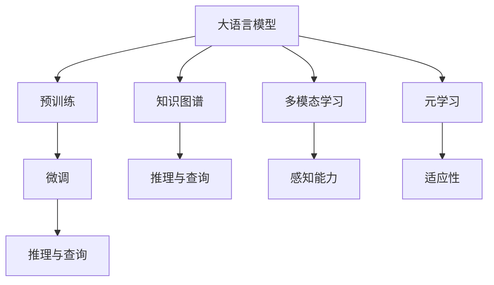
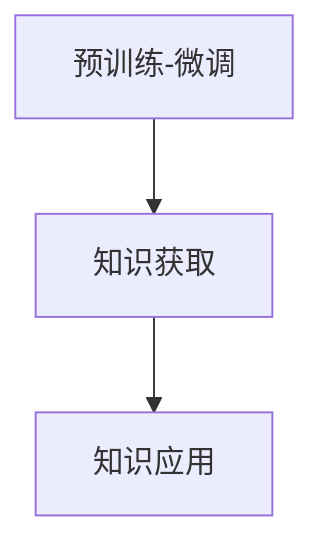
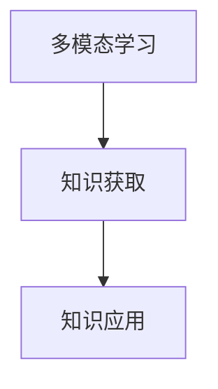
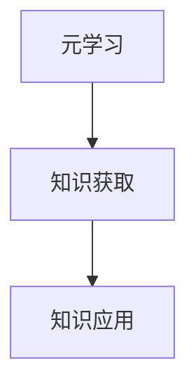
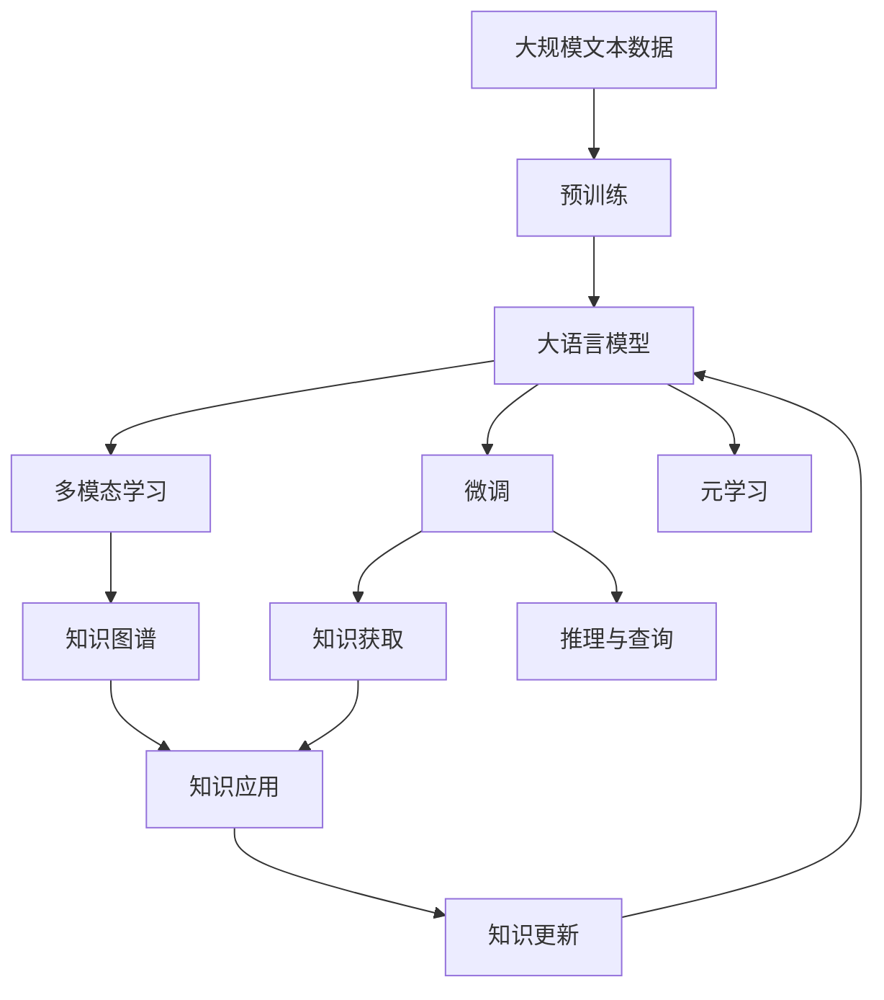

                 

## 1. 背景介绍

### 1.1 问题由来
在信息爆炸的时代，我们面对的不仅是数据的爆炸性增长，还有知识的爆炸性膨胀。如何从海量数据中提取有效信息，如何更好地理解和应用知识，已经成为制约人工智能发展的瓶颈之一。人工智能的核心任务之一是“理解”，而“理解”的基础是对知识的获取、组织和应用。

传统的知识获取方式，如专家系统、规则引擎、逻辑推理等，存在一定局限性：

1. **人工编写规则**：需要专家手工编写规则，成本高，易出错。
2. **规则复用性差**：每条规则只能解决特定场景，难以应对复杂多变的现实世界。
3. **知识更新困难**：规则库维护困难，难以动态更新，限制了系统的灵活性。

而基于深度学习的大模型，如GPT、BERT等，通过在海量数据上预训练，自动学习语言和知识表示，具有自适应性强、泛化能力强等优点。但这些模型仍需要进一步的训练和微调，以更好地适应特定任务和场景。

### 1.2 问题核心关键点
本文聚焦于大模型在知识获取和应用中的突破点，即如何利用大模型的预训练能力，结合先进的算法和技术，实现知识的获取、组织和应用，从而突破知识限制，构建更强大的智能系统。

### 1.3 问题研究意义
研究大模型在知识获取和应用中的突破点，对于拓展大模型的应用范围，提升系统的智能水平，加速人工智能技术的产业化进程，具有重要意义：

1. **降低知识获取成本**。利用大模型的自适应性，减少手工编写规则的需求，提高知识获取效率。
2. **增强知识泛化能力**。大模型的泛化能力强，能够更好地适应复杂的现实世界，提升系统的智能水平。
3. **提高知识更新灵活性**。大模型可动态更新，适应新知识和场景，提升系统的灵活性和适应性。
4. **提升系统智能水平**。结合大模型和先进算法，构建更强大的智能系统，为各行各业提供智能决策支持。
5. **加速人工智能应用**。大模型和先进算法相结合，能够更快速地应用于实际场景，推动人工智能技术的产业化。

## 2. 核心概念与联系

### 2.1 核心概念概述

为更好地理解大模型在知识获取和应用中的突破点，本节将介绍几个密切相关的核心概念：

- **大语言模型(Large Language Model, LLM)**：如GPT、BERT等，通过在海量数据上预训练，学习语言的通用表示，具有强大的语言理解和生成能力。
- **知识图谱(Knowledge Graph)**：由实体和关系构成的有向图，用于表示和组织知识，支持复杂推理和查询。
- **预训练-微调(Fine-tuning)**：利用大模型的预训练能力，通过下游任务的少量标注数据，优化模型在该任务上的性能，提升知识获取和应用能力。
- **多模态学习(Multimodal Learning)**：结合多种模态（如文本、图像、语音等）数据，提升系统的感知能力和理解深度。
- **元学习(Meta-Learning)**：学习如何学习，提升系统的适应性和迁移能力，能够快速学习新知识。

这些核心概念之间的逻辑关系可以通过以下Mermaid流程图来展示：



这个流程图展示了大模型在知识获取和应用中的主要组成和相互关系：

1. 大语言模型通过预训练学习语言和知识表示。
2. 知识图谱用于组织和表示知识，支持复杂推理和查询。
3. 预训练-微调通过下游任务的标注数据，优化模型性能，提升知识获取和应用能力。
4. 多模态学习结合多种数据模态，提升系统的感知能力和理解深度。
5. 元学习学习如何学习，提升系统的适应性和迁移能力，能够快速学习新知识。

这些概念共同构成了大模型在知识获取和应用中的完整框架，为后续深入讨论提供了基础。

### 2.2 概念间的关系

这些核心概念之间存在着紧密的联系，形成了知识获取和应用的完整生态系统。下面我通过几个Mermaid流程图来展示这些概念之间的关系。

#### 2.2.1 大模型与知识图谱的关系


这个流程图展示了大模型与知识图谱之间的关系：

1. 大模型通过预训练学习语言和知识表示。
2. 知识图谱用于组织和表示知识，支持复杂推理和查询。
3. 大模型结合知识图谱，可以更准确地获取和应用知识。

#### 2.2.2 预训练-微调与知识获取的关系



这个流程图展示了预训练-微调在知识获取中的作用：

1. 预训练-微调通过下游任务的标注数据，优化模型性能，提升知识获取能力。
2. 知识获取能力增强后，可以更有效地应用到实际任务中。

#### 2.2.3 多模态学习与知识获取的关系



这个流程图展示了多模态学习在知识获取中的作用：

1. 多模态学习结合文本、图像、语音等多种数据模态，提升系统的感知能力和理解深度。
2. 感知能力增强后，可以更全面地获取和应用知识。

#### 2.2.4 元学习与知识获取的关系



这个流程图展示了元学习在知识获取中的作用：

1. 元学习学习如何学习，提升系统的适应性和迁移能力。
2. 系统具备更强的适应性和迁移能力后，能够更快速地获取和应用新知识。

### 2.3 核心概念的整体架构

最后，我们用一个综合的流程图来展示这些核心概念在大模型知识获取和应用中的整体架构：



这个综合流程图展示了从预训练到微调，再到知识获取和应用的完整过程。大语言模型首先在大规模文本数据上进行预训练，然后通过微调（包括全参数微调和参数高效微调）或元学习获得知识获取能力。同时，利用多模态学习和知识图谱技术，提升系统的感知能力和理解深度，结合推理和查询能力，对知识进行全面获取和应用。最后，通过知识更新机制，模型能够不断学习新知识，保持智能水平。 通过这些流程图，我们可以更清晰地理解大模型在知识获取和应用中的各个环节，为后续深入讨论具体的算法和技术奠定基础。

## 3. 核心算法原理 & 具体操作步骤
### 3.1 算法原理概述

基于大模型的知识获取和应用，本质上是一个自监督学习和有监督学习相结合的过程。其核心思想是：利用大模型的预训练能力，通过下游任务的少量标注数据，优化模型在该任务上的性能，提升知识获取和应用能力。

形式化地，假设大语言模型为 $M_{\theta}$，其中 $\theta$ 为预训练得到的模型参数。给定下游任务 $T$ 的标注数据集 $D=\{(x_i,y_i)\}_{i=1}^N, x_i \in \mathcal{X}, y_i \in \mathcal{Y}$。微调的目标是找到新的模型参数 $\hat{\theta}$，使得：

$$
\hat{\theta}=\mathop{\arg\min}_{\theta} \mathcal{L}(M_{\theta},D)
$$

其中 $\mathcal{L}$ 为针对任务 $T$ 设计的损失函数，用于衡量模型预测输出与真实标签之间的差异。常见的损失函数包括交叉熵损失、均方误差损失等。

通过梯度下降等优化算法，微调过程不断更新模型参数 $\theta$，最小化损失函数 $\mathcal{L}$，使得模型输出逼近真实标签。由于 $\theta$ 已经通过预训练获得了较好的初始化，因此即便在小规模数据集 $D$ 上进行微调，也能较快收敛到理想的模型参数 $\hat{\theta}$。

### 3.2 算法步骤详解

基于大模型的知识获取和应用，一般包括以下几个关键步骤：

**Step 1: 准备预训练模型和数据集**
- 选择合适的预训练语言模型 $M_{\theta}$ 作为初始化参数，如 BERT、GPT 等。
- 准备下游任务 $T$ 的标注数据集 $D$，划分为训练集、验证集和测试集。一般要求标注数据与预训练数据的分布不要差异过大。

**Step 2: 设计任务适配层**
- 根据任务类型，在预训练模型顶层设计合适的输出层和损失函数。
- 对于分类任务，通常在顶层添加线性分类器和交叉熵损失函数。
- 对于生成任务，通常使用语言模型的解码器输出概率分布，并以负对数似然为损失函数。

**Step 3: 设置微调超参数**
- 选择合适的优化算法及其参数，如 AdamW、SGD 等，设置学习率、批大小、迭代轮数等。
- 设置正则化技术及强度，包括权重衰减、Dropout、Early Stopping 等。
- 确定冻结预训练参数的策略，如仅微调顶层，或全部参数都参与微调。

**Step 4: 执行梯度训练**
- 将训练集数据分批次输入模型，前向传播计算损失函数。
- 反向传播计算参数梯度，根据设定的优化算法和学习率更新模型参数。
- 周期性在验证集上评估模型性能，根据性能指标决定是否触发 Early Stopping。
- 重复上述步骤直到满足预设的迭代轮数或 Early Stopping 条件。

**Step 5: 测试和部署**
- 在测试集上评估微调后模型 $M_{\hat{\theta}}$ 的性能，对比微调前后的精度提升。
- 使用微调后的模型对新样本进行推理预测，集成到实际的应用系统中。
- 持续收集新的数据，定期重新微调模型，以适应数据分布的变化。

以上是基于大模型的知识获取和应用的一般流程。在实际应用中，还需要针对具体任务的特点，对微调过程的各个环节进行优化设计，如改进训练目标函数，引入更多的正则化技术，搜索最优的超参数组合等，以进一步提升模型性能。

### 3.3 算法优缺点

基于大模型的知识获取和应用方法具有以下优点：

1. **简单高效**：只需准备少量标注数据，即可对预训练模型进行快速适配，获得较大的性能提升。
2. **通用适用**：适用于各种NLP下游任务，包括分类、匹配、生成等，设计简单的任务适配层即可实现知识获取。
3. **参数高效**：利用参数高效微调技术，在固定大部分预训练参数的情况下，仍可取得不错的提升。
4. **效果显著**：在学术界和工业界的诸多任务上，基于微调的方法已经刷新了多项SOTA。

同时，该方法也存在一定的局限性：

1. **依赖标注数据**：微调的效果很大程度上取决于标注数据的质量和数量，获取高质量标注数据的成本较高。
2. **迁移能力有限**：当目标任务与预训练数据的分布差异较大时，微调的性能提升有限。
3. **负面效果传递**：预训练模型的固有偏见、有害信息等，可能通过微调传递到下游任务，造成负面影响。
4. **可解释性不足**：微调模型的决策过程通常缺乏可解释性，难以对其推理逻辑进行分析和调试。

尽管存在这些局限性，但就目前而言，基于大模型的微调方法仍是大模型应用的最主流范式。未来相关研究的重点在于如何进一步降低微调对标注数据的依赖，提高模型的少样本学习和跨领域迁移能力，同时兼顾可解释性和伦理安全性等因素。

### 3.4 算法应用领域

基于大模型的知识获取和应用方法，在NLP领域已经得到了广泛的应用，覆盖了几乎所有常见任务，例如：

- 文本分类：如情感分析、主题分类、意图识别等。通过微调使模型学习文本-标签映射。
- 命名实体识别：识别文本中的人名、地名、机构名等特定实体。通过微调使模型掌握实体边界和类型。
- 关系抽取：从文本中抽取实体之间的语义关系。通过微调使模型学习实体-关系三元组。
- 问答系统：对自然语言问题给出答案。将问题-答案对作为微调数据，训练模型学习匹配答案。
- 机器翻译：将源语言文本翻译成目标语言。通过微调使模型学习语言-语言映射。
- 文本摘要：将长文本压缩成简短摘要。将文章-摘要对作为微调数据，使模型学习抓取要点。
- 对话系统：使机器能够与人自然对话。将多轮对话历史作为上下文，微调模型进行回复生成。

除了上述这些经典任务外，大模型知识获取和应用也被创新性地应用到更多场景中，如可控文本生成、常识推理、代码生成、数据增强等，为NLP技术带来了全新的突破。随着预训练模型和微调方法的不断进步，相信NLP技术将在更广阔的应用领域大放异彩。

## 4. 数学模型和公式 & 详细讲解 & 举例说明

### 4.1 数学模型构建

本节将使用数学语言对基于大模型的知识获取和应用过程进行更加严格的刻画。

记大语言模型为 $M_{\theta}$，其中 $\theta$ 为预训练得到的模型参数。假设微调任务的训练集为 $D=\{(x_i,y_i)\}_{i=1}^N, x_i \in \mathcal{X}, y_i \in \mathcal{Y}$。

定义模型 $M_{\theta}$ 在数据样本 $(x,y)$ 上的损失函数为 $\ell(M_{\theta}(x),y)$，则在数据集 $D$ 上的经验风险为：

$$
\mathcal{L}(\theta) = \frac{1}{N} \sum_{i=1}^N \ell(M_{\theta}(x_i),y_i)
$$

微调的优化目标是最小化经验风险，即找到最优参数：

$$
\theta^* = \mathop{\arg\min}_{\theta} \mathcal{L}(\theta)
$$

在实践中，我们通常使用基于梯度的优化算法（如SGD、Adam等）来近似求解上述最优化问题。设 $\eta$ 为学习率，$\lambda$ 为正则化系数，则参数的更新公式为：

$$
\theta \leftarrow \theta - \eta \nabla_{\theta}\mathcal{L}(\theta) - \eta\lambda\theta
$$

其中 $\nabla_{\theta}\mathcal{L}(\theta)$ 为损失函数对参数 $\theta$ 的梯度，可通过反向传播算法高效计算。

### 4.2 公式推导过程

以下我们以二分类任务为例，推导交叉熵损失函数及其梯度的计算公式。

假设模型 $M_{\theta}$ 在输入 $x$ 上的输出为 $\hat{y}=M_{\theta}(x) \in [0,1]$，表示样本属于正类的概率。真实标签 $y \in \{0,1\}$。则二分类交叉熵损失函数定义为：

$$
\ell(M_{\theta}(x),y) = -[y\log \hat{y} + (1-y)\log (1-\hat{y})]
$$

将其代入经验风险公式，得：

$$
\mathcal{L}(\theta) = -\frac{1}{N}\sum_{i=1}^N [y_i\log M_{\theta}(x_i)+(1-y_i)\log(1-M_{\theta}(x_i))]
$$

根据链式法则，损失函数对参数 $\theta_k$ 的梯度为：

$$
\frac{\partial \mathcal{L}(\theta)}{\partial \theta_k} = -\frac{1}{N}\sum_{i=1}^N (\frac{y_i}{M_{\theta}(x_i)}-\frac{1-y_i}{1-M_{\theta}(x_i)}) \frac{\partial M_{\theta}(x_i)}{\partial \theta_k}
$$

其中 $\frac{\partial M_{\theta}(x_i)}{\partial \theta_k}$ 可进一步递归展开，利用自动微分技术完成计算。

在得到损失函数的梯度后，即可带入参数更新公式，完成模型的迭代优化。重复上述过程直至收敛，最终得到适应下游任务的最优模型参数 $\theta^*$。

### 4.3 案例分析与讲解

以命名实体识别(NER)任务为例，展示如何使用大模型进行知识获取和应用。

假设我们使用BERT模型进行微调。首先需要对训练集进行预处理，包括分词、标注实体边界和类型等。然后将标注后的数据输入模型，训练过程中不断调整模型参数，直到收敛。具体步骤如下：

1. 数据预处理：使用BERT的分词器对文本进行分词，标注每个词的实体边界和类型，生成训练样本。
2. 模型初始化：选择BERT模型作为初始化参数，设定学习率和批大小。
3. 模型训练：将训练样本输入模型，计算损失函数，反向传播更新模型参数。
4. 模型评估：在验证集上评估模型性能，调整超参数。
5. 模型测试：在测试集上评估模型性能，输出最终结果。

在实际应用中，为了提升模型效果，我们可以采用以下方法：

- **数据增强**：通过对训练样本进行改写、回译等方式丰富训练集多样性。
- **正则化技术**：使用L2正则、Dropout、Early Stopping等防止模型过度适应小规模训练集。
- **参数高效微调**：只更新少量模型参数，固定大部分预训练权重不变。
- **多模型集成**：训练多个微调模型，取平均输出，抑制过拟合。

## 5. 项目实践：代码实例和详细解释说明

### 5.1 开发环境搭建

在进行知识获取和应用实践前，我们需要准备好开发环境。以下是使用Python进行PyTorch开发的环境配置流程：

1. 安装Anaconda：从官网下载并安装Anaconda，用于创建独立的Python环境。

2. 创建并激活虚拟环境：
```bash
conda create -n pytorch-env python=3.8 
conda activate pytorch-env
```

3. 安装PyTorch：根据CUDA版本，从官网获取对应的安装命令。例如：
```bash
conda install pytorch torchvision torchaudio cudatoolkit=11.1 -c pytorch -c conda-forge
```

4. 安装Transformers库：
```bash
pip install transformers
```

5. 安装各类工具包：
```bash
pip install numpy pandas scikit-learn matplotlib tqdm jupyter notebook ipython
```

完成上述步骤后，即可在`pytorch-env`环境中开始知识获取和应用实践。

### 5.2 源代码详细实现

下面我以命名实体识别(NER)任务为例，给出使用Transformers库对BERT模型进行微调的PyTorch代码实现。

首先，定义NER任务的数据处理函数：

```python
from transformers import BertTokenizer
from torch.utils.data import Dataset
import torch

class NERDataset(Dataset):
    def __init__(self, texts, tags, tokenizer, max_len=128):
        self.texts = texts
        self.tags = tags
        self.tokenizer = tokenizer
        self.max_len = max_len
        
    def __len__(self):
        return len(self.texts)
    
    def __getitem__(self, item):
        text = self.texts[item]
        tags = self.tags[item]
        
        encoding = self.tokenizer(text, return_tensors='pt', max_length=self.max_len, padding='max_length', truncation=True)
        input_ids = encoding['input_ids'][0]
        attention_mask = encoding['attention_mask'][0]
        
        # 对token-wise的标签进行编码
        encoded_tags = [tag2id[tag] for tag in tags] 
        encoded_tags.extend([tag2id['O']] * (self.max_len - len(encoded_tags)))
        labels = torch.tensor(encoded_tags, dtype=torch.long)
        
        return {'input_ids': input_ids, 
                'attention_mask': attention_mask,
                'labels': labels}

# 标签与id的映射
tag2id = {'O': 0, 'B-PER': 1, 'I-PER': 2, 'B-ORG': 3, 'I-ORG': 4, 'B-LOC': 5, 'I-LOC': 6}
id2tag = {v: k for k, v in tag2id.items()}

# 创建dataset
tokenizer = BertTokenizer.from_pretrained('bert-base-cased')

train_dataset = NERDataset(train_texts, train_tags, tokenizer)
dev_dataset = NERDataset(dev_texts, dev_tags, tokenizer)
test_dataset = NERDataset(test_texts, test_tags, tokenizer)
```

然后，定义模型和优化器：

```python
from transformers import BertForTokenClassification, AdamW

model = BertForTokenClassification.from_pretrained('bert-base-cased', num_labels=len(tag2id))

optimizer = AdamW(model.parameters(), lr=2e-5)
```

接着，定义训练和评估函数：

```python
from torch.utils.data import DataLoader
from tqdm import tqdm
from sklearn.metrics import classification_report

device = torch.device('cuda') if torch.cuda.is_available() else torch.device('cpu')
model.to(device)

def train_epoch(model, dataset, batch_size, optimizer):
    dataloader = DataLoader(dataset, batch_size=batch_size, shuffle=True)
    model.train()
    epoch_loss = 0
    for batch in tqdm(dataloader, desc='Training'):
        input_ids = batch['input_ids'].to(device)
        attention_mask = batch['attention_mask'].to(device)
        labels = batch['labels'].to(device)
        model.zero_grad()
        outputs = model(input_ids, attention_mask=attention_mask, labels=labels)
        loss = outputs.loss
        epoch_loss += loss.item()
        loss.backward()
        optimizer.step()
    return epoch_loss / len(dataloader)

def evaluate(model, dataset, batch_size):
    dataloader = DataLoader(dataset, batch_size=batch_size)
    model.eval()
    preds, labels = [], []
    with torch.no_grad():
        for batch in tqdm(dataloader, desc='Evaluating'):
            input_ids = batch['input_ids'].to(device)
            attention_mask = batch['attention_mask'].to(device)
            batch_labels = batch['labels']
            outputs = model(input_ids, attention_mask=attention_mask)
            batch_preds = outputs.logits.argmax(dim=2).to('cpu').tolist()
            batch_labels = batch_labels.to('cpu').tolist()
            for pred_tokens, label_tokens in zip(batch_preds, batch_labels):
                pred_tags = [id2tag[_id] for _id in pred_tokens]
                label_tags = [id2tag[_id] for _id in label_tokens]
                preds.append(pred_tags[:len(label_tags)])
                labels.append(label_tags)
                
    print(classification_report(labels, preds))
```

最后，启动训练流程并在测试集上评估：

```python
epochs = 5
batch_size = 16

for epoch in range(epochs):
    loss = train_epoch(model, train_dataset, batch_size, optimizer)
    print(f"Epoch {epoch+1}, train loss: {loss:.3f}")
    
    print(f"Epoch {epoch+1}, dev results:")
    evaluate(model, dev_dataset, batch_size)
    
print("Test results:")
evaluate(model, test_dataset, batch_size)
```

以上就是使用PyTorch对BERT进行命名实体识别任务微调的完整代码实现。可以看到，得益于Transformers库的强大封装，我们可以用相对简洁的代码完成BERT模型的加载和微调。

### 5.3 代码解读与分析

让我们再详细解读一下关键代码的实现细节：

**NERDataset类**：
- `__init__`方法：初始化文本、标签、分词器等关键组件。
- `__len__`方法：返回数据集的样本数量。
- `__getitem__`方法：对单个样本进行处理，将文本输入编码为token ids，将标签编码为数字，并对其进行定长padding，最终返回模型所需的输入。

**tag2id和id2tag字典**：
- 定义了标签与数字id之间的映射关系，用于将token-wise的预测结果解码回真实的标签。

**训练和评估函数**：
- 使用PyTorch的DataLoader对数据集进行批次化加载，供模型训练和推理使用。
- 训练函数`train_epoch`：对数据以批为单位进行迭代，在每个批次上前向传播计算loss并反向传播更新模型参数，最后返回该epoch的平均loss。
- 评估函数`evaluate`：与训练

