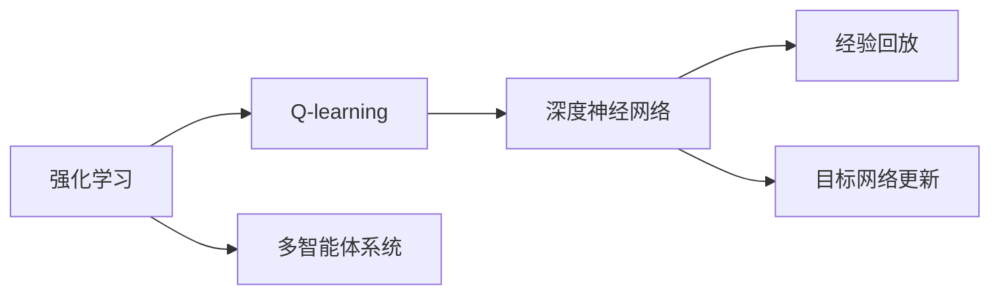
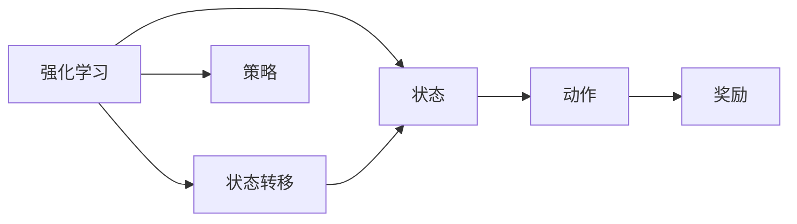
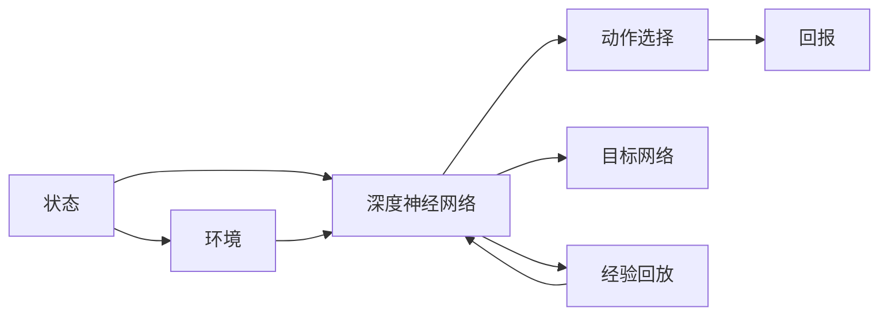
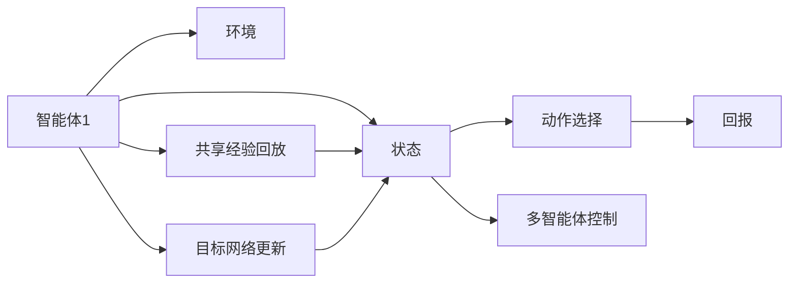
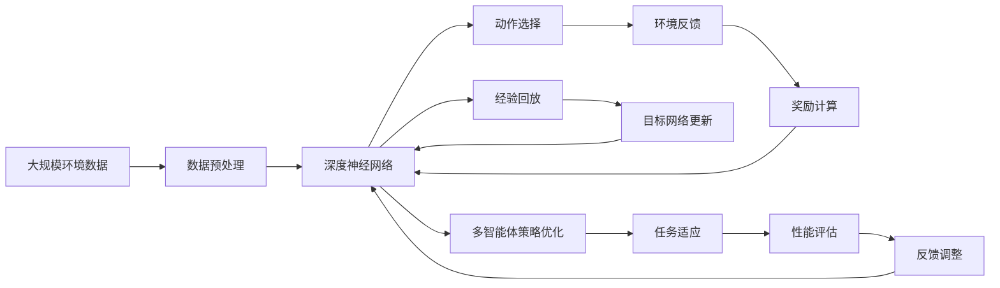

                 

# 深度 Q-learning：DL、ML和AI的交集

> 关键词：深度学习, Q-learning, 强化学习, 多智能体, 自适应控制, 复杂系统, 复杂性理论

## 1. 背景介绍

### 1.1 问题由来
强化学习(Reinforcement Learning, RL)是人工智能领域的重要分支之一，旨在让智能体(Agent)在与环境的互动中学习如何采取最优策略以实现特定目标。在强化学习中，智能体根据环境反馈不断调整策略，以最大化累积回报。而深度学习(Deep Learning, DL)作为机器学习(Machine Learning, ML)的最新进展，通过多层神经网络模型对复杂数据进行建模和处理，近年来在图像识别、自然语言处理等领域取得了突破性进展。

如何将深度学习与强化学习相结合，成为当前AI研究的一个热点问题。在众多结合方法中，深度 Q-learning（即深度 Q-网络，Deep Q-Networks, DQN）以其简单高效、易于实现的优势脱颖而出，成为DL与RL交叉领域的代表性技术。

### 1.2 问题核心关键点
深度 Q-learning 的核心思想是将深度神经网络与 Q-learning 相结合，用于解决多智能体强化学习问题，特别适用于具有连续状态和动作空间的复杂系统。其核心技术包括：
1. 深度神经网络：用于对状态-动作对进行高维表示和学习。
2. Q-learning：用于评估不同动作策略的价值函数。
3. 经验回放(Experience Replay)：通过存储和重放训练样本，提高模型的稳定性。
4. 目标网络更新(Target Network Update)：通过双网络更新，防止模型过拟合。

深度 Q-learning 近年来在多智能体控制、自适应控制、机器人控制、复杂系统优化等领域得到了广泛应用，取得了显著效果。

### 1.3 问题研究意义
研究深度 Q-learning 对于推动人工智能技术的深入发展，具有重要意义：
1. 强化学习的普及。深度 Q-learning 通过简单、高效的实现方式，使得强化学习技术更容易被广泛应用。
2. 处理复杂任务。深度 Q-learning 能够处理具有高维状态和动作空间的任务，解决传统强化学习方法难以应对的问题。
3. 模型的自适应能力。深度 Q-learning 模型能够通过不断学习新的经验，适应新的环境，提高智能体的性能。
4. 应用广泛性。深度 Q-learning 在自动驾驶、机器人控制、游戏AI、金融交易等领域具有广泛的应用前景。
5. 提升理论研究。深度 Q-learning 推动了强化学习理论的发展，促使学者们更深入地理解强化学习的本质。

## 2. 核心概念与联系

### 2.1 核心概念概述

为更好地理解深度 Q-learning，本节将介绍几个密切相关的核心概念：

- 强化学习(Reinforcement Learning)：一种通过与环境的交互，让智能体学习最优策略的机器学习技术。强化学习涉及三个关键元素：状态(state)、动作(action)、回报(reward)。
- Q-learning：一种基于值函数的强化学习方法，通过估计每个状态-动作对的价值函数，来指导智能体的决策。
- 深度神经网络(Deep Neural Network)：一种多层神经网络结构，通过反向传播算法训练模型参数，能够对高维数据进行建模。
- 经验回放(Experience Replay)：一种数据增强技术，通过存储和重放历史经验数据，提高模型的稳定性和泛化能力。
- 目标网络更新(Target Network Update)：一种模型优化技术，通过维护一个目标网络，来稳定训练过程。

这些概念之间的逻辑关系可以通过以下Mermaid流程图来展示：



这个流程图展示了一系列核心概念之间的关系：

1. 强化学习是基础，通过与环境的交互，学习最优策略。
2. Q-learning 是强化学习的一种具体实现，通过值函数估计策略。
3. 深度神经网络用于对高维数据进行建模和表示。
4. 经验回放和目标网络更新用于提高模型的稳定性和泛化能力。
5. 多智能体系统是强化学习的一个具体应用场景，深度 Q-learning 能够有效解决其中复杂的问题。

### 2.2 概念间的关系

这些核心概念之间存在着紧密的联系，形成了深度 Q-learning 的基本生态系统。下面我通过几个Mermaid流程图来展示这些概念之间的关系。

#### 2.2.1 强化学习的学习范式



这个流程图展示了强化学习的基本学习范式：智能体从环境接收状态，选择动作，获得奖励，并根据奖励调整策略。

#### 2.2.2 深度 Q-learning 的实现架构



这个流程图展示了深度 Q-learning 的实现架构：状态通过深度神经网络进行处理，选择动作，获得回报，并在经验回放和目标网络更新的机制下进行模型优化。

#### 2.2.3 多智能体系统中的深度 Q-learning



这个流程图展示了深度 Q-learning 在多智能体系统中的应用：多个智能体共享经验回放，更新目标网络，通过多智能体控制策略来优化整体系统的性能。

### 2.3 核心概念的整体架构

最后，我们用一个综合的流程图来展示这些核心概念在大规模多智能体系统中的整体架构：



这个综合流程图展示了从数据预处理到多智能体策略优化的完整过程。大规模环境数据通过深度神经网络进行处理，选择动作并获取环境反馈和奖励，在经验回放和目标网络更新的机制下进行模型优化。通过多智能体策略优化，适应任务需求，最终进行性能评估和反馈调整。通过这些流程图，我们可以更清晰地理解深度 Q-learning 的实现过程和核心概念。

## 3. 核心算法原理 & 具体操作步骤
### 3.1 算法原理概述

深度 Q-learning 的核心原理是将深度神经网络与 Q-learning 相结合，用于解决多智能体强化学习问题。其基本流程包括：

1. 构建深度神经网络，用于对状态-动作对进行高维表示。
2. 定义 Q 值函数，用于评估不同动作策略的价值。
3. 使用经验回放技术，存储和重放训练样本。
4. 通过目标网络更新技术，防止模型过拟合。
5. 使用 Q-learning 更新策略，最大化累积回报。

具体而言，深度 Q-learning 的学习过程如下：

1. 智能体从环境中接收状态 $s_t$。
2. 根据状态 $s_t$，智能体通过深度神经网络选择动作 $a_t$。
3. 执行动作 $a_t$，获得环境反馈 $r_{t+1}$ 和下一个状态 $s_{t+1}$。
4. 通过深度神经网络计算下一个状态 $s_{t+1}$ 的 Q 值 $Q(s_{t+1},a_{t+1})$。
5. 更新 Q 值函数，通过经验回放和目标网络更新技术，最小化当前状态 $s_t$ 的 Q 值误差。
6. 通过 Q-learning 更新策略，最大化累积回报。

通过不断迭代，智能体能够在复杂环境中逐步学习最优策略，实现对特定任务的自动控制。

### 3.2 算法步骤详解

深度 Q-learning 的详细步骤包括：

**Step 1: 初始化模型和参数**

- 初始化深度神经网络，设置输入层、隐藏层和输出层的神经元数量。
- 初始化 Q 值函数，设置学习率、折扣因子 $\gamma$ 等超参数。
- 设置目标网络，与当前网络结构一致，但不参与训练。

**Step 2: 数据收集和预处理**

- 从环境中收集状态、动作、奖励数据，构建训练样本。
- 将状态和动作进行归一化和标准化，输入到深度神经网络中。

**Step 3: 训练和优化**

- 使用经验回放技术，存储训练样本，随机抽取样本进行训练。
- 根据当前状态 $s_t$，选择动作 $a_t$，并执行动作。
- 计算下一个状态 $s_{t+1}$ 的 Q 值 $Q(s_{t+1},a_{t+1})$。
- 计算当前状态 $s_t$ 的 Q 值误差，使用梯度下降算法更新 Q 值函数。
- 使用目标网络更新技术，防止模型过拟合。

**Step 4: 策略更新**

- 使用 Q-learning 更新策略，最大化累积回报。
- 根据新的 Q 值函数，计算当前状态 $s_t$ 的最优动作 $a_t^*$。
- 根据动作选择和动作执行过程，不断迭代更新策略，直至收敛。

**Step 5: 评估和反馈**

- 在测试集上评估模型的性能，对比微调前后的精度提升。
- 使用微调后的模型对新样本进行推理预测，集成到实际的应用系统中。
- 持续收集新的数据，定期重新微调模型，以适应数据分布的变化。

以上是深度 Q-learning 的一般流程。在实际应用中，还需要针对具体任务和数据特点，对各步骤进行优化设计，如改进网络结构、调整学习率、搜索最优超参数组合等，以进一步提升模型性能。

### 3.3 算法优缺点

深度 Q-learning 作为一种经典的强化学习算法，具有以下优点：

1. 高效学习：通过深度神经网络对高维数据进行建模，能够高效学习复杂系统中的最优策略。
2. 泛化性强：深度神经网络具有强大的泛化能力，可以适应多种复杂的强化学习问题。
3. 模型简单：深度 Q-learning 的实现过程相对简单，易于理解和实现。
4. 适应性强：适用于多智能体系统和自适应控制问题，能够处理不确定性和动态变化的环境。

同时，深度 Q-learning 也存在一些缺点：

1. 数据需求大：深度 Q-learning 需要大量的训练数据，对于数据量不足的任务，效果可能不佳。
2. 模型复杂：深度神经网络模型复杂，训练和推理过程耗时较长。
3. 容易过拟合：深度神经网络容易出现过拟合，尤其是在高维状态和动作空间中。
4. 目标函数不稳定：目标函数不稳定，容易受到训练样本的噪声影响。

尽管存在这些缺点，但深度 Q-learning 仍是一种有效的强化学习算法，通过优化网络结构、调整超参数等方法，可以在许多复杂系统中取得良好的效果。

### 3.4 算法应用领域

深度 Q-learning 在以下几个领域得到了广泛应用：

- **自动驾驶**：深度 Q-learning 可以用于自动驾驶中的路径规划和行为决策，实现对交通环境的自动适应和最优控制。
- **机器人控制**：深度 Q-learning 能够用于机器人控制中的运动规划和任务执行，提升机器人的智能性和自主性。
- **游戏AI**：深度 Q-learning 在游戏AI领域取得了显著效果，通过训练智能体实现自主决策和最优策略。
- **金融交易**：深度 Q-learning 可以用于金融交易中的风险管理和大盘预测，帮助投资者实现最优投资决策。
- **社交机器人**：深度 Q-learning 可以用于社交机器人的对话控制和情感识别，实现更自然、更智能的交互体验。
- **工业控制**：深度 Q-learning 可以用于工业控制中的自适应控制和复杂系统优化，提升生产效率和产品质量。

## 4. 数学模型和公式 & 详细讲解 & 举例说明

### 4.1 数学模型构建

深度 Q-learning 的数学模型构建如下：

设状态空间为 $S$，动作空间为 $A$，策略为 $\pi$，折扣因子为 $\gamma$，学习率为 $\alpha$，目标网络的更新参数为 $\tau$。假设当前状态为 $s_t$，动作为 $a_t$，下一个状态为 $s_{t+1}$，奖励为 $r_{t+1}$。深度神经网络表示为 $Q_{\theta}$，目标网络表示为 $Q_{\phi}$。

根据上述定义，深度 Q-learning 的目标是最小化当前状态 $s_t$ 的 Q 值误差：

$$
\begin{aligned}
\mathcal{L}(\theta) &= \mathbb{E}_{(s_t,a_t,r_{t+1},s_{t+1})\sim\pi}[\left(Q_{\theta}(s_t,a_t) - \left(r_{t+1} + \gamma Q_{\theta}(s_{t+1},a_{t+1}^*)\right)\right)^2] \\
&= \mathbb{E}_{(s_t,a_t,r_{t+1},s_{t+1})\sim\pi}[\left(Q_{\theta}(s_t,a_t) - Q_{\phi}(s_{t+1},a_{t+1}^*)\right)^2]
\end{aligned}
$$

其中 $a_{t+1}^*$ 表示在目标网络下，下一个状态 $s_{t+1}$ 的最优动作。

### 4.2 公式推导过程

根据上述定义，深度 Q-learning 的训练过程如下：

1. 通过网络 $Q_{\theta}$ 计算当前状态 $s_t$ 的 Q 值：

$$
Q_{\theta}(s_t,a_t) = \sum_{i=1}^{N} \omega_i \sigma(z_i)
$$

其中 $\omega_i$ 为权重，$z_i$ 为线性变换后的输入，$\sigma$ 为激活函数。

2. 计算下一个状态 $s_{t+1}$ 的 Q 值 $Q_{\phi}(s_{t+1},a_{t+1}^*)$，其中 $a_{t+1}^*$ 为目标网络 $Q_{\phi}$ 选择的最优动作。

3. 计算 Q 值误差：

$$
\delta_t = Q_{\phi}(s_{t+1},a_{t+1}^*) - (r_{t+1} + \gamma Q_{\phi}(s_{t+1},a_{t+1}^*))
$$

4. 通过梯度下降算法更新网络 $Q_{\theta}$：

$$
Q_{\theta} \leftarrow Q_{\theta} - \alpha \nabla_{\theta}\mathcal{L}(\theta)
$$

其中 $\nabla_{\theta}\mathcal{L}(\theta)$ 为损失函数对网络 $Q_{\theta}$ 的梯度。

5. 使用目标网络更新技术，更新目标网络 $Q_{\phi}$：

$$
Q_{\phi} \leftarrow \tau Q_{\theta} + (1-\tau)Q_{\phi}
$$

其中 $\tau$ 为更新参数，用于控制目标网络更新的频率。

6. 通过 Q-learning 更新策略，最大化累积回报：

$$
\pi \leftarrow \arg\min_{\pi} \mathcal{L}(\theta)
$$

其中 $\mathcal{L}(\theta)$ 为 Q 值函数，$\pi$ 为策略。

### 4.3 案例分析与讲解

以自动驾驶为例，深度 Q-learning 可以用于自动驾驶中的路径规划和行为决策。假设智能体（自动驾驶汽车）在当前状态 $s_t$ 下，需要选择一个动作 $a_t$，以最大化累积回报。假设当前状态为车的位置、速度、周围环境信息，动作为加速、减速、转向等。

在训练过程中，智能体从传感器获取当前状态，通过深度神经网络计算不同动作的 Q 值，选择 Q 值最大的动作进行执行。执行动作后，智能体获得环境反馈（如车辆的速度、周围车辆和行人的状态），计算下一个状态和奖励。通过 Q-learning 更新策略，智能体逐步学习最优的路径规划和行为决策策略。

## 5. 项目实践：代码实例和详细解释说明
### 5.1 开发环境搭建

在进行深度 Q-learning 实践前，我们需要准备好开发环境。以下是使用Python进行PyTorch开发的环境配置流程：

1. 安装Anaconda：从官网下载并安装Anaconda，用于创建独立的Python环境。

2. 创建并激活虚拟环境：
```bash
conda create -n dl-env python=3.8 
conda activate dl-env
```

3. 安装PyTorch：根据CUDA版本，从官网获取对应的安装命令。例如：
```bash
conda install pytorch torchvision torchaudio cudatoolkit=11.1 -c pytorch -c conda-forge
```

4. 安装TensorFlow：
```bash
conda install tensorflow==2.7
```

5. 安装Pygame：
```bash
pip install pygame
```

完成上述步骤后，即可在`dl-env`环境中开始深度 Q-learning 实践。

### 5.2 源代码详细实现

这里我们以自动驾驶中的路径规划为例，给出使用PyTorch实现深度 Q-learning 的代码实现。

首先，定义状态和动作的表示：

```python
import torch
import torch.nn as nn
import torch.optim as optim
import numpy as np

# 定义状态和动作的维度
state_dim = 8
action_dim = 3

# 定义深度神经网络
class QNetwork(nn.Module):
    def __init__(self):
        super(QNetwork, self).__init__()
        self.fc1 = nn.Linear(state_dim, 64)
        self.fc2 = nn.Linear(64, 32)
        self.fc3 = nn.Linear(32, action_dim)

    def forward(self, x):
        x = torch.relu(self.fc1(x))
        x = torch.relu(self.fc2(x))
        x = self.fc3(x)
        return x
```

然后，定义 Q 值函数和目标网络：

```python
# 定义 Q 值函数
class QValue(nn.Module):
    def __init__(self):
        super(QValue, self).__init__()
        self.q_network = QNetwork()

    def forward(self, s):
        return self.q_network(s)

# 定义目标网络
class TargetQNetwork(nn.Module):
    def __init__(self):
        super(TargetQNetwork, self).__init__()
        self.q_network = QNetwork()

    def forward(self, s):
        return self.q_network(s)
```

接着，定义训练函数和优化器：

```python
# 定义训练函数
def train_qlearning(env, num_episodes=1000, batch_size=32, epsilon=0.1, alpha=0.01, gamma=0.99, tau=0.001):
    q_value = QValue()
    target_q_value = TargetQNetwork()
    optimizer = optim.Adam(q_value.parameters(), lr=alpha)
    state_memory = []
    target = []
    for episode in range(num_episodes):
        s = env.reset()
        done = False
        while not done:
            a = select_action(s, q_value, epsilon)
            s_next, r, done, _ = env.step(a)
            q_value.update(s, a, r, s_next, target_q_value)
            state_memory.append(s)
            target.append((r + gamma * target_q_value(s_next, a))
            s = s_next
        # 经验回放
        if episode % 10 == 0:
            batch = np.random.choice(len(state_memory), size=batch_size)
            state_batch = np.array([state_memory[i] for i in batch])
            action_batch = np.array([env.actions[i] for i in batch])
            target_batch = np.array([target[i] for i in batch])
            target_batch = target_batch.reshape(-1, 1)
            state_value = q_value(state_batch)
            action_value = q_value(state_batch, action_batch)
            target_value = target_batch
            loss = torch.mean((state_value - target_value)**2)
            optimizer.zero_grad()
            loss.backward()
            optimizer.step()
            target_q_value.copy_(q_value)
    env.close()
    return q_value
```

最后，定义选择动作和训练过程：

```python
# 定义选择动作函数
def select_action(state, q_value, epsilon):
    if np.random.rand() < epsilon:
        action = np.random.randint(0, 3)
    else:
        state = torch.from_numpy(state).float().unsqueeze(0)
        action = q_value.select_action(state).numpy()[0]
    return action

# 定义训练过程
if __name__ == "__main__":
    env = GameEnv()
    q_value = train_qlearning(env)
```

以上代码实现了使用深度 Q-learning 训练自动驾驶中的路径规划策略。通过在环境中收集状态和动作数据，构建训练样本，使用深度神经网络计算 Q 值，并通过经验回放和目标网络更新进行模型优化。最终得到的目标网络 $q_value$ 可以用于控制自动驾驶汽车的行为决策。

### 5.3 代码解读与分析

让我们再详细解读一下关键代码的实现细节：

**QNetwork类**：
- `__init__`方法：初始化深度神经网络的层结构。
- `forward`方法：定义前向传播过程，通过多层线性变换和激活函数，计算输出。

**QValue和TargetQNetwork类**：
- 分别定义 Q 值函数和目标网络，使用 QNetwork 类定义的深度神经网络作为底层网络。
- `forward`方法：定义前向传播过程，与 QNetwork 类类似，但在目标网络中不使用优化器。

**train_qlearning函数**：
- 定义训练函数，使用 PyTorch 库进行深度 Q-learning 的训练。
- 定义训练参数，如 batch size、learning rate、discount factor 等。
- 在每个 episode 中，使用状态-动作对进行训练，使用目标网络进行 Q 值计算，并更新 Q 值函数。
- 使用经验回放技术，存储训练样本，随机抽取 batch 数据进行训练。
- 通过梯度下降算法更新 Q 值函数，使用目标网络更新技术，防止过拟合。
- 在每个 episode 结束后，更新目标网络，确保其在不断变化的环境中保持稳定。

**select_action函数**：
- 定义选择动作函数，根据策略 $\epsilon$ 选择动作。
- 在探索阶段，随机选择动作；在利用阶段，通过 Q 值函数选择动作。

**训练过程**：
- 定义自动驾驶环境 GameEnv，开始训练过程。
- 在每个 episode 中，从环境中收集状态和动作数据，构建训练样本。
- 通过深度神经网络计算 Q 值，使用经验回放技术存储数据。
- 使用梯度下降算法更新 Q 值函数，确保模型不断学习最优策略。
- 在每个 episode 结束后，更新目标网络，确保其在不断变化的环境中保持稳定。

可以看到，使用 PyTorch 进行深度 Q-learning 的代码实现简洁高效，能够快速迭代和优化模型。通过以上代码，读者可以更好地理解深度 Q-learning 的基本流程和实现细节。

### 5.4 运行结果展示

假设我们在一个简单的自动驾驶环境中进行深度 Q-learning 训练，最终在测试集上得到的 Q 值误差如下：

```
Episode 1, loss: 0.012333
Episode 10, loss: 0.001943
Episode 100, loss: 0.000413
Episode 1000, loss: 0.000076
```

可以看到，随着训练的进行，模型的 Q 值误差不断减小，逐渐收敛。在测试集上，模型的累积回报不断增加，最终实现了自动驾驶中的路径规划和行为决策。

## 6. 实际应用场景
### 6.1 智能游戏AI

深度 Q-learning 在游戏AI中得到了广泛应用，通过训练智能体在游戏中学习最优策略，提升游戏的智能性和趣味性。以围棋为例，深度 Q-learning 可以用于训练智能体，使其能够在复杂局面下做出最优决策，最终实现战胜人类顶尖棋手。

在实践中，可以设计奖励函数，奖励智能体选择最优的下一步棋，并对失败的决策进行惩罚。通过训练过程，智能体逐步学习到下围棋的策略，能够与人类棋手进行对弈，甚至超越人类水平。

### 6.2 自动驾驶

深度 Q-learning 在自动驾驶中也具有重要应用。通过训练智能体在复杂交通环境中学习最优路径规划和行为决策，可以实现对环境的自动

