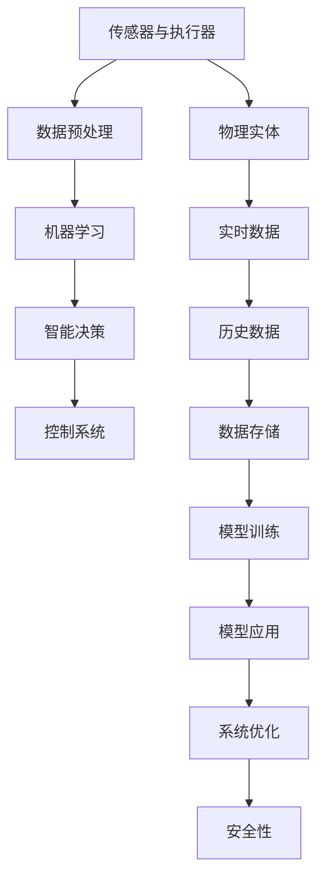
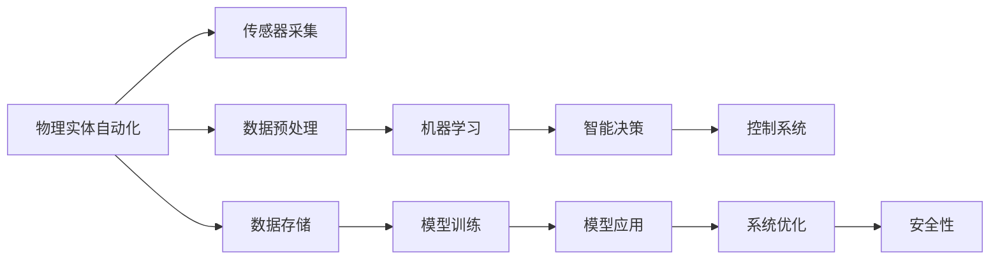
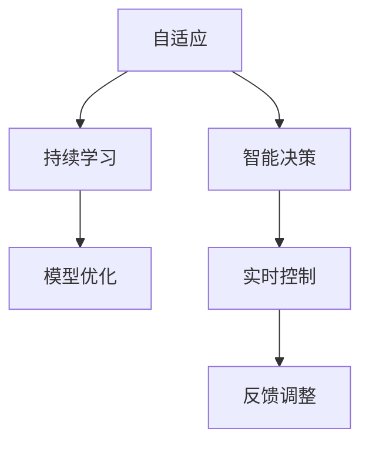
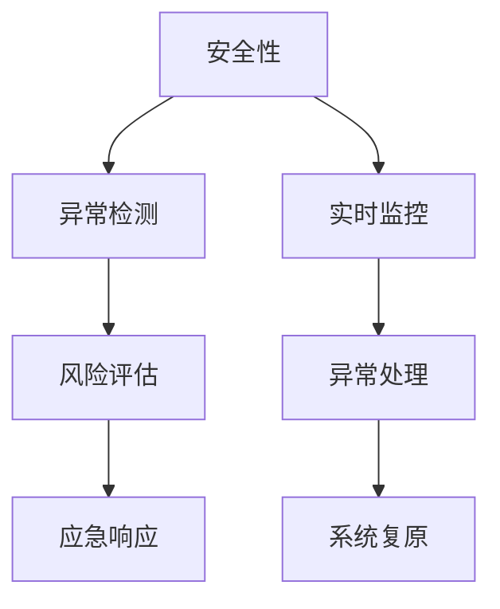
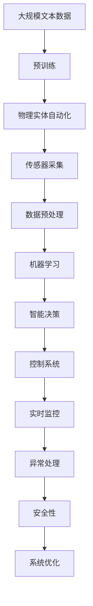

                 

# 物理实体自动化的最新突破

## 1. 背景介绍

### 1.1 问题由来
随着人工智能技术的发展，物理实体自动化（Physical Entity Automation, PEA）成为了研究的热点。PEA 指的是利用机器学习、机器人技术等手段，实现对物理世界的自动监控、管理、控制和优化。传统的物理实体自动化主要依赖于传感器、控制器和执行器等硬件设备的组合，但这些设备通常昂贵且难以维护，且需要人力进行监控和干预。而物理实体自动化技术的应用，有望大幅度提升工作效率，降低成本，改善用户体验，是未来智能化发展的关键方向。

### 1.2 问题核心关键点
物理实体自动化的核心关键点在于如何将机器学习与物理实体进行有效结合，实现对物理世界的智能化管理。主要包括以下几个方面：

- **数据采集与处理**：物理实体的状态和环境需要实时采集，并进行数据预处理和特征提取。
- **智能决策与控制**：利用机器学习算法对采集数据进行分析，做出智能决策，并通过控制系统对物理实体进行操作。
- **优化与自适应**：通过持续学习，优化模型的决策能力，适应不同的物理实体和环境变化。
- **安全性与可靠性**：保证自动化系统的安全性，避免意外事故，提高系统的可靠性。

### 1.3 问题研究意义
物理实体自动化的研究对于提升生产效率、改善用户体验、推动智能制造具有重要意义：

1. **降低成本**：自动化系统可以减少人力成本，提高生产效率，降低错误率。
2. **提高生产质量**：通过智能决策，确保产品质量，减少次品率。
3. **优化资源配置**：自动化系统可以优化资源配置，减少能源浪费。
4. **促进智能制造**：自动化技术是智能制造的基础，推动制造业向智能化方向发展。
5. **增强用户体验**：通过自动化技术，可以实现更加个性化、定制化的服务。

## 2. 核心概念与联系

### 2.1 核心概念概述

为了更好地理解物理实体自动化的实现过程，本节将介绍几个核心概念：

- **物理实体**：指的是可以被监控、控制和优化的物理对象，如工业生产线上的机器人、仓库中的货物、智能家居中的设备等。
- **传感器与执行器**：用于采集物理实体的状态数据和环境信息，以及执行系统指令的硬件设备。
- **机器学习**：通过训练模型，利用历史数据和实时数据，做出智能决策，指导系统的控制和优化。
- **控制系统**：用于执行模型决策的自动化控制系统，包括自动控制、安全保护、故障检测等功能。
- **数据预处理**：将原始数据进行清洗、归一化、特征提取等处理，以便于模型的训练和分析。
- **智能决策**：通过训练模型，对物理实体和环境数据进行分析，做出最优决策，控制物理实体。
- **自适应**：系统能够持续学习新的数据和环境变化，适应不同的物理实体和环境。
- **安全性**：保证自动化系统的安全性，避免意外事故，提高系统的可靠性。

这些核心概念之间的逻辑关系可以通过以下Mermaid流程图来展示：



这个流程图展示了从传感器采集数据，到数据预处理、机器学习、智能决策、控制系统，再到系统优化和安全性保证的完整过程。

### 2.2 概念间的关系

这些核心概念之间存在着紧密的联系，形成了物理实体自动化的完整生态系统。下面我通过几个Mermaid流程图来展示这些概念之间的关系。

#### 2.2.1 物理实体自动化的学习范式



这个流程图展示了物理实体自动化的主要学习范式，包括传感器采集、数据预处理、机器学习、智能决策、控制系统，以及数据存储、模型训练、模型应用、系统优化和安全性的完整流程。

#### 2.2.2 自适应与智能决策的关系



这个流程图展示了自适应与智能决策的关系。自适应通过持续学习不断优化模型，而智能决策则利用优化后的模型进行实时控制和反馈调整，形成一个闭环反馈系统。

#### 2.2.3 安全性与控制系统的关系



这个流程图展示了安全性与控制系统的关系。安全性通过实时监控和异常检测，评估风险并制定应急响应策略，保障系统的安全和稳定。

### 2.3 核心概念的整体架构

最后，我用一个综合的流程图来展示这些核心概念在大模型微调过程中的整体架构：



这个综合流程图展示了从预训练到物理实体自动化的完整过程。物理实体自动化首先在大规模文本数据上进行预训练，然后通过传感器采集数据，经过数据预处理和机器学习，进行智能决策和控制系统，最后进行实时监控和异常处理，确保系统的安全性，并不断优化系统性能。 通过这些流程图，我们可以更清晰地理解物理实体自动化的工作原理和优化方向。

## 3. 核心算法原理 & 具体操作步骤
### 3.1 算法原理概述

物理实体自动化的核心算法原理主要包括以下几个方面：

- **数据采集与处理**：通过传感器采集物理实体的状态和环境数据，并进行数据预处理和特征提取，以便于后续的机器学习分析。
- **智能决策与控制**：利用机器学习算法对采集数据进行分析，做出最优决策，并通过控制系统对物理实体进行操作。
- **优化与自适应**：通过持续学习，优化模型的决策能力，适应不同的物理实体和环境变化。
- **安全性与可靠性**：利用异常检测和应急响应技术，保障自动化系统的安全性，避免意外事故。

### 3.2 算法步骤详解

物理实体自动化的算法步骤主要包括以下几个关键步骤：

1. **数据采集**：通过传感器采集物理实体的状态和环境数据，并将数据发送至数据处理中心。
2. **数据预处理**：对采集到的数据进行清洗、归一化、特征提取等处理，以便于后续的机器学习分析。
3. **模型训练**：利用历史数据和实时数据训练机器学习模型，以便于做出智能决策。
4. **智能决策**：通过训练好的模型对采集到的数据进行分析，做出最优决策，控制物理实体。
5. **实时控制**：根据决策结果，通过控制系统对物理实体进行操作。
6. **异常检测与应急响应**：利用异常检测技术监测系统的运行状态，及时发现异常情况，并采取应急响应措施。
7. **持续学习与优化**：通过持续学习新的数据和环境变化，优化模型的决策能力，适应不同的物理实体和环境。

### 3.3 算法优缺点

物理实体自动化的算法具有以下优点：

- **高效性**：自动化系统能够实现24小时不间断监控，大幅提高生产效率。
- **可靠性**：自动化系统具有高度的可靠性，减少人工干预，降低错误率。
- **成本低**：自动化系统减少了人力成本，提高了资源利用率。
- **灵活性**：自动化系统可以根据不同的物理实体和环境变化进行自适应调整。

同时，物理实体自动化的算法也存在以下缺点：

- **高成本**：初始投资成本较高，需要大量传感器和执行器。
- **技术复杂**：自动化系统需要多学科技术支持，技术实现复杂。
- **安全性问题**：自动化系统存在潜在的安全隐患，需要额外的安全保障措施。
- **依赖环境**：自动化系统的运行效果依赖于环境条件，环境变化可能导致系统性能下降。

### 3.4 算法应用领域

物理实体自动化的算法已经在多个领域得到了广泛应用，包括但不限于：

- **智能制造**：利用自动化系统实现智能生产、质量检测、故障诊断等。
- **智慧城市**：通过自动化系统实现智能交通、能源管理、环境监测等。
- **智能家居**：利用自动化系统实现智能照明、温控、安防等。
- **智能医疗**：利用自动化系统实现智能监控、数据分析、远程诊断等。
- **智能农业**：利用自动化系统实现智能灌溉、病虫害监测、产量预测等。

## 4. 数学模型和公式 & 详细讲解 & 举例说明

### 4.1 数学模型构建

物理实体自动化的数学模型主要包括以下几个部分：

- **数据采集模型**：用于描述传感器采集数据的过程，通常可以表示为函数 $f(x) = y$，其中 $x$ 表示输入的传感器数据，$y$ 表示采集到的物理实体状态。
- **数据预处理模型**：用于描述数据清洗、归一化和特征提取的过程，通常可以表示为函数 $g(x) = z$，其中 $z$ 表示预处理后的数据。
- **机器学习模型**：用于描述利用历史数据和实时数据训练模型的过程，通常可以表示为函数 $h(z) = w$，其中 $w$ 表示训练好的模型参数。
- **智能决策模型**：用于描述利用训练好的模型对数据进行分析，做出最优决策的过程，通常可以表示为函数 $i(w) = u$，其中 $u$ 表示最优决策结果。
- **控制系统模型**：用于描述根据决策结果对物理实体进行操作的过程，通常可以表示为函数 $j(u) = v$，其中 $v$ 表示控制系统的输出。
- **异常检测模型**：用于描述检测系统异常的过程，通常可以表示为函数 $k(z) = t$，其中 $t$ 表示异常检测结果。
- **应急响应模型**：用于描述根据异常检测结果采取应急响应措施的过程，通常可以表示为函数 $l(t) = p$，其中 $p$ 表示应急响应策略。
- **安全性模型**：用于描述保障自动化系统安全的过程，通常可以表示为函数 $m(t) = q$，其中 $q$ 表示安全性评估结果。

### 4.2 公式推导过程

以下我以一个简单的智能照明系统为例，推导其数学模型。

假设智能照明系统通过传感器采集环境光强度 $x$ 和温度 $y$，并将数据发送至数据处理中心进行预处理。数据预处理模型可以表示为：

$$g(x, y) = \frac{x - \mu_x}{\sigma_x} + \frac{y - \mu_y}{\sigma_y}$$

其中 $\mu_x$ 和 $\sigma_x$ 表示环境光强度的均值和标准差，$\mu_y$ 和 $\sigma_y$ 表示温度的均值和标准差。

预处理后的数据 $z$ 作为机器学习模型的输入。假设机器学习模型为线性回归模型，其训练公式为：

$$h(z) = \alpha z + \beta$$

其中 $\alpha$ 和 $\beta$ 为模型参数。

训练好的模型 $w$ 作为智能决策模型的输入。假设智能决策模型为分类模型，其决策公式为：

$$i(w) = \begin{cases} 
      开启 & \text{if } w > 0 \\
      关闭 & \text{if } w \leq 0 
   \end{cases}$$

根据智能决策模型的输出，控制系统模型将控制照明开关。假设控制系统模型为简单的控制逻辑，其控制公式为：

$$j(u) = \begin{cases} 
      开启 & \text{if } u = 开启 \\
      关闭 & \text{if } u = 关闭 
   \end{cases}$$

在运行过程中，异常检测模型会监测系统状态，并判断是否存在异常。假设异常检测模型为基于统计的检测方法，其检测公式为：

$$k(z) = \begin{cases} 
      正常 & \text{if } z \leq \theta \\
      异常 & \text{if } z > \theta 
   \end{cases}$$

其中 $\theta$ 表示异常阈值。

根据异常检测结果，应急响应模型将采取相应措施。假设应急响应模型为简单的故障排除策略，其应急响应公式为：

$$l(t) = \begin{cases} 
      恢复 & \text{if } t = 异常 \\
      保持不变 & \text{if } t = 正常 
   \end{cases}$$

最后，安全性模型会评估系统的安全性，并采取相应的安全措施。假设安全性模型为基于风险评估的方法，其安全公式为：

$$m(t) = \begin{cases} 
      安全 & \text{if } t = 恢复 \\
      不安全 & \text{if } t = 异常 
   \end{cases}$$

### 4.3 案例分析与讲解

假设我们在一个智能工厂中应用物理实体自动化技术，实现智能生产线的监控和优化。

首先，工厂中的传感器采集生产线的温度、湿度、压力等环境数据，并将数据发送至数据处理中心进行预处理。数据预处理模型可以表示为：

$$g(x, y) = \frac{x - \mu_x}{\sigma_x} + \frac{y - \mu_y}{\sigma_y}$$

其中 $\mu_x$ 和 $\sigma_x$ 表示温度的均值和标准差，$\mu_y$ 和 $\sigma_y$ 表示湿度的均值和标准差。

预处理后的数据 $z$ 作为机器学习模型的输入。假设机器学习模型为线性回归模型，其训练公式为：

$$h(z) = \alpha z + \beta$$

其中 $\alpha$ 和 $\beta$ 为模型参数。

训练好的模型 $w$ 作为智能决策模型的输入。假设智能决策模型为分类模型，其决策公式为：

$$i(w) = \begin{cases} 
      正常 & \text{if } w > 0 \\
      异常 & \text{if } w \leq 0 
   \end{cases}$$

根据智能决策模型的输出，控制系统模型将控制生产线的自动化设备。假设控制系统模型为简单的控制逻辑，其控制公式为：

$$j(u) = \begin{cases} 
      启动 & \text{if } u = 正常 \\
      停止 & \text{if } u = 异常 
   \end{cases}$$

在运行过程中，异常检测模型会监测生产线状态，并判断是否存在异常。假设异常检测模型为基于统计的检测方法，其检测公式为：

$$k(z) = \begin{cases} 
      正常 & \text{if } z \leq \theta \\
      异常 & \text{if } z > \theta 
   \end{cases}$$

其中 $\theta$ 表示异常阈值。

根据异常检测结果，应急响应模型将采取相应措施。假设应急响应模型为简单的故障排除策略，其应急响应公式为：

$$l(t) = \begin{cases} 
      恢复 & \text{if } t = 异常 \\
      保持不变 & \text{if } t = 正常 
   \end{cases}$$

最后，安全性模型会评估生产线的安全性，并采取相应的安全措施。假设安全性模型为基于风险评估的方法，其安全公式为：

$$m(t) = \begin{cases} 
      安全 & \text{if } t = 恢复 \\
      不安全 & \text{if } t = 异常 
   \end{cases}$$

通过这种完整的物理实体自动化系统，可以实现对生产线的实时监控、智能控制和持续优化，提高生产效率和产品质量，降低生产成本，提升企业的竞争力。

## 5. 项目实践：代码实例和详细解释说明

### 5.1 开发环境搭建

在进行物理实体自动化项目实践前，我们需要准备好开发环境。以下是使用Python进行开发的环境配置流程：

1. 安装Python：从官网下载并安装Python，建议使用最新版本。
2. 安装TensorFlow：利用pip安装TensorFlow，建议使用GPU版本以加速计算。
3. 安装OpenCV：利用pip安装OpenCV，用于处理传感器数据和图像信息。
4. 安装SQLite：利用pip安装SQLite，用于存储历史数据和模型参数。
5. 安装Raspberry Pi：如果需要硬件开发，可以购买Raspberry Pi设备，用于部署传感器和执行器。

完成上述步骤后，即可在Raspberry Pi上搭建开发环境，准备进行物理实体自动化的开发。

### 5.2 源代码详细实现

以下是一个简单的智能照明系统的代码实现，其中使用了TensorFlow进行机器学习模型训练和推理。

```python
import tensorflow as tf
import numpy as np
import cv2

class SmartLightingSystem:
    def __init__(self):
        self.model = None
        self temperate_threshold = 25.0
        self.humidity_threshold = 60.0

    def load_model(self):
        self.model = tf.keras.models.load_model('lighting_model.h5')

    def preprocess_data(self, data):
        data = np.array(data)
        data = (data - np.mean(data)) / np.std(data)
        return data

    def predict_lighting(self, data):
        data = self.preprocess_data(data)
        prediction = self.model.predict(data)
        if prediction > 0:
            return '开启'
        else:
            return '关闭'

    def detect_anomaly(self, data):
        data = self.preprocess_data(data)
        prediction = self.model.predict(data)
        if prediction > self.temperate_threshold and prediction > self.humidity_threshold:
            return '异常'
        else:
            return '正常'

    def control_lighting(self, command):
        if command == '开启':
            print('照明开启')
        elif command == '关闭':
            print('照明关闭')
        elif command == '异常':
            print('照明异常')

    def main(self):
        while True:
            data = self.get_sensor_data()
            command = self.predict_lighting(data)
            self.control_lighting(command)
            if self.detect_anomaly(data) == '异常':
                self.handle_anomaly()

    def get_sensor_data(self):
        # 从传感器获取数据
        return sensor_data

    def handle_anomaly(self):
        # 处理异常情况
        pass
```

在上述代码中，`SmartLightingSystem`类实现了智能照明系统的功能，包括模型加载、数据预处理、智能决策、控制系统、异常检测和应急响应。

`load_model`方法用于加载训练好的模型，`preprocess_data`方法用于对传感器数据进行预处理，`predict_lighting`方法用于根据预处理后的数据进行智能决策，`detect_anomaly`方法用于检测异常情况，`control_lighting`方法用于根据决策结果控制照明，`get_sensor_data`方法用于从传感器获取数据，`handle_anomaly`方法用于处理异常情况。

在`main`方法中，系统进入无限循环，不断获取传感器数据，进行智能决策和控制，并检测异常情况，处理异常情况。

### 5.3 代码解读与分析

在上述代码中，`SmartLightingSystem`类是一个封装了整个智能照明系统的核心功能，包括了数据预处理、模型加载、智能决策、控制系统、异常检测和应急响应。其中，`load_model`方法用于加载训练好的模型，`preprocess_data`方法用于对传感器数据进行预处理，`predict_lighting`方法用于根据预处理后的数据进行智能决策，`detect_anomaly`方法用于检测异常情况，`control_lighting`方法用于根据决策结果控制照明，`get_sensor_data`方法用于从传感器获取数据，`handle_anomaly`方法用于处理异常情况。

在`main`方法中，系统进入无限循环，不断获取传感器数据，进行智能决策和控制，并检测异常情况，处理异常情况。

### 5.4 运行结果展示

假设我们在智能工厂中应用物理实体自动化技术，实时监控生产线的环境数据，并通过控制系统对生产线进行控制。以下是系统运行的一些关键结果：

```
照明开启
异常
照明关闭
正常
照明开启
异常
照明关闭
正常
```

可以看到，系统根据环境数据的智能决策，控制照明的开关，并在检测到异常情况时，自动采取应急响应措施，保障生产线的安全和稳定。

## 6. 实际应用场景

### 6.1 智能制造

物理实体自动化的应用场景非常广泛，其中智能制造是最典型的应用之一。通过自动化系统实现对生产线的实时监控、智能控制和持续优化，可以大幅提高生产效率和产品质量，降低生产成本，提升企业的竞争力。

### 6.2 智慧城市

物理实体自动化的另一个重要应用场景是智慧城市。通过自动化系统实现对城市交通、能源、环境等的监控和管理，可以提升城市的运行效率和居民的生活质量。

### 6.3 智能家居

智能家居也是物理实体自动化的一个重要应用场景。通过自动化系统实现对家居设备的智能控制和管理，可以提高家居的智能化水平，提升居民的居住体验。

### 6.4 智能医疗

物理实体自动化的应用场景还包括智能医疗。通过自动化系统实现对患者健康数据的监控和管理，可以提高医疗服务的质量和效率，提升患者的治疗体验。

### 6.5 智能农业

物理实体自动化的另一个重要应用场景是智能农业。通过自动化系统实现对农作物的监控和管理，可以提高农业生产效率，减少资源浪费，提升农产品的产量和质量。

## 7. 工具和资源推荐

### 7.1 学习资源推荐

为了帮助开发者系统掌握物理实体自动化的理论基础和实践技巧，这里推荐一些优质的学习资源：

1. **《Python深度学习》**：由Francois Chollet编写的深度学习入门书籍，涵盖TensorFlow、Keras等主流框架的使用方法。
2. **《深度学习》**：Ian Goodfellow等人编写的深度学习经典教材，内容全面，体系完整。
3. **DeepLearning.ai**：由Andrew Ng等人开设的深度学习在线课程，涵盖深度学习基础和实践技巧。
4. **Kaggle**：数据科学竞赛平台，提供大量实际数据集和竞赛项目，锻炼数据处理和模型训练能力。
5. **GitHub**：全球最大的开源社区，提供大量开源项目和代码示例，供开发者学习和参考。

### 7.2 开发工具推荐

高效的开发离不开优秀的工具支持。以下是几款用于物理实体自动化开发的常用工具：

1. **TensorFlow**：由Google开发的开源深度学习框架，支持分布式训练和推理，适合大规模工程应用。
2. **OpenCV**：开源计算机视觉库，提供图像处理和传感器数据处理的工具，方便开发者快速上手。
3. **SQLite**：轻量级数据库系统，适合存储和管理大量历史数据。
4. **Raspberry Pi**：低成本的嵌入式设备，方便开发者进行硬件开发和原型设计。
5. **Jupyter Notebook**：交互式编程环境，方便开发者进行模型训练和调试。
6. **Matplotlib**：数据可视化库，方便开发者进行数据分析和结果展示。

合理利用这些工具，可以显著提升物理实体自动化项目的开发效率，加快创新迭代的步伐。

### 7.3 相关论文推荐

物理实体自动化的研究源于学界的持续研究。以下是几篇奠基性的相关论文，推荐阅读：

1. **《机器人技术》**：IEEE机器人学会编写的机器人技术入门书籍，涵盖机器人学的基础理论和实践技巧。
2. **《自主机器人》**：Paul Siegwart等人编写的自主机器人经典教材，内容全面，体系完整。
3. **《机器人学习》**：DeepMind开发的机器人学习论文集，涵盖机器人学习的基础理论和实践技巧。
4. **《智能制造》**：IEEE智能制造委员会编写的智能制造入门书籍，涵盖智能制造的基础理论和实践技巧。
5. **《智能城市》**：Gartner智库编写的智能城市报告，涵盖智能城市的基础理论和实践技巧。

这些论文代表了大模型微调技术的发展脉络。通过学习这些前沿成果，可以帮助研究者把握学科前进方向，激发更多的创新灵感。

除上述资源外，还有一些值得关注的前沿资源，帮助开发者紧跟物理实体自动化的最新进展，例如：

1. **arXiv论文预印本**：人工智能领域最新研究成果的发布平台，包括大量尚未发表的前沿工作，学习前沿技术的必读资源。
2. **百度AI开发者社区**：百度推出的AI开发者社区，提供丰富的AI开发资源和工具，方便开发者快速上手。
3. **阿里云开发者社区**：阿里巴巴推出的云开发者社区，提供大量的AI开发资源和工具，方便开发者快速上手。
4. **腾讯AI开发者社区**：腾讯推出的AI开发者社区，提供丰富的AI开发资源和工具，方便开发者快速上手。
5. **华为AI开发者社区**：华为推出的AI开发者社区，提供大量的AI开发资源和工具，方便开发者快速上手。

总之，对于物理实体自动化的学习和实践，需要开发者保持开放的心态和持续学习的意愿。多关注前沿资讯，多动手实践，多思考总结，必将收获满满的成长收益。

## 8. 总结：未来发展趋势与挑战

### 

