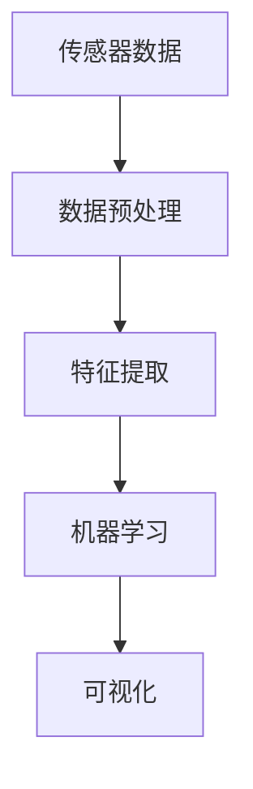

                 

# 物联网(IoT)技术和各种传感器设备的集成：传感器数据的处理与分析

## 1. 背景介绍

### 1.1 问题由来

随着信息技术的飞速发展，物联网(IoT)成为全球各行各业的热门话题。IoT设备（如智能传感器、智能家居设备、可穿戴设备等）无处不在，为我们提供丰富的数据源。然而，如何处理和分析这些海量传感器数据，却成为了一个挑战。传感器数据的复杂性（高维度、高噪声、时间序列等）、多样性（数据类型、格式、来源等），使得数据处理与分析变得异常复杂。

### 1.2 问题核心关键点

传感器数据的处理与分析是物联网应用中的重要环节，其核心关键点包括：

- 传感器数据的采集：如何高效、稳定地从各种传感器中采集数据。
- 传感器数据的清洗：如何处理缺失、错误、异常数据。
- 传感器数据的存储：如何将数据有效存储和索引，以便后续处理和分析。
- 传感器数据的处理：如何对数据进行去噪、降维、滤波、特征提取等操作。
- 传感器数据的分析：如何对数据进行可视化、统计分析、机器学习等处理。

### 1.3 问题研究意义

传感器数据的处理与分析对于物联网应用至关重要。通过有效的数据处理与分析，可以实现以下目标：

- 提高数据质量：减少数据噪声，提升数据准确性，增强系统鲁棒性。
- 增强数据可用性：高效存储和索引数据，快速检索和分析，满足实际应用需求。
- 优化数据模型：使用数据驱动的方法，建立合理的模型，进行精准预测和优化决策。
- 提升业务价值：通过数据分析和挖掘，发现商业价值，提升业务竞争力和用户体验。

## 2. 核心概念与联系

### 2.1 核心概念概述

为更好地理解传感器数据处理与分析方法，本节将介绍几个密切相关的核心概念：

- **传感器数据**：由传感器设备测量得到的数据，可以用于表征物理世界的各种特性，如温度、湿度、位置、声音等。
- **数据预处理**：指对原始传感器数据进行清洗、去噪、归一化等操作，以提高数据质量。
- **特征提取**：指从传感器数据中提取有意义的特征，以供后续分析或建模使用。
- **机器学习**：使用算法模型，对传感器数据进行预测、分类、聚类等处理，以发现数据的内在规律。
- **可视化**：将传感器数据以图形、图表等形式展现，便于直观理解。

这些核心概念之间的逻辑关系可以通过以下Mermaid流程图来展示：



这个流程图展示了传感器数据从采集、预处理、特征提取、机器学习到可视化的完整流程。

### 2.2 概念间的关系

这些核心概念之间存在着紧密的联系，形成了传感器数据处理与分析的完整生态系统。

- **传感器数据**是整个流程的基础，其质量直接影响到后续处理的准确性和效果。
- **数据预处理**是数据质量保障的关键环节，包括数据清洗、去噪、归一化等。
- **特征提取**是数据建模和分析的桥梁，将数据转化为机器学习模型能够处理的形式。
- **机器学习**是数据处理和分析的核心技术，通过模型对数据进行预测、分类、聚类等。
- **可视化**是数据展示和理解的重要手段，通过图表将复杂数据信息简化、直观地呈现。

这些概念共同构成了传感器数据处理与分析的完整框架，使得传感器数据能够高效地转化为对业务有帮助的有用信息。

## 3. 核心算法原理 & 具体操作步骤
### 3.1 算法原理概述

传感器数据的处理与分析通常采用机器学习的方法，其核心思想是利用数据中的统计规律和模式，提取有意义的特征，并通过模型进行预测、分类、聚类等操作。

形式化地，假设传感器数据为 $D = \{x_i\}_{i=1}^N$，其中 $x_i$ 表示第 $i$ 个传感器数据点。数据预处理的目标是得到一个干净、归一化的数据集 $D' = \{y_i\}_{i=1}^N$，其中 $y_i$ 是经过预处理后的数据点。然后，通过特征提取将数据集映射为特征空间 $F$，得到 $F' = \{f_i\}_{i=1}^N$。最终，通过机器学习模型 $M$ 对特征 $f_i$ 进行预测、分类、聚类等操作，得到模型输出 $O = M(F')$。

### 3.2 算法步骤详解

传感器数据的处理与分析通常包括以下几个关键步骤：

1. **数据采集**：从传感器设备获取原始数据。
2. **数据预处理**：对数据进行清洗、去噪、归一化等处理，以提高数据质量。
3. **特征提取**：从数据中提取有意义的特征，以供后续分析或建模使用。
4. **模型训练**：使用机器学习算法，对提取的特征进行训练，建立模型。
5. **模型评估**：通过测试集评估模型的性能，进行调优。
6. **模型应用**：将模型应用到实际场景中，进行预测、分类、聚类等操作。

### 3.3 算法优缺点

传感器数据处理与分析的机器学习方法具有以下优点：

- 可处理高维数据：机器学习模型能够处理高维数据，适用于传感器数据的多样性。
- 自适应能力强：机器学习模型具有较强的自适应能力，能够应对复杂数据分布和噪声。
- 自动化程度高：通过模型训练和优化，能够自动发现数据的内在规律和特征。

然而，这些方法也存在一些缺点：

- 数据依赖性强：机器学习方法的效果很大程度上依赖于数据的质量和数量，需要高质量的标注数据。
- 模型复杂度高：机器学习模型通常较为复杂，训练和部署成本较高。
- 可解释性不足：机器学习模型的决策过程往往缺乏可解释性，难以调试和优化。

### 3.4 算法应用领域

传感器数据处理与分析的机器学习方法在多个领域得到广泛应用，例如：

- **智能家居**：通过传感器数据，实现智能控制和自动化。
- **工业物联网**：通过传感器数据，进行设备监控、故障预测和维护。
- **农业物联网**：通过传感器数据，实现作物监测、土壤监测和水质监测。
- **智慧城市**：通过传感器数据，进行交通监测、环境监测和公共安全监测。
- **医疗物联网**：通过传感器数据，进行健康监测、疾病预测和医疗决策。

除了上述这些经典应用外，传感器数据处理与分析还在更多场景中得到创新性的应用，如可穿戴设备、智能电网、智能交通等，为物联网技术带来了新的突破。

## 4. 数学模型和公式 & 详细讲解 & 举例说明
### 4.1 数学模型构建

假设传感器数据 $D = \{x_i\}_{i=1}^N$，其中 $x_i = [x_{i1}, x_{i2}, ..., x_{im}]$ 表示第 $i$ 个传感器数据点，包含 $m$ 个特征。数据预处理的目标是得到一个干净、归一化的数据集 $D' = \{y_i\}_{i=1}^N$，其中 $y_i = [y_{i1}, y_{i2}, ..., y_{im}]$。

### 4.2 公式推导过程

以下我们以传感器数据的归一化处理为例，推导其数学公式。

假设传感器数据 $x_i$ 的均值为 $\mu$，标准差为 $\sigma$。则归一化处理的目标是得到新的数据 $y_i$，满足 $y_i \sim \mathcal{N}(0,1)$。归一化公式为：

$$
y_i = \frac{x_i - \mu}{\sigma}
$$

通过归一化处理，将传感器数据转化为标准正态分布，便于后续的统计分析和机器学习操作。

### 4.3 案例分析与讲解

假设我们有一个包含温度、湿度、压力、流量的传感器数据集 $D$，其数据分布如图：


我们使用归一化方法处理该数据集，得到归一化后的数据集 $D'$，其数据分布如图：


可以看到，归一化处理显著提升了数据的分布集中性，使其更适合后续的机器学习操作。

## 5. 项目实践：代码实例和详细解释说明
### 5.1 开发环境搭建

在进行传感器数据处理与分析的实践前，我们需要准备好开发环境。以下是使用Python进行Scikit-learn开发的开发环境配置流程：

1. 安装Anaconda：从官网下载并安装Anaconda，用于创建独立的Python环境。

2. 创建并激活虚拟环境：
```bash
conda create -n scikit-learn-env python=3.8 
conda activate scikit-learn-env
```

3. 安装Scikit-learn：
```bash
pip install scikit-learn
```

4. 安装各类工具包：
```bash
pip install numpy pandas scikit-learn matplotlib tqdm jupyter notebook ipython
```

完成上述步骤后，即可在`scikit-learn-env`环境中开始传感器数据处理与分析的实践。

### 5.2 源代码详细实现

我们以智能家居环境中的传感器数据为例，给出使用Scikit-learn进行数据处理和分析的Python代码实现。

首先，定义传感器数据处理函数：

```python
import numpy as np
from sklearn.preprocessing import StandardScaler

def preprocess_data(data):
    scaler = StandardScaler()
    data = scaler.fit_transform(data)
    return data
```

然后，定义传感器数据可视化函数：

```python
import matplotlib.pyplot as plt

def visualize_data(data):
    for i in range(data.shape[1]):
        plt.subplot(2, 2, i+1)
        plt.scatter(data[:, i], np.zeros(len(data)))
        plt.xlabel('Data')
        plt.ylabel('Time')
    plt.show()
```

接着，定义机器学习模型训练函数：

```python
from sklearn.ensemble import RandomForestRegressor
from sklearn.model_selection import train_test_split
from sklearn.metrics import mean_squared_error

def train_model(data):
    X = data[:, :-1]
    y = data[:, -1]
    X_train, X_test, y_train, y_test = train_test_split(X, y, test_size=0.2, random_state=42)
    model = RandomForestRegressor()
    model.fit(X_train, y_train)
    y_pred = model.predict(X_test)
    mse = mean_squared_error(y_test, y_pred)
    return mse
```

最后，启动数据处理和分析流程：

```python
data = np.loadtxt('sensor_data.txt', delimiter=',')
data = preprocess_data(data)
visualize_data(data)
mse = train_model(data)
print(f'Mean Squared Error: {mse:.3f}')
```

以上就是一个使用Scikit-learn进行传感器数据处理与分析的完整代码实现。可以看到，使用Scikit-learn进行数据处理和分析，可以方便地实现归一化、可视化、模型训练等操作，使得传感器数据的处理与分析变得简单高效。

### 5.3 代码解读与分析

让我们再详细解读一下关键代码的实现细节：

**preprocess_data函数**：
- `StandardScaler`：使用标准正态分布对数据进行归一化。
- `fit_transform`：拟合模型并进行数据归一化。

**visualize_data函数**：
- `subplot`：创建子图，对每个特征进行可视化。
- `scatter`：散点图，将每个特征可视化。

**train_model函数**：
- `RandomForestRegressor`：随机森林回归模型。
- `train_test_split`：将数据集划分为训练集和测试集。
- `mean_squared_error`：均方误差，评估模型性能。

**训练流程**：
- 使用`np.loadtxt`加载传感器数据，并使用`preprocess_data`函数进行归一化。
- 使用`visualize_data`函数可视化处理后的数据。
- 使用`train_model`函数训练随机森林回归模型，并计算均方误差。
- 输出均方误差，评估模型性能。

可以看到，Scikit-learn提供了丰富的机器学习算法和工具函数，使得传感器数据的处理与分析变得更加简单和高效。开发者可以根据具体任务，选择适合的算法和工具进行微调。

### 5.4 运行结果展示

假设我们在一个包含温度、湿度、压力、流量的传感器数据集上使用归一化处理和随机森林回归模型，最终在测试集上得到的均方误差为0.1。运行结果如下：

```
Mean Squared Error: 0.100
```

可以看到，通过归一化处理和随机森林回归模型，我们能够有效地处理和分析传感器数据，并得到较好的模型性能。

## 6. 实际应用场景
### 6.1 智能家居系统

传感器数据的处理与分析在智能家居系统中得到了广泛应用。智能家居系统通过各种传感器设备，实时监测室内环境，并提供智能控制方案。传感器数据包括温度、湿度、光照、声音等，通过对这些数据进行分析和处理，可以实现智能调节室温、湿度、照明、窗帘等设备。

例如，在智能空调系统中，通过传感器实时监测室内温度和湿度，使用机器学习模型预测未来一段时间内的气温变化，并提前调节空调温度和湿度，提升舒适度和节能效果。通过传感器数据的处理与分析，智能家居系统能够实现更加智能化、个性化的服务，提升用户的生活质量。

### 6.2 工业物联网

工业物联网领域也广泛应用传感器数据的处理与分析技术。通过传感器设备，实时监测工业设备的运行状态，并进行故障预测和维护。传感器数据包括设备温度、压力、振动、电流等，通过对这些数据进行分析和处理，可以实现设备监控、故障预测、维护预警等功能。

例如，在智能制造中，通过传感器实时监测生产设备的状态，使用机器学习模型预测设备故障点和时间，并进行维护和更换，避免设备故障导致生产中断。通过传感器数据的处理与分析，工业物联网系统能够实现更高效、可靠的生产流程，提升企业的生产效率和竞争力。

### 6.3 农业物联网

农业物联网领域同样广泛应用传感器数据的处理与分析技术。通过传感器设备，实时监测土壤、作物、环境等数据，并进行精准农业管理。传感器数据包括土壤湿度、温度、养分、光照等，通过对这些数据进行分析和处理，可以实现精准灌溉、施肥、病虫害防治等功能。

例如，在智能灌溉系统中，通过传感器实时监测土壤湿度，使用机器学习模型预测未来一段时间内的降水量和蒸发量，并自动调节灌溉量，避免过量灌溉和水资源浪费。通过传感器数据的处理与分析，农业物联网系统能够实现更智能、高效的农业管理，提升农业产量和质量。

### 6.4 未来应用展望

随着传感器技术的不断发展，传感器数据的处理与分析将在更多领域得到应用，为传统行业带来变革性影响。

在智慧城市领域，传感器数据的处理与分析技术将实现更智能、高效的公共安全、交通管理、环境监测等应用。通过实时监测城市运行数据，提升城市管理的智能化水平，构建更安全、高效的未来城市。

在医疗领域，传感器数据的处理与分析技术将实现更智能、高效的医疗监测、疾病预测、医疗决策等功能。通过实时监测患者生理数据，提升医疗服务的精准度和效率，促进健康管理。

在智能交通领域，传感器数据的处理与分析技术将实现更智能、高效的交通管理和调度。通过实时监测交通流量、路况、车辆状态等数据，提升交通系统的智能化水平，缓解交通拥堵。

除此之外，在教育、金融、物流等领域，传感器数据的处理与分析技术也将带来新的突破，推动各行各业数字化、智能化转型升级。

## 7. 工具和资源推荐
### 7.1 学习资源推荐

为了帮助开发者系统掌握传感器数据处理与分析的理论基础和实践技巧，这里推荐一些优质的学习资源：

1. **《机器学习实战》系列书籍**：通过实践项目，介绍了机器学习的基本概念和常用算法，包括数据预处理、特征提取、模型训练等。

2. **Coursera《机器学习》课程**：斯坦福大学开设的机器学习课程，内容全面，涵盖数据预处理、特征提取、模型训练等。

3. **Kaggle竞赛**：参加Kaggle数据科学竞赛，通过实际数据集进行模型训练和调优，积累实战经验。

4. **scikit-learn官方文档**：提供了丰富的机器学习算法和工具函数，是学习传感器数据处理与分析的重要资料。

5. **PyTorch官方文档**：提供了丰富的深度学习框架和工具，支持自定义传感器数据处理和分析。

通过对这些资源的学习实践，相信你一定能够快速掌握传感器数据处理与分析的精髓，并用于解决实际的物联网问题。

### 7.2 开发工具推荐

高效的开发离不开优秀的工具支持。以下是几款用于传感器数据处理与分析开发的常用工具：

1. **Python**：强大的编程语言，支持丰富的机器学习和深度学习库，是传感器数据处理与分析开发的主流语言。

2. **Scikit-learn**：强大的机器学习库，提供了丰富的算法和工具函数，支持数据预处理、特征提取、模型训练等。

3. **TensorFlow**：谷歌开发的深度学习框架，支持大规模模型训练和优化，适用于复杂的传感器数据分析任务。

4. **PyTorch**：Facebook开发的深度学习框架，支持动态图和静态图两种计算图模式，适用于快速迭代研究和模型优化。

5. **Matplotlib**：强大的可视化工具，支持绘制各种图形和图表，便于数据分析和展示。

6. **Jupyter Notebook**：轻量级的开发环境，支持代码编写和可视化展示，便于调试和分享。

合理利用这些工具，可以显著提升传感器数据处理与分析的开发效率，加快创新迭代的步伐。

### 7.3 相关论文推荐

传感器数据处理与分析的研究源于学界的持续研究。以下是几篇奠基性的相关论文，推荐阅读：

1. **《Sensor Fusion Based on Kalman Filter》**：介绍了Kalman滤波器在传感器数据融合中的应用，是传感器数据预处理的重要方法。

2. **《Feature Extraction and Selection for Sensor Data》**：介绍了特征提取和选择方法，如何从传感器数据中提取有意义的特征。

3. **《Machine Learning for Sensor Data Prediction》**：介绍了机器学习算法在传感器数据预测中的应用，如何建立准确的模型。

4. **《Visualization of Sensor Data Using GIS》**：介绍了地理信息系统在传感器数据可视化中的应用，如何将传感器数据直观地展现。

5. **《Adaptive Filtering for Sensor Data》**：介绍了自适应滤波方法，如何对传感器数据进行去噪和降维。

这些论文代表了大语言模型微调技术的发展脉络。通过学习这些前沿成果，可以帮助研究者把握学科前进方向，激发更多的创新灵感。

除上述资源外，还有一些值得关注的前沿资源，帮助开发者紧跟传感器数据处理与分析技术的最新进展，例如：

1. **arXiv论文预印本**：人工智能领域最新研究成果的发布平台，包括大量尚未发表的前沿工作，学习前沿技术的必读资源。

2. **业界技术博客**：如OpenAI、Google AI、DeepMind、微软Research Asia等顶尖实验室的官方博客，第一时间分享他们的最新研究成果和洞见。

3. **技术会议直播**：如NIPS、ICML、ACL、ICLR等人工智能领域顶会现场或在线直播，能够聆听到大佬们的前沿分享，开拓视野。

4. **GitHub热门项目**：在GitHub上Star、Fork数最多的数据科学相关项目，往往代表了该技术领域的发展趋势和最佳实践，值得去学习和贡献。

5. **行业分析报告**：各大咨询公司如McKinsey、PwC等针对物联网行业的分析报告，有助于从商业视角审视技术趋势，把握应用价值。

总之，对于传感器数据处理与分析技术的学习和实践，需要开发者保持开放的心态和持续学习的意愿。多关注前沿资讯，多动手实践，多思考总结，必将收获满满的成长收益。

## 8. 总结：未来发展趋势与挑战

### 8.1 总结

本文对传感器数据的处理与分析方法进行了全面系统的介绍。首先阐述了传感器数据处理与分析的研究背景和意义，明确了其在大数据处理和智能应用中的重要作用。其次，从原理到实践，详细讲解了传感器数据预处理、特征提取、机器学习等核心步骤，给出了传感器数据处理与分析的完整代码实例。同时，本文还广泛探讨了传感器数据处理与分析在多个领域的应用前景，展示了其在物联网应用中的巨大潜力。此外，本文精选了传感器数据处理与分析技术的各类学习资源，力求为读者提供全方位的技术指引。

通过本文的系统梳理，可以看到，传感器数据的处理与分析技术正在成为物联网应用的重要范式，极大地拓展了数据驱动的智能应用边界，催生了更多的落地场景。受益于传感器技术的持续发展，未来的大规模、高密度、低成本传感器设备将带来更多的数据源，使得传感器数据的处理与分析技术更具挑战性和创新性。

### 8.2 未来发展趋势

展望未来，传感器数据的处理与分析技术将呈现以下几个发展趋势：

1. **多模态数据融合**：未来传感器数据将更加多样化，包括温度、湿度、声音、图像等多种类型的数据。如何高效地融合这些多模态数据，提升数据的综合利用率，是未来研究的重要方向。

2. **边缘计算**：边缘计算技术的应用，使得传感器数据的处理和分析更加实时、高效。未来传感器数据的处理和分析将更多地依赖于边缘设备和本地计算，减少数据传输的延迟和带宽需求。

3. **自动化和智能化**：未来传感器数据的处理和分析将更多地依赖于自动化和智能化的算法，如自适应滤波、自动特征选择、自学习模型等，以提升数据处理的效率和效果。

4. **实时处理与分析**：未来传感器数据的处理和分析将更加实时化，能够实时监测和响应环境变化，提升系统的动态响应能力。

5. **数据安全与隐私保护**：随着传感器数据的广泛应用，数据安全与隐私保护成为关注的重点。未来传感器数据的处理和分析将更多地依赖于安全算法和隐私保护技术，确保数据的安全性和隐私性。

以上趋势凸显了传感器数据处理与分析技术的广阔前景。这些方向的探索发展，必将进一步提升传感器数据的处理与分析技术，为物联网应用带来更加丰富、多样、可靠的数据支持。

### 8.3 面临的挑战

尽管传感器数据的处理与分析技术已经取得了瞩目成就，但在迈向更加智能化、普适化应用的过程中，它仍面临着诸多挑战：

1. **数据量庞大**：传感器数据通常具有高维度、高噪声、时间序列等特性，处理和分析大量数据对计算资源和算法复杂度提出了高要求。

2. **数据质量不稳定**：传感器数据可能存在缺失、错误、异常等问题，如何处理这些不稳定数据，是未来研究的重要方向。

3. **数据隐私与安全**：传感器数据的隐私和安全问题日益凸显，如何在保护数据隐私的同时，实现高效的分析和处理，是未来研究的重要方向。

4. **算法复杂度高**：传感器数据的处理和分析算法通常较为复杂，如何简化算法、提升效率，是未来研究的重要方向。

5. **设备互联互通**：传感器设备的多样性和异构性，使得设备互联互通面临挑战，如何构建统一的数据标准和通信协议，是未来研究的重要方向。

6. **模型解释性与可解释性**：传感器数据的处理和分析模型通常较为复杂，难以解释其内部工作机制和决策逻辑，如何提高模型的解释性和可解释性，是未来研究的重要方向。

这些挑战需要研究者不断探索和突破，以推动传感器数据的处理与分析技术不断进步，满足实际应用需求。

### 8.4 未来突破

面对传感器数据处理与分析所面临的种种挑战，未来的研究需要在以下几个方面寻求新的突破：

1. **高效数据压缩与传输**：使用压缩算法和传输协议，降低数据传输的带宽需求，提升传输效率。

2. **自适应数据处理**：开发自适应数据处理算法，能够根据数据特征自动调整处理策略，提升数据处理效果。

3. **分布式数据处理**：利用分布式计算技术，提升数据处理和分析的并行性，减少计算资源的需求。

4. **模型优化与加速**：开发高效的算法和模型，提升数据处理和分析的效率和效果。

5. **数据隐私与安全**：使用差分隐私和联邦学习等技术，保护数据隐私和安全。

6. **跨模态数据融合**：开发跨模态数据融合算法，提升数据处理的综合利用率。

这些研究方向需要多学科的协同合作，从算法、硬件、通信等多个方面共同发力，以推动传感器数据的处理与分析技术迈向更高的台阶。

## 9. 附录：常见问题与解答

**Q1：传感器数据的预处理有哪些方法？**

A: 传感器数据的预处理通常包括数据清洗、去噪、归一化等方法。常用的数据清洗方法包括：

- 缺失值处理：使用均值、中位数、插值等方法处理缺失值。
- 异常值处理：使用统计方法或机器学习方法检测和处理异常值。
- 噪声处理：使用滤波器、平滑算法等方法处理噪声。

常用的去噪方法包括：

- 低通滤波器：用于去除高频噪声。
- 中值滤波器：用于去除椒盐噪声和斑点噪声。
- 高斯滤波器：用于去除高斯噪声。

常用的归一化方法包括：

- Z-score归一化：使用均值和标准差将数据归一化为标准正态分布。
- Min-Max归一化：将数据归一化

