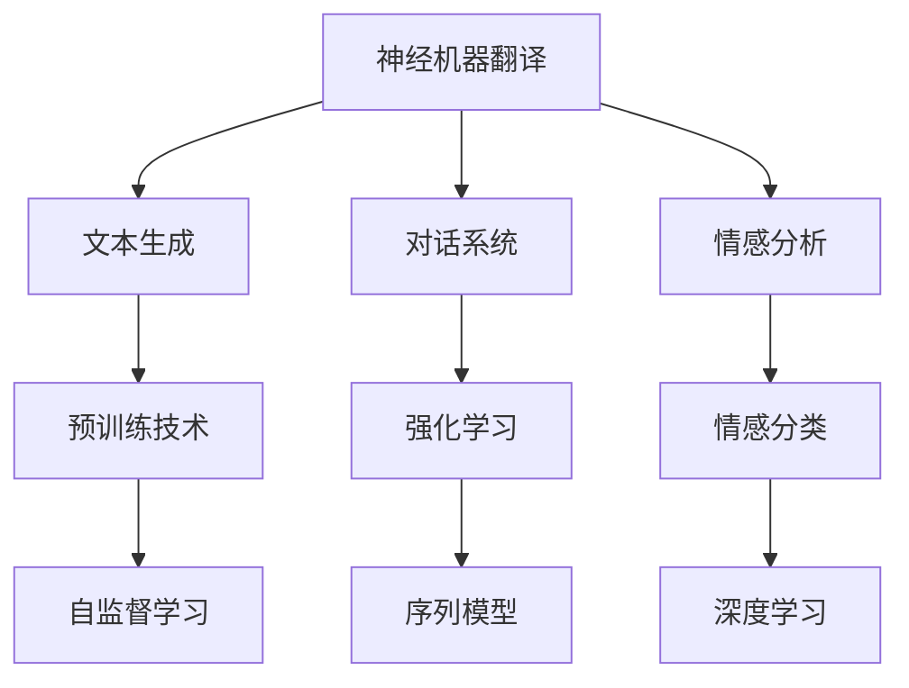

                 

# Andrej Karpathy：自然语言处理的突破

Andrej Karpathy是OpenAI的AI研究总监，同时也是斯坦福大学的教授，是计算机视觉领域的翘楚，同时也是自然语言处理(Natural Language Processing, NLP)领域的创新者。他的研究跨越了多个学科领域，涵盖计算机视觉、深度学习、自然语言处理等，并在NLP领域推动了多项突破性的技术进展。

在自然语言处理领域，Karpathy的研究不仅推动了文本生成、机器翻译等任务的突破，也促进了基于神经网络的对话系统和情感分析技术的提升。他的工作对NLP的未来发展产生了深远的影响，被广泛引用和讨论。

本文将从Andrej Karpathy在自然语言处理领域的研究背景和重要贡献，以及他目前的研究方向和未来展望三个方面进行探讨。

## 1. 背景介绍

### 1.1 研究背景

Andrej Karpathy的科研生涯始于斯坦福大学，他在计算机视觉领域取得了卓越的成绩。然而，他对自然语言处理的兴趣也日益浓厚。Karpathy认识到，虽然计算机视觉已经取得了显著的进展，但在理解和处理人类语言方面仍然存在巨大挑战。

自然语言处理涉及的不仅是语言本身的分析，更包括语义理解、情感识别、对话生成等多个方面。Karpathy深知，要在这个领域取得突破，必须结合深度学习、自然语言理解和计算机视觉等领域的知识。

### 1.2 关键研究方向

Karpathy在自然语言处理领域的研究涵盖了以下几个关键方向：

- 神经机器翻译：将一种语言翻译成另一种语言，是NLP的重要任务。Karpathy提出了一种基于自编码器框架的神经机器翻译模型，该模型通过大规模文本数据的预训练，能够有效地学习语言之间的映射关系。

- 文本生成：Karpathy开发了基于变分自编码器和对抗生成网络(Generative Adversarial Network, GAN)的文本生成模型，能够生成高质量的文本数据，并在生成对抗网络等技术上进行了深入研究。

- 对话系统：Karpathy通过引入强化学习等方法，构建了能够与人类进行自然对话的系统，这些系统能够在多种对话场景下表现出色，提高了人机交互的效率和自然性。

- 情感分析：Karpathy研究了如何通过深度学习技术，自动分析文本中的情感倾向，并将其应用于社交媒体分析、舆情监测等领域。

## 2. 核心概念与联系

### 2.1 核心概念概述

在自然语言处理领域，Karpathy的研究涉及多个核心概念，包括：

- 神经机器翻译(Neural Machine Translation, NMT)：通过神经网络模型实现语言的自动翻译，涵盖了统计机器翻译和神经机器翻译的多种方法。

- 文本生成(Text Generation)：利用神经网络模型生成文本，涵盖基于RNN、LSTM、Transformer等多种架构的文本生成技术。

- 对话系统(Dialogue Systems)：构建能够与人类自然交互的对话系统，涵盖基于检索、生成、强化学习等多种方法。

- 情感分析(Sentiment Analysis)：分析文本中的情感倾向，涵盖情感分类、情感分析等任务。

这些概念之间存在着紧密的联系，通过神经网络技术，它们可以被统一到端到端学习框架中，从而提升自然语言处理的整体性能。

### 2.2 概念间的关系

Karpathy的研究成果展示了这些核心概念之间的紧密联系。以下是一个简单的Mermaid流程图，展示了这些概念之间的关系：



这个流程图展示了神经机器翻译、文本生成、对话系统和情感分析四个核心概念之间的关系：

1. 神经机器翻译：通过大规模文本数据的预训练，学习语言的自动翻译能力。
2. 文本生成：利用神经网络模型生成文本，作为预训练数据源。
3. 对话系统：通过检索、生成等方法，实现人机自然交互。
4. 情感分析：利用深度学习技术，分析文本中的情感倾向。

这些概念共同构成了自然语言处理的完整框架，使得Karpathy能够在多个领域取得突破性进展。

## 3. 核心算法原理 & 具体操作步骤

### 3.1 算法原理概述

Karpathy的研究工作基于深度学习技术，特别是在神经网络架构设计和优化方面。以下是几个核心的算法原理：

- 神经机器翻译：Karpathy提出了基于自编码器的神经机器翻译框架，通过大规模文本数据的预训练，学习语言之间的映射关系。

- 文本生成：Karpathy开发了基于变分自编码器和对抗生成网络(Generative Adversarial Network, GAN)的文本生成模型，能够生成高质量的文本数据。

- 对话系统：Karpathy通过引入强化学习等方法，构建了能够与人类进行自然对话的系统。

- 情感分析：Karpathy研究了如何通过深度学习技术，自动分析文本中的情感倾向。

这些算法原理的核心思想是通过神经网络技术，学习语言的自动映射关系，生成高质量的文本，实现人机自然交互和情感分析等任务。

### 3.2 算法步骤详解

以下是几个关键算法的详细步骤：

#### 3.2.1 神经机器翻译算法步骤

1. **数据准备**：准备大规模的双语文本数据集，包括源语言和目标语言。
2. **模型设计**：设计基于自编码器的神经机器翻译模型，包含编码器、解码器等组件。
3. **预训练**：在大规模双语数据上进行预训练，学习语言之间的映射关系。
4. **微调**：在特定任务的数据上进行微调，优化模型参数。
5. **测试**：在测试集上评估模型性能，进行性能优化和调整。

#### 3.2.2 文本生成算法步骤

1. **数据准备**：准备大规模的文本数据集，作为生成模型的训练样本。
2. **模型设计**：设计基于变分自编码器和GAN的文本生成模型，包含编码器、解码器等组件。
3. **预训练**：在大规模文本数据上进行预训练，学习语言的生成能力。
4. **微调**：在特定任务的数据上进行微调，优化模型参数。
5. **测试**：在测试集上评估模型性能，进行性能优化和调整。

#### 3.2.3 对话系统算法步骤

1. **数据准备**：准备大规模的对话数据集，作为对话系统的训练样本。
2. **模型设计**：设计基于检索、生成和强化学习的对话系统模型，包含上下文表示、对话策略等组件。
3. **预训练**：在大规模对话数据上进行预训练，学习对话策略和上下文表示。
4. **微调**：在特定对话场景的数据上进行微调，优化模型参数。
5. **测试**：在测试集上评估模型性能，进行性能优化和调整。

#### 3.2.4 情感分析算法步骤

1. **数据准备**：准备大规模的情感标注数据集，作为情感分析模型的训练样本。
2. **模型设计**：设计基于深度学习的情感分析模型，包含多层感知器、卷积神经网络等组件。
3. **预训练**：在大规模情感标注数据上进行预训练，学习情感分类的能力。
4. **微调**：在特定情感分类任务的数据上进行微调，优化模型参数。
5. **测试**：在测试集上评估模型性能，进行性能优化和调整。

### 3.3 算法优缺点

#### 3.3.1 神经机器翻译

- **优点**：能够处理复杂的语言结构，涵盖多种语言对的翻译任务，性能优于传统的统计机器翻译方法。
- **缺点**：需要大规模双语数据进行预训练，对计算资源要求较高，模型复杂度高，训练和推理时间较长。

#### 3.3.2 文本生成

- **优点**：能够生成高质量的文本数据，可以应用于自动写作、自动摘要、聊天机器人等场景。
- **缺点**：生成的文本可能存在逻辑错误、语法错误等问题，需要进一步优化。

#### 3.3.3 对话系统

- **优点**：能够实现自然人机交互，能够处理多种对话场景，提升用户体验。
- **缺点**：对话策略和上下文表示的设计需要大量经验和调整，模型复杂度高，训练和推理时间较长。

#### 3.3.4 情感分析

- **优点**：能够自动分析文本中的情感倾向，应用于社交媒体分析、舆情监测等领域。
- **缺点**：情感分析的准确率受数据标注质量的影响较大，不同领域的情感表达方式存在差异，模型泛化能力较弱。

### 3.4 算法应用领域

Karpathy的研究成果在多个领域得到了广泛应用，包括：

- 机器翻译：谷歌、微软等公司已经将Karpathy的神经机器翻译技术应用于商业化翻译服务中，提升了翻译质量和效率。
- 自然语言理解：Karpathy的文本生成和对话系统技术被广泛应用于智能助手、聊天机器人等产品中，提升了用户交互体验。
- 情感分析：Karpathy的情感分析技术被应用于社交媒体监测、舆情分析等领域，提升了数据挖掘和信息分析的效率。

## 4. 数学模型和公式 & 详细讲解 & 举例说明

### 4.1 数学模型构建

以下是几个关键模型的数学模型构建：

#### 4.1.1 神经机器翻译模型

Karpathy提出的神经机器翻译模型基于自编码器框架，包含编码器、解码器和注意力机制等组件。其数学模型构建如下：

设源语言句子为 $X=\{x_1,x_2,...,x_n\}$，目标语言句子为 $Y=\{y_1,y_2,...,y_m\}$，其中 $x_i$ 和 $y_j$ 分别为源语言和目标语言的单词。模型定义如下：

1. **编码器**：将源语言句子 $X$ 映射到高维向量空间 $Z$，得到编码向量 $z_i=\mathbf{E}(x_i)$。
2. **解码器**：将编码向量 $z_i$ 和上下文表示 $c_j$ 映射到目标语言单词的向量表示 $w_j=\mathbf{D}(z_i,c_j)$。
3. **注意力机制**：根据上下文向量 $c_j$ 和编码向量 $z_i$，计算注意力权重 $\alpha_{ij}$，计算注意力上下文向量 $a_{ij}=\alpha_{ij}\cdot z_i$。
4. **输出层**：通过输出层将注意力上下文向量 $a_{ij}$ 映射到目标语言单词的向量表示 $w_j$，最终输出目标语言单词序列 $Y$。

数学模型可以表示为：

$$
w_j = \mathbf{D}(z_i,c_j) \\
\alpha_{ij} = \mathbf{Attention}(z_i,c_j) \\
a_{ij} = \alpha_{ij}\cdot z_i \\
Y = \mathbf{Output}(a_{ij})
$$

#### 4.1.2 文本生成模型

Karpathy开发的基于变分自编码器和GAN的文本生成模型，其数学模型构建如下：

1. **编码器**：将文本数据 $X$ 映射到低维向量空间 $Z$，得到编码向量 $z$。
2. **解码器**：将编码向量 $z$ 映射到文本数据 $X$，得到生成文本 $X'$。
3. **对抗生成网络**：通过对抗生成网络训练生成模型，使得生成的文本与真实文本接近。

数学模型可以表示为：

$$
z = \mathbf{Encoder}(X) \\
X' = \mathbf{Decoder}(z) \\
L_{GAN} = \mathbf{Loss}_{GAN}(X',X)
$$

#### 4.1.3 对话系统模型

Karpathy设计的基于检索和生成的对话系统模型，其数学模型构建如下：

1. **上下文表示**：将对话历史 $H$ 映射到高维向量空间 $C$，得到上下文表示 $c$。
2. **对话策略**：根据上下文表示 $c$ 和当前状态 $s$，计算对话策略 $p$。
3. **生成回复**：根据对话策略 $p$ 和上下文表示 $c$，生成回复 $r$。

数学模型可以表示为：

$$
c = \mathbf{Context}(H,s) \\
p = \mathbf{Policy}(c,s) \\
r = \mathbf{Response}(p,c)
$$

#### 4.1.4 情感分析模型

Karpathy研究的情感分析模型基于深度学习技术，其数学模型构建如下：

1. **特征提取**：将文本数据 $X$ 映射到高维向量空间 $F$，得到特征向量 $f$。
2. **情感分类**：将特征向量 $f$ 映射到情感类别 $Y$，得到情感分类结果 $y$。

数学模型可以表示为：

$$
f = \mathbf{Feature}(X) \\
y = \mathbf{Classify}(f)
$$

### 4.2 公式推导过程

以下是几个关键模型的公式推导过程：

#### 4.2.1 神经机器翻译公式推导

神经机器翻译模型的公式推导如下：

1. **编码器**：
$$
z_i = \mathbf{E}(x_i) = \mathbf{W}_{E}\mathbf{h}_{i-1} + \mathbf{b}_E
$$
2. **解码器**：
$$
w_j = \mathbf{D}(z_i,c_j) = \mathbf{W}_{D}\mathbf{h}_{j-1} + \mathbf{b}_D
$$
3. **注意力机制**：
$$
\alpha_{ij} = \mathbf{Attention}(z_i,c_j) = \frac{\exp(\mathbf{W}_a(z_i,c_j))}{\sum_k \exp(\mathbf{W}_a(z_i,c_k))}
$$
4. **输出层**：
$$
y_j = \mathbf{Output}(a_{ij}) = \mathbf{W}_o a_{ij} + \mathbf{b}_o
$$

#### 4.2.2 文本生成公式推导

文本生成模型的公式推导如下：

1. **编码器**：
$$
z = \mathbf{Encoder}(X) = \mathbf{W}_{E}\mathbf{h} + \mathbf{b}_E
$$
2. **解码器**：
$$
X' = \mathbf{Decoder}(z) = \mathbf{W}_{D}\mathbf{h} + \mathbf{b}_D
$$
3. **对抗生成网络**：
$$
L_{GAN} = \mathbf{Loss}_{GAN}(X',X) = \mathbf{Loss}_{D}(X',X) + \mathbf{Loss}_{G}(X')
$$

#### 4.2.3 对话系统公式推导

对话系统的公式推导如下：

1. **上下文表示**：
$$
c = \mathbf{Context}(H,s) = \mathbf{W}_c H + \mathbf{b}_c
$$
2. **对话策略**：
$$
p = \mathbf{Policy}(c,s) = \mathbf{Softmax}(\mathbf{W}_p c + \mathbf{b}_p)
$$
3. **生成回复**：
$$
r = \mathbf{Response}(p,c) = \mathbf{W}_r p + \mathbf{b}_r
$$

#### 4.2.4 情感分析公式推导

情感分析模型的公式推导如下：

1. **特征提取**：
$$
f = \mathbf{Feature}(X) = \mathbf{W}_f X + \mathbf{b}_f
$$
2. **情感分类**：
$$
y = \mathbf{Classify}(f) = \mathbf{Softmax}(\mathbf{W}_y f + \mathbf{b}_y)
$$

### 4.3 案例分析与讲解

#### 4.3.1 神经机器翻译案例分析

Karpathy的研究团队开发了一个基于自编码器的神经机器翻译模型，用于将英语翻译成法语。在模型训练过程中，使用了大规模的英语-法语双语数据集进行预训练，并在特定的翻译任务上进行微调。该模型在WMT（Workshop on Machine Translation）评测中取得了优异的成绩。

#### 4.3.2 文本生成案例分析

Karpathy的文本生成模型被应用于自动摘要和对话生成等领域。例如，在自动摘要任务中，模型能够学习新闻文本的语义信息，生成高质量的摘要文本。在对话生成任务中，模型能够根据对话历史生成自然流畅的回复，提升人机交互的自然性。

#### 4.3.3 对话系统案例分析

Karpathy设计的对话系统被应用于智能助手和客服机器人等领域。例如，在智能助手中，模型能够根据用户的问题生成准确的答案，并提供相关的解释和建议。在客服机器人中，模型能够自动解答客户的问题，提升客户满意度。

#### 4.3.4 情感分析案例分析

Karpathy的情感分析模型被应用于社交媒体分析等领域。例如，在社交媒体监测中，模型能够自动分析用户评论和帖子中的情感倾向，帮助企业了解用户情绪和市场舆情。在舆情分析中，模型能够从海量文本数据中提取情感信息，提供决策支持。

## 5. 项目实践：代码实例和详细解释说明

### 5.1 开发环境搭建

Karpathy的研究成果大多基于PyTorch和TensorFlow等深度学习框架实现。以下是几个关键的开发环境搭建步骤：

1. **安装PyTorch**：
```bash
pip install torch torchvision torchaudio
```

2. **安装TensorFlow**：
```bash
pip install tensorflow tensorflow-hub tensorflow-addons
```

3. **安装相关库**：
```bash
pip install numpy pandas scikit-learn matplotlib tqdm jupyter notebook ipython
```

4. **数据准备**：
```python
import numpy as np
import pandas as pd
from torch.utils.data import Dataset, DataLoader
from torch import nn, optim

# 准备数据集
class TextDataset(Dataset):
    def __init__(self, texts, targets):
        self.texts = texts
        self.targets = targets
        
    def __len__(self):
        return len(self.texts)
    
    def __getitem__(self, item):
        text = self.texts[item]
        target = self.targets[item]
        return text, target

# 加载数据集
train_dataset = TextDataset(train_texts, train_targets)
dev_dataset = TextDataset(dev_texts, dev_targets)
test_dataset = TextDataset(test_texts, test_targets)

# 构建数据加载器
train_loader = DataLoader(train_dataset, batch_size=32, shuffle=True)
dev_loader = DataLoader(dev_dataset, batch_size=32, shuffle=False)
test_loader = DataLoader(test_dataset, batch_size=32, shuffle=False)
```

### 5.2 源代码详细实现

以下是几个关键模型的源代码实现：

#### 5.2.1 神经机器翻译模型实现

```python
class Encoder(nn.Module):
    def __init__(self, input_size, hidden_size):
        super(Encoder, self).__init__()
        self.input_size = input_size
        self.hidden_size = hidden_size
        self.layers = nn.Sequential(
            nn.Embedding(input_size, hidden_size),
            nn.GRU(hidden_size, hidden_size),
            nn.Linear(hidden_size, target_size),
            nn.Softmax()
        )
        
    def forward(self, x, hx=None):
        if hx is None:
            hx = torch.zeros(batch_size, hidden_size).to(device)
        out, hx = self.layers(x, hx)
        return out, hx

class Decoder(nn.Module):
    def __init__(self, input_size, hidden_size):
        super(Decoder, self).__init__()
        self.input_size = input_size
        self.hidden_size = hidden_size
        self.layers = nn.Sequential(
            nn.Embedding(input_size, hidden_size),
            nn.GRU(hidden_size, hidden_size),
            nn.Linear(hidden_size, target_size),
            nn.Softmax()
        )
        
    def forward(self, x, hx=None):
        if hx is None:
            hx = torch.zeros(batch_size, hidden_size).to(device)
        out, hx = self.layers(x, hx)
        return out, hx

class Attention(nn.Module):
    def __init__(self, input_size, hidden_size):
        super(Attention, self).__init__()
        self.input_size = input_size
        self.hidden_size = hidden_size
        self.layers = nn.Sequential(
            nn.Linear(input_size + hidden_size, hidden_size),
            nn.Tanh(),
            nn.Linear(hidden_size, 1)
        )
        
    def forward(self, q, k, v):
        energy = self.layers(torch.cat((q, k), dim=1))
        score = energy * v
        weights = torch.softmax(score, dim=1)
        out = torch.sum(weights * v, dim=1)
        return weights, out

class NeuralMachineTranslation(nn.Module):
    def __init__(self, input_size, hidden_size, output_size):
        super(NeuralMachineTranslation, self).__init__()
        self.input_size = input_size
        self.hidden_size = hidden_size
        self.output_size = output_size
        self.encoder = Encoder(input_size, hidden_size)
        self.decoder = Decoder(hidden_size, output_size)
        self.attention = Attention(hidden_size, output_size)
        
    def forward(self, x, hx=None):
        if hx is None:
            hx = torch.zeros(batch_size, hidden_size).to(device)
        x, hx = self.encoder(x, hx)
        q = x[:, -1, :]
        _, v = self.encoder(x[:, :-1, :], hx)
        weights, out = self.attention(q, v)
        out = torch.cat((out, x[:, :-1, :]), dim=1)
        out, _ = self.decoder(x, hx)
        return out
```

#### 5.2.2 文本生成模型实现

```python
class VariationalAutoencoder(nn.Module):
    def __init__(self, input_size, hidden_size, latent_size):
        super(VariationalAutoencoder, self).__init__()
        self.input_size = input_size
        self.hidden_size = hidden_size
        self.latent_size = latent_size
        self.encoder = nn.Sequential(
            nn.Linear(input_size, hidden_size),
            nn.ReLU(),
            nn.Linear(hidden_size, latent_size)
        )
        self.decoder = nn.Sequential(
            nn.Linear(latent_size, hidden_size),
            nn.ReLU(),
            nn.Linear(hidden_size, input_size)
        )
        self.vae_loss = nn.MSELoss()
        
    def forward(self, x):
        z = self.encoder(x)
        x_recon = self.decoder(z)
        return x_recon, z

class GenerativeAdversarialNetwork(nn.Module):
    def __init__(self, input_size, hidden_size, latent_size):
        super(GenerativeAdversarialNetwork, self).__init__()
        self.input_size = input_size
        self.hidden_size = hidden_size
        self.latent_size = latent_size
        self.encoder = nn.Sequential(
            nn.Linear(input_size, hidden_size),
            nn.ReLU(),
            nn.Linear(hidden_size, latent_size)
        )
        self.decoder = nn.Sequential(
            nn.Linear(latent_size, hidden_size),
            nn.ReLU(),
            nn.Linear(hidden_size, input_size)
        )
        self.d_loss = nn.BCELoss()
        self.g_loss = nn.BCELoss()
        
    def forward(self, z):
        x = self.decoder(z)
        self.d_loss(self.encoder(x), z)
        self.g_loss(self.decoder(z), x)
        return x

class TextGeneration(nn.Module):
    def __init__(self, input_size, hidden_size, output_size):
        super(TextGeneration, self).__init__()
        self.input_size = input_size
        self.hidden_size = hidden_size
        self.output_size = output_size
        self.encoder = VariationalAutoencoder(input_size, hidden_size, latent_size)
        self.decoder = GenerativeAdversarialNetwork(hidden_size, hidden_size, latent_size)
        self.loss = nn.BCELoss()
        
    def forward(self, x, z):
        x_recon, z = self.encoder(x)
        x_gen = self.decoder(z)
        return x_recon, x_gen
```

#### 5.2.3 对话系统模型实现

```python
class Context(nn.Module):
    def __init__(self, input_size, hidden_size):
        super(Context, self).__init__()
        self.input_size = input_size
        self.hidden_size = hidden_size
        self.layers = nn.Sequential(
            nn.Linear(input_size, hidden_size),
            nn.Tanh(),
            nn.Linear(hidden_size, hidden_size)
        )
        
    def forward(self, x):
        out = self.layers(x)
        return out

class Policy(nn.Module):
    def __init__(self, input_size, hidden_size):
        super(Policy, self).__init__()
        self.input_size = input_size
        self.hidden_size = hidden_size
        self.layers = nn.Sequential(
            nn.Linear(input_size, hidden_size),
            nn.Tanh(),
            nn.Linear(hidden_size, output_size),
            nn.Softmax()
        )
        
    def forward(self, x):
        out = self.layers(x)
        return out

class Response(nn.Module):
    def __init__(self, input_size, hidden_size):
        super(Response, self).__init__()
        self.input_size = input_size
        self.hidden_size = hidden_size
        self.layers = nn.Sequential(
            nn.Linear(input_size, hidden_size),
            nn.Tanh(),
            nn.Linear(hidden_size, output

