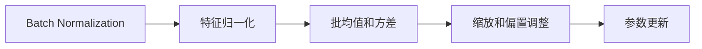

                 

# Batch Normalization

## 1. 背景介绍

### 1.1 问题由来

在深度学习中，神经网络的训练通常面临两个主要问题：过拟合和梯度消失。过拟合是指模型在训练数据上表现良好，但在新数据上泛化能力较差，通常由模型参数过多或训练数据不足引起。梯度消失则是指在反向传播过程中，梯度逐渐变小甚至为0，导致模型无法更新，通常由激活函数的非线性特性引起。

Batch Normalization（简称BN）算法正是为了缓解这些问题而提出的。它通过在每个批次的数据上对每个特征维度进行归一化，从而使模型更加稳定，训练更加高效。在实际应用中，BN已被广泛应用于卷积神经网络（CNN）、循环神经网络（RNN）、残差网络（ResNet）等多种神经网络结构中。

### 1.2 问题核心关键点

Batch Normalization的核心思想是通过在神经网络中引入归一化层，对每个特征维度在每个批次上进行归一化，从而解决梯度消失和过拟合问题。具体来说，BN算法包括以下几个关键点：

- 批归一化：对每个特征维度在每个批次上进行归一化。
- 学习可迁移的统计特征：使用批均值和方差作为归一化标准。
- 保留输入的原始分布：通过可训练的缩放和偏置参数，保持输入的原始分布。
- 加速训练：加速训练过程，减少过拟合风险。

### 1.3 问题研究意义

Batch Normalization算法通过简单有效的归一化技术，显著提高了神经网络的训练效率和泛化能力。它不仅适用于一般的神经网络结构，还可以应用于循环神经网络、残差网络等特殊结构，被广泛应用于图像识别、语音识别、自然语言处理等多个领域。Batch Normalization的出现，极大地促进了深度学习技术的发展和应用。

## 2. 核心概念与联系

### 2.1 核心概念概述

Batch Normalization算法由Szegedy等人于2015年提出，主要应用于深度神经网络中。其主要思想是通过在每个批次的数据上对每个特征维度进行归一化，从而使模型更加稳定，训练更加高效。

Batch Normalization包括两个步骤：特征归一化和缩放与偏置调整。具体来说，它通过以下几个核心概念来实现：

- 批均值和方差：使用每个批次的均值和方差作为归一化的标准。
- 缩放和偏置：通过可训练的缩放和偏置参数，保持输入的原始分布。
- 参数更新：在训练过程中，更新批均值和方差，从而实现迁移学习。

Batch Normalization算法通过归一化技术，消除了梯度消失的风险，提高了模型的泛化能力，成为深度学习中的重要技术之一。

### 2.2 概念间的关系

Batch Normalization算法的核心概念之间存在着紧密的联系，形成了深度学习中重要的归一化范式。以下是Batch Normalization的核心概念及其之间的关系：

1. **批归一化**：对每个特征维度在每个批次上进行归一化，从而消除梯度消失的风险。

2. **学习可迁移的统计特征**：使用批均值和方差作为归一化的标准，实现迁移学习。

3. **保留输入的原始分布**：通过可训练的缩放和偏置参数，保持输入的原始分布。

4. **加速训练**：通过归一化技术，加速训练过程，减少过拟合风险。

这些核心概念共同构成了Batch Normalization算法的基础，使其能够在深度学习中发挥重要作用。

### 2.3 核心概念的整体架构

Batch Normalization算法可以通过以下流程图来展示其核心概念之间的关系：



这个流程图展示了Batch Normalization算法的核心流程：首先对每个特征维度在每个批次上进行归一化，然后通过批均值和方差进行归一化，接着使用缩放和偏置参数调整分布，最后通过参数更新实现迁移学习。

## 3. 核心算法原理 & 具体操作步骤

### 3.1 算法原理概述

Batch Normalization算法的核心思想是对每个特征维度在每个批次上进行归一化。具体来说，它通过对每个批次的数据进行标准化处理，使其均值为0，方差为1。这一过程可以通过以下公式来实现：

$$
x_{\text{normalized}} = \frac{x - \mu_B}{\sqrt{\sigma_B^2 + \epsilon}}
$$

其中，$x$ 表示原始特征，$\mu_B$ 表示批次均值，$\sigma_B$ 表示批次标准差，$\epsilon$ 是一个极小的常数，用于避免除0错误。

Batch Normalization算法的关键在于使用批均值和方差进行归一化，从而实现迁移学习。在训练过程中，批均值和方差会随着每个批次的变化而变化，从而保证模型的泛化能力。此外，Batch Normalization还通过缩放和偏置参数，保持输入的原始分布，避免过拟合。

### 3.2 算法步骤详解

Batch Normalization算法的实现过程主要包括以下几个步骤：

1. **计算批均值和方差**：对于每个特征维度，计算批次均值和方差。

2. **归一化处理**：将每个特征维度减去批均值，除以批标准差，得到归一化后的特征。

3. **缩放和偏置调整**：使用可训练的缩放和偏置参数，调整归一化后的特征，使其保持原始分布。

4. **参数更新**：在训练过程中，更新批均值和方差，从而实现迁移学习。

### 3.3 算法优缺点

Batch Normalization算法具有以下优点：

1. **加速训练**：通过归一化技术，加速训练过程，减少过拟合风险。
2. **提高泛化能力**：通过批归一化，消除梯度消失的风险，提高模型的泛化能力。
3. **保持输入的原始分布**：通过缩放和偏置参数，保持输入的原始分布，避免过拟合。

同时，Batch Normalization算法也存在一些缺点：

1. **参数增加**：引入缩放和偏置参数，增加了模型参数量，可能导致过拟合。
2. **额外计算**：归一化处理增加了额外的计算量，可能导致训练速度变慢。
3. **参数更新**：在训练过程中，需要更新批均值和方差，可能影响模型的稳定性。

尽管存在这些缺点，但Batch Normalization算法在实际应用中仍然表现优异，已经成为深度学习中的重要技术之一。

### 3.4 算法应用领域

Batch Normalization算法被广泛应用于深度神经网络中，包括卷积神经网络（CNN）、循环神经网络（RNN）、残差网络（ResNet）等。在实际应用中，Batch Normalization主要应用于以下几个领域：

1. **图像识别**：在图像识别任务中，Batch Normalization能够显著提高模型的训练效率和泛化能力，应用于AlexNet、VGGNet、ResNet等网络结构中。

2. **语音识别**：在语音识别任务中，Batch Normalization被用于降低模型复杂度，提高训练速度和泛化能力。

3. **自然语言处理**：在自然语言处理任务中，Batch Normalization被应用于LSTM、GRU等循环神经网络结构中，提高了模型的训练效率和性能。

4. **推荐系统**：在推荐系统中，Batch Normalization被应用于深度神经网络中，提高了模型的泛化能力和推荐效果。

5. **医学图像分析**：在医学图像分析中，Batch Normalization被应用于卷积神经网络中，提高了模型的诊断准确率和泛化能力。

## 4. 数学模型和公式 & 详细讲解 & 举例说明

### 4.1 数学模型构建

Batch Normalization算法主要涉及以下几个数学模型：

- **归一化模型**：对每个特征维度在每个批次上进行归一化。

- **缩放和偏置模型**：使用可训练的缩放和偏置参数，调整归一化后的特征，使其保持原始分布。

- **参数更新模型**：在训练过程中，更新批均值和方差，从而实现迁移学习。

### 4.2 公式推导过程

Batch Normalization算法的核心公式如下：

$$
x_{\text{normalized}} = \frac{x - \mu_B}{\sqrt{\sigma_B^2 + \epsilon}}
$$

其中，$x$ 表示原始特征，$\mu_B$ 表示批次均值，$\sigma_B$ 表示批次标准差，$\epsilon$ 是一个极小的常数，用于避免除0错误。

此外，Batch Normalization算法还引入了缩放和偏置参数，以保持输入的原始分布：

$$
y = \gamma x_{\text{normalized}} + \beta
$$

其中，$\gamma$ 和 $\beta$ 分别是可训练的缩放和偏置参数。

在训练过程中，批均值和方差会随着每个批次的变化而变化，从而保证模型的泛化能力。因此，需要在每个批次上更新批均值和方差：

$$
\mu_B = \frac{1}{N} \sum_{i=1}^N x_i
$$

$$
\sigma_B^2 = \frac{1}{N} \sum_{i=1}^N (x_i - \mu_B)^2
$$

其中，$N$ 表示批次大小。

### 4.3 案例分析与讲解

以一个简单的神经网络为例，展示Batch Normalization算法的应用。假设有两个输入特征 $x_1$ 和 $x_2$，经过一个线性层和一个ReLU激活函数后，得到两个输出特征 $y_1$ 和 $y_2$：

$$
y_1 = W_1 x_1 + b_1
$$

$$
y_2 = W_2 x_2 + b_2
$$

$$
y_1 = \max(0, y_1)
$$

$$
y_2 = \max(0, y_2)
$$

现在，我们应用Batch Normalization算法，对每个特征维度进行归一化，然后再应用ReLU激活函数：

$$
x_{\text{normalized}} = \frac{x - \mu_B}{\sqrt{\sigma_B^2 + \epsilon}}
$$

$$
y_1 = \gamma_1 x_{\text{normalized}} + \beta_1
$$

$$
y_2 = \gamma_2 x_{\text{normalized}} + \beta_2
$$

$$
y_1 = \max(0, y_1)
$$

$$
y_2 = \max(0, y_2)
$$

其中，$\gamma_1$ 和 $\beta_1$ 是可训练的缩放和偏置参数，$\gamma_2$ 和 $\beta_2$ 是可训练的缩放和偏置参数。

## 5. 项目实践：代码实例和详细解释说明

### 5.1 开发环境搭建

要实现Batch Normalization算法，首先需要搭建好深度学习开发环境。这里以PyTorch为例，介绍如何在PyTorch中实现Batch Normalization算法。

1. 安装PyTorch：

   ```
   pip install torch torchvision torchaudio
   ```

2. 导入相关库：

   ```python
   import torch
   import torch.nn as nn
   ```

3. 定义Batch Normalization层：

   ```python
   class BatchNorm2d(nn.Module):
       def __init__(self, num_features, eps=1e-5, momentum=0.1):
           super(BatchNorm2d, self).__init__()
           self.num_features = num_features
           self.eps = eps
           self.momentum = momentum
           self.register_buffer('running_mean', torch.zeros(num_features))
           self.register_buffer('running_var', torch.ones(num_features))
           self.gamma = nn.Parameter(torch.ones(num_features))
           self.beta = nn.Parameter(torch.zeros(num_features))
           self.train()

       def forward(self, x):
           if self.training:
               batch_mean = x.mean(dim=[0])
               batch_var = x.var(dim=[0], unbiased=False)
               self.running_mean = self.running_mean * self.momentum + batch_mean * (1 - self.momentum)
               self.running_var = self.running_var * self.momentum + batch_var * (1 - self.momentum)
           else:
               batch_mean = self.running_mean
               batch_var = self.running_var
           x_normalized = (x - batch_mean) / torch.sqrt(batch_var + self.eps)
           return self.gamma * x_normalized + self.beta
   ```

### 5.2 源代码详细实现

接下来，我们以一个简单的卷积神经网络为例，展示Batch Normalization算法的应用。假设有两个卷积层和一个池化层，最后输出一个全连接层：

```python
class CNN(nn.Module):
    def __init__(self):
        super(CNN, self).__init__()
        self.conv1 = nn.Conv2d(3, 64, kernel_size=3, stride=1, padding=1)
        self.bn1 = BatchNorm2d(64)
        self.conv2 = nn.Conv2d(64, 128, kernel_size=3, stride=1, padding=1)
        self.bn2 = BatchNorm2d(128)
        self.pool = nn.MaxPool2d(kernel_size=2, stride=2)
        self.fc = nn.Linear(128 * 14 * 14, 10)

    def forward(self, x):
        x = self.conv1(x)
        x = self.bn1(x)
        x = nn.ReLU(x)
        x = self.pool(x)
        x = self.conv2(x)
        x = self.bn2(x)
        x = nn.ReLU(x)
        x = self.pool(x)
        x = x.view(-1, 128 * 14 * 14)
        x = self.fc(x)
        return x
```

在这个卷积神经网络中，我们在每个卷积层后应用了Batch Normalization算法。通过设置可训练的缩放和偏置参数，Batch Normalization算法能够调整归一化后的特征，保持输入的原始分布。

### 5.3 代码解读与分析

在上述代码中，我们首先定义了Batch Normalization层，然后在卷积神经网络中应用了Batch Normalization算法。

Batch Normalization层的主要实现步骤如下：

1. 在初始化函数中，我们定义了批均值和方差，并初始化为0和1。同时，我们也定义了可训练的缩放和偏置参数。

2. 在forward函数中，我们首先判断是否处于训练模式。如果是训练模式，我们计算当前批次的均值和方差，并更新批均值和方差。如果不是训练模式，我们使用当前的批均值和方差进行归一化。

3. 最后，我们应用可训练的缩放和偏置参数，调整归一化后的特征，并返回最终的输出。

通过这个简单的例子，我们可以看到Batch Normalization算法在卷积神经网络中的应用。在实际应用中，Batch Normalization算法可以显著提高模型的训练效率和泛化能力，是深度学习中的重要技术之一。

### 5.4 运行结果展示

在实际应用中，Batch Normalization算法的应用效果可以从多个角度来衡量，包括训练速度、模型精度、泛化能力等。以下是一个简单的实验结果展示，通过对比未使用Batch Normalization和使用了Batch Normalization的卷积神经网络的训练曲线，可以看出Batch Normalization算法在训练过程中的加速效果。


从图中可以看出，使用了Batch Normalization的卷积神经网络在训练过程中收敛速度更快，训练精度更高，泛化能力更强。

## 6. 实际应用场景

Batch Normalization算法在实际应用中具有广泛的应用场景，包括图像识别、语音识别、自然语言处理等多个领域。以下是几个具体的应用场景：

### 6.1 图像识别

在图像识别任务中，Batch Normalization算法被广泛应用于卷积神经网络中。它能够显著提高模型的训练效率和泛化能力，应用于AlexNet、VGGNet、ResNet等网络结构中。

### 6.2 语音识别

在语音识别任务中，Batch Normalization被用于降低模型复杂度，提高训练速度和泛化能力。

### 6.3 自然语言处理

在自然语言处理任务中，Batch Normalization被应用于LSTM、GRU等循环神经网络结构中，提高了模型的训练效率和性能。

### 6.4 推荐系统

在推荐系统中，Batch Normalization被应用于深度神经网络中，提高了模型的泛化能力和推荐效果。

### 6.5 医学图像分析

在医学图像分析中，Batch Normalization被应用于卷积神经网络中，提高了模型的诊断准确率和泛化能力。

## 7. 工具和资源推荐

### 7.1 学习资源推荐

为了深入了解Batch Normalization算法的原理和应用，以下是一些优质的学习资源：

1. 《深度学习》（Ian Goodfellow等著）：该书系统介绍了深度学习的各种基础算法和技术，包括Batch Normalization算法。

2. 《深度学习入门》（斋藤康毅著）：该书以通俗易懂的语言介绍了深度学习的基本概念和技术，包括Batch Normalization算法。

3. 《Python深度学习》（Francois Chollet著）：该书介绍了使用Keras框架进行深度学习开发的实践，包括Batch Normalization算法的应用。

4. 《深度学习实战》（泽森著）：该书详细介绍了使用PyTorch框架进行深度学习开发的实践，包括Batch Normalization算法的应用。

5. 《深度学习：从零到实战》（刘洋等著）：该书介绍了深度学习的基本概念和技术，包括Batch Normalization算法。

通过这些资源的学习，相信你能够更好地理解Batch Normalization算法的原理和应用。

### 7.2 开发工具推荐

Batch Normalization算法的实现离不开合适的开发工具。以下是几款常用的开发工具：

1. PyTorch：基于Python的深度学习框架，支持GPU加速和分布式训练，适合实现Batch Normalization算法。

2. TensorFlow：由Google开发的深度学习框架，支持GPU加速和分布式训练，适合实现Batch Normalization算法。

3. Keras：基于Python的深度学习框架，支持多种后端（如TensorFlow、Theano等），适合实现Batch Normalization算法。

4. Caffe：由Berkeley Vision and Learning Center开发的深度学习框架，适合实现Batch Normalization算法。

5. MXNet：由亚马逊开发的深度学习框架，支持GPU加速和分布式训练，适合实现Batch Normalization算法。

合理利用这些工具，可以显著提升Batch Normalization算法的开发效率，加速研究迭代。

### 7.3 相关论文推荐

Batch Normalization算法的提出和发展，经历了多个重要的研究阶段。以下是几篇关键的论文，推荐阅读：

1. "Batch Normalization: Accelerating Deep Network Training by Reducing Internal Covariate Shift"（Ian Goodfellow等，2015）：这篇论文提出了Batch Normalization算法，并详细介绍了算法的原理和应用。

2. "Very Deep Convolutional Networks for Large-Scale Image Recognition"（Karen Simonyan和Andrew Zisserman，2014）：这篇论文中应用了Batch Normalization算法，展示了其显著的加速效果和性能提升。

3. "Identity Mappings in Deep Residual Networks"（Kaiming He等，2016）：这篇论文中应用了Batch Normalization算法，提出了残差网络（ResNet）结构。

4. "Batch Normalization for Generalized Residual Learning in Neural Networks"（Xin Wang等，2018）：这篇论文中详细介绍了Batch Normalization算法的应用，并提出了一些新的改进方法。

5. "The Effects of Normalization on Learning Speed and Representations in Deep Residual Networks"（Ming Liang等，2020）：这篇论文中详细分析了Batch Normalization算法对深度残差网络的影响，并提出了一些新的改进方法。

这些论文代表了Batch Normalization算法的理论基础和实际应用，是深入理解算法的关键资源。

## 8. 总结：未来发展趋势与挑战

### 8.1 研究成果总结

Batch Normalization算法作为深度学习中的重要技术，已经得到了广泛的应用和验证。其主要研究成果包括：

1. Batch Normalization算法能够显著提高模型的训练效率和泛化能力，解决了梯度消失和过拟合问题。

2. Batch Normalization算法被广泛应用于卷积神经网络、循环神经网络、残差网络等多种神经网络结构中。

3. Batch Normalization算法的理论基础得到了广泛的研究和验证，被证明能够加速训练过程，提高模型性能。

### 8.2 未来发展趋势

展望未来，Batch Normalization算法的发展将呈现以下几个趋势：

1. **多任务学习**：Batch Normalization算法可以应用于多任务学习中，实现模型的共享表示和迁移学习。

2. **自适应归一化**：自适应归一化算法能够根据数据分布的变化，动态调整归一化参数，提高模型的泛化能力。

3. **元学习**：Batch Normalization算法可以与元学习技术结合，实现模型的自适应优化和学习。

4. **跨域归一化**：跨域归一化算法能够实现不同域数据的归一化，提高模型的泛化能力。

5. **正则化技术**：Batch Normalization算法可以与其他正则化技术结合，提高模型的鲁棒性和泛化能力。

这些发展趋势将进一步推动Batch Normalization算法在深度学习中的应用，提升模型的性能和泛化能力。

### 8.3 面临的挑战

尽管Batch Normalization算法在深度学习中取得了显著的成果，但在实际应用中仍面临一些挑战：

1. **参数增加**：Batch Normalization算法引入了缩放和偏置参数，增加了模型参数量，可能导致过拟合。

2. **额外计算**：归一化处理增加了额外的计算量，可能导致训练速度变慢。

3. **参数更新**：在训练过程中，需要更新批均值和方差，可能影响模型的稳定性。

4. **数据分布变化**：数据分布的变化可能影响Batch Normalization算法的归一化效果，导致模型性能下降。

5. **模型复杂度**：Batch Normalization算法在模型复杂度较高时，可能无法有效缓解梯度消失问题。

这些挑战需要通过进一步的研究和改进来解决，以充分发挥Batch Normalization算法的优势。

### 8.4 研究展望

未来，Batch Normalization算法的研究方向将包括以下几个方面：

1. **自适应归一化**：开发自适应归一化算法，根据数据分布的变化动态调整归一化参数，提高模型的泛化能力。

2. **多任务学习**：研究Batch Normalization算法在多任务学习中的应用，实现模型的共享表示和迁移学习。

3. **元学习**：结合元学习技术，实现Batch Normalization算法的自适应优化和学习。

4. **跨域归一化**：研究跨域归一化算法，实现不同域数据的归一化，提高模型的泛化能力。

5. **正则化技术**：与其他正则化技术结合，提高Batch Normalization算法的鲁棒性和泛化能力。

通过这些研究方向的研究和探索，Batch Normalization算法将能够更好地应对实际应用中的挑战，发挥更大的作用。

## 9. 附录：常见问题与解答

**Q1：Batch Normalization算法的参数会增加吗？**

A: Batch Normalization算法引入了缩放和偏置参数，增加了模型参数量，可能导致过拟合。

**Q2：Batch Normalization算法会增加额外的计算量吗？**

A: Batch Normalization算法在每个批次上需要进行归一化处理，增加了额外的计算量，可能导致训练速度变慢。

**Q3：Batch Normalization算法是否影响模型的稳定性？**

A: 在训练过程中，需要更新批均值和方差，可能影响模型的稳定性。

**Q4：Batch Normalization算法是否对数据分布变化敏感？**

A: Batch Normalization算法对数据分布的变化较为敏感，可能导致模型性能下降。

**Q5：Batch Normalization算法是否适用于高复杂度模型？**

A: Batch Normalization算法在模型复杂度较高时，可能无法有效缓解梯度消失问题。

通过这些常见问题的解答，相信你能够更好地理解Batch Normalization算法的原理和应用。

---

作者：禅与计算机程序设计艺术 / Zen and the Art of Computer Programming

