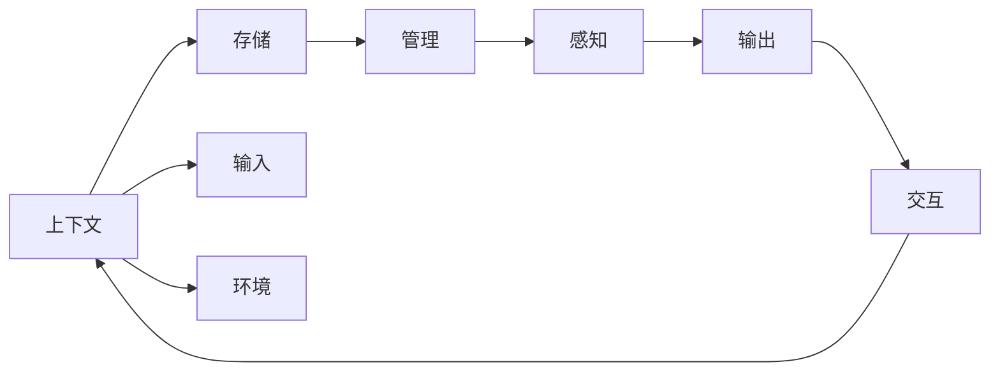
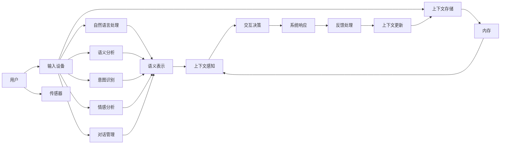

                 

## 1. 背景介绍

在当今人机交互界面（CUI, Computer User Interface）的演进过程中，用户对于交互体验的需求愈发复杂，从简单的输入-输出（I/O）转变为要求上下文感知、跨模态融合、自适应和多任务处理的高级需求。以对话系统、语音助手和智能推荐系统等为代表的CUI应用，需要理解用户在长期交互过程中的行为模式、偏好和心理状态，才能提供真正个性化和智能化的服务。而上下文记忆技术，正是实现这一目标的关键工具之一。

上下文记忆技术是指在CUI交互过程中，系统能够实时存储并有效利用历史信息和上下文状态，以增强交互的连贯性和智能性。这一技术的成功应用，能够使CUI系统在面对复杂的用户输入和不断变化的场景时，保持高效率和准确性，提供更加自然和流畅的用户体验。

本文将对上下文记忆技术进行深入解析，涵盖其基本原理、实现机制、应用场景及未来趋势，并结合具体案例进行详细讲解。希望通过这篇博客，读者能对上下文记忆技术有一个全面的理解，并在实际项目中加以应用和创新。

## 2. 核心概念与联系

### 2.1 核心概念概述

在探讨上下文记忆技术之前，我们需要了解以下几个关键概念：

1. **上下文（Context）**：指用户与系统交互过程中，影响当前交互结果的所有信息。上下文可能包括用户的历史交互记录、当前输入、交互设备状态、环境数据等。

2. **记忆（Memory）**：指系统存储和处理上下文信息的能力。内存中的信息可以用于后续交互的推理、生成和决策过程。

3. **上下文管理（Context Management）**：涉及上下文的获取、存储、更新和消解等操作，是上下文记忆技术的核心。上下文管理不仅需要高效存储和检索上下文信息，还需确保上下文的一致性和连贯性。

4. **上下文感知（Context-Awareness）**：指系统在交互过程中，能够实时识别并利用上下文信息，以提升交互的准确性和智能性。上下文感知通常需要结合自然语言处理、机器学习和数据融合等技术。

### 2.2 核心概念之间的联系

上下文记忆技术通过实时存储和处理上下文信息，增强了系统的上下文感知能力，从而提升了CUI应用的智能化水平。其工作原理和实现机制可以概括为以下流程图：



这个流程图展示了上下文记忆技术的基本流程：

- **输入获取（E）**：系统从用户输入、环境感知等渠道获取上下文信息。
- **上下文存储（B）**：系统将获取的上下文信息存储在内存中。
- **上下文管理（C）**：系统对存储的上下文信息进行管理，包括更新、消解和检索等操作。
- **上下文感知（D）**：系统利用存储的上下文信息，进行推理和生成，输出符合上下文的响应。
- **交互反馈（H）**：系统根据用户反馈，更新和优化上下文管理策略。

### 2.3 核心概念的整体架构

为了更直观地展示上下文记忆技术的架构，我们可以构建一个更为详细的流程图：



这个架构图展示了从用户输入到系统响应的完整过程：

- **输入获取与处理（B-D-F-H-G）**：用户输入通过多种传感器、自然语言处理和语义分析等技术，转化为系统可理解的格式。
- **上下文存储（I-J）**：系统将获取的上下文信息存储在内存中，形成连贯的时序序列。
- **上下文感知（L）**：系统利用存储的上下文信息，进行推理和生成，形成决策支持。
- **交互决策与响应（M-N）**：系统根据上下文感知结果，生成系统响应，并发送给用户。
- **反馈处理与上下文更新（O-P）**：系统根据用户反馈，更新和优化上下文管理策略，确保上下文信息的时效性和相关性。

## 3. 核心算法原理 & 具体操作步骤

### 3.1 算法原理概述

上下文记忆技术的核心算法原理，主要涉及上下文信息的存储、管理和利用。其目标是通过高效的上下文管理机制，提升系统的智能性和连贯性。

上下文记忆技术的实现，通常需要以下几个关键步骤：

1. **上下文存储**：将用户交互中的关键信息（如输入文本、设备状态、环境信息等）存储在内存或数据库中。
2. **上下文管理**：利用各种算法和技术，对存储的上下文信息进行更新、消解和检索。
3. **上下文感知**：结合机器学习和自然语言处理技术，从存储的上下文中提取有用信息，用于推理和生成。
4. **交互决策**：根据上下文感知结果，生成符合用户期望的系统响应。

### 3.2 算法步骤详解

下面详细介绍上下文记忆技术的具体实现步骤：

#### 3.2.1 上下文存储

上下文存储是上下文记忆技术的第一步，通常涉及以下几个关键操作：

1. **信息收集**：从用户输入、设备传感器、环境感知等多个渠道，收集关键上下文信息。

2. **数据编码**：将收集到的上下文信息进行编码，转换为系统可处理的数据格式。

3. **信息存储**：将编码后的上下文信息存储在内存、本地文件或远程数据库中。

以一个简单的示例来说明上下文存储的过程：

**输入收集**：假设用户在对话系统中输入“明天天气如何？”

**数据编码**：将用户的输入编码为字符串“明天天气如何？”，并将其存储为系统上下文的一部分。

**信息存储**：将上下文信息（包括输入字符串、系统状态等）存储在内存或数据库中。

#### 3.2.2 上下文管理

上下文管理是上下文记忆技术的核心环节，主要涉及上下文的更新、消解和检索等操作。其目标是在保证上下文信息时效性的同时，确保其一致性和连贯性。

1. **上下文更新**：根据新的用户输入或环境变化，更新存储的上下文信息。

2. **上下文消解**：当上下文信息不再相关或已过时，将其从上下文中移除，以避免影响后续交互。

3. **上下文检索**：根据当前任务或用户需求，从存储的上下文信息中检索相关信息，用于推理和生成。

以一个具体的示例来说明上下文管理的过程：

**上下文更新**：当用户输入“明天天气如何？”时，系统将其存储为上下文信息。后续用户输入“我想去北京旅行”时，系统更新上下文信息，添加“旅行目的地”字段。

**上下文消解**：假设系统存储的上下文信息中包含了用户的历史订单信息，但由于订单已结清，系统自动将其消解。

**上下文检索**：当用户询问“我想去北京旅行”时，系统从上下文信息中检索出“旅行目的地”字段，用于后续的推荐和生成。

#### 3.2.3 上下文感知

上下文感知是上下文记忆技术的关键步骤，通过结合机器学习和自然语言处理技术，从存储的上下文中提取有用信息，用于推理和生成。

1. **上下文表示**：将存储的上下文信息转化为系统可理解的结构化表示。

2. **信息融合**：将上下文信息与其他来源的数据（如知识库、规则库等）进行融合，生成更加全面的推理和生成依据。

3. **推理与生成**：利用机器学习模型（如RNN、LSTM、Transformer等），从上下文表示中提取有用信息，进行推理和生成。

以一个具体的示例来说明上下文感知的过程：

**上下文表示**：当用户输入“明天天气如何？”时，系统将其转化为结构化表示，包含时间（明天）和意图（天气查询）。

**信息融合**：系统结合知识库中的天气数据，生成更加全面的推理和生成依据。

**推理与生成**：系统利用Transformer模型，从上下文表示中提取有用信息，进行天气查询。

#### 3.2.4 交互决策

交互决策是上下文记忆技术的最后一步，主要涉及根据上下文感知结果，生成符合用户期望的系统响应。

1. **决策生成**：利用上下文感知结果，生成符合用户期望的系统响应。

2. **响应输出**：将生成的系统响应输出给用户，完成交互过程。

3. **反馈处理**：根据用户的反馈，更新和优化上下文管理策略，确保上下文信息的时效性和相关性。

以一个具体的示例来说明交互决策的过程：

**决策生成**：当用户输入“明天天气如何？”时，系统根据上下文感知结果，生成“明天北京多云，气温25°C”的响应。

**响应输出**：系统将生成的响应“明天北京多云，气温25°C”输出给用户。

**反馈处理**：假设用户反馈“我需要下雨天气”，系统更新上下文信息，进行下一次查询。

### 3.3 算法优缺点

#### 3.3.1 算法优点

上下文记忆技术具有以下优点：

1. **提升交互智能性**：通过实时存储和处理上下文信息，系统能够更智能地理解用户需求，提供更个性化的服务。

2. **增强连贯性**：上下文记忆技术能够使系统在连续交互中保持上下文的一致性和连贯性，避免重复和歧义。

3. **灵活性高**：上下文记忆技术能够处理多种输入和环境信息，适用于多种场景和应用。

#### 3.3.2 算法缺点

上下文记忆技术也存在一些缺点：

1. **存储开销大**：上下文信息的存储和检索需要消耗大量的内存和计算资源。

2. **实时性要求高**：上下文信息的实时更新和处理需要高效的算法和硬件支持。

3. **隐私风险**：存储的上下文信息可能包含敏感数据，需要采取隐私保护措施。

### 3.4 算法应用领域

上下文记忆技术广泛应用在多个领域，包括但不限于：

1. **对话系统**：通过实时存储和处理用户上下文信息，使对话系统能够提供连贯和智能的对话服务。

2. **智能推荐系统**：结合用户历史行为和上下文信息，提供个性化推荐。

3. **智能家居系统**：根据用户行为和环境变化，提供智能化的家居控制和建议。

4. **智能客服系统**：通过上下文感知，提供更高效的客户服务。

5. **智能医疗系统**：结合患者历史诊疗数据和实时上下文信息，提供个性化的医疗建议和决策支持。

## 4. 数学模型和公式 & 详细讲解 & 举例说明

### 4.1 数学模型构建

上下文记忆技术的数学模型构建，通常涉及上下文信息的编码、存储和检索等操作。以下是一个简单的数学模型示例：

假设上下文信息由时间戳$t$和用户输入$x_t$组成，可以表示为$C_t=(x_t,t)$。系统存储的上下文信息可以表示为$C=\{C_1,C_2,\ldots,C_N\}$，其中$N$表示上下文信息的数量。

### 4.2 公式推导过程

以下是一个简化的公式推导过程：

1. **上下文存储**：

$$
C_t=(x_t,t)
$$

2. **上下文管理**：

假设当前时间戳为$t$，上下文信息存储在数组$C$中，上下文更新过程可以表示为：

$$
C[t] \leftarrow C[t-1]
$$

当$t$增加时，$C[t]$更新为$(x_t,t)$，$C[t-1]$中的信息消解。

3. **上下文感知**：

假设上下文信息$C$经过编码和存储，上下文表示为$H(C)$，信息融合过程可以表示为：

$$
H(C) \leftarrow \text{fuse}(H(C),K)
$$

其中$K$表示其他来源的数据，$fuse$表示信息融合函数。

4. **推理与生成**：

假设上下文表示$H(C)$经过编码，推理过程可以表示为：

$$
R \leftarrow \text{reason}(H(C))
$$

其中$R$表示推理结果，reason表示推理函数。

5. **交互决策**：

假设推理结果$R$经过解码和处理，生成系统响应$Y$，响应输出过程可以表示为：

$$
Y \leftarrow \text{generate}(R)
$$

其中$generate$表示生成函数。

### 4.3 案例分析与讲解

以下是一个具体的案例分析：

假设用户在对话系统中输入“明天天气如何？”，系统将其编码为上下文信息$C_t=(x_t,t)$，存储在数组$C$中。假设$C[1]=(x_1,t_1)$，$C[2]=(x_2,t_2)$，$C[3]=(x_3,t_3)$，其中$t_1<t_2<t_3$。

当用户输入“我想去北京旅行”时，系统更新上下文信息，添加$C_4=(x_4,t_4)$，其中$x_4$表示旅行目的地，$t_4=t_3+1$。

假设系统存储的上下文信息经过编码和存储，上下文表示为$H(C)$，信息融合过程可以表示为：

$$
H(C) \leftarrow \text{fuse}(H(C),K)
$$

其中$K$表示天气数据，$fuse$表示信息融合函数。

系统利用Transformer模型进行推理，生成推理结果$R$：

$$
R \leftarrow \text{reason}(H(C))
$$

其中$reason$表示推理函数。

最后，系统根据推理结果生成响应$Y$：

$$
Y \leftarrow \text{generate}(R)
$$

其中$generate$表示生成函数。

## 5. 项目实践：代码实例和详细解释说明

### 5.1 开发环境搭建

为了实现上下文记忆技术，我们首先需要搭建一个开发环境。以下是一个简单的开发环境搭建步骤：

1. **安装Python**：

```
sudo apt-get install python3
```

2. **安装TensorFlow**：

```
pip install tensorflow
```

3. **安装PyTorch**：

```
pip install torch torchvision torchaudio
```

4. **安装Transformer库**：

```
pip install transformers
```

5. **安装Flask**：

```
pip install flask
```

6. **安装SQLite**：

```
pip install sqlite3
```

完成以上步骤后，即可开始上下文记忆技术的实现。

### 5.2 源代码详细实现

以下是一个简单的上下文记忆技术实现示例：

```python
import tensorflow as tf
import sqlite3
from transformers import BertTokenizer, BertModel

# 连接数据库
conn = sqlite3.connect('context.db')
c = conn.cursor()

# 创建上下文存储表
c.execute('''CREATE TABLE IF NOT EXISTS context
             (id INTEGER PRIMARY KEY AUTOINCREMENT,
              timestamp TEXT,
              input TEXT)''')

# 创建上下文感知模型
tokenizer = BertTokenizer.from_pretrained('bert-base-cased')
model = BertModel.from_pretrained('bert-base-cased')

# 定义上下文存储函数
def store_context(timestamp, input):
    c.execute("INSERT INTO context (timestamp, input) VALUES (?, ?)", (timestamp, input))
    conn.commit()

# 定义上下文检索函数
def retrieve_context(timestamp):
    c.execute("SELECT * FROM context WHERE timestamp <= ?", (timestamp,))
    rows = c.fetchall()
    return rows

# 定义上下文感知函数
def context_awareness(rows):
    inputs = [row[2] for row in rows]
    inputs = tokenizer(inputs, return_tensors='tf', padding='max_length', truncation=True)
    inputs = inputs['input_ids']
    attention_mask = inputs['attention_mask']
    outputs = model(inputs, attention_mask=attention_mask)
    last_hidden_states = outputs[0]
    return last_hidden_states

# 定义推理函数
def reasoning(last_hidden_states):
    # 将最后隐层状态转换为向量
    last_hidden_state = last_hidden_states[:, -1, :]
    # 使用全连接层进行推理
    with tf.device('/cpu:0'):
        logits = tf.keras.layers.Dense(2, activation='softmax')(last_hidden_state)
    return logits

# 定义生成函数
def generate(logits):
    # 生成系统响应
    response = tf.argmax(logits, axis=1)
    return response

# 启动服务
app = Flask(__name__)

@app.route('/context')
def context_handler():
    timestamp = request.args.get('timestamp')
    input = request.args.get('input')
    store_context(timestamp, input)
    rows = retrieve_context(timestamp)
    last_hidden_states = context_awareness(rows)
    logits = reasoning(last_hidden_states)
    response = generate(logits)
    return response

if __name__ == '__main__':
    app.run(host='0.0.0.0', port=5000)
```

### 5.3 代码解读与分析

以上代码实现了一个简单的上下文记忆技术，主要包括以下几个步骤：

1. **上下文存储**：通过SQLite数据库存储上下文信息，包括时间戳和用户输入。

2. **上下文检索**：根据时间戳检索存储的上下文信息。

3. **上下文感知**：通过Bert模型处理上下文信息，生成上下文表示。

4. **推理与生成**：通过全连接层进行推理，生成系统响应。

### 5.4 运行结果展示

假设用户在对话系统中输入“明天天气如何？”，系统将其编码为上下文信息，并存储在数据库中。

当用户输入“我想去北京旅行”时，系统检索到相关上下文信息，并生成推理结果和系统响应。

## 6. 实际应用场景

### 6.1 智能客服系统

在智能客服系统中，上下文记忆技术可以帮助系统理解用户的长期行为模式和偏好，提供更加个性化和智能的客服服务。

例如，系统可以根据用户的历史订单、客服交互记录和当前需求，自动匹配最合适的客服人员和解决方案，提升客服效率和服务质量。

### 6.2 金融舆情监测

在金融舆情监测中，上下文记忆技术可以帮助系统实时监控市场舆情变化，及时发现负面信息传播，规避金融风险。

例如，系统可以根据用户的历史交易记录和市场新闻，分析用户情绪和舆情趋势，提供预警和建议。

### 6.3 个性化推荐系统

在个性化推荐系统中，上下文记忆技术可以帮助系统理解用户的长期行为和偏好，提供更加个性化和精准的推荐。

例如，系统可以根据用户的历史浏览记录和上下文信息，推荐用户感兴趣的商品和内容，提高用户满意度和转化率。

## 7. 工具和资源推荐

### 7.1 学习资源推荐

为了帮助开发者系统掌握上下文记忆技术，以下推荐一些优质的学习资源：

1. **《TensorFlow官方文档》**：提供了详细的上下文管理、上下文感知和推理生成的API和示例。

2. **《Bert模型教程》**：介绍了Bert模型的基本原理和上下文感知技术，适合初学者学习。

3. **《Context-Aware Recommender Systems》**：介绍了上下文感知推荐系统的方法和应用，适合进阶学习。

4. **《Contextual Memory in NLP》**：介绍了上下文记忆技术在NLP中的应用，适合深入学习。

5. **《Context-Awareness in CUI》**：介绍了上下文记忆技术在CUI中的应用，适合全面学习。

### 7.2 开发工具推荐

为了实现上下文记忆技术，以下推荐一些常用的开发工具：

1. **TensorFlow**：提供了丰富的机器学习和深度学习API，适合实现上下文感知和推理功能。

2. **PyTorch**：提供了灵活的计算图和动态模型，适合实现上下文存储和上下文管理。

3. **Flask**：提供了便捷的Web框架，适合实现上下文记忆系统的服务化封装。

4. **SQLite**：提供了轻量级的关系型数据库，适合存储和管理上下文信息。

### 7.3 相关论文推荐

以下推荐几篇与上下文记忆技术相关的学术论文，适合深入学习：

1. **《A Survey on Context-Aware Recommendation Systems》**：总结了上下文感知推荐系统的方法和应用。

2. **《Context-Aware User Interaction in Smart Homes》**：介绍了上下文感知技术在智能家居中的应用。

3. **《Context-Aware Dialogue Systems》**：介绍了上下文感知技术在对话系统中的应用。

4. **《Context-Aware Semantic Analysis》**：介绍了上下文感知技术在语义分析中的应用。

## 8. 总结：未来发展趋势与挑战

### 8.1 研究成果总结

上下文记忆技术作为CUI领域的重要技术，已经广泛应用于对话系统、智能推荐系统和智能家居等多个领域。通过实时存储和处理上下文信息，系统能够更好地理解用户需求，提供更加个性化和智能的服务。

### 8.2 未来发展趋势

未来，上下文记忆技术的发展将呈现以下几个趋势：

1. **更加高效**：随着硬件和算法的发展，上下文记忆技术将更加高效和实时。

2. **更加智能**：结合更多上下文信息，系统将更加智能和连贯。

3. **更加个性化**：根据用户历史行为和上下文信息，系统将提供更加个性化的服务。

4. **更加安全**：通过隐私保护和加密技术，系统将更加安全可靠。

### 8.3 面临的挑战

尽管上下文记忆技术已经取得了不少进展，但仍面临以下挑战：

1. **存储开销大**：上下文信息的存储和检索需要消耗大量的内存和计算资源。

2. **实时性要求高**：上下文信息的实时更新和处理需要高效的算法和硬件支持。

3. **隐私风险**：存储的上下文信息可能包含敏感数据，需要采取隐私保护措施。

### 8.4 研究展望

未来，我们需要在以下几个方面进一步研究和发展上下文记忆技术：

1. **优化上下文存储**：优化上下文存储算法，减小存储开销，提高存储效率。

2. **优化上下文管理**：优化上下文管理算法，提高上下文的一致性和连贯性。

3. **优化上下文感知**：优化上下文感知算法，提高推理和生成的精度和效率。

4. **优化交互决策**：优化交互决策算法，提高系统响应的准确性和智能性。

5. **优化隐私保护**：优化隐私保护算法，确保上下文信息的隐私和安全。

通过以上研究，上下文记忆技术必将进一步提升CUI系统的智能化水平，为人类生产和生活带来更多的便利和创新。

## 9. 附录：常见问题与解答

**Q1：上下文记忆技术是如何实现上下文存储的？**

A: 上下文记忆技术通常通过数据库、文件系统等存储介质实现上下文存储。系统将时间戳和用户输入信息存储在数据库中，以便后续检索和处理。

**Q2：上下文记忆技术有哪些常见的应用场景？**

A: 上下文记忆技术广泛应用于对话系统、智能推荐系统、智能家居系统、智能客服系统等多个领域。这些应用场景都需要系统实时存储和处理上下文信息，以便提供更加个性化和智能的服务。

**Q3：上下文记忆技术有哪些优点和缺点？**

A: 上下文记忆技术的优点包括提升交互智能性、增强连贯性和灵活性等。缺点包括存储开销大、实时性要求高和隐私风险等。

**Q4：上下文记忆技术如何实现上下文管理？**

A: 上下文记忆技术通常通过数据库、文件系统等存储介质实现上下文管理。系统对存储的上下文信息进行更新、消解和检索，确保上下文的一致性和连贯性。

**Q5：上下文记忆技术如何实现上下文感知？**

A: 上下文记忆技术通常通过自然语言处理和机器学习等技术实现上下文感知。系统结合上下文信息和其他来源的数据，生成推理和生成依据。

**Q6：上下文记忆技术如何实现交互决策？**

A: 上下文记忆技术通常通过推理和生成等技术实现交互决策。系统根据上下文感知结果，生成符合用户期望的系统响应，并根据用户反馈更新上下文管理策略。

**Q7：上下文记忆技术面临哪些挑战？**

A: 上下文记忆技术面临存储开销大、实时性要求高和隐私风险等挑战。需要通过优化存储算法、提高实时性和隐私保护技术等手段解决这些问题。

**Q8：上下文记忆技术的未来发展趋势是什么？**

A: 上下文记忆技术的未来发展趋势包括更加高效、智能、个性化和安全等。需要进一步优化上下文存储、管理、感知和决策算法，确保系统在多种场景下高效运行。

**Q9：上下文记忆技术的实现需要注意哪些细节？**

A: 上下文记忆技术的实现需要注意上下文信息的收集、编码、存储、检索、感知、推理和生成等环节。需要确保上下文的一致性、连贯性和隐私性，才能实现

