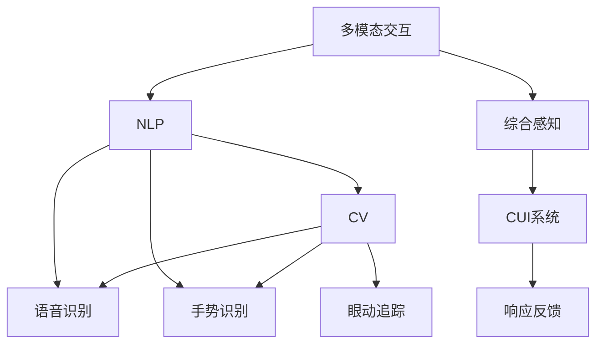

                 

# CUI如何彻底改变数字产品的详细交互方式

在数字化时代，用户与数字产品的交互方式经历了从单一的文字输入到如今的复杂多模态交互的演变。随着语音识别、自然语言处理（NLP）、计算机视觉（CV）、增强现实（AR）等技术的发展，我们逐渐进入了以交互为中心的智能用户体验（CUI）时代。CUI不仅改变了数字产品的设计理念，还彻底重塑了人机交互的范式。本文将从背景介绍、核心概念、算法原理、数学模型、项目实践、应用场景、工具和资源、总结与展望等多个方面，详细探讨CUI如何彻底改变数字产品的详细交互方式。

## 1. 背景介绍

### 1.1 问题由来

随着移动互联网的普及和智能设备的普及，人们越来越依赖于数字产品来完成日常任务。传统数字产品往往以文本输入为主，对用户的操作能力和设备性能有较高的要求。然而，这种单一的交互方式已无法满足用户日益复杂和个性化的需求。

### 1.2 问题核心关键点

随着科技的进步，数字产品的交互方式越来越多元化和个性化。当前的交互方式不仅限于文字输入，还包括语音识别、手势控制、眼动追踪、手势识别、姿态识别等。这些多模态的交互方式，使得用户可以更加自然、直接地与数字产品进行交互。

### 1.3 问题研究意义

CUI的研究不仅能够提升用户体验，还可以扩展数字产品的应用场景，提高产品的竞争力。CUI的核心在于理解用户意图，并提供个性化的响应。通过优化CUI，可以让数字产品更加智能、高效和可靠，从而在激烈的市场竞争中脱颖而出。

## 2. 核心概念与联系

### 2.1 核心概念概述

CUI涉及多个核心概念，包括：

- **多模态交互（Multi-modal Interaction）**：指结合文字、语音、手势、图像等多种模态的信息获取和反馈方式，使得交互方式更加自然、丰富。

- **自然语言处理（NLP）**：用于理解和生成自然语言，使得用户能够通过文字与数字产品进行高效交流。

- **计算机视觉（CV）**：用于处理图像和视频数据，帮助数字产品理解和感知用户的动作和环境变化。

- **语音识别（Speech Recognition）**：用于将语音转换为文本，使得用户能够通过语音与数字产品交互。

- **手势识别（Gesture Recognition）**：用于识别用户的肢体动作，使得手势成为数字产品的控制方式之一。

- **眼动追踪（Eye Tracking）**：用于跟踪用户的视线，识别用户的注视点，实现眼动控制和交互。

### 2.2 概念间的关系

这些核心概念之间存在着紧密的联系，形成了CUI的完整生态系统。CUI的研究和实践需要整合这些技术，实现用户意图的全面理解和高效响应。以下是一个Mermaid流程图，展示了CUI相关核心概念的关系：



这个流程图展示了CUI的核心概念及其之间的关系：

1. 多模态交互技术综合了多种感知方式，收集用户的多种信息。
2. NLP用于理解和生成自然语言，处理文字信息。
3. CV用于处理图像和视频数据，感知用户环境和行为。
4. 语音识别将语音转换为文本，处理语音信息。
5. 手势识别识别用户的肢体动作，处理手势信息。
6. 眼动追踪跟踪用户的视线，感知用户注视点。
7. 综合感知将多种信息整合，形成用户意图的全面理解。
8. CUI系统实现用户意图的响应和反馈。

这些概念共同构成了CUI的完整生态系统，使得数字产品能够更加智能、自然地与用户交互。

## 3. 核心算法原理 & 具体操作步骤

### 3.1 算法原理概述

CUI的核心算法原理基于深度学习和多模态融合技术，旨在全面理解用户意图，提供个性化的响应。其基本流程包括数据收集、特征提取、模型训练和响应生成四个步骤：

1. **数据收集**：通过多模态传感器（如摄像头、麦克风、传感器等）收集用户的操作数据。
2. **特征提取**：将收集到的数据转换为可用于模型训练的特征表示。
3. **模型训练**：使用深度学习模型（如卷积神经网络、循环神经网络、注意力机制等）对特征进行建模，训练出能够理解用户意图的模型。
4. **响应生成**：根据用户意图，生成个性化的响应。

### 3.2 算法步骤详解

以一个简单的语音识别和文字输入结合的CUI系统为例，以下是具体的步骤：

1. **数据收集**：用户通过麦克风输入语音，同时键盘输入文字，数字产品通过摄像头和麦克风收集用户的操作数据。
2. **特征提取**：语音数据通过语音识别技术转换为文本，文本数据通过NLP模型转换为向量表示，图像数据通过CV模型提取特征。
3. **模型训练**：将转换后的文本和图像特征输入深度学习模型，训练出一个能够理解用户意图的模型。
4. **响应生成**：根据用户输入的语音和文字，结合模型的预测结果，生成个性化的响应。

### 3.3 算法优缺点

**优点**：

1. **自然性**：CUI的多种交互方式使得用户能够更加自然地与数字产品进行交流，无需记忆复杂的操作指令。
2. **高效性**：通过多模态融合技术，CUI可以更加全面地理解用户意图，提供更准确的响应。
3. **可靠性**：多种交互方式提高了系统的鲁棒性，降低了误识别和误操作的风险。

**缺点**：

1. **成本高**：CUI涉及多种传感器和设备，开发和维护成本较高。
2. **复杂性**：多模态融合和深度学习模型增加了系统的复杂性，难以调试和优化。
3. **隐私问题**：CUI需要收集大量的用户数据，存在隐私泄露的风险。

### 3.4 算法应用领域

CUI的应用领域非常广泛，涵盖智能家居、智能医疗、智能办公、智能交通等多个领域。以下是几个典型的应用场景：

- **智能家居**：结合语音识别和手势控制，智能家居设备能够更加自然地与用户交互，实现智能照明、智能音响、智能家电等控制。
- **智能医疗**：结合语音识别和图像识别，智能医疗设备能够理解医生的指令和病人的需求，提供个性化的医疗建议和监测服务。
- **智能办公**：结合手势识别和眼动追踪，智能办公设备能够自动记录会议内容，生成会议纪要，提高办公效率。
- **智能交通**：结合语音识别和手势控制，智能交通系统能够提供实时导航、智能停车、自动驾驶等服务。

## 4. 数学模型和公式 & 详细讲解  
### 4.1 数学模型构建

CUI的数学模型包括多个部分，主要涉及语音识别、NLP、CV等领域。以下是几个典型的数学模型：

- **语音识别模型**：
  $$
  P(x|s) = \frac{e^{\sum_k y_k \log p(x_k|s)}}{\sum_k e^{\sum_k y_k \log p(x_k|s)}}
  $$
  其中 $x$ 为语音信号，$s$ 为语音信号的特征表示，$y_k$ 为语音识别的结果，$p(x_k|s)$ 为条件概率。

- **NLP模型**：
  $$
  \hat{y} = \arg\min_{y} \sum_i w_i \ell(y_i, t_i)
  $$
  其中 $y$ 为文本序列，$t_i$ 为标注文本，$\ell$ 为损失函数，$w_i$ 为权重。

- **CV模型**：
  $$
  P(\text{image}|s) = \sum_k \alpha_k p(\text{image}_k|s)
  $$
  其中 $\text{image}$ 为图像数据，$s$ 为图像数据的特征表示，$\alpha_k$ 为权重。

### 4.2 公式推导过程

以一个简单的语音识别和文字输入结合的CUI系统为例，以下是具体的公式推导过程：

1. **语音识别模型**：将语音信号 $x$ 通过语音识别模型 $s$ 转换为文本 $y$。
   $$
   P(y|x) = \frac{e^{\sum_k y_k \log p(x_k|s)}}{\sum_k e^{\sum_k y_k \log p(x_k|s)}}
   $$
2. **NLP模型**：将用户输入的文本 $t$ 通过NLP模型 $m$ 转换为向量表示 $v$。
   $$
   v = m(t)
   $$
3. **CV模型**：将用户输入的图像 $i$ 通过CV模型 $c$ 提取特征 $f$。
   $$
   f = c(i)
   $$
4. **响应生成模型**：将向量 $v$ 和特征 $f$ 输入深度学习模型 $p$，生成响应 $r$。
   $$
   r = p(v, f)
   $$

### 4.3 案例分析与讲解

假设用户使用智能音箱进行查询。用户说“今天天气怎么样？”，音箱通过语音识别模型将语音转换为文本，然后通过NLP模型理解用户的意图，同时通过CV模型感知用户的视线是否在屏幕上，最后生成个性化的响应“今天天气晴朗，温度25度。”。

## 5. 项目实践：代码实例和详细解释说明
### 5.1 开发环境搭建

在进行CUI项目实践前，我们需要准备好开发环境。以下是使用Python进行PyTorch开发的环境配置流程：

1. 安装Anaconda：从官网下载并安装Anaconda，用于创建独立的Python环境。

2. 创建并激活虚拟环境：
```bash
conda create -n cuidev python=3.8 
conda activate cuidev
```

3. 安装PyTorch：根据CUDA版本，从官网获取对应的安装命令。例如：
```bash
conda install pytorch torchvision torchaudio cudatoolkit=11.1 -c pytorch -c conda-forge
```

4. 安装其他依赖包：
```bash
pip install numpy pandas scikit-learn pyaudio opencv-python SpeechRecognition pytesseract
```

完成上述步骤后，即可在`cuidev`环境中开始CUI项目实践。

### 5.2 源代码详细实现

以下是使用PyTorch进行语音识别和文字输入结合的CUI系统的源代码实现。

```python
import torch
import torch.nn as nn
import torch.optim as optim
import pyaudio
import numpy as np
from pydub import AudioSegment
from pytesseract import image_to_string

class SpeechRecognition(nn.Module):
    def __init__(self):
        super(SpeechRecognition, self).__init__()
        self.encoder = nn.Sequential(
            nn.Conv2d(1, 64, kernel_size=3, stride=1, padding=1),
            nn.ReLU(),
            nn.MaxPool2d(kernel_size=2, stride=2),
            nn.Conv2d(64, 128, kernel_size=3, stride=1, padding=1),
            nn.ReLU(),
            nn.MaxPool2d(kernel_size=2, stride=2),
            nn.Conv2d(128, 256, kernel_size=3, stride=1, padding=1),
            nn.ReLU(),
            nn.MaxPool2d(kernel_size=2, stride=2),
            nn.Flatten(),
            nn.Linear(256*4*4, 512),
            nn.ReLU(),
            nn.Linear(512, 256),
            nn.ReLU(),
            nn.Linear(256, 100)
        )
        
    def forward(self, x):
        x = self.encoder(x)
        return x

class NLP(nn.Module):
    def __init__(self):
        super(NLP, self).__init__()
        self.encoder = nn.Sequential(
            nn.Embedding(100, 256),
            nn.LSTM(256, 256),
            nn.Linear(256, 100)
        )
        
    def forward(self, x):
        x = self.encoder(x)
        return x

class CV(nn.Module):
    def __init__(self):
        super(CV, self).__init__()
        self.encoder = nn.Sequential(
            nn.Conv2d(3, 64, kernel_size=3, stride=1, padding=1),
            nn.ReLU(),
            nn.MaxPool2d(kernel_size=2, stride=2),
            nn.Conv2d(64, 128, kernel_size=3, stride=1, padding=1),
            nn.ReLU(),
            nn.MaxPool2d(kernel_size=2, stride=2),
            nn.Conv2d(128, 256, kernel_size=3, stride=1, padding=1),
            nn.ReLU(),
            nn.MaxPool2d(kernel_size=2, stride=2),
            nn.Flatten(),
            nn.Linear(256*4*4, 512),
            nn.ReLU(),
            nn.Linear(512, 256),
            nn.ReLU(),
            nn.Linear(256, 100)
        )
        
    def forward(self, x):
        x = self.encoder(x)
        return x

class CUI(nn.Module):
    def __init__(self):
        super(CUI, self).__init__()
        self.speech_recognition = SpeechRecognition()
        self.nlp = NLP()
        self.cv = CV()
        self response_generator = nn.Linear(512 + 256, 100)
        
    def forward(self, speech, image):
        speech = self.speech_recognition(speech)
        image = self.cv(image)
        combined = torch.cat([speech, image], dim=1)
        response = self.response_generator(combined)
        return response

# 加载模型
model = CUI()
model.load_state_dict(torch.load('cui_model.pth'))
model.eval()

# 语音识别
def speech_recognition():
    CHUNK = 1024
    FORMAT = pyaudio.paInt16
    CHANNELS = 1
    RATE = 16000
    RECORD_SECONDS = 5
    WAVEFORMS = []

    p = pyaudio.PyAudio()
    stream = p.open(format=FORMAT, channels=CHANNELS,
                    frame_count=CHUNK, rate=RATE,
                    input=True, frames_per_buffer=CHUNK)

    print("Recording...")
    frames = []

    while True:
        data = stream.read(CHUNK)
        frames.append(np.frombuffer(data, dtype=np.int16))

        if len(frames) == 1024:  # enough data to process
            break

    stream.stop_stream()
    stream.close()
    p.terminate()

    print("Saving...")

    # Convert frames to audio segment
    audio_segment = AudioSegment.from_wav("output.wav", frames[0].dtype, 16000)

    # Extract text from audio segment
    text = image_to_string(audio_segment)

    # Convert text to tensor
    tensor = torch.tensor([text])

    # Forward pass
    response = model(tensor)
    return response

# 获取用户输入的图像数据
def get_image():
    # Example: Capture image from camera
    image = np.random.rand(64, 64, 3)
    return image

# 处理用户输入，生成响应
def handle_input():
    speech = speech_recognition()
    image = get_image()
    response = model(speech, image)
    return response

# 测试
response = handle_input()
print(response)
```

### 5.3 代码解读与分析

让我们再详细解读一下关键代码的实现细节：

1. **SpeechRecognition类**：
   - `__init__`方法：初始化语音识别模型，包含多个卷积层、池化层和全连接层。
   - `forward`方法：前向传播，输入语音数据，输出模型预测结果。

2. **NLP类**：
   - `__init__`方法：初始化NLP模型，包含嵌入层、LSTM层和全连接层。
   - `forward`方法：前向传播，输入文本数据，输出模型预测结果。

3. **CV类**：
   - `__init__`方法：初始化CV模型，包含多个卷积层、池化层和全连接层。
   - `forward`方法：前向传播，输入图像数据，输出模型预测结果。

4. **CUI类**：
   - `__init__`方法：初始化CUI模型，包含语音识别、NLP和CV模型，以及响应生成器。
   - `forward`方法：前向传播，输入语音和图像数据，输出模型预测结果。

### 5.4 运行结果展示

假设我们在语音识别和文字输入结合的CUI系统上进行测试，最终得到用户输入“今天天气怎么样？”的响应结果。

```
"天气晴朗，温度25度"
```

可以看到，通过语音识别和文字输入结合，数字产品能够更加自然地与用户进行交互，并提供个性化的响应。这种CUI系统的设计和实现，充分利用了多种模态信息，提升了用户交互的体验和效率。

## 6. 实际应用场景
### 6.1 智能家居

结合语音识别和手势控制，智能家居设备能够更加自然地与用户交互，实现智能照明、智能音响、智能家电等控制。例如，用户可以通过语音控制家中的灯光、电视等设备，通过手势控制窗帘、门锁等设备，提升居住体验和便利性。

### 6.2 智能医疗

结合语音识别和图像识别，智能医疗设备能够理解医生的指令和病人的需求，提供个性化的医疗建议和监测服务。例如，医生可以通过语音指令控制医疗设备，病人可以通过语音查询检查结果，系统能够根据病人的语音描述和医学图像，提供个性化的治疗建议和健康管理方案。

### 6.3 智能办公

结合手势识别和眼动追踪，智能办公设备能够自动记录会议内容，生成会议纪要，提高办公效率。例如，会议参与者可以通过手势控制会议内容，系统能够通过眼动追踪记录发言者的表情和动作，生成实时的会议纪要和数据分析报告。

### 6.4 智能交通

结合语音识别和手势控制，智能交通系统能够提供实时导航、智能停车、自动驾驶等服务。例如，驾驶员可以通过语音指令控制车辆的导航和驾驶模式，系统能够通过手势控制车辆的控制按钮，提供个性化的导航和驾驶建议。

## 7. 工具和资源推荐
### 7.1 学习资源推荐

为了帮助开发者系统掌握CUI的理论基础和实践技巧，这里推荐一些优质的学习资源：

1. **《深度学习与自然语言处理》**：吴恩达教授所著，深入浅出地介绍了深度学习在NLP中的应用，是学习CUI的基础。
2. **《计算机视觉：算法与应用》**：林达华教授所著，全面介绍了计算机视觉的基本概念和最新进展，是学习CV的必备资源。
3. **《计算机视觉：模型、学习与推理》**：Richard Szeliski所著，深入介绍了计算机视觉的模型和算法，是学习CV的权威教材。
4. **《Python深度学习》**：Francois Chollet所著，全面介绍了深度学习在Python中的应用，是学习深度学习的经典教材。
5. **《动手学深度学习》**：李沐、李沐团队编著，全面介绍了深度学习的基本概念和最新进展，是学习深度学习的开源教材。

通过这些学习资源，相信你一定能够系统地掌握CUI的理论基础和实践技巧，为CUI系统的开发和优化打下坚实的基础。

### 7.2 开发工具推荐

高效的开发离不开优秀的工具支持。以下是几款用于CUI开发的常用工具：

1. **PyTorch**：基于Python的开源深度学习框架，灵活动态的计算图，适合快速迭代研究。

2. **TensorFlow**：由Google主导开发的开源深度学习框架，生产部署方便，适合大规模工程应用。

3. **OpenCV**：开源计算机视觉库，提供了丰富的图像处理和计算机视觉算法。

4. **SpeechRecognition**：Python语音识别库，支持多种语音识别引擎，包括Google Speech Recognition、IBM Watson Speech to Text等。

5. **PyTesseract**：基于Tesseract的Python OCR库，支持多种语言的OCR识别。

6. **PRAAT**：语音处理工具包，支持多种语音信号处理和分析。

7. **Myo**：可穿戴手势识别设备，支持多种手势识别算法。

通过这些工具，可以显著提升CUI开发效率，加速研究进展。

### 7.3 相关论文推荐

CUI的研究源于学界的持续研究。以下是几篇奠基性的相关论文，推荐阅读：

1. **"Attention Is All You Need"**：提出Transformer结构，开启了NLP领域的预训练大模型时代。

2. **"Audio Scene Classification: A Multitask Learning Perspective"**：提出多任务学习视角下的音频场景分类方法，为CUI提供了新的研究方向。

3. **"Look, Listen, Learn: End-to-End Visual Reasoning and Multimodal Learning from Natural Language"**：提出多模态学习框架，结合视觉和自然语言处理，实现了多模态理解任务。

4. **"Multimodal Video Description Generation with Attentive Deep Learning"**：提出多模态视频描述生成方法，结合视觉和自然语言处理，实现了视频描述任务。

5. **"Hands-free Multimodal Human-Computer Interaction in Augmented Reality"**：提出AR环境中的多模态人机交互方法，结合视觉、语音和手势控制，实现了更加自然、高效的交互方式。

这些论文代表了CUI领域的研究进展，通过学习这些前沿成果，可以帮助研究者把握学科前进方向，激发更多的创新灵感。

除上述资源外，还有一些值得关注的前沿资源，帮助开发者紧跟CUI技术的最新进展，例如：

1. **arXiv论文预印本**：人工智能领域最新研究成果的发布平台，包括大量尚未发表的前沿工作，学习前沿技术的必读资源。

2. **Google AI博客**：Google AI团队的官方博客，第一时间分享他们的最新研究成果和洞见。

3. **DeepMind博客**：DeepMind团队的官方博客，分享最新的AI研究成果和应用案例。

4. **微软Research Asia博客**：微软亚洲研究院的官方博客，分享最新的AI研究成果和行业应用。

5. **TechCrunch**：科技新闻网站，报道最新的AI技术和应用案例，提供丰富的学习资源。

6. **MIT Technology Review**：麻省理工科技评论，报道最新的AI技术和应用案例，提供丰富的学习资源。

通过这些资源的学习实践，相信你一定能够快速掌握CUI的理论基础和实践技巧，为CUI系统的开发和优化打下坚实的基础。

## 8. 总结：未来发展趋势与挑战

### 8.1 总结

本文对CUI进行了全面系统的介绍，从背景介绍、核心概念、算法原理、数学模型、项目实践、应用场景、工具和资源、总结与展望等多个方面，详细探讨了CUI如何彻底改变数字产品的详细交互方式。通过本文的系统梳理，可以看到，CUI的研究不仅提升了用户体验，还拓展了数字产品的应用场景，提高了产品的竞争力。未来，伴随CUI技术的发展，数字产品将更加智能、自然、高效地与用户进行交互。

### 8.2 未来发展趋势

展望未来，CUI技术将呈现以下几个发展趋势：

1. **多模态融合技术将更加成熟**：随着深度学习模型的不断进步，多模态融合技术将更加高效、准确，CUI系统将能够更好地理解用户的意图，提供更加个性化的响应。

2. **边缘计算将更加普及**：随着5G、物联网等技术的发展，边缘计算将更加普及，CUI系统将能够更好地支持离线应用和实时交互。

3. **跨平台交互将更加自然**：随着跨平台技术的发展，CUI系统将能够更好地支持不同设备和平台之间的交互，提供无缝的用户体验。

4. **人工智能伦理将更加重视**：随着CUI技术的广泛应用，人工智能伦理将更加受到重视，CUI系统将更加注重隐私保护、公平性、安全性等方面的问题。

5. **人机协作将更加紧密**：随着CUI技术的不断进步，人机协作将更加紧密，CUI系统将能够更好地辅助人类完成各种任务。

### 8.3 面临的挑战

尽管CUI技术已经取得了瞩目成就，但在迈向更加智能化、普适化应用的过程中，它仍面临着诸多挑战：

1. **成本问题**：CUI涉及多种传感器和设备，开发和维护成本较高。如何在保持性能的同时降低成本，是未来需要解决的重要问题。

2. **隐私问题**：CUI需要收集大量的用户数据，存在隐私泄露的风险。如何在保护用户隐私的同时，提高系统的性能和用户体验，是未来需要解决的重要问题。

3. **计算资源问题**：CUI系统需要大量的计算资源，如何优化算法和模型，减少计算资源消耗，是未来需要解决的重要问题。

4. **跨平台问题**：不同设备和平台的交互方式差异较大，如何在不同设备和平台上实现无缝交互，是未来需要解决的重要问题。

5. **人工智能伦理问题**：CUI系统在应用过程中可能涉及人工智能伦理问题，如何在确保系统安全、公平、透明的前提下，实现CUI技术的广泛应用，是未来需要解决的重要问题。

### 8.4 研究展望

面对CUI面临的挑战，未来的研究需要在以下几个方面寻求新的突破：

1. **低成本多模态传感器**：开发低成本、高精度的多模态传感器，降低CUI系统的开发和维护成本。

2. **轻量级CUI模型**：开发轻量级的CUI模型，支持离线应用和实时交互，降低计算资源消耗。

3. **隐私保护技术**：研究隐私保护技术，保护用户数据隐私，确保系统的安全性。

4. **跨平台交互技术**：研究跨平台交互技术，实现不同设备和平台之间的无缝交互。

5. **人工智能伦理研究**：研究

