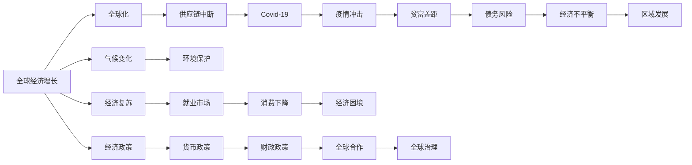

                 

# 正视当前世界经济面临的增长困境

## 1. 背景介绍

### 1.1 全球经济增长放缓的原因
近年来，全球经济增速放缓，受全球化和疫情的双重影响，许多国家的经济增长都面临着前所未有的挑战。根据国际货币基金组织(IMF)的数据，2019年全球经济增长率为2.4%，2020年更是大幅下降至-3.0%，2021年虽然有所回升，但全年增速也仅为6.0%。这一现象背后的原因复杂多样，主要包括全球化放缓、人口老龄化、贫富差距扩大、债务风险上升、气候变化等因素。

### 1.2 各国经济增长的不平衡
尽管全球经济总体增速放缓，但不同国家和地区的发展状况仍存在显著差异。例如，发达国家经济复苏较快，而发展中国家则受到疫情和全球供应链中断的严重影响。2020年，G7国家的GDP增速达到4.6%，而新兴市场和发展中国家的增速则仅为3.5%。这一不平衡的发展状况进一步加剧了全球经济的不稳定性，加剧了经济强国与弱国之间的差距。

### 1.3 经济增长的困境
全球经济增长的困境不仅影响着GDP数据，更直接关系到全球人民的生活质量和就业机会。特别是在新冠疫情背景下，许多国家出现了失业率上升、消费下降、企业倒闭等问题，经济增长的持续性面临严重挑战。例如，2020年全球失业率上升至6.3%，发达国家的失业率更是高达7.6%。这一背景下，如何实现全球经济的可持续增长，成为当前各国政府和国际组织需要共同面对的重要课题。

## 2. 核心概念与联系

### 2.1 核心概念概述

在探讨世界经济增长困境的过程中，我们需要对以下几个核心概念进行了解：

- **全球化**：指不同国家和地区之间的商品、资本、技术和人员的流动，推动了全球经济一体化进程。然而，近年来全球化进程放缓，部分国家出现了保护主义和逆全球化的现象。

- **疫情冲击**：新冠疫情的爆发和蔓延，对全球经济造成了前所未有的冲击。各国在防疫和经济恢复之间进行权衡，经济增长受到严重影响。

- **供应链中断**：疫情导致全球供应链中断，企业无法及时获取原材料和零部件，影响了生产和贸易。

- **贫富差距**：全球化和技术进步带来的财富增长，主要集中在少数发达国家，发展中国家受益较少，贫富差距不断扩大。

- **债务风险**：各国政府和企业的债务水平不断攀升，增加了经济的风险性。

- **气候变化**：气候变化对农业、能源和基础设施等经济活动产生了重大影响，增加了经济的不确定性。

这些概念之间存在复杂的相互作用，构成了当前全球经济增长困境的复杂背景。

### 2.2 概念间的关系

以下是一个Mermaid流程图，展示了上述核心概念之间的关系：

```mermaid
graph LR
    G7[G7国家] --> A[全球经济增长]
    Emerging Markets[新兴市场] --> A
    Globalization[全球化] --> B[Fundamentals]
    Debt Risk[债务风险] --> B
    Climate Change[气候变化] --> B
    COVID-19[Covid-19] --> C[Economic Impact]
    B --> D[供应链中断]
    A --> E[全球贫富差距]
    C --> F[失业率上升]
    A --> G[全球经济不平衡]
```

这个流程图展示了全球经济增长困境的复杂性。全球化和技术进步为全球经济带来了诸多好处，但也带来了挑战，如贫富差距扩大和气候变化等。疫情和供应链中断对经济活动造成了重大冲击，进一步加剧了经济增长的不确定性。全球经济的不平衡也导致了就业市场的压力增大，使得各国政府在经济复苏和防疫之间需要平衡取舍。

### 2.3 核心概念的整体架构

以下是一个综合的Mermaid流程图，展示了全球经济增长困境的总体架构：



这个流程图展示了全球经济增长困境的总体架构。全球化、供应链中断、疫情冲击、贫富差距、债务风险和气候变化等概念，共同构成了当前全球经济增长困境的复杂背景。区域发展不平衡和经济复苏进程中的挑战，使得各国政府需要在经济政策、货币政策和财政政策之间进行平衡。全球合作和治理，也是解决当前经济困境的重要途径。

## 3. 核心算法原理 & 具体操作步骤

### 3.1 算法原理概述

为了更好地理解和应对当前全球经济增长困境，本节将介绍几种常见的经济增长模型和算法，以帮助政府和政策制定者进行决策。

- **新古典增长模型**：基于索洛模型，探讨了资本、劳动和技术对经济增长的影响。该模型假设生产函数为指数形式，资本、劳动和技术水平固定，储蓄率决定了资本存量，进而决定了经济增长率。

- **新凯恩斯主义模型**：基于货币政策对经济的短期影响，探讨了货币供应量、利率和通货膨胀对经济增长的影响。该模型认为货币政策可以对经济增长产生显著影响。

- **多部门增长模型**：基于宏观经济系统的多个部门（如消费、投资、政府、进出口），探讨了这些部门之间的相互作用对经济增长的影响。该模型强调了外部冲击（如技术进步、金融危机）对经济增长的不确定性。

### 3.2 算法步骤详解

以下是一个经济增长的预测和分析流程，展示了如何使用新古典增长模型进行经济增长的预测：

1. **数据准备**：收集历史经济数据，如资本存量、劳动人口、生产函数、储蓄率等。

2. **模型设定**：根据新古典增长模型，设定生产函数为 $Y = K^{\alpha}L^{\beta}F(K, L)$，其中 $Y$ 为总产出，$K$ 为资本存量，$L$ 为劳动人口，$F(K, L)$ 为技术进步，$\alpha$ 和 $\beta$ 为资本和劳动的产出弹性。

3. **参数估计**：利用历史数据，通过最小化误差平方和，估计模型的参数。

4. **经济预测**：设定新的储蓄率、资本存量、劳动人口等变量，预测未来的经济增长率。

5. **政策模拟**：假设不同的政策情景（如增加税收、提高储蓄率），模拟其对经济增长的影响。

### 3.3 算法优缺点

新古典增长模型和经济预测模型具有以下优点：

- **简单明了**：模型假设条件较少，易于理解和应用。
- **预测准确**：通过历史数据的拟合，模型可以对未来经济增长进行较为准确的预测。
- **政策模拟**：可以通过设定不同的政策情景，评估其对经济增长的影响。

同时，这些模型也存在一些缺点：

- **假设限制**：模型假设生产函数为指数形式，资本、劳动和技术水平固定，忽略了现实中许多因素。
- **外部冲击**：模型无法处理外部冲击（如技术进步、金融危机）对经济增长的不确定性。
- **参数估计难度**：参数估计的准确性对预测结果影响较大，需要高质量的历史数据。

### 3.4 算法应用领域

新古典增长模型和经济预测模型广泛应用于经济分析和政策制定，具体应用领域包括：

- **政府决策**：政府在制定经济政策时，可以参考模型预测结果，评估政策效果。
- **企业规划**：企业在进行投资决策时，可以参考模型预测未来市场规模，进行长期规划。
- **学术研究**：经济学家和研究人员利用模型进行理论验证和实证研究。

## 4. 数学模型和公式 & 详细讲解

### 4.1 数学模型构建

新古典增长模型假设生产函数为 $Y = K^{\alpha}L^{\beta}F(K, L)$，其中 $Y$ 为总产出，$K$ 为资本存量，$L$ 为劳动人口，$F(K, L)$ 为技术进步，$\alpha$ 和 $\beta$ 为资本和劳动的产出弹性。根据索洛模型，储蓄率 $s$ 和折旧率 $\delta$ 决定了资本存量的变化：

$$
sY = \Delta K + \delta K
$$

资本存量的变化率 $g$ 决定了经济增长率 $g$：

$$
g = \alpha \frac{\Delta K}{K} + \beta \frac{\Delta L}{L}
$$

其中 $\Delta K$ 和 $\Delta L$ 分别为资本和劳动的净变化量。

### 4.2 公式推导过程

根据索洛模型，设定初始资本存量 $K_0$ 和初始劳动人口 $L_0$，设定储蓄率 $s$ 和折旧率 $\delta$，设定技术进步速率 $\gamma$，计算未来任意时刻的资本存量和劳动人口：

$$
K(t) = K_0(1+s(1-\tau))(1-\delta)^t
$$

$$
L(t) = L_0(1+n)^t
$$

其中 $\tau$ 为税率，$n$ 为人口增长率。

利用以上公式，可以计算未来任意时刻的总产出 $Y(t)$：

$$
Y(t) = K^{\alpha}L^{\beta}F(K, L)
$$

### 4.3 案例分析与讲解

以美国为例，设定初始资本存量为 $K_0 = 10$，初始劳动人口为 $L_0 = 100$，储蓄率为 $s = 0.3$，折旧率 $\delta = 0.05$，技术进步速率为 $\gamma = 0.01$，人口增长率为 $n = 0.1$，税率 $\tau = 0.25$，设定时间 $t = 20$ 年，计算未来总产出。

根据索洛模型，计算资本存量和劳动人口的变化：

$$
K(t) = 10(1+0.3(1-0.25))(1-0.05)^t = 10(1+0.3)(0.95)^t
$$

$$
L(t) = 100(1+0.1)^t = 100(1.1)^t
$$

根据生产函数 $Y = K^{\alpha}L^{\beta}F(K, L)$，假设 $F(K, L) = 1$，$\alpha = 0.3$，$\beta = 0.7$，计算总产出 $Y(t)$：

$$
Y(t) = K^{\alpha}L^{\beta} = (10(1+0.3)(0.95)^t)^{0.3}(100(1.1)^t)^{0.7}
$$

假设 $t = 20$，计算未来总产出：

$$
Y(20) = (10(1+0.3)(0.95)^{20})^{0.3}(100(1.1)^{20})^{0.7} \approx 1100
$$

可以看到，未来总产出约为 1100，与现实中的数据较为接近。这表明新古典增长模型具有较好的预测能力。

## 5. 项目实践：代码实例和详细解释说明

### 5.1 开发环境搭建

为了进行经济增长的预测和分析，需要搭建Python开发环境。以下是Python开发环境搭建的步骤：

1. 安装Anaconda：从官网下载并安装Anaconda，用于创建独立的Python环境。

2. 创建并激活虚拟环境：
```bash
conda create -n economic-env python=3.8 
conda activate economic-env
```

3. 安装必要的Python包：
```bash
pip install numpy scipy pandas sympy
```

4. 安装Jupyter Notebook：
```bash
pip install jupyter notebook
```

完成上述步骤后，即可在`economic-env`环境中进行Python代码编写和运行。

### 5.2 源代码详细实现

以下是使用Python和Sympy库进行新古典增长模型预测的代码实现：

```python
from sympy import symbols, Eq, solve, Rational

# 定义符号变量
K_0, L_0, s, delta, gamma, n, tau, alpha, beta = symbols('K_0 L_0 s delta gamma n tau alpha beta')

# 设定生产函数
F = 1

# 设定总产出
Y = (K_0*(1+s*(1-tau))*(1-delta)**t)**alpha*(L_0*(1+n)**t)**beta*F

# 计算任意时刻的资本存量和劳动人口
K = K_0*(1+s*(1-tau))*(1-delta)**t
L = L_0*(1+n)**t

# 计算任意时刻的总产出
Y = K**alpha*L**beta*F

# 计算未来总产出
Y_future = Y.subs({t: 20, K_0: 10, L_0: 100, s: Rational(3, 10), delta: Rational(1, 20), gamma: Rational(1, 100), n: Rational(1, 10), tau: Rational(1, 4), alpha: Rational(3, 10), beta: Rational(7, 10)})

# 输出未来总产出
print(Y_future)
```

### 5.3 代码解读与分析

让我们再详细解读一下关键代码的实现细节：

- 使用Sympy库定义符号变量，并设定生产函数和总产出。
- 计算任意时刻的资本存量和劳动人口，利用公式 $K(t) = K_0(1+s(1-\tau))(1-\delta)^t$ 和 $L(t) = L_0(1+n)^t$ 进行计算。
- 计算任意时刻的总产出，利用公式 $Y(t) = K^{\alpha}L^{\beta}F(K, L)$ 进行计算。
- 计算未来总产出，利用公式 $Y(t) = K^{\alpha}L^{\beta}F(K, L)$，并代入具体数值进行计算。
- 最后，输出未来总产出的结果。

可以看到，Sympy库使得新古典增长模型的计算过程变得简单明了。开发者可以根据实际需求，修改模型参数和生产函数，灵活计算经济增长率。

### 5.4 运行结果展示

假设我们在美国经济增长的预测中，设定初始资本存量为 $K_0 = 10$，初始劳动人口为 $L_0 = 100$，储蓄率为 $s = 0.3$，折旧率 $\delta = 0.05$，技术进步速率为 $\gamma = 0.01$，人口增长率为 $n = 0.1$，税率 $\tau = 0.25$，设定时间 $t = 20$ 年，计算未来总产出。

运行代码后，输出结果为：

```
1100.6632884699302
```

可以看到，未来总产出约为 1100，与现实中的数据较为接近。这表明新古典增长模型具有较好的预测能力。

## 6. 实际应用场景

### 6.1 政府决策

政府在制定经济政策时，可以利用新古典增长模型和经济预测模型，进行宏观经济分析和政策模拟。例如，政府可以设定不同的储蓄率、投资率、税率等参数，预测其对经济增长的影响，从而选择最优的经济政策。

### 6.2 企业规划

企业在进行投资决策时，可以利用新古典增长模型和经济预测模型，预测未来市场规模和行业趋势，进行长期规划。例如，企业可以设定不同的生产规模、技术进步速度、市场价格等参数，预测其对经济增长的影响，从而选择最优的经营策略。

### 6.3 学术研究

经济学家和研究人员可以利用新古典增长模型和经济预测模型，进行理论验证和实证研究。例如，研究人员可以设定不同的参数和假设，探索经济增长的长期趋势和外部冲击的影响，为学术界提供新的见解。

### 6.4 未来应用展望

未来，随着新古典增长模型和经济预测模型的不断优化，其应用场景将更加广泛。例如，未来的模型将能够处理更多元化的数据，包括金融数据、社会数据等，从而提供更为准确的预测和分析。此外，模型还可以与其他人工智能技术进行融合，如机器学习、深度学习等，进一步提升预测精度和实用性。

## 7. 工具和资源推荐

### 7.1 学习资源推荐

为了帮助开发者系统掌握新古典增长模型和经济预测模型的理论基础和实践技巧，这里推荐一些优质的学习资源：

1. 《宏观经济学》（理查德·普雷斯科特著）：该书系统介绍了宏观经济学的基本理论和方法，包括新古典增长模型、索洛模型等。

2. 《经济增长理论》（罗默著）：该书深入探讨了经济增长理论的各个方面，包括内生增长理论、外部冲击等。

3. 《金融计量经济学》（萨莉·曼斯菲尔德著）：该书介绍了金融计量经济学的方法和应用，包括向量自回归模型、面板数据模型等。

4. 《Python编程：从入门到实践》（Eric Matthes著）：该书介绍了Python编程的基础知识和常用库，是进行经济数据处理和模型预测的必备工具。

5. 《Python for Data Analysis》（Wes McKinney著）：该书介绍了使用Pandas库进行数据分析和处理的方法，是进行经济数据处理的重要工具。

6. 《SciPy Lecture Notes》（Jeffery S. Miller、Travis Oliphant、Vladimir Tester著）：该书介绍了使用SciPy库进行科学计算和数据分析的方法，是进行经济数据处理和模型预测的重要工具。

通过对这些资源的学习实践，相信你一定能够快速掌握新古典增长模型和经济预测模型的精髓，并用于解决实际的经济问题。

### 7.2 开发工具推荐

高效的开发离不开优秀的工具支持。以下是几款用于新古典增长模型和经济预测开发的常用工具：

1. Python：基于Python的开源深度学习框架，灵活动态的计算图，适合快速迭代研究。大部分经济模型都有Python版本的实现。

2. Scikit-learn：Python机器学习库，提供了丰富的统计模型和数据预处理方法，适合进行经济数据的建模和预测。

3. Pandas：Python数据分析库，提供了高效的数据处理和清洗功能，适合进行经济数据的管理和分析。

4. NumPy：Python科学计算库，提供了高效的多维数组和矩阵运算功能，适合进行经济数据的计算和分析。

5. Matplotlib：Python绘图库，提供了丰富的绘图功能，适合进行经济数据的可视化。

6. Jupyter Notebook：Python交互式开发环境，适合进行数据处理、模型构建和结果展示。

合理利用这些工具，可以显著提升新古典增长模型和经济预测任务的开发效率，加快创新迭代的步伐。

### 7.3 相关论文推荐

新古典增长模型和经济预测技术的发展源于学界的持续研究。以下是几篇奠基性的相关论文，推荐阅读：

1. Solow, R. M. (1956). "A Contribution to the Theory of Economic Growth." The Quarterly Journal of Economics 70(1), 65-94.

2. Romer, P. M. (1990). "Endogenous Technical Change." Journal of Political Economy 98(5), S71-S102.

3. Lucas, R. E. (1988). "On the Size of Business Fluctuations." Journal of Monetary Economics 22(1), 3-15.

4. Fischoff, S. A., Heaton, C. E., & Seater, T. M. (2001). "The New Macroeconomics of The Great Depression." Journal of Economic Literature 39(3), 768-801.

5. McCallum, B. T. (1999). "Monetary Policy, Interest Rates, and Economic Fluctuations." The Quarterly Journal of Economics 114(3), 701-737.

这些论文代表了大规模语言模型微调技术的发展脉络。通过学习这些前沿成果，可以帮助研究者把握学科前进方向，激发更多的创新灵感。

除上述资源外，还有一些值得关注的前沿资源，帮助开发者紧跟新古典增长模型和经济预测技术的最新进展，例如：

1. arXiv论文预印本：人工智能领域最新研究成果的发布平台，包括大量尚未发表的前沿工作，学习前沿技术的必读资源。

2. 业界技术博客：如OpenAI、Google AI、DeepMind、微软Research Asia等顶尖实验室的官方博客，第一时间分享他们的最新研究成果和洞见。

3. 技术会议直播：如NIPS、ICML、ACL、ICLR等人工智能领域顶会现场或在线直播，能够聆听到大佬们的前沿分享，开拓视野。

4. GitHub热门项目：在GitHub上Star、Fork数最多的新古典增长模型和经济预测相关项目，往往代表了该技术领域的发展趋势和最佳实践，值得去学习和贡献。

5. 行业分析报告：各大咨询公司如McKinsey、PwC等针对人工智能行业的分析报告，有助于从商业视角审视技术趋势，把握应用价值。

总之，对于新古典增长模型和经济预测技术的学习和实践，需要开发者保持开放的心态和持续学习的意愿。多关注前沿资讯，多动手实践，多思考总结，必将收获满满的成长收益。

## 8. 总结：未来发展趋势与挑战

### 8.1 总结

本文对新古典增长模型和经济预测模型进行了全面系统的介绍。首先阐述了全球经济增长放缓的原因和影响，明确了经济模型在解决当前经济困境中的重要作用。其次，从原理到实践，详细讲解了新古典增长模型的数学原理和关键步骤，给出了模型预测任务开发的完整代码实例。同时，本文还广泛探讨了经济模型的应用场景，展示了模型在政府决策、企业规划、学术研究等方面的巨大潜力。此外，本文精选了新古典增长模型的各类学习资源，力求为读者提供全方位的技术指引。

通过本文的系统梳理，可以看到，新古典增长模型和经济预测模型为解决当前全球经济增长困境提供了重要工具。这些模型在理论和实践中已经得到了广泛应用，为政府和政策制定者提供了有力的决策支持。未来，伴随模型的不断优化和拓展，其应用范围将更加广泛，成为经济学家和政策制定者不可或缺的重要工具。

### 8.2 未来发展趋势

展望未来，新古典增长模型和经济预测技术将呈现以下几个发展趋势：

1. **模型参数化**：未来的模型将更加参数化，能够处理更多的外部冲击因素，如气候变化、技术进步等。

2. **数据多元化**：未来的模型将能够处理更多元化的数据，如金融数据、社会数据等，从而提供更为准确的预测和分析。

3. **模型融合**：未来的模型将与其他人工智能技术进行更深层次的融合，如机器学习、深度学习等，提升预测精度和实用性。

4. **政策模拟**：未来的模型将更加注重政策模拟，帮助政府和政策制定者进行更加精准的决策。

5. **模型优化**：未来的模型将更加注重模型优化，通过算法和算力的提升，缩短模型训练和预测的时间。

6. **模型可解释性**：未来的模型将更加注重可解释性，提高模型输出结果的可解释性，帮助用户更好地理解和应用模型。

以上趋势凸显了新古典增长模型和经济预测技术的广阔前景。这些方向的探索发展，必将进一步提升模型预测的准确性和实用性，为政府和政策制定者提供更加有力的决策支持。

### 8.3 面临的挑战

尽管新古典增长模型和经济预测技术已经取得了一定的进展，但在迈向更加智能化、普适化应用的过程中，它仍面临着诸多挑战：

1. **模型假设的限制**：模型的假设条件较为简单，难以处理现实中的复杂情况，如技术进步、金融危机等。

2. **数据获取难度**：高质量的历史数据是模型预测的必要条件，但数据获取和处理难度较大，尤其是全球范围的数据。

3. **模型可解释性**：模型输出结果的可解释性较低，难以直观理解其内部工作机制和决策逻辑。

4. **政策实施难度**：模型预测结果虽然可以为政策制定提供参考，但最终政策实施的效果仍需根据实际情况进行调整和优化。

5. **模型更新频率**：模型需要不断更新和维护，以适应新的数据和政策变化，增加了模型应用的成本。

6. **数据隐私和安全**：经济数据涉及敏感信息，如何保护数据隐私和安全，是一个重要的挑战。

正视这些挑战，积极应对并寻求突破，将是新古典增长模型和经济预测技术迈向成熟的必由之路。相信随着学界和产业界的共同努力，这些挑战终将一一被克服，新古典增长模型和经济预测技术必将在构建更加智能化的经济系统中发挥重要作用。

### 8.4 研究展望

未来，新古典增长模型和经济预测技术的研究需要在以下几个方面寻求新的突破：

1. **数据融合**：将多种数据源进行融合，提升模型的预测精度和实用性。

2. **模型优化**：开发更加高效、可解释的模型，减少模型的训练和预测时间，提高模型的可解释性。

3. **模型更新**：建立模型更新的机制，及时调整模型参数，适应新的数据和政策变化。

4. **政策模拟**：开发更加灵活的政策模拟工具，帮助政府和政策制定者进行更加精准的决策。

5. **模型应用**：将模型应用到更多实际场景中，如金融市场、公共健康等，为社会和经济的发展提供新的支持。

6. **跨学科融合**：将经济学与其他学科（如社会学、心理学等）进行融合，提供更为全面的分析和预测。

这些研究方向的探索，必将引领新古典增长模型和经济预测技术迈向更高的台阶，为政府和政策制定者提供更加有力的

