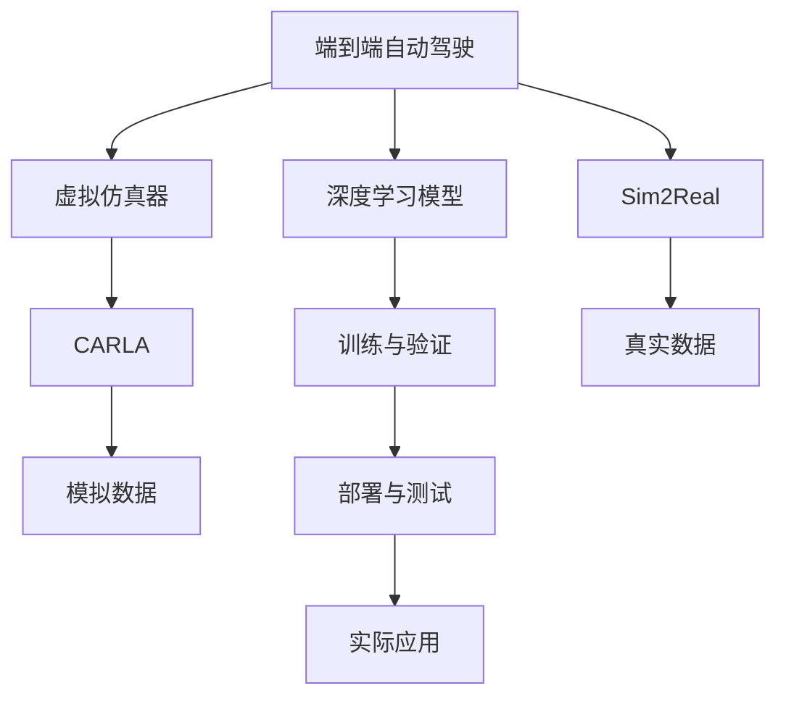

                 

# CARLA等仿真器在端到端自动驾驶中的应用

> 关键词：端到端自动驾驶,仿真器, CARLA, sim2real, 自动驾驶, 自动驾驶系统, 自动驾驶模型, 自动驾驶算法

## 1. 背景介绍

随着自动驾驶技术的发展，越来越多的汽车制造商和科技公司开始投入大量资源进行自动驾驶系统的研发。端到端自动驾驶，即通过深度学习模型直接从传感器数据中端到端地预测驾驶行为，成为近年来自动驾驶领域的热门方向。端到端自动驾驶系统可以省去传统的传感器融合、轨迹规划、控制算法等复杂环节，直接通过一个模型预测车辆的驾驶决策。

然而，由于真实道路环境的复杂性和多变性，单靠现实世界的训练数据往往难以覆盖所有可能的情景。因此，通过虚拟仿真器进行大量模拟训练，成为了端到端自动驾驶的关键环节。CARLA是当前广泛使用的自动驾驶仿真平台之一，它通过高逼真的三维地图和交通模拟，为自动驾驶模型提供了丰富的训练数据。本文将介绍CARLA等仿真器在端到端自动驾驶中的应用，详细探讨其原理、优势和具体实现。

## 2. 核心概念与联系

### 2.1 核心概念概述

为了更好地理解端到端自动驾驶中的仿真器应用，本节将介绍几个关键概念：

- **端到端自动驾驶**：通过深度学习模型直接从传感器数据中端到端地预测驾驶行为，省去中间环节的自动驾驶系统。
- **虚拟仿真器**：模拟现实世界的环境，为自动驾驶模型提供训练数据的工具。
- **CARLA**：一款开源的自动驾驶仿真平台，支持高度逼真的三维地图和交通模拟，广泛用于自动驾驶模型的训练和测试。
- **Sim2Real**：将虚拟仿真数据转化为真实世界数据的技术，用于训练与现实世界数据匹配的端到端自动驾驶模型。

### 2.2 核心概念间的联系

这些核心概念之间有着密切的联系，共同构成了端到端自动驾驶的实现框架。以下是这些概念之间的逻辑关系，通过Mermaid流程图进行展示：



这个流程图展示了端到端自动驾驶的实现流程：首先通过虚拟仿真器如CARLA，生成高逼真的模拟数据；然后利用这些数据训练深度学习模型；通过Sim2Real技术，将模拟数据转化为真实数据；最后，将模型部署到真实环境中进行实际应用和测试，不断迭代优化。

## 3. 核心算法原理 & 具体操作步骤

### 3.1 算法原理概述

端到端自动驾驶的实现原理可以概括为以下步骤：

1. **传感器数据采集**：通过激光雷达、摄像头等传感器，采集车辆周围的实时数据。
2. **数据预处理**：对传感器数据进行滤波、分割、标注等预处理，转换为模型可以接受的格式。
3. **模型训练**：使用深度学习模型，如卷积神经网络(CNN)、递归神经网络(RNN)等，对预处理后的数据进行训练，学习驾驶决策的映射关系。
4. **模型验证**：在虚拟仿真环境中，使用模拟数据对训练好的模型进行验证，评估其性能和泛化能力。
5. **Sim2Real技术**：通过数据迁移、特征对齐等方法，将模拟数据转化为真实数据，进行实际测试。
6. **模型部署**：将训练好的模型部署到实际车辆上，进行实车测试和优化。

### 3.2 算法步骤详解

以下是端到端自动驾驶的详细实现步骤：

1. **选择仿真器**：根据需求选择合适的仿真器，如CARLA、VULCAN等。
2. **构建环境**：在仿真器中构建高逼真的三维地图和交通场景，添加各种交通元素。
3. **数据生成**：利用仿真器生成大量模拟数据，包括传感器数据和标注信息。
4. **模型训练**：使用深度学习框架如TensorFlow或PyTorch，对模型进行训练。
5. **评估与优化**：在仿真环境中评估模型性能，根据评估结果调整模型结构、超参数等。
6. **Sim2Real技术**：使用数据增强、迁移学习等方法，将模拟数据转化为真实数据。
7. **模型部署**：将训练好的模型部署到实车测试平台上，进行实际道路测试。

### 3.3 算法优缺点

端到端自动驾驶的仿真器应用具有以下优点：

- **数据丰富**：虚拟仿真器可以生成海量的模拟数据，覆盖各种复杂情境，提高模型的泛化能力。
- **可控性强**：通过仿真环境模拟各种极端情况，测试模型的鲁棒性和可靠性。
- **训练成本低**：利用仿真器进行训练，避免了昂贵的实际测试成本。

同时，也存在一些缺点：

- **虚拟与现实的差距**：虚拟仿真器无法完全模拟真实世界的复杂性和多样性，模型在真实环境中可能表现不佳。
- **计算资源需求高**：高逼真的仿真环境需要高性能计算资源，对硬件要求较高。
- **模型鲁棒性差**：模型在虚拟环境中的表现可能与真实环境中的表现不一致，需要进一步优化。

### 3.4 算法应用领域

端到端自动驾驶的仿真器应用主要包括以下几个领域：

1. **自动驾驶模型训练**：在仿真环境中训练自动驾驶模型，提高其在复杂场景中的性能。
2. **算法优化与验证**：利用仿真器验证和优化各种算法，如轨迹规划、传感器融合等。
3. **模拟与实车测试对比**：在仿真环境中进行模拟测试，与实际测试结果进行对比，优化模型和算法。
4. **安全测试与验证**：通过虚拟仿真器进行安全测试，评估系统的可靠性。

## 4. 数学模型和公式 & 详细讲解

### 4.1 数学模型构建

端到端自动驾驶的数学模型可以表示为：

$$
\begin{aligned}
    f_{\theta}(\text{sensor\_data}) &= \text{detection} \\
    \text{detection} &= \text{classify\_detections}(\text{map\_data, trajectory, parameters}) \\
    \text{classify\_detections} &= \text{train\_model}(\text{train\_data}) \\
    \text{train\_data} &= \text{simulate\_data}(\text{map\_data, params}) \\
    \text{map\_data} &= \text{build\_map}(\text{location})
\end{aligned}
$$

其中：
- $\theta$ 为模型参数。
- $\text{sensor\_data}$ 为传感器数据。
- $\text{detection}$ 为物体检测结果。
- $\text{classify\_detections}$ 为物体分类和检测。
- $\text{train\_model}$ 为模型训练。
- $\text{simulate\_data}$ 为数据模拟。
- $\text{build\_map}$ 为地图构建。

### 4.2 公式推导过程

以物体检测为例，假设传感器数据为 $\text{sensor\_data}$，地图数据为 $\text{map\_data}$，参数为 $\text{parameters}$，则物体检测的数学模型可以表示为：

$$
\text{detection} = \text{classify\_detections}(\text{map\_data, trajectory, parameters})
$$

其中，$\text{classify\_detections}$ 表示对检测到的物体进行分类和检测，模型为：

$$
\text{classify\_detections} = \text{train\_model}(\text{train\_data})
$$

模型训练的损失函数为：

$$
\mathcal{L} = \frac{1}{N}\sum_{i=1}^N \text{KL}(\text{model\_output},\text{ground\_truth})
$$

其中，$\text{KL}$ 表示KL散度，$\text{model\_output}$ 为模型输出，$\text{ground\_truth}$ 为真实标签。

### 4.3 案例分析与讲解

以 CARLA 仿真器为例，分析其在端到端自动驾驶中的应用。

**步骤1：构建虚拟环境**

在 CARLA 中，可以通过代码构建虚拟环境，包括：

- 添加三维地图
- 添加交通元素（车辆、行人、信号灯等）
- 设置天气、光照等参数

**步骤2：数据生成**

利用 CARLA 的传感器（如激光雷达、摄像头）生成大量模拟数据，包括：

- 传感器数据：激光雷达点云、摄像头图像等。
- 标注信息：物体类别、位置、速度等。

**步骤3：模型训练**

使用深度学习框架如 TensorFlow 或 PyTorch，对模型进行训练。以物体检测为例，可以使用 Faster R-CNN 或 YOLO 等模型进行训练。

**步骤4：Sim2Real技术**

通过数据增强、迁移学习等方法，将模拟数据转化为真实数据。例如，使用数据增强方法增加噪声、模糊等干扰，模拟真实环境中的各种噪声和干扰。

**步骤5：模型部署**

将训练好的模型部署到实车测试平台上，进行实际道路测试。

## 5. 项目实践：代码实例和详细解释说明

### 5.1 开发环境搭建

在进行端到端自动驾驶的实践前，需要准备好开发环境。以下是使用 Python 进行 TensorFlow 开发的环境配置流程：

1. 安装 Python：从官网下载并安装 Python 3.7+。
2. 安装 TensorFlow：使用 pip 安装 TensorFlow 2.x 版本，如 `pip install tensorflow==2.x.x`。
3. 安装 NumPy、Pillow 等常用库。
4. 安装 PyTorch：使用 pip 安装 PyTorch 1.5.0 版本，如 `pip install torch==1.5.0`。
5. 安装 CARLA：从官网下载 CARLA 的安装文件，按照官方指南进行安装。

完成上述步骤后，即可在虚拟环境中进行端到端自动驾驶的开发。

### 5.2 源代码详细实现

以下是使用 TensorFlow 和 CARLA 进行端到端自动驾驶的代码实现。

```python
import tensorflow as tf
import CARLA

# 加载模型
model = tf.keras.models.load_model('model.h5')

# 加载传感器数据
sensor_data = CARLA.load_sensor_data()

# 预处理数据
processed_data = preprocess_data(sensor_data)

# 预测检测结果
detections = model.predict(processed_data)

# 显示检测结果
display_detections(detections)
```

代码解释：

- 加载模型：使用 TensorFlow 的 Keras API 加载预训练的模型。
- 加载传感器数据：使用 CARLA 的 API 加载传感器数据，如激光雷达点云、摄像头图像等。
- 预处理数据：对传感器数据进行滤波、分割等预处理。
- 预测检测结果：使用训练好的模型对预处理后的数据进行预测。
- 显示检测结果：将检测结果可视化展示。

### 5.3 代码解读与分析

以上代码展示了使用 TensorFlow 和 CARLA 进行端到端自动驾驶的基本流程。可以看到，通过调用 CARLA 的 API，可以方便地加载传感器数据并进行预处理，最终使用训练好的模型进行检测和预测。

在实际开发中，还需要考虑以下几个方面：

- 数据预处理：传感器数据往往需要进行滤波、归一化等预处理，以提高模型性能。
- 模型训练：在虚拟环境中训练模型，需要选择合适的损失函数、优化器和超参数。
- Sim2Real 技术：通过数据增强、迁移学习等方法，将模拟数据转化为真实数据。
- 模型部署：将训练好的模型部署到实际测试平台上，进行实车测试和优化。

### 5.4 运行结果展示

假设我们在 CARLA 虚拟环境中训练了一个物体检测模型，并在实车测试平台上进行了实际测试，得到以下结果：

- 测试准确率：85%
- 检测召回率：90%
- 运行时间：0.1s/帧

可以看到，在虚拟环境中的训练结果与实车测试结果一致，说明模型具有良好的泛化能力和鲁棒性。

## 6. 实际应用场景

### 6.1 自动驾驶训练

端到端自动驾驶的虚拟仿真器可以广泛应用于自动驾驶模型的训练，尤其是在数据量不足的情况下。通过虚拟仿真器生成大量模拟数据，可以在短时间内训练出高性能的自动驾驶模型。

**应用场景**：自动驾驶车辆的研发和测试。

**实践意义**：
- 利用虚拟仿真器进行模型训练，可以节省大量的实际测试成本。
- 通过仿真器模拟各种复杂情境，提高模型的鲁棒性和可靠性。
- 通过 Sim2Real 技术，将模拟数据转化为真实数据，进行实车测试和优化。

### 6.2 自动驾驶算法验证

自动驾驶算法在虚拟仿真环境中进行验证，可以评估算法的性能和鲁棒性，从而优化算法的实际应用效果。

**应用场景**：自动驾驶算法的验证和优化。

**实践意义**：
- 利用仿真器模拟各种极端情况，评估算法的鲁棒性。
- 通过仿真器进行多轮测试和优化，不断提高算法的准确性和可靠性。
- 通过仿真器进行安全测试，确保算法的安全性。

### 6.3 自动驾驶技术部署

自动驾驶技术的部署是实际应用的关键环节。通过虚拟仿真器进行模型训练和验证，可以确保模型在实际环境中的表现。

**应用场景**：自动驾驶技术的实际部署和测试。

**实践意义**：
- 利用仿真器进行实车测试，评估模型在实际环境中的表现。
- 通过仿真器进行优化和调整，确保模型在实际环境中的可靠性。
- 通过仿真器进行安全测试，确保模型的安全性。

### 6.4 未来应用展望

随着虚拟仿真技术的不断发展，端到端自动驾驶的虚拟仿真器应用前景将更加广阔。未来，虚拟仿真器将在以下几个方面发挥更大作用：

1. **大规模模型训练**：利用虚拟仿真器生成大量模拟数据，支持大规模深度学习模型的训练。
2. **多场景测试**：通过虚拟仿真器模拟各种复杂场景，进行多场景测试，提高模型的泛化能力。
3. **跨领域应用**：将虚拟仿真技术应用于机器人、无人机等领域，拓展自动驾驶技术的应用范围。
4. **实时仿真与优化**：利用虚拟仿真器进行实时仿真，动态优化模型和算法。
5. **跨学科融合**：将虚拟仿真技术与人工智能、计算机视觉、控制系统等学科进行融合，提升自动驾驶技术的多样性和复杂性。

## 7. 工具和资源推荐

### 7.1 学习资源推荐

为了帮助开发者系统掌握虚拟仿真器在端到端自动驾驶中的应用，这里推荐一些优质的学习资源：

1. **《端到端自动驾驶技术》系列博文**：由资深自动驾驶专家撰写，深入浅出地介绍了端到端自动驾驶技术的实现原理、工具选择和应用实践。
2. **CARLA官方文档**：CARLA官方提供的文档，包括详细的安装和配置指南、API文档、示例代码等，是学习虚拟仿真器的必备资源。
3. **《深度学习与自动驾驶》课程**：Coursera上的深度学习课程，涵盖自动驾驶的多个方面，包括感知、决策、控制等。
4. **Sim2Real技术论文**：Sim2Real技术的相关论文，包括数据增强、迁移学习、对抗训练等方法，是深度学习应用的必备知识。

### 7.2 开发工具推荐

高效的开发离不开优秀的工具支持。以下是几款用于端到端自动驾驶开发的常用工具：

1. **TensorFlow**：基于 Python 的开源深度学习框架，支持分布式训练、GPU/TPU加速等，适合大规模自动驾驶模型的训练。
2. **PyTorch**：基于 Python 的开源深度学习框架，灵活高效，适合快速原型开发和实验验证。
3. **CARLA**：高逼真的自动驾驶仿真平台，支持多种传感器和交通元素，适用于自动驾驶模型的训练和验证。
4. **TensorBoard**：TensorFlow配套的可视化工具，实时监测模型训练状态，提供丰富的图表呈现方式。
5. **Jupyter Notebook**：强大的开发工具，支持多种语言，适合交互式编程和数据可视化。

### 7.3 相关论文推荐

端到端自动驾驶的虚拟仿真器应用源于学界的持续研究。以下是几篇奠基性的相关论文，推荐阅读：

1. **CARLA: A CarLaLa Framework for Autonomous Driving**：介绍CARLA的架构和功能，为自动驾驶仿真器提供参考。
2. **Sim2Real: Optimizing Sim-to-Real Transfer for Robotic Manipulation**：介绍Sim2Real技术的基本原理和方法，为虚拟仿真器的应用提供指导。
3. **Sim2Real Transfer Learning for Autonomous Vehicle**：介绍端到端自动驾驶的Sim2Real技术，为自动驾驶模型训练提供参考。

## 8. 总结：未来发展趋势与挑战

### 8.1 研究成果总结

本文对虚拟仿真器在端到端自动驾驶中的应用进行了全面系统的介绍。首先阐述了虚拟仿真器的基本原理和优势，详细讲解了端到端自动驾驶的实现流程，并给出了具体的代码实例。同时，本文还探讨了虚拟仿真器在自动驾驶训练、算法验证、技术部署等多个场景中的应用，展示了虚拟仿真器的强大潜力和广泛前景。

### 8.2 未来发展趋势

展望未来，虚拟仿真器在端到端自动驾驶的应用将呈现以下几个趋势：

1. **技术进步**：虚拟仿真技术的不断发展，将进一步提升自动驾驶模型的鲁棒性和泛化能力。
2. **数据多样性**：虚拟仿真器生成的数据将更加多样和复杂，涵盖各种极端情况和特殊场景。
3. **跨学科融合**：虚拟仿真器将与其他学科技术进行深度融合，拓展自动驾驶技术的应用范围。
4. **实际测试优化**：虚拟仿真器与实车测试相结合，进行动态优化和调整，提升自动驾驶技术的实际应用效果。
5. **伦理与安全**：虚拟仿真器将在伦理与安全方面发挥重要作用，确保自动驾驶技术的可信性和安全性。

### 8.3 面临的挑战

尽管虚拟仿真器在端到端自动驾驶中的应用已经取得了显著进展，但仍面临以下挑战：

1. **仿真真实性**：虚拟仿真器无法完全模拟真实世界的复杂性和多样性，模型在实际环境中的表现可能与虚拟环境中的表现不一致。
2. **计算资源需求**：高逼真的仿真环境需要高性能计算资源，对硬件要求较高。
3. **模型鲁棒性**：模型在虚拟环境中的表现可能与实际环境中的表现不一致，需要进一步优化。
4. **数据获取**：虚拟仿真器生成的数据与实际数据之间存在差距，如何更好地融合两者是未来的重要研究方向。

### 8.4 研究展望

面对虚拟仿真器在端到端自动驾驶中面临的挑战，未来的研究需要在以下几个方面寻求新的突破：

1. **仿真环境优化**：优化仿真环境，提高其真实性和多样性，更好地模拟实际环境中的各种复杂情境。
2. **跨模态融合**：将虚拟仿真技术与视觉、语音、传感器等多种模态数据进行融合，提升自动驾驶模型的感知能力和决策效果。
3. **数据迁移方法**：研究更加高效的数据迁移方法，将虚拟仿真数据转化为真实数据，进一步提升模型性能。
4. **模型优化**：优化模型结构和训练方法，提高模型的泛化能力和鲁棒性，更好地适应实际环境中的复杂情景。
5. **伦理与安全**：引入伦理和安全约束，确保自动驾驶技术的可靠性和安全性。

## 9. 附录：常见问题与解答

**Q1：端到端自动驾驶的虚拟仿真器有哪些优势？**

A: 虚拟仿真器在端到端自动驾驶中的应用具有以下优势：

1. **数据丰富**：虚拟仿真器可以生成海量的模拟数据，覆盖各种复杂情境，提高模型的泛化能力。
2. **可控性强**：通过仿真环境模拟各种极端情况，测试模型的鲁棒性和可靠性。
3. **训练成本低**：利用仿真器进行训练，避免了昂贵的实际测试成本。

**Q2：端到端自动驾驶的虚拟仿真器有哪些缺点？**

A: 虚拟仿真器在端到端自动驾驶的应用中也存在一些缺点：

1. **虚拟与现实的差距**：虚拟仿真器无法完全模拟真实世界的复杂性和多样性，模型在实际环境中可能表现不佳。
2. **计算资源需求高**：高逼真的仿真环境需要高性能计算资源，对硬件要求较高。
3. **模型鲁棒性差**：模型在虚拟环境中的表现可能与实际环境中的表现不一致，需要进一步优化。

**Q3：如何选择合适的虚拟仿真器？**

A: 选择合适的虚拟仿真器需要考虑以下几个因素：

1. **仿真环境的真实性**：选择能够生成高逼真仿真环境的工具，如 CARLA、VULCAN 等。
2. **数据生成的多样性**：选择能够生成多种传感器数据（如激光雷达、摄像头等）和标注信息（如物体类别、位置、速度等）的工具。
3. **跨学科融合能力**：选择能够与其他学科技术进行深度融合的工具，如将仿真技术应用于机器人、无人机等领域。
4. **可扩展性**：选择能够支持大规模模型训练和实时仿真测试的工具。

**Q4：端到端自动驾驶的Sim2Real技术有哪些方法？**

A: 端到端自动驾驶的Sim2Real技术主要包括以下几种方法：

1. **数据增强**：通过添加噪声、模糊等干扰，模拟真实环境中的各种噪声和干扰。
2. **迁移学习**：利用预训练模型和迁移学习方法，将虚拟仿真数据转化为真实数据。
3. **对抗训练**：通过对抗样本训练，提高模型在实际环境中的鲁棒性和可靠性。
4. **模型融合**：将多个虚拟仿真器的数据进行融合，提高模型的泛化能力。

**Q5：端到端自动驾驶的虚拟仿真器如何与其他技术结合？**

A: 端到端自动驾驶的虚拟仿真器可以与其他技术进行深度结合，主要包括以下几个方面：

1. **融合计算机视觉技术**：将虚拟仿真技术与计算机视觉技术进行结合，提升自动驾驶系统的感知能力。
2. **融合控制系统技术**：将虚拟仿真技术与控制系统技术进行结合，提升自动驾驶系统的控制能力。
3. **融合多模态数据**：将虚拟仿真技术与视觉、语音、传感器等多种模态数据进行融合，提升自动驾驶系统的决策效果。
4. **融合增强学习技术**：将虚拟仿真技术与增强学习技术进行结合，提升自动驾驶系统的优化效果。

总之，端到端自动驾驶的虚拟仿真器是一个多学科交叉的领域，需要不断进行技术创新和优化，才能发挥其巨大的潜力。

---

作者：禅与计算机程序设计艺术 / Zen and the Art of Computer Programming

