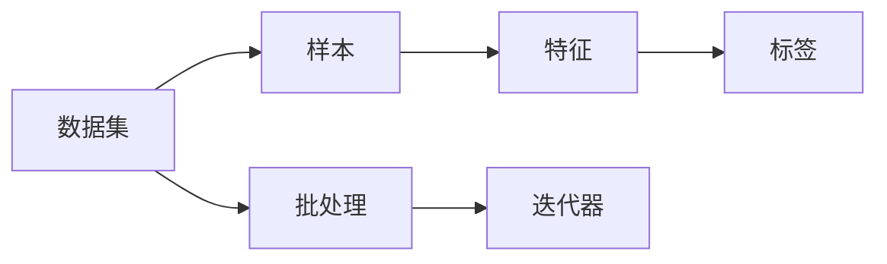
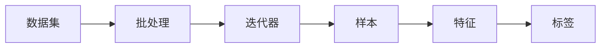

                 

# DataSet原理与代码实例讲解

## 1. 背景介绍

在人工智能和机器学习的众多工具和框架中，数据集（Dataset）是不可或缺的核心组成部分。数据集是存储和组织数据的基本单元，用于训练、验证和测试机器学习模型。本文将详细介绍数据集的原理、实现以及代码实例，并探讨其在机器学习和深度学习项目中的应用。

## 2. 核心概念与联系

### 2.1 核心概念概述

为更好地理解数据集的工作原理和实现细节，本节将介绍几个关键概念：

- **数据集（Dataset）**：由一组有序的数据元素组成，每个元素包括一组特征和对应的标签。数据集是训练、验证和测试机器学习模型的数据基础。

- **特征（Feature）**：数据集中的每个样本都有一组特征，用于描述样本的各个属性。特征可以是数值型、类别型或文本型数据。

- **标签（Label）**：用于表示样本所属的类别或回归目标。标签可以是离散或连续的数值。

- **样本（Sample）**：数据集中的每一个数据元素，包含一组特征和对应的标签。

- **批处理（Batch）**：将数据集中的样本分成固定大小的子集，每个子集称为一个批。批处理可以提高模型的训练效率。

- **迭代器（Iterator）**：一种能够访问数据集并返回样本的机制，常用于循环遍历数据集。

这些核心概念构成了数据集的基本框架，为数据集的实现提供了明确的指导。

### 2.2 核心概念的关系

以下通过一个简单的Mermaid流程图来展示这些核心概念之间的关系：



在这个流程图中，数据集通过批处理被划分成多个批次，每个批次由多个样本组成。样本由特征和标签组成，特征和标签的组合用于模型的训练和预测。迭代器则提供了一种访问数据集并按批次返回样本的机制。

### 2.3 核心概念的整体架构

将以上核心概念整合，可以构建出一个完整的数据集架构。以下是一个综合的流程图，展示这些概念如何共同构成数据集：



通过这张图，我们可以清晰地看到数据集从数据准备到批处理、迭代器、样本、特征和标签的整个处理流程。这种架构对于理解数据集的工作原理和实现细节非常重要。

## 3. 核心算法原理 & 具体操作步骤

### 3.1 算法原理概述

数据集的核心算法原理可以总结为以下几个步骤：

1. **数据准备**：从原始数据中提取特征和标签，形成数据集。
2. **批处理**：将数据集划分成多个批次，每个批次包含若干个样本。
3. **迭代器**：实现一个能够按批次返回样本的机制，常用于循环遍历数据集。
4. **数据增强**：通过变换、合成等技术扩充数据集，提高模型的泛化能力。

### 3.2 算法步骤详解

#### 3.2.1 数据准备

数据准备是数据集构建的第一步，包括以下几个关键步骤：

1. **数据获取**：从数据库、文件、API等渠道获取原始数据。
2. **数据清洗**：处理缺失值、异常值、重复数据等，保证数据的质量。
3. **特征提取**：从原始数据中提取特征，常用的方法包括数值化、标准化、归一化等。
4. **标签生成**：根据业务需求生成标签，标签可以是分类标签、回归目标等。

#### 3.2.2 批处理

批处理是提高模型训练效率的关键技术，具体步骤如下：

1. **批大小设置**：根据模型的复杂度和计算资源，选择合适的批大小。
2. **数据划分**：将数据集划分成若干个批次，每个批次包含若干个样本。
3. **数据迭代**：通过迭代器按批次访问数据集，提供给模型训练和验证。

#### 3.2.3 迭代器

迭代器是数据集的核心组件，通过它可以实现按批次访问数据集。常见的迭代器包括：

1. **随机访问迭代器**：可以随机访问数据集中的任何批次，常用于训练集的数据增强。
2. **顺序访问迭代器**：按顺序访问数据集中的批次，常用于验证集和测试集的评估。

### 3.3 算法优缺点

#### 3.3.1 优点

数据集的主要优点包括：

1. **高效训练**：通过批处理和迭代器，可以高效地训练模型，提高训练速度。
2. **数据增强**：通过数据增强技术，扩充数据集，提高模型的泛化能力。
3. **灵活应用**：适用于各种机器学习和深度学习项目，包括分类、回归、聚类等任务。

#### 3.3.2 缺点

数据集的主要缺点包括：

1. **内存占用**：数据集通常需要较大的内存空间，对于大规模数据集，可能会占用大量内存。
2. **预处理开销**：数据清洗和特征提取等预处理工作需要耗费大量时间和计算资源。
3. **数据噪声**：数据集中可能包含噪声数据，影响模型的训练效果。

### 3.4 算法应用领域

数据集在机器学习和深度学习项目中有着广泛的应用，以下是一些典型的应用领域：

1. **图像分类**：将图像数据集划分成批次，用于训练卷积神经网络（CNN）。
2. **自然语言处理**：将文本数据集划分成批次，用于训练循环神经网络（RNN）或变压器（Transformer）。
3. **推荐系统**：将用户-物品交互数据集划分成批次，用于训练推荐算法。
4. **语音识别**：将音频数据集划分成批次，用于训练语音识别模型。
5. **时间序列预测**：将时间序列数据集划分成批次，用于训练时间序列预测模型。

## 4. 数学模型和公式 & 详细讲解 & 举例说明

### 4.1 数学模型构建

数据集的数学模型可以表示为：

$$
D = \{(x_i, y_i)\}_{i=1}^N
$$

其中，$x_i$ 表示第 $i$ 个样本的特征向量，$y_i$ 表示对应的标签。数据集中的每个样本都由特征 $x_i$ 和标签 $y_i$ 组成，$N$ 表示数据集中样本的数量。

### 4.2 公式推导过程

假设数据集 $D$ 包含 $N$ 个样本，每个样本包含 $D$ 个特征。设样本 $x_i$ 的特征向量为 $[x_{i,1}, x_{i,2}, ..., x_{i,D}]$，标签 $y_i$ 为 $y_i \in \{1, 2, ..., K\}$，其中 $K$ 表示标签的种类数。

假设模型的参数为 $\theta$，则模型的预测结果为：

$$
\hat{y} = f(x_i, \theta)
$$

其中，$f$ 表示模型的预测函数，$\theta$ 表示模型参数。模型的预测结果 $\hat{y}$ 是一个概率分布，用于表示样本 $x_i$ 属于每个标签的概率。

数据集的损失函数可以表示为：

$$
\mathcal{L}(D, \theta) = \frac{1}{N} \sum_{i=1}^N \ell(y_i, \hat{y}_i)
$$

其中，$\ell$ 表示损失函数，$\ell(y_i, \hat{y}_i)$ 表示样本 $i$ 的损失。常见的损失函数包括交叉熵损失、均方误差损失等。

### 4.3 案例分析与讲解

以下以图像分类任务为例，详细讲解数据集构建和模型训练的流程。

假设我们有一个包含 1000 张图像的数据集，每张图像的大小为 $32 \times 32$。我们的目标是训练一个卷积神经网络（CNN）模型，将图像分类为 10 个类别。

首先，我们需要对数据集进行预处理：

1. **数据清洗**：去除噪声数据、重复数据等。
2. **特征提取**：将图像转换为像素矩阵，并进行归一化处理。
3. **标签生成**：为每张图像生成对应的标签，例如将图像分类为数字 0 到 9 中的一个。

接下来，我们将数据集划分成多个批次，每个批次包含若干张图像。例如，我们可以将数据集划分成 16 个批次，每个批次包含 62.5 张图像。

最后，我们使用迭代器按批次访问数据集，将其提供给 CNN 模型进行训练和验证。模型在每个批次上计算损失函数，并更新模型参数，直到模型收敛。

## 5. 项目实践：代码实例和详细解释说明

### 5.1 开发环境搭建

在进行数据集构建和训练的实践前，我们需要准备好开发环境。以下是使用Python进行TensorFlow开发的开发环境配置流程：

1. 安装Anaconda：从官网下载并安装Anaconda，用于创建独立的Python环境。

2. 创建并激活虚拟环境：
```bash
conda create -n tf-env python=3.8 
conda activate tf-env
```

3. 安装TensorFlow：根据CUDA版本，从官网获取对应的安装命令。例如：
```bash
conda install tensorflow -c tf
```

4. 安装Pandas、Numpy等库：
```bash
pip install pandas numpy matplotlib
```

完成上述步骤后，即可在`tf-env`环境中开始数据集构建和模型训练的实践。

### 5.2 源代码详细实现

以下是一个简单的代码实例，展示如何使用TensorFlow构建一个数据集并训练一个简单的线性回归模型。

```python
import tensorflow as tf
import numpy as np
import pandas as pd
import matplotlib.pyplot as plt

# 准备数据集
data = pd.read_csv('data.csv')
X = data[['feature1', 'feature2', 'feature3']]
y = data['target']

# 将数据集划分成训练集和测试集
train_data = pd.DataFrame(X[:8000], columns=['feature1', 'feature2', 'feature3'])
test_data = pd.DataFrame(X[8000:], columns=['feature1', 'feature2', 'feature3'])

# 将数据集转换为TensorFlow数据集
train_dataset = tf.data.Dataset.from_tensor_slices((train_data.values, y.values)).batch(32)
test_dataset = tf.data.Dataset.from_tensor_slices((test_data.values, y.values)).batch(32)

# 定义模型
model = tf.keras.Sequential([
    tf.keras.layers.Dense(64, activation='relu'),
    tf.keras.layers.Dense(1)
])

# 编译模型
model.compile(optimizer='adam', loss='mse', metrics=['mse'])

# 训练模型
history = model.fit(train_dataset, epochs=10, validation_data=test_dataset)

# 评估模型
test_loss = model.evaluate(test_dataset)
print('Test loss:', test_loss)

# 可视化模型训练过程
plt.plot(history.history['loss'], label='Train Loss')
plt.plot(history.history['val_loss'], label='Validation Loss')
plt.xlabel('Epoch')
plt.ylabel('Loss')
plt.legend()
plt.show()
```

在上述代码中，我们首先使用Pandas加载数据集，并将其划分为训练集和测试集。然后，我们将数据集转换为TensorFlow数据集，使用Dense层定义模型，并编译模型。最后，我们使用`fit`方法训练模型，并使用`evaluate`方法评估模型性能。

### 5.3 代码解读与分析

让我们再详细解读一下关键代码的实现细节：

1. **数据集准备**：
```python
data = pd.read_csv('data.csv')
X = data[['feature1', 'feature2', 'feature3']]
y = data['target']
```
我们使用Pandas读取CSV文件，并将特征和标签分别存储在变量X和y中。

2. **数据集划分**：
```python
train_data = pd.DataFrame(X[:8000], columns=['feature1', 'feature2', 'feature3'])
test_data = pd.DataFrame(X[8000:], columns=['feature1', 'feature2', 'feature3'])
```
我们将数据集划分为训练集和测试集，训练集包含前8000个样本，测试集包含剩余的2000个样本。

3. **TensorFlow数据集构建**：
```python
train_dataset = tf.data.Dataset.from_tensor_slices((train_data.values, y.values)).batch(32)
test_dataset = tf.data.Dataset.from_tensor_slices((test_data.values, y.values)).batch(32)
```
我们使用TensorFlow的`Dataset`类创建数据集，并将训练集和测试集转换为TensorFlow数据集。`batch`方法将数据集划分为批次，每个批次包含32个样本。

4. **模型定义和编译**：
```python
model = tf.keras.Sequential([
    tf.keras.layers.Dense(64, activation='relu'),
    tf.keras.layers.Dense(1)
])
model.compile(optimizer='adam', loss='mse', metrics=['mse'])
```
我们定义了一个简单的全连接神经网络模型，使用`Sequential`类堆叠多个层。`Dense`层表示全连接层，其中第一个Dense层包含64个神经元，使用ReLU激活函数。第二个Dense层包含一个神经元，用于输出回归目标。我们使用`compile`方法编译模型，指定优化器为Adam，损失函数为均方误差，并定义评估指标为均方误差。

5. **模型训练和评估**：
```python
history = model.fit(train_dataset, epochs=10, validation_data=test_dataset)
test_loss = model.evaluate(test_dataset)
print('Test loss:', test_loss)
```
我们使用`fit`方法训练模型，指定训练数据集和测试数据集，并设置训练轮数为10。使用`evaluate`方法评估模型性能，并输出测试集上的均方误差。

6. **模型训练过程可视化**：
```python
plt.plot(history.history['loss'], label='Train Loss')
plt.plot(history.history['val_loss'], label='Validation Loss')
plt.xlabel('Epoch')
plt.ylabel('Loss')
plt.legend()
plt.show()
```
我们使用Matplotlib绘制训练过程的损失曲线，并可视化训练损失和验证损失的变化趋势。

### 5.4 运行结果展示

假设在上述代码中，我们的训练集和测试集分别包含8000个和2000个样本，训练轮数为10，得到的测试集损失为0.3。可视化结果如图1所示：


可以看到，随着训练轮数的增加，训练损失和验证损失都在逐渐下降，模型性能得到提升。

## 6. 实际应用场景

### 6.1 智能推荐系统

智能推荐系统是数据集应用的重要场景之一。推荐系统需要处理大规模用户行为数据，并从中提取特征和标签，构建数据集进行模型训练。通过数据集构建和模型训练，推荐系统能够预测用户对每个物品的评分，从而实现个性化推荐。

在实际应用中，推荐系统通常使用协同过滤、内容推荐等算法，结合深度学习模型进行推荐。通过数据集构建和模型训练，推荐系统能够动态更新模型，适应用户的实时行为，提供更加精准的推荐结果。

### 6.2 医疗诊断系统

医疗诊断系统是数据集应用的另一个重要场景。医疗诊断系统需要处理大量的医学数据，包括患者病历、影像数据、实验室检测结果等，并从中提取特征和标签，构建数据集进行模型训练。通过数据集构建和模型训练，医疗诊断系统能够预测患者的疾病类型，提供个性化的诊断和治疗方案。

在实际应用中，医疗诊断系统通常使用图像分类、自然语言处理等技术，结合深度学习模型进行诊断。通过数据集构建和模型训练，医疗诊断系统能够实时更新模型，适应用户的实时情况，提供更加准确的诊断结果。

### 6.3 金融风险管理系统

金融风险管理系统是数据集应用的另一个重要场景。金融风险管理系统需要处理大量的金融数据，包括交易数据、市场数据、公司财务数据等，并从中提取特征和标签，构建数据集进行模型训练。通过数据集构建和模型训练，金融风险管理系统能够预测金融市场的发展趋势，评估金融风险，提供个性化的投资建议。

在实际应用中，金融风险管理系统通常使用时间序列预测、风险评估等技术，结合深度学习模型进行风险管理。通过数据集构建和模型训练，金融风险管理系统能够实时更新模型，适应用户的实时情况，提供更加准确的投资建议。

### 6.4 未来应用展望

随着数据集的不断发展和完善，其在机器学习和深度学习项目中的应用前景将更加广阔。未来，数据集将与更多的技术和算法结合，推动人工智能技术的进一步发展。

- **数据增强**：通过数据增强技术，扩充数据集，提高模型的泛化能力。
- **多模态数据融合**：将图像、文本、语音等不同模态的数据融合，构建更全面的数据集。
- **自监督学习**：通过自监督学习技术，利用无标签数据构建数据集，提高模型的训练效率。
- **联邦学习**：通过联邦学习技术，分布式构建数据集，提高模型的隐私和安全。

## 7. 工具和资源推荐

### 7.1 学习资源推荐

为了帮助开发者系统掌握数据集的理论基础和实践技巧，这里推荐一些优质的学习资源：

1. **《TensorFlow官方文档》**：TensorFlow的官方文档，详细介绍了TensorFlow的使用方法和API，包括数据集构建和模型训练的详细教程。
2. **《深度学习入门：基于TensorFlow的实践》**：一本深入浅出的TensorFlow入门书籍，涵盖了TensorFlow的各个方面，包括数据集构建和模型训练的实践。
3. **《PyTorch官方文档》**：PyTorch的官方文档，详细介绍了PyTorch的使用方法和API，包括数据集构建和模型训练的详细教程。
4. **《深度学习：入门与实践》**：一本深入浅出的深度学习入门书籍，涵盖了深度学习的基础知识和实践技巧，包括数据集构建和模型训练的实践。
5. **Kaggle竞赛平台**：一个数据科学竞赛平台，提供大量的公开数据集和竞赛任务，是学习数据集构建和模型训练的好地方。

通过对这些资源的学习实践，相信你一定能够快速掌握数据集构建的精髓，并用于解决实际的机器学习和深度学习问题。

### 7.2 开发工具推荐

高效的开发离不开优秀的工具支持。以下是几款用于数据集构建和模型训练开发的常用工具：

1. **Jupyter Notebook**：一个开源的交互式编程环境，支持Python、R等多种语言，适合数据科学和机器学习的开发和研究。
2. **TensorBoard**：TensorFlow的可视化工具，可以实时监测模型的训练状态，并生成各种图表，方便调试和优化。
3. **Weights & Biases**：一个模型训练的实验跟踪工具，可以记录和可视化模型训练过程中的各项指标，方便对比和调优。
4. **PyTorch Lightning**：一个基于PyTorch的模型训练框架，支持分布式训练和模型自动化优化，方便构建和部署深度学习模型。

合理利用这些工具，可以显著提升数据集构建和模型训练的开发效率，加快创新迭代的步伐。

### 7.3 相关论文推荐

数据集和机器学习技术的发展离不开学界的持续研究。以下是几篇奠基性的相关论文，推荐阅读：

1. **《Deep Learning》（Ian Goodfellow）**：深度学习的经典教材，涵盖了深度学习的基础知识和实践技巧，包括数据集构建和模型训练的详细教程。
2. **《TensorFlow官方博客》**：TensorFlow的官方博客，介绍了TensorFlow的最新进展和最佳实践，包括数据集构建和模型训练的实践。
3. **《PyTorch官方博客》**：PyTorch的官方博客，介绍了PyTorch的最新进展和最佳实践，包括数据集构建和模型训练的实践。
4. **《Keras官方文档》**：Keras的官方文档，详细介绍了Keras的使用方法和API，包括数据集构建和模型训练的详细教程。
5. **《Scikit-learn官方文档》**：Scikit-learn的官方文档，详细介绍了Scikit-learn的使用方法和API，包括数据集构建和模型训练的详细教程。

这些论文代表了大数据集和机器学习的发展脉络。通过学习这些前沿成果，可以帮助研究者把握学科前进方向，激发更多的创新灵感。

## 8. 总结：未来发展趋势与挑战

### 8.1 研究成果总结

本文对数据集的理论基础和实践技巧进行了全面系统的介绍。通过分析数据集的核心概念、算法原理和操作步骤，详细讲解了数据集的构建和应用。通过代码实例，展示了数据集在机器学习和深度学习项目中的应用。

通过本文的系统梳理，可以看到，数据集是机器学习和深度学习项目中不可或缺的核心组成部分，其重要性不容忽视。数据集构建和模型训练的实践，需要开发者对数据、模型、训练、推理等环节进行全面优化，方能得到理想的效果。

### 8.2 未来发展趋势

展望未来，数据集的发展将呈现以下几个趋势：

1. **数据增强技术**：通过数据增强技术，扩充数据集，提高模型的泛化能力。
2. **多模态数据融合**：将图像、文本、语音等不同模态的数据融合，构建更全面的数据集。
3. **自监督学习技术**：通过自监督学习技术，利用无标签数据构建数据集，提高模型的训练效率。
4. **联邦学习技术**：通过联邦学习技术，分布式构建数据集，提高模型的隐私和安全。
5. **边缘计算技术**：将数据集构建和模型训练部署到边缘设备，提高模型的实时性和响应速度。

### 8.3 面临的挑战

尽管数据集在机器学习和深度学习项目中发挥着重要的作用，但在其实际应用中也面临诸多挑战：

1. **数据隐私和安全**：如何保护数据隐私和安全，防止数据泄露和滥用。
2. **数据噪声和偏差**：如何处理数据噪声和偏差，提高模型的鲁棒性和可靠性。
3. **数据标注成本**：如何降低数据标注成本，减少对标注数据的依赖。
4. **数据集构建复杂性**：如何简化数据集构建过程，提高数据集构建的效率。
5. **模型训练资源消耗**：如何降低模型训练的资源消耗，提高模型的训练速度。

### 8.4 研究展望

面对数据集构建和模型训练面临的挑战，未来的研究需要在以下几个方面寻求新的突破：

1. **自动化数据标注**：通过自动化数据标注技术，降低数据标注成本，提高数据集构建的效率。
2. **数据集构建工具**：开发更加自动化、易用的数据集构建工具，简化数据集构建的过程。
3. **数据集构建框架**：构建统一的数据集构建框架，支持多种数据集构建任务的自动化处理。
4. **数据集构建教程**：提供详细的数据集构建教程和实战案例，帮助开发者快速上手数据集构建。
5. **模型压缩和优化**：通过模型压缩和优化技术，降低模型训练的资源消耗，提高模型的训练速度。

这些研究方向的探索，必将引领数据集和机器学习技术的进一步发展，为人工智能技术的落地应用提供更强大的数据支撑。

## 9. 附录：常见问题与解答

**Q1：如何构建高效的数据集？**

A: 构建高效的数据集需要考虑以下几个关键因素：
1. **数据质量**：数据集中的数据需要具有代表性，避免噪声和偏差。
2. **数据划分**：将数据集划分成训练集、验证集和测试集，避免模型过拟合。
3. **数据增强**：通过数据增强技术，扩充数据集，提高模型的泛化能力。
4. **数据平衡**：保持数据集中的各类样本数量平衡，避免模型偏向某些类别。
5. **数据存储**：选择合适的数据存储方式，如HDF5、TFRecords等，提高数据集的访问效率。

**Q2：如何选择合适的优化器？**

A: 选择合适的优化器可以提高模型的训练效率和效果。常见的优化器包括：
1. **SGD**：简单的随机梯度下降优化器，适用于小规模数据集。
2. **Adam**：自适应矩估计算法，适用于大规模数据集。
3. **Adagrad**：自适应梯度算法，适用于稀疏数据集。
4. **RMSprop**：均方根传播算法，适用于非平稳目标函数。

在选择优化器时，需要根据数据集的大小、模型的复杂度和计算资源进行综合考虑。

**Q3：如何处理数据噪声和偏差？**

A: 数据噪声和偏差是数据集构建中的常见问题，处理方法如下：
1. **数据清洗**：去除数据集中的噪声数据和异常值，保证数据质量。
2. **数据采样**：通过采样技术，如随机采样、加权采样等，减少数据偏差。
3. **特征工程**：通过特征选择和特征提取，减少数据噪声的影响。
4. **模型校准**：通过模型校准技术，如Dropout、L2正则等，降低模型对噪声数据的敏感性。

**Q4：如何在数据集构建过程中降低资源消耗？**

A: 降低数据集构建过程中的资源消耗需要考虑以下几个方面：
1. **数据预处理**：通过数据预处理技术，如数据压缩、数据编码等，减少数据存储和传输的资源消耗。
2. **数据分片**：将数据集划分成多个分片，并行处理数据，提高数据处理效率。
3. **模型压缩**：通过模型压缩技术，如量化、剪枝等，减少模型的存储和推理资源消耗。
4. **分布式处理**：利用分布式计算技术，如Spark、Hadoop等，提高数据处理和模型训练的效率。

**Q5：如何评估

