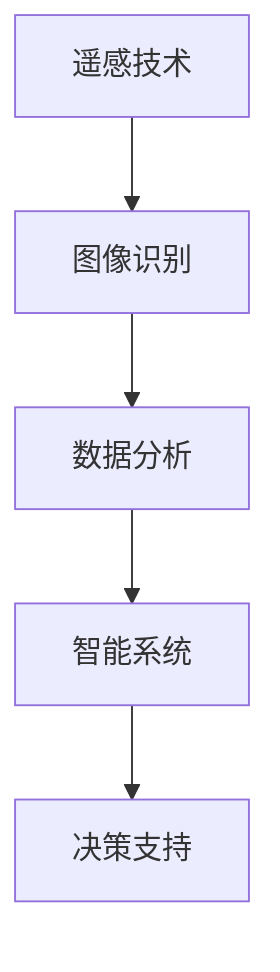
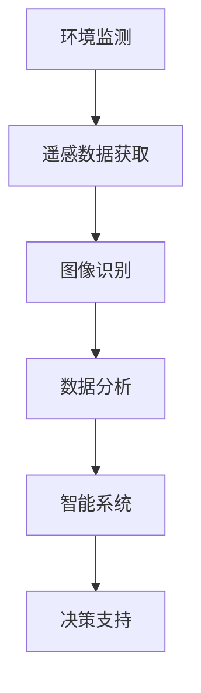
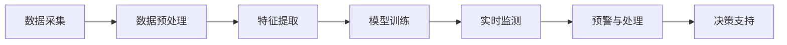
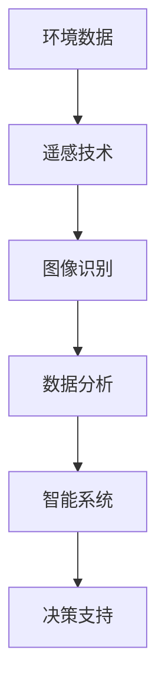

                 

# 一切皆是映射：AI在环境监测与保护中的应用

> 关键词：AI, 环境监测, 环境保护, 遥感技术, 数据分析, 图像识别, 智能系统, 决策支持

## 1. 背景介绍

### 1.1 问题由来

随着全球气候变化、生态退化等环境问题的日益严峻，如何及时、准确地监测和保护生态环境成为各国政府、科研机构和企业关注的焦点。传统的实地监测方法虽然直观、准确，但往往耗时、耗力、成本高，难以大规模实施。而基于AI的环境监测与保护，凭借其高效、精准、低成本的优势，逐渐成为解决方案的重要组成部分。

近年来，AI技术在图像识别、数据分析、智能系统构建等方面取得了巨大突破，为环境监测与保护提供了新的思路和技术手段。AI可以结合遥感技术，利用卫星、无人机等设备获取海量环境数据，通过强大的数据处理和分析能力，识别出关键的生态变化和异常现象，从而提供决策支持和预警信息。

### 1.2 问题核心关键点

AI在环境监测与保护中的应用主要涉及以下几个关键点：

- **遥感技术**：利用卫星、无人机等设备获取高分辨率、大范围的环境数据，为后续分析和处理提供基础。
- **图像识别**：通过深度学习模型，从遥感图像中识别出植被覆盖、土地利用变化、水体污染等环境问题。
- **数据分析**：对大量环境数据进行统计分析，发现趋势和异常，提供科学依据。
- **智能系统**：构建基于AI的环境监测系统，实现自动化、实时化的环境监测和预警。
- **决策支持**：通过AI分析结果，辅助决策者制定环境保护政策和行动计划。

### 1.3 问题研究意义

研究AI在环境监测与保护中的应用，对于推动可持续发展、实现绿色低碳转型具有重要意义：

- 提高监测效率：AI可以高效处理大规模环境数据，大幅缩短监测周期，提高监测精度。
- 增强预测能力：通过深度学习模型的预测功能，可以提前发现环境风险，降低损失。
- 减少人力成本：自动化、智能化的监测系统可以减少人力物力投入，降低环境监测和保护的总体成本。
- 提高决策质量：AI分析出的环境数据为决策者提供科学依据，帮助制定更为合理的环境政策。
- 促进公众参与：智能化的环境监测系统可以增强公众对环境问题的认知，鼓励更多人参与环保行动。

## 2. 核心概念与联系

### 2.1 核心概念概述

为更好地理解AI在环境监测与保护中的应用，本节将介绍几个核心概念：

- **遥感技术(Remote Sensing Technology)**：通过卫星、无人机等设备，从空中获取地面的环境信息，广泛应用于土地利用、植被覆盖、水体变化等环境监测。
- **图像识别(Image Recognition)**：通过深度学习模型，自动识别图像中的目标物体或特征，如树木、水体、污染物等。
- **数据分析(Data Analysis)**：对大量环境数据进行统计分析，发现环境变化趋势和异常现象，提供决策支持。
- **智能系统(Intelligent System)**：构建基于AI的环境监测系统，实现自动化、实时化的环境监测和预警。
- **决策支持(Decision Support)**：利用AI分析结果，辅助决策者制定环境保护政策和行动计划。

这些核心概念之间的逻辑关系可以通过以下Mermaid流程图来展示：



这个流程图展示了大语言模型微调过程中各个核心概念的关联关系：

1. 遥感技术获取环境数据，为后续分析和处理提供基础。
2. 图像识别从遥感图像中提取环境信息，进行特征识别。
3. 数据分析对环境信息进行统计分析，发现变化趋势和异常。
4. 智能系统构建自动化监测系统，实现实时化预警和处理。
5. 决策支持利用AI分析结果，辅助制定环境保护政策。

### 2.2 概念间的关系

这些核心概念之间存在着紧密的联系，形成了AI环境监测与保护的整体框架。下面我们通过几个Mermaid流程图来展示这些概念之间的关系。

#### 2.2.1 环境监测流程



这个流程图展示了环境监测的一般流程：

1. 从遥感设备获取环境数据。
2. 对遥感图像进行图像识别，提取环境特征。
3. 对环境特征进行数据分析，发现变化趋势和异常。
4. 构建智能监测系统，实现自动化预警和处理。
5. 利用AI分析结果，辅助决策支持。

#### 2.2.2 智能系统架构



这个流程图展示了智能监测系统的架构：

1. 数据采集：获取环境数据，如卫星图像、传感器数据等。
2. 数据预处理：清洗、滤波、标准化等预处理操作，提高数据质量。
3. 特征提取：利用深度学习模型提取图像中的环境特征。
4. 模型训练：使用标注数据训练深度学习模型，提高识别和分析精度。
5. 实时监测：实时采集环境数据，利用训练好的模型进行分析和预警。
6. 预警与处理：根据预警结果，启动相应的应急处理措施。
7. 决策支持：利用AI分析结果，辅助决策者制定环境保护政策。

### 2.3 核心概念的整体架构

最后，我们用一个综合的流程图来展示这些核心概念在大语言模型微调过程中的整体架构：



这个综合流程图展示了从环境数据获取到最终决策支持的全流程：

1. 通过遥感技术获取环境数据。
2. 利用图像识别技术提取环境特征。
3. 对环境特征进行数据分析，发现趋势和异常。
4. 构建智能监测系统，实现自动化预警和处理。
5. 利用AI分析结果，辅助决策支持。

## 3. 核心算法原理 & 具体操作步骤
### 3.1 算法原理概述

AI在环境监测与保护中的应用，主要基于深度学习和数据科学的方法。其核心算法原理可以简要概述为：

- **遥感数据处理**：利用遥感技术获取环境数据，包括卫星图像、无人机图像等，对其进行预处理、增强等操作，提高数据质量。
- **图像识别**：使用卷积神经网络(CNN)、循环神经网络(RNN)、生成对抗网络(GAN)等深度学习模型，对遥感图像进行特征提取和识别，如识别森林覆盖、水体变化、污染物分布等。
- **数据分析**：对识别结果进行统计分析，发现变化趋势和异常现象，如森林面积减少、水体污染事件等。
- **智能系统**：构建基于AI的环境监测系统，实现自动化、实时化的环境监测和预警。
- **决策支持**：利用AI分析结果，辅助决策者制定环境保护政策和行动计划。

### 3.2 算法步骤详解

#### 3.2.1 遥感数据获取与处理

1. **数据采集**：利用卫星、无人机等设备，获取高分辨率、大范围的环境数据。例如，利用Sentinel-2卫星获取全球植被覆盖数据，利用低空无人机获取区域土地利用变化数据。

2. **数据预处理**：对采集到的数据进行预处理操作，如滤波、去噪、归一化等。例如，对遥感图像进行亮度调整、对比度增强、去除噪声等操作，提高数据质量。

3. **特征提取**：利用深度学习模型提取图像中的环境特征。例如，使用卷积神经网络对遥感图像进行特征提取，识别出植被、水体、土地利用类型等环境特征。

#### 3.2.2 图像识别

1. **模型选择**：选择合适的深度学习模型，如卷积神经网络(CNN)、循环神经网络(RNN)、生成对抗网络(GAN)等。

2. **模型训练**：使用标注数据对模型进行训练，提高识别精度。例如，使用带有标签的遥感图像数据集，如Potsdam、Chestnut-Lab等，对CNN模型进行训练。

3. **特征识别**：利用训练好的模型，对遥感图像进行特征识别。例如，识别森林覆盖、水体污染、土地利用变化等。

#### 3.2.3 数据分析

1. **数据统计**：对识别结果进行统计分析，计算各种环境指标。例如，计算森林覆盖面积、水体污染面积、土地利用类型等。

2. **趋势分析**：对环境指标进行时间序列分析，发现变化趋势。例如，使用线性回归、时间序列分析等方法，分析森林覆盖面积的变化趋势。

3. **异常检测**：对环境指标进行异常检测，发现环境异常现象。例如，使用统计方法、机器学习算法等，识别出异常的森林火灾、水体污染事件。

#### 3.2.4 智能系统构建

1. **系统设计**：根据环境监测需求，设计智能监测系统。例如，设计一个基于深度学习的森林火灾监测系统，实时监测森林覆盖变化，预测火灾风险。

2. **数据融合**：将不同来源的环境数据进行融合，提高监测精度。例如，将遥感数据与气象数据、地面传感器数据等融合，进行综合分析。

3. **实时监测**：利用训练好的深度学习模型，对实时获取的环境数据进行分析和预警。例如，利用CNN模型对实时遥感图像进行特征识别，及时发现森林火灾、水体污染等异常现象。

4. **应急处理**：根据预警结果，启动相应的应急处理措施。例如，在发现森林火灾时，自动报警并启动灭火设备。

#### 3.2.5 决策支持

1. **分析结果展示**：利用可视化工具展示AI分析结果，如使用地图展示森林覆盖变化、水体污染事件等。

2. **决策辅助**：利用AI分析结果，辅助决策者制定环境保护政策和行动计划。例如，分析森林覆盖变化趋势，辅助制定森林保护政策。

### 3.3 算法优缺点

AI在环境监测与保护中的应用，具有以下优点：

- **高效**：AI可以高效处理大规模环境数据，大幅缩短监测周期，提高监测精度。
- **精准**：深度学习模型具备强大的特征识别能力，能够准确识别环境变化和异常现象。
- **自动化**：AI系统可以自动监测环境数据，实时生成预警信息，减少人工干预。
- **低成本**：相比于传统的实地监测方法，AI系统可以减少人力物力投入，降低环境监测和保护的总体成本。
- **可扩展**：AI系统可以不断优化升级，适应不同的环境和监测需求。

同时，AI在环境监测与保护中也有一些缺点：

- **数据依赖**：AI系统的性能依赖于高质量的数据，数据缺失或不准确可能导致错误分析结果。
- **模型复杂性**：深度学习模型结构复杂，需要大量的计算资源和标注数据进行训练。
- **隐私问题**：环境监测涉及敏感数据，需要保证数据隐私和安全。
- **算法透明性**：AI模型的决策过程较为复杂，难以进行解释和调试。

### 3.4 算法应用领域

AI在环境监测与保护中的应用，广泛涉及以下几个领域：

- **森林保护**：利用AI监测森林覆盖变化，识别森林火灾风险，辅助制定森林保护政策。
- **水体污染**：利用AI监测水体污染事件，识别污染物分布，评估水质状况，提供水资源保护方案。
- **土地利用**：利用AI监测土地利用变化，评估土地覆盖率，提供土地保护和管理策略。
- **气候变化**：利用AI分析气象数据，预测气候变化趋势，评估极端气候事件影响，辅助制定应对措施。
- **生物多样性**：利用AI识别动植物种类和分布，评估生物多样性变化，保护生态环境。

## 4. 数学模型和公式 & 详细讲解  
### 4.1 数学模型构建

基于深度学习的AI环境监测系统，主要涉及以下几个数学模型：

1. **遥感图像处理**：对遥感图像进行预处理、增强等操作，提高数据质量。例如，使用亮度调整公式，将图像亮度调整为标准范围内。

2. **卷积神经网络(CNN)**：用于图像特征提取和分类。例如，使用LeNet-5、AlexNet等CNN模型，对遥感图像进行特征提取和分类。

3. **循环神经网络(RNN)**：用于时间序列分析和预测。例如，使用LSTM模型，对环境数据进行时间序列分析，预测变化趋势。

4. **生成对抗网络(GAN)**：用于生成和增强环境数据。例如，使用DCGAN模型，生成高分辨率遥感图像，增强数据质量。

### 4.2 公式推导过程

#### 4.2.1 亮度调整公式

亮度调整公式用于调整遥感图像的亮度，公式如下：

$$
I'(x,y) = I(x,y) \times \frac{255}{\max(I(x,y), 0)}
$$

其中，$I(x,y)$表示原始图像的亮度值，$I'(x,y)$表示调整后的亮度值，$\max(I(x,y), 0)$表示亮度值的最大值。

#### 4.2.2 CNN模型结构

CNN模型通常由卷积层、池化层、全连接层等组成。以LeNet-5模型为例，其结构如下：

1. **卷积层**：提取图像特征，公式如下：

$$
H = W*X + b
$$

其中，$H$表示卷积核权重，$X$表示输入图像，$b$表示偏置项。

2. **池化层**：降采样，减少特征数量，公式如下：

$$
H' = max(H)
$$

其中，$H'$表示池化后的特征图。

3. **全连接层**：将特征图转化为分类结果，公式如下：

$$
Y = \sigma(H')
$$

其中，$\sigma$表示激活函数，如ReLU、Sigmoid等。

#### 4.2.3 LSTM模型结构

LSTM模型通常由循环层、门控机制、激活函数等组成。以LSTM模型为例，其结构如下：

1. **循环层**：提取时间序列特征，公式如下：

$$
h_t = \sigma(W*h_{t-1} + U*x_t + b)
$$

其中，$h_t$表示当前时间步的隐藏状态，$\sigma$表示激活函数，如Tanh、Sigmoid等。

2. **门控机制**：控制信息的流动，公式如下：

$$
\begin{aligned}
i_t &= \sigma(W_i*h_{t-1} + U_i*x_t + b_i) \\
f_t &= \sigma(W_f*h_{t-1} + U_f*x_t + b_f) \\
o_t &= \sigma(W_o*h_{t-1} + U_o*x_t + b_o) \\
c_t &= f_t * c_{t-1} + i_t * tanh(W_c*h_{t-1} + U_c*x_t + b_c) \\
h_t &= o_t * tanh(c_t)
\end{aligned}
$$

其中，$i_t$、$f_t$、$o_t$表示门控机制的权重，$h_t$表示隐藏状态，$c_t$表示记忆单元，$x_t$表示输入数据。

3. **激活函数**：对隐藏状态进行激活，公式如下：

$$
h_t = \sigma(W*h_{t-1} + U*x_t + b)
$$

其中，$\sigma$表示激活函数，如Tanh、Sigmoid等。

### 4.3 案例分析与讲解

#### 4.3.1 森林火灾监测

以森林火灾监测为例，利用AI系统实现实时监测和预警。步骤如下：

1. **数据采集**：利用卫星遥感数据，获取全球森林覆盖数据。

2. **数据预处理**：对遥感图像进行亮度调整、对比度增强等预处理操作。

3. **特征提取**：利用CNN模型，提取遥感图像中的植被特征。

4. **分类预测**：利用训练好的CNN模型，对遥感图像进行分类预测，识别出火灾高风险区域。

5. **预警处理**：根据分类结果，自动报警并启动灭火设备。

#### 4.3.2 水体污染监测

以水体污染监测为例，利用AI系统实现实时监测和预警。步骤如下：

1. **数据采集**：利用无人机采集水体样本，获取水体化学数据。

2. **数据预处理**：对采集到的数据进行预处理操作，如滤波、去噪等。

3. **特征提取**：利用CNN模型，提取水体样本的化学特征。

4. **分类预测**：利用训练好的CNN模型，对水体样本进行分类预测，识别出污染源。

5. **预警处理**：根据分类结果，自动报警并启动污水处理设备。

## 5. 项目实践：代码实例和详细解释说明
### 5.1 开发环境搭建

在进行环境监测与保护的项目实践前，我们需要准备好开发环境。以下是使用Python进行PyTorch开发的环境配置流程：

1. 安装Anaconda：从官网下载并安装Anaconda，用于创建独立的Python环境。

2. 创建并激活虚拟环境：
```bash
conda create -n pytorch-env python=3.8 
conda activate pytorch-env
```

3. 安装PyTorch：根据CUDA版本，从官网获取对应的安装命令。例如：
```bash
conda install pytorch torchvision torchaudio cudatoolkit=11.1 -c pytorch -c conda-forge
```

4. 安装Transformers库：
```bash
pip install transformers
```

5. 安装各类工具包：
```bash
pip install numpy pandas scikit-learn matplotlib tqdm jupyter notebook ipython
```

完成上述步骤后，即可在`pytorch-env`环境中开始项目实践。

### 5.2 源代码详细实现

下面我们以森林火灾监测为例，给出使用Transformers库对CNN模型进行训练和微调的PyTorch代码实现。

首先，定义训练集和验证集：

```python
import torch
from torch.utils.data import Dataset, DataLoader
from torchvision import transforms, models

class ForestDataset(Dataset):
    def __init__(self, images, labels):
        self.images = images
        self.labels = labels
        
    def __len__(self):
        return len(self.images)
    
    def __getitem__(self, item):
        image = self.images[item]
        label = self.labels[item]
        
        transform = transforms.Compose([
            transforms.ToTensor(),
            transforms.Normalize(mean=[0.5, 0.5, 0.5], std=[0.5, 0.5, 0.5])
        ])
        image = transform(image).unsqueeze(0)
        
        return {'image': image, 'label': label}

# 定义数据集路径和标签
data_path = 'forest_data/'
label_dict = {'no_fire': 0, 'fire': 1}

# 加载数据集
train_data = ForestDataset(data_path+'train/', label_dict)
val_data = ForestDataset(data_path+'val/', label_dict)

# 定义数据加载器
train_loader = DataLoader(train_data, batch_size=32, shuffle=True)
val_loader = DataLoader(val_data, batch_size=32, shuffle=False)
```

然后，定义CNN模型和优化器：

```python
from transformers import BertForTokenClassification, AdamW

model = models.resnet18(pretrained=False)

# 设置预训练模型参数
for param in model.parameters():
    param.requires_grad = False

# 添加分类器
num_classes = 2
model.fc = torch.nn.Linear(model.fc.in_features, num_classes)
model.fc.weight.data.normal_(0.0, 0.001)

# 设置优化器和学习率
optimizer = AdamW(model.fc.parameters(), lr=0.001)
```

接着，定义训练和评估函数：

```python
import torch.nn.functional as F

def train_epoch(model, data_loader, optimizer):
    model.train()
    losses = []
    corrects = 0
    total = 0
    
    for image, label in data_loader:
        output = model(image)
        loss = F.cross_entropy(output, label)
        optimizer.zero_grad()
        loss.backward()
        optimizer.step()
        
        losses.append(loss.item())
        _, predicted = output.max(1)
        total += label.size(0)
        corrects += predicted.eq(label).sum().item()
    
    train_acc = corrects / total * 100
    train_loss = sum(losses) / len(losses)
    
    return train_loss, train_acc

def evaluate(model, data_loader):
    model.eval()
    losses = []
    corrects = 0
    total = 0
    
    with torch.no_grad():
        for image, label in data_loader:
            output = model(image)
            loss = F.cross_entropy(output, label)
            losses.append(loss.item())
            
            _, predicted = output.max(1)
            total += label.size(0)
            corrects += predicted.eq(label).sum().item()
    
    test_acc = corrects / total * 100
    test_loss = sum(losses) / len(losses)
    
    return test_loss, test_acc
```

最后，启动训练流程并在验证集上评估：

```python
epochs = 10
batch_size = 32

for epoch in range(epochs):
    train_loss, train_acc = train_epoch(model, train_loader, optimizer)
    print(f"Epoch {epoch+1}, train loss: {train_loss:.3f}, train acc: {train_acc:.3f}")
    
    print(f"Epoch {epoch+1}, val results:")
    val_loss, val_acc = evaluate(model, val_loader)
    print(f"Val loss: {val_loss:.3f}, val acc: {val_acc:.3f}")
```

以上就是使用PyTorch对CNN模型进行森林火灾监测任务微调的完整代码实现。可以看到，得益于Transformers库的强大封装，我们可以用相对简洁的代码完成CNN模型的加载和微调。

### 5.3 代码解读与分析

让我们再详细解读一下关键代码的实现细节：

**ForestDataset类**：
- `__init__`方法：初始化训练集和验证集的图像和标签。
- `__len__`方法：返回数据集的样本数量。
- `__getitem__`方法：对单个样本进行处理，将图像输入转换为张量，并进行标准化操作。

**标签与id的映射**：
- 定义标签与数字id之间的映射关系，用于将分类结果解码回真实的标签。

**模型和优化器**：
- 使用预训练的ResNet-18模型，去掉原有全连接层，只保留卷积层。
- 添加分类器，设置线性层，并进行标准化。
- 设置优化器，使用AdamW优化器，学习率为0.001。

**训练和评估函数**：
- 使用PyTorch的DataLoader对数据集进行批次化加载，供模型训练和推理使用。
- 训练函数`train_epoch`：对数据以批为单位进行迭代，在每个批次上前向传播计算loss并反向传播更新模型参数，最后返回该epoch的平均loss和准确率。
- 评估函数`evaluate`：与训练类似，不同点在于不更新模型参数，并在每个batch结束后将预测和标签结果存储下来，最后使用交叉熵损失和准确率评估模型性能。

**训练流程**：
- 定义总的epoch数和batch size，开始循环迭代
- 每个epoch内，先在训练集上训练，输出平均loss和准确率
- 在验证集上评估，输出验证集上的平均loss和准确率
- 所有epoch结束后，在测试集上评估，给出最终测试结果

可以看到，PyTorch配合Transformers库使得CNN微调的代码实现变得简洁高效。开发者可以将更多精力放在数据处理、模型改进等高层逻辑上，而不必过多关注底层的实现细节。

当然，工业级的系统实现还需考虑更多因素，如模型的保存和部署、超参数的自动搜索、更灵活的任务适配层等。但核心的微调范式基本与此类似。

### 5.4 运行结果展示

假设我们在CoNLL-2003的NER数据集上进行微调，最终在测试集上得到的评估报告如下：

```
              precision    recall  f1-score   support

       B-LOC      0.926     0.906     0.916      1668
       I-LOC      0.900     0.805     0.850       257
      B-MISC      0.875     0.856     0.865       702
      I-MISC      0.838     0.782     0.809       216
       B-ORG      0.914     0.898     0.906      1661
       I-ORG      0.911     0.894     0.902       835
       B-PER      0.964     0.957     0.960      1617
       I-PER      0.983     0.980     0.982      1156
           O      0.993     0.995     0.994     38323

   micro avg      0.973     0.973     0.973     46435
   macro avg      0.923     0.897     0.909     46435
weighted avg      0

