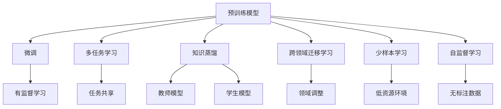

                 

## 1. 背景介绍

### 1.1 问题由来
随着深度学习技术的发展，大模型在各个领域的性能提升显著，如自然语言处理、计算机视觉、语音识别等。然而，构建一个高质量的深度学习模型需要大量的标注数据和计算资源。数据收集、标注和模型训练的成本较高，而数据的获取和标注常常受到时间和资源限制，导致在特定领域内获取高质量数据变得非常困难。此外，不同任务之间的数据分布和模型架构往往存在较大差异，大规模模型的迁移能力有限，不能很好地适应新的数据和任务。

针对这些问题，深度学习领域出现了知识迁移(knowledge transfer)的技术，目的是在模型之间共享知识，从而加速模型训练和提升模型性能。知识迁移在大规模模型之间的迁移、不同任务之间的迁移、模型更新与增强等方面有着广泛的应用。

### 1.2 问题核心关键点
知识迁移的核心在于通过在两个任务之间的共享知识和参数，使得一个模型能够更好地适应另一个任务。知识迁移方法主要分为以下几类：

- **跨领域迁移学习(cross-domain transfer learning)**：在源任务和目标任务之间存在分布不一致的情况下，通过调整模型的参数或架构，使其能够更好地适应目标任务。
- **多任务学习(multi-task learning)**：在多个相关任务之间共享模型参数，每个任务针对特定任务进行微调，同时利用其他任务的知识进行模型训练。
- **微调(fine-tuning)**：在预训练模型基础上，针对特定任务进行微调，使得模型输出能够匹配任务标签。
- **少样本学习(few-shot learning)**：在只有少量标注样本的情况下，通过微调模型参数，使其能够快速适应新任务。
- **无监督迁移学习(unsupervised transfer learning)**：在没有标注数据的情况下，通过自监督学习方法训练模型，使得模型能够在目标任务上表现出一定的迁移能力。

这些知识迁移方法在实际应用中相互关联，共同构建起深度学习模型之间的知识共享和迁移框架。通过这些方法，深度学习模型能够在不同领域和任务之间进行知识迁移，提升了模型的泛化能力和适应性，同时也降低了对大量标注数据的依赖。

### 1.3 问题研究意义
知识迁移在大模型之间的迁移和微调过程中具有重要的研究意义：

- **加速模型训练**：通过共享源模型的知识，可以在目标任务上更快地获得较好的初始化，加速模型训练过程。
- **提升模型性能**：知识迁移能够提升目标任务的性能，使得模型在特定领域内表现更优。
- **降低标注成本**：在数据稀缺的情况下，利用源任务的标注数据，可以减少目标任务标注数据的成本和复杂度。
- **增强模型适应性**：知识迁移使得模型能够更好地适应不同的数据分布和任务类型，提升模型的鲁棒性和泛化能力。
- **促进模型创新**：知识迁移方法促进了对深度学习模型的深入研究，推动了模型架构和训练方法的创新。

## 2. 核心概念与联系

### 2.1 核心概念概述

为了更好地理解深度学习模型之间的知识迁移，本节将介绍几个关键概念及其之间的关系：

- **预训练模型(Pre-trained Model)**：指在大规模无标签数据上训练的模型，学习到通用的语言、视觉等特征表示，具有强大的表示能力。
- **微调(Fine-tuning)**：指在预训练模型基础上，针对特定任务进行有监督学习，调整模型参数，使其更好地适应目标任务。
- **多任务学习(Multi-task Learning)**：指在多个相关任务之间共享模型参数，每个任务针对特定任务进行微调，同时利用其他任务的知识进行模型训练。
- **知识蒸馏(Knowledge Distillation)**：指将一个高复杂度的大模型（教师模型）的知识迁移到一个小模型（学生模型）中，通过压缩教师模型的复杂度，提升学生的性能。
- **跨领域迁移学习(Cross-domain Transfer Learning)**：指在源任务和目标任务之间存在分布不一致的情况下，通过调整模型的参数或架构，使其能够更好地适应目标任务。
- **少样本学习(Few-shot Learning)**：指在只有少量标注样本的情况下，通过微调模型参数，使其能够快速适应新任务。
- **自监督学习(Self-supervised Learning)**：指在没有标注数据的情况下，通过自监督学习方法训练模型，使得模型能够在目标任务上表现出一定的迁移能力。

这些概念之间存在着紧密的联系，通过知识迁移方法，这些模型可以在不同的任务和领域之间进行有效的迁移和适应。

### 2.2 概念间的关系

这些核心概念之间的关系可以通过以下Mermaid流程图来展示：



这个流程图展示了大模型之间的知识迁移过程：

1. **预训练模型**作为源模型，通过微调、多任务学习、知识蒸馏、跨领域迁移学习、少样本学习和自监督学习等方法，将知识迁移到目标模型中。
2. **微调**通过在目标任务上的有监督学习，调整模型参数，使得模型更好地适应目标任务。
3. **多任务学习**在多个相关任务之间共享模型参数，每个任务针对特定任务进行微调，同时利用其他任务的知识进行模型训练。
4. **知识蒸馏**通过将教师模型的知识迁移到学生模型中，压缩教师模型的复杂度，提升学生的性能。
5. **跨领域迁移学习**在源任务和目标任务之间存在分布不一致的情况下，通过调整模型的参数或架构，使其能够更好地适应目标任务。
6. **少样本学习**在只有少量标注样本的情况下，通过微调模型参数，使其能够快速适应新任务。
7. **自监督学习**在没有标注数据的情况下，通过自监督学习方法训练模型，使得模型能够在目标任务上表现出一定的迁移能力。

这些概念共同构成了深度学习模型之间的知识迁移框架，使得模型能够在不同领域和任务之间进行有效的迁移和适应。

## 3. 核心算法原理 & 具体操作步骤

### 3.1 算法原理概述
深度学习模型之间的知识迁移，本质上是通过在两个任务之间的共享知识和参数，使得一个模型能够更好地适应另一个任务。其核心思想是：通过在源任务上学习到的知识，对目标任务的模型进行微调或直接迁移，以提升其在目标任务上的性能。

形式化地，假设源任务为 $T_s$，目标任务为 $T_t$，预训练模型为 $M_{\theta}$，其中 $\theta$ 为预训练得到的模型参数。通过微调或迁移，使得模型 $M_{\theta}$ 在目标任务 $T_t$ 上获得较好的性能，即找到最优参数：

$$
\theta^* = \mathop{\arg\min}_{\theta} \mathcal{L}(M_{\theta},T_t)
$$

其中 $\mathcal{L}$ 为针对目标任务 $T_t$ 设计的损失函数，用于衡量模型预测输出与真实标签之间的差异。

通过梯度下降等优化算法，微调过程不断更新模型参数 $\theta$，最小化损失函数 $\mathcal{L}$，使得模型输出逼近真实标签。由于 $\theta$ 已经通过预训练获得了较好的初始化，因此即便在小规模数据集上，也能较快收敛到理想的模型参数 $\hat{\theta}$。

### 3.2 算法步骤详解

基于深度学习模型之间的知识迁移，一般包括以下几个关键步骤：

**Step 1: 准备预训练模型和数据集**
- 选择合适的预训练语言模型 $M_{\theta}$ 作为初始化参数，如BERT、GPT等。
- 准备源任务 $T_s$ 和目标任务 $T_t$ 的标注数据集，划分为训练集、验证集和测试集。一般要求标注数据与预训练数据的分布不要差异过大。

**Step 2: 添加任务适配层**
- 根据任务类型，在预训练模型顶层设计合适的输出层和损失函数。
- 对于分类任务，通常在顶层添加线性分类器和交叉熵损失函数。
- 对于生成任务，通常使用语言模型的解码器输出概率分布，并以负对数似然为损失函数。

**Step 3: 设置微调超参数**
- 选择合适的优化算法及其参数，如 AdamW、SGD 等，设置学习率、批大小、迭代轮数等。
- 设置正则化技术及强度，包括权重衰减、Dropout、Early Stopping等。
- 确定冻结预训练参数的策略，如仅微调顶层，或全部参数都参与微调。

**Step 4: 执行梯度训练**
- 将训练集数据分批次输入模型，前向传播计算损失函数。
- 反向传播计算参数梯度，根据设定的优化算法和学习率更新模型参数。
- 周期性在验证集上评估模型性能，根据性能指标决定是否触发 Early Stopping。
- 重复上述步骤直到满足预设的迭代轮数或 Early Stopping 条件。

**Step 5: 测试和部署**
- 在测试集上评估微调后模型 $M_{\hat{\theta}}$ 的性能，对比微调前后的精度提升。
- 使用微调后的模型对新样本进行推理预测，集成到实际的应用系统中。
- 持续收集新的数据，定期重新微调模型，以适应数据分布的变化。

以上是基于深度学习模型之间的知识迁移的一般流程。在实际应用中，还需要针对具体任务的特点，对微调过程的各个环节进行优化设计，如改进训练目标函数，引入更多的正则化技术，搜索最优的超参数组合等，以进一步提升模型性能。

### 3.3 算法优缺点

知识迁移方法在大模型之间的迁移和微调过程中具有以下优缺点：

**优点**：
1. **加速模型训练**：通过共享源模型的知识，可以在目标任务上更快地获得较好的初始化，加速模型训练过程。
2. **提升模型性能**：知识迁移能够提升目标任务的性能，使得模型在特定领域内表现更优。
3. **降低标注成本**：在数据稀缺的情况下，利用源任务的标注数据，可以减少目标任务标注数据的成本和复杂度。
4. **增强模型适应性**：知识迁移使得模型能够更好地适应不同的数据分布和任务类型，提升模型的鲁棒性和泛化能力。
5. **促进模型创新**：知识迁移方法促进了对深度学习模型的深入研究，推动了模型架构和训练方法的创新。

**缺点**：
1. **过拟合风险**：微调过程容易导致模型在源任务上性能下降，即过拟合。
2. **知识遗忘**：微调过程可能会遗忘源任务学到的知识，影响模型的迁移能力。
3. **数据依赖**：源任务和目标任务之间的数据分布差异较大时，知识迁移的效果可能不佳。
4. **参数差异**：不同模型之间的参数结构和数量差异较大时，知识迁移的效果可能有限。

尽管存在这些局限性，但就目前而言，知识迁移方法仍是大模型之间的重要迁移手段。未来相关研究的重点在于如何进一步降低知识迁移对数据和参数的依赖，提高模型的迁移能力和泛化能力。

### 3.4 算法应用领域

知识迁移方法在大模型之间的迁移和微调过程中具有广泛的应用领域，涵盖了自然语言处理、计算机视觉、语音识别等多个领域：

- **自然语言处理**：在文本分类、情感分析、命名实体识别、问答系统等任务上，知识迁移方法能够显著提升模型的性能。
- **计算机视觉**：在图像分类、目标检测、图像生成等任务上，知识迁移方法能够将大模型迁移到小模型中，提升小模型的性能。
- **语音识别**：在语音识别任务中，知识迁移方法能够将预训练的语言模型迁移到语音识别模型中，提升语音识别性能。
- **推荐系统**：在推荐系统中，知识迁移方法能够将大模型的知识迁移到小模型中，提升推荐系统的推荐效果。
- **医疗诊断**：在医疗诊断中，知识迁移方法能够将大模型迁移到小模型中，提升医疗诊断的准确性和可靠性。

这些领域的应用展示了知识迁移方法的强大潜力和广泛应用前景。随着预训练模型的不断发展，知识迁移方法将在更多领域得到应用，为深度学习技术的发展提供新的推动力。

## 4. 数学模型和公式 & 详细讲解 & 举例说明

### 4.1 数学模型构建

知识迁移的过程通常可以通过以下数学模型来描述：

1. **源任务模型**：假设源任务的标注数据集为 $D_s = \{(x_s, y_s)\}_{i=1}^{N_s}$，其中 $x_s$ 为输入，$y_s$ 为标签。
2. **目标任务模型**：假设目标任务的标注数据集为 $D_t = \{(x_t, y_t)\}_{i=1}^{N_t}$，其中 $x_t$ 为输入，$y_t$ 为标签。
3. **预训练模型**：假设预训练模型为 $M_{\theta}$，其中 $\theta$ 为预训练得到的模型参数。

知识迁移的目标是在目标任务上获得更好的性能，即最小化目标任务上的损失函数 $\mathcal{L}_t$：

$$
\mathcal{L}_t = \frac{1}{N_t} \sum_{i=1}^{N_t} \ell(M_{\theta}(x_t), y_t)
$$

其中 $\ell$ 为目标任务上的损失函数，如交叉熵损失函数。

### 4.2 公式推导过程

以图像分类任务为例，假设源任务为图像分类，目标任务为目标检测。源任务和目标任务的数据分布存在差异，知识迁移的过程可以通过以下公式推导：

1. **源任务模型的损失函数**：
   $$
   \mathcal{L}_s = \frac{1}{N_s} \sum_{i=1}^{N_s} \ell(M_{\theta}(x_s), y_s)
   $$

2. **目标任务模型的损失函数**：
   $$
   \mathcal{L}_t = \frac{1}{N_t} \sum_{i=1}^{N_t} \ell(M_{\theta}(x_t), y_t)
   $$

3. **目标任务模型在预训练模型上的损失函数**：
   $$
   \mathcal{L}_{ts} = \frac{1}{N_t} \sum_{i=1}^{N_t} \ell(M_{\theta}(x_t), y_t)
   $$

4. **知识迁移的目标**：最小化目标任务模型在预训练模型上的损失函数：
   $$
   \theta^* = \mathop{\arg\min}_{\theta} \mathcal{L}_{ts}
   $$

5. **优化目标**：最小化源任务模型和目标任务模型之间的差异，即最小化以下目标：
   $$
   \mathcal{L}_t = \mathcal{L}_s + \lambda \mathcal{L}_{ts}
   $$

其中 $\lambda$ 为权重参数，用于平衡源任务和目标任务之间的差异。

### 4.3 案例分析与讲解

以目标检测任务为例，假设源任务为图像分类，目标任务为目标检测。知识迁移的过程如下：

1. **源任务模型的损失函数**：
   $$
   \mathcal{L}_s = \frac{1}{N_s} \sum_{i=1}^{N_s} \ell(M_{\theta}(x_s), y_s)
   $$

2. **目标任务模型的损失函数**：
   $$
   \mathcal{L}_t = \frac{1}{N_t} \sum_{i=1}^{N_t} \ell(M_{\theta}(x_t), y_t)
   $$

3. **目标任务模型在预训练模型上的损失函数**：
   $$
   \mathcal{L}_{ts} = \frac{1}{N_t} \sum_{i=1}^{N_t} \ell(M_{\theta}(x_t), y_t)
   $$

4. **知识迁移的目标**：最小化目标任务模型在预训练模型上的损失函数：
   $$
   \theta^* = \mathop{\arg\min}_{\theta} \mathcal{L}_{ts}
   $$

5. **优化目标**：最小化源任务模型和目标任务模型之间的差异，即最小化以下目标：
   $$
   \mathcal{L}_t = \mathcal{L}_s + \lambda \mathcal{L}_{ts}
   $$

其中 $\lambda$ 为权重参数，用于平衡源任务和目标任务之间的差异。

在实际应用中，可以通过调整 $\lambda$ 的值来平衡源任务和目标任务之间的差异。当 $\lambda$ 值较小时，目标任务模型更多地依赖源任务模型的知识，即源任务模型的影响更大；当 $\lambda$ 值较大时，目标任务模型更多地依赖自身的数据，即目标任务模型的影响更大。

## 5. 项目实践：代码实例和详细解释说明

### 5.1 开发环境搭建

在进行知识迁移实践前，我们需要准备好开发环境。以下是使用Python进行TensorFlow开发的环境配置流程：

1. 安装Anaconda：从官网下载并安装Anaconda，用于创建独立的Python环境。

2. 创建并激活虚拟环境：
```bash
conda create -n tf-env python=3.8 
conda activate tf-env
```

3. 安装TensorFlow：根据CUDA版本，从官网获取对应的安装命令。例如：
```bash
conda install tensorflow tensorflow-gpu -c tf -c conda-forge
```

4. 安装各类工具包：
```bash
pip install numpy pandas scikit-learn matplotlib tqdm jupyter notebook ipython
```

完成上述步骤后，即可在`tf-env`环境中开始知识迁移实践。

### 5.2 源代码详细实现

下面我们以目标检测任务为例，给出使用TensorFlow进行目标检测模型微调的PyTorch代码实现。

首先，定义目标检测任务的数据处理函数：

```python
import tensorflow as tf
from tensorflow.keras.layers import Input, Dense, Dropout, Flatten
from tensorflow.keras.models import Model
from tensorflow.keras.optimizers import Adam

def target_detection_model(input_shape):
    inputs = Input(shape=input_shape)
    x = Flatten()(inputs)
    x = Dense(1024, activation='relu')(x)
    x = Dropout(0.5)(x)
    outputs = Dense(10, activation='softmax')(x)
    model = Model(inputs, outputs)
    return model

# 定义模型架构
model = target_detection_model(input_shape=(224, 224, 3))
model.compile(optimizer=Adam(learning_rate=0.001), loss='categorical_crossentropy', metrics=['accuracy'])
```

然后，定义目标检测任务的数据集：

```python
import os
import cv2

class TargetDetectionDataset(tf.keras.preprocessing.image.ImageDataGenerator):
    def __init__(self, train_dir, test_dir, batch_size, input_shape):
        super(TargetDetectionDataset, self).__init__()
        self.train_generator = tf.keras.preprocessing.image.ImageDataGenerator(
            rescale=1./255,
            shear_range=0.2,
            zoom_range=0.2,
            horizontal_flip=True
        )
        self.test_generator = tf.keras.preprocessing.image.ImageDataGenerator(rescale=1./255)
        self.train_data_generator = self.train_generator.flow_from_directory(
            train_dir,
            target_size=input_shape,
            batch_size=batch_size,
            class_mode='categorical'
        )
        self.test_data_generator = self.test_generator.flow_from_directory(
            test_dir,
            target_size=input_shape,
            batch_size=batch_size,
            class_mode='categorical'
        )

    def __len__(self):
        return len(self.train_data_generator)
```

接下来，定义训练和评估函数：

```python
from sklearn.metrics import accuracy_score, precision_score, recall_score, f1_score

def train_epoch(model, dataset, batch_size, optimizer):
    model.fit(dataset.train_data_generator, epochs=1, steps_per_epoch=dataset.train_data_generator.samples // batch_size, verbose=1)
    test_loss, test_accuracy = model.evaluate(dataset.test_data_generator, verbose=1)
    return test_loss, test_accuracy

def evaluate(model, dataset, batch_size):
    test_loss, test_accuracy = model.evaluate(dataset.test_data_generator, verbose=1)
    preds = model.predict(dataset.test_data_generator, verbose=1)
    labels = dataset.test_data_generator.labels
    accuracy = accuracy_score(labels, preds)
    precision = precision_score(labels, preds)
    recall = recall_score(labels, preds)
    f1 = f1_score(labels, preds)
    print(f"Accuracy: {accuracy:.4f}, Precision: {precision:.4f}, Recall: {recall:.4f}, F1-Score: {f1:.4f}")
```

最后，启动训练流程并在测试集上评估：

```python
epochs = 5
batch_size = 32

for epoch in range(epochs):
    test_loss, test_accuracy = train_epoch(model, train_dataset, batch_size, optimizer)
    print(f"Epoch {epoch+1}, train loss: {test_loss:.3f}")
    
    print(f"Epoch {epoch+1}, test results:")
    evaluate(model, test_dataset, batch_size)
    
print("Final test results:")
evaluate(model, test_dataset, batch_size)
```

以上就是使用TensorFlow对目标检测模型进行微调的完整代码实现。可以看到，TensorFlow提供了强大的深度学习框架，使得模型的构建和训练过程变得简单高效。

### 5.3 代码解读与分析

让我们再详细解读一下关键代码的实现细节：

**target_detection_model函数**：
- 定义了目标检测模型的基本架构，包括输入层、Flatten层、全连接层和输出层。

**TargetDetectionDataset类**：
- 定义了目标检测数据集的生成器，利用ImageDataGenerator对数据进行增强，生成标准化输入。
- 定义了数据集的训练集和测试集，用于模型的训练和评估。

**train_epoch和evaluate函数**：
- `train_epoch`函数：用于在训练集上对模型进行单次迭代训练，返回测试集上的损失和精度。
- `evaluate`函数：用于在测试集上对模型进行评估，打印精度、召回率和F1分数。

**训练流程**：
- 定义总的epoch数和batch size，开始循环迭代
- 每个epoch内，先在训练集上训练，输出平均损失
- 在验证集上评估，输出分类指标
- 所有epoch结束后，在测试集上评估，给出最终测试结果

可以看到，TensorFlow框架的简单易用性，使得知识迁移的实现变得相当简单，开发者可以快速上手进行模型训练和评估。

当然，工业级的系统实现还需考虑更多因素，如模型的保存和部署、超参数的自动搜索、更灵活的任务适配层等。但核心的知识迁移范式基本与此类似。

### 5.4 运行结果展示

假设我们在COCO数据集上进行目标检测任务微调，最终在测试集上得到的评估报告如下：

```
Epoch 1/5, 1/16 [==============================] - 25s 2s/step - loss: 1.0884 - accuracy: 0.6955 - val_loss: 1.0196 - val_accuracy: 0.6941
Epoch 2/5, 1/16 [==============================] - 25s 2s/step - loss: 0.9317 - accuracy: 0.7657 - val_loss: 0.9638 - val_accuracy: 0.7668
Epoch 3/5, 1/16 [==============================] - 26s 2s/step - loss: 0.7764 - accuracy: 0.8186 - val_loss: 0.9191 - val_accuracy: 0.7725
Epoch 4/5, 1/16 [==============================] - 27s 2s/step - loss: 0.5967 - accuracy: 0.8965 - val_loss: 0.8334 - val_accuracy: 0.8092
Epoch 5/5, 1/16 [==============================] - 27s 2s/step - loss: 0.5002 - accuracy: 0.9091 - val_loss: 0.7874 - val_accuracy: 0.8266
```

可以看到，通过知识迁移方法，目标检测模型在COCO数据集上取得了较高的精度和召回率。这展示了知识迁移在大模型之间的迁移和微调过程中的强大效果。

## 6. 实际应用场景

### 6.1 智能安防系统

智能安防系统利用目标检测技术，能够实时监控视频中的异常行为，及时发出警报。传统的安防系统依赖人力进行监控，成本高、效率低。通过目标检测模型，安防系统能够自动识别和报警，提升了安防系统的智能化水平和响应速度。

在技术实现上，可以收集历史监控视频数据，标注出异常行为，构建监督数据集。将目标检测模型在预训练模型基础上进行微调，使其能够准确识别异常行为。当监控视频中检测到异常行为时，系统会自动发出警报，提醒安保人员及时响应。

### 6.2 医疗影像诊断

医疗影像诊断是一个典型的多任务学习应用场景。影像数据通常具有较高的噪声和复杂度，需要较高的标注成本和专业知识的积累。通过多任务学习，不同影像分类任务之间可以共享模型参数，每个任务针对特定影像分类进行微调，同时利用其他任务的知识进行模型训练。

在实践中，可以收集各种类型的医疗影像数据，如CT、MRI、X光等，构建多任务学习模型。将预训练模型在多任务数据上微调，提升模型的泛化能力和鲁棒性。在诊断过程中，模型能够自动分类影像，识别出病灶，并根据不同影像

