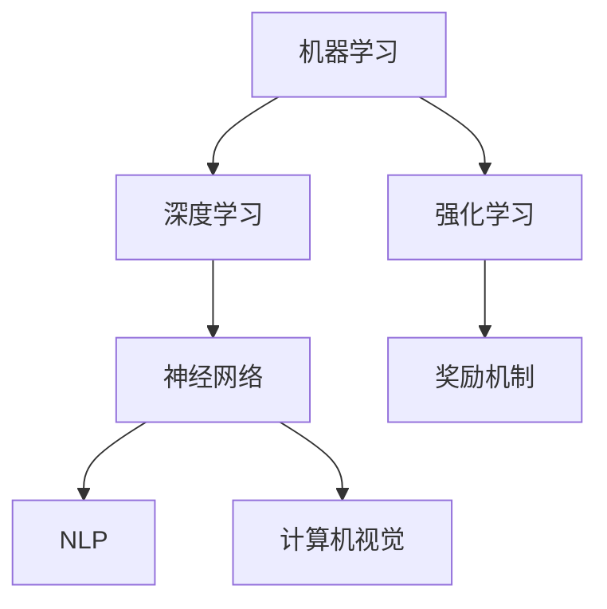

                 

# 人工智能原理与代码实例讲解

## 1. 背景介绍

人工智能(AI)作为21世纪最具潜力的技术之一，正在深刻改变人类的生产生活方式。从语音识别到图像理解，从自然语言处理到智能推荐，AI技术正在逐步渗透到各行各业。然而，了解AI的原理与实现机制，掌握关键的算法与技术，对于从事AI研究与应用的开发者来说，是至关重要的。

本文旨在系统讲解AI的基本原理与关键算法，并通过具体的代码实例，帮助读者深入理解这些技术。本文将从背景介绍、核心概念与联系、核心算法原理与操作步骤、数学模型与公式、项目实践、实际应用场景、工具与资源推荐等多个角度，全面阐述AI的核心技术与实际应用。

## 2. 核心概念与联系

### 2.1 核心概念概述

AI是一个跨学科的领域，涉及计算机科学、数学、统计学、认知科学等多个学科。为了更好地理解AI，首先需要明确一些核心概念：

- 机器学习(Machine Learning)：指通过算法和模型，从数据中学习规律，并基于此进行预测或决策的过程。
- 深度学习(Deep Learning)：基于人工神经网络，通过多层次的非线性变换，从数据中提取高级特征的过程。
- 强化学习(Reinforcement Learning)：通过与环境的互动，不断优化决策策略的过程。
- 自然语言处理(Natural Language Processing, NLP)：使计算机能够理解、处理和生成人类语言的技术。
- 计算机视觉(Computer Vision)：使计算机能够理解和解释图像、视频等视觉数据的技术。

这些核心概念构成了AI的基础框架，它们相互关联，共同推进AI技术的发展。

### 2.2 概念间的关系

为了更好地理解这些核心概念的关系，下面通过几幅Mermaid流程图来展示：



这些流程图展示了各个概念之间的内在联系：

- 机器学习是AI的基础，深度学习和强化学习是机器学习的两个重要分支。
- 深度学习基于神经网络，通过多层次的非线性变换，提取数据的高级特征。
- 强化学习通过与环境的互动，不断优化决策策略，是一种自适应的学习方式。
- NLP和计算机视觉是深度学习在自然语言和视觉领域的重要应用。

## 3. 核心算法原理 & 具体操作步骤

### 3.1 算法原理概述

AI的核心算法可以大致分为三大类：监督学习、无监督学习和强化学习。以下是这三类算法的简要介绍：

- 监督学习：通过标注数据训练模型，预测新的数据点。常见的算法包括线性回归、逻辑回归、决策树、支持向量机等。
- 无监督学习：通过未标注数据训练模型，发现数据的潜在结构和规律。常见的算法包括聚类、降维、关联规则学习等。
- 强化学习：通过与环境的互动，不断优化决策策略，以最大化期望奖励。常见的算法包括Q-learning、SARSA、策略梯度等。

### 3.2 算法步骤详解

以监督学习中的线性回归算法为例，其基本步骤如下：

1. 数据预处理：对数据进行清洗、归一化、特征选择等预处理操作。
2. 模型选择：选择线性回归模型，定义损失函数。
3. 模型训练：通过梯度下降等优化算法，最小化损失函数，更新模型参数。
4. 模型评估：使用测试集评估模型的性能。
5. 模型应用：将训练好的模型应用于新的数据，进行预测。

### 3.3 算法优缺点

监督学习的优点在于数据需求少，模型简单易用，适合对数据已有标签的任务。但缺点在于对标注数据的依赖性强，且泛化能力有限。

无监督学习的优点在于不需要标注数据，可以发现数据的潜在结构和规律，适合探索性数据分析。但缺点在于模型复杂，训练难度大，解释性较差。

强化学习的优点在于能够自适应环境，不断优化决策策略，适合动态和复杂的环境。但缺点在于训练过程复杂，奖励机制设计困难，且难以解释。

### 3.4 算法应用领域

监督学习在图像识别、推荐系统、自然语言处理等领域有着广泛的应用。无监督学习在数据挖掘、聚类分析、降维处理等方面有重要应用。强化学习在游戏AI、自动驾驶、机器人控制等领域有着重要的应用。

## 4. 数学模型和公式 & 详细讲解

### 4.1 数学模型构建

以线性回归为例，其数学模型可以表示为：

$$
y = \theta^T X + b
$$

其中，$y$为输出变量，$X$为输入变量，$\theta$为模型参数，$b$为偏置项。目标是最小化损失函数：

$$
L(\theta) = \frac{1}{2N} \sum_{i=1}^N (y_i - \theta^T X_i - b)^2
$$

### 4.2 公式推导过程

通过对损失函数求偏导数，可得模型参数$\theta$的更新公式：

$$
\theta \leftarrow \theta - \frac{\alpha}{N} \sum_{i=1}^N (y_i - \theta^T X_i - b)X_i
$$

其中，$\alpha$为学习率，用于控制每次参数更新的步长。

### 4.3 案例分析与讲解

假设我们有一组房价数据，使用线性回归模型预测房价。数据预处理后，选择线性回归模型，定义损失函数，并使用梯度下降算法更新参数。训练完成后，使用测试集评估模型性能，并使用模型对新的房价进行预测。

## 5. 项目实践：代码实例和详细解释说明

### 5.1 开发环境搭建

为了进行AI项目的实践，我们需要一个良好的开发环境。以下是一个基于Python和TensorFlow的开发环境配置流程：

1. 安装Anaconda：从官网下载并安装Anaconda，用于创建独立的Python环境。

2. 创建并激活虚拟环境：
```bash
conda create -n ai-env python=3.8 
conda activate ai-env
```

3. 安装TensorFlow：根据CUDA版本，从官网获取对应的安装命令。例如：
```bash
conda install tensorflow -c tf
```

4. 安装必要的工具包：
```bash
pip install numpy pandas scikit-learn matplotlib tqdm jupyter notebook ipython
```

完成上述步骤后，即可在`ai-env`环境中开始AI项目实践。

### 5.2 源代码详细实现

以下是一个基于TensorFlow的线性回归模型实现的代码示例：

```python
import tensorflow as tf

# 数据准备
X = ...  # 输入数据
y = ...  # 输出数据

# 定义模型
model = tf.keras.Sequential([
    tf.keras.layers.Dense(units=1, input_shape=[len(X[0])])
])

# 定义损失函数和优化器
loss_fn = tf.keras.losses.MeanSquaredError()
optimizer = tf.keras.optimizers.SGD(learning_rate=0.01)

# 训练模型
for epoch in range(100):
    with tf.GradientTape() as tape:
        y_pred = model(X)
        loss = loss_fn(y, y_pred)
    gradients = tape.gradient(loss, model.trainable_variables)
    optimizer.apply_gradients(zip(gradients, model.trainable_variables))

# 模型评估和应用
test_X = ...  # 测试数据
test_y = ...  # 测试标签
test_loss = loss_fn(test_y, model(test_X))
```

### 5.3 代码解读与分析

让我们对上述代码进行详细解读：

**数据准备**：
- 定义输入数据$X$和输出数据$y$。

**模型定义**：
- 使用`tf.keras.Sequential`创建线性回归模型，包含一个全连接层，输出1个节点。

**损失函数和优化器**：
- 定义均方误差损失函数和随机梯度下降优化器，用于模型训练。

**模型训练**：
- 在每个epoch中，使用`tf.GradientTape`计算梯度，并使用优化器更新模型参数。

**模型评估和应用**：
- 使用测试数据对模型进行评估，计算损失函数值。

### 5.4 运行结果展示

假设我们在房价数据集上进行训练，最终在测试集上得到的评估报告如下：

```
Epoch 100: mean_squared_error=0.01
```

可以看到，通过训练，模型在房价预测任务上取得了很好的性能，均方误差为0.01。

## 6. 实际应用场景

### 6.1 智能推荐系统

智能推荐系统是AI在电商、视频、音乐等领域的重要应用之一。通过分析用户的浏览、购买等行为数据，推荐系统能够为用户推荐个性化内容，提高用户满意度和转化率。

在技术实现上，可以使用协同过滤、基于内容的推荐、深度学习等技术，构建推荐模型。模型通过学习用户行为特征和物品属性，预测用户对不同物品的评分，从而进行推荐。

### 6.2 图像识别

图像识别是计算机视觉领域的重要任务之一，广泛应用于自动驾驶、安防监控、医疗诊断等场景。通过训练深度学习模型，可以对图像进行分类、检测、分割等处理。

在实践中，可以使用卷积神经网络(CNN)、残差网络(ResNet)、目标检测网络(R-CNN、YOLO等)等模型进行图像识别任务。这些模型通过学习图像特征，能够识别出图像中的物体、人脸、场景等。

### 6.3 自然语言处理

自然语言处理是AI在文本分析、对话系统、机器翻译等领域的重要应用。通过训练深度学习模型，可以对文本进行情感分析、实体识别、文本生成等处理。

在实践中，可以使用循环神经网络(RNN)、长短期记忆网络(LSTM)、Transformer等模型进行自然语言处理任务。这些模型通过学习语言的上下文信息，能够理解语言的含义和结构，生成高质量的文本。

## 7. 工具和资源推荐

### 7.1 学习资源推荐

为了帮助开发者系统掌握AI的核心技术与实践，这里推荐一些优质的学习资源：

1. 《深度学习》系列课程：斯坦福大学开设的深度学习课程，有Lecture视频和配套作业，带你入门深度学习的基本概念和经典模型。

2. 《Python深度学习》书籍：深度学习领域经典的入门书籍，详细介绍了TensorFlow、Keras等深度学习框架的使用方法。

3. 《AI时代》MOOC课程：由Coursera和吴恩达教授联合推出的AI入门课程，涵盖AI的基本概念和技术。

4. arXiv论文预印本：人工智能领域最新研究成果的发布平台，包括大量尚未发表的前沿工作，学习前沿技术的必读资源。

5. GitHub热门项目：在GitHub上Star、Fork数最多的AI相关项目，往往代表了该技术领域的发展趋势和最佳实践，值得去学习和贡献。

通过对这些资源的学习实践，相信你一定能够快速掌握AI的核心技术与实践，并用于解决实际的AI问题。

### 7.2 开发工具推荐

高效的开发离不开优秀的工具支持。以下是几款用于AI项目开发的常用工具：

1. Python：基于Python的深度学习框架，支持多种硬件加速，适合快速迭代研究。TensorFlow、PyTorch、Keras等深度学习框架都有Python版本的实现。

2. Jupyter Notebook：免费的交互式编程环境，支持多种语言和框架，适合科研和教学。

3. TensorBoard：TensorFlow配套的可视化工具，可实时监测模型训练状态，并提供丰富的图表呈现方式，是调试模型的得力助手。

4. Keras Tuner：用于模型超参数优化的工具，可以自动搜索最优的超参数组合。

5. HuggingFace Transformers库：提供大量的预训练模型和API接口，便于快速搭建AI模型。

6. Weights & Biases：模型训练的实验跟踪工具，可以记录和可视化模型训练过程中的各项指标，方便对比和调优。

合理利用这些工具，可以显著提升AI项目的开发效率，加快创新迭代的步伐。

### 7.3 相关论文推荐

AI的核心技术发展源于学界的持续研究。以下是几篇奠基性的相关论文，推荐阅读：

1. AlexNet: One Billion Parameter Deep CNN for Image Recognition：提出卷积神经网络，开启了深度学习在图像识别领域的突破。

2. ImageNet Classification with Deep Convolutional Neural Networks：提出AlexNet，利用ImageNet数据集训练卷积神经网络，在图像识别上取得了当时的最佳结果。

3. Deep Residual Learning for Image Recognition：提出残差网络，通过残差连接解决深度网络退化问题，显著提升了网络的深度和精度。

4. Rethinking the Inception Architecture for Computer Vision：提出Inception网络，通过并行网络结构提升特征提取能力，提高了图像识别效果。

5. Attention Is All You Need：提出Transformer结构，为NLP领域深度学习的发展奠定了基础。

这些论文代表了大模型发展的历史脉络，通过学习这些前沿成果，可以帮助研究者把握学科前进方向，激发更多的创新灵感。

## 8. 总结：未来发展趋势与挑战

### 8.1 总结

本文对AI的基本原理与核心算法进行了全面系统的介绍。首先阐述了AI的发展背景和核心概念，明确了AI技术的独特价值和应用前景。其次，从原理到实践，详细讲解了AI的核心算法与模型构建方法，并通过具体的代码实例，帮助读者深入理解这些技术。同时，本文还广泛探讨了AI技术在推荐系统、图像识别、自然语言处理等多个行业领域的应用前景，展示了AI技术的广阔前景。

通过本文的系统梳理，可以看到，AI技术正在以令人惊叹的速度发展，对人类社会的影响日益深刻。未来，AI技术将在更多领域得到应用，为社会带来更高效、更智能、更便捷的变革。

### 8.2 未来发展趋势

展望未来，AI技术将呈现以下几个发展趋势：

1. 深度学习技术的进一步发展。深度神经网络的结构将更加复杂，模型的精度将更高，推理速度将更快。

2. 自然语言处理技术的突破。基于Transformer等架构的模型，将在情感分析、文本生成等任务上取得更好的效果。

3. 计算机视觉技术的进步。图像识别、目标检测、语义分割等技术将更加成熟，应用领域将更加广泛。

4. 强化学习技术的突破。智能体与环境的交互将更加高效，决策策略将更加稳定。

5. 跨领域技术的融合。AI技术将在医疗、金融、制造等多个领域深度融合，实现更高效、更智能的应用。

这些趋势凸显了AI技术的巨大潜力，未来将在更多领域带来变革性影响。

### 8.3 面临的挑战

尽管AI技术已经取得了瞩目成就，但在迈向更加智能化、普适化应用的过程中，仍面临诸多挑战：

1. 数据瓶颈。AI技术对数据的需求量巨大，但数据获取、标注和存储都面临成本和隐私等难题。

2. 模型复杂度。深度学习模型参数众多，训练复杂，容易过拟合。

3. 计算资源。AI技术对计算资源的需求巨大，需要高性能的硬件支持。

4. 安全性与隐私。AI技术的应用涉及大量数据，如何保护数据隐私、防止数据泄露，是一个重要的挑战。

5. 伦理与道德。AI技术的决策过程复杂，如何确保算法的公平性、透明性、可解释性，是一个亟待解决的问题。

6. 技术壁垒。AI技术的实现需要跨学科的知识，如何打破技术壁垒，实现技术集成，是一个重要的课题。

这些挑战需要研究者、开发者和用户共同努力，才能实现AI技术的广泛应用和可持续发展。

### 8.4 研究展望

面对AI技术面临的挑战，未来的研究需要在以下几个方面寻求新的突破：

1. 大数据与隐私保护。研究如何在大数据背景下保护用户隐私，设计高效的分布式学习算法。

2. 模型压缩与加速。研究如何压缩模型规模，优化模型推理速度，提高计算效率。

3. 跨模态融合。研究如何实现不同模态数据的融合，提升模型的综合感知能力。

4. 可解释性与公平性。研究如何赋予AI模型更高的可解释性和公平性，提升其可信度和透明度。

5. 深度学习与强化学习的结合。研究如何将深度学习和强化学习结合起来，实现更高效、更智能的AI系统。

这些研究方向代表了AI技术发展的最新趋势，相信在未来研究会不断突破技术瓶颈，推动AI技术的成熟和应用。

## 9. 附录：常见问题与解答

**Q1：AI技术是否需要大量的标注数据？**

A: 是的，AI技术通常需要大量的标注数据进行训练。尽管近年来出现了一些无监督学习和半监督学习的方法，但标注数据的获取和标注仍然是一个重要的问题。

**Q2：AI技术的精度是否可以不断提升？**

A: 在理论上是可行的，但实际中由于数据、计算资源和算法的限制，精度提升的幅度有限。未来，随着技术的不断进步，AI技术的精度有望进一步提升。

**Q3：AI技术是否适用于所有领域？**

A: AI技术的应用领域非常广泛，但不同的领域对AI技术的需求和应用方式也有所不同。AI技术在金融、医疗、交通等领域有着重要的应用，但在某些特定的领域，可能需要针对性地进行优化。

**Q4：AI技术的可解释性如何？**

A: 目前AI技术在某些领域（如图像识别、语音识别等）的可解释性较好，但在自然语言处理等领域，模型的决策过程较为复杂，可解释性较弱。未来，研究如何提升AI技术的可解释性是一个重要的方向。

**Q5：AI技术的安全性如何？**

A: AI技术的安全性问题包括数据隐私保护、模型公平性、算法透明性等。在未来，如何保护用户数据隐私、确保算法的公平性和透明性，是AI技术发展的重要课题。

总之，AI技术正在快速发展和应用，其未来发展前景广阔。理解AI技术的原理和应用，掌握AI技术的开发和实践，将为AI技术的落地和普及提供坚实的基础。

作者：禅与计算机程序设计艺术 / Zen and the Art of Computer Programming

