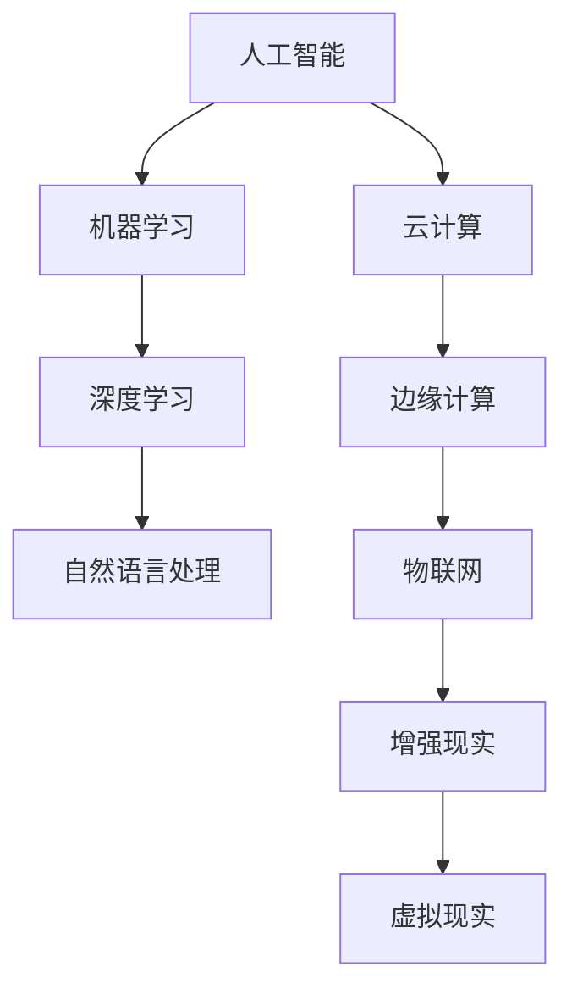

                 

# 人工智能在产业中的应用创新

## 1. 背景介绍

### 1.1 问题由来
随着人工智能（AI）技术的快速进步，其在各产业中的应用场景越来越广泛，为传统行业带来了深远的变革。AI技术的引入，使得自动化生产、智能客服、精准营销、智能制造等诸多领域实现了质的飞跃。然而，面对海量数据的处理、模型算力的提升、实时反馈的优化等挑战，AI技术的应用创新正变得日益重要。如何结合特定行业需求，开发高效、可靠、可扩展的AI应用，成为当下产业界关注的焦点。

### 1.2 问题核心关键点
AI在产业中的应用创新，涉及技术开发、数据管理、系统集成、业务适配等多个环节。其核心在于通过跨学科融合、技术迭代、业务理解等手段，构建能够实时响应、智能决策的AI系统，以期实现经济效益和社会价值的双重提升。

## 2. 核心概念与联系

### 2.1 核心概念概述
- **人工智能（AI）**：指通过机器学习、深度学习、自然语言处理等技术，使机器能够模拟人类智能活动的能力。
- **机器学习（ML）**：一种从数据中学习规律并应用到新数据上的算法，是AI的重要组成部分。
- **深度学习（DL）**：基于神经网络的机器学习技术，能够处理复杂模式识别和预测问题。
- **自然语言处理（NLP）**：使计算机能够理解和处理人类语言的学科，是AI在信息处理领域的重要应用。
- **云计算（Cloud Computing）**：基于互联网的计算模式，提供按需资源、高可用性和高扩展性的计算服务。
- **边缘计算（Edge Computing）**：在数据源头或靠近数据源的地方进行数据处理和分析，减少网络延迟和数据传输量。
- **物联网（IoT）**：连接物体的互联网，通过传感器和智能设备采集数据，实现物与物、人与物的互联互通。
- **增强现实（AR）**：通过虚拟信息增强现实世界的视觉体验，广泛应用于教育、医疗、制造等领域。
- **虚拟现实（VR）**：创建沉浸式、交互式的三维虚拟环境，用于游戏、培训、娱乐等。

这些核心概念构成了AI在产业应用的基础框架，相互之间通过数据流、信号传输、算法优化等方式紧密联系，共同推动AI技术的广泛应用。

### 2.2 概念间的关系



这个流程图展示了AI各核心概念之间的联系和转化关系。机器学习、深度学习和自然语言处理是AI的基础技术手段，云计算、边缘计算和物联网提供了数据处理和传输的基础设施，而增强现实和虚拟现实则通过直观体验拓展了AI的应用场景。

## 3. 核心算法原理 & 具体操作步骤

### 3.1 算法原理概述

AI在产业中的应用创新，主要通过以下几个关键步骤实现：

1. **数据收集与清洗**：从业务场景中收集数据，并进行预处理、清洗和标注，保证数据质量。
2. **模型训练与优化**：利用收集的数据，训练和优化AI模型，提高模型预测准确率和泛化能力。
3. **系统集成与部署**：将训练好的模型集成到业务系统中，并进行部署和优化，确保系统稳定运行。
4. **业务适配与迭代**：根据业务需求，对AI系统进行适配和迭代优化，提升系统性能和用户体验。

### 3.2 算法步骤详解

以智能制造为例，其AI应用创新的具体操作步骤如下：

**Step 1: 数据收集与预处理**

智能制造的核心在于实现生产流程的数字化、智能化。首先，从生产线上采集传感器数据，包括温度、压力、湿度等实时监测数据，并进行预处理和清洗，生成可用于机器学习的数据集。

**Step 2: 模型训练与优化**

采用监督学习的方法，将传感器数据和预期的生产结果进行配对，训练一个预测模型。模型可以是基于时间序列的回归模型，也可以是分类模型，用于预测设备状态、预警故障等。通过交叉验证和参数调优，提升模型精度和泛化能力。

**Step 3: 系统集成与部署**

将训练好的模型集成到MES系统（制造执行系统）中，并部署在工厂的生产服务器上。同时，建立实时数据流和异常检测机制，确保模型能够实时接收传感器数据，并快速做出响应。

**Step 4: 业务适配与迭代**

根据实际生产反馈，不断调整模型参数和规则，提升系统对复杂生产场景的适应能力。同时，引入边缘计算技术，将数据处理和推理任务转移到靠近数据源的设备上，减少网络延迟和数据传输量。

### 3.3 算法优缺点

**优点**：
1. **高效性**：AI技术能够大幅提升生产效率和产品质量，降低生产成本。
2. **智能性**：通过实时数据分析和预测，AI系统能够自动调整生产参数，优化生产流程。
3. **自适应性**：AI模型能够自适应不同生产环境，具备较强的泛化能力。

**缺点**：
1. **数据依赖**：高质量的数据是AI技术应用的前提，数据采集和清洗成本较高。
2. **技术复杂性**：需要多学科融合，涉及数据科学、机器学习、软件工程等领域的知识和技能。
3. **系统集成**：AI系统需要与现有业务系统无缝集成，技术实现难度较大。
4. **隐私与安全**：大量传感器数据和生产数据需要妥善保护，避免数据泄露和隐私侵害。

### 3.4 算法应用领域

AI技术在智能制造中的应用，涵盖设备状态监测、生产过程优化、故障预测等多个环节。通过AI技术的引入，智能制造实现了从自动化到智能化的飞跃，助力企业提升竞争力。

## 4. 数学模型和公式 & 详细讲解  
### 4.1 数学模型构建

以智能制造中的生产过程优化为例，数学模型可以表示为：

$$
\min_{\theta} \sum_{i=1}^{n} (y_i - f(x_i, \theta))^2
$$

其中 $y_i$ 为实际生产结果，$f(x_i, \theta)$ 为预测模型，$\theta$ 为模型参数。通过最小化均方误差，训练模型以预测未来生产结果。

### 4.2 公式推导过程

对上述模型进行梯度下降优化，可以得到：

$$
\theta \leftarrow \theta - \alpha \sum_{i=1}^{n} \frac{\partial f(x_i, \theta)}{\partial \theta} \frac{y_i - f(x_i, \theta)}{2}
$$

其中 $\alpha$ 为学习率。通过迭代更新参数 $\theta$，最小化预测误差。

### 4.3 案例分析与讲解

假设我们采用LSTM模型进行生产过程优化。通过对历史生产数据进行训练，LSTM模型可以学习到生产过程的动态特性，并预测未来生产结果。训练过程需要调整LSTM的参数，优化神经网络结构，以保证模型能够准确预测生产数据。

## 5. 项目实践：代码实例和详细解释说明

### 5.1 开发环境搭建

开发环境搭建主要涉及以下几个步骤：

1. 安装Python和必要的库，如TensorFlow、Keras、NumPy等。
2. 配置开发环境，包括设置虚拟环境、安装依赖库、搭建数据库等。
3. 搭建服务器，确保数据存储和模型部署的安全性和稳定性。

### 5.2 源代码详细实现

以智能制造为例，代码实现如下：

```python
import tensorflow as tf
from tensorflow.keras.models import Sequential
from tensorflow.keras.layers import LSTM, Dense

# 构建LSTM模型
model = Sequential()
model.add(LSTM(100, input_shape=(10, 1)))
model.add(Dense(1, activation='sigmoid'))

# 编译模型
model.compile(optimizer='adam', loss='mse')

# 训练模型
model.fit(X_train, y_train, epochs=10, batch_size=32)

# 部署模型
model.save('manufacturing_model.h5')
```

### 5.3 代码解读与分析

在上述代码中，首先导入了必要的库和模块，然后定义了一个LSTM模型，并编译了损失函数和优化器。接着，使用训练数据对模型进行训练，调整模型参数。最后，将训练好的模型保存，用于部署和推理。

### 5.4 运行结果展示

假设我们通过训练得到一个准确率为90%的智能制造模型。在实际应用中，该模型可以实时接收传感器数据，预测生产结果，并进行生产优化和故障预警。

## 6. 实际应用场景

### 6.1 智慧医疗

在智慧医疗领域，AI技术被广泛应用于疾病诊断、药物研发、健康管理等多个环节。通过图像识别、自然语言处理等技术，AI系统可以高效地处理海量医疗数据，辅助医生进行诊断和治疗决策。例如，AI系统可以通过分析X光片，自动检测出肺癌、骨折等疾病，提高诊断准确率。

### 6.2 金融服务

AI技术在金融服务领域的应用包括风险管理、信用评估、欺诈检测等。通过机器学习和深度学习技术，AI系统可以实时分析交易数据，识别异常交易行为，及时预警风险。例如，AI系统可以自动检测出信用卡交易中的异常行为，如大额交易、异地交易等，提前采取措施防止欺诈。

### 6.3 智能交通

智能交通系统通过AI技术实现交通流量监测、事故预警、路线规划等功能。通过摄像头和传感器采集的实时数据，AI系统可以识别出交通状况，调整红绿灯信号，优化交通流。例如，AI系统可以实时检测到道路上的交通堵塞，自动调整信号灯周期，缓解交通拥堵。

### 6.4 未来应用展望

未来，AI技术将在更多领域实现突破和创新。通过跨领域融合、多模态数据整合、实时反馈优化等手段，AI技术将不断提升各行业的智能化水平，带来更高效、更智能的解决方案。

## 7. 工具和资源推荐

### 7.1 学习资源推荐

- **《人工智能基础》**：清华大学公开课，系统讲解AI基础知识和技术。
- **《深度学习》**：Ian Goodfellow著作，全面介绍深度学习理论和实践。
- **Kaggle平台**：全球最大的数据科学竞赛平台，提供大量数据集和竞赛机会，实践AI技术。
- **GitHub**：全球最大的开源社区，提供大量AI项目和代码，学习和贡献。

### 7.2 开发工具推荐

- **PyTorch**：开源深度学习框架，支持动态计算图和GPU加速，广泛应用于AI开发。
- **TensorFlow**：Google开发的深度学习框架，支持分布式计算和多种硬件平台。
- **Jupyter Notebook**：交互式编程环境，支持Python等语言，便于数据处理和模型开发。
- **AWS、Google Cloud、阿里云**：提供云平台和云服务，支持AI模型部署和扩展。

### 7.3 相关论文推荐

- **《深度学习在医疗影像中的应用》**：探讨深度学习在医学影像分析中的应用。
- **《基于AI的金融风险管理》**：介绍AI在金融风险管理和信用评估中的应用。
- **《智能交通系统中的AI应用》**：探讨AI在交通流量监测和路线规划中的应用。
- **《自监督学习在AI中的作用》**：分析自监督学习在深度学习中的作用和前景。

## 8. 总结：未来发展趋势与挑战

### 8.1 总结

本文对人工智能在产业中的应用创新进行了全面系统的介绍。首先，阐述了AI技术在各产业中的广泛应用和巨大潜力。其次，从技术原理到实践步骤，详细讲解了AI在智能制造、智慧医疗、金融服务等领域的应用。最后，展望了AI技术未来发展的趋势和面临的挑战。

通过本文的系统梳理，可以看到，AI技术正通过多学科融合、技术迭代和业务适配，逐步渗透到各产业的各个环节，带来深远的变革。AI技术的应用创新，需要跨领域的深度理解和协同合作，以期实现经济效益和社会价值的双重提升。

### 8.2 未来发展趋势

未来，AI技术将在更多领域实现突破和创新。通过跨领域融合、多模态数据整合、实时反馈优化等手段，AI技术将不断提升各行业的智能化水平，带来更高效、更智能的解决方案。

### 8.3 面临的挑战

尽管AI技术取得了显著进展，但在迈向更加智能化、普适化应用的过程中，仍面临诸多挑战：

1. **数据质量和数量**：高质量的数据是AI技术应用的前提，数据采集和清洗成本较高。
2. **模型复杂性**：多模态数据整合、实时反馈优化等技术复杂，开发难度较大。
3. **系统集成与适配**：AI系统需要与现有业务系统无缝集成，技术实现难度较大。
4. **隐私与安全**：大量数据需要妥善保护，避免数据泄露和隐私侵害。
5. **技术迭代与更新**：AI技术发展迅速，需要不断学习和更新技术，保持竞争力。

### 8.4 研究展望

未来，AI技术需要在以下方面寻求新的突破：

1. **数据增强与生成**：通过数据增强和生成技术，扩大数据规模，提升数据质量。
2. **模型压缩与优化**：开发更加高效的模型压缩与优化技术，提升模型性能和运行效率。
3. **多模态数据融合**：引入多模态数据融合技术，提升AI系统的感知能力和决策能力。
4. **实时反馈与优化**：通过实时反馈和优化技术，提升AI系统的自适应性和智能性。
5. **自监督学习与迁移学习**：引入自监督学习与迁移学习技术，提升模型的泛化能力和迁移能力。

这些研究方向的探索，将引领AI技术迈向更高的台阶，为构建安全、可靠、可解释、可控的智能系统铺平道路。

## 9. 附录：常见问题与解答

**Q1：AI在产业中的应用有哪些？**

A: AI在产业中的应用涵盖众多领域，包括智能制造、智慧医疗、金融服务、智能交通等。AI技术通过数据分析、模型训练和系统部署，提升了各行业的智能化水平，带来了显著的经济效益和社会价值。

**Q2：AI技术开发过程中需要注意哪些问题？**

A: 开发AI技术过程中需要注意以下几个问题：
1. 数据质量和数量：高质量的数据是AI技术应用的前提，数据采集和清洗成本较高。
2. 模型复杂性：多模态数据整合、实时反馈优化等技术复杂，开发难度较大。
3. 系统集成与适配：AI系统需要与现有业务系统无缝集成，技术实现难度较大。
4. 隐私与安全：大量数据需要妥善保护，避免数据泄露和隐私侵害。

**Q3：AI技术如何在不同行业应用？**

A: AI技术在不同行业的应用主要包括以下几个步骤：
1. 数据收集与预处理：从业务场景中收集数据，并进行预处理和清洗，保证数据质量。
2. 模型训练与优化：利用收集的数据，训练和优化AI模型，提高模型预测准确率和泛化能力。
3. 系统集成与部署：将训练好的模型集成到业务系统中，并进行部署和优化，确保系统稳定运行。
4. 业务适配与迭代：根据业务需求，对AI系统进行适配和迭代优化，提升系统性能和用户体验。

**Q4：AI技术未来的发展趋势是什么？**

A: AI技术未来的发展趋势主要包括：
1. 数据增强与生成：通过数据增强和生成技术，扩大数据规模，提升数据质量。
2. 模型压缩与优化：开发更加高效的模型压缩与优化技术，提升模型性能和运行效率。
3. 多模态数据融合：引入多模态数据融合技术，提升AI系统的感知能力和决策能力。
4. 实时反馈与优化：通过实时反馈和优化技术，提升AI系统的自适应性和智能性。
5. 自监督学习与迁移学习：引入自监督学习与迁移学习技术，提升模型的泛化能力和迁移能力。

**Q5：如何保障AI系统的安全与隐私？**

A: 保障AI系统的安全与隐私需要注意以下几个方面：
1. 数据脱敏与加密：对敏感数据进行脱敏和加密处理，保护用户隐私。
2. 访问控制与权限管理：建立严格的访问控制机制，确保只有授权人员可以访问系统。
3. 异常检测与预警：建立异常检测机制，及时发现并预警系统异常。
4. 安全审计与监管：定期进行安全审计和监管，确保系统的安全性和合规性。

**Q6：AI技术在实际应用中面临哪些挑战？**

A: AI技术在实际应用中面临以下几个挑战：
1. 数据质量和数量：高质量的数据是AI技术应用的前提，数据采集和清洗成本较高。
2. 模型复杂性：多模态数据整合、实时反馈优化等技术复杂，开发难度较大。
3. 系统集成与适配：AI系统需要与现有业务系统无缝集成，技术实现难度较大。
4. 隐私与安全：大量数据需要妥善保护，避免数据泄露和隐私侵害。

综上所述，AI技术在产业中的应用创新，需要结合各行业的业务需求，进行技术优化和业务适配，以期实现经济效益和社会价值的双重提升。通过跨领域融合、技术迭代和业务适配，AI技术正逐步渗透到各产业的各个环节，带来深远的变革。未来，AI技术将在更多领域实现突破和创新，通过跨领域融合、多模态数据整合、实时反馈优化等手段，提升各行业的智能化水平，带来更高效、更智能的解决方案。

---

作者：禅与计算机程序设计艺术 / Zen and the Art of Computer Programming

