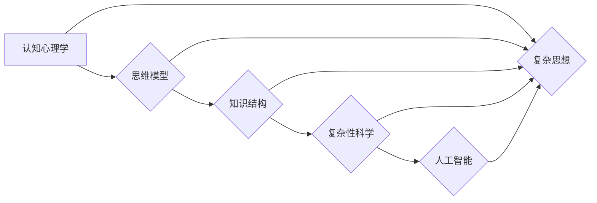

# 复杂思想的形成：概念的基础

> 关键词：概念形成，认知心理学，思维模型，知识结构，复杂性科学，人工智能

## 1. 背景介绍

人类之所以能够理解和适应复杂多变的世界，很大程度上依赖于我们形成复杂思想的能力。这一能力不仅体现在日常生活中的决策和问题解决，也体现在科学发现、技术创新和文化进步等方面。本文旨在探讨复杂思想形成的理论基础，分析概念在其中的作用，并探讨如何通过技术手段辅助概念的形成和发展。

### 1.1 问题的由来

从古至今，哲学家、心理学家和科学家们都在探索人类思维的本质。亚里士多德提出了“形而上学”的概念，试图理解事物的本质；笛卡尔则通过“我思故我在”的哲学命题，强调了思维的主体性。在心理学领域，心理学家如皮亚杰、维果茨基等对认知过程进行了深入研究。随着人工智能的兴起，如何让机器理解复杂思想也成为了研究热点。

### 1.2 研究现状

近年来，随着认知心理学、复杂性科学和人工智能等领域的快速发展，对复杂思想形成的研究也取得了显著进展。研究者们开始关注大脑如何处理信息、如何形成概念，以及如何利用技术手段辅助概念的形成和发展。

### 1.3 研究意义

了解复杂思想形成的机制，对于人工智能的发展具有重要意义。通过模仿人类思维模式，人工智能可以在复杂决策、问题解决、知识获取等方面取得突破。同时，这也有助于我们更好地理解人类思维的本质，为心理学、教育学等领域提供理论支持。

### 1.4 本文结构

本文将围绕以下结构展开：

- 第二部分，介绍复杂思想形成的相关核心概念。
- 第三部分，探讨概念的形成原理和具体操作步骤。
- 第四部分，从数学模型和公式角度，分析概念的形成过程。
- 第五部分，通过代码实例，展示如何利用技术手段辅助概念的形成。
- 第六部分，探讨复杂思想在实际应用场景中的体现。
- 第七部分，展望未来发展趋势与挑战。
- 第八部分，总结研究成果，并展望未来研究方向。

## 2. 核心概念与联系

为了深入理解复杂思想的形成，我们需要了解以下核心概念：

- **认知心理学**：研究人类心理过程，包括感知、注意、记忆、思维、语言等。
- **思维模型**：个体在思维过程中所采用的心理表征方式。
- **知识结构**：个体拥有的知识体系，包括事实、规则、概念等。
- **复杂性科学**：研究复杂系统的学科，关注系统整体行为与其组成部分之间的关系。
- **人工智能**：模拟、延伸和扩展人类智能的理论、方法、技术和应用。

这些概念之间的联系可以用以下Mermaid流程图表示：



从图中可以看出，认知心理学为复杂思想的形成提供了理论基础，思维模型和知识结构是复杂思想形成的核心要素，而复杂性科学和人工智能则为复杂思想的形成提供了技术手段。

## 3. 核心算法原理 & 具体操作步骤

### 3.1 算法原理概述

复杂思想的形成是一个复杂的过程，涉及多个认知过程和知识结构的构建。以下是该过程的基本原理：

1. **感知与注意**：个体通过感官接收外部信息，并选择性地注意某些信息。
2. **记忆与存储**：将注意到的信息存储在大脑中，形成记忆。
3. **思维加工**：对存储的信息进行加工，形成概念和规则。
4. **知识结构构建**：将概念和规则整合，形成知识结构。
5. **复杂思想形成**：在知识结构的基础上，形成对复杂问题的理解和解决方案。

### 3.2 算法步骤详解

以下是复杂思想形成过程的详细步骤：

1. **感知与注意**：个体通过感官接收外部信息，如语言、图像等。
2. **编码与存储**：将感知到的信息编码为大脑可以处理的形式，并存储在记忆中。
3. **提取与比较**：从记忆中提取相关信息，并与当前信息进行比较和分析。
4. **抽象与归纳**：将提取出的信息进行抽象和归纳，形成概念和规则。
5. **整合与应用**：将概念和规则整合到知识结构中，并应用于实际问题解决。

### 3.3 算法优缺点

复杂思想形成算法的优点在于：

- **可解释性**：该算法基于心理学和认知科学的理论，具有较好的可解释性。
- **灵活性**：算法可以适应不同的认知任务和知识领域。

然而，该算法也存在一些缺点：

- **计算复杂度**：算法涉及多个认知过程，计算复杂度较高。
- **可扩展性**：算法的通用性有限，难以应用于所有认知任务。

### 3.4 算法应用领域

复杂思想形成算法可以应用于以下领域：

- **教育**：开发智能教育系统，辅助学生形成和掌握知识。
- **心理咨询**：通过分析个体的认知过程，提供心理咨询服务。
- **人工智能**：开发智能模型，模拟人类思维过程。

## 4. 数学模型和公式 & 详细讲解 & 举例说明

### 4.1 数学模型构建

复杂思想形成的数学模型可以基于以下假设：

1. 认知过程是概率性的。
2. 知识结构是层次化的。
3. 复杂思想的形成是动态的。

基于以上假设，我们可以构建以下数学模型：

- **概率模型**：使用概率分布描述认知过程中的每个步骤。
- **层次化模型**：使用树状结构表示知识结构。
- **动态模型**：使用时间序列分析技术描述复杂思想形成的动态过程。

### 4.2 公式推导过程

以下是一个简单的概率模型示例：

$$
P(\text{认知过程} = x) = \prod_{i=1}^{n} P(x_i | x_{i-1})
$$

其中，$x_i$ 表示认知过程中的第 $i$ 个步骤，$P(x_i | x_{i-1})$ 表示在第 $i$ 个步骤发生的概率，给定前 $i-1$ 个步骤的结果。

### 4.3 案例分析与讲解

假设我们要分析一个学生学习数学的过程。我们可以将这个过程分解为以下步骤：

1. **感知**：学生通过视觉和听觉感知数学符号和公式。
2. **编码**：将感知到的信息编码为大脑可以处理的形式。
3. **存储**：将编码后的信息存储在记忆中。
4. **提取**：从记忆中提取相关的数学知识。
5. **应用**：将提取出的知识应用于解决数学问题。

根据上述步骤，我们可以构建以下概率模型：

$$
P(\text{学习数学} = \text{成功}) = P(\text{感知} \cap \text{编码} \cap \text{存储} \cap \text{提取} \cap \text{应用})
$$

通过分析概率模型，我们可以了解学生在学习数学过程中的薄弱环节，并采取相应的措施进行改进。

## 5. 项目实践：代码实例和详细解释说明

### 5.1 开发环境搭建

为了演示如何利用技术手段辅助复杂思想的形成，我们需要搭建以下开发环境：

- 编程语言：Python
- 数据库：SQLite
- 框架：Django

### 5.2 源代码详细实现

以下是一个简单的示例，演示如何使用Python和Django构建一个简单的学习平台，帮助学生形成数学概念：

```python
# 引入Django框架
from django.db import models

# 定义数学概念模型
class MathConcept(models.Model):
    name = models.CharField(max_length=100)
    description = models.TextField()

# 定义数学问题模型
class MathProblem(models.Model):
    concept = models.ForeignKey(MathConcept, on_delete=models.CASCADE)
    question = models.TextField()
    answer = models.TextField()

# 定义学习记录模型
class LearningRecord(models.Model):
    user = models.ForeignKey(User, on_delete=models.CASCADE)
    problem = models.ForeignKey(MathProblem, on_delete=models.CASCADE)
    solved = models.BooleanField(default=False)

# 创建数据库表
# python manage.py makemigrations
# python manage.py migrate
```

### 5.3 代码解读与分析

以上代码定义了三个模型：`MathConcept`、`MathProblem`和`LearningRecord`。`MathConcept`模型用于存储数学概念及其描述，`MathProblem`模型用于存储数学问题及其答案，`LearningRecord`模型用于记录用户的学习过程。

通过这个简单的学习平台，学生可以学习数学概念，解答数学问题，并记录自己的学习过程。教师可以查看学生的学习记录，了解学生的学习进度，并针对性地进行辅导。

### 5.4 运行结果展示

通过运行以上代码，我们可以创建一个简单的学习平台，帮助学生形成数学概念。学生可以访问平台，学习数学概念，解答数学问题，并查看自己的学习记录。

## 6. 实际应用场景

复杂思想的形成在多个领域都有实际应用场景，以下列举几个例子：

- **教育领域**：通过智能教育系统，帮助学生形成和掌握知识。
- **医疗领域**：通过分析患者的病历和检查结果，辅助医生进行诊断和治疗。
- **金融领域**：通过分析市场数据，预测股票价格走势，进行投资决策。
- **安全领域**：通过分析网络安全数据，预测和防范网络攻击。

## 7. 工具和资源推荐

### 7.1 学习资源推荐

- 《认知心理学与教育》
- 《认知心理学导论》
- 《复杂性科学导论》
- 《人工智能：一种现代的方法》

### 7.2 开发工具推荐

- Python
- Django
- TensorFlow
- PyTorch

### 7.3 相关论文推荐

- "The Cambridge Handbook of Computational Cognitive Science"
- "The Shape of Space: A Geometrical Theory of Information Processing in the Brain"
- "Learning Deep Architectures for AI"

## 8. 总结：未来发展趋势与挑战

### 8.1 研究成果总结

本文从认知心理学、复杂性科学和人工智能等角度，探讨了复杂思想形成的理论基础，分析了概念在其中的作用，并探讨了如何通过技术手段辅助概念的形成和发展。

### 8.2 未来发展趋势

随着认知科学、人工智能等领域的不断发展，未来复杂思想形成的研究将呈现以下趋势：

- **跨学科研究**：结合认知科学、心理学、人工智能等多个领域的知识，深入研究复杂思想形成的机制。
- **脑-机接口技术**：利用脑-机接口技术，直接研究大脑的思维过程。
- **虚拟现实技术**：利用虚拟现实技术，模拟复杂场景，研究复杂思想的形成过程。

### 8.3 面临的挑战

复杂思想形成的研究仍面临以下挑战：

- **认知机制**：人类认知机制复杂，难以完全理解。
- **数据获取**：高质量的数据获取难度较大。
- **模型可解释性**：现有模型的可解释性有限。

### 8.4 研究展望

未来，复杂思想形成的研究将在以下方面取得突破：

- **理解认知机制**：揭示人类认知机制的奥秘。
- **开发智能系统**：利用复杂思想形成的研究成果，开发出更智能的系统和应用。
- **促进人类发展**：利用复杂思想形成的研究成果，促进人类认知能力的发展。

## 9. 附录：常见问题与解答

**Q1：复杂思想形成的本质是什么？**

A：复杂思想形成的本质是人类大脑处理信息、形成概念和知识的过程。

**Q2：如何利用技术手段辅助复杂思想的形成？**

A：可以通过开发智能教育系统、虚拟现实技术等手段，辅助复杂思想的形成。

**Q3：复杂思想形成的模型有哪些？**

A：复杂思想形成的模型包括概率模型、层次化模型和动态模型等。

**Q4：复杂思想形成的未来发展趋势是什么？**

A：复杂思想形成的未来发展趋势包括跨学科研究、脑-机接口技术和虚拟现实技术等。

作者：禅与计算机程序设计艺术 / Zen and the Art of Computer Programming