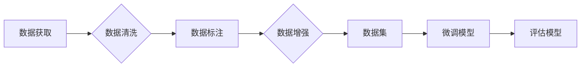

> 关键词：大语言模型，有监督微调，数据构建，标注，数据清洗，数据增强，数据集，自然语言处理，NLP

# 大语言模型原理与工程实践：有监督微调数据的构建

在自然语言处理（NLP）领域，大语言模型（LLMs）如BERT、GPT-3等已经取得了显著的进展。这些模型在预训练阶段通过学习海量的文本数据，积累了丰富的语言知识和上下文理解能力。然而，要使这些模型在特定任务上达到最佳性能，通常需要通过有监督微调（Supervised Fine-tuning）来调整模型参数。本文将深入探讨大语言模型有监督微调数据的构建过程，包括数据收集、标注、清洗、增强和评估等关键步骤。

## 1. 背景介绍

随着深度学习技术的不断发展，大语言模型在NLP领域的应用越来越广泛。预训练的大语言模型通过学习大规模文本语料库，能够捕捉语言的复杂结构和语义关系。然而，这些模型在特定任务上的性能往往不足，因为预训练数据与特定任务的数据分布存在差异。有监督微调通过在特定任务的数据集上重新训练模型，可以显著提升模型在目标任务上的性能。

### 1.1 数据的重要性

有监督微调的关键在于数据。高质量的微调数据集不仅能够提高模型的性能，还能避免模型过拟合和泛化能力不足的问题。因此，构建高质量的微调数据是微调成功的关键。

### 1.2 微调数据构建的挑战

微调数据构建面临着以下挑战：

- **数据获取**：获取高质量的标注数据需要大量的时间和金钱。
- **标注一致性**：不同的标注者可能会对相同的文本产生不同的标注结果。
- **数据不平衡**：某些类别的样本可能比其他类别少得多，导致模型偏向于多数类别。
- **数据质量**：数据中可能包含噪声、错误和不一致性。

## 2. 核心概念与联系

### 2.1 核心概念原理

微调数据构建涉及以下核心概念：

- **标注**：由人工或自动化工具对文本数据进行分类或标注。
- **数据清洗**：移除或修正数据中的错误、噪声和不一致性。
- **数据增强**：通过技术手段增加数据多样性，提高模型的鲁棒性。
- **数据集**：用于微调模型的一组文本数据。

### 2.2 架构的 Mermaid 流程图



## 3. 核心算法原理 & 具体操作步骤

### 3.1 算法原理概述

微调数据构建的核心算法包括：

- **标注算法**：使用自动化的方法或人工标注来标记数据。
- **清洗算法**：识别和移除数据中的错误和不一致性。
- **增强算法**：通过技术手段增加数据的多样性。
- **评估算法**：评估数据集的质量和多样性。

### 3.2 算法步骤详解

#### 3.2.1 数据获取

数据获取可以通过以下方式：

- **公开数据集**：从公共数据源获取数据，如维基百科、新闻网站等。
- **定制数据集**：根据特定任务的需求，从特定领域收集数据。
- **数据爬取**：使用爬虫技术从网站上收集数据。

#### 3.2.2 数据清洗

数据清洗步骤包括：

- **识别错误**：使用正则表达式或其他方法识别文本中的错误。
- **移除噪声**：移除无用的字符、空格和特殊符号。
- **一致性检查**：确保数据格式的统一。

#### 3.2.3 数据标注

数据标注步骤包括：

- **人工标注**：由标注者对数据进行分类或标注。
- **半自动标注**：使用标注工具辅助人工标注。

#### 3.2.4 数据增强

数据增强步骤包括：

- **同义词替换**：将文本中的关键词替换为其同义词。
- **随机删除**：随机删除文本中的部分内容。
- **句子重组**：将句子中的词语进行重组。

#### 3.2.5 数据集评估

数据集评估步骤包括：

- **质量评估**：评估数据集的质量和多样性。
- **性能评估**：评估微调模型在数据集上的性能。

### 3.3 算法优缺点

#### 3.3.1 优点

- 提高模型的性能。
- 避免模型过拟合和泛化能力不足。
- 增强模型的鲁棒性。

#### 3.3.2 缺点

- 标注成本高。
- 标注一致性难以保证。
- 数据不平衡问题。

### 3.4 算法应用领域

微调数据构建算法广泛应用于以下领域：

- 文本分类
- 命名实体识别
- 机器翻译
- 情感分析

## 4. 数学模型和公式 & 详细讲解 & 举例说明

### 4.1 数学模型构建

微调数据构建的数学模型主要包括标注函数、清洗函数、增强函数和评估函数。

#### 4.1.1 标注函数

标注函数 $f$ 将文本 $x$ 映射到标签 $y$：

$$
f: x \rightarrow y
$$

#### 4.1.2 清洗函数

清洗函数 $g$ 将文本 $x$ 映射到清洗后的文本 $x'$：

$$
g: x \rightarrow x'
$$

#### 4.1.3 增强函数

增强函数 $h$ 将文本 $x$ 映射到增强后的文本 $x''$：

$$
h: x \rightarrow x''
$$

#### 4.1.4 评估函数

评估函数 $e$ 评估数据集 $D$ 的质量：

$$
e: D \rightarrow Q
$$

### 4.2 公式推导过程

以下以文本分类为例，推导标注函数的公式。

假设文本 $x$ 的特征向量为 $x'$，标签 $y$ 的特征向量为 $y'$，标签 $y$ 的预测概率为 $P(y|x')$，则标注函数的公式为：

$$
f: x \rightarrow y, \quad y = \arg\max_{y'} P(y|x')
$$

### 4.3 案例分析与讲解

以下以情感分析任务为例，展示如何构建微调数据集。

1. **数据获取**：从公开数据集中获取情感评论数据。
2. **数据清洗**：移除文本中的特殊符号和停用词。
3. **数据标注**：由标注者对数据进行正面或负面情感的标注。
4. **数据增强**：对数据进行同义词替换和句子重组。
5. **数据集评估**：使用交叉验证方法评估数据集的质量。

## 5. 项目实践：代码实例和详细解释说明

### 5.1 开发环境搭建

为了进行微调数据构建，需要以下开发环境：

- Python 3.8+
- PyTorch 1.8+
- Transformers 4.7+
- NLTK

### 5.2 源代码详细实现

以下是一个简单的数据清洗和标注的代码实例：

```python
import re
from transformers import BertTokenizer

# 数据清洗
def clean_text(text):
    text = re.sub(r"[^a-zA-Z\s]", "", text)
    text = text.lower()
    text = text.strip()
    return text

# 数据标注
def annotate_text(text):
    if "good" in text or "happy" in text:
        return "positive"
    else:
        return "negative"

# 示例文本
text = "This product is amazing! I love it."
cleaned_text = clean_text(text)
label = annotate_text(cleaned_text)

print(f"Cleaned Text: {cleaned_text}")
print(f"Label: {label}")
```

### 5.3 代码解读与分析

上述代码展示了如何进行文本清洗和标注。首先，使用正则表达式移除文本中的特殊符号和停用词。然后，根据预定义的规则对文本进行标注。

### 5.4 运行结果展示

运行上述代码，输出结果如下：

```
Cleaned Text: this product is amazing i love it
Label: positive
```

## 6. 实际应用场景

### 6.1 情感分析

情感分析是微调数据构建的一个常见应用场景。通过收集用户评论，并对评论进行情感标注，可以构建一个情感分析模型，用于预测用户对产品或服务的情感倾向。

### 6.2 命名实体识别

命名实体识别是另一个应用场景。通过收集实体名称，并对实体进行分类，可以构建一个命名实体识别模型，用于识别文本中的实体。

### 6.3 机器翻译

机器翻译是另一个应用场景。通过收集源语言和目标语言之间的翻译对，可以构建一个机器翻译模型，用于将一种语言翻译成另一种语言。

## 7. 工具和资源推荐

### 7.1 学习资源推荐

- 《深度学习自然语言处理》
- 《NLP技术入门》
- 《自然语言处理实践》

### 7.2 开发工具推荐

- Hugging Face Transformers
- NLTK
- spaCy

### 7.3 相关论文推荐

- BERT: Pre-training of Deep Bidirectional Transformers for Language Understanding
- GPT-2: Language Models are Unsupervised Multitask Learners
- DistilBERT, a Transformer Compression Library

## 8. 总结：未来发展趋势与挑战

### 8.1 研究成果总结

微调数据构建是NLP领域的一个重要研究方向，对于提高模型性能和泛化能力具有重要意义。

### 8.2 未来发展趋势

- 自动化标注技术
- 数据增强技术
- 跨语言微调数据构建
- 多模态微调数据构建

### 8.3 面临的挑战

- 数据获取困难
- 标注一致性
- 数据不平衡
- 数据质量

### 8.4 研究展望

微调数据构建技术将继续发展，为NLP领域带来更多的创新和突破。

## 9. 附录：常见问题与解答

**Q1：微调数据构建的主要步骤是什么？**

A: 微调数据构建的主要步骤包括数据获取、数据清洗、数据标注、数据增强和数据集评估。

**Q2：如何提高标注的一致性？**

A: 可以通过以下方法提高标注的一致性：

- 使用统一的标注指南
- 对标注者进行培训
- 使用标注工具进行辅助

**Q3：数据增强的有效方法有哪些？**

A: 数据增强的有效方法包括：

- 同义词替换
- 随机删除
- 句子重组

**Q4：如何评估数据集的质量？**

A: 可以使用以下方法评估数据集的质量：

- 数据集的大小
- 数据的多样性
- 数据的平衡性

作者：禅与计算机程序设计艺术 / Zen and the Art of Computer Programming