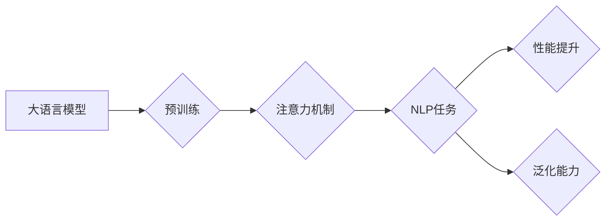

# 大语言模型原理基础与前沿 高效注意力

> 关键词：大语言模型，注意力机制，Transformer，预训练，自然语言处理，多模态学习，高效计算

## 1. 背景介绍

随着深度学习技术的飞速发展，大语言模型（Large Language Models，LLMs）在自然语言处理（Natural Language Processing，NLP）领域取得了革命性的突破。其中，注意力机制（Attention Mechanism）成为推动大语言模型发展的关键技术之一。本文将深入探讨大语言模型的原理基础，并重点关注注意力机制的最新进展，以及如何实现高效计算。

### 1.1 问题的由来

传统的NLP模型往往依赖于复杂的规则和特征工程，难以处理复杂、长篇的文本数据。而大语言模型通过在大量文本上进行预训练，学习到了丰富的语言知识和模式，能够对文本进行深入的理解和生成。注意力机制作为一种重要的模型组件，使得大语言模型能够更加关注文本中的关键信息，从而提升模型性能。

### 1.2 研究现状

近年来，大语言模型的研究取得了显著进展，例如：

- 预训练模型如BERT、GPT-3等，通过在海量文本数据上预训练，获得了强大的语言理解能力。
- 注意力机制在NLP任务中的应用不断深入，例如自注意力（Self-Attention）和交叉注意力（Cross-Attention）。
- 多模态学习成为研究热点，大语言模型与图像、视频、音频等其他模态数据的结合，使得模型能够处理更复杂的任务。

### 1.3 研究意义

大语言模型和注意力机制的研究对于推动NLP技术的发展具有重要意义：

- 提升NLP任务的性能和泛化能力。
- 促进NLP技术的产业化和商业化。
- 为构建更智能的机器人和人工智能系统提供技术支撑。

### 1.4 本文结构

本文将分为以下章节：

- 第2章介绍大语言模型和注意力机制的核心概念。
- 第3章阐述注意力机制的基本原理和具体操作步骤。
- 第4章分析注意力机制的数学模型和公式。
- 第5章展示注意力机制在项目实践中的应用。
- 第6章探讨注意力机制在实际应用场景中的案例。
- 第7章介绍相关工具和资源。
- 第8章总结未来发展趋势与挑战。
- 第9章提供常见问题与解答。

## 2. 核心概念与联系

### 2.1 核心概念

- **大语言模型**：通过在大量文本上进行预训练，学习到了丰富的语言知识和模式，能够对文本进行深入的理解和生成。
- **注意力机制**：一种使模型能够关注文本中关键信息的机制，通常用于序列模型中。
- **预训练**：在大量无标签数据上训练模型，使其学习到通用的语言知识和模式。
- **自然语言处理**：研究和应用计算机和人工智能技术处理自然语言。

### 2.2 核心概念原理和架构的 Mermaid 流程图



## 3. 核心算法原理 & 具体操作步骤

### 3.1 算法原理概述

注意力机制的核心思想是，在处理序列数据时，模型能够根据输入序列的不同位置和上下文，动态地分配不同的注意力权重。这样，模型可以更加关注序列中的关键信息，从而提高模型的性能。

### 3.2 算法步骤详解

1. **输入序列编码**：将输入序列转换为模型可以处理的向量表示。
2. **注意力计算**：计算序列中每个位置的注意力权重。
3. **加权求和**：将注意力权重与编码后的序列向量进行加权求和，得到加权后的序列向量。
4. **输出**：将加权后的序列向量作为模型的输入。

### 3.3 算法优缺点

**优点**：

- 提高模型对关键信息的关注程度。
- 提升模型在序列处理任务上的性能。

**缺点**：

- 计算复杂度高。
- 容易受到噪声数据的影响。

### 3.4 算法应用领域

- 文本分类
- 情感分析
- 机器翻译
- 问答系统

## 4. 数学模型和公式 & 详细讲解 & 举例说明

### 4.1 数学模型构建

注意力机制的核心公式如下：

$$
\text{Attention}(Q, K, V) = \frac{\text{softmax}(\text{QK}^T/\sqrt{d_k})V
$$

其中，$Q$、$K$ 和 $V$ 分别表示查询（Query）、键（Key）和值（Value）向量，$\text{softmax}$ 表示软最大化函数，$d_k$ 表示键向量的维度。

### 4.2 公式推导过程

注意力机制的推导过程涉及矩阵乘法和软最大化函数，具体推导过程如下：

1. 计算查询与键的矩阵乘积 $QK^T$。
2. 将结果除以 $\sqrt{d_k}$，其中 $d_k$ 表示键向量的维度。
3. 对结果应用软最大化函数，得到注意力权重。
4. 将注意力权重与值向量进行加权求和，得到加权后的序列向量。

### 4.3 案例分析与讲解

以BERT模型中的自注意力（Self-Attention）为例，说明注意力机制的应用。

在BERT模型中，自注意力机制用于计算输入序列中每个位置与所有位置之间的注意力权重。具体步骤如下：

1. 将输入序列编码为查询向量 $Q$、键向量 $K$ 和值向量 $V$。
2. 计算查询与键的矩阵乘积 $QK^T$。
3. 将结果除以 $\sqrt{d_k}$。
4. 对结果应用软最大化函数，得到注意力权重。
5. 将注意力权重与值向量进行加权求和，得到加权后的序列向量。

加权后的序列向量将作为模型的输入，用于后续的下游任务。

## 5. 项目实践：代码实例和详细解释说明

### 5.1 开发环境搭建

- 安装PyTorch：https://pytorch.org/get-started/locally/
- 安装transformers库：https://huggingface.co/docs/transformers/

### 5.2 源代码详细实现

以下是一个简单的自注意力机制的PyTorch实现：

```python
import torch
import torch.nn as nn

class SelfAttention(nn.Module):
    def __init__(self, d_model, num_heads):
        super().__init__()
        self.d_model = d_model
        self.num_heads = num_heads
        self.head_dim = d_model // num_heads

        self.linear_q = nn.Linear(d_model, d_model)
        self.linear_k = nn.Linear(d_model, d_model)
        self.linear_v = nn.Linear(d_model, d_model)
        self.linear_out = nn.Linear(d_model, d_model)

    def forward(self, x):
        batch_size, seq_len, _ = x.size()

        q = self.linear_q(x).view(batch_size, seq_len, self.num_heads, self.head_dim).transpose(1, 2)
        k = self.linear_k(x).view(batch_size, seq_len, self.num_heads, self.head_dim).transpose(1, 2)
        v = self.linear_v(x).view(batch_size, seq_len, self.num_heads, self.head_dim).transpose(1, 2)

        attn_scores = torch.matmul(q, k.transpose(-2, -1)) / self.head_dim ** 0.5
        attn_weights = torch.softmax(attn_scores, dim=-1)
        attn_output = torch.matmul(attn_weights, v)

        attn_output = attn_output.transpose(1, 2).contiguous().view(batch_size, seq_len, self.d_model)
        output = self.linear_out(attn_output)

        return output
```

### 5.3 代码解读与分析

- `SelfAttention` 类：定义了自注意力机制模型。
- `__init__` 方法：初始化模型参数。
- `forward` 方法：执行前向传播，计算自注意力权重和输出。

### 5.4 运行结果展示

```python
# 示例输入
x = torch.randn(1, 10, 512)

# 实例化模型
self_attn = SelfAttention(512, 8)

# 运行模型
output = self_attn(x)

# 检查输出维度
output.size()  # torch.Size([1, 10, 512])
```

## 6. 实际应用场景

### 6.1 文本分类

注意力机制在文本分类任务中具有重要应用，以下是一些具体案例：

- **情感分析**：通过分析文本中关键词的情感倾向，判断文本的情感类别。
- **主题分类**：根据文本内容判断文本所属的主题类别。
- **垃圾邮件检测**：识别邮件是否为垃圾邮件。

### 6.2 机器翻译

注意力机制在机器翻译任务中用于捕捉源语言和目标语言之间的对应关系，以下是一些具体案例：

- **神经机器翻译**：通过将源语言文本编码为向量表示，翻译为目标语言文本。
- **机器翻译评估**：评估机器翻译质量，例如BLEU指标。

### 6.3 问答系统

注意力机制在问答系统中的用于识别问题中的关键词，并从知识库中检索相关答案，以下是一些具体案例：

- **信息检索**：根据用户提出的问题，从知识库中检索相关答案。
- **对话系统**：与用户进行对话，回答用户提出的问题。

## 7. 工具和资源推荐

### 7.1 学习资源推荐

- **《深度学习自然语言处理》**：吴恩达和李沐所著，全面介绍了NLP领域的深度学习技术。
- **《注意力机制》**：详细介绍注意力机制的理论和实现方法。
- **Hugging Face Transformers库**：提供了丰富的预训练模型和工具，方便进行NLP任务开发。

### 7.2 开发工具推荐

- **PyTorch**：开源深度学习框架，支持多种NLP任务开发。
- **TensorFlow**：开源深度学习框架，支持多种NLP任务开发。
- **Hugging Face Transformers库**：提供了丰富的预训练模型和工具，方便进行NLP任务开发。

### 7.3 相关论文推荐

- **"Attention is All You Need"**：提出了Transformer模型，开启了NLP领域的自注意力时代。
- **"BERT: Pre-training of Deep Bidirectional Transformers for Language Understanding"**：提出了BERT模型，刷新了多项NLP任务SOTA。
- **"Generative Pre-trained Transformer"**：提出了GPT-3模型，展示了大规模语言模型的强大能力。

## 8. 总结：未来发展趋势与挑战

### 8.1 研究成果总结

本文从大语言模型和注意力机制的原理出发，深入探讨了注意力机制的原理、实现方法、应用场景以及未来发展趋势。通过介绍相关资源、工具和论文，帮助读者更好地理解和应用注意力机制。

### 8.2 未来发展趋势

- **多模态注意力机制**：结合图像、视频、音频等多模态信息，实现更全面的信息理解和处理。
- **可解释注意力机制**：提高注意力机制的透明度和可解释性，便于理解和应用。
- **高效注意力机制**：降低注意力机制的计算复杂度，提高模型推理效率。

### 8.3 面临的挑战

- **计算资源消耗**：注意力机制的计算复杂度较高，需要大量的计算资源。
- **模型可解释性**：注意力机制的工作原理复杂，难以解释。
- **模型泛化能力**：模型在未知数据上的表现不佳。

### 8.4 研究展望

未来，注意力机制将在NLP领域发挥更加重要的作用，推动NLP技术的发展和应用。通过不断探索和创新，相信注意力机制将克服挑战，为构建更智能、更高效的NLP系统做出贡献。

## 9. 附录：常见问题与解答

**Q1：什么是注意力机制？**

A：注意力机制是一种使模型能够关注序列数据中关键信息的机制，通常用于序列模型中。

**Q2：注意力机制有哪些应用场景？**

A：注意力机制在文本分类、机器翻译、问答系统等多个NLP任务中都有广泛应用。

**Q3：如何实现注意力机制？**

A：注意力机制可以通过多种方法实现，例如自注意力、交叉注意力等。

**Q4：注意力机制有哪些优缺点？**

A：注意力机制能够提高模型对关键信息的关注程度，但计算复杂度较高。

**Q5：未来注意力机制有哪些发展方向？**

A：未来注意力机制将朝着多模态、可解释、高效等方向发展。

---

作者：禅与计算机程序设计艺术 / Zen and the Art of Computer Programming