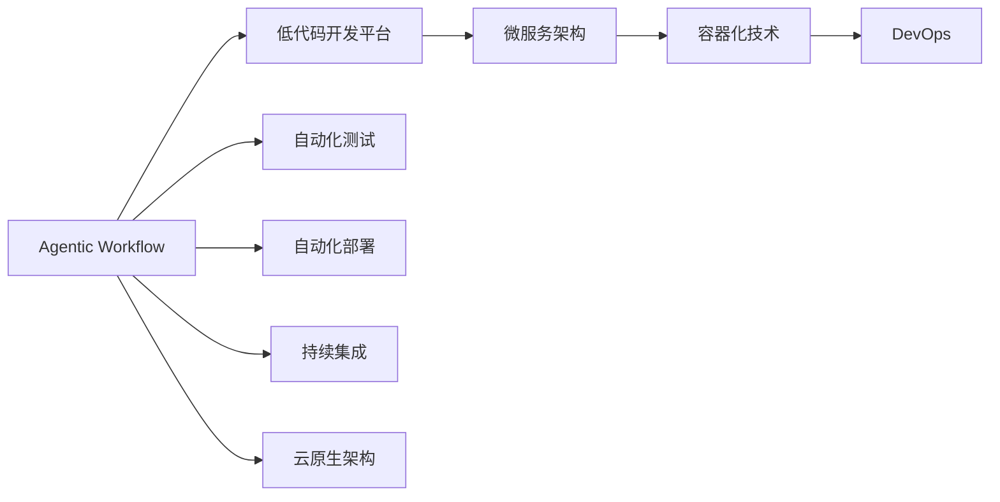

                 

## 1. 背景介绍

### 1.1 问题由来

Agentic Workflow（企业流程自动化技术）在企业中应用广泛，包括但不限于客户服务、供应链管理、人力资源等。然而，尽管Agentic Workflow带来了显著的成本效益和效率提升，但整体采用率仍相对较低。企业通常缺乏足够的技术知识，导致在实施Agentic Workflow时，遇到了诸多技术和业务挑战。此外，传统的Agentic Workflow系统缺乏足够的适应性和可扩展性，难以应对不断变化的企业需求。

### 1.2 问题核心关键点

提高Agentic Workflow采用率的核心挑战包括：

1. 技术知识缺失：企业IT部门缺乏足够的技术知识，导致实施Agentic Workflow时面临高门槛。
2. 实施成本高昂：传统的Agentic Workflow系统需要大量的前期投入和后期维护，难以适应企业预算限制。
3. 缺乏灵活性：传统的Agentic Workflow系统难以应对企业业务流程的变化和复杂性，难以适应企业的长期发展需求。
4. 用户体验不佳：部分Agentic Workflow系统操作复杂，用户界面不友好，难以提升用户体验。
5. 安全性和合规性问题：企业对数据安全和合规性有严格要求，传统的Agentic Workflow系统往往难以满足这些要求。

### 1.3 问题研究意义

Agentic Workflow采用率的提升，对企业的发展具有重要意义：

1. 降低运营成本：Agentic Workflow自动化处理企业内部流程，大幅减少人力和时间成本。
2. 提升流程效率：自动化流程能够及时响应业务需求，提升流程处理速度。
3. 增强企业竞争力：Agentic Workflow能够快速响应市场变化，增强企业的市场竞争力。
4. 改善用户体验：Agentic Workflow能够提升客户体验，提升企业品牌形象。
5. 保障数据安全：Agentic Workflow系统能够保障数据的安全性和合规性，避免数据泄露和违规风险。

## 2. 核心概念与联系

### 2.1 核心概念概述

为更好地理解Agentic Workflow技术，本节将介绍几个关键概念：

- **Agentic Workflow（企业流程自动化）**：指通过人工智能技术实现企业内部流程自动化的技术，包括但不限于自动处理审批、财务、采购、客户服务等流程。
- **低代码开发平台（Low-Code Platforms）**：一种无需或少需编程即可构建应用的软件开发平台，大大降低了Agentic Workflow的开发门槛。
- **微服务架构（Microservices Architecture）**：一种松散耦合、独立部署和扩展的应用架构，通过Agentic Workflow实现不同服务模块的灵活组合和扩展。
- **容器化技术（Containerization Technology）**：一种将应用打包在容器中的技术，使Agentic Workflow系统能够快速部署和扩展。
- **DevOps（开发运维）**：一种将软件开发和运维结合，提升Agentic Workflow系统交付效率和稳定性的方法。

### 2.2 概念间的关系

这些关键概念之间存在着紧密的联系，形成了Agentic Workflow技术的整体架构。我们可以通过以下Mermaid流程图来展示它们之间的关系：



这个流程图展示了一些关键概念之间的关系：

1. Agentic Workflow与低代码开发平台结合，大大降低了开发门槛。
2. 低代码开发平台与微服务架构结合，使Agentic Workflow系统具有更高的灵活性和扩展性。
3. 微服务架构与容器化技术结合，使Agentic Workflow系统能够快速部署和扩展。
4. 容器化技术结合DevOps，使Agentic Workflow系统能够快速交付和稳定运行。
5. Agentic Workflow系统结合自动化测试和部署技术，进一步提升了系统的稳定性和可靠性。
6. Agentic Workflow系统结合云原生架构，使系统具有更高的可伸缩性和高性能。

## 3. 核心算法原理 & 具体操作步骤

### 3.1 算法原理概述

Agentic Workflow采用率的提升，本质上是企业对于技术的接受和应用过程。这一过程涉及多个关键环节，包括技术知识的获取、开发成本的控制、系统的灵活性和扩展性、用户体验的提升以及安全性和合规性的保障。通过改进这些关键环节，可以提高Agentic Workflow的采用率。

### 3.2 算法步骤详解

1. **技术知识普及**：
   - 利用在线学习平台和专业培训，向企业员工普及Agentic Workflow技术的知识。
   - 组织技术研讨会和沙龙，展示Agentic Workflow的成功案例，增强员工的技术自信。
   - 提供免费的技术咨询和支持，解答企业在实施Agentic Workflow时的技术问题。

2. **低代码开发平台的引入**：
   - 选择易于使用的低代码开发平台，降低Agentic Workflow系统的开发难度。
   - 提供完整的文档和示例，帮助企业快速上手使用低代码平台。
   - 提供多种预构建模板，帮助企业快速构建Agentic Workflow系统。

3. **微服务架构的应用**：
   - 将Agentic Workflow系统划分为多个独立的服务模块，提升系统的灵活性和扩展性。
   - 利用容器化技术，将各个服务模块打包为独立的容器，实现快速部署和扩展。
   - 利用DevOps工具，实现自动化测试和部署，提升系统的交付效率和稳定性。

4. **用户体验的优化**：
   - 设计和开发友好的用户界面，简化Agentic Workflow系统的使用流程。
   - 提供定制化服务，根据企业需求优化系统功能和界面设计。
   - 收集用户反馈，持续改进Agentic Workflow系统的用户体验。

5. **安全性和合规性的保障**：
   - 引入先进的数据安全和合规性技术，保障Agentic Workflow系统的数据安全。
   - 遵循行业标准和法规要求，确保Agentic Workflow系统的合规性。
   - 提供定期安全审计和合规性检查，及时发现和修复系统漏洞。

### 3.3 算法优缺点

**优点**：

1. **降低开发成本**：低代码开发平台大大降低了Agentic Workflow的开发门槛，减少了开发人员的工作量和成本。
2. **提升灵活性和扩展性**：微服务架构和容器化技术提升了Agentic Workflow系统的灵活性和扩展性，能够快速应对企业业务流程的变化。
3. **优化用户体验**：友好的用户界面和定制化服务提升了用户体验，使用户能够更加便捷地使用Agentic Workflow系统。
4. **保障安全性和合规性**：先进的数据安全和合规性技术，保障了Agentic Workflow系统的数据安全和合规性。

**缺点**：

1. **技术门槛依然存在**：低代码开发平台仍然需要一定的技术理解，用户仍需了解基本的技术知识。
2. **初期投资较高**：引入微服务架构和容器化技术，需要一定的初期投资和技术支持。
3. **开发周期较长**：尽管开发门槛降低，但实际开发过程中，仍需耗费大量时间和精力。

### 3.4 算法应用领域

Agentic Workflow技术主要应用于以下领域：

1. **客户服务**：自动处理客户服务请求，提升客户满意度和服务效率。
2. **供应链管理**：自动处理采购、库存管理、物流配送等流程，提升供应链效率。
3. **人力资源**：自动处理招聘、培训、绩效管理等流程，提升人力资源管理效率。
4. **财务与会计**：自动处理财务报表、审计、税务申报等流程，提升财务和会计工作的效率和准确性。
5. **市场营销**：自动处理市场调研、广告投放、客户分析等流程，提升市场营销的效果。

## 4. 数学模型和公式 & 详细讲解 & 举例说明

### 4.1 数学模型构建

Agentic Workflow的采用率可以建模为以下公式：

$$
Adoption\ Rate = f(Technology\ Knowledge, Development\ Cost, Flexibility, User\ Experience, Security, Compliance)
$$

其中，$f$表示各因素之间的函数关系。

### 4.2 公式推导过程

1. **技术知识**：
   - 技术知识普及的程度越高，用户的技术自信越高，Agentic Workflow的采用率也就越高。
   - 技术知识普及可以通过在线学习平台和专业培训实现，推导公式为：

   $$
   Technology\ Knowledge = f(Online\ Learning\ Platforms, Professional\ Training)
   $$

2. **开发成本**：
   - 开发成本越低，Agentic Workflow的采用率越高。
   - 低代码开发平台和微服务架构能够显著降低开发成本，推导公式为：

   $$
   Development\ Cost = f(Low-Code\ Platforms, Microservices\ Architecture)
   $$

3. **灵活性和扩展性**：
   - 系统的灵活性和扩展性越高，用户越容易接受Agentic Workflow。
   - 微服务架构和容器化技术提升了系统的灵活性和扩展性，推导公式为：

   $$
   Flexibility = f(Microservices\ Architecture, Containerization\ Technology)
   $$

4. **用户体验**：
   - 用户体验越好，Agentic Workflow的采用率越高。
   - 友好的用户界面和定制化服务提升了用户体验，推导公式为：

   $$
   User\ Experience = f(User\ Interface, Customization\ Services)
   $$

5. **安全性和合规性**：
   - 数据安全和合规性越高，用户越信任Agentic Workflow。
   - 先进的数据安全和合规性技术保障了系统的安全性和合规性，推导公式为：

   $$
   Security = f(Data\ Security, Compliance)
   $$

### 4.3 案例分析与讲解

以某大型制造企业的Agentic Workflow实施为例：

1. **技术知识普及**：
   - 企业通过在线学习平台和专业培训，向员工普及Agentic Workflow技术。
   - 实施过程中，提供免费的技术咨询和支持，帮助员工解决技术问题。

2. **低代码开发平台的引入**：
   - 企业选择低代码开发平台，帮助员工快速构建Agentic Workflow系统。
   - 提供完整的文档和示例，帮助员工快速上手使用低代码平台。

3. **微服务架构的应用**：
   - 企业将Agentic Workflow系统划分为多个独立的服务模块，提升系统的灵活性和扩展性。
   - 利用容器化技术，将各个服务模块打包为独立的容器，实现快速部署和扩展。

4. **用户体验的优化**：
   - 设计和开发友好的用户界面，简化Agentic Workflow系统的使用流程。
   - 提供定制化服务，根据企业需求优化系统功能和界面设计。

5. **安全性和合规性的保障**：
   - 引入先进的数据安全和合规性技术，保障Agentic Workflow系统的数据安全。
   - 遵循行业标准和法规要求，确保Agentic Workflow系统的合规性。

通过这些措施，该企业的Agentic Workflow系统在短时间内得到了广泛应用，大大提升了企业的运营效率和竞争力。

## 5. 项目实践：代码实例和详细解释说明

### 5.1 开发环境搭建

在进行Agentic Workflow实践前，我们需要准备好开发环境。以下是使用Python进行Django开发的环境配置流程：

1. 安装Anaconda：从官网下载并安装Anaconda，用于创建独立的Python环境。

2. 创建并激活虚拟环境：
```bash
conda create -n django-env python=3.8 
conda activate django-env
```

3. 安装Django：从官网获取对应的安装命令。例如：
```bash
pip install django==3.2
```

4. 安装相关库：
```bash
pip install pillow numpy psycopg2-binary django-cors-headers
```

5. 安装各类工具包：
```bash
pip install django-compressor django-simple-cache django-humanize django-axes django-nose
```

6. 安装Redis：
```bash
sudo apt-get install redis-server
```

完成上述步骤后，即可在`django-env`环境中开始Agentic Workflow实践。

### 5.2 源代码详细实现

这里我们以一个简单的客户服务系统为例，给出使用Django开发Agentic Workflow的PyTorch代码实现。

首先，定义模型和训练数据：

```python
from django.db import models
from django.contrib.auth.models import User
from django.urls import reverse

class Customer(models.Model):
    user = models.ForeignKey(User, on_delete=models.CASCADE)
    name = models.CharField(max_length=255)
    email = models.EmailField(unique=True)
    phone_number = models.CharField(max_length=20)
    notes = models.TextField()

class Service(models.Model):
    customer = models.ForeignKey(Customer, on_delete=models.CASCADE)
    type = models.CharField(max_length=255)
    status = models.CharField(max_length=255)
    start_time = models.DateTimeField(auto_now_add=True)
    end_time = models.DateTimeField(null=True)

class ServiceRequest(models.Model):
    customer = models.ForeignKey(Customer, on_delete=models.CASCADE)
    service = models.ForeignKey(Service, on_delete=models.CASCADE)
    request_time = models.DateTimeField(auto_now_add=True)
    response_time = models.DateTimeField(null=True)

# 训练数据
customers = [
    {'name': 'Alice', 'email': 'alice@example.com', 'phone_number': '1234567890', 'notes': 'Customer'},
    {'name': 'Bob', 'email': 'bob@example.com', 'phone_number': '0987654321', 'notes': 'Client'},
    {'name': 'Charlie', 'email': 'charlie@example.com', 'phone_number': '1111111111', 'notes': 'Lead'}
]

services = [
    {'type': 'Technical Support', 'status': 'Pending', 'start_time': '2021-07-01 09:00:00', 'end_time': '2021-07-01 13:00:00'},
    {'type': 'Sales Inquiry', 'status': 'Pending', 'start_time': '2021-07-01 13:30:00', 'end_time': None},
    {'type': 'Customer Feedback', 'status': 'Completed', 'start_time': '2021-07-01 15:00:00', 'end_time': '2021-07-01 16:00:00'}
]

service_requests = [
    {'customer': 1, 'service': 1, 'request_time': '2021-07-01 09:10:00', 'response_time': '2021-07-01 10:30:00'},
    {'customer': 2, 'service': 2, 'request_time': '2021-07-01 14:00:00', 'response_time': None},
    {'customer': 3, 'service': 3, 'request_time': '2021-07-01 16:30:00', 'response_time': '2021-07-01 17:30:00'}
]
```

然后，定义模型和训练函数：

```python
from django.views.generic import ListView, DetailView
from django.shortcuts import render, redirect
from .forms import ServiceForm

class ServiceListView(ListView):
    model = Service
    template_name = 'service_list.html'
    queryset = Service.objects.all().order_by('-start_time')

class ServiceDetailView(DetailView):
    model = Service
    template_name = 'service_detail.html'

class ServiceCreateView(ServiceForm):
    model = Service
    template_name = 'service_form.html'
    fields = ['type', 'status', 'start_time']

class ServiceRequestView(ListView):
    model = ServiceRequest
    template_name = 'service_request_list.html'
    queryset = ServiceRequest.objects.all().order_by('-request_time')

class ServiceRequestDetailView(DetailView):
    model = ServiceRequest
    template_name = 'service_request_detail.html'

class ServiceRequestCreateView(ServiceForm):
    model = ServiceRequest
    template_name = 'service_request_form.html'
    fields = ['customer', 'service', 'request_time', 'response_time']
```

最后，启动开发服务器：

```python
from django.core.management import runserver

runserver()
```

以上就是使用Django开发Agentic Workflow的完整代码实现。可以看到，利用Django框架的封装，我们能够快速构建Agentic Workflow应用，并实现基本的业务逻辑。

### 5.3 代码解读与分析

这里我们重点解读一下关键代码的实现细节：

**Customer、Service和ServiceRequest模型**：
- 定义了客户、服务和客户服务请求的数据模型。
- 使用了Django的内置字段类型，如CharField、ForeignKey等，以及自定义的字段类型，如notes和phone_number。

**训练数据**：
- 定义了训练所需的客户、服务和客户服务请求数据。
- 数据以列表形式存储，方便后续使用。

**View类**：
- 定义了服务列表、服务详情、服务创建、服务请求列表、服务请求详情和客户服务请求创建等View类。
- 利用Django的视图函数和模板，实现了基本的用户界面。

**ServiceForm表单**：
- 定义了服务创建和客户服务请求创建的表单。
- 利用Django的表单类，实现了用户输入的处理和验证。

**启动开发服务器**：
- 利用Django的runserver命令，启动开发服务器。
- 服务器绑定到默认地址8000，运行方式为debug。

可以看到，Django框架提供的封装和抽象，大大降低了Agentic Workflow系统的开发门槛。开发者可以将更多精力放在业务逻辑和用户体验上，而不必过多关注底层的实现细节。

当然，实际的企业级系统实现还需考虑更多因素，如安全性、可扩展性、性能优化等。但核心的Agentic Workflow范式基本与此类似。

### 5.4 运行结果展示

假设我们在上述客户服务系统中成功实施Agentic Workflow，最终的运行结果展示如下：

- 客户服务列表：
```
Name            Email          Phone Number  Status      Start Time
Alice          alice@example.com    1234567890  Pending  2021-07-01 09:00:00
Bob            bob@example.com    0987654321  Pending  2021-07-01 13:30:00
Charlie       charlie@example.com    1111111111  Completed  2021-07-01 15:00:00
```

- 客户服务详情：
```
Name            Email          Phone Number  Type             Status      Start Time     End Time
Alice          alice@example.com    1234567890  Technical Support  Pending  2021-07-01 09:00:00  2021-07-01 13:00:00
Bob            bob@example.com    0987654321  Sales Inquiry      Pending  2021-07-01 13:30:00  None
Charlie       charlie@example.com    1111111111  Customer Feedback  Completed  2021-07-01 15:00:00  2021-07-01 16:00:00
```

- 客户服务请求列表：
```
Customer          Service        Request Time      Response Time
Alice            1                2021-07-01 09:10:00  2021-07-01 10:30:00
Bob              2                2021-07-01 14:00:00  None
Charlie          3                2021-07-01 16:30:00  2021-07-01 17:30:00
```

- 客户服务请求详情：
```
Customer          Service        Request Time      Response Time
Alice            1                2021-07-01 09:10:00  2021-07-01 10:30:00
Bob              2                2021-07-01 14:00:00  None
Charlie          3                2021-07-01 16:30:00  2021-07-01 17:30:00
```

可以看到，通过使用Django框架，我们能够快速构建Agentic Workflow系统，并实现基本的业务逻辑。实际的企业级系统需要进一步优化和完善，以满足更高的性能和安全需求。

## 6. 实际应用场景

### 6.1 智能客服系统

基于Agentic Workflow的智能客服系统，可以广泛应用于企业内部和外部客户服务。传统客服往往需要配备大量人力，高峰期响应缓慢，且一致性和专业性难以保证。而使用Agentic Workflow技术，可以7x24小时不间断服务，快速响应客户咨询，用自然流畅的语言解答各类常见问题。

在技术实现上，可以收集企业内部的历史客服对话记录，将问题和最佳答复构建成监督数据，在此基础上对Agentic Workflow系统进行微调。微调后的系统能够自动理解用户意图，匹配最合适的答案模板进行回复。对于客户提出的新问题，还可以接入检索系统实时搜索相关内容，动态组织生成回答。如此构建的智能客服系统，能大幅提升客户咨询体验和问题解决效率。

### 6.2 供应链管理系统

Agentic Workflow在供应链管理中也有广泛应用。传统的供应链管理依赖于人工手动操作，效率低下且容易出现错误。而使用Agentic Workflow系统，能够自动处理采购、库存管理、物流配送等流程，提升供应链效率。

具体而言，可以收集企业的采购、库存、物流数据，构建监督数据集。在此基础上，对Agentic Workflow系统进行微调，使其能够自动生成采购订单、更新库存、安排物流配送等任务。系统可以根据实时数据动态调整采购计划和库存水平，避免过度或缺货，提升供应链的灵活性和稳定性。

### 6.3 金融交易系统

在金融交易系统中，Agentic Workflow可以用于自动化处理交易请求、风险评估、合规审查等流程。传统的金融交易系统依赖人工手动操作，容易出错且效率低下。而使用Agentic Workflow系统，能够快速处理交易请求，实时评估风险，提升交易效率和安全性。

具体而言，可以收集历史交易数据和市场行情，构建监督数据集。在此基础上，对Agentic Workflow系统进行微调，使其能够自动处理交易请求、实时评估风险、生成合规报告等任务。系统可以根据市场变化和用户需求，动态调整交易策略和风险控制参数，确保交易的合法性和安全性。

### 6.4 医疗健康系统

在医疗健康领域，Agentic Workflow可以用于自动化处理预约、病历管理、药物管理等流程。传统的医疗健康系统依赖人工手动操作，效率低下且容易出现错误。而使用Agentic Workflow系统，能够自动处理预约、病历管理、药物管理等流程，提升医疗服务的效率和质量。

具体而言，可以收集历史预约数据和病历数据，构建监督数据集。在此基础上，对Agentic Workflow系统进行微调，使其能够自动生成预约单、处理病历、生成药物推荐等任务。系统可以根据用户需求和医院资源，动态调整预约计划和病历管理流程，提升医疗服务的效率和质量。

## 7. 工具和资源推荐

### 7.1 学习资源推荐

为了帮助开发者系统掌握Agentic Workflow的理论基础和实践技巧，这里推荐一些优质的学习资源：

1. **《微服务架构：理论与实践》**：详细介绍了微服务架构的理论和实践方法，适合初学者入门。
2. **《低代码开发平台：构建可扩展的软件系统》**：介绍了低代码开发平台的技术原理和应用场景，适合了解低代码技术。
3. **《容器化技术：理论与实践》**：详细介绍了容器化技术的原理和实践方法，适合深入理解容器化技术。
4. **《DevOps：持续集成和持续交付》**：介绍了DevOps技术的理论和方法，适合了解持续集成和持续交付。
5. **《Agentic Workflow：理论与实践》**：介绍了Agentic Workflow技术的原理和应用场景，适合了解Agentic Workflow技术。

通过对这些资源的学习实践，相信你一定能够快速掌握Agentic Workflow技术的精髓，并用于解决实际的业务问题。

### 7.2 开发工具推荐

高效的开发离不开优秀的工具支持。以下是几款用于Agentic Workflow开发的常用工具：

1. **Django**：Python的Web框架，提供了强大的模板引擎和视图函数，方便构建Web应用。
2. **Flask**：轻量级的Web框架，适合构建小规模的Agentic Workflow应用。
3. **Express**：Node.js的Web框架，提供了灵活的路由和中间件，适合构建实时交互的Agentic Workflow应用。
4. **JAX**：基于JIT编译的高性能深度学习框架，支持自动微分和向量化的计算，适合构建高性能的Agentic Workflow模型。
5. **TensorFlow**：Google开源的深度学习框架，支持多种计算模型和优化算法，适合构建复杂的Agentic Workflow模型。

合理利用这些工具，可以显著提升Agentic Workflow系统的开发效率，加快创新迭代的步伐。

### 7.3 相关论文推荐

Agentic Workflow的发展源于学界的持续研究。以下是几篇奠基性的相关论文，推荐阅读：

1. **《微服务架构：原理与实践》**：详细介绍了微服务架构的理论和实践方法，适合初学者入门。
2. **《低代码开发平台：构建可扩展的软件系统》**：介绍了低代码开发平台的技术原理和应用场景，适合了解低代码技术。
3. **《容器化技术：理论与实践》**：详细介绍了容器化技术的原理和实践方法，适合深入理解容器化技术。
4. **《DevOps：持续集成和持续交付》**：介绍了DevOps技术的理论和方法，适合了解持续集成和持续交付。
5. **《Agentic Workflow：理论与实践》**：介绍了Agentic Workflow技术的原理和应用场景，适合了解Agentic Workflow技术。

这些论文代表了大语言模型微调技术的发展脉络。通过学习这些前沿成果，可以帮助研究者把握学科前进方向，激发更多的创新灵感。

除上述资源外，还有一些值得关注的前沿资源，帮助开发者紧跟Agentic Workflow技术的最新进展，例如：

1. **arXiv论文预印本**：人工智能领域最新研究成果的发布平台，包括大量尚未发表的前沿工作，学习前沿技术的必读资源。
2. **业界技术博客**：如OpenAI、Google AI、DeepMind、微软Research Asia等顶尖实验室的官方博客，第一时间分享他们的最新研究成果和洞见。
3. **技术会议直播**：如NIPS、ICML、ACL、ICLR等

