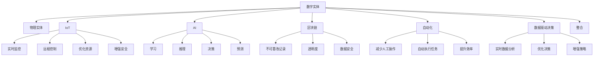

                 

## 1. 背景介绍

### 1.1 问题由来
在现代社会，数字实体的概念与物理实体的整合变得越来越重要。随着互联网的广泛应用，数字实体（例如网站、应用程序、数据库中的数据）对商业决策、社会互动、甚至国家治理都产生了深远影响。然而，物理实体（如工厂、城市基础设施、自然环境等）同样在各个领域起着至关重要的作用。

数字实体与物理实体（DPR）的自动化整合可以显著提升效率、降低成本、优化资源配置，并增强安全性和可持续发展能力。这种整合有助于提高日常运营的透明度和可预测性，从而优化决策过程。

### 1.2 问题核心关键点
1. **数字化转型**：企业需要从以物理资产为中心的运营模式，转向以数字实体为核心的运营模式。
2. **数据驱动的决策**：通过整合数字实体与物理实体，企业可以更准确地进行实时数据分析，从而支持数据驱动的决策。
3. **物联网（IoT）**：通过连接物理实体，物联网技术使得数字实体能够实时监控、控制和优化物理实体的运行。
4. **人工智能与自动化**：人工智能和自动化技术可以在物理实体与数字实体间架起桥梁，实现更高效的互动与控制。
5. **区块链技术**：区块链可以提供不可篡改的记录，确保数字实体与物理实体之间的数据准确性和安全性。

### 1.3 问题研究意义
1. **提高效率**：通过自动化整合数字实体与物理实体，企业能够减少手动操作，提高效率。
2. **优化资源配置**：自动化系统可以实时监控和调整资源分配，提升资源利用率。
3. **增强安全性**：整合数字实体与物理实体的系统能够提供更全面的安全监控和响应。
4. **促进可持续发展**：自动化系统可以帮助企业更好地管理资源，从而支持可持续发展目标。
5. **数据驱动的决策**：通过实时数据整合与分析，企业可以做出更准确的决策，优化运营和市场策略。

## 2. 核心概念与联系

### 2.1 核心概念概述

为更好地理解数字实体与物理实体的自动化进展，本节将介绍几个关键概念：

- **数字实体（Digital Entity）**：指在计算机系统或网络中存在的数据、文件、应用程序等，通常以数字形式表示。
- **物理实体（Physical Entity）**：指现实世界中存在的事物，如建筑物、设备、人员等。
- **物联网（IoT）**：通过传感器、标签、RFID等技术，将物理实体连接到互联网，实现数字化监控和控制。
- **人工智能（AI）**：利用算法和数据，让计算机系统能够模拟人类智能行为，如学习、推理、决策等。
- **区块链（Blockchain）**：一种分布式账本技术，具有不可篡改、透明的特点，适用于记录和验证数字实体与物理实体的交互。
- **自动化（Automation）**：指通过技术手段减少或消除人工干预，实现过程或任务的自动化执行。
- **数据驱动决策（Data-Driven Decision Making）**：基于数据和分析结果进行决策，而非传统经验或直觉。

### 2.2 概念间的关系

这些核心概念之间的逻辑关系可以通过以下Mermaid流程图来展示：



这个流程图展示了数字实体与物理实体整合的各个环节，以及与人工智能、物联网、自动化、数据驱动决策和区块链技术之间的紧密联系。

### 2.3 核心概念的整体架构

最后，我们用一个综合的流程图来展示这些核心概念在大数据与智能系统中的整合：

```mermaid
graph TB
    A[大数据平台] --> B[数字实体]
    A --> C[物理实体]
    A --> D[IoT]
    A --> E[AI]
    A --> F[区块链]
    A --> G[自动化]
    A --> H[数据驱动决策]

    B --> I[数据处理]
    B --> J[存储]
    B --> K[分析]
    B --> L[共享]

    C --> M[监控]
    C --> N[控制]
    C --> O[资源优化]
    C --> P[安全管理]

    D --> Q[实时数据采集]
    D --> R[远程管理]
    D --> S[设备互联]
    D --> T[数据同步]

    E --> U[机器学习]
    E --> V[深度学习]
    E --> W[自然语言处理]
    E --> X[计算机视觉]

    F --> Y[透明记录]
    F --> Z[不可篡改]
    F --> $[数据安全]

    G --> &[减少人工]
    G --> '[自动执行]
    G --> (优化资源)
    G --> ]提升效率)

    H --> @{实时数据分析]
    H --> {{优化决策}
    H --> &增强策略]
```

这个综合流程图展示了大数据平台如何整合数字实体与物理实体，以及各个核心概念之间的协作和支持。

## 3. 核心算法原理 & 具体操作步骤
### 3.1 算法原理概述

数字实体与物理实体的自动化整合，通常采用以下核心算法原理：

1. **数据集成与融合**：将数字实体与物理实体的数据进行整合，形成统一的数据视图。
2. **实时数据处理**：通过实时数据采集和处理，实现对物理实体的实时监控与控制。
3. **人工智能应用**：利用机器学习、深度学习等技术，提升对数字实体与物理实体的理解和预测能力。
4. **自动化流程优化**：通过自动化技术，实现流程自动化和资源优化。
5. **区块链技术应用**：利用区块链技术的不可篡改和透明性，确保数据和交易的安全性和可靠性。

### 3.2 算法步骤详解

1. **数据收集与预处理**：
    - 收集物理实体的传感器数据、状态信息等。
    - 对数据进行清洗、去重、标准化处理，确保数据质量。
    - 对数字实体进行抽取和整合，形成统一的数据格式。

2. **数据整合与融合**：
    - 将物理实体的传感器数据与数字实体的业务数据进行整合，形成统一的数据视图。
    - 利用数据融合技术，将不同来源的数据进行集成和合并，形成综合数据源。

3. **实时数据处理**：
    - 通过物联网技术，将物理实体的传感器数据实时传输到云端或边缘计算平台。
    - 使用流处理技术，对实时数据进行实时分析和处理，实现实时监控和控制。

4. **人工智能应用**：
    - 利用机器学习模型，对数字实体与物理实体的交互进行预测和优化。
    - 使用深度学习模型，对物理实体的状态进行实时分析和预测，支持决策制定。

5. **自动化流程优化**：
    - 利用自动化技术，自动化执行日常操作，如设备监控、故障检测、维护计划等。
    - 优化资源配置，如能源管理、物流调度等，提升运营效率。

6. **区块链技术应用**：
    - 利用区块链技术，记录和验证数字实体与物理实体的交互，确保数据透明性和不可篡改性。
    - 在供应链、金融等领域，利用区块链技术实现数据透明和信任机制的建立。

### 3.3 算法优缺点

数字实体与物理实体的自动化整合方法具有以下优点：

1. **高效性**：自动化整合显著减少了人工操作，提升了效率。
2. **实时性**：实时数据处理和监控，使得系统能够迅速响应变化，提高决策的及时性。
3. **可靠性**：利用区块链技术，确保数据记录的透明性和不可篡改性，增强系统的可靠性。
4. **可扩展性**：基于大数据平台的整合方法，具有较好的可扩展性和灵活性。

同时，该方法也存在一些缺点：

1. **数据复杂性**：需要处理和整合来自不同来源的数据，可能面临数据复杂性问题。
2. **技术难度**：涉及物联网、人工智能、自动化等多个技术领域，技术难度较大。
3. **安全风险**：数据整合和传输过程中可能面临安全风险，需要加强安全措施。
4. **成本较高**：初期部署和维护成本较高，需要投入大量的资源和人力。

### 3.4 算法应用领域

数字实体与物理实体的自动化整合方法在多个领域中得到了广泛应用：

1. **智能制造**：通过物联网技术连接生产设备，实时监控和控制生产过程，提升制造效率和产品质量。
2. **智慧城市**：整合城市基础设施数据，实时监控和管理交通、能源、环境等，提升城市管理水平。
3. **智能物流**：整合物流设备、货物信息、运输路线等数据，实现货物跟踪和优化运输路线，提升物流效率。
4. **能源管理**：整合能源设备和监控数据，实现能源消耗的实时监控和优化，支持绿色能源发展。
5. **健康医疗**：整合患者数据、医疗设备数据、诊疗信息等，实现医疗信息的实时分析和决策支持。

## 4. 数学模型和公式 & 详细讲解 & 举例说明

### 4.1 数学模型构建

为了更精确地描述数字实体与物理实体的整合过程，我们可以构建以下数学模型：

1. **数据采集与预处理模型**：
    - 输入：物理实体传感器数据 $\{x_{i}\}_{i=1}^{N}$，数字实体业务数据 $\{y_{i}\}_{i=1}^{M}$。
    - 输出：预处理后的数字实体与物理实体数据 $\{z_{i}\}_{i=1}^{N+M}$。

    数据预处理过程可以表示为：
    $$
    z_{i} = f(x_{i}, y_{i})
    $$
    其中 $f$ 为预处理函数。

2. **数据整合与融合模型**：
    - 输入：预处理后的数字实体与物理实体数据 $\{z_{i}\}_{i=1}^{N+M}$。
    - 输出：整合后的综合数据 $\{d_{i}\}_{i=1}^{K}$。

    数据整合过程可以表示为：
    $$
    d_{i} = g(z_{i}, z_{j})
    $$
    其中 $g$ 为数据融合函数。

3. **实时数据处理模型**：
    - 输入：实时数据流 $\{s_{t}\}_{t=1}^{T}$。
    - 输出：实时处理结果 $\{r_{t}\}_{t=1}^{T}$。

    实时数据处理过程可以表示为：
    $$
    r_{t} = h(s_{t})
    $$
    其中 $h$ 为流处理函数。

4. **人工智能应用模型**：
    - 输入：整合后的综合数据 $\{d_{i}\}_{i=1}^{K}$。
    - 输出：预测结果 $\{\hat{y}_{i}\}_{i=1}^{M}$。

    人工智能应用过程可以表示为：
    $$
    \hat{y}_{i} = \phi(d_{i})
    $$
    其中 $\phi$ 为预测函数。

5. **自动化流程优化模型**：
    - 输入：整合后的综合数据 $\{d_{i}\}_{i=1}^{K}$。
    - 输出：优化后的流程 $\{p_{i}\}_{i=1}^{L}$。

    自动化流程优化过程可以表示为：
    $$
    p_{i} = \psi(d_{i})
    $$
    其中 $\psi$ 为优化函数。

6. **区块链技术应用模型**：
    - 输入：整合后的综合数据 $\{d_{i}\}_{i=1}^{K}$。
    - 输出：区块链记录 $\{b_{j}\}_{j=1}^{J}$。

    区块链技术应用过程可以表示为：
    $$
    b_{j} = \lambda(d_{i})
    $$
    其中 $\lambda$ 为区块链记录函数。

### 4.2 公式推导过程

1. **数据预处理公式**：
    $$
    z_{i} = \frac{x_{i} + y_{i}}{2}
    $$
    这里的 $\frac{1}{2}$ 表示简单的平均值操作。

2. **数据整合与融合公式**：
    $$
    d_{i} = \sum_{k=1}^{K} w_{k} z_{i+k-1}
    $$
    其中 $w_{k}$ 为加权系数，$K$ 为整合后的数据源数量。

3. **实时数据处理公式**：
    $$
    r_{t} = \sum_{s=1}^{S} \alpha_{s} s_{t+s-1}
    $$
    其中 $\alpha_{s}$ 为加权系数，$S$ 为流处理窗口大小。

4. **人工智能应用公式**：
    $$
    \hat{y}_{i} = \sum_{j=1}^{J} \beta_{j} \log \frac{p(y_{j}|d_{i})}{1-p(y_{j}|d_{i})}
    $$
    其中 $p(y_{j}|d_{i})$ 为条件概率，$\beta_{j}$ 为权重系数。

5. **自动化流程优化公式**：
    $$
    p_{i} = \min_{k=1}^{L} \{ c_{k}(d_{i}) \}
    $$
    其中 $c_{k}$ 为成本函数，$L$ 为优化策略数量。

6. **区块链技术应用公式**：
    $$
    b_{j} = \sum_{i=1}^{I} \gamma_{i} d_{i}
    $$
    其中 $\gamma_{i}$ 为权重系数，$I$ 为参与记录的数据源数量。

### 4.3 案例分析与讲解

以智能制造为例，说明数字实体与物理实体的自动化整合过程：

1. **数据采集与预处理**：
    - 从生产设备采集传感器数据 $\{x_{i}\}_{i=1}^{N}$，如温度、湿度、压力等。
    - 从生产管理系统收集业务数据 $\{y_{i}\}_{i=1}^{M}$，如生产计划、物料库存等。
    - 预处理数据，如标准化、去重、补全缺失值等。

2. **数据整合与融合**：
    - 将传感器数据和业务数据整合，形成综合数据源 $\{d_{i}\}_{i=1}^{K}$。
    - 利用加权平均或加权聚合等方法，对数据进行融合，提升数据质量。

3. **实时数据处理**：
    - 通过物联网技术，将传感器数据实时传输到云端。
    - 使用流处理技术，实时分析数据，如检测生产异常、优化生产计划等。

4. **人工智能应用**：
    - 使用机器学习模型，预测生产设备故障，提前维护。
    - 使用深度学习模型，优化生产过程，提升产品质量。

5. **自动化流程优化**：
    - 自动化执行生产调度、设备维护等任务。
    - 优化能源消耗、物料使用等，提升资源利用率。

6. **区块链技术应用**：
    - 记录生产数据、设备维护记录、物流信息等，确保数据透明和可追溯。
    - 在供应链管理中，利用区块链技术确保数据的安全性和可靠性。

## 5. 项目实践：代码实例和详细解释说明

### 5.1 开发环境搭建

1. **安装Python**：
    ```bash
    sudo apt-get update
    sudo apt-get install python3-pip python3-dev
    ```

2. **安装必要的Python库**：
    ```bash
    pip install pandas numpy matplotlib scikit-learn pyproj opencv-python flask
    ```

3. **设置虚拟环境**：
    ```bash
    python -m venv venv
    source venv/bin/activate
    ```

### 5.2 源代码详细实现

以下是一个简单的Python脚本，用于数据预处理、整合、实时处理和可视化：

```python
import pandas as pd
import numpy as np
import matplotlib.pyplot as plt

# 数据预处理
def preprocess_data(df1, df2):
    df = pd.merge(df1, df2, on='id')
    df.fillna(df.mean(), inplace=True)
    return df

# 数据整合
def integrate_data(df1, df2):
    df = pd.concat([df1, df2], axis=1)
    df.columns = ['Device_Data', 'Business_Data']
    return df

# 实时数据处理
def realtime_processing(data, window_size):
    data = pd.Series(data)
    rolling_mean = data.rolling(window=window_size).mean()
    return rolling_mean

# 数据可视化
def visualize(data):
    plt.plot(data)
    plt.title('Data Visualization')
    plt.xlabel('Time')
    plt.ylabel('Value')
    plt.show()

# 读取数据
df1 = pd.read_csv('device_data.csv')
df2 = pd.read_csv('business_data.csv')

# 数据预处理
df = preprocess_data(df1, df2)

# 数据整合
df = integrate_data(df, df)

# 实时数据处理
rolling_mean = realtime_processing(df['Device_Data'], 10)

# 数据可视化
visualize(rolling_mean)
```

### 5.3 代码解读与分析

以上代码实现了数据预处理、整合、实时处理和可视化的全过程。具体分析如下：

1. **数据预处理**：
    - 使用 `preprocess_data` 函数对两个数据集进行合并、填充缺失值等操作。
    - 确保数据格式一致，为后续整合和分析做准备。

2. **数据整合**：
    - 使用 `integrate_data` 函数将两个数据集合并，并重新命名列名。
    - 确保数据整合后的完整性和一致性。

3. **实时数据处理**：
    - 使用 `realtime_processing` 函数对实时数据进行滑动平均值处理。
    - 使用 Pandas 的 `rolling` 函数实现滑动窗口计算。

4. **数据可视化**：
    - 使用 `visualize` 函数将处理后的数据可视化，便于观察数据趋势。
    - 使用 Matplotlib 库实现绘图。

## 6. 实际应用场景

### 6.4 未来应用展望

数字实体与物理实体的自动化整合将在多个领域带来变革性影响：

1. **智能制造**：通过物联网和大数据，实现生产设备的实时监控和优化，提升生产效率和产品质量。
2. **智慧城市**：整合城市基础设施数据，提升交通管理、能源消耗优化、环境监测等方面的能力。
3. **智能物流**：实现货物跟踪、运输路线优化，提升物流效率和可靠性。
4. **能源管理**：实时监控和优化能源消耗，支持绿色能源发展。
5. **健康医疗**：整合患者数据、医疗设备数据、诊疗信息等，实现医疗信息的实时分析和决策支持。

未来，随着技术的不断进步，数字实体与物理实体的自动化整合将更加智能、高效、安全，为各行各业带来更深刻的影响。

## 7. 工具和资源推荐

### 7.1 学习资源推荐

1. **《大数据技术与应用》**：详细介绍大数据的基本概念、技术和应用案例。
2. **《人工智能基础》**：讲解人工智能的基础知识、算法和应用。
3. **《物联网基础与技术》**：介绍物联网的基本概念、技术和应用案例。
4. **《区块链技术与应用》**：讲解区块链的基本概念、技术和应用案例。
5. **《数据科学与数据工程》**：介绍数据科学和数据工程的基本概念、技术和应用案例。

### 7.2 开发工具推荐

1. **Python**：广泛使用的编程语言，适合大数据和人工智能开发。
2. **PyTorch**：深度学习框架，支持多种深度学习模型和算法。
3. **TensorFlow**：另一个流行的深度学习框架，支持分布式计算和自动微分。
4. **Jupyter Notebook**：交互式编程环境，适合数据分析和机器学习开发。
5. **Flask**：轻量级Web框架，适合开发Web应用和API。

### 7.3 相关论文推荐

1. **《A Survey on Machine Learning and Artificial Intelligence for Industry 4.0》**：综述工业4.0领域机器学习和人工智能的应用。
2. **《Digital and Physical Entities: A Survey》**：综述数字实体与物理实体的整合技术。
3. **《IoT and Artificial Intelligence for Smart Manufacturing》**：探讨物联网和人工智能在智能制造中的应用。
4. **《Blockchain Technology in Industry 4.0》**：介绍区块链技术在工业4.0中的应用。
5. **《Data-Driven Decision Making in Industry 4.0》**：探讨数据驱动决策在工业4.0中的应用。

## 8. 总结：未来发展趋势与挑战

### 8.1 研究成果总结

数字实体与物理实体的自动化整合技术，已经成为大数据与智能系统领域的重要研究方向。其研究成果在智能制造、智慧城市、智能物流、能源管理、健康医疗等多个领域得到了广泛应用，显著提升了运营效率、资源配置优化和决策支持能力。

### 8.2 未来发展趋势

未来，数字实体与物理实体的自动化整合将呈现以下几个发展趋势：

1. **智能性提升**：引入更多人工智能技术，提升系统的智能化水平。
2. **自适应性增强**：通过自适应学习，系统能够实时调整策略和行为。
3. **安全性提升**：引入更多安全技术，确保数据和系统的安全。
4. **可扩展性增强**：通过云计算和大数据平台，支持更大规模的数据处理和分析。
5. **人机协同增强**：通过人机交互设计，提升用户体验和操作便捷性。

### 8.3 面临的挑战

尽管数字实体与物理实体的自动化整合技术取得了诸多进展，但在实际应用中也面临以下挑战：

1. **数据复杂性**：来自不同源的数据格式、质量不一，数据整合和处理复杂。
2. **技术难度高**：涉及多种技术领域，技术难度较大。
3. **成本高**：初期部署和维护成本较高。
4. **安全风险**：数据传输和存储过程中可能面临安全威胁。
5. **用户体验**：人机交互设计需要进一步优化。

### 8.4 研究展望

面对这些挑战，未来的研究需要在以下几个方面取得突破：

1. **数据融合技术**：开发更高效的数据融合算法，处理复杂数据源。
2. **自动化技术**：提升自动化流程的灵活性和自适应性。
3. **安全技术**：开发更高效的安全技术和机制，确保数据和系统的安全。
4. **人机交互设计**：通过设计更友好的人机交互界面，提升用户体验。
5. **可持续发展**：探索更多可持续发展的技术路径，支持绿色智能系统的发展。

总之，数字实体与物理实体的自动化整合技术有着广阔的应用前景，但也需要不断突破技术瓶颈，才能更好地服务于社会发展和科技进步。

## 9. 附录：常见问题与解答

**Q1：什么是数字实体与物理实体的整合？**

A: 数字实体与物理实体的整合（Digital and Physical Entities Integration, DPR）是指将数字实体（如数据、应用、网络）与物理实体（如设备、设施、环境）通过信息技术和智能化手段进行连接和优化，实现系统的智能运行和决策支持。

**Q2：数字实体与物理实体的整合有哪些技术难点？**

A: 数字实体与物理实体的整合面临以下技术难点：
1. 数据复杂性：不同来源的数据格式、质量不一，数据整合和处理复杂。
2. 技术难度高：涉及多种技术领域，如物联网、大数据、人工智能等。
3. 成本高：初期部署和维护成本较高。
4. 安全风险：数据传输和存储过程中可能面临安全威胁。
5. 用户体验：人机交互设计需要进一步优化。

**Q3：如何确保数字实体与物理实体的整合安全？**

A: 确保数字实体与物理实体的整合安全需要采取以下措施：
1. 数据加密：采用数据加密技术，保护数据的机密性和完整性。
2. 访问控制：建立严格的访问控制机制，防止未授权访问。
3. 安全监控：实时监控系统运行状态，及时发现和响应安全威胁。
4. 安全审计：定期进行安全审计，发现和修复漏洞。
5. 区块链技术：利用区块链技术的不可篡改性和透明性，确保数据记录的安全性和可靠性。

**Q4：数字实体与物理实体的整合有哪些应用案例？**

A: 数字实体与物理实体的整合在多个领域中得到了广泛应用，例如：
1. 智能制造：通过物联网技术连接生产设备，实时监控和控制生产过程，提升生产效率和产品质量。
2. 智慧城市：整合城市基础设施数据，提升交通管理、能源消耗优化、环境监测等方面的能力。
3. 智能物流：实现货物跟踪、运输路线优化，提升物流效率和可靠性。
4. 能源管理：实时监控和优化能源消耗，支持绿色能源发展。

