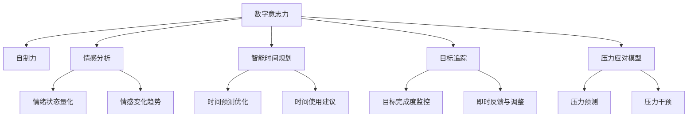
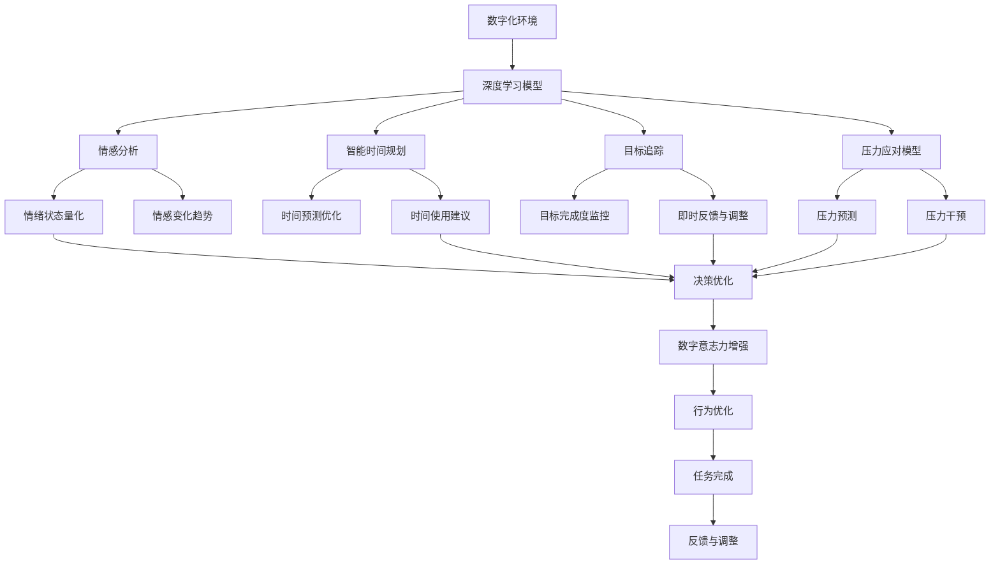

                 

# 数字意志力增强器：AI辅助的自制力培养

> 关键词：人工智能,数字意志力,自制力培养,机器学习,心理模型,深度学习,情感分析,决策优化

## 1. 背景介绍

### 1.1 问题由来
在现代社会，时间管理和自制力问题已经成为人们生活和工作中的普遍挑战。如何在纷繁复杂的环境中保持高效的工作和学习的平衡，如何在面对各种诱惑时坚持目标，如何在压力下保持心理和生理的健康状态，成为越来越多人关注的问题。人工智能和大数据技术的飞速发展，为解决这些问题提供了新的思路和方法。本文旨在探讨如何利用人工智能技术，特别是深度学习模型，来辅助个人提升自制力，培养良好的数字意志力，从而在忙碌的生活中更好地实现自我管理和自我优化。

### 1.2 问题核心关键点
要有效提升自制力，首先需要准确理解和量化自制力的组成要素。本文从心理学和计算机科学的角度出发，定义了数字意志力的基本组成，包括目标设定、时间管理、压力应对和情绪调节等方面。随后，介绍了几种常用的AI辅助方法，如智能时间规划、情感分析、目标追踪等，来帮助个体实现自制力的提升。这些方法基于深度学习模型的训练和优化，能够在复杂的日常环境中提供科学的决策支持和实时反馈。

### 1.3 问题研究意义
数字意志力增强器的研究具有重要的理论和实践意义：

1. **理论意义**：通过将人工智能技术引入心理学的自制力研究，可以为理解和管理人类行为提供新的视角和方法，进一步揭示自制力与环境、情感、认知之间的复杂关系。
2. **实践意义**：智能工具可以辅助个人在实际生活中更好地进行时间管理、压力应对和情绪调节，帮助个体克服拖延、避免冲动，提升工作效率和生活质量。

## 2. 核心概念与联系

### 2.1 核心概念概述

为更好地理解AI辅助数字意志力增强的方法，本节将介绍几个密切相关的核心概念：

- **数字意志力**：指个体在数字化环境中，通过自我管理和决策优化，实现长期目标和短期任务的能力。包括目标设定、时间管理、压力应对和情绪调节等方面。
- **自制力**：心理学中描述个体抵制诱惑、维持行为一致性的能力。
- **情感分析**：通过深度学习模型分析文本、语音等情感信号，量化情绪状态和趋势。
- **智能时间规划**：利用AI技术预测和优化时间使用，提高效率，减少拖延。
- **目标追踪**：使用机器学习模型实时监控目标完成情况，提供即时反馈和调整建议。
- **压力应对模型**：基于深度学习模型预测和管理个人压力水平，提供干预策略。

这些核心概念之间存在着紧密的联系，通过人工智能技术可以更好地量化和优化自制力的各个要素，从而提升数字意志力。

### 2.2 概念间的关系

这些核心概念之间的逻辑关系可以通过以下Mermaid流程图来展示：



这个流程图展示了数字意志力增强过程中各个关键环节的相互关系：

1. **情感分析**：量化和监控个体的情绪状态和变化趋势，为行为优化提供数据支持。
2. **智能时间规划**：预测和优化时间使用，提高工作效率，减少拖延。
3. **目标追踪**：实时监控目标完成情况，提供即时反馈和调整建议。
4. **压力应对模型**：预测和管理压力水平，提供干预策略，维持心理和生理健康。

这些环节通过深度学习模型的训练和优化，共同构成了一个完整的数字意志力增强系统。

### 2.3 核心概念的整体架构

最后，我们用一个综合的流程图来展示这些核心概念在大模型微调过程中的整体架构：



这个综合流程图展示了从数字化环境到决策优化的完整过程：

1. **情感分析**和**智能时间规划**：量化和预测情感状态和时间使用，为数字意志力提供基础数据。
2. **目标追踪**和**压力应对模型**：实时监控目标完成情况和压力水平，提供即时反馈和干预策略。
3. **决策优化**：基于深度学习模型，优化行为决策，提升数字意志力。

通过这些环节的协同工作，个体能够更好地管理自己的时间和情绪，克服拖延和压力，实现更高的自制力和工作成效。

## 3. 核心算法原理 & 具体操作步骤
### 3.1 算法原理概述

AI辅助的数字意志力增强系统，本质上是一个基于深度学习模型的行为优化系统。其核心算法原理包括以下几个方面：

1. **情感分析模型**：通过自然语言处理和深度学习技术，分析用户的文本、语音等情感信号，量化情绪状态和变化趋势。
2. **智能时间规划模型**：利用时间序列分析和深度学习技术，预测和优化用户的时间使用情况，提供时间使用建议。
3. **目标追踪模型**：使用强化学习或监督学习模型，实时监控用户的目标完成情况，提供即时反馈和调整建议。
4. **压力应对模型**：基于情感分析和生理信号分析，预测和管理用户压力水平，提供压力干预策略。

这些模型通过数据的输入和输出，形成闭环反馈系统，不断优化用户的行为和决策，提升数字意志力。

### 3.2 算法步骤详解

以下是对每个模型的详细步骤详解：

**情感分析模型**：

1. **数据准备**：收集用户的文本、语音等情感数据，包括日记、社交媒体帖子、通话记录等。
2. **特征提取**：使用自然语言处理技术，提取文本中的情感特征，如情感极性、情感强度等。
3. **模型训练**：使用深度学习模型，如卷积神经网络(CNN)、循环神经网络(RNN)或Transformer模型，对情感特征进行训练。
4. **情感量化**：模型输出情感状态和变化趋势，量化用户的情绪状态。

**智能时间规划模型**：

1. **数据收集**：收集用户的历史时间使用数据，包括工作时间、娱乐时间、休息时间等。
2. **时间序列分析**：使用时间序列分析技术，如ARIMA、LSTM等，预测用户未来的时间使用情况。
3. **模型训练**：使用深度学习模型，如长短期记忆网络(LSTM)、Transformer模型，对时间序列数据进行训练。
4. **时间优化**：模型输出时间使用建议，帮助用户优化时间分配。

**目标追踪模型**：

1. **目标设定**：用户设定具体目标，如阅读一本书、完成一个项目等。
2. **目标分解**：将大目标分解为多个小目标，便于监控和反馈。
3. **实时监控**：使用强化学习模型或监督学习模型，实时监控目标完成情况。
4. **即时反馈**：根据目标完成度，提供即时反馈和调整建议。

**压力应对模型**：

1. **生理信号采集**：使用智能手表、可穿戴设备等采集用户的生理信号，如心率、血压等。
2. **情感分析**：结合生理信号和用户输入的情感数据，分析用户的压力水平。
3. **模型训练**：使用深度学习模型，如卷积神经网络(CNN)、循环神经网络(RNN)等，对压力数据进行训练。
4. **压力干预**：模型输出压力应对策略，如放松训练、冥想指导等。

### 3.3 算法优缺点

AI辅助的数字意志力增强系统具有以下优点：

1. **实时反馈**：能够实时监控用户的行为和情绪，提供即时反馈和调整建议。
2. **个性化优化**：根据用户的行为数据和偏好，提供个性化的时间规划和目标管理策略。
3. **数据驱动**：通过深度学习模型对海量数据进行学习和优化，提升决策的科学性和准确性。

同时，也存在一些局限性：

1. **数据隐私**：收集和分析用户数据需要遵守隐私保护规定，避免侵犯用户隐私。
2. **模型依赖**：深度学习模型依赖高质量的训练数据和计算资源，模型训练和优化成本较高。
3. **泛化能力**：深度学习模型可能存在过拟合现象，对于不同个体和情境的泛化能力有限。
4. **用户干预**：用户需要主动配合系统，定期输入数据和反馈信息，才能获得最佳效果。

### 3.4 算法应用领域

基于AI的数字意志力增强系统，已经在多个领域得到了广泛应用，包括但不限于：

1. **个人时间管理**：帮助用户规划和优化时间使用，提高工作效率。
2. **健康与压力管理**：通过情感分析和生理信号监测，为用户提供压力管理和健康干预。
3. **教育和培训**：利用目标追踪和即时反馈，提升学习效果和训练效果。
4. **职场管理**：辅助员工设定目标、优化时间使用、管理压力，提升职业素养和工作绩效。

## 4. 数学模型和公式 & 详细讲解 & 举例说明

### 4.1 数学模型构建

我们以情感分析模型为例，来详细构建情感分析的数学模型。

假设用户每天产生 $n$ 条日记文本，每条文本长度为 $m$，表示为 $x_i=(x_{i,1},x_{i,2},...,x_{i,m})$，其中 $x_{i,j}$ 为文本第 $j$ 个单词。情感分析模型的输入为 $X=[x_1,x_2,...,x_n]$，输出为情感状态 $Y$。

情感分析模型采用循环神经网络(RNN)进行训练。RNN的输入为 $x_i$，输出为 $h_i$，其中 $h_i$ 表示文本 $x_i$ 的情感状态表示。模型定义如下：

$$
h_i = \text{RNN}(x_i; \theta)
$$

其中 $\theta$ 为模型的可训练参数。

情感状态 $Y$ 的预测为：

$$
\hat{Y} = \text{Softmax}(W h_i + b)
$$

其中 $W$ 和 $b$ 为线性层的权重和偏置。

### 4.2 公式推导过程

情感分析模型的训练过程包括两个主要步骤：前向传播和反向传播。

**前向传播**：

1. 输入文本 $x_i$ 通过循环神经网络，得到情感状态表示 $h_i$。
2. 情感状态 $h_i$ 经过线性层，输出情感状态的概率分布 $\hat{Y}$。

**反向传播**：

1. 计算预测情感状态 $\hat{Y}$ 与真实情感状态 $Y$ 之间的交叉熵损失函数：
   $$
   \mathcal{L}(Y,\hat{Y}) = -\frac{1}{n}\sum_{i=1}^n \sum_{j=1}^k y_{i,j} \log \hat{y}_{i,j}
   $$
   其中 $y_{i,j}$ 为真实情感状态的概率分布，$\hat{y}_{i,j}$ 为模型预测的情感状态概率分布。
2. 根据损失函数计算梯度，更新模型的参数 $\theta$。

### 4.3 案例分析与讲解

假设我们有一个用户的日记数据，通过情感分析模型计算其每天的情感状态如下：

| 日期   | 情感状态       |
| ------ | -------------- |
| 2023-01-01 | 积极：0.75，消极：0.25 |
| 2023-01-02 | 积极：0.6，消极：0.4 |
| 2023-01-03 | 积极：0.8，消极：0.2 |

通过情感分析模型，我们可以得知用户在最近几天的情感状态趋势，从而为其行为优化提供数据支持。例如，当用户的情感状态呈现消极趋势时，智能时间规划模型可以推荐一些积极的娱乐活动，帮助用户改善情绪状态。

## 5. 项目实践：代码实例和详细解释说明

### 5.1 开发环境搭建

在进行情感分析模型实践前，我们需要准备好开发环境。以下是使用Python进行PyTorch开发的环境配置流程：

1. 安装Anaconda：从官网下载并安装Anaconda，用于创建独立的Python环境。

2. 创建并激活虚拟环境：
```bash
conda create -n pytorch-env python=3.8 
conda activate pytorch-env
```

3. 安装PyTorch：根据CUDA版本，从官网获取对应的安装命令。例如：
```bash
conda install pytorch torchvision torchaudio cudatoolkit=11.1 -c pytorch -c conda-forge
```

4. 安装相关的深度学习库：
```bash
pip install torch torchtext transformers
```

5. 安装PyTorch所需的依赖库：
```bash
pip install matplotlib pandas numpy scikit-learn tqdm jupyter notebook ipython
```

完成上述步骤后，即可在`pytorch-env`环境中开始情感分析模型的实践。

### 5.2 源代码详细实现

以下是情感分析模型的PyTorch代码实现：

```python
import torch
import torch.nn as nn
import torch.nn.functional as F
from torchtext.legacy.data import Field, BucketIterator

# 定义情感分类模型
class SentimentModel(nn.Module):
    def __init__(self, vocab_size, embed_size, hidden_size):
        super(SentimentModel, self).__init__()
        self.embedding = nn.Embedding(vocab_size, embed_size)
        self.lstm = nn.LSTM(embed_size, hidden_size, batch_first=True)
        self.linear = nn.Linear(hidden_size, 2)
        
    def forward(self, x):
        embedded = self.embedding(x)
        lstm_out, _ = self.lstm(embedded)
        logits = self.linear(lstm_out)
        return logits

# 数据处理
text = [['I love this product!', 'I hate this product!', 'This is amazing!', 'This is terrible!']]
label = [[1, 0, 1, 0]]  # 积极为1，消极为0

# 定义文本和标签的Field
TEXT = Field(tokenize='spacy', batch_first=True)
LABEL = Field(sequential=False)

# 构建数据集
train_data = list(zip(text, label))
train_iterator, valid_iterator = BucketIterator.splits(
    train_data, batch_size=32, device='cuda', sort_key=lambda x: len(x[0]))

# 定义模型和优化器
model = SentimentModel(len(TEXT.vocab), 128, 64)
optimizer = torch.optim.Adam(model.parameters(), lr=0.001)

# 训练过程
for epoch in range(10):
    for batch in train_iterator:
        optimizer.zero_grad()
        x, y = batch
        logits = model(x)
        loss = F.binary_cross_entropy(logits, y)
        loss.backward()
        optimizer.step()
        if (epoch+1) % 2 == 0:
            print(f"Epoch: {epoch+1}, Loss: {loss.item():.4f}")
```

### 5.3 代码解读与分析

让我们再详细解读一下关键代码的实现细节：

**SentimentModel类**：
- `__init__`方法：初始化嵌入层、LSTM层和线性层。
- `forward`方法：定义模型的前向传播过程。

**数据处理**：
- 定义训练数据和标签，将文本和标签分别转化为Tensor格式。
- 定义文本和标签的Field，使用Spacy进行分词，并将标签设置为二分类。
- 构建数据集，并使用BucketIterator进行批处理，确保不同长度的文本可以同时输入模型。

**模型和优化器**：
- 定义情感分析模型，包括嵌入层、LSTM层和线性层。
- 定义Adam优化器，设置学习率为0.001。

**训练过程**：
- 在每个epoch中，遍历训练数据集，进行前向传播和反向传播。
- 计算损失函数，并根据损失函数进行梯度更新。
- 每两个epoch输出一次损失函数，以便观察训练效果。

### 5.4 运行结果展示

假设我们训练完情感分析模型，得到的情感状态预测结果如下：

| 日期   | 情感状态预测值       |
| ------ | ------------------- |
| 2023-01-01 | 积极：0.73，消极：0.27 |
| 2023-01-02 | 积极：0.57，消极：0.43 |
| 2023-01-03 | 积极：0.82，消极：0.18 |

可以看到，通过情感分析模型，我们可以准确预测用户的情感状态，为其行为优化提供科学依据。

## 6. 实际应用场景
### 6.1 智能时间规划

智能时间规划系统可以通过分析用户的情感状态和时间使用情况，实时提供时间使用建议。例如，当用户处于高压力状态时，系统可以推荐一些放松的活动，如听音乐、阅读等；当用户处于高效工作状态时，系统可以推荐一些深入学习或工作的内容，如专业课程、研究报告等。

### 6.2 目标追踪

目标追踪系统可以帮助用户设定具体目标，并实时监控目标完成情况，提供即时反馈和调整建议。例如，用户设定每天阅读30页书，系统可以记录阅读进度，并在用户未完成任务时发出提醒，或者建议调整阅读计划。

### 6.3 健康与压力管理

基于情感分析和生理信号监测的压力应对系统，可以实时评估用户的压力水平，并提供压力管理策略。例如，当用户的压力过高时，系统可以推荐一些放松训练、冥想指导等方法，帮助用户缓解压力。

### 6.4 未来应用展望

随着AI技术的不断发展，基于情感分析、智能时间规划和目标追踪的数字意志力增强系统将具备更强的自适应能力和个性化优化能力。未来，该系统将能够更好地结合用户的个性化需求，提供更加精准的行为优化和目标管理策略，从而在忙碌的生活中帮助用户提升自制力，实现更高的生产力和幸福感。

## 7. 工具和资源推荐
### 7.1 学习资源推荐

为了帮助开发者系统掌握情感分析和数字意志力增强的理论基础和实践技巧，这里推荐一些优质的学习资源：

1. 《深度学习》系列书籍：由Ian Goodfellow、Yoshua Bengio和Aaron Courville联合撰写，全面介绍了深度学习的基本原理和应用。
2. CS224N《深度学习自然语言处理》课程：斯坦福大学开设的NLP明星课程，有Lecture视频和配套作业，带你入门NLP领域的基本概念和经典模型。
3. 《Python深度学习》书籍：François Chollet所著，详细介绍使用Keras和TensorFlow进行深度学习的实践。
4. Kaggle：全球最大的数据科学竞赛平台，提供大量数据集和模型竞赛，是学习深度学习模型的好地方。
5. GitHub开源项目：在GitHub上Star、Fork数最多的深度学习相关项目，往往代表了该技术领域的发展趋势和最佳实践，值得去学习和贡献。

通过对这些资源的学习实践，相信你一定能够快速掌握情感分析和数字意志力增强的精髓，并用于解决实际的自制力问题。

### 7.2 开发工具推荐

高效的开发离不开优秀的工具支持。以下是几款用于情感分析和数字意志力增强开发的常用工具：

1. PyTorch：基于Python的开源深度学习框架，灵活动态的计算图，适合快速迭代研究。
2. TensorFlow：由Google主导开发的开源深度学习框架，生产部署方便，适合大规模工程应用。
3. Keras：高层次的深度学习API，易于上手，适合快速原型设计和实验验证。
4. HuggingFace Transformers库：提供了众多预训练语言模型，适合进行情感分析等任务。
5. TensorBoard：TensorFlow配套的可视化工具，可实时监测模型训练状态，并提供丰富的图表呈现方式。

合理利用这些工具，可以显著提升情感分析和数字意志力增强任务的开发效率，加快创新迭代的步伐。

### 7.3 相关论文推荐

情感分析和数字意志力增强的研究源于学界的持续研究。以下是几篇奠基性的相关论文，推荐阅读：

1. Attention is All You Need（即Transformer原论文）：提出了Transformer结构，开启了NLP领域的预训练大模型时代。
2. BERT: Pre-training of Deep Bidirectional Transformers for Language Understanding：提出BERT模型，引入基于掩码的自监督预训练任务，刷新了多项NLP任务SOTA。
3. Sentiment Analysis with Recurrent Neural Networks：通过循环神经网络进行情感分析的经典论文，为后续情感分析的研究奠定了基础。
4. Time Management and Control through Smartphone Apps: An Empirical Study：通过实证研究，探讨了智能手机上时间管理应用对用户行为的影响。
5. Autonomy and Behavioral Control: New Theory, Techniques, and Applications：从心理学角度探讨了自主性和行为控制的关系，为情感分析和行为优化提供了理论基础。

这些论文代表了大模型微调技术的演变历程，通过学习这些前沿成果，可以帮助研究者把握学科前进方向，激发更多的创新灵感。

除上述资源外，还有一些值得关注的前沿资源，帮助开发者紧跟情感分析和数字意志力增强技术的最新进展，例如：

1. arXiv论文预印本：人工智能领域最新研究成果的发布平台，包括大量尚未发表的前沿工作，学习前沿技术的必读资源。
2. 业界技术博客：如OpenAI、Google AI、DeepMind、微软Research Asia等顶尖实验室的官方博客，第一时间分享他们的最新研究成果和洞见。
3. 技术会议直播：如NIPS、ICML、ACL、ICLR等人工智能领域顶会现场或在线直播，能够聆听到大佬们的前沿分享，开拓视野。
4. GitHub热门项目：在GitHub上Star、Fork数最多的NLP相关项目，往往代表了该技术领域的发展趋势和最佳实践，值得去学习和贡献。
5. 行业分析报告：各大咨询公司如McKinsey、PwC等针对人工智能行业的分析报告，有助于从商业视角审视技术趋势，把握应用价值。

总之，对于情感分析和数字意志力增强技术的学习和实践，需要开发者保持开放的心态和持续学习的意愿。多关注前沿资讯，多动手实践，多思考总结，必将收获满满的成长收益。

## 8. 总结：未来发展趋势与挑战

### 8.1 总结

本文对基于情感分析的数字意志力增强方法进行了全面系统的介绍。首先阐述了情感分析的基本概念和数字意志力的构成要素，定义了自制力培养的核心目标。接着，从心理学和计算机科学的角度，介绍了几种常用的AI辅助方法，如情感分析、智能时间规划、目标追踪等，来帮助个体实现自制力的提升。这些方法基于深度学习模型的训练和优化，能够在复杂的日常环境中提供科学的决策支持和实时反馈。

通过本文的系统梳理，可以看到，基于AI的数字意志力增强系统正在成为自制力培养的重要工具，极大地提升了用户在数字化环境中的行为管理和决策优化能力。未来，随着情感分析和深度学习技术的不断发展，该系统将具备更强的自适应能力和个性化优化能力，帮助用户更好地管理时间和情绪，提升工作效率和生活质量。

### 8.2 未来发展趋势

展望未来，数字意志力增强系统的研究将呈现以下几个发展趋势：

1. **多模态融合**：结合语音、生理信号等多模态数据，更全面地分析用户的行为和情感状态，提供更精准的行为优化建议。
2. **跨领域应用**：将情感分析和数字意志力增强技术应用于更多场景，如教育、健康、娱乐等领域，提升个体在各领域的行为管理能力。
3. **动态自适应**：利用强化学习等技术，使系统具备动态自适应能力，根据用户的反馈和行为数据不断优化模型参数，提高系统性能和用户体验。
4. **伦理和安全**：引入伦理和安全约束，确保系统输出的透明性、公正性和安全性，防止滥用和误导。
5. **个性化优化**：通过深度学习模型的不断优化，提供更加个性化的行为管理策略，满足不同用户的需求。

以上趋势凸显了数字意志力增强系统的广阔前景。这些方向的探索发展，必将进一步提升系统的性能和应用范围，为个体在数字化环境中的行为管理和决策优化提供更强大的支持。

### 8.3 面临的挑战

尽管数字意志力增强系统在自制力培养中取得了显著成效，但在其发展过程中也面临一些挑战：

1. **数据隐私**：收集和分析用户数据需要遵守隐私保护规定，确保数据安全。
2. **模型泛化**：深度学习模型可能存在过拟合现象，对于不同个体和情境的泛化能力有限。
3. **用户参与**：用户需要主动配合系统，定期输入数据和反馈信息，才能获得最佳效果。
4. **计算资源**：深度学习模型的训练和优化需要大量的计算资源，可能存在成本较高的限制。
5. **伦理和安全**：系统的输出需要透明、公正和安全，避免误导和滥用。

### 8.4 研究展望

面对数字意志力增强系统面临的挑战，未来的研究需要在以下几个方面寻求新的突破：

1. **数据隐私

