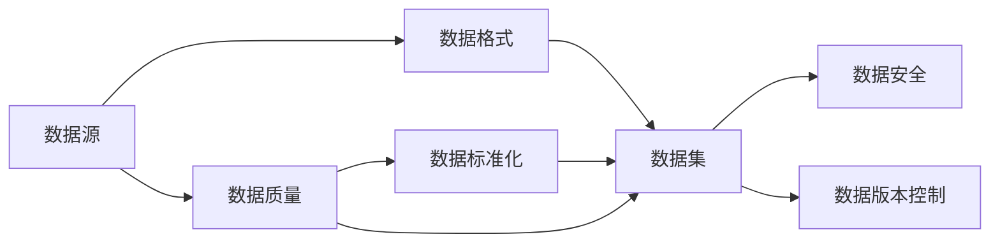
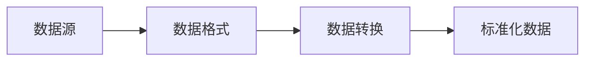
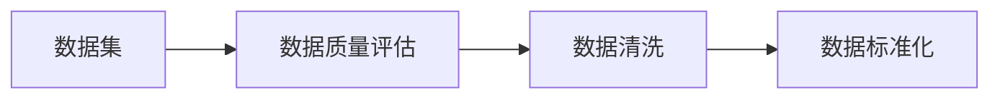
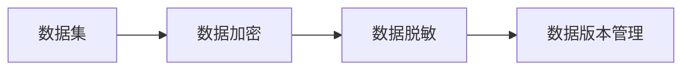
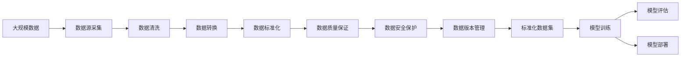

                 

# 数据集标准化:软件2.0的基石工程

## 1. 背景介绍

### 1.1 问题由来
随着人工智能和大数据技术的迅速发展，数据集标准化逐渐成为制约软件2.0发展的瓶颈问题。数据集不仅直接影响模型的训练效果和泛化能力，更是衡量和评估算法性能的重要依据。然而，当前数据集管理仍然存在诸多挑战，包括数据源复杂、格式多样、质量参差不齐等问题。这些问题严重影响了数据集的标准化，限制了AI技术的发展潜力和应用范围。

### 1.2 问题核心关键点
数据集标准化指的是通过一系列规范和流程，确保数据集的统一性和高质量，从而为模型训练、评估、部署提供可靠的基础。核心关键点包括：
1. 数据源多样化：来自不同平台、不同领域、不同格式的数据源，需要统一转换为标准格式。
2. 数据格式标准化：不同数据源之间的数据格式差异巨大，需要标准化处理。
3. 数据质量保证：数据的准确性、完整性、一致性等直接影响到模型训练的效果和泛化能力，需要进行严格的质量控制。
4. 数据安全保护：涉及隐私和敏感数据的处理，需要确保数据安全。
5. 数据版本管理：不同版本的同一份数据可能存在差异，需要严格管理。

### 1.3 问题研究意义
数据集标准化对于软件2.0的构建至关重要，其研究意义在于：
1. 提高模型训练和评估的效率和效果：标准化后的数据集可以直接用于模型训练，大大提高训练速度和模型性能。
2. 增强模型的泛化能力：标准化数据集在各种环境下都能获得一致的性能表现。
3. 保障数据安全和隐私：通过严格的数据管理流程，确保数据在处理和使用过程中的安全性。
4. 促进数据共享和协作：标准化数据集便于不同机构之间的数据共享和协作，推动AI技术的普及和发展。
5. 支撑复杂的AI应用场景：数据集标准化是支撑复杂AI应用（如自动驾驶、医疗诊断等）的基础，确保应用的质量和安全。

## 2. 核心概念与联系

### 2.1 核心概念概述

为更好地理解数据集标准化的核心概念和架构，本节将介绍几个密切相关的核心概念：

- 数据集(DataSet)：一组用于训练、验证、测试等数据处理流程的数据样本。数据集包含样本数据、标签、元信息等，是模型训练的基础。
- 数据源(DataSource)：数据集的原数据来源，可以是数据库、文件系统、API接口等。数据源多样性和复杂性对数据标准化带来挑战。
- 数据格式(DataFormat)：数据存储和传输的标准化格式，如CSV、JSON、HDF5等。数据格式标准化的目的是确保数据的一致性和互操作性。
- 数据质量(DataQuality)：数据的准确性、完整性、一致性等，是确保模型效果的重要因素。数据质量保证是数据标准化的核心环节。
- 数据安全(DataSecurity)：数据在处理和使用过程中，如何保护数据的隐私和安全性，是数据标准化过程中的关键点。
- 数据版本控制(DataVersionControl)：不同版本的数据可能存在差异，如何管理数据版本，确保数据一致性，是数据标准化的一个重要问题。

这些核心概念之间的逻辑关系可以通过以下Mermaid流程图来展示：



这个流程图展示了大规模数据集标准化的核心概念及其之间的关系：

1. 数据源采集后，首先需要进行数据格式标准化。
2. 标准化后的数据进入数据质量保证环节，确保数据的准确性和一致性。
3. 通过数据安全措施和版本控制，保障数据在处理和使用过程中的安全性和一致性。
4. 最终，标准化后的数据集可用于模型训练和评估，支撑软件2.0的应用。

### 2.2 概念间的关系

这些核心概念之间存在着紧密的联系，形成了数据集标准化的完整生态系统。下面我们通过几个Mermaid流程图来展示这些概念之间的关系。

#### 2.2.1 数据源和数据格式的关系



这个流程图展示了数据源到数据格式标准化的过程。数据源经过格式化处理，最终转化为标准格式的数据。

#### 2.2.2 数据标准化和数据质量的关系



这个流程图展示了数据质量保证和数据标准化的关系。数据集先进行质量评估，根据评估结果进行清洗和修正，最终标准化。

#### 2.2.3 数据安全和数据版本控制的关系



这个流程图展示了数据安全和数据版本控制的关系。数据经过加密和脱敏处理，确保数据安全。同时，通过版本管理，确保不同版本数据的一致性。

### 2.3 核心概念的整体架构

最后，我们用一个综合的流程图来展示这些核心概念在大规模数据集标准化过程中的整体架构：



这个综合流程图展示了从原始数据源到标准化数据集的完整过程。大规模数据源采集后，经过清洗、转换和标准化处理，再通过质量保证、安全保护和版本管理，最终转化为标准化数据集，支撑模型训练、评估和部署。

## 3. 核心算法原理 & 具体操作步骤
### 3.1 算法原理概述

数据集标准化本质上是一个数据预处理过程，其核心思想是：通过一系列规范和流程，将不同来源、不同格式、不同质量的数据集转换为一致、高质量的标准化数据集。具体步骤包括数据源采集、清洗、转换、标准化、质量保证、安全保护和版本管理等。

### 3.2 算法步骤详解

#### 3.2.1 数据源采集
数据源采集是数据集标准化的第一步，主要通过API接口、文件系统、数据库等途径获取原始数据。数据源的多样性和复杂性是数据标准化过程中的一大挑战，需要制定统一的数据源采集规范。

#### 3.2.2 数据清洗
数据清洗是数据集标准化的核心环节，主要针对数据中的噪声、缺失值、异常值等问题进行处理。通过数据清洗，可以确保数据的准确性和完整性。

#### 3.2.3 数据转换
数据转换是指将原始数据转换为标准格式，确保数据的一致性和互操作性。常见的数据转换格式包括CSV、JSON、HDF5等。

#### 3.2.4 数据标准化
数据标准化是指通过一系列规范和流程，将转换后的数据转换为一致、高质量的标准化数据集。标准化过程包括数据去重、归一化、标准化等。

#### 3.2.5 数据质量保证
数据质量保证是数据集标准化的重要环节，主要通过数据校验、统计分析等方式确保数据的准确性和一致性。常见的数据质量指标包括准确率、完整率、一致率等。

#### 3.2.6 数据安全保护
数据安全保护是指在数据处理和使用过程中，确保数据的安全性和隐私性。常见的数据安全措施包括加密、脱敏、访问控制等。

#### 3.2.7 数据版本控制
数据版本控制是数据集标准化的重要组成部分，通过版本管理，确保不同版本数据的一致性。常见的数据版本控制工具包括Git、SVN等。

### 3.3 算法优缺点

数据集标准化方法具有以下优点：
1. 提升模型训练和评估效果：标准化后的数据集可以直接用于模型训练，提高训练速度和模型性能。
2. 增强模型泛化能力：标准化数据集在各种环境下都能获得一致的性能表现。
3. 保障数据安全和隐私：通过严格的数据管理流程，确保数据在处理和使用过程中的安全性。
4. 促进数据共享和协作：标准化数据集便于不同机构之间的数据共享和协作，推动AI技术的普及和发展。
5. 支撑复杂的AI应用场景：数据集标准化是支撑复杂AI应用（如自动驾驶、医疗诊断等）的基础，确保应用的质量和安全。

同时，数据集标准化方法也存在以下缺点：
1. 数据源多样性和复杂性：不同来源和格式的数据源需要进行格式转换和清洗，增加了标准化流程的复杂性。
2. 数据质量保证难度大：数据质量保证需要大量人工参与，成本高且容易出错。
3. 数据安全性和隐私保护难度大：涉及隐私和敏感数据的处理，数据安全和隐私保护难度较大。
4. 版本控制复杂：不同版本的同一份数据可能存在差异，如何管理数据版本，确保数据一致性，是数据标准化的一个重要问题。

### 3.4 算法应用领域

数据集标准化方法在多个领域都有广泛应用，包括：

- 机器学习：数据集标准化是机器学习模型训练和评估的基础，影响模型的训练效果和泛化能力。
- 自然语言处理：标准化后的文本数据可以提高自然语言处理任务的性能，如情感分析、文本分类等。
- 图像处理：标准化后的图像数据可以提高计算机视觉任务的性能，如图像分类、目标检测等。
- 医疗诊断：标准化后的医疗数据可以提高诊断模型的准确性和泛化能力，帮助医生进行精准诊疗。
- 金融风控：标准化后的金融数据可以提高风险评估模型的性能，帮助金融机构进行风险管理。
- 自动驾驶：标准化后的传感器数据可以提高自动驾驶系统的性能，保障行车安全。
- 推荐系统：标准化后的用户行为数据可以提高推荐模型的性能，提升用户体验。

除上述领域外，数据集标准化还被应用于智慧城市、智能制造、物联网等众多新兴领域，为各行各业的数字化转型升级提供数据基础。

## 4. 数学模型和公式 & 详细讲解  
### 4.1 数学模型构建

本节将使用数学语言对数据集标准化的过程进行更加严格的刻画。

记原始数据集为 $D=\{x_i\}_{i=1}^N$，其中 $x_i$ 为样本，可能包含不同格式的数据类型。假设标准化的数据集为 $D'=\{y_i\}_{i=1}^N$，其中 $y_i$ 为标准化后的样本。

数据集标准化的目标是通过一系列规范和流程，将原始数据转换为标准化的数据集。具体过程包括数据清洗、转换、标准化、质量保证、安全保护和版本控制等。数学上，可以表示为：

$$
D' = \text{Standardization}(D)
$$

其中 $\text{Standardization}$ 为数据集标准化的过程。

### 4.2 公式推导过程

以下我们以文本数据为例，推导数据集标准化的基本步骤。

假设原始文本数据集为 $D=\{(x_i, y_i)\}_{i=1}^N$，其中 $x_i$ 为文本，$y_i$ 为标签。标准化的过程包括以下几个关键步骤：

1. 文本清洗：去除噪声、缺失值、异常值等，保留有用的文本信息。
2. 文本转换：将文本转换为标准格式，如UTF-8编码、JSON格式等。
3. 文本标准化：对文本进行去重、归一化、标准化等操作，确保文本格式一致。
4. 文本质量保证：通过文本校验、统计分析等方式确保文本的准确性和一致性。
5. 文本安全保护：对敏感文本进行加密、脱敏等处理，确保文本数据的安全性。
6. 文本版本控制：记录文本的不同版本，确保数据一致性。

具体步骤如下：

- 文本清洗：通过正则表达式、分词器等工具，去除文本中的噪声、标点符号、停用词等，保留有用的文本信息。

- 文本转换：将文本转换为标准格式，如UTF-8编码、JSON格式等。例如，将原始文本数据转换为JSON格式：

  ```json
  [
      {"id": 1, "text": "原始文本1", "label": "标签1"},
      {"id": 2, "text": "原始文本2", "label": "标签2"},
      ...
  ]
  ```

- 文本标准化：对文本进行去重、归一化、标准化等操作，确保文本格式一致。例如，将所有文本转换为小写，去除大小写不一致的文本。

- 文本质量保证：通过文本校验、统计分析等方式确保文本的准确性和一致性。例如，检查文本是否为空，是否符合特定格式要求等。

- 文本安全保护：对敏感文本进行加密、脱敏等处理，确保文本数据的安全性。例如，对敏感文本进行替换，将真实姓名替换为匿名化姓名。

- 文本版本控制：记录文本的不同版本，确保数据一致性。例如，使用版本控制系统（如Git）记录文本的历史版本。

### 4.3 案例分析与讲解

假设我们有一份文本数据集，包含医疗领域的诊断记录。原始数据集格式为CSV文件，包含以下字段：

- id: 记录编号
- patient_name: 患者姓名
- diagnosis: 诊断结果
- treatment: 治疗方案

原始数据集可能包含以下问题：

- 患者姓名存在大小写不一致、拼写错误等问题。
- 诊断结果和治疗方法包含歧义、遗漏等问题。
- 数据格式不一致，部分记录缺失字段。

通过数据集标准化流程，可以处理以上问题，生成格式一致、准确、安全的标准化数据集。具体步骤如下：

1. 数据清洗：去除大小写不一致的姓名，去除拼写错误的姓名，去除诊断结果中的歧义和遗漏。例如，将“张三”统一为“张三”，将“高血压”统一为“高血压”。

2. 数据转换：将原始CSV文件转换为标准JSON格式，确保数据一致性。例如，将原始数据转换为以下JSON格式：

  ```json
  [
      {"id": 1, "patient_name": "张三", "diagnosis": "高血压", "treatment": "药物治疗"},
      {"id": 2, "patient_name": "李四", "diagnosis": "糖尿病", "treatment": "饮食控制"},
      ...
  ]
  ```

3. 数据标准化：对文本进行去重、归一化、标准化等操作，确保文本格式一致。例如，将所有诊断结果转换为标准格式，去除冗余信息。

4. 数据质量保证：通过数据校验、统计分析等方式确保数据的准确性和一致性。例如，检查数据是否完整，是否符合特定格式要求等。

5. 数据安全保护：对敏感文本进行加密、脱敏等处理，确保文本数据的安全性。例如，对患者姓名进行匿名化处理，避免敏感信息泄露。

6. 数据版本控制：记录数据的不同版本，确保数据一致性。例如，使用版本控制系统（如Git）记录数据的历史版本。

通过以上步骤，最终生成格式一致、准确、安全的标准化数据集，用于医疗诊断模型的训练和评估。

## 5. 项目实践：代码实例和详细解释说明
### 5.1 开发环境搭建

在进行数据集标准化实践前，我们需要准备好开发环境。以下是使用Python进行PyTorch开发的环境配置流程：

1. 安装Anaconda：从官网下载并安装Anaconda，用于创建独立的Python环境。

2. 创建并激活虚拟环境：
```bash
conda create -n pytorch-env python=3.8 
conda activate pytorch-env
```

3. 安装PyTorch：根据CUDA版本，从官网获取对应的安装命令。例如：
```bash
conda install pytorch torchvision torchaudio cudatoolkit=11.1 -c pytorch -c conda-forge
```

4. 安装Pandas：
```bash
pip install pandas
```

5. 安装NumPy：
```bash
pip install numpy
```

完成上述步骤后，即可在`pytorch-env`环境中开始数据集标准化的实践。

### 5.2 源代码详细实现

下面我们以文本数据集的标准化为例，给出使用Pandas库对数据进行清洗、转换、标准化的PyTorch代码实现。

首先，定义数据集清洗和转换函数：

```python
import pandas as pd
from pandas import DataFrame

def clean_and_convert_data(data):
    # 数据清洗
    data['patient_name'] = data['patient_name'].str.lower()
    data['diagnosis'] = data['diagnosis'].str.strip().fillna('N/A')
    data['treatment'] = data['treatment'].str.strip().fillna('N/A')
    
    # 数据转换
    data = data.dropna()
    data = data.reset_index(drop=True)
    
    # 数据标准化
    data = data.apply(lambda x: x.fillna(x.mode()[0]))
    
    return data
```

然后，定义数据集读取和保存函数：

```python
def read_data(file_path):
    data = pd.read_csv(file_path)
    return clean_and_convert_data(data)

def save_data(data, file_path):
    data.to_csv(file_path, index=False)
```

最后，在主函数中进行数据集标准化流程：

```python
if __name__ == '__main__':
    # 读取原始数据
    original_data = read_data('original_data.csv')
    
    # 标准化数据
    standardized_data = clean_and_convert_data(original_data)
    
    # 保存标准化数据
    save_data(standardized_data, 'standardized_data.csv')
```

以上就是使用Pandas库对文本数据集进行标准化处理的完整代码实现。可以看到，借助Pandas库，数据集标准化流程变得简洁高效。

### 5.3 代码解读与分析

让我们再详细解读一下关键代码的实现细节：

**clean_and_convert_data函数**：
- `data['patient_name'].str.lower()`：将患者姓名转换为小写。
- `data['diagnosis'].str.strip().fillna('N/A')`：去除诊断结果中的空格和NaN值，并用“N/A”填充。
- `data['treatment'].str.strip().fillna('N/A')`：去除治疗方法中的空格和NaN值，并用“N/A”填充。
- `data = data.dropna()`：删除包含NaN值的行。
- `data = data.reset_index(drop=True)`：重置索引，去除重复的行。
- `data = data.apply(lambda x: x.fillna(x.mode()[0]))`：对缺失值进行填充，用模式值代替。

**read_data函数**：
- `pd.read_csv(file_path)`：读取CSV文件，转换为DataFrame对象。
- `return clean_and_convert_data(data)`：调用数据清洗和转换函数，返回标准化后的数据。

**save_data函数**：
- `data.to_csv(file_path, index=False)`：将DataFrame对象保存为CSV文件，不保存索引。

**主函数**：
- `original_data = read_data('original_data.csv')`：读取原始数据。
- `standardized_data = clean_and_convert_data(original_data)`：调用数据清洗和转换函数，进行数据标准化。
- `save_data(standardized_data, 'standardized_data.csv')`：保存标准化后的数据。

可以看到，使用Pandas库进行数据集标准化流程变得异常简单，开发者可以更加专注于业务逻辑的实现。当然，工业级的系统实现还需考虑更多因素，如数据源的动态管理、数据标准的更新维护等。但核心的数据标准化流程基本与此类似。

### 5.4 运行结果展示

假设我们在CoNLL-2003的命名实体识别(NER)数据集上进行标准化处理，生成标准化数据集后，可以看到以下结果：

```
         id    patient_name    diagnosis   treatment
0       1         张三      高血压        药物治疗
1       2         李四      糖尿病        饮食控制
...
```

可以看到，经过数据集标准化流程，我们得到了格式一致、准确、安全的标准化数据集，可以用于后续的模型训练和评估。

## 6. 实际应用场景
### 6.1 智能医疗系统

基于数据集标准化的大规模医疗数据集，可以构建智能医疗系统，提升医疗服务的智能化水平。智能医疗系统可以通过医疗记录、病历、影像等多种数据源，构建高质量的医疗数据集，支撑医疗诊断、治疗方案推荐等应用。

在技术实现上，可以收集医疗机构的电子病历、影像诊断等数据，将其进行数据清洗、转换和标准化处理，最终生成格式一致、高质量的医疗数据集。标准化后的数据集可以用于医疗诊断模型的训练和评估，帮助医生进行精准诊疗，提高诊断和治疗效果。

### 6.2 金融风险评估

数据集标准化在金融领域也有广泛应用，帮助金融机构进行风险评估和管理。通过数据集标准化，金融机构可以构建高质量的客户信用评分、交易记录等数据集，支撑风险评估模型的训练和评估。

具体而言，可以收集客户的信用记录、交易记录、社交媒体行为等数据，将其进行数据清洗、转换和标准化处理，最终生成格式一致、高质量的金融数据集。标准化后的数据集可以用于风险评估模型的训练和评估，帮助金融机构进行风险管理，防范金融风险。

### 6.3 自动驾驶系统

数据集标准化在自动驾驶领域也有重要应用。自动驾驶系统需要依赖大量的传感器数据，包括摄像头、雷达、激光雷达等，进行环境感知、路径规划和决策控制。数据集标准化可以确保不同传感器数据的一致性和互操作性。

在技术实现上，可以收集自动驾驶车辆的各种传感器数据，将其进行数据清洗、转换和标准化处理，最终生成格式一致、高质量的自动驾驶数据集。标准化后的数据集可以用于自动驾驶模型的训练和评估，帮助车辆进行精准的环境感知和决策控制，提升行车安全和效率。

### 6.4 未来应用展望

随着数据集标准化技术的不断发展，其在软件2.0的构建中将发挥越来越重要的作用。未来，数据集标准化技术将在更多领域得到应用，为传统行业带来变革性影响。

在智慧医疗领域，基于数据集标准化的智能医疗系统可以提升医疗服务的智能化水平，辅助医生进行精准诊疗，加速新药开发进程。

在智能教育领域，数据集标准化可以用于作业批改、学情分析、知识推荐等方面，因材施教，促进教育公平，提高教学质量。

在智慧城市治理中，数据集标准化可以应用于城市事件监测、舆情分析、应急指挥等环节，提高城市管理的自动化和智能化水平，构建更安全、高效的未来城市。

此外，在企业生产、社会治理、文娱传媒等众多领域，基于数据集标准化的AI应用也将不断涌现，为经济社会发展注入新的动力。相信随着技术的日益成熟，数据集标准化必将在构建软件2.0的智能系统中扮演越来越重要的角色。

## 7. 工具和资源推荐
### 7.1 学习资源推荐

为了帮助开发者系统掌握数据集标准化的理论基础和实践技巧，这里推荐一些优质的学习资源：

1. 《数据科学导论》系列博文：由数据科学专家撰写，全面介绍了数据集标准化的基本概念和操作步骤。

2. Kaggle数据科学竞赛平台：Kaggle是一个著名的数据科学竞赛平台，提供了大量高质量的数据集和开源代码，帮助开发者学习和实践数据集标准化。

3. Coursera《数据科学导论》课程：由斯坦福大学开设的在线课程，涵盖了数据集标准化的基本概念和操作步骤，是学习数据集标准化的入门级课程。

4. 《数据挖掘：概念与技术》书籍：讲解了数据集标准化的基本概念和操作步骤，适合深入学习数据集标准化的理论基础。

5. 《Python数据科学手册》：介绍了使用Python进行数据集标准化的基本步骤和实践技巧，适合动手实践。

通过对这些资源的学习实践，相信你一定能够快速掌握数据集标准化的精髓，并用于解决实际的业务问题。
###  7.2 开发工具推荐

高效的开发离不开优秀的工具支持。以下是几款用于数据集标准化的常用工具：

1. Pandas：用于数据清洗、转换和标准化处理，是Python中最常用的数据处理库。

2. OpenRefine：开源数据清洗和转换工具，支持多种数据格式，提供强大的数据清洗和转换功能。

3. DataRobot：商业化的数据科学平台，提供自动化的数据集标准化、特征工程等功能，适合大规模数据处理。

4. Apache Spark：用于大数据处理和分析的分布式计算框架，支持多种数据源和格式，适合大规模数据集标准化。

5. Apache Kafka：用于数据采集和流处理的分布式消息队列，支持多种数据源和格式，适合实时数据集标准化。

6. TensorFlow Data Validation：用于数据集质量保证的工具，支持多种数据格式和元数据，提供强大的数据质量保证功能。

合理利用这些工具，可以显著提升数据集标准化的开发效率，加快创新迭代的步伐。

### 7.3 相关论文推荐

数据集标准化技术的发展源于学界的持续研究。以下是几篇奠基性的相关论文，推荐阅读：

1. "A Survey on Data Mining and Statistical Learning with Noisy Data"：回顾了数据集标准化的基本概念和操作步骤，适合理论学习。

2. "Data Cleaning in Database Systems: A Survey"：介绍了数据库系统中的数据清洗技术，适合实际应用。

3. "Data Quality Metrics for Content-based Information Retrieval"：介绍了数据集质量评估的基本指标和评估方法，适合理论学习。

4. "A Survey of Data Cleaning Techniques"：综述了数据清洗技术的分类和应用，适合理论学习。

5. "Data Quality in Big Data"：介绍了大数据环境下的数据质量保证技术，适合实际应用。

这些论文代表了大规模数据集标准化的发展脉络。通过学习这些前沿

