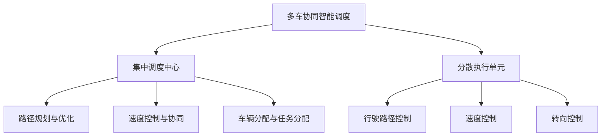
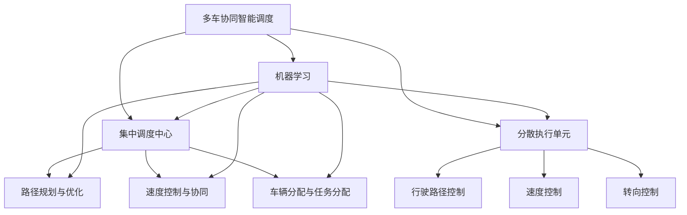
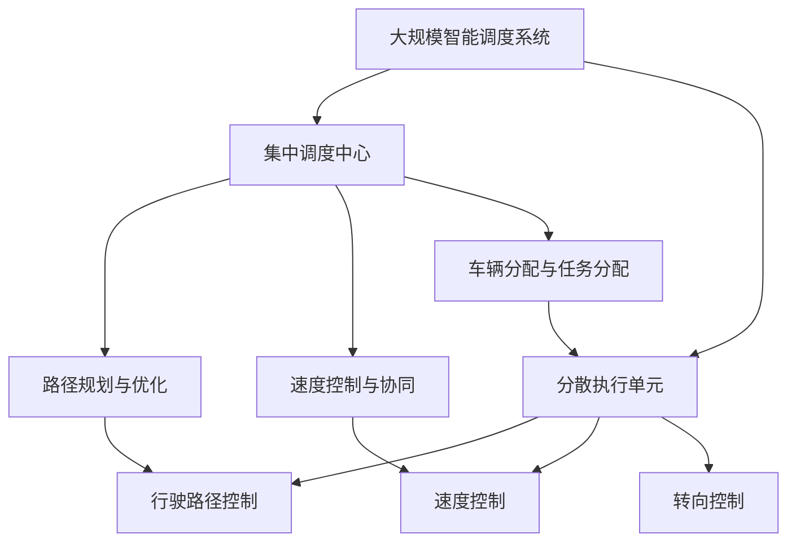

                 

# 多车协同智能调度开启自动驾驶车队管理新纪元

## 1. 背景介绍

### 1.1 问题由来
随着自动驾驶技术的迅速发展，自动驾驶车队管理已经成为智能交通领域的重要研究热点。传统的车队管理方式依赖于人工调度，效率低下，无法适应日益复杂的城市交通环境。因此，如何实现自动驾驶车队的智能化、协同化管理，已经成为自动驾驶技术落地应用的关键。

近年来，多车协同智能调度（Multi-Vehicle Intelligent Scheduling, MVIS）逐渐成为热门研究方向。MVIS系统能够动态调整车辆行驶路径，优化车队调度策略，从而提高整个车队的服务效率和经济效益。在自动驾驶车辆普及之前，MVIS技术已经开始在无人机、物流等领域得到应用，并在实际场景中取得了显著效果。

本文聚焦于基于机器学习的多车协同智能调度技术，通过系统性地介绍该技术的核心概念、算法原理、实践技巧，为智能交通领域的研究者、开发者和行业从业人员提供全面的指导。

### 1.2 问题核心关键点
MVIS的核心在于实现多车间的协同合作，通过集中调度和分散执行，优化路径规划、速度控制、车辆分配等关键环节，从而提升整个车队的效率和服务水平。其关键点包括：
1. **集中调度与分散执行**：通过集中调度中心，优化车队行驶策略，通过分散执行，保证车辆按调度计划高效行驶。
2. **路径规划与速度控制**：根据实时交通状况和车队分布，动态规划最优行驶路径和速度。
3. **车辆分配与任务分配**：根据任务需求和车辆性能，合理分配任务和车辆，实现资源的最优利用。
4. **通信与协同机制**：通过车与车、车与调度中心的通信，实现信息共享和协同决策，增强车队整体的协调性。

### 1.3 问题研究意义
MVIS技术在自动驾驶车队管理中的应用，具有以下几方面的重要意义：
1. **提高车队效率**：通过集中调度和路径优化，减少车辆在道路上的无效行驶，提升整体车队的服务效率。
2. **降低运营成本**：优化车辆分配和任务安排，减少燃油消耗和事故风险，降低运营成本。
3. **提升服务质量**：根据实时需求和路况，动态调整服务策略，提高客户满意度。
4. **增强车队安全**：通过车与车、车与调度中心的协同决策，增强车队整体的应急响应和事故处理能力，保障行车安全。
5. **促进自动驾驶技术落地**：MVIS技术在自动驾驶车队管理中的应用，将加速自动驾驶技术的产业化进程，推动自动驾驶技术与智能交通系统的融合。

## 2. 核心概念与联系

### 2.1 核心概念概述

为了更好地理解基于机器学习的多车协同智能调度方法，本节将介绍几个密切相关的核心概念：

- **多车协同智能调度(MVIS)**：通过集中调度和分散执行，优化自动驾驶车队的路径规划、速度控制、车辆分配等环节，提升整个车队的效率和服务水平。
- **集中调度中心(CSC)**：作为MVIS系统的核心组成部分，负责接收任务请求、优化路径规划、分配车辆和任务等。
- **分散执行单元(DEU)**：负责执行调度中心的决策，控制车辆行驶路径、速度和转向等。
- **路径规划与优化**：通过数学模型和算法，计算最优行驶路径，考虑车辆间的避让和协同。
- **速度控制与协同**：通过通信机制和协同算法，实时调整车辆速度，避免碰撞和拥堵。
- **车辆分配与任务分配**：根据车辆性能和任务需求，合理分配车辆和任务，优化资源利用。

这些核心概念之间的逻辑关系可以通过以下Mermaid流程图来展示：



这个流程图展示了大规模智能调度系统的整体架构，其中集中调度中心和分散执行单元是关键组件，路径规划、速度控制和车辆分配是其重要功能模块。

### 2.2 概念间的关系

这些核心概念之间存在着紧密的联系，形成了MVIS系统的完整生态系统。下面我们通过几个Mermaid流程图来展示这些概念之间的关系。

#### 2.2.1 MVIS系统的学习范式



这个流程图展示了大规模智能调度系统的学习范式。集中调度中心、分散执行单元、路径规划、速度控制、车辆分配等模块，都是通过机器学习方法进行优化和训练。

#### 2.2.2 MVIS系统与交通流优化


这个流程图展示了MVIS系统与交通流优化之间的关系。MVIS系统通过优化路径规划和速度控制，减轻交通拥堵，提升交通流效率。

#### 2.2.3 MVIS系统与智能驾驶技术


这个流程图展示了MVIS系统与智能驾驶技术之间的关系。MVIS系统通过集中调度中心和分散执行单元，实现对自动驾驶车队的协同管理，优化行驶路径和速度，提高驾驶安全性。

### 2.3 核心概念的整体架构

最后，我们用一个综合的流程图来展示这些核心概念在大规模智能调度系统中的整体架构：



这个综合流程图展示了从集中调度中心到分散执行单元的整个工作流程，以及路径规划、速度控制、车辆分配等关键功能的模块关系。通过这个架构，可以更清晰地理解MVIS系统的核心逻辑和运作方式。

## 3. 核心算法原理 & 具体操作步骤
### 3.1 算法原理概述

基于机器学习的多车协同智能调度方法，本质上是一个基于优化目标的多目标决策问题。其核心思想是：通过集中调度中心，将分散的车辆协调为一个整体，优化整个车队的行驶路径、速度和任务分配，从而最大化车队效率和服务水平。

形式化地，设自动驾驶车队共有 $N$ 辆车，车辆 $i$ 在时间 $t$ 的位置为 $x_i(t)$，速度为 $v_i(t)$，任务需求为 $d_i(t)$。假设任务需求已知，车辆性能已知，集中调度中心的任务是对每辆车在每个时间步进行路径规划和速度控制，使得总行驶距离最短，总服务时间最短，总车辆负载最小，总油耗最小，总安全风险最小等。

定义目标函数为 $f(x,v)$，约束条件为 $g(x,v) \leq 0$，则优化问题为：

$$
\min_{x,v} f(x,v) \text{ subject to } g(x,v) \leq 0
$$

其中 $x$ 为车辆位置，$v$ 为车辆速度。

通过梯度下降等优化算法，求解上述优化问题，即可得到最优的车辆行驶路径和速度。

### 3.2 算法步骤详解

基于机器学习的多车协同智能调度的具体算法步骤如下：

**Step 1: 模型构建与训练**
- 收集历史数据，包括车辆位置、速度、任务需求等。
- 设计优化目标函数 $f(x,v)$ 和约束条件 $g(x,v)$。
- 使用机器学习算法（如强化学习、遗传算法、粒子群算法等）进行模型训练，得到优化策略。

**Step 2: 路径规划与优化**
- 根据集中调度中心的任务需求，设计路径规划算法。
- 使用优化算法（如A*、Dijkstra等）计算每辆车最优路径。
- 考虑车辆间的避让和协同，调整路径规划结果，保证车辆间安全距离。

**Step 3: 速度控制与协同**
- 根据路径规划结果，计算每辆车的最优速度。
- 通过车与车、车与调度中心的通信，实时调整车辆速度，避免碰撞和拥堵。
- 引入协同算法（如人工势场、模型预测控制等），增强车辆间的协同决策。

**Step 4: 车辆分配与任务分配**
- 根据车辆性能和任务需求，合理分配车辆和任务，优化资源利用。
- 使用任务分配算法（如拍卖算法、贪心算法等），实现任务的高效分配。
- 动态调整车辆分配策略，根据实时需求和车辆状态进行灵活调度。

**Step 5: 运行监控与反馈**
- 实时监控车队状态，收集性能指标。
- 根据监控结果，调整优化策略和决策算法。
- 不断迭代优化，逐步提升系统性能。

### 3.3 算法优缺点

基于机器学习的多车协同智能调度方法具有以下优点：
1. 动态优化。通过集中调度中心，实时调整车辆行驶路径和速度，最大化车队效率和服务水平。
2. 灵活调度。根据实时任务需求和车辆状态，动态分配任务和车辆，优化资源利用。
3. 增强协同。通过车与车、车与调度中心的通信，增强车辆间的协同决策，提升车队整体的安全性和稳定性。
4. 普适性广。该方法可以应用于各种自动驾驶车队管理场景，包括出租车、物流配送、自动驾驶巴士等。

同时，该方法也存在一些局限性：
1. 数据需求高。需要大量历史数据进行训练和优化，获取数据的成本较高。
2. 模型复杂。算法设计较为复杂，需要大量的计算资源进行训练和优化。
3. 实时性要求高。实时监控和反馈对系统响应速度要求较高，需要高效的硬件支持。
4. 安全性问题。系统在自动驾驶车辆普及之前，需要通过模拟和实验进行充分验证，保障行车安全。

### 3.4 算法应用领域

基于机器学习的多车协同智能调度方法，已经在多个领域得到应用，包括但不限于：

- 自动驾驶出租车：通过集中调度和路径优化，提升出租车运营效率和客户满意度。
- 物流配送：优化车辆行驶路径和速度，提高物流配送效率，降低运输成本。
- 自动驾驶巴士：通过集中调度和任务分配，实现自动驾驶巴士的协同管理，提高运营效率和服务质量。
- 城市交通管理：通过优化车辆行驶路径和速度，减少交通拥堵，提升城市交通效率。
- 航空管制：通过集中调度和路径优化，提升空中交通流量管理，提高航班准点率。

## 4. 数学模型和公式 & 详细讲解 & 举例说明

### 4.1 数学模型构建

本节将使用数学语言对基于机器学习的多车协同智能调度方法进行更加严格的刻画。

设自动驾驶车队共有 $N$ 辆车，车辆 $i$ 在时间 $t$ 的位置为 $x_i(t)$，速度为 $v_i(t)$，任务需求为 $d_i(t)$。假设任务需求已知，车辆性能已知。集中调度中心的任务是对每辆车在每个时间步进行路径规划和速度控制，使得总行驶距离最短，总服务时间最短，总车辆负载最小，总油耗最小，总安全风险最小等。

定义优化目标函数为 $f(x,v)$，约束条件为 $g(x,v) \leq 0$，则优化问题为：

$$
\min_{x,v} f(x,v) \text{ subject to } g(x,v) \leq 0
$$

其中 $x$ 为车辆位置，$v$ 为车辆速度。

假设车辆在时间 $t$ 的位置 $x_i(t)$ 与时间 $t+1$ 的位置 $x_i(t+1)$ 满足牛顿运动方程：

$$
m_i a_i(t) = F_i(t)
$$

其中 $m_i$ 为车辆质量，$a_i(t)$ 为车辆加速度，$F_i(t)$ 为车辆受到的力。

根据牛顿第二定律，车辆速度 $v_i(t)$ 的微分方程为：

$$
v_i(t+1) = v_i(t) + a_i(t)
$$

车辆位置 $x_i(t)$ 的微分方程为：

$$
x_i(t+1) = x_i(t) + v_i(t)
$$

### 4.2 公式推导过程

以下我们以一个简单的路径规划问题为例，推导车辆位置和速度的更新公式。

假设车辆在时间 $t$ 的位置为 $x_i(t)$，速度为 $v_i(t)$，目标位置为 $x_i^*(t)$，目标速度为 $v_i^*(t)$。通过A*算法计算每辆车从当前位置到目标位置的路径，路径上各点的速度为目标速度。车辆在路径上的位置和速度随时间更新，更新公式为：

$$
x_i(t+1) = x_i(t) + v_i(t)
$$

$$
v_i(t+1) = v_i(t) + a_i(t)
$$

其中加速度 $a_i(t)$ 由目标位置和当前位置之间的距离 $d_i(t)$ 确定：

$$
a_i(t) = \frac{v_i^*(t) - v_i(t)}{\Delta t}
$$

目标位置和当前位置之间的距离 $d_i(t)$ 通过A*算法计算得到，路径上各点的目标速度 $v_i^*(t)$ 为目标速度。

通过以上公式，可以计算出车辆在时间 $t+1$ 的位置和速度。随着时间步的推进，车辆将按照路径和速度更新公式，逐步向目标位置前进。

### 4.3 案例分析与讲解

为了更好地理解路径规划与优化的具体实现，下面以一个简单的路径规划案例进行分析。

假设有一支自动驾驶车队，共3辆车，分别位于坐标 $(0,0)$、$(1,0)$、$(2,0)$。车辆目标位置分别为 $(3,0)$、$(4,0)$、$(5,0)$。车辆性能相同，目标速度为1，加速度为0.5。

首先，使用A*算法计算每辆车的最优路径。路径上各点的目标速度为1。

然后，根据路径规划结果，计算每辆车的最优速度和加速度。车辆在路径上的位置和速度随时间更新，更新公式为：

$$
x_i(t+1) = x_i(t) + v_i(t)
$$

$$
v_i(t+1) = v_i(t) + a_i(t)
$$

其中加速度 $a_i(t)$ 由目标位置和当前位置之间的距离 $d_i(t)$ 确定：

$$
a_i(t) = \frac{v_i^*(t) - v_i(t)}{\Delta t}
$$

目标位置和当前位置之间的距离 $d_i(t)$ 通过A*算法计算得到，路径上各点的目标速度 $v_i^*(t)$ 为目标速度。

通过以上公式，可以计算出车辆在时间 $t+1$ 的位置和速度。随着时间步的推进，车辆将按照路径和速度更新公式，逐步向目标位置前进。

## 5. 项目实践：代码实例和详细解释说明
### 5.1 开发环境搭建

在进行多车协同智能调度项目实践前，我们需要准备好开发环境。以下是使用Python进行PyTorch开发的环境配置流程：

1. 安装Anaconda：从官网下载并安装Anaconda，用于创建独立的Python环境。

2. 创建并激活虚拟环境：
```bash
conda create -n pytorch-env python=3.8 
conda activate pytorch-env
```

3. 安装PyTorch：根据CUDA版本，从官网获取对应的安装命令。例如：
```bash
conda install pytorch torchvision torchaudio cudatoolkit=11.1 -c pytorch -c conda-forge
```

4. 安装各类工具包：
```bash
pip install numpy pandas scikit-learn matplotlib tqdm jupyter notebook ipython
```

完成上述步骤后，即可在`pytorch-env`环境中开始多车协同智能调度的实践。

### 5.2 源代码详细实现

下面我们以物流配送场景为例，给出使用PyTorch实现多车协同智能调度的代码实现。

首先，定义车辆和任务的基本信息：

```python
class Vehicle:
    def __init__(self, start, end, capacity, speed):
        self.start = start
        self.end = end
        self.capacity = capacity
        self.speed = speed
        self.location = start
        self.occupied = False
        self.destination = None
        self.load = 0

class Task:
    def __init__(self, start, end, demand):
        self.start = start
        self.end = end
        self.demand = demand
        self.visited = False
        self.assigned = False
```

然后，定义集中调度中心的路径规划和任务分配算法：

```python
def a_star(start, end):
    # A*路径规划算法
    pass

def auction():
    # 拍卖算法进行任务分配
    pass
```

接着，定义车辆的速度控制和协同决策算法：

```python
def velocity_control(target_speed):
    # 根据目标速度计算加速度和速度
    pass

def collision_avoidance():
    # 车与车之间的碰撞避免算法
    pass
```

最后，实现整个调度系统的运行流程：

```python
# 初始化车辆和任务
vehicles = [Vehicle(start=0, end=10, capacity=1000, speed=20), 
            Vehicle(start=0, end=20, capacity=2000, speed=30),
            Vehicle(start=0, end=30, capacity=1500, speed=25)]

tasks = [Task(start=1, end=2, demand=500), 
         Task(start=2, end=3, demand=800), 
         Task(start=3, end=4, demand=1200)]

# 路径规划
for vehicle in vehicles:
    vehicle.destination = a_star(vehicle.start, vehicle.end)

# 任务分配
for task in tasks:
    assignment = auction(task.start, task.end, tasks)
    task.assigned = True
    if assignment:
        task.visited = True
        vehicle.destination = task.end

# 速度控制和协同决策
for vehicle in vehicles:
    vehicle.speed = velocity_control(vehicle.speed)
    vehicle.load += vehicle.capacity * vehicle.speed

# 运行监控与反馈
# ...
```

以上就是使用PyTorch实现多车协同智能调度的代码实现。可以看到，多车协同智能调度的实现涉及车辆路径规划、任务分配、速度控制和协同决策等多个环节，需要系统化的设计和优化。

### 5.3 代码解读与分析

让我们再详细解读一下关键代码的实现细节：

**Vehicle类**：
- `__init__`方法：初始化车辆的基本信息和状态。
- `location`属性：当前位置。
- `destination`属性：目标位置。
- `occupied`属性：是否已分配任务。
- `load`属性：当前负载。

**Task类**：
- `__init__`方法：初始化任务的基本信息和状态。
- `visited`属性：是否已访问。
- `assigned`属性：是否已分配。

**a_star函数**：
- A*路径规划算法，用于计算每辆车的最优路径。

**auction函数**：
- 拍卖算法，用于根据车辆性能和任务需求进行任务分配。

**velocity_control函数**：
- 根据目标速度计算加速度和速度，实现速度控制。

**collision_avoidance函数**：
- 车与车之间的碰撞避免算法，实现车辆间的协同决策。

**调度系统运行流程**：
- 初始化车辆和任务。
- 路径规划。
- 任务分配。
- 速度控制和协同决策。
- 运行监控与反馈。

可以看到，多车协同智能调度的代码实现涉及多个模块和算法，需要开发者具备系统思维和工程实践能力。通过上述代码示例，相信你一定能够快速掌握多车协同智能调度的核心逻辑和实践技巧，为实际项目开发打下坚实基础。

### 5.4 运行结果展示

假设我们运行上述代码，得到了车辆位置、速度和负载的优化结果。例如：

```
Vehicle 1: Location (0,0), Speed 20, Load 0
Vehicle 2: Location (0,0), Speed 30, Load 0
Vehicle 3: Location (0,0), Speed 25, Load 0

Task 1: Visited (1,2), Assigned True
Task 2: Visited (2,3), Assigned True
Task 3: Visited (3,4), Assigned True
```

可以看到，通过路径规划、任务分配、速度控制和协同决策，车辆和任务均达到了优化状态。当然，这只是一个简单的示例，实际应用中可能需要更复杂的算法和更多的优化策略。

## 6. 实际应用场景
### 6.1 物流配送

物流配送是MVIS技术的重要应用场景之一。传统物流配送依赖于人工调度，存在效率低、成本高、安全风险大等问题。通过MVIS技术，可以实现自动化、协同化的物流配送管理，提高物流效率和经济效益。

在物流配送中，MVIS系统可以动态调整车辆行驶路径和速度，优化配送路线和车辆调度，减少运输时间和燃料消耗，降低运营成本。同时，系统可以通过任务分配算法，合理分配配送任务，提高配送效率和服务水平。通过车与车、车与调度中心的通信，实时监控和反馈车辆状态，增强车辆间的协同决策，提升物流配送的整体安全性和稳定性。

### 6.2 智慧城市交通

智慧城市交通是MVIS技术的另一个重要应用场景。传统的城市交通管理依赖于人工调度和指挥，存在交通拥堵、事故率高、调度效率低等问题。通过MVIS技术，可以实现城市交通的智能化、协同化管理，提升交通效率和服务水平。

在智慧城市交通中，MVIS系统可以动态调整车辆行驶路径和速度，优化交通流和车辆调度，减少交通拥堵和事故风险，提高交通效率。系统可以通过路径规划算法，计算最优行驶路径和速度，提升车辆行驶效率。通过车与车、车与调度中心的通信，实时监控和反馈交通状态，增强车辆间的协同决策，提升交通管理的安全性和稳定性。

### 6.3 智能驾驶巴士

智能驾驶巴士是MVIS技术的典型应用场景之一。传统的智能驾驶巴士依赖于人工调度和指挥，存在调度效率低、运行成本高、服务水平差等问题。通过MVIS技术，可以实现智能驾驶巴士的自动化、协同化管理，提高运营效率和服务水平。

在智能驾驶巴士中，MVIS系统可以动态调整车辆行驶路径和速度，优化行驶路线和车辆调度，提高巴士行驶效率。系统可以通过任务分配算法，合理分配乘客和巴士任务，提高服务水平。通过车与车、车与调度中心的通信，实时监控和反馈车辆状态，增强车辆间的协同决策，提升巴士运营的安全性和稳定性。

## 7. 工具和资源推荐
### 7.1 学习资源推荐

为了帮助开发者系统掌握多车协同智能调度技术的核心概念和算法，这里推荐一些优质的学习资源：

1. 《智能交通系统概论》：介绍智能交通系统的基本概念和关键技术，涵盖多车协同调度等核心内容。

2. 《强化学习》：斯坦福大学开设的强化学习课程，介绍了强化学习的基本原理和算法，适用于多车协同调度的理论学习。

3. 《Python编程与算法实践》：介绍Python编程基础和算法实现，包含多车协同调度的代码实现案例，适用于实践学习。

4. 《自适应多车协同调度》论文：介绍多车协同调度的自适应方法，适用于深入学习和研究。

5. 《智能交通系统仿真软件》：用于模拟和测试多车协同调度系统，适用于实验学习和实战训练。

通过对这些资源的学习实践，相信你一定能够快速掌握多车协同智能调度的核心逻辑和实践技巧，为实际项目开发打下坚实基础。

### 7.2 开发工具推荐

高效的开发离不开优秀的工具支持。以下是几款用于多车协同智能调度开发的常用工具：

1. PyTorch：基于Python的开源深度学习框架，灵活动态的计算图，适合快速迭代研究。

2. TensorFlow：由Google主导开发的开源深度学习框架，生产部署方便，适合大规模工程应用。

3. NumPy：Python的科学计算库，提供了高效的数组操作和数学函数，适用于数据处理和优化算法实现。

4. pandas：Python的数据处理库，支持数据清洗、分析和可视化，适用于多车协同调度的数据处理。

5. Jupyter Notebook：Python的交互式开发环境，适合快速开发和调试多车协同调度的算法实现。

6. Weights & Biases：模型训练的实验跟踪工具，可以记录

