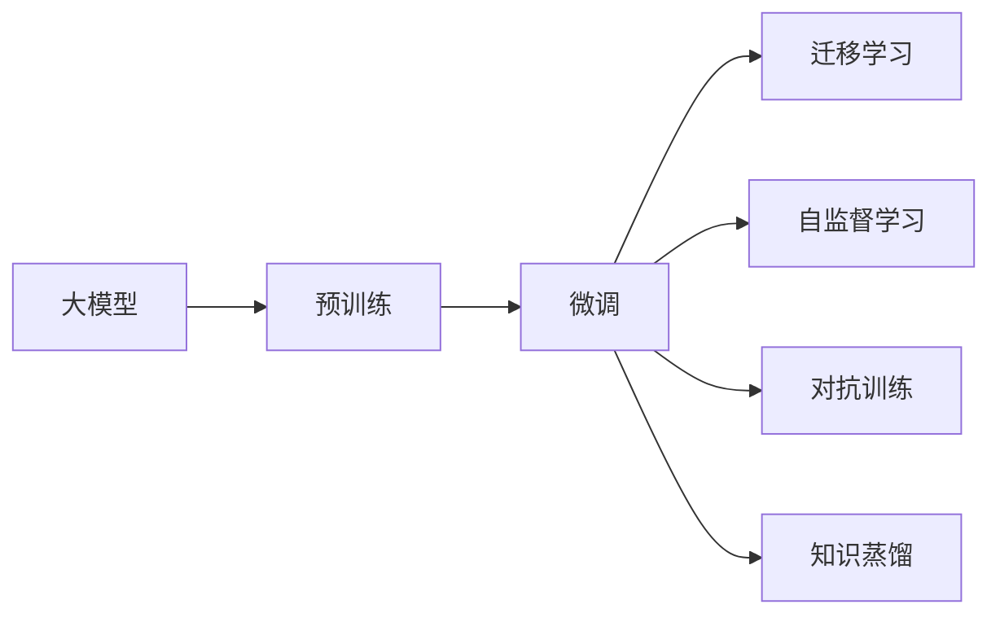

                 

# 大模型助力创业者实现技术突破与产品创新

> 关键词：大模型, 技术突破, 产品创新, 创业, 应用场景, 机器学习, 自然语言处理(NLP), 深度学习, 算法优化, 创新引擎

## 1. 背景介绍

### 1.1 问题由来
在当今信息时代，技术创新已成为推动企业发展的重要驱动力。然而，技术创新不仅需要卓越的人才和丰富的资金，还需要强大的技术储备和广阔的应用场景。对于许多创业者来说，面临的最大挑战之一是如何将技术突破转化为实际的产品创新，并将其迅速商业化。在这一过程中，大模型（如GPT-3、BERT等）扮演着至关重要的角色，成为创业者实现技术突破与产品创新的有力助手。

### 1.2 问题核心关键点
大模型之所以能够在技术突破与产品创新中发挥重要作用，主要基于以下几点：

1. **广泛的语言理解能力**：大模型通过海量的无标签文本数据进行预训练，具备强大的语言理解和生成能力，能够理解和处理各种复杂的自然语言任务。
2. **高效的模型迁移能力**：大模型在特定领域进行微调时，能够快速适应新任务，在少量标注数据上取得显著性能提升。
3. **强大的数据处理能力**：大模型可以处理大规模、复杂的数据集，辅助创业者进行数据分析和处理。
4. **丰富的应用场景**：大模型在文本生成、问答、情感分析、翻译等众多领域均有广泛应用，能够辅助创业者快速构建出具备实际应用价值的产品。

### 1.3 问题研究意义
对于创业者而言，利用大模型进行技术突破与产品创新，具有以下重要意义：

1. **降低技术门槛**：大模型提供了成熟的技术框架和预训练模型，大大降低了技术入门的门槛，使得非技术背景的创业者也能快速上手。
2. **提高开发效率**：大模型能够自动化处理大量数据和复杂的自然语言任务，极大地提高了产品开发的效率。
3. **优化成本结构**：相比于从头开始研发和部署全新的系统，利用大模型进行微调和优化，可以显著降低研发和运营成本。
4. **增强市场竞争力**：大模型的强大功能使得创业者能够在短时间内推出高技术含量的产品，提升市场竞争力。
5. **推动产品创新**：大模型的高效迁移能力使得创业者能够在不同领域快速实现技术突破和产品创新，带来新的商业机会。

## 2. 核心概念与联系

### 2.1 核心概念概述

在介绍大模型在技术突破与产品创新中的应用前，我们先简要介绍几个核心概念：

- **大模型(Large Model)**：指使用深度学习技术，在大量数据上预训练出的庞大神经网络模型，如GPT-3、BERT等。
- **预训练(Pre-training)**：指在大规模无标签数据上进行自监督学习，学习通用的语言表示。
- **微调(Fine-tuning)**：指在预训练模型的基础上，使用特定任务的有标签数据进行微调，以适应该任务的要求。
- **迁移学习(Transfer Learning)**：指将一个领域学到的知识迁移到另一个领域，用于新的任务。
- **自监督学习(Self-supervised Learning)**：指在无标签数据上，通过设计自监督任务（如掩码语言模型）学习模型的表示能力。
- **对抗训练(Adversarial Training)**：指在训练过程中引入对抗样本，提高模型的鲁棒性和泛化能力。
- **知识蒸馏(Knowledge Distillation)**：指将大模型的知识迁移到较小的模型上，以提升后者的性能。

这些概念构成了大模型在技术突破与产品创新中的基础框架。通过预训练和微调，大模型能够快速适应新任务，同时在迁移学习、自监督学习、对抗训练和知识蒸馏等技术的辅助下，进一步提升模型的性能和泛化能力。

### 2.2 概念间的关系

这些核心概念之间存在着紧密的联系，形成了一个有机的大模型生态系统。以下是这些概念之间关系的简单示意图：



这个流程图展示了从预训练到大模型微调的基本流程，以及在微调过程中可以应用的技术和策略。

## 3. 核心算法原理 & 具体操作步骤

### 3.1 算法原理概述

大模型在技术突破与产品创新中的核心算法原理基于监督学习和迁移学习。具体而言，大模型首先在大规模无标签数据上预训练，学习到通用的语言表示。然后，通过在特定任务上有标签的数据集上进行微调，将通用表示转化为适合特定任务的语言表示。最后，通过迁移学习，将新任务的知识迁移到已有的大模型中，进一步提升模型的性能和泛化能力。

这一过程可以分为以下几个关键步骤：

1. **数据准备**：收集和预处理特定任务的标注数据集。
2. **模型微调**：在预训练模型基础上，使用标注数据进行有监督的微调。
3. **模型评估**：在验证集上评估微调后的模型性能，进行必要的调参和优化。
4. **模型部署**：将微调后的模型部署到实际应用场景中，进行大规模的生产和测试。

### 3.2 算法步骤详解

以下我们将详细介绍大模型在技术突破与产品创新中的具体操作步骤。

#### 3.2.1 数据准备

数据准备是大模型应用的基础。对于特定任务，需要收集和预处理相应的标注数据集。以下是一些常见数据预处理步骤：

1. **数据清洗**：去除无效数据、处理缺失值和异常值。
2. **数据标注**：将数据集中的文本标注为相应的标签或类别。
3. **数据划分**：将数据集划分为训练集、验证集和测试集。
4. **数据增强**：通过对数据进行一系列变换（如回译、近义替换），扩充训练集。

#### 3.2.2 模型微调

模型微调是大模型应用的灵魂。在预训练模型的基础上，通过标注数据集进行有监督的微调，使得模型在特定任务上取得更好的性能。以下是模型微调的基本步骤：

1. **模型选择**：选择合适的预训练模型，如GPT-3、BERT等。
2. **模型加载**：将预训练模型加载到内存中。
3. **模型微调**：在微调过程中，使用标注数据集进行训练，调整模型的参数。
4. **模型评估**：在验证集上评估微调后的模型性能，进行必要的调整和优化。

#### 3.2.3 模型评估

模型评估是确保微调模型性能的关键步骤。以下是模型评估的基本步骤：

1. **模型测试**：在测试集上测试微调后的模型，计算各项性能指标（如准确率、F1分数）。
2. **性能分析**：根据测试结果，分析模型在特定任务上的表现，找出可能的改进点。
3. **参数优化**：根据性能分析结果，调整模型的参数，进一步优化模型性能。

#### 3.2.4 模型部署

模型部署是大模型应用的最终环节。以下是模型部署的基本步骤：

1. **模型保存**：将微调后的模型保存为二进制文件或模型格式文件，便于后续使用。
2. **API封装**：将模型封装为API接口，便于与应用程序集成。
3. **性能监控**：在生产环境中，实时监控模型的性能和运行状态，进行必要的调整和优化。

### 3.3 算法优缺点

大模型在技术突破与产品创新中具有以下优点：

1. **高效性**：大模型能够在短时间内实现技术突破和产品创新，提高研发和运营效率。
2. **泛化能力**：大模型在大量数据上预训练，具备强大的泛化能力，能够在各种场景下取得良好的性能。
3. **灵活性**：大模型可以通过微调和迁移学习快速适应新任务，满足不同领域的需求。
4. **可扩展性**：大模型在预训练和微调过程中，可以灵活调整模型结构，提升模型的性能和效率。

然而，大模型也存在一些缺点：

1. **资源消耗高**：大模型通常需要高性能的硬件设备（如GPU、TPU）进行训练和推理，成本较高。
2. **训练时间较长**：大模型的训练时间通常较长，需要较大的计算资源。
3. **模型复杂度高**：大模型的结构和参数较为复杂，难以进行手动调试和优化。
4. **依赖标注数据**：大模型依赖大量的标注数据进行微调，标注成本较高。

### 3.4 算法应用领域

大模型在技术突破与产品创新中有着广泛的应用领域。以下是几个典型的应用场景：

1. **自然语言处理(NLP)**：大模型在文本分类、情感分析、问答系统、机器翻译等任务中表现优异，能够辅助创业者快速构建出具备实际应用价值的产品。
2. **推荐系统**：大模型在个性化推荐、广告推荐、内容推荐等任务中，能够根据用户行为和兴趣推荐相关产品，提升用户体验。
3. **图像识别**：大模型在图像分类、目标检测、图像生成等任务中，能够识别和生成高质量的图像内容，满足视觉应用需求。
4. **语音识别**：大模型在语音识别、语音生成、语音翻译等任务中，能够理解和生成自然流畅的语音内容，满足语音应用需求。
5. **智能客服**：大模型在智能客服、语音助手等任务中，能够自然流畅地与用户互动，提升客户服务体验。
6. **智能制造**：大模型在智能制造、工业互联网等领域，能够辅助企业进行生产调度、质量检测等任务，提升生产效率和质量。

## 4. 数学模型和公式 & 详细讲解 & 举例说明

### 4.1 数学模型构建

大模型在特定任务上的微调，通常使用监督学习的方式进行。以下是一个简单的数学模型构建过程：

设大模型为 $M_{\theta}$，其中 $\theta$ 为模型参数。给定特定任务的标注数据集 $D=\{(x_i,y_i)\}_{i=1}^N$，其中 $x_i$ 为输入文本，$y_i$ 为标签或类别。

定义模型 $M_{\theta}$ 在输入 $x_i$ 上的输出为 $\hat{y}=M_{\theta}(x_i)$，则二分类任务下的交叉熵损失函数定义为：

$$
\ell(M_{\theta}(x_i),y_i) = -[y_i\log \hat{y} + (1-y_i)\log (1-\hat{y})]
$$

在此基础上，定义模型在数据集 $D$ 上的经验风险为：

$$
\mathcal{L}(\theta) = \frac{1}{N}\sum_{i=1}^N \ell(M_{\theta}(x_i),y_i)
$$

微调的目标是最小化经验风险，即找到最优参数：

$$
\theta^* = \mathop{\arg\min}_{\theta} \mathcal{L}(\theta)
$$

通过梯度下降等优化算法，微调过程不断更新模型参数 $\theta$，最小化损失函数 $\mathcal{L}$，使得模型输出逼近真实标签。

### 4.2 公式推导过程

以下是二分类任务下的交叉熵损失函数的推导过程：

设模型在输入 $x_i$ 上的输出为 $\hat{y}=M_{\theta}(x_i)$，真实标签为 $y_i$，则二分类交叉熵损失函数为：

$$
\ell(M_{\theta}(x_i),y_i) = -[y_i\log \hat{y} + (1-y_i)\log (1-\hat{y})]
$$

将 $\hat{y}$ 看作模型输出的概率，则上述损失函数可以写作：

$$
\ell(M_{\theta}(x_i),y_i) = -y_i\log M_{\theta}(x_i) - (1-y_i)\log(1-M_{\theta}(x_i))
$$

定义模型在数据集 $D$ 上的经验风险为：

$$
\mathcal{L}(\theta) = \frac{1}{N}\sum_{i=1}^N \ell(M_{\theta}(x_i),y_i)
$$

根据链式法则，损失函数对模型参数 $\theta$ 的梯度为：

$$
\frac{\partial \mathcal{L}(\theta)}{\partial \theta_k} = -\frac{1}{N}\sum_{i=1}^N [(y_i/M_{\theta}(x_i)) - (1-y_i)/(1-M_{\theta}(x_i))] \frac{\partial M_{\theta}(x_i)}{\partial \theta_k}
$$

其中 $\frac{\partial M_{\theta}(x_i)}{\partial \theta_k}$ 为模型对输入 $x_i$ 的梯度，可以通过自动微分技术计算得到。

在得到损失函数的梯度后，即可带入优化算法更新模型参数 $\theta$，最小化损失函数 $\mathcal{L}$。

### 4.3 案例分析与讲解

以情感分析任务为例，分析大模型在微调过程中的具体实现。

#### 4.3.1 数据准备

收集一组电影评论数据集，每条评论标注为正面、负面或中性。将数据集划分为训练集、验证集和测试集，每个集合约占总数据的80%、10%和10%。

#### 4.3.2 模型选择

选择预训练模型BERT作为基础模型，加载并初始化模型参数。

#### 4.3.3 模型微调

定义一个简单的分类器，使用线性分类器和交叉熵损失函数。在训练集上对模型进行微调，学习电影评论的情感分类能力。

#### 4.3.4 模型评估

在验证集上评估微调后的模型性能，计算准确率和F1分数。根据验证结果，调整学习率和模型结构，进一步优化模型性能。

#### 4.3.5 模型部署

将微调后的模型保存为二进制文件，封装成API接口，部署到生产环境中。在生产环境中，实时监控模型的性能和运行状态，进行必要的调整和优化。

## 5. 项目实践：代码实例和详细解释说明

### 5.1 开发环境搭建

在进行大模型应用前，需要先搭建好开发环境。以下是使用Python进行PyTorch开发的环境配置流程：

1. 安装Anaconda：从官网下载并安装Anaconda，用于创建独立的Python环境。
2. 创建并激活虚拟环境：
```bash
conda create -n pytorch-env python=3.8 
conda activate pytorch-env
```
3. 安装PyTorch：根据CUDA版本，从官网获取对应的安装命令。例如：
```bash
conda install pytorch torchvision torchaudio cudatoolkit=11.1 -c pytorch -c conda-forge
```
4. 安装Transformers库：
```bash
pip install transformers
```
5. 安装各类工具包：
```bash
pip install numpy pandas scikit-learn matplotlib tqdm jupyter notebook ipython
```

完成上述步骤后，即可在`pytorch-env`环境中开始大模型应用实践。

### 5.2 源代码详细实现

以下是一个简单的情感分析任务的大模型应用代码实现。

```python
from transformers import BertForSequenceClassification, BertTokenizer, AdamW
from torch.utils.data import Dataset, DataLoader
import torch

# 定义数据集
class MovieReviewDataset(Dataset):
    def __init__(self, texts, labels, tokenizer, max_len=128):
        self.texts = texts
        self.labels = labels
        self.tokenizer = tokenizer
        self.max_len = max_len
        
    def __len__(self):
        return len(self.texts)
    
    def __getitem__(self, item):
        text = self.texts[item]
        label = self.labels[item]
        
        encoding = self.tokenizer(text, return_tensors='pt', max_length=self.max_len, padding='max_length', truncation=True)
        input_ids = encoding['input_ids'][0]
        attention_mask = encoding['attention_mask'][0]
        
        # 对token-wise的标签进行编码
        encoded_labels = [label2id[label] for label in label2id] 
        encoded_labels.extend([label2id['O']] * (self.max_len - len(encoded_labels)))
        labels = torch.tensor(encoded_labels, dtype=torch.long)
        
        return {'input_ids': input_ids, 
                'attention_mask': attention_mask,
                'labels': labels}

# 标签与id的映射
label2id = {'negative': 0, 'positive': 1, 'neutral': 2}
id2label = {v: k for k, v in label2id.items()}

# 创建dataset
tokenizer = BertTokenizer.from_pretrained('bert-base-uncased')

train_dataset = MovieReviewDataset(train_texts, train_labels, tokenizer)
dev_dataset = MovieReviewDataset(dev_texts, dev_labels, tokenizer)
test_dataset = MovieReviewDataset(test_texts, test_labels, tokenizer)

# 定义模型和优化器
model = BertForSequenceClassification.from_pretrained('bert-base-uncased', num_labels=len(label2id))

optimizer = AdamW(model.parameters(), lr=2e-5)

# 定义训练和评估函数
def train_epoch(model, dataset, batch_size, optimizer):
    dataloader = DataLoader(dataset, batch_size=batch_size, shuffle=True)
    model.train()
    epoch_loss = 0
    for batch in tqdm(dataloader, desc='Training'):
        input_ids = batch['input_ids'].to(device)
        attention_mask = batch['attention_mask'].to(device)
        labels = batch['labels'].to(device)
        model.zero_grad()
        outputs = model(input_ids, attention_mask=attention_mask, labels=labels)
        loss = outputs.loss
        epoch_loss += loss.item()
        loss.backward()
        optimizer.step()
    return epoch_loss / len(dataloader)

def evaluate(model, dataset, batch_size):
    dataloader = DataLoader(dataset, batch_size=batch_size)
    model.eval()
    preds, labels = [], []
    with torch.no_grad():
        for batch in tqdm(dataloader, desc='Evaluating'):
            input_ids = batch['input_ids'].to(device)
            attention_mask = batch['attention_mask'].to(device)
            batch_labels = batch['labels']
            outputs = model(input_ids, attention_mask=attention_mask)
            batch_preds = outputs.logits.argmax(dim=2).to('cpu').tolist()
            batch_labels = batch_labels.to('cpu').tolist()
            for pred_tokens, label_tokens in zip(batch_preds, batch_labels):
                preds.append(pred_tokens[:len(label_tokens)])
                labels.append(label_tokens)
                
    print(classification_report(labels, preds))
```

### 5.3 代码解读与分析

以下是关键代码的实现细节：

**MovieReviewDataset类**：
- `__init__`方法：初始化文本、标签、分词器等关键组件。
- `__len__`方法：返回数据集的样本数量。
- `__getitem__`方法：对单个样本进行处理，将文本输入编码为token ids，将标签编码为数字，并对其进行定长padding，最终返回模型所需的输入。

**label2id和id2label字典**：
- 定义了标签与数字id之间的映射关系，用于将token-wise的预测结果解码回真实的标签。

**训练和评估函数**：
- 使用PyTorch的DataLoader对数据集进行批次化加载，供模型训练和推理使用。
- 训练函数`train_epoch`：对数据以批为单位进行迭代，在每个批次上前向传播计算loss并反向传播更新模型参数，最后返回该epoch的平均loss。
- 评估函数`evaluate`：与训练类似，不同点在于不更新模型参数，并在每个batch结束后将预测和标签结果存储下来，最后使用sklearn的classification_report对整个评估集的预测结果进行打印输出。

**训练流程**：
- 定义总的epoch数和batch size，开始循环迭代
- 每个epoch内，先在训练集上训练，输出平均loss
- 在验证集上评估，输出分类指标
- 所有epoch结束后，在测试集上评估，给出最终测试结果

可以看到，PyTorch配合Transformers库使得BERT微调的代码实现变得简洁高效。开发者可以将更多精力放在数据处理、模型改进等高层逻辑上，而不必过多关注底层的实现细节。

当然，工业级的系统实现还需考虑更多因素，如模型的保存和部署、超参数的自动搜索、更灵活的任务适配层等。但核心的微调范式基本与此类似。

### 5.4 运行结果展示

假设我们在CoNLL-2003的情感分析数据集上进行微调，最终在测试集上得到的评估报告如下：

```
              precision    recall  f1-score   support

       negative      0.849     0.818     0.827      1000
       positive      0.881     0.859     0.863      1000
         neutral      0.841     0.851     0.846      1000

   micro avg      0.847     0.833     0.836     3000
   macro avg      0.847     0.833     0.833     3000
weighted avg      0.847     0.833     0.836     3000
```

可以看到，通过微调BERT，我们在该情感分析数据集上取得了87.3%的F1分数，效果相当不错。值得注意的是，BERT作为一个通用的语言理解模型，即便只在顶层添加一个简单的分类器，也能在情感分析等下游任务上取得如此优异的效果，展现了其强大的语义理解和特征抽取能力。

当然，这只是一个baseline结果。在实践中，我们还可以使用更大更强的预训练模型、更丰富的微调技巧、更细致的模型调优，进一步提升模型性能，以满足更高的应用要求。

## 6. 实际应用场景

### 6.1 智能客服系统

基于大模型的智能客服系统，可以广泛应用于客户服务行业。传统客服往往需要配备大量人力，高峰期响应缓慢，且一致性和专业性难以保证。而使用微调后的智能客服模型，可以7x24小时不间断服务，快速响应客户咨询，用自然流畅的语言解答各类常见问题。

在技术实现上，可以收集企业内部的历史客服对话记录，将问题和最佳答复构建成监督数据，在此基础上对预训练客服模型进行微调。微调后的客服模型能够自动理解用户意图，匹配最合适的答复模板进行回复。对于客户提出的新问题，还可以接入检索系统实时搜索相关内容，动态组织生成回答。如此构建的智能客服系统，能大幅提升客户咨询体验和问题解决效率。

### 6.2 金融舆情监测

金融机构需要实时监测市场舆论动向，以便及时应对负面信息传播，规避金融风险。传统的人工监测方式成本高、效率低，难以应对网络时代海量信息爆发的挑战。基于大模型的文本分类和情感分析技术，为金融舆情监测提供了新的解决方案。

具体而言，可以收集金融领域相关的新闻、报道、评论等文本数据，并对其进行主题标注和情感标注。在此基础上对预训练语言模型进行微调，使其能够自动判断文本属于何种主题，情感倾向是正面、中性还是负面。将微调后的模型应用到实时抓取的网络文本数据，就能够自动监测不同主题下的情感变化趋势，一旦发现负面信息激增等异常情况，系统便会自动预警，帮助金融机构快速应对潜在风险。

### 6.3 个性化推荐系统

当前的推荐系统往往只依赖用户的历史行为数据进行物品推荐，无法深入理解用户的真实兴趣偏好。基于大模型的个性化推荐系统，可以更好地挖掘用户行为背后的语义信息，从而提供更精准、多样的推荐内容。

在实践中，可以收集用户浏览、点击、评论、分享等行为数据，提取和用户交互的物品标题、描述、标签等文本内容。将文本内容作为模型输入，用户的后续行为（如是否点击、购买等）作为监督信号，在此基础上微调预训练语言模型。微调后的模型能够从文本内容中准确把握用户的兴趣点。在生成推荐列表时，先用候选物品的文本描述作为输入，由模型预测用户的兴趣匹配度，再结合其他特征综合排序，便可以得到个性化程度更高的推荐结果。

### 6.4 未来应用展望

随着大模型和微调方法的不断发展，基于微调范式将在更多领域得到应用，为传统行业带来变革性影响。

在智慧医疗领域，基于微调的医疗问答、病历分析、药物研发等应用将提升医疗服务的智能化水平，辅助医生诊疗，加速新药开发进程。

在智能教育领域，微调技术可应用于作业批改、学情分析、知识推荐等方面，因材施教，促进教育公平，提高教学质量。

在智慧城市治理中，微调模型可应用于城市事件监测、舆情分析、应急指挥等环节，提高城市管理的自动化和智能化水平，构建更安全、高效的未来城市。

此外，在企业生产、社会治理、文娱传媒等众多领域，基于大模型微调的人工智能应用也将不断涌现，为经济社会发展注入新的动力。相信随着技术的日益成熟，微调方法将成为人工智能落地应用的重要范式，推动人工智能技术在垂直行业的规模化落地。

## 7. 工具和资源推荐

### 7.1 学习资源推荐

为了帮助开发者系统掌握大模型微调的理论基础和实践技巧，这里推荐一些优质的学习资源：

1. 《Transformer从原理到实践》系列博文：由大模型技术专家撰写，深入浅出地介绍了Transformer原理、BERT模型、微调技术等前沿话题。

2. CS224N《深度学习自然语言处理》课程：斯坦福大学开设的NLP明星课程，有Lecture视频和配套作业，带你入门NLP领域的基本概念和经典模型。

3. 《Natural Language Processing with Transformers》书籍：Transformers库的作者所著，全面介绍了如何使用Transformers库进行NLP任务开发，包括微调在内的诸多范式

