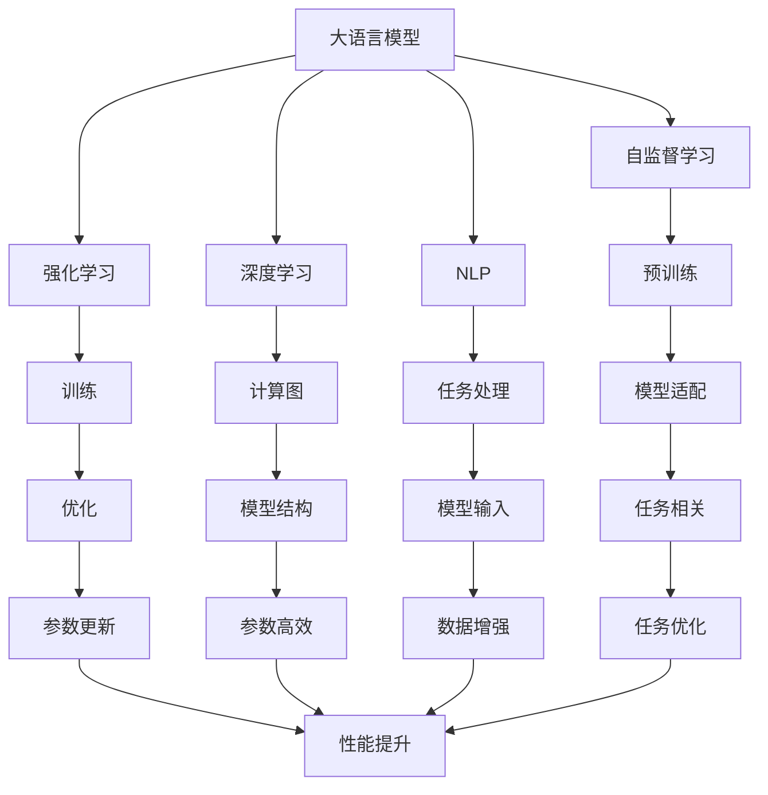
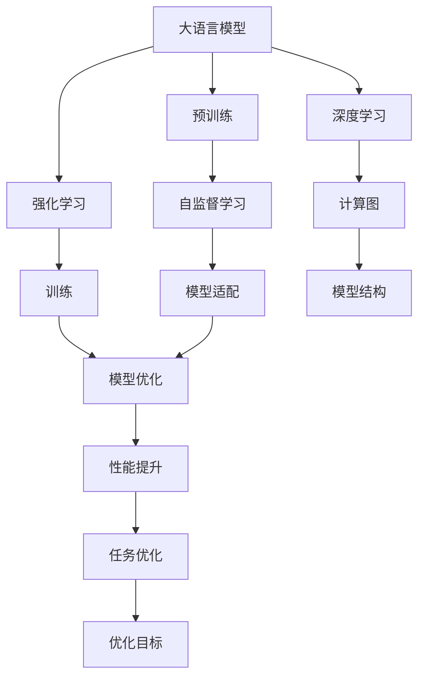
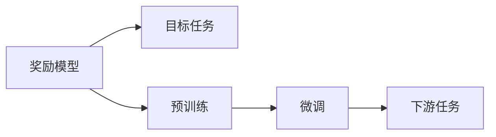
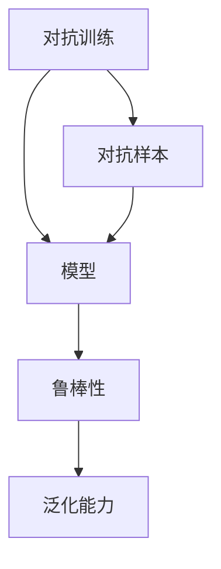
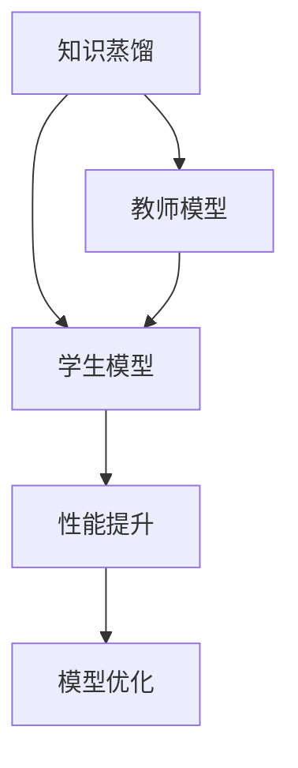
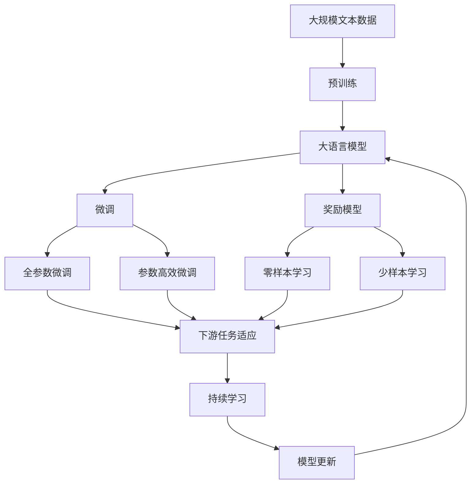

                 

# 大规模语言模型从理论到实践 奖励模型

> 关键词：大规模语言模型, 奖励模型, 自监督学习, 强化学习, 深度学习, 自然语言处理(NLP), Transformer, BERT

## 1. 背景介绍

### 1.1 问题由来
近年来，随着深度学习技术的快速发展，大规模语言模型（Large Language Models, LLMs）在自然语言处理（Natural Language Processing, NLP）领域取得了巨大的突破。这些模型通过在海量无标签文本数据上进行预训练，学习到了丰富的语言知识和常识，具备了强大的语言理解和生成能力。

然而，由于预训练语料的广泛性和泛化能力的不足，这些通用的大语言模型在特定领域应用时，效果往往难以达到实际应用的要求。因此，如何针对特定任务进行大模型微调，提升模型性能，成为了当前大语言模型研究和应用的一个热点问题。本文聚焦于奖励模型(Reward Models)，这种模型通过奖励机制（Rewards）引导模型学习目标任务，提升模型性能。

### 1.2 问题核心关键点
奖励模型通过在模型训练过程中引入奖励函数，通过最大化或最小化这些奖励函数来指导模型学习目标任务。这种机制与传统监督学习不同，它允许模型直接与任务目标进行交互，从而更好地学习任务的特定知识。

奖励模型的核心思想是：将目标任务建模为奖励函数，通过优化这些奖励函数来训练模型，使其在目标任务上表现更好。奖励模型可以应用于各种NLP任务，如机器翻译、文本摘要、对话生成等，具有广泛的适用性。

### 1.3 问题研究意义
研究奖励模型，对于拓展大模型的应用范围，提升下游任务的性能，加速NLP技术的产业化进程，具有重要意义：

1. 降低应用开发成本。基于奖励模型的技术，可以从头开始训练适用于特定任务的模型，减少从头开发所需的数据、计算和人力等成本投入。
2. 提升模型效果。奖励模型通过与任务目标直接交互，能够更精准地学习特定任务的知识，从而在应用场景中取得更优表现。
3. 加速开发进度。standing on the shoulders of giants，奖励模型可以利用预训练模型的强大语言理解能力，快速适配新任务，缩短开发周期。
4. 带来技术创新。奖励模型催生了更多的研究方向，如对抗训练、知识蒸馏等，为NLP技术带来了新的创新点。
5. 赋能产业升级。奖励模型使得NLP技术更容易被各行各业所采用，为传统行业数字化转型升级提供新的技术路径。

## 2. 核心概念与联系

### 2.1 核心概念概述

为更好地理解奖励模型在大语言模型中的应用，本节将介绍几个密切相关的核心概念：

- 大语言模型(Large Language Model, LLM)：以自回归(如GPT)或自编码(如BERT)模型为代表的大规模预训练语言模型。通过在大规模无标签文本语料上进行预训练，学习通用的语言表示，具备强大的语言理解和生成能力。

- 自监督学习(Self-Supervised Learning)：指在大规模无标签数据上，通过自构造任务训练模型的方法。自监督学习能够发现数据内部的隐含规律，提高模型泛化能力。

- 强化学习(Reinforcement Learning)：指通过与环境交互，通过奖励机制来指导模型优化决策的过程。强化学习适用于复杂的非线性、非平稳环境。

- 深度学习(Deep Learning)：一种通过多层神经网络进行数据建模的方法。深度学习在处理大规模、高维度数据方面具有优势。

- 自然语言处理(Natural Language Processing, NLP)：指使用计算机处理、理解、生成自然语言的方法和技术。

- 奖励函数(Reward Function)：定义在模型输出或行为上的函数，用于衡量模型的性能和优化目标。

- 对抗训练(Adversarial Training)：通过引入对抗样本，增强模型的鲁棒性和泛化能力。

- 知识蒸馏(Knowledge Distillation)：通过将教师模型（高能力模型）的知识传递给学生模型（低能力模型），提升学生模型的性能。

这些核心概念之间的逻辑关系可以通过以下Mermaid流程图来展示：



这个流程图展示了大语言模型的核心概念及其之间的关系：

1. 大语言模型通过自监督学习、深度学习等方法进行预训练。
2. 强化学习通过引入奖励函数，指导模型学习目标任务。
3. 对抗训练、知识蒸馏等方法，进一步提升模型性能。
4. 奖励模型通过与任务目标直接交互，优化模型行为。

这些概念共同构成了大语言模型的学习和应用框架，使其能够在各种场景下发挥强大的语言理解和生成能力。通过理解这些核心概念，我们可以更好地把握大语言模型的工作原理和优化方向。

### 2.2 概念间的关系

这些核心概念之间存在着紧密的联系，形成了大语言模型的完整生态系统。下面我通过几个Mermaid流程图来展示这些概念之间的关系。

#### 2.2.1 大语言模型的学习范式



这个流程图展示了大语言模型的三种主要学习范式：预训练、强化学习、深度学习。预训练主要采用自监督学习方法，而强化学习通过奖励函数指导模型学习目标任务。深度学习则是通过多层神经网络进行数据建模。

#### 2.2.2 奖励模型与微调的关系



这个流程图展示了奖励模型与微调的关系。奖励模型通过预训练学习通用知识，然后通过微调学习特定任务。微调过程可以通过奖励函数指导模型优化任务性能。

#### 2.2.3 对抗训练方法



这个流程图展示了对抗训练的基本原理。对抗训练通过引入对抗样本，增强模型的鲁棒性和泛化能力。

#### 2.2.4 知识蒸馏方法



这个流程图展示了知识蒸馏的基本原理。知识蒸馏通过将教师模型的知识传递给学生模型，提升学生模型的性能。

### 2.3 核心概念的整体架构

最后，我们用一个综合的流程图来展示这些核心概念在大语言模型微调过程中的整体架构：



这个综合流程图展示了从预训练到微调，再到持续学习的完整过程。大语言模型首先在大规模文本数据上进行预训练，然后通过微调（包括全参数微调和参数高效微调）或奖励模型来实现任务特定优化。最终，通过持续学习技术，模型可以不断更新和适应新的任务和数据。 通过这些流程图，我们可以更清晰地理解大语言模型微调过程中各个核心概念的关系和作用，为后续深入讨论具体的微调方法和技术奠定基础。

## 3. 核心算法原理 & 具体操作步骤
### 3.1 算法原理概述

奖励模型通过在模型训练过程中引入奖励函数，通过最大化或最小化这些奖励函数来指导模型学习目标任务。奖励模型的核心思想是：将目标任务建模为奖励函数，通过优化这些奖励函数来训练模型，使其在目标任务上表现更好。

形式化地，假设目标任务为 $T$，定义模型 $M_{\theta}$ 在样本 $x$ 上的奖励函数为 $R(x, M_{\theta})$，则模型在训练集 $D=\{(x_i, r_i)\}_{i=1}^N$ 上的经验风险为：

$$
\mathcal{L}(\theta) = -\frac{1}{N}\sum_{i=1}^N R(x_i, M_{\theta})
$$

其中 $r_i$ 为样本 $x_i$ 的奖励值，即任务目标的标注。优化目标是最小化经验风险，即找到最优参数：

$$
\theta^* = \mathop{\arg\min}_{\theta} \mathcal{L}(\theta)
$$

通过梯度下降等优化算法，奖励模型不断更新模型参数 $\theta$，最小化奖励函数，使得模型输出逼近最优的奖励值。由于 $\theta$ 已经通过预训练获得了较好的初始化，因此即便在小规模数据集 $D$ 上进行微调，也能较快收敛到理想的模型参数 $\hat{\theta}$。

### 3.2 算法步骤详解

奖励模型的训练过程包括以下关键步骤：

**Step 1: 准备预训练模型和数据集**
- 选择合适的预训练语言模型 $M_{\theta}$ 作为初始化参数，如 BERT、GPT 等。
- 准备目标任务的标注数据集 $D$，划分为训练集、验证集和测试集。一般要求标注数据与预训练数据的分布不要差异过大。

**Step 2: 设计奖励函数**
- 根据目标任务类型，设计合适的奖励函数。例如，对于分类任务，可以定义交叉熵损失作为奖励函数。
- 对于生成任务，可以通过语言模型的解码器输出概率分布，并以负对数似然为奖励函数。

**Step 3: 设置训练超参数**
- 选择合适的优化算法及其参数，如 AdamW、SGD 等，设置学习率、批大小、迭代轮数等。
- 设置正则化技术及强度，包括权重衰减、Dropout、Early Stopping 等。
- 确定冻结预训练参数的策略，如仅微调顶层，或全部参数都参与微调。

**Step 4: 执行梯度训练**
- 将训练集数据分批次输入模型，前向传播计算奖励函数。
- 反向传播计算参数梯度，根据设定的优化算法和学习率更新模型参数。
- 周期性在验证集上评估模型性能，根据性能指标决定是否触发 Early Stopping。
- 重复上述步骤直到满足预设的迭代轮数或 Early Stopping 条件。

**Step 5: 测试和部署**
- 在测试集上评估奖励模型 $M_{\hat{\theta}}$ 的性能，对比微调前后的奖励值变化。
- 使用奖励模型对新样本进行推理预测，集成到实际的应用系统中。
- 持续收集新的数据，定期重新微调模型，以适应数据分布的变化。

以上是奖励模型的一般流程。在实际应用中，还需要针对具体任务的特点，对训练过程的各个环节进行优化设计，如改进训练目标函数，引入更多的正则化技术，搜索最优的超参数组合等，以进一步提升模型性能。

### 3.3 算法优缺点

奖励模型具有以下优点：
1. 简单高效。奖励模型不需要大规模标注数据，即可对预训练模型进行快速适配，获得较大的性能提升。
2. 通用适用。奖励模型适用于各种NLP下游任务，设计简单的奖励函数即可实现微调。
3. 参数高效。利用参数高效微调技术，在固定大部分预训练参数的情况下，仍可取得不错的提升。
4. 效果显著。在学术界和工业界的诸多任务上，基于奖励模型的微调方法已经刷新了最先进的性能指标。

同时，该方法也存在一定的局限性：
1. 依赖目标任务。奖励模型的效果很大程度上取决于目标任务的奖励函数设计，设计不当可能导致模型性能不佳。
2. 过度拟合风险。奖励模型在训练过程中，如果奖励函数设计不当，容易导致模型过度拟合训练集，泛化能力下降。
3. 可解释性不足。奖励模型通常缺乏可解释性，难以对其推理逻辑进行分析和调试。
4. 模型泛化性受限。由于奖励函数的设计依赖于特定任务，模型对新任务的泛化能力可能受到限制。

尽管存在这些局限性，但就目前而言，基于奖励模型的微调方法仍是大语言模型应用的最主流范式。未来相关研究的重点在于如何进一步降低奖励模型对目标任务的依赖，提高模型的少样本学习和跨领域迁移能力，同时兼顾可解释性和伦理安全性等因素。

### 3.4 算法应用领域

基于奖励模型的微调方法在NLP领域已经得到了广泛的应用，覆盖了几乎所有常见任务，例如：

- 文本分类：如情感分析、主题分类、意图识别等。通过奖励模型学习文本-标签映射。
- 命名实体识别：识别文本中的人名、地名、机构名等特定实体。通过奖励模型掌握实体边界和类型。
- 关系抽取：从文本中抽取实体之间的语义关系。通过奖励模型学习实体-关系三元组。
- 问答系统：对自然语言问题给出答案。将问题-答案对作为训练样本，训练奖励模型学习匹配答案。
- 机器翻译：将源语言文本翻译成目标语言。通过奖励模型学习语言-语言映射。
- 文本摘要：将长文本压缩成简短摘要。将文章-摘要对作为训练样本，训练奖励模型学习抓取要点。
- 对话系统：使机器能够与人自然对话。将多轮对话历史作为上下文，训练奖励模型进行回复生成。

除了上述这些经典任务外，奖励模型还被创新性地应用到更多场景中，如可控文本生成、常识推理、代码生成、数据增强等，为NLP技术带来了全新的突破。随着奖励模型和微调方法的不断进步，相信NLP技术将在更广阔的应用领域大放异彩。

## 4. 数学模型和公式 & 详细讲解  
### 4.1 数学模型构建

本节将使用数学语言对基于奖励模型的大语言模型微调过程进行更加严格的刻画。

记奖励模型为 $M_{\theta}:\mathcal{X} \rightarrow \mathcal{Y}$，其中 $\mathcal{X}$ 为输入空间，$\mathcal{Y}$ 为输出空间，$\theta \in \mathbb{R}^d$ 为模型参数。假设目标任务 $T$ 的训练集为 $D=\{(x_i, r_i)\}_{i=1}^N, x_i \in \mathcal{X}, r_i \in \{0,1\}$，其中 $r_i=1$ 表示样本 $x_i$ 的奖励值为1，表示正确分类；$r_i=0$ 表示样本 $x_i$ 的奖励值为0，表示分类错误。

定义模型 $M_{\theta}$ 在样本 $(x,r)$ 上的损失函数为 $L(x,r;M_{\theta}) = -r \log M_{\theta}(x)$，在数据集 $D$ 上的经验风险为：

$$
\mathcal{L}(\theta) = \frac{1}{N}\sum_{i=1}^N L(x_i,r_i;M_{\theta})
$$

奖励模型的优化目标是最小化经验风险，即找到最优参数：

$$
\theta^* = \mathop{\arg\min}_{\theta} \mathcal{L}(\theta)
$$

在实践中，我们通常使用基于梯度的优化算法（如SGD、Adam等）来近似求解上述最优化问题。设 $\eta$ 为学习率，$\lambda$ 为正则化系数，则参数的更新公式为：

$$
\theta \leftarrow \theta - \eta \nabla_{\theta}\mathcal{L}(\theta) - \eta\lambda\theta
$$

其中 $\nabla_{\theta}\mathcal{L}(\theta)$ 为损失函数对参数 $\theta$ 的梯度，可通过反向传播算法高效计算。

### 4.2 公式推导过程

以下我们以二分类任务为例，推导交叉熵损失函数及其梯度的计算公式。

假设模型 $M_{\theta}$ 在输入 $x$ 上的输出为 $\hat{y}=M_{\theta}(x) \in [0,1]$，表示样本属于正类的概率。真实标签 $r \in \{0,1\}$。则二分类交叉熵损失函数定义为：

$$
L(x,r;M_{\theta}) = -r \log \hat{y}
$$

将其代入经验风险公式，得：

$$
\mathcal{L}(\theta) = -\frac{1}{N}\sum_{i=1}^N r_i \log M_{\theta}(x_i)
$$

根据链式法则，损失函数对参数 $\theta_k$ 的梯度为：

$$
\frac{\partial \mathcal{L}(\theta)}{\partial \theta_k} = -\frac{1}{N}\sum_{i=1}^N (\frac{r_i}{M_{\theta}(x_i)}-\frac{(1-r_i)}{1-M_{\theta}(x_i)}) \frac{\partial M_{\theta}(x_i)}{\partial \theta_k}
$$

其中 $\frac{\partial M_{\theta}(x_i)}{\partial \theta_k}$ 可进一步递归展开，利用自动微分技术完成计算。

在得到损失函数的梯度后，即可带入参数更新公式，完成模型的迭代优化。重复上述过程直至收敛，最终得到适应目标任务的最优模型参数 $\theta^*$。

## 5. 项目实践：代码实例和详细解释说明
### 5.1 开发环境搭建

在进行微调实践前，我们需要准备好开发环境。以下是使用Python进行PyTorch开发的环境配置流程：

1. 安装Anaconda：从官网下载并安装Anaconda，用于创建独立的Python环境。

2. 创建并激活虚拟环境：
```bash
conda create -n pytorch-env python=3.8 
conda activate pytorch-env
```

3. 安装PyTorch：根据CUDA版本，从官网获取对应的安装命令。例如：
```bash
conda install pytorch torchvision torchaudio cudatoolkit=11.1 -c pytorch -c conda-forge
```

4. 安装Transformers库：
```bash
pip install transformers
```

5. 安装各类工具包：
```bash
pip install numpy pandas scikit-learn matplotlib tqdm jupyter notebook ipython
```

完成上述步骤后，即可在`pytorch-env`环境中开始微调实践。

### 5.2 源代码详细实现

下面我以二分类任务为例，给出使用Transformers库对BERT模型进行奖励模型微调的PyTorch代码实现。

首先，定义任务的数据处理函数：

```python
from transformers import BertTokenizer
from torch.utils.data import Dataset
import torch

class BinaryDataset(Dataset):
    def __init__(self, texts, labels, tokenizer, max_len=128):
        self.texts = texts
        self.labels = labels
        self.tokenizer = tokenizer
        self.max_len = max_len
        
    def __len__(self):
        return len(self.texts)
    
    def __getitem__(self, item):
        text = self.texts[item]
        label = self.labels[item]
        
        encoding = self.tokenizer(text, return_tensors='pt', max_length=self.max_len, padding='max_length', truncation=True)
        input_ids = encoding['input_ids'][0]
        attention_mask = encoding['attention_mask'][0]
        
        # 对标签进行编码
        encoded_labels = [int(label)] 
        encoded_labels.extend([0] * (self.max_len - len(encoded_labels)))
        labels = torch.tensor(encoded_labels, dtype=torch.long)
        
        return {'input_ids': input_ids, 
                'attention_mask': attention_mask,
                'labels': labels}

# 标签与id的映射
id2label = {'0': 0, '1': 1}

# 创建dataset
tokenizer = BertTokenizer.from_pretrained('bert-base-cased')

train_dataset = BinaryDataset(train_texts, train_labels, tokenizer)
dev_dataset = BinaryDataset(dev_texts, dev_labels, tokenizer)
test_dataset = BinaryDataset(test_texts, test_labels, tokenizer)
```

然后，定义模型和优化器：

```python
from transformers import BertForTokenClassification, AdamW

model = BertForTokenClassification.from_pretrained('bert-base-cased', num_labels=2)

optimizer = AdamW(model.parameters(), lr=2e-5)
```

接着，定义训练和评估函数：

```python
from torch.utils.data import DataLoader
from tqdm import tqdm
from sklearn.metrics import classification_report

device = torch.device('cuda') if torch.cuda.is_available() else torch.device('cpu')
model.to(device)

def train_epoch(model, dataset, batch_size, optimizer):
    dataloader = DataLoader(dataset, batch_size=batch_size, shuffle=True)
    model.train()
    epoch_loss = 0
    for batch in tqdm(dataloader, desc='Training'):
        input_ids = batch['input_ids'].to(device)
        attention_mask = batch['attention_mask'].to(device)
        labels = batch['labels'].to(device)
        model.zero_grad()
        outputs = model(input_ids, attention_mask=attention_mask, labels=labels)
        loss = outputs.loss
        epoch_loss += loss.item()
        loss.backward()
        optimizer.step()
    return epoch_loss / len(dataloader)

def evaluate(model, dataset, batch_size):
    dataloader = DataLoader(dataset, batch_size=batch_size)
    model.eval()
    preds, labels = [], []
    with torch.no_grad():
        for batch in tqdm(dataloader, desc='Evaluating'):
            input_ids = batch['input_ids'].to(device)
            attention_mask = batch['attention_mask'].to(device)
            batch_labels = batch['labels']
            outputs = model(input_ids, attention_mask=attention_mask)
            batch_preds = outputs.logits.argmax(dim=2).to('cpu').tolist()
            batch_labels = batch_labels.to('cpu').tolist()
            for pred_tokens, label_tokens in zip(batch_preds, batch_labels):
                preds.append(pred_tokens[:len(label_tokens)])
                labels.append(label_tokens)
                
    print(classification_report(labels, preds))
```

最后，启动训练流程并在测试集上评估：

```python
epochs = 5
batch_size = 16

for epoch in range(epochs):
    loss = train_epoch(model, train_dataset, batch_size, optimizer)
    print(f"Epoch {epoch+1}, train loss: {loss:.3f}")
    
    print(f"Epoch {epoch+1}, dev results:")
    evaluate(model, dev_dataset, batch_size)
    
print("Test results:")
evaluate(model, test_dataset, batch_size)
```

以上就是使用PyTorch对BERT进行二分类任务奖励模型微调的完整代码实现。可以看到，得益于Transformers库的强大封装，我们可以用相对简洁的代码完成BERT模型的加载和微调。

### 5.3 代码解读与分析

让我们再详细解读一下关键代码的实现细节：

**BinaryDataset类**：
- `__init__`方法：初始化文本、标签、分词器等关键组件。
- `__len__`方法：返回数据集的样本数量。
- `__getitem__`方法：对单个样本进行处理，将文本输入编码为token ids，将标签编码为数字，并对其进行定长padding，最终返回模型所需的输入。

**id2label和label2id字典**：
- 定义了标签与数字id之间的映射关系，用于将token-wise的预测结果解码回真实的标签。

**训练和评估函数**：
- 使用PyTorch的DataLoader对数据集进行批次化加载，供模型训练和推理使用。
- 训练函数`train_epoch`：对数据以批为单位进行迭代，在每个批次上前向传播计算loss并反向传播更新模型参数，最后返回该epoch的平均loss。
- 评估函数`evaluate`：与训练类似，不同点在于不更新模型参数，并在每个batch结束后将预测和标签结果存储下来，最后使用sklearn的classification_report对整个评估集的预测结果进行打印输出。

**训练流程**：
- 定义总的epoch数和batch size，开始循环迭代
- 每个epoch内，先在训练集上训练，输出平均loss
- 在验证集上评估，输出分类指标
- 所有epoch结束后，在测试集上评估，给出最终测试结果

可以看到，PyTorch配合Transformers库使得BERT奖励模型的微调代码实现变得简洁高效。开发者可以将更多精力放在数据处理、模型改进等高层逻辑上，而不必过多关注底层的实现细节

