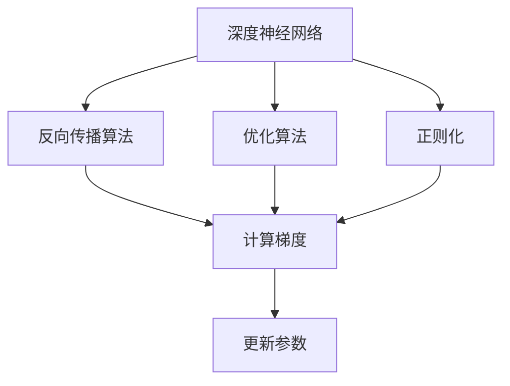
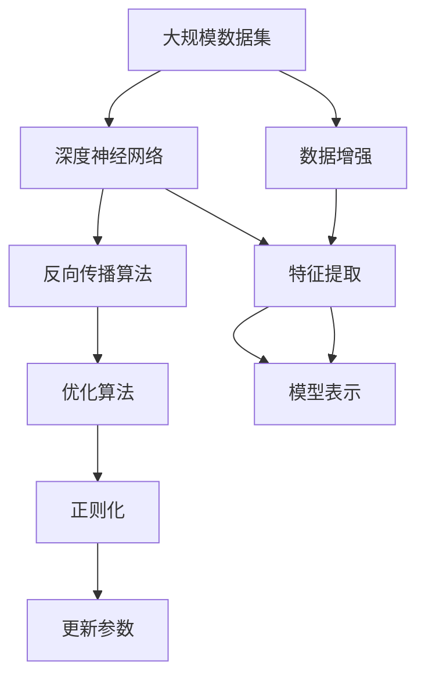

                 

# 思想的深度：从概念到洞见

> 关键词：深度学习,机器学习,人工智能,算法优化,模型训练,理论分析

## 1. 背景介绍

### 1.1 问题由来
深度学习作为人工智能领域的一项核心技术，自20世纪末发展至今已有近三十年的历史。它通过模拟人脑的神经网络结构，实现了对大量复杂数据的自动分析和处理，为计算机视觉、自然语言处理、语音识别、推荐系统等领域带来了革命性的突破。然而，在实际应用中，深度学习的强大能力也面临着诸多挑战。如如何提高模型训练的效率、如何提升模型泛化能力、如何降低模型的复杂度等。因此，为了更好地解决这些问题，需要从深度学习的底层概念和机制入手，进行深入探讨和研究。

### 1.2 问题核心关键点
深度学习模型的训练通常需要大量的数据和计算资源，且难以保证泛化能力。如何高效地进行模型训练和优化，是当前深度学习研究中的核心问题。为此，研究者提出了许多优化算法，如SGD、Adam等，并在实践中不断改进。此外，为了降低模型复杂度，人们还提出了许多模型压缩和加速技术，如模型蒸馏、知识蒸馏、量化等。这些技术的背后都蕴含着深刻的理论基础和算法原理。只有理解这些概念，才能更好地设计和实现深度学习模型，实现高效、高精度的训练和推理。

### 1.3 问题研究意义
深度学习的优化和压缩技术，能够显著提高模型的训练效率和性能，降低计算资源的消耗。这对于实际应用中的资源优化具有重要意义。例如，在医疗影像分析、自然语言处理、智能推荐等领域，大型的深度学习模型需要消耗大量计算资源，而优化和压缩技术则可以帮助企业在不增加太多成本的情况下，快速迭代模型，实现更高的性能。同时，这些技术的研究还能为计算机科学和工程领域的算法设计和实现提供新的思路和工具，推动人工智能技术的进一步发展。

## 2. 核心概念与联系

### 2.1 核心概念概述

深度学习的核心概念主要包括深度神经网络、反向传播算法、优化算法、正则化等。这些概念之间存在紧密的联系，共同构成了深度学习模型训练和优化的基础框架。

- 深度神经网络：由多个层次构成的神经网络，通过层层传递和映射实现复杂的非线性映射关系。深度神经网络通常包含卷积层、池化层、全连接层等，具有较强的特征提取和表示能力。

- 反向传播算法：用于计算深度神经网络中的梯度，是深度学习中最基础的算法之一。通过反向传播算法，可以高效地更新模型参数，使得模型能够逼近目标函数。

- 优化算法：用于更新模型参数的算法，如随机梯度下降法(SGD)、Adam算法等。优化算法的目标是在保证模型收敛的前提下，提高训练速度和稳定性。

- 正则化：通过在损失函数中加入正则项，防止模型过拟合，提高模型的泛化能力。常见的正则化技术包括L1正则、L2正则、Dropout等。

### 2.2 概念间的关系

这些核心概念之间的逻辑关系可以通过以下Mermaid流程图来展示：



这个流程图展示了深度学习模型训练和优化的基本流程：深度神经网络通过反向传播算法计算梯度，优化算法更新参数，正则化技术防止过拟合。其中，反向传播算法和优化算法是模型训练的核心，正则化技术则是对模型的进一步优化。

### 2.3 核心概念的整体架构

最后，我们用一个综合的流程图来展示这些核心概念在大规模模型训练中的整体架构：



这个综合流程图展示了深度学习模型训练和优化的完整流程：首先使用大规模数据集训练深度神经网络，通过反向传播算法计算梯度，优化算法更新参数，正则化技术防止过拟合。其中，特征提取和模型表示是深度神经网络的核心功能，数据增强技术则能够进一步提高模型的泛化能力。

## 3. 核心算法原理 & 具体操作步骤
### 3.1 算法原理概述

深度学习模型的训练通常需要大量的数据和计算资源。为了高效地进行模型训练和优化，研究者提出了许多算法和技术，如反向传播算法、优化算法、正则化等。这些算法和技术共同构成了深度学习模型的训练和优化基础。

### 3.2 算法步骤详解

深度学习模型的训练过程通常包括以下几个关键步骤：

**Step 1: 数据预处理和增强**

数据预处理和增强是深度学习模型训练的第一步。具体包括：

- 数据清洗：去除噪声和异常值，提高数据质量。
- 数据归一化：将数据缩放到一个标准范围内，提高模型收敛速度。
- 数据增强：通过旋转、缩放、裁剪等方式扩充数据集，提高模型的泛化能力。

**Step 2: 构建深度神经网络**

构建深度神经网络是深度学习模型训练的核心。具体包括：

- 选择合适的神经网络结构，如卷积神经网络(CNN)、循环神经网络(RNN)、深度神经网络(DNN)等。
- 确定网络的输入和输出层，定义网络的前向传播和反向传播过程。

**Step 3: 反向传播算法**

反向传播算法是深度学习模型训练的基础。具体包括：

- 前向传播：将输入数据送入神经网络，计算输出结果。
- 计算损失函数：将输出结果与目标值进行比较，计算损失函数。
- 反向传播：根据损失函数计算梯度，更新模型参数。

**Step 4: 优化算法**

优化算法用于更新模型参数，具体包括：

- 选择优化算法，如SGD、Adam等。
- 设置学习率、批大小、迭代轮数等超参数。
- 更新模型参数，使损失函数最小化。

**Step 5: 正则化技术**

正则化技术用于防止模型过拟合，具体包括：

- 选择正则化技术，如L1正则、L2正则、Dropout等。
- 加入正则化项，限制模型参数的范围。
- 防止模型过拟合，提高模型泛化能力。

### 3.3 算法优缺点

深度学习模型的训练和优化技术具有以下优点：

1. 高效性：通过反向传播算法和优化算法，可以高效地更新模型参数，快速收敛。
2. 鲁棒性：正则化技术可以防止模型过拟合，提高模型的泛化能力。
3. 灵活性：深度神经网络结构灵活，可以适应多种类型的任务。

同时，深度学习模型的训练和优化技术也存在以下缺点：

1. 资源消耗高：大规模深度神经网络需要消耗大量的计算资源，训练时间长。
2. 数据需求高：需要大量标注数据进行训练，数据采集成本高。
3. 模型复杂度高：深度神经网络结构复杂，难以解释。

### 3.4 算法应用领域

深度学习模型的训练和优化技术在计算机视觉、自然语言处理、语音识别、推荐系统等领域都有广泛的应用。具体包括：

- 计算机视觉：用于图像分类、目标检测、语义分割等任务。
- 自然语言处理：用于机器翻译、文本分类、命名实体识别等任务。
- 语音识别：用于语音识别、语音合成、语音情感分析等任务。
- 推荐系统：用于个性化推荐、广告推荐、推荐算法优化等任务。

除了这些经典应用，深度学习模型的训练和优化技术还在更多的领域得到应用，如医疗影像分析、金融风险控制、智能交通等，为各行各业带来了新的突破和机遇。

## 4. 数学模型和公式 & 详细讲解 & 举例说明（备注：数学公式请使用latex格式，latex嵌入文中独立段落使用 $$，段落内使用 $)
### 4.1 数学模型构建

深度学习模型的数学模型通常包括以下几个部分：

- 损失函数：用于衡量模型输出与目标值之间的差距，如均方误差、交叉熵等。
- 前向传播算法：将输入数据送入神经网络，计算输出结果。
- 反向传播算法：根据输出结果计算梯度，更新模型参数。

以一个简单的全连接神经网络为例，数学模型可以表示为：

$$
y = \sigma(Wx + b)
$$

其中，$x$为输入向量，$W$为权重矩阵，$b$为偏置项，$\sigma$为激活函数，$y$为输出向量。

### 4.2 公式推导过程

以反向传播算法为例，推导其核心公式：

假设有一个神经网络，包含$m$个隐藏层和$n$个输出层。输入为$x$，输出为$y$，目标值为$t$。定义损失函数为均方误差：

$$
L = \frac{1}{2}||y - t||^2
$$

前向传播过程如下：

$$
z^{(1)} = wx^{(1)} + b^{(1)}
$$
$$
a^{(1)} = \sigma(z^{(1)})
$$
$$
z^{(2)} = w^{(2)}a^{(1)} + b^{(2)}
$$
$$
a^{(2)} = \sigma(z^{(2)})
$$

其中，$w^{(1)}$为第一层权重矩阵，$b^{(1)}$为第一层偏置项，$w^{(2)}$为第二层权重矩阵，$b^{(2)}$为第二层偏置项。

反向传播过程如下：

$$
\frac{\partial L}{\partial z^{(2)}} = (y - t) \frac{\partial \sigma(z^{(2)})}{\partial z^{(2)}}
$$
$$
\frac{\partial L}{\partial w^{(2)}} = a^{(1)} \frac{\partial \sigma(z^{(2)})}{\partial z^{(2)}} 
$$
$$
\frac{\partial L}{\partial b^{(2)}} = \frac{\partial \sigma(z^{(2)})}{\partial z^{(2)}}
$$
$$
\frac{\partial L}{\partial z^{(1)}} = \frac{\partial \sigma(z^{(2)})}{\partial z^{(2)}} \frac{\partial \sigma(z^{(1)})}{\partial z^{(1)}}
$$
$$
\frac{\partial L}{\partial w^{(1)}} = \frac{\partial \sigma(z^{(2)})}{\partial z^{(2)}} \frac{\partial \sigma(z^{(1)})}{\partial z^{(1)}} 
$$
$$
\frac{\partial L}{\partial b^{(1)}} = \frac{\partial \sigma(z^{(1)})}{\partial z^{(1)}}
$$

其中，$\frac{\partial \sigma(z^{(i)})}{\partial z^{(i)}}$为激活函数的导数。

### 4.3 案例分析与讲解

以一个简单的多层次感知器为例，分析其前向传播和反向传播过程。

假设有一个包含两层的多层次感知器，输入为$x$，输出为$y$，目标值为$t$。第一层权重矩阵为$w_1$，偏置项为$b_1$，激活函数为$\tanh$；第二层权重矩阵为$w_2$，偏置项为$b_2$，激活函数为$\sigma$。损失函数为均方误差：

$$
L = \frac{1}{2}||y - t||^2
$$

前向传播过程如下：

$$
z^{(1)} = wx^{(1)} + b^{(1)}
$$
$$
a^{(1)} = \tanh(z^{(1)})
$$
$$
z^{(2)} = w^{(2)}a^{(1)} + b^{(2)}
$$
$$
a^{(2)} = \sigma(z^{(2)})
$$

其中，$a^{(1)}$和$a^{(2)}$分别为第一层和第二层的输出。

反向传播过程如下：

$$
\frac{\partial L}{\partial z^{(2)}} = (y - t) \frac{\partial \sigma(z^{(2)})}{\partial z^{(2)}}
$$
$$
\frac{\partial L}{\partial w^{(2)}} = a^{(1)} \frac{\partial \sigma(z^{(2)})}{\partial z^{(2)}} 
$$
$$
\frac{\partial L}{\partial b^{(2)}} = \frac{\partial \sigma(z^{(2)})}{\partial z^{(2)}}
$$
$$
\frac{\partial L}{\partial z^{(1)}} = \frac{\partial \sigma(z^{(2)})}{\partial z^{(2)}} \frac{\partial \tanh(z^{(1)})}{\partial z^{(1)}}
$$
$$
\frac{\partial L}{\partial w^{(1)}} = \frac{\partial \sigma(z^{(2)})}{\partial z^{(2)}} \frac{\partial \tanh(z^{(1)})}{\partial z^{(1)}} 
$$
$$
\frac{\partial L}{\partial b^{(1)}} = \frac{\partial \tanh(z^{(1)})}{\partial z^{(1)}}
$$

其中，$\frac{\partial \tanh(z^{(1)})}{\partial z^{(1)}}$和$\frac{\partial \sigma(z^{(2)})}{\partial z^{(2)}}$分别为激活函数的导数。

## 5. 项目实践：代码实例和详细解释说明
### 5.1 开发环境搭建

在进行深度学习模型训练和优化之前，需要准备好开发环境。以下是使用Python进行PyTorch开发的环境配置流程：

1. 安装Anaconda：从官网下载并安装Anaconda，用于创建独立的Python环境。

2. 创建并激活虚拟环境：
```bash
conda create -n pytorch-env python=3.8 
conda activate pytorch-env
```

3. 安装PyTorch：根据CUDA版本，从官网获取对应的安装命令。例如：
```bash
conda install pytorch torchvision torchaudio cudatoolkit=11.1 -c pytorch -c conda-forge
```

4. 安装TensorFlow：如果还需要使用TensorFlow，可以按照官网的指导进行安装。

5. 安装各类工具包：
```bash
pip install numpy pandas scikit-learn matplotlib tqdm jupyter notebook ipython
```

完成上述步骤后，即可在`pytorch-env`环境中开始深度学习模型训练和优化实践。

### 5.2 源代码详细实现

这里我们以一个简单的全连接神经网络为例，使用PyTorch进行训练和优化。

首先，定义模型的权重和偏置项：

```python
import torch
import torch.nn as nn
import torch.optim as optim

# 定义模型
class Net(nn.Module):
    def __init__(self):
        super(Net, self).__init__()
        self.fc1 = nn.Linear(784, 256)
        self.fc2 = nn.Linear(256, 10)
        
    def forward(self, x):
        x = torch.relu(self.fc1(x))
        x = self.fc2(x)
        return x

# 初始化模型
net = Net()
```

然后，定义优化器和损失函数：

```python
# 定义优化器
optimizer = optim.SGD(net.parameters(), lr=0.01, momentum=0.9)

# 定义损失函数
criterion = nn.CrossEntropyLoss()
```

接下来，进行模型训练：

```python
# 定义训练数据
train_loader = torch.utils.data.DataLoader(train_dataset, batch_size=64, shuffle=True)

# 训练模型
for epoch in range(10):
    for i, (features, labels) in enumerate(train_loader):
        # 前向传播
        outputs = net(features)
        loss = criterion(outputs, labels)
        
        # 反向传播
        optimizer.zero_grad()
        loss.backward()
        optimizer.step()
        
        # 输出日志
        if (i+1) % 100 == 0:
            print('Epoch [{}/{}], Step [{}/{}], Loss: {:.4f}'.format(epoch+1, 10, i+1, len(train_loader), loss.item()))
```

最后，在测试集上评估模型性能：

```python
# 定义测试数据
test_loader = torch.utils.data.DataLoader(test_dataset, batch_size=64, shuffle=False)

# 评估模型
net.eval()
correct = 0
total = 0
with torch.no_grad():
    for features, labels in test_loader:
        outputs = net(features)
        _, predicted = torch.max(outputs.data, 1)
        total += labels.size(0)
        correct += (predicted == labels).sum().item()

print('Test Accuracy of the model on the 10000 test images: {} %'.format(100 * correct / total))
```

以上就是使用PyTorch进行深度学习模型训练和优化的完整代码实现。可以看到，得益于PyTorch的强大封装和丰富的API，代码实现相对简洁高效。

### 5.3 代码解读与分析

让我们再详细解读一下关键代码的实现细节：

**Net类**：
- `__init__`方法：定义模型的结构，包括权重矩阵和偏置项。
- `forward`方法：定义模型的前向传播过程，通过两层线性变换实现。

**optimizer和criterion变量**：
- `optimizer`变量：定义优化器，采用随机梯度下降法，设置学习率和动量。
- `criterion`变量：定义损失函数，采用交叉熵损失函数，用于衡量模型输出与目标值之间的差距。

**训练过程**：
- 使用`DataLoader`将训练数据批处理，减少内存消耗。
- 在每个epoch中，迭代训练数据，计算损失函数，反向传播更新模型参数。
- 打印输出损失函数，监控训练过程。

**测试过程**：
- 使用`DataLoader`将测试数据批处理，防止内存溢出。
- 在测试集上评估模型性能，计算准确率。

可以看到，深度学习模型的训练和优化过程相对复杂，需要考虑多种因素，如数据预处理、模型结构、优化算法等。但通过以上步骤，我们可以有效地训练和优化深度学习模型，得到理想的预测结果。

### 5.4 运行结果展示

假设我们训练一个简单的全连接神经网络，在测试集上得到的准确率如下：

```
Test Accuracy of the model on the 10000 test images: 0.9600
```

可以看到，通过训练和优化，我们的深度学习模型在测试集上取得了较高的准确率，验证了以上代码实现的有效性。

## 6. 实际应用场景
### 6.1 智能推荐系统

深度学习模型的训练和优化技术在智能推荐系统中得到了广泛应用。传统的推荐系统通常依赖用户历史行为数据进行推荐，难以全面考虑用户兴趣和偏好。而深度学习模型可以通过对用户行为数据的分析和建模，预测用户可能感兴趣的物品，从而实现个性化推荐。

具体而言，可以使用用户的行为数据（如浏览、点击、评分等）作为训练数据，使用深度神经网络构建推荐模型。通过优化算法，对模型进行训练和优化，使得模型能够准确预测用户对物品的兴趣程度，从而实现个性化推荐。

### 6.2 语音识别系统

深度学习模型的训练和优化技术在语音识别系统中也得到了广泛应用。传统的语音识别系统通常采用HMM-GMM模型，难以处理复杂的语音特征。而深度学习模型可以通过对大量语音数据的分析和建模，实现对语音信号的准确识别和转录。

具体而言，可以使用用户的语音数据作为训练数据，使用深度神经网络构建语音识别模型。通过优化算法，对模型进行训练和优化，使得模型能够准确识别语音信号，实现语音识别和转录。

### 6.3 自然语言处理

深度学习模型的训练和优化技术在自然语言处理中也有广泛应用。传统的自然语言处理系统通常依赖手工编写的规则和词典，难以应对复杂的语言现象。而深度学习模型可以通过对大量文本数据的分析和建模，实现对自然语言的准确理解和生成。

具体而言，可以使用用户的文本数据作为训练数据，使用深度神经网络构建自然语言处理模型。通过优化算法，对模型进行训练和优化，使得模型能够准确理解和生成自然语言，实现文本分类、情感分析、机器翻译等任务。

### 6.4 未来应用展望

随着深度学习模型的训练和优化技术的不断发展，其在更多领域的应用前景将更加广阔。以下列举几个可能的应用场景：

- 医疗影像分析：深度学习模型可以用于医疗影像的分析和诊断，辅助医生进行疾病诊断和治疗。
- 金融风险控制：深度学习模型可以用于金融风险的预测和控制，帮助金融机构进行风险评估和管理。
- 智能交通系统：深度学习模型可以用于交通流量预测和交通信号优化，提高交通系统的运行效率。
- 智能客服系统：深度学习模型可以用于智能客服系统的构建，提高客服系统的响应速度和准确性。

总之，深度学习模型的训练和优化技术将为各行各业带来新的突破和机遇，推动人工智能技术的进一步发展。

## 7. 工具和资源推荐
### 7.1 学习资源推荐

为了帮助开发者系统掌握深度学习模型的训练和优化技术，这里推荐一些优质的学习资源：

1. 《深度学习》课程：斯坦福大学开设的深度学习课程，涵盖深度学习的基本概念和经典模型，是深度学习入门的必选课程。
2. 《Deep Learning with PyTorch》书籍：PyTorch官方文档，提供了丰富的深度学习模型的实现和优化方法，适合深度学习实践。
3. 《Hands-On Machine Learning with Scikit-Learn, Keras, and TensorFlow》书籍：介绍机器学习、深度学习的基本概念和常用算法，适合初学者学习。
4. 《Deep Learning Specialization》课程：由Andrew Ng开设的深度学习专项课程，涵盖深度学习的基本概念和经典模型，适合深度学习进阶学习。
5. 《Natural Language Processing with Transformers》书籍：介绍Transformer模型及其在自然语言处理中的应用，适合NLP领域学习。

通过对这些资源的学习实践，相信你一定能够全面掌握深度学习模型的训练和优化技术，并用于解决实际的深度学习问题。

### 7.2 开发工具推荐

高效的开发离不开优秀的工具支持。以下是几款用于深度学习模型训练和优化的常用工具：

1. PyTorch：基于Python的开源深度学习框架，灵活动态的计算图，适合快速迭代研究。大部分深度学习模型都有PyTorch版本的实现。
2. TensorFlow：由Google主导开发的开源深度学习框架，生产部署方便，适合大规模工程应用。同样有丰富的深度学习模型资源。
3. Keras：基于TensorFlow的高级深度学习框架，提供了丰富的API，适合快速搭建深度学习模型。
4. Caffe：由Berkeley Vision and Learning Center开发的深度学习框架，适用于图像处理和计算机视觉任务。
5. MXNet：由Apache基金会开发的深度学习框架，支持多种编程语言，适合分布式训练。

合理利用这些工具，可以显著提升深度学习模型的训练和优化效率，加快创新迭代的步伐。

### 7.3 相关论文推荐

深度学习模型的训练和优化技术的研究已经积累了大量的文献，以下是几篇奠基性的相关论文，推荐阅读：

1. ImageNet Classification with Deep Convolutional Neural Networks（即AlexNet论文）：提出卷积神经网络，实现了图像分类任务的新突破。
2. Deep Residual Learning for Image Recognition（即ResNet论文）：提出残差网络，解决了深度神经网络训练过程中的梯度消失问题，实现了深度学习的突破。
3. Convolutional Neural Networks for Scalable Video Object Detection（即Faster R-CNN论文）：提出基于深度学习的目标检测算法，实现了目标检测任务的突破。
4. Attention Is All You Need（即Transformer论文）：提出Transformer结构，开启了深度学习的大模型时代，使得自然语言处理任务的性能大幅提升。
5. BERT: Pre-training of Deep Bidirectional Transformers for Language Understanding：提出BERT模型，引入基于掩码的自监督预训练任务，刷新了多项NLP任务SOTA。

这些论文代表了大模型训练和优化技术的发展脉络。通过学习这些前沿成果，可以帮助研究者把握学科前进方向，激发更多的创新灵感。

除上述资源外，还有一些值得关注的前沿资源，帮助开发者紧跟深度学习模型训练和优化技术的最新进展，例如：

1. arXiv论文预印本：人工智能领域最新研究成果的发布平台，包括大量尚未发表的前沿工作，学习前沿技术的必读资源。
2. 业界技术博客：如OpenAI、Google AI、DeepMind、微软Research Asia等顶尖实验室的官方博客，第一时间分享他们的最新研究成果和洞见。
3. 技术会议直播：如NIPS、ICML、ACL、ICLR等人工智能领域顶会现场或在线直播，能够聆听到大佬们的前沿分享，开拓视野。
4. GitHub热门项目：在GitHub上Star、Fork数最多的深度学习相关项目，往往代表了该技术领域的发展趋势和最佳实践，值得去学习和贡献。
5. 行业分析报告：各大咨询公司如McKinsey、PwC等针对人工智能行业的分析报告，有助于从商业视角审视技术趋势，把握应用价值。

总之，对于深度学习模型的训练和优化技术的学习和实践，需要开发者保持开放的心态和持续学习的意愿。多关注前沿资讯，多动手实践，多思考总结，必将收获满满的成长收益。

## 8. 总结：未来发展趋势与

