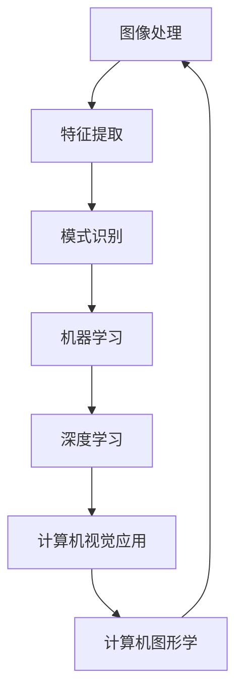

# Computer Vision原理与代码实例讲解

## 1. 背景介绍

### 1.1 问题的由来

计算机视觉(Computer Vision)是人工智能领域的一个重要分支,旨在使计算机能够像人类一样理解和解释数字图像或视频中的内容。随着数字图像和视频数据的快速增长,以及深度学习技术的飞速发展,计算机视觉在各个领域都有着广泛的应用前景,如自动驾驶、机器人视觉、人脸识别、医疗影像分析等。

在传统的计算机视觉系统中,研究人员需要手动设计特征提取算法和分类器,这种方法存在一些局限性,难以有效处理复杂的视觉任务。而近年来,基于深度学习的计算机视觉方法取得了巨大的进展,能够自动从大量数据中学习特征表示,并在许多视觉任务上达到甚至超过人类的性能水平。

### 1.2 研究现状

目前,计算机视觉领域的研究主要集中在以下几个方向:

1. **图像分类(Image Classification)**:将图像归类到预定义的类别中,如识别图像中的物体、场景等。
2. **目标检测(Object Detection)**:在图像中定位并识别出感兴趣的目标物体。
3. **语义分割(Semantic Segmentation)**:对图像中的每个像素进行分类,将图像分割成不同的语义区域。
4. **实例分割(Instance Segmentation)**:在语义分割的基础上,进一步区分同一类别中的不同实例。
5. **视频理解(Video Understanding)**:分析和理解视频序列中的内容,如行为识别、动作检测等。

在这些任务中,基于深度学习的方法已经取得了令人瞩目的成就,如卷积神经网络(CNN)在图像分类和目标检测任务中的应用,循环神经网络(RNN)在视频理解任务中的应用等。

### 1.3 研究意义

计算机视觉技术的发展对于推动人工智能的进步具有重要意义,同时也为许多实际应用场景带来了巨大的变革。例如:

1. **自动驾驶**:通过计算机视觉技术实现对道路、车辆、行人等目标的检测和识别,是实现自动驾驶的关键技术之一。
2. **机器人视觉**:赋予机器人视觉能力,使其能够感知和理解环境,实现更智能化的操作。
3. **人脸识别**:在安防、身份验证等领域有广泛应用。
4. **医疗影像分析**:辅助医生诊断疾病,提高诊断的准确性和效率。
5. **无人机航拍**:用于环境监测、测绘等领域。

随着计算机视觉技术的不断发展,它将为更多领域带来革命性的变化,推动人工智能技术的落地应用。

### 1.4 本文结构

本文将全面介绍计算机视觉的核心原理和代码实现,内容包括:

1. 核心概念与联系
2. 核心算法原理及具体操作步骤
3. 数学模型和公式详细讲解与案例分析
4. 项目实践:代码实例和详细解释说明
5. 实际应用场景
6. 工具和资源推荐
7. 总结:未来发展趋势与挑战
8. 附录:常见问题与解答

## 2. 核心概念与联系

计算机视觉涉及多个核心概念,它们相互关联、相互影响,构成了计算机视觉的理论基础。这些核心概念包括:

1. **图像处理(Image Processing)**:对原始图像进行预处理,如降噪、增强对比度等,为后续高层次的视觉任务做准备。

2. **特征提取(Feature Extraction)**:从图像中提取有意义的特征,如边缘、角点、纹理等,这是计算机视觉系统的关键步骤之一。

3. **模式识别(Pattern Recognition)**:基于提取的特征,将图像中的模式与已知模式进行匹配和识别。

4. **机器学习(Machine Learning)**:通过学习大量数据,自动发现数据中的模式和规律,用于解决计算机视觉任务。

5. **深度学习(Deep Learning)**:一种基于人工神经网络的机器学习方法,在计算机视觉领域取得了突破性的进展。

6. **计算机图形学(Computer Graphics)**:研究如何在计算机上生成和操作图像,与计算机视觉形成互补关系。

这些核心概念相互关联、相互影响,共同构建了计算机视觉的理论基础和技术体系。下面的 Mermaid 流程图展示了它们之间的关系:

## 3. 核心算法原理 & 具体操作步骤

### 3.1 算法原理概述

计算机视觉任务通常包括以下几个核心步骤:

1. **图像预处理**:对原始图像进行预处理,如降噪、增强对比度等,以提高图像质量和后续处理的效果。

2. **特征提取**:从预处理后的图像中提取有意义的特征,如边缘、角点、纹理等,这是计算机视觉系统的关键步骤之一。传统方法包括 SIFT、HOG 等手工设计的特征提取算法,而深度学习方法则能够自动学习特征表示。

3. **特征编码**:将提取的特征进行编码,以便后续的分类或回归任务。常用的编码方法包括 BOW(Bag of Words)、VLAD(Vector of Locally Aggregated Descriptors)等。

4. **模式识别**:基于编码后的特征,将图像中的模式与已知模式进行匹配和识别。常用的模式识别算法包括支持向量机(SVM)、随机森林等。

5. **后处理**:对识别结果进行后处理,如平滑、剪裁等,以提高结果的准确性和可靠性。

在深度学习时代,上述步骤被统一到端到端的神经网络模型中,如卷积神经网络(CNN)、循环神经网络(RNN)等,能够自动从数据中学习特征表示和模式,极大地提高了计算机视觉系统的性能。

### 3.2 算法步骤详解

以图像分类任务为例,介绍基于深度学习的计算机视觉算法的具体步骤:

1. **数据准备**:收集并准备用于训练的图像数据集,通常需要对图像进行预处理,如调整大小、归一化等。

2. **模型设计**:设计深度神经网络模型的架构,常用的模型包括 AlexNet、VGGNet、ResNet、Inception 等。

3. **模型训练**:使用准备好的数据集对神经网络模型进行训练,通过反向传播算法不断调整模型参数,使模型在训练集上达到较高的分类准确率。

4. **模型评估**:在独立的测试集上评估模型的性能,常用的评估指标包括准确率(Accuracy)、精确率(Precision)、召回率(Recall)、F1 分数等。

5. **模型优化**:根据评估结果,通过调整超参数、数据增强、模型结构等方式优化模型,以提高其性能。

6. **模型部署**:将训练好的模型部署到实际的应用系统中,对新的输入图像进行分类预测。

在实际应用中,还需要考虑模型的泛化能力、鲁棒性、效率等因素,并根据具体任务和场景进行调整和优化。

### 3.3 算法优缺点

基于深度学习的计算机视觉算法具有以下优点:

1. **自动特征学习**:能够自动从数据中学习特征表示,不需要手动设计特征提取算法。
2. **端到端训练**:将特征提取、模式识别等步骤统一到一个神经网络模型中,实现端到端的训练。
3. **高精度**:在许多视觉任务上,深度学习模型能够达到甚至超过人类的性能水平。
4. **泛化能力强**:通过在大规模数据集上训练,模型具有较强的泛化能力,能够适应不同的场景和条件。

但同时也存在一些缺点和挑战:

1. **需要大量数据**:训练深度神经网络模型需要大量的标注数据,数据的质量和多样性直接影响模型的性能。
2. **黑盒操作**:神经网络模型内部的工作机理往往难以解释,存在"黑盒"问题。
3. **计算资源需求高**:训练深度学习模型需要大量的计算资源,如GPU等。
4. **对抗样本问题**:深度学习模型容易被对抗样本攻击,导致错误的预测结果。
5. **泛化能力有限**:虽然深度学习模型具有较强的泛化能力,但在一些极端情况下仍可能出现失效。

### 3.4 算法应用领域

基于深度学习的计算机视觉算法在以下领域有广泛的应用:

1. **图像分类**:将图像归类到预定义的类别中,如识别图像中的物体、场景等。
2. **目标检测**:在图像中定位并识别出感兴趣的目标物体。
3. **语义分割**:对图像中的每个像素进行分类,将图像分割成不同的语义区域。
4. **实例分割**:在语义分割的基础上,进一步区分同一类别中的不同实例。
5. **视频理解**:分析和理解视频序列中的内容,如行为识别、动作检测等。
6. **人脸识别**:从图像或视频中识别出人脸,并进行身份验证。
7. **医疗影像分析**:辅助医生诊断疾病,如肺部CT图像分析、病理切片分析等。
8. **无人驾驶**:通过计算机视觉技术实现对道路、车辆、行人等目标的检测和识别。
9. **机器人视觉**:赋予机器人视觉能力,使其能够感知和理解环境,实现更智能化的操作。

随着计算机视觉技术的不断发展,它将为更多领域带来革命性的变化,推动人工智能技术的落地应用。

## 4. 数学模型和公式 & 详细讲解 & 举例说明

### 4.1 数学模型构建

在计算机视觉任务中,通常需要构建数学模型来描述和解决相关问题。以图像分类任务为例,我们可以将其建模为一个监督学习问题,目标是学习一个映射函数 $f$,将输入图像 $x$ 映射到相应的类别标签 $y$:

$$f(x) = y$$

其中,输入 $x$ 是一个高维的向量,表示图像的像素值;输出 $y$ 是一个离散的类别标签。

在深度学习框架下,我们使用神经网络来表示映射函数 $f$。神经网络由多层神经元组成,每一层通过对上一层的输出进行线性变换和非线性激活,实现特征的提取和表示。

对于图像分类任务,常用的神经网络模型是卷积神经网络(CNN),它能够有效地捕获图像的局部特征和空间结构信息。CNN 由多个卷积层、池化层和全连接层组成,其中卷积层和池化层用于提取特征,全连接层用于分类预测。

设 $X$ 表示输入图像,经过多层卷积和池化操作后,得到特征映射 $F$:

$$F = \phi(X; W_c, b_c)$$

其中,$ \phi $ 表示卷积和池化操作的组合函数,$ W_c $ 和 $ b_c $ 分别表示卷积层的权重和偏置参数。

然后,特征映射 $F$ 被馈送到全连接层,经过线性变换和非线性激活,得到分类预测结果 $y$:

$$y = \sigma(W_f F + b_f)$$

其中,$ \sigma $ 表示非线性激活函数(如 Softmax),$ W_f $ 和 $ b_f $ 分别表示全连接层的权重和偏置参数。

在训练过程中,我们使用损失函数(如交叉熵损失)来衡量预测结果与真实标签之间的