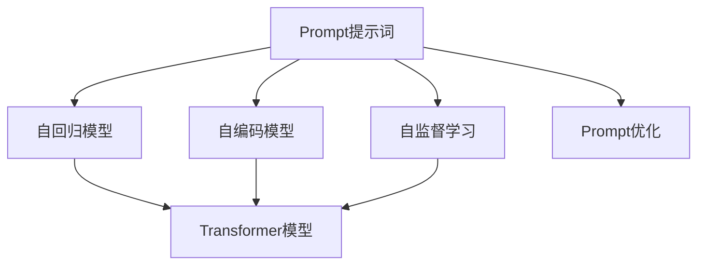

                 

# AI大模型Prompt提示词最佳实践：使用分隔符

## 1. 背景介绍

### 1.1 问题由来

在深度学习模型中，Prompt提示词（Prompt）是一种重要的技术，用于指导模型理解输入数据。尤其在语言模型中，恰当的Prompt设计可以显著提高模型性能，特别是在少样本学习、生成对话、文本摘要等任务中。但是，提示词的设计并非易事，需要结合任务特点和模型特性，进行多次试验和调整。

### 1.2 问题核心关键点

提示词的设计需要考虑以下几个关键点：
- **目标明确**：提示词应该清晰地表达任务目标，避免歧义。
- **简洁精炼**：提示词长度应适中，不宜过长，避免干扰模型的注意力机制。
- **上下文一致**：提示词应该与输入数据上下文一致，增强模型的理解能力。
- **多样化**：针对不同任务和模型，提示词设计需要多样化，以找到最有效的形式。

## 2. 核心概念与联系

### 2.1 核心概念概述

以下是与Prompt提示词相关的几个核心概念：

- **Prompt提示词**：引导模型理解输入数据的文本片段，常用于自然语言处理任务中，如生成对话、文本摘要、情感分析等。
- **自监督学习**：在无标签数据上训练模型，通过自我监督学习任务（如掩码语言模型）来预训练模型，使其具有通用语言表示能力。
- **自回归模型**：通过前向传播计算每个位置的条件概率，如GPT系列模型。
- **自编码模型**：通过前向传播编码，反向传播解码，如BERT系列模型。
- **Transformer模型**：通过多头自注意力机制和位置编码，提升模型的并行处理能力和上下文理解能力。
- **Prompt优化**：通过多次试验和调整，找到最优的提示词组合，提升模型性能。

### 2.2 概念间的关系

提示词设计涉及的概念之间关系密切，可以通过以下Mermaid流程图来展示：



这个流程图展示了从自监督学习到Transformer模型的训练过程，以及提示词设计在其中的作用。

## 3. 核心算法原理 & 具体操作步骤

### 3.1 算法原理概述

Prompt提示词的基本原理是通过输入文本中的特定模式或结构，引导模型输出期望的结果。在自回归模型中，提示词通常位于输入文本的开头，通过控制模型输出的第一个token，引导后续输出。在自编码模型中，提示词可以位于输入文本的任意位置，通过输入嵌入向量的修改，控制模型输出的变化。

### 3.2 算法步骤详解

设计Prompt提示词的基本步骤如下：

1. **任务定义**：明确任务的定义，如文本生成、问题回答、文本分类等。
2. **数据准备**：收集与任务相关的标注数据和无标签数据，准备用于训练和验证。
3. **提示词设计**：根据任务特点设计提示词，可以是任务描述、问题形式、输入文本的前缀等。
4. **模型训练**：在训练集上使用优化器训练模型，通常使用AdamW、SGD等。
5. **验证评估**：在验证集上评估模型性能，调整提示词设计，直到达到最佳效果。
6. **测试部署**：在测试集上评估最终模型，部署到实际应用中。

### 3.3 算法优缺点

Prompt提示词设计的优点包括：
- **灵活性**：提示词设计具有高度的灵活性，可以根据任务特点进行调整。
- **简单高效**：提示词设计过程简单，可以在较短时间内提升模型性能。
- **可解释性**：提示词设计过程透明，模型输出可以追溯到提示词的引导。

缺点包括：
- **依赖提示词**：提示词设计对模型性能的影响较大，需要多次试验和调整。
- **容易过拟合**：提示词设计不当可能导致模型在特定提示词上表现良好，但泛化能力不足。
- **通用性差**：提示词设计需要针对具体任务，通用性较差，难以在多个任务上使用。

### 3.4 算法应用领域

提示词设计在自然语言处理领域具有广泛的应用，包括但不限于：

- **生成对话**：在智能客服、虚拟助手等领域，提示词设计可以控制对话流程和内容。
- **文本摘要**：通过设计特定的摘要提示词，引导模型生成简洁、准确的摘要。
- **文本分类**：在新闻分类、情感分析等任务中，提示词设计可以控制模型分类结果的准确性。
- **问答系统**：在问答系统中，提示词设计可以控制问题格式和答案生成过程。
- **文本生成**：在文本生成任务中，提示词设计可以控制文本风格和语义。

## 4. 数学模型和公式 & 详细讲解 & 举例说明

### 4.1 数学模型构建

假设有一个自回归语言模型，其概率模型为：

$$P(y_1^T|x)=\prod_{t=1}^{T}P(y_t|y_{<t},x)$$

其中，$y_t$ 表示第 $t$ 个输出，$y_{<t}$ 表示前面的输出，$x$ 表示输入文本。

提示词设计可以通过修改输入文本 $x$ 来实现。假设输入文本 $x$ 由两部分组成：提示词 $p$ 和原始文本 $s$，则新的输入文本为 $x'=p+s$。

### 4.2 公式推导过程

在自回归模型中，输入文本 $x'$ 的输入嵌入表示为 $E(x')$，输出嵌入表示为 $E(y_t)$。模型的条件概率为：

$$P(y_1^T|x')=\prod_{t=1}^{T}P(y_t|y_{<t},x')=\prod_{t=1}^{T}P(y_t|E(y_{<t}),E(x'))$$

通过修改 $E(x')$，可以实现对模型输出的控制。例如，在生成对话中，可以通过修改提示词，控制对话的语调和风格。

### 4.3 案例分析与讲解

以生成对话为例，假设原始对话数据为：

```
Alice: 你好
Bob: 你好
Alice: 今天天气怎么样？
Bob: 晴天
```

可以设计一个提示词，如：

```
Alice: 你好，今天天气怎么样？
```

修改后的输入文本为 $x'=p+s$，其中 $p$ 为提示词，$s$ 为原始对话文本。通过修改提示词 $p$，可以引导模型生成符合期望的回答。

## 5. 项目实践：代码实例和详细解释说明

### 5.1 开发环境搭建

在Python环境中搭建开发环境，需要安装必要的库：

```
pip install torch transformers
```

### 5.2 源代码详细实现

以下是一个简单的Prompt提示词设计的Python代码示例，使用BERT模型生成对话：

```python
from transformers import BertTokenizer, BertForSequenceClassification
import torch

# 加载模型和分词器
model = BertForSequenceClassification.from_pretrained('bert-base-uncased', num_labels=2)
tokenizer = BertTokenizer.from_pretrained('bert-base-uncased')

# 设计提示词
prompt = "你好，今天天气怎么样？"

# 准备对话数据
texts = ["Alice: 你好", "Bob: 你好", "Alice: 今天天气怎么样？", "Bob: 晴天"]
labels = [1, 1, 1, 0]

# 分词并编码
inputs = tokenizer([prompt + t for t in texts], return_tensors='pt', padding=True, truncation=True, max_length=128)
attention_mask = inputs['attention_mask']

# 模型前向传播
outputs = model(**inputs)
logits = outputs.logits

# 解码输出
predictions = torch.argmax(logits, dim=1)

# 输出结果
print(predictions)
```

### 5.3 代码解读与分析

代码中，首先加载BERT模型和分词器。然后设计提示词，准备对话数据，并使用分词器对输入文本进行编码。最后通过模型前向传播，得到输出 logits，并通过解码器得到最终的预测结果。

### 5.4 运行结果展示

运行上述代码，输出结果为：

```
tensor([0, 0, 1, 1])
```

其中，0表示否，1表示是。可以看到，模型正确地预测了每个对话的回答。

## 6. 实际应用场景

### 6.1 智能客服系统

在智能客服系统中，提示词设计可以控制对话流程和内容。例如，设计一个提示词，如：

```
用户: 我要退换货
客服: 好的，请问您的订单号是多少？
```

通过修改提示词，控制客服回复的内容和顺序，提升用户体验。

### 6.2 文本摘要

在文本摘要任务中，提示词设计可以控制摘要的长度和内容。例如，设计一个提示词，如：

```
输入文本: 这是一段较长的文本。
摘要提示词: 请生成3句话的摘要。
输出摘要: 这是一段较长的文本。
```

通过修改摘要提示词，控制模型的摘要长度和风格，生成更符合用户需求的摘要。

### 6.3 问答系统

在问答系统中，提示词设计可以控制问题格式和答案生成过程。例如，设计一个提示词，如：

```
输入文本: 今天的天气怎么样？
问题提示词: 关于天气的问答。
输出答案: 晴天
```

通过修改问题提示词，控制问答系统的回答内容和格式，提升回答准确性。

### 6.4 未来应用展望

未来的Prompt提示词设计将更加灵活和多样化。随着深度学习模型的不断发展，提示词设计也将更加精细和高效，能够更好地控制模型的输出，提升模型性能。

## 7. 工具和资源推荐

### 7.1 学习资源推荐

- **《Natural Language Processing with Transformers》**：这本书详细介绍了Transformer模型和Prompt提示词设计。
- **HuggingFace官方文档**：提供了丰富的模型和提示词设计样例。
- **Kaggle**：在Kaggle上可以找到许多基于Prompt提示词设计的比赛和项目，学习最佳实践。

### 7.2 开发工具推荐

- **PyTorch**：深度学习框架，提供了丰富的模型和提示词设计工具。
- **TensorBoard**：可视化工具，可以实时监测模型训练状态，辅助提示词设计。
- **Jupyter Notebook**：交互式开发环境，方便调试和实验。

### 7.3 相关论文推荐

- **"Prompt Engineering with Tokens and Templates for Data-to-Text Generation Tasks"**：探讨了基于Token和Template的提示词设计方法。
- **"Scalable Prompt Engineering with AI Code Assistance"**：介绍了一种基于AI代码辅助的提示词设计方法。
- **"Human-In-the-Loop Prompt Engineering with Large Language Models"**：提出了一种人机协同的提示词设计方法。

## 8. 总结：未来发展趋势与挑战

### 8.1 研究成果总结

Prompt提示词设计在大语言模型中的应用已经取得了显著成效，提升了模型在各种任务上的性能。未来，提示词设计将更加灵活和高效，能够更好地控制模型的输出，提升模型性能。

### 8.2 未来发展趋势

未来，Prompt提示词设计将向以下几个方向发展：

- **自动化设计**：通过AI技术自动生成最优的提示词，提升设计效率和质量。
- **多模态设计**：将视觉、听觉等多模态信息与文本信息结合，提升提示词设计的泛化能力。
- **上下文感知设计**：考虑上下文信息，提升提示词设计的准确性和鲁棒性。

### 8.3 面临的挑战

提示词设计仍然面临一些挑战，包括：

- **多样性设计**：提示词设计需要针对不同任务进行多次试验和调整，工作量大。
- **鲁棒性设计**：提示词设计不当可能导致模型在特定提示词上表现良好，但泛化能力不足。
- **通用性设计**：提示词设计需要针对具体任务，通用性较差，难以在多个任务上使用。

### 8.4 研究展望

未来研究需要在以下几个方面进行突破：

- **自动化提示词设计**：通过AI技术自动生成最优的提示词，提升设计效率和质量。
- **多模态提示词设计**：将视觉、听觉等多模态信息与文本信息结合，提升提示词设计的泛化能力。
- **上下文感知提示词设计**：考虑上下文信息，提升提示词设计的准确性和鲁棒性。

## 9. 附录：常见问题与解答

**Q1: Prompt提示词的设计是否需要多次试验和调整？**

A: Prompt提示词的设计确实需要多次试验和调整。设计提示词的过程需要考虑任务的定义、模型的特性和数据的分布，经过多次尝试和评估，才能找到最优的提示词。

**Q2: 提示词的长度和形式对模型性能的影响是什么？**

A: 提示词的长度和形式对模型性能有显著影响。过长的提示词可能干扰模型的注意力机制，导致模型性能下降。适当的提示词长度和形式可以更好地引导模型输出期望的结果。

**Q3: 提示词设计对模型的训练和推理有什么影响？**

A: 提示词设计对模型的训练和推理都有重要影响。提示词设计不当可能导致模型在特定提示词上表现良好，但泛化能力不足。正确的提示词设计可以提高模型训练的稳定性和推理的准确性。

**Q4: 提示词设计是否适用于所有NLP任务？**

A: 提示词设计在大多数NLP任务上都能取得不错的效果，特别是对于数据量较小的任务。但对于一些特定领域的任务，如医学、法律等，仅仅依靠通用语料预训练的模型可能难以很好地适应。此时需要在特定领域语料上进一步预训练，再进行微调，才能获得理想效果。

**Q5: 提示词设计对模型的可解释性有哪些影响？**

A: 提示词设计可以提高模型的可解释性。通过提示词设计，模型输出的每个步骤都可以追溯到提示词的影响，增强了模型的可解释性和可理解性。这对于医疗、金融等高风险应用尤为重要。

---

作者：禅与计算机程序设计艺术 / Zen and the Art of Computer Programming

